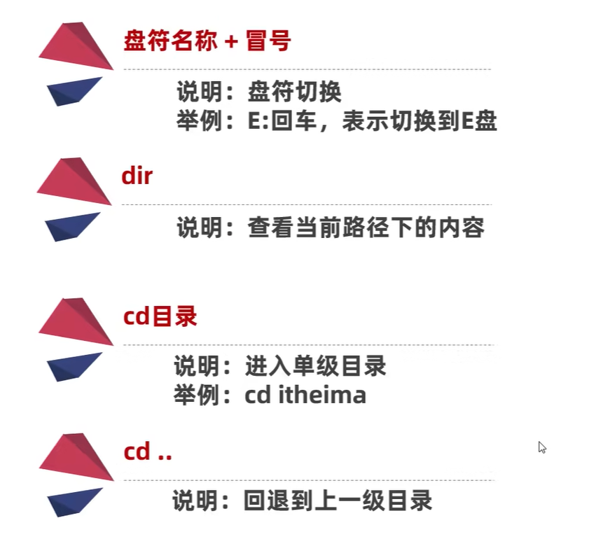
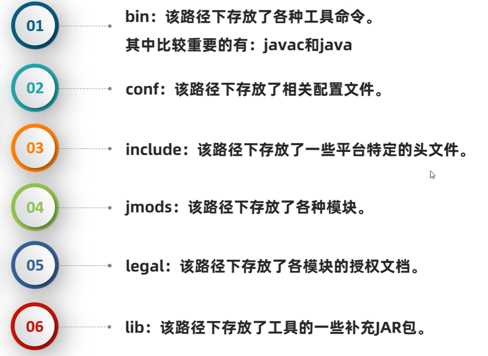
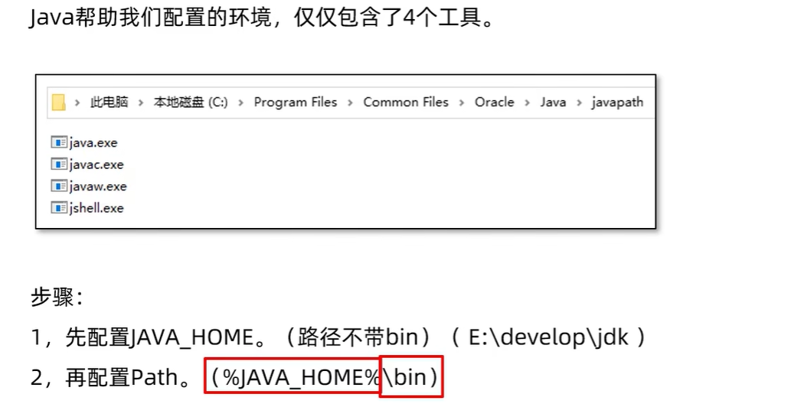
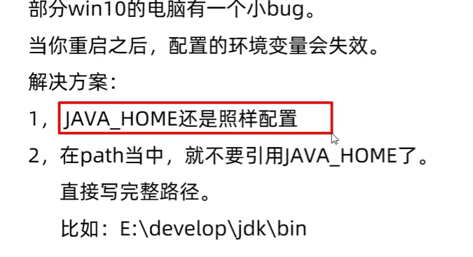
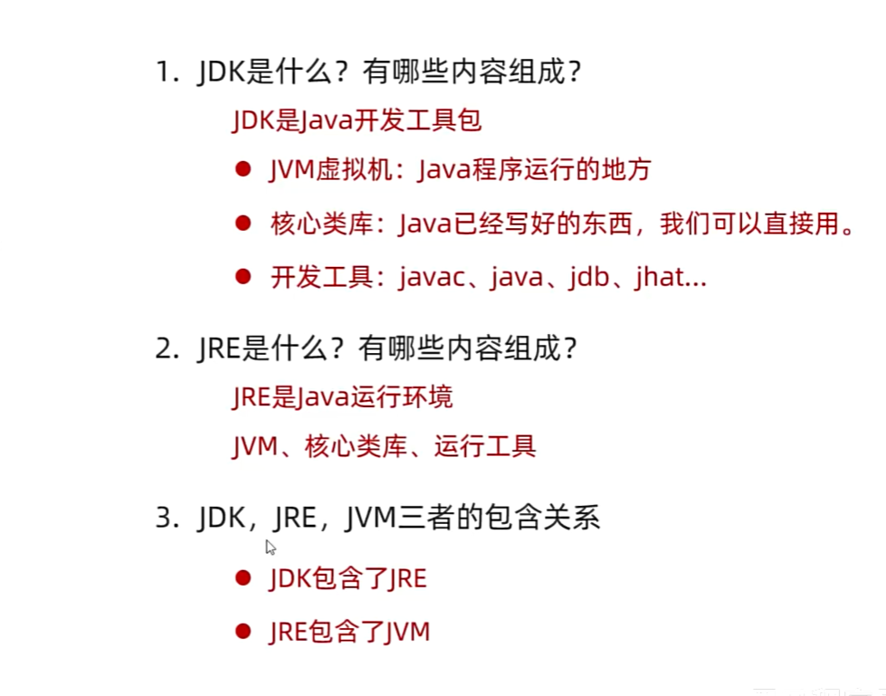

# Typora使用

# JavaSE基础

## 介绍

### 内容

一门面向对象程序设计的语言

特点:简单、面向对象、安全、跨平台性(基于JVM)、支持多线程、分布性

### JDK工具

Java编译器(javac.exe)、Java运行器(java.exe)、Java文档生成工具(javadoc.exe)、Java打包工具(jar.exe)

### 常用CMD命令

  

### 下载和安装

- 通过官网获取
-  http://www.oracle.com
-  建议下载jdk8、jdk11、jdk17(长期支持使用的 并且稳定)

>针对`不同系统`下载`不同的安装包`

#### JDK安装目录

#### Java编写

~~~java
修饰符 class 类名{
    程序代码
}
~~~

第一个Java程序

~~~java
public class HelloWorld{
    public static void main(String[] args){
        System.out.println("Hello World!");
    }
}
~~~

>`编写程序的时候注意修饰符注明 每一个程序都是以一个类开始 类名要做到见名知意`
>
>`启动类书写:public static void main(String[] args) args是在运行时的参数 程序运行时内容会添加至里面`

#### 环境变量配置

系统环境变量:path、classpath

配置path变量的目的:可以在任意目录下都打开指定的软件

步骤

- ​     

  - 打开此电脑

  - 点击系统

  - 系统环境变量

  - 环境变量中配置 Path路径下配置jdk

  - E:\Java\jdk17

  - 随即它的bin文件 运行时主要通过bin进行编译

  - %JAVA_HOME%\bin 

  - %JAVA_HOME%\jre\bin

  - 如果存在多个版本jdk可配置一个脚本文件 E:\Java\scripts 需要切换时通过输入jdk＋版本即可

  - ~~~
    其中的脚本展示 以bat结尾
    @echo off
    set JAVA_HOME=E:\Java\jdk11
    set Path=%JAVA_HOME%\bin;%Path%
    echo  Java 11 activated.
    ~~~

  - ​

  - 如果无法成功配置变量还可在本机中配置JAVA_HOME   E:\Java\jdk17
  - 
  - 

#### JRE和JDK

定源码特定获取