# Java面试知识

## 集合篇

### 基础知识

介绍：Java集合，也叫容器，主要由两大接口派生

1.Collection接口，主要用于存放单一元素，其下有三个主要子接口

1）List 2）Set 3）Queue

2.Map接口，主要用于存放键值对

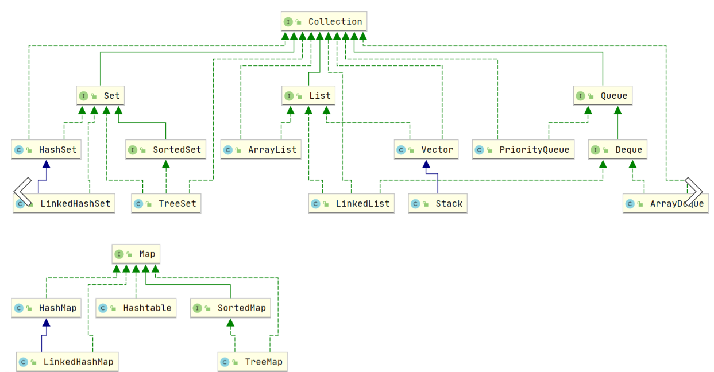

List、Set、Queue、Map区别

1.List：存储元素是有序的、可重复的

2.Set：存储元素不可重复

3.Queue（实现排队功能的叫号机）：按特定的排队规则来确定先后顺序，存储的元素是有序的、可重复的

4.Map：使用键值对的形式进行存储元素（key-value），通过key来查找相对应的value值，类似y=f(x)，x为key值，y为value值，key是无序的、不可重复的，value是无序的、可重复的，每个键最多映射到一个值

### List基础知识

ArrayList和Array(数组)的区别

ArrayList内部基于动态数组实现，相比于Array（静态数组）更加灵活

1.ArrayList可以根据元素实际存储进行动态扩容或缩容，而Array创建的时候则固定了长度

2.ArrayList允许使用泛型确保类型安全，Array则不可以

3.ArrayList中只能存储对象。对于需要的基本类型，需要使用对应的包装类型进行声明(Integer、Double等)。Array可以直接存储基本类型数据，也可以存储对象

4.ArrayList常见的遍历、删除等操作都具备，同时提供了对应的API操作方法，如：add()，remove()，相比于Array就没有，但是ArrayList不能够动态添加、删除元素

5.ArrayList创建时不能指定大小，而Array创建时必须指定

如下代码

Array：

~~~java
 // 初始化一个 String 类型的数组
 String[] stringArr = new String[]{"hello", "world", "!"};
 // 修改数组元素的值
 stringArr[0] = "goodbye";
 System.out.println(Arrays.toString(stringArr));// [goodbye, world, !]
 // 删除数组中的元素，需要手动移动后面的元素
 for (int i = 0; i < stringArr.length - 1; i++) {
     stringArr[i] = stringArr[i + 1];
 }
 stringArr[stringArr.length - 1] = null;
 System.out.println(Arrays.toString(stringArr));// [world, !, null]
~~~

ArrayList：

~~~java
// 初始化一个 String 类型的 ArrayList
 ArrayList<String> stringList = new ArrayList<>(Arrays.asList("hello", "world", "!"));
// 添加元素到 ArrayList 中
 stringList.add("goodbye");
 System.out.println(stringList);// [hello, world, !, goodbye]
 // 修改 ArrayList 中的元素
 stringList.set(0, "hi");
 System.out.println(stringList);// [hi, world, !, goodbye]
 // 删除 ArrayList 中的元素
 stringList.remove(0);
 System.out.println(stringList); // [world, !, goodbye]
~~~

ArrayList和Vector区别：

1.ArrayList是List的主要实现类，同时也是最常用的实现类，底层是Object[]存储，适用于频繁的查找，但是线程不安全

2.Vector是List的古老实现类，底层也是Object[]存储，但是相对于ArrayList是线程安全的

为什么ArrayList线程不安全，而Vector线程安全

Vector中绝大多数方法API操作都加了synchronized关键字修饰。所以在调用方法时，它们会串行执行(一次只有一个线程执行)，从而避免数据不一致的问题。但在ArrayList中并没有使用synchronized修饰，这就导致了在多线程环境下，多个线程同时修改一个ArrayList实例时，会出现一个遍历，一个删除，导致并发修改异常(ConcurrentModificationException)或其他结果(数据覆盖、丢失)。

Vector的线程安全主要就是通过在方法级别加锁(粗粒度锁)实现，确保了原子性，但是带来性能的损耗

Vector与Stack区别：

1.两者都是线程安全，都是使用synchronized关键字进行同步处理

2.Stack继承自Vector，一个后进先出的栈，而Vector是一个列表

Vector和Stack虽然可以解决并发问题，但是性能消耗较大，现在大多使用ConcurrentHashMap、CopyOnWriteArrayList或者手动实现线程安全

ArrayList可以添加null值吗？

ArrayList可以存储任何类型的对象，包括null值。null在java中是一个字面量，表示没有对象或空引用，当你创建对象或者基本类型时没有赋值的情况下，它都会自动赋值过去，但是为什么可以添加到ArrayList中呢，主要因为当创建集合时，而集合的底层又是Object[]数组，会存在槽位，但是此时槽位并没有数据或者元素，所以此时你并没有存储任何数据，而此时的null会自动赋值过去

**注意：在ArrayList最后不要添加null值，这样会导致需要进行判空处理容易导致空指针异常**

ArrayList插入和删除元素的时间复杂度

插入：

1.头部插入：O(n)，因为此时需要将所有元素都往后移动一个位置

2.尾部插入：当ArrayList未达到极限时，往列表末尾插入元素的时间复杂度为O(1)，因为此时只需要在尾部进行插入；但是当容量达到极限时，就需要执行一次O(n)操作将原数组复制到已扩容的数组，然后再进行O(1)次操作插入。但是真正意义上扩容不会频繁发生，此时便为**均摊时间复杂度O(1)**，均摊时间复杂度主要因为每次扩容它都会变得很大，因为扩容因子为1.5，到后面它将会变成一个几何级数，所以会是均摊时间复杂度

3.指定位置插入：需要将目标位置之后的所有元素进行向后移动一位，然后存入新元素，此时过程平均移动n/2个元素，因此时间复杂为O(n)

删除：

1.头部删除：所有元素都需要向前移动一位，所以此时是O(n)

2.尾部删除：位于末尾时，此时的时间复杂度为O(1)

3.指定位置删除：目标位置的后面所有元素均需向前移动填补空白，移动平均n/2个元素，所以此时时间复杂度为O(n)

~~~text
// ArrayList的底层数组大小为10，此时存储了7个元素
+---+---+---+---+---+---+---+---+---+---+
| 1 | 2 | 3 | 4 | 5 | 6 | 7 |   |   |   |
+---+---+---+---+---+---+---+---+---+---+
  0   1   2   3   4   5   6   7   8   9
// 在索引为1的位置插入一个元素8，该元素后面的所有元素都要向右移动一位
+---+---+---+---+---+---+---+---+---+---+
| 1 | 8 | 2 | 3 | 4 | 5 | 6 | 7 |   |   |
+---+---+---+---+---+---+---+---+---+---+
  0   1   2   3   4   5   6   7   8   9
// 删除索引为1的位置的元素，该元素后面的所有元素都要向左移动一位
+---+---+---+---+---+---+---+---+---+---+
| 1 | 2 | 3 | 4 | 5 | 6 | 7 |   |   |   |
+---+---+---+---+---+---+---+---+---+---+
  0   1   2   3   4   5   6   7   8   9
~~~

LinkedList插入和删除元素的时间复杂度

1.头部插入/删除：只需要修改结点的指针即可完成插入/删除操作，因此时间复杂度为O(1)

2.尾部插入/删除：只需要修改尾结点的指针即可完成插入/删除操作，因此时间复杂度为O(1)

3.指定位置插入/删除：需要先移动到指定位置，再修改指定结点的指针完成插入/删除，不过由于有头尾指针，可以从较近的指针出发，因此需要平均遍历n/4个元素，时间复杂为O(n)

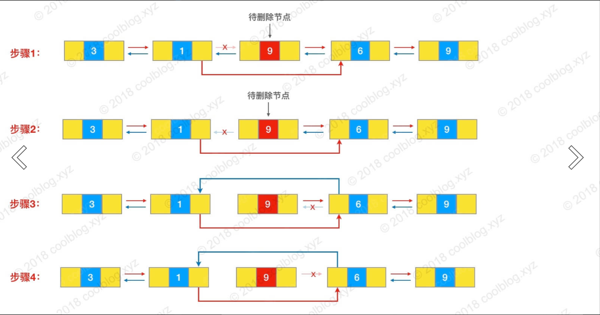

LinkedList为什么不能实现RandomAccess接口

RandomAccess接口是什么：

`RandomAccess`是一个**标记接口**（Marker Interface）

唯一目的是**标识那些支持快速（通常为常数时间 O(1)）随机访问的 List实现**。

随机访问即能够通过元素的整数索引（位置）进行直接访问，这个操作时间为O(1)

所以此时LinkedList不能够实现该接口，因为它的数据结构为链表，内存地址并不连续，只能通过指针去定位，此时它的操作为O(n)，不支持随机快速访问

这个接口主要被**通用算法**（尤其是 `java.util.Collections`工具类中的方法）用来在运行时**根据列表的不同类型自动选择性能最优的算法**

一个最经典的例子是 `Collections.binarySearch()`方法

**二分查找 (Binary Search)** 算法理论上时间复杂度是 O(log n)，但它需要频繁地通过中间索引 `(low + high) / 2`来访问元素。如果 `get(index)`操作本身是 O(n) 的，那么整个二分查找就会退化为 O(n log n)，这比直接顺序遍历（O(n)）还要慢

~~~java
public static <T> int binarySearch(List<? extends Comparable<? super T>> list, T key) {
    if (list instanceof RandomAccess) { // 检查！
        // 如果支持快速随机访问（如ArrayList），则使用基于索引的二分查找算法
        return indexedBinarySearch(list, key);
    } else {
        // 如果不支持快速随机访问（如LinkedList），则使用基于迭代器（ListIterator）的二分查找算法
        // 虽然也要折半，但用迭代器遍历比用get(index)一次次遍历要高效得多
        return iteratorBinarySearch(list, key);
    }
}
~~~

ArrayList与LinkedList区别

1.是否保证线程安全：两者都不是同步的，所以都是不保证线程安全的

2.底层数据结构：ArrayList使用的Object数组；LinkedList使用的是双向链表数据结构(jdk1.6之前为循环链表，jdk1.7取消循环)

3.插入和删除是否受元素位置的影响：

(1)ArrayList采用数组存储，所以插入和删除元素的时间复杂度受元素位置影响。在add方法中，如果是默认添加的话，它便直接添加到末尾，此时的操作为O(1)，但是如果是指定位置add，它的操作就会为O(n)，因为你指定的位置之后的位置都需要向后移动，指定删除也是一样的道理，它的查询也是O(1)

(2)LinkedList采用的是链表存储，所以在头尾插入或者删除元素并不受影响，add(),addFirst(),addLast()均为O(1)，但如果在指定位置的话就会是O(n)，此时需要先移动到该位置才可以，所以**查询也是O(n)**，主要因为的是它的内存地址是不连续的

4.是否支持快速随机访问：

LinkedList不支持随机高效访问，而ArrayList支持实现，主要是因为它能够直接通过索引拿到对应的元素对象，所以它也实现了RandomAccess接口

5.内存空间：

ArrayList的空间主要浪费在list列表结尾会预留一定的容量空间，而LinkedList空间则是每一个元素都需要比ArrayList消耗更多的空间，因为需要存直接后继和直接前驱以及数据

**双向链表和双循环链表**

双向链表：包含两个指针，一个prev指向前一个节点，一个next指向后一个节点

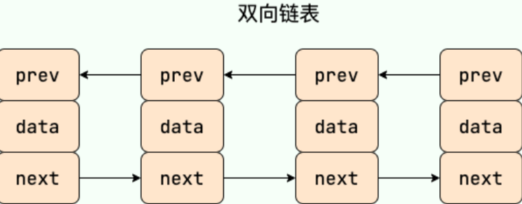

双向循环链表：

最后一个节点的next指向head，而head的prev指向最后一个节点，构成一个环

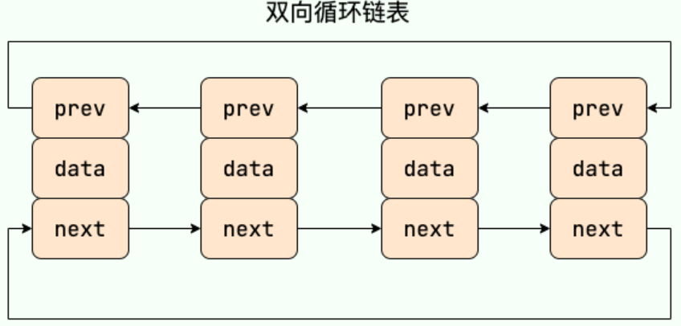

**集合中的fail-fast和fail-safe**

快速失败的思想即针对可能发生的异常进行提前表明故障并停止运行

在java.util包下的大部分集合是不支持线程安全的，所以为了能够提前发现并发操作导致线程安全风险，提出通过维护一个modCount记录修改次数，迭代期间通过比对预期修改次数expectedModCount和modCount是否一致来判断是否存在并发操作，从而实现快速失败，由此保证在避免在异常时执行非必要的复杂代码

示例：插入100个元素，一个线程迭代，一个线程删除，最终会抛出ConcurrentModificationException

~~~java
// 使用线程安全的 CopyOnWriteArrayList 避免 ConcurrentModificationException
List<Integer> list = new CopyOnWriteArrayList<>();
CountDownLatch countDownLatch = new CountDownLatch(2);

// 添加元素
for (int i = 0; i < 100; i++) {
    list.add(i);
}

Thread t1 = new Thread(() -> {
    // 迭代元素 (注意：Integer 是不可变的，这里的 i++ 不会修改 list 中的值)
    for (Integer i : list) {
        i++; // 这行代码实际上没有修改list中的元素
    }
    countDownLatch.countDown();
});

Thread t2 = new Thread(() -> {
    System.out.println("删除元素1");
    list.remove(Integer.valueOf(1)); // 使用 Integer.valueOf(1) 删除指定值的对象
    countDownLatch.countDown();
});

t1.start();
t2.start();
countDownLatch.await();
~~~

初始化插入100个元素，此时对应的modCount为100次，随后线程2在线程1迭代期间进行元素删除，此时modCount变为101次

线程1在foreach第二轮时便发现modCount为101次，与预期的expectedModCount不一致，即此时判定为操作异常，于是快速失败，抛出ConcurrentModificationException

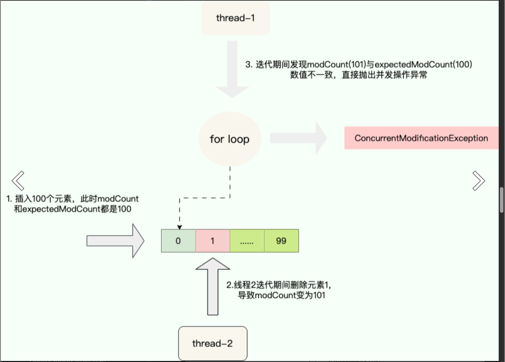

在foreach循环的底层去获取下一个next方法，其中内部有checkForComodification进行修改次数的比对

~~~java
 public E next() {
 			//检查是否存在并发修改
            checkForComodification();
            //......
            //返回下一个元素
            return (E) elementData[lastRet = i];
        }

final void checkForComodification() {
		//当前循环遍历次数和预期修改次数不一致时，就会抛出ConcurrentModificationException
            if (modCount != expectedModCount)
                throw new ConcurrentModificationException();
        }
~~~

安全失败：面对意外情况也能恢复并继续运行，这使得它特别适用于不确定或不稳定的环境

一般运用于并发环境，CopyOnWriteArrayList的实现便是安全失败，通过写时复制的思想保证在进行修改操作时复制出一份快照，基于快照完成添加或者删除操作后，将CopyOnWriteArrayList底层的数组引用指向这个新的数组空间，由此避免迭代时被并发修改所干预所导致并发操作安全问题，但是这种操作在遍历时无法获得实时结果

想获取实时结果可以有以下方案

1.使用显示同步锁 使用Collections.synchronizedList()包装一个普通的ArrayList，然后迭代时对整个迭代过程加锁

~~~java
import java.util.*;

public class RealTimeIterationExample {
    // 1. 创建一个同步的List
    private static final List<String> SYNC_LIST = Collections.synchronizedList(new ArrayList<>());

    public static void main(String[] args) {
        // 启动一个线程不断修改列表
        new Thread(() -> {
            int count = 0;
            while (true) {
                try {
                    Thread.sleep(500);
                } catch (InterruptedException e) {
                    e.printStackTrace();
                }
                // 修改时自动有锁保护（Collections.synchronizedList保证的）
                SYNC_LIST.add("Item-" + count++);
                System.out.println("Added new element.");
            }
        }).start();

        // 主线程进行迭代，必须手动同步！
        try {
            Thread.sleep(1000); // 等待一些元素被添加
            while (true) {
                // 2. 【关键】迭代时必须显式同步！
                synchronized (SYNC_LIST) {
                    System.out.println("\n--- Starting iteration ---");
                    Iterator<String> it = SYNC_LIST.iterator();
                    while (it.hasNext()) {
                        String item = it.next();
                        System.out.println(item);
                        // 在迭代过程中，模拟一些耗时操作
                        // 此时列表被锁住，其他线程无法修改，看到的必然是实时最新状态
                        Thread.sleep(100); 
                    }
                    System.out.println("--- Iteration ended ---\n");
                }
                // 释放锁，允许其他线程修改
                Thread.sleep(2000); 
            }
        } catch (InterruptedException e) {
            e.printStackTrace();
        }
    }
}
~~~

但是它会存在性能问题，在长迭代期间，会完全阻塞所有想进行的写操作(add,remove)的线程，降低并发吞吐量

同时可能会出现死锁

2.使用ConcurrentHashMap(列表数据唯一即可)

使用其keySet()或values()，它的迭代器是弱一致性，所以它可以容忍并发修改，并尽可能反映迭代器创建时的状态，甚至可能反映之后的某些修改，它不是强实时，但是比CopyWriteArrayList的快照更接近实时

~~~java
import java.util.concurrent.ConcurrentHashMap;

public class ConcurrentHashMapExample {
    private static final ConcurrentHashMap<String, Boolean> MAP = new ConcurrentHashMap<>();

    public static void main(String[] args) {
        // 写线程
        new Thread(() -> {
            int count = 0;
            while (true) {
                try {
                    Thread.sleep(500);
                } catch (InterruptedException e) {
                    e.printStackTrace();
                }
                MAP.put("Item-" + count++, true);
                System.out.println("Added new element.");
            }
        }).start();

        // 读线程 - 使用迭代器
        try {
            Thread.sleep(1000);
            while (true) {
                System.out.println("\n--- Starting iteration ---");
                // 这里的迭代器是弱一致性的
                for (String key : MAP.keySet()) {
                    System.out.println(key);
                    Thread.sleep(100);
                }
                System.out.println("--- Iteration ended ---\n");
                Thread.sleep(2000);
            }
        } catch (InterruptedException e) {
            e.printStackTrace();
        }
    }
}
~~~

无法保证迭代器能看到它创建之后的所有修改，但它看到的也不是一个完全的快照

求元素唯一，且通常用于存储键值对，而不是简单的列表。

3.使用Lock锁

~~~java
// 伪代码示例
ReentrantLock lock = new ReentrantLock();
List<String> list = new ArrayList<>();

// 写操作
lock.lock();
try {
    list.add("something");
} finally {
    lock.unlock();
}

// 读操作（迭代）
lock.lock(); // 阻塞直到获取锁
try {
    for (String item : list) {
        // 实时遍历
    }
} finally {
    lock.unlock();
}
~~~

和方案一差不多

所以总结对于并发修改操作，如果可以允许轻微延时，可以选择CopyOnWriteArrayList

~~~java
public boolean add(E e) {
        final ReentrantLock lock = this.lock;
        lock.lock();
        try {
        	//获取原有数组
            Object[] elements = getArray();
            int len = elements.length;
            //基于原有数组复制出一份内存快照
            Object[] newElements = Arrays.copyOf(elements, len + 1);
            //进行添加操作
            newElements[len] = e;
            //array指向新的数组
            setArray(newElements);
            return true;
        } finally {
            lock.unlock();
        }
    }
~~~

它的主要实现通过getArray获取数组引用然后通过copyOf得到快照，基于快照进行操作，完成后修改底层array变量指向的引用地址由此完成写时复制

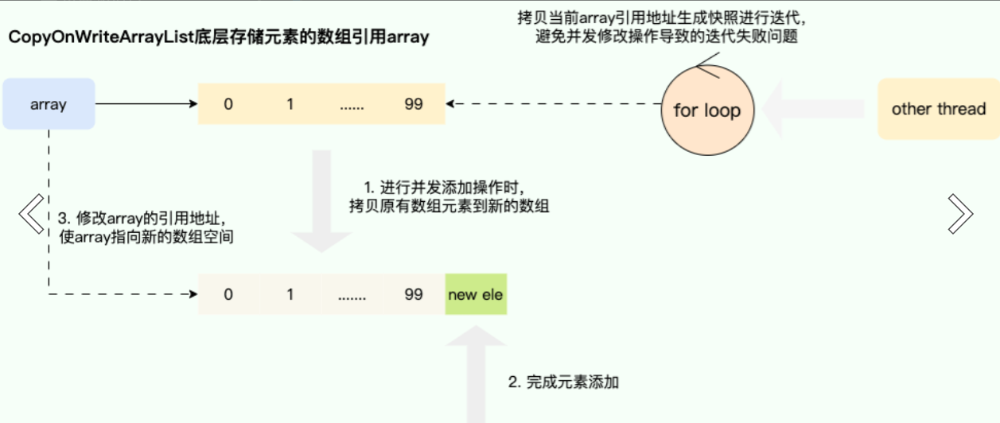

### Set基础知识

**Set集合主要特征：**

1.无序性：无法通过索引访问元素

2.唯一性：每个元素都是唯一的，集合不允许重复的元素

3.哈希实现：HashSet通过哈希表实现

4.线程不安全：在多线程环境中，需要同步处理

5.集合运算：支持数学上的集合运算，如并集、交集和差集

**两个重要的排序接口：**

1.Comparable 2.Comparator

这两个接口均可以实现类对象之间的大小比较、排序

实现Comparable接口(java.lang包)：需要重写compareTo(Object object)方法进行排序等

实现Comparator接口(java.util包)：重写compare(Object object1,Object object2)方法进行排序等

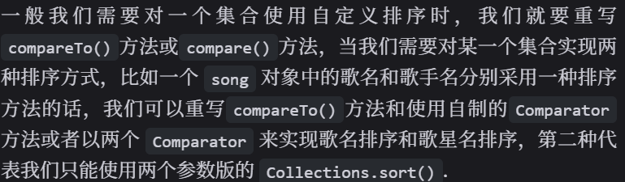

**Comparator定制排序：**

~~~java
ArrayList<Integer> arrayList = new ArrayList<Integer>();
arrayList.add(-1);
arrayList.add(3);
arrayList.add(3);
arrayList.add(-5);
arrayList.add(7);
arrayList.add(4);
arrayList.add(-9);
arrayList.add(-7);
System.out.println("原始数组:");
System.out.println(arrayList);
// void reverse(List list)：反转
Collections.reverse(arrayList);
System.out.println("Collections.reverse(arrayList):");
System.out.println(arrayList);

// void sort(List list),按自然排序的升序排序
Collections.sort(arrayList);
System.out.println("Collections.sort(arrayList):");
System.out.println(arrayList);
// 定制排序的用法
Collections.sort(arrayList, new Comparator<Integer>() {
    @Override
    public int compare(Integer o1, Integer o2) {
        return o2.compareTo(o1);
    }
});
System.out.println("定制排序后：");
System.out.println(arrayList);
~~~

**输出：**

~~~text
原始数组:
[-1, 3, 3, -5, 7, 4, -9, -7]
Collections.reverse(arrayList):
[-7, -9, 4, 7, -5, 3, 3, -1]
Collections.sort(arrayList):
[-9, -7, -5, -1, 3, 3, 4, 7]
定制排序后：
[7, 4, 3, 3, -1, -5, -7, -9]
~~~

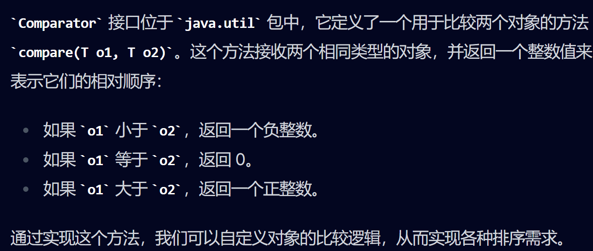

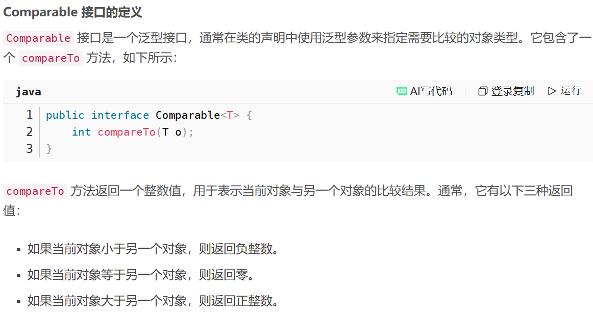

**重写compareTo方法：**

~~~java
// person对象没有实现Comparable接口，所以必须实现，这样才不会出错，才可以使treemap中的数据按顺序排列
// 前面一个例子的String类已经默认实现了Comparable接口，详细可以查看String类的API文档，另外其他
// 像Integer类等都已经实现了Comparable接口，所以不需要另外实现了
public  class Person implements Comparable<Person> {
    private String name;
    private int age;

    public Person(String name, int age) {
        super();
        this.name = name;
        this.age = age;
    }

    public String getName() {
        return name;
    }

    public void setName(String name) {
        this.name = name;
    }

    public int getAge() {
        return age;
    }

    public void setAge(int age) {
        this.age = age;
    }

    /**
     * T重写compareTo方法实现按年龄来排序
     */
    @Override
    public int compareTo(Person o) {
        if (this.age > o.getAge()) {
            return 1;
        }
        if (this.age < o.getAge()) {
            return -1;
        }
        return 0;
    }
}
~~~

**输出：**

~~~text
5-小红
10-王五
20-李四
30-张三
~~~

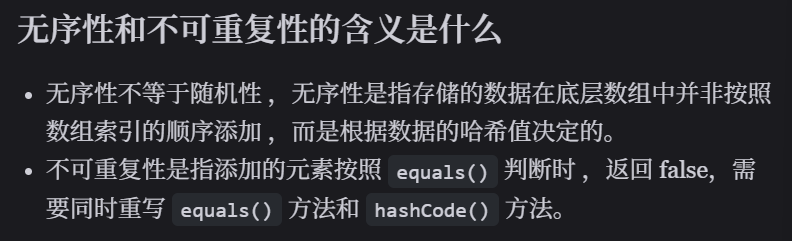

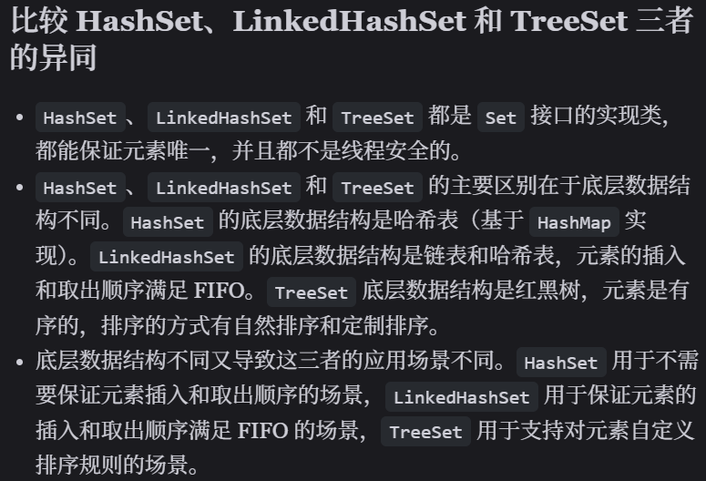

### Queue基础知识

**Queue与Deque区别：**

`Queue` 是单端队列，只能从一端插入元素，另一端删除元素，实现上一般遵循 **先进先出（FIFO）** 规则

`Queue` 扩展了 `Collection` 的接口，根据 **因为容量问题而导致操作失败后处理方式的不同** 可以分为两类方法: 一种在操作失败后会抛出异常，另一种则会返回特殊值

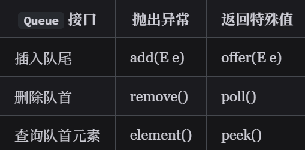

`Deque` 是双端队列，在队列的两端均可以插入或删除元素。

`Deque` 扩展了 `Queue` 的接口, 增加了在队首和队尾进行插入和删除的方法，同样根据失败后处理方式的不同分为两类：

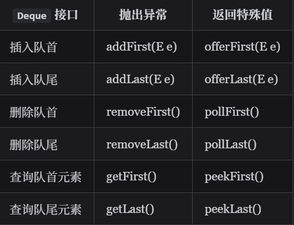

Deque还有push()和pop()等方法，用于模拟栈

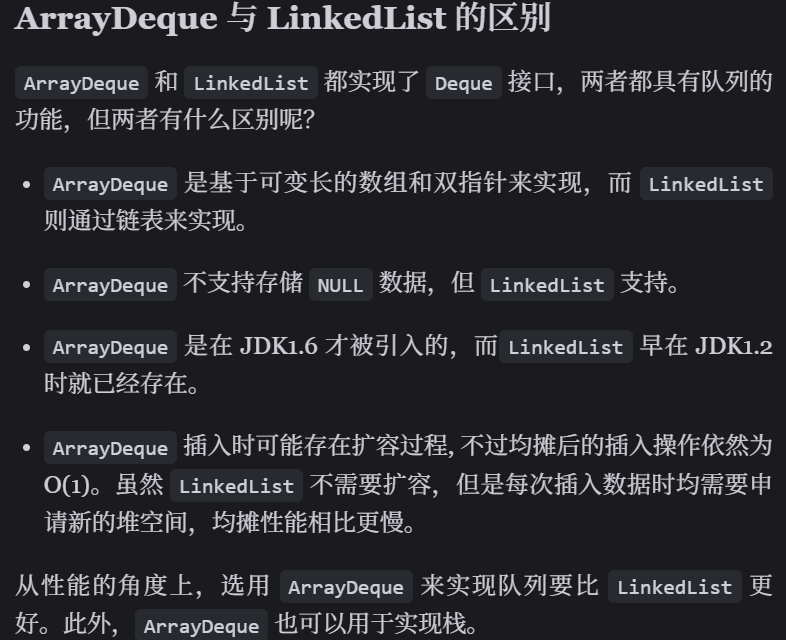

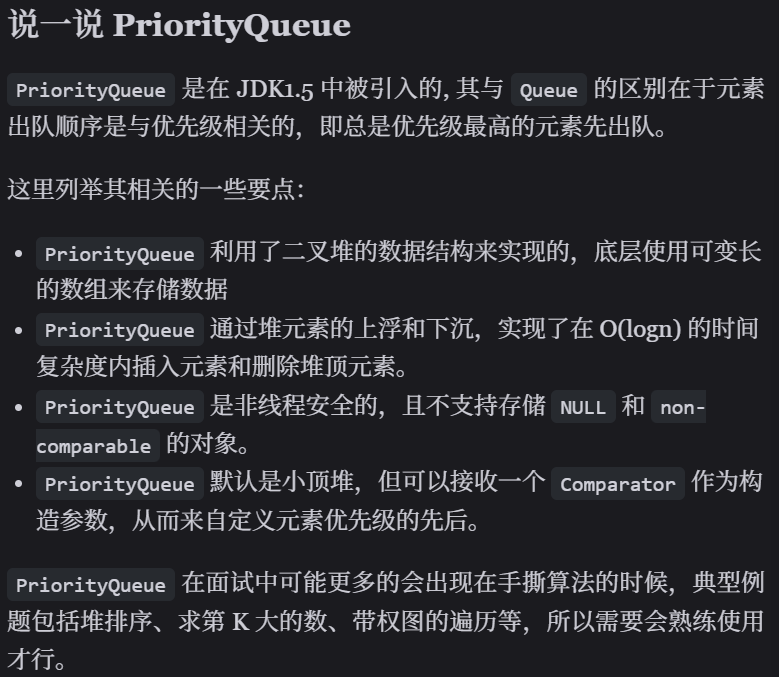

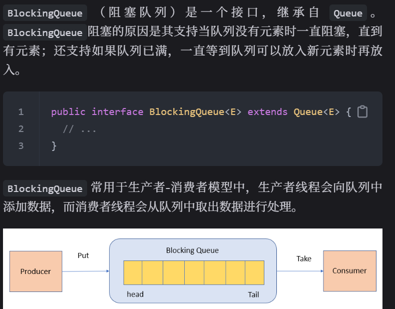

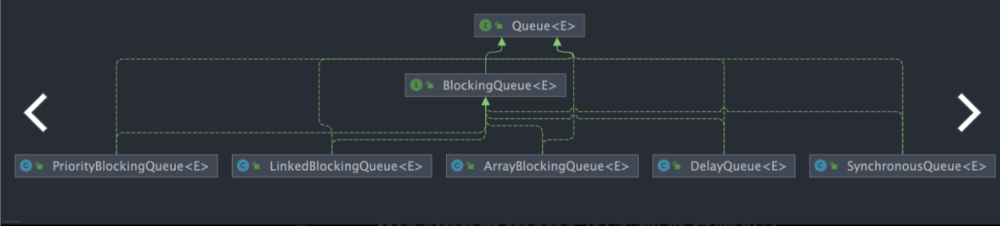

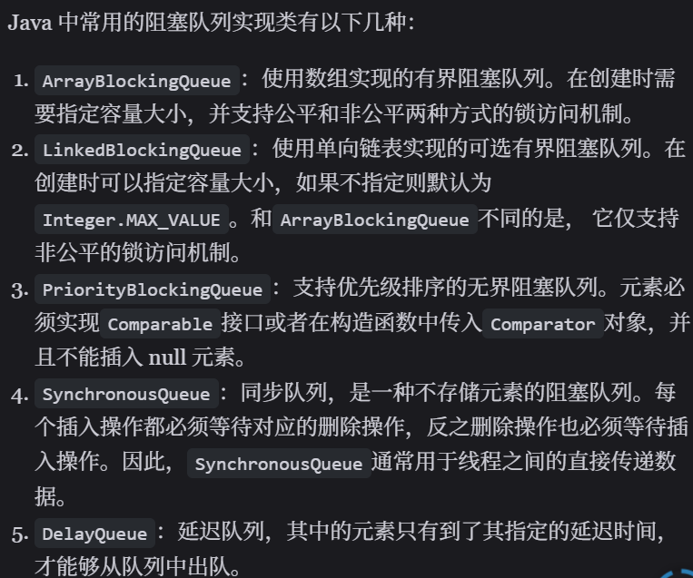

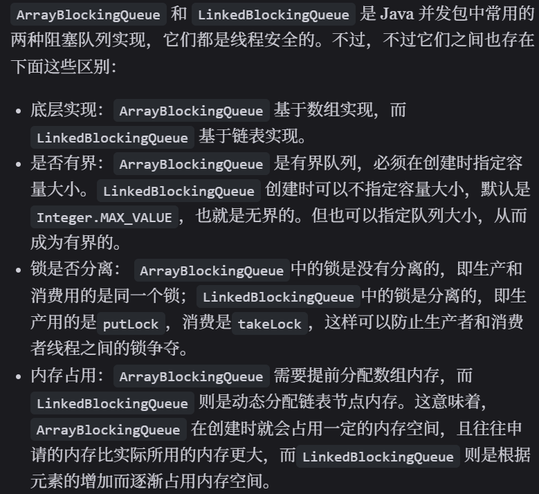

### Map基础知识

**HashMap和HashTable的区别：**

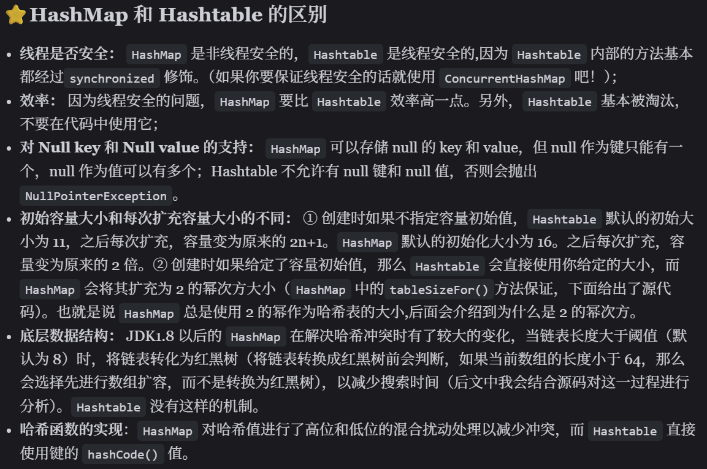

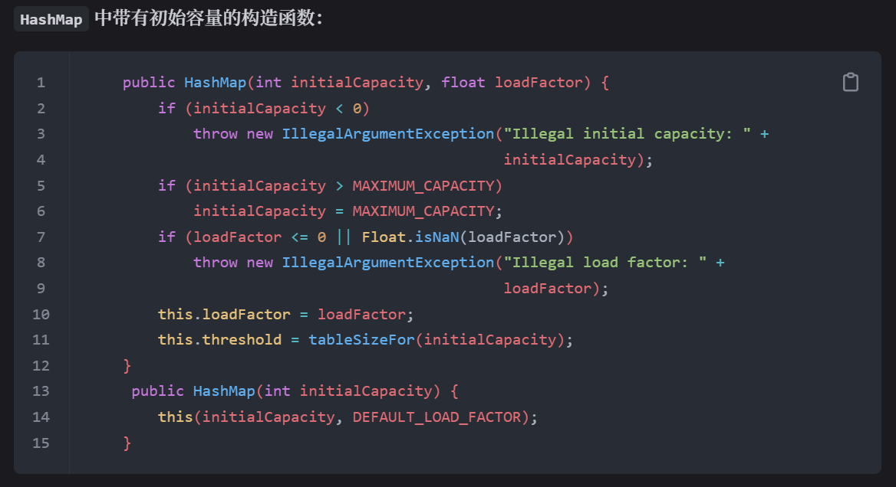

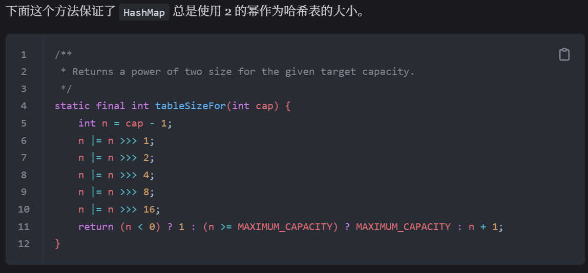

**HashMap和HashSet区别：**

**HashMap和TreeMap的区别：**

TreeMap和HashMap均继承自AbstractMap，但TreeMap还实现了NavigableMap接口和SortedMap接口

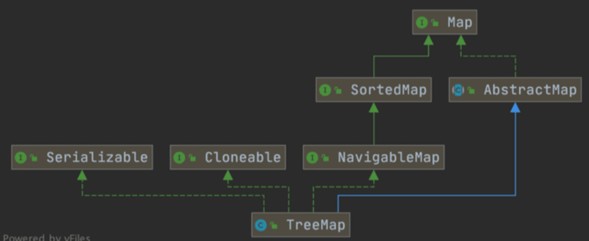

实现的NavigableMap接口让TreeMap具有对集合内元素的搜索的能力

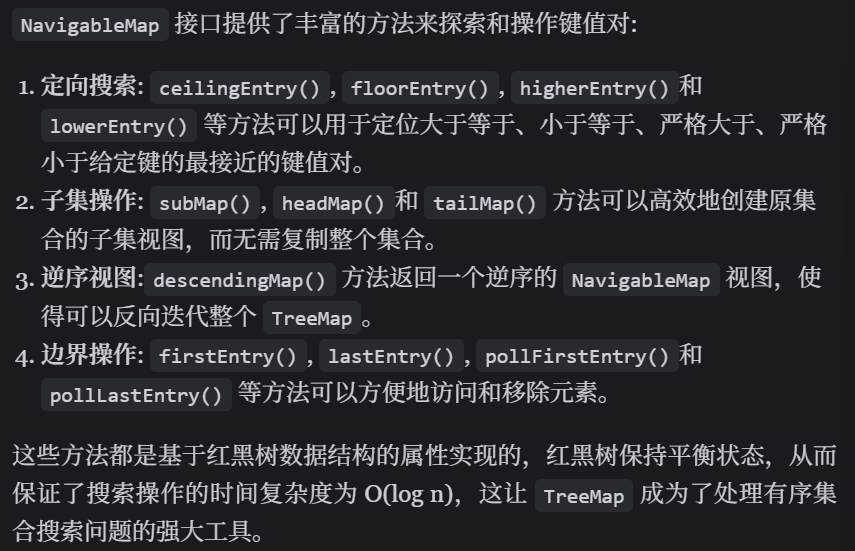

实现`SortedMap`接口让 `TreeMap` 有了对集合中的元素根据键排序的能力。默认是按 key 的升序排序，不过我们也可以指定排序的比较器

代码如下：

    public class Person {
        private Integer age;
    
        public Person(Integer age) {
            this.age = age;
        }
    
        public Integer getAge() {
            return age;
        }
    public static void main(String[] args) {
        TreeMap<Person, String> treeMap = new TreeMap<>(new Comparator<Person>() {
            @Override
            public int compare(Person person1, Person person2) {
                int num = person1.getAge() - person2.getAge();
                return Integer.compare(num, 0);
            }
        });
        treeMap.put(new Person(3), "person1");
        treeMap.put(new Person(18), "person2");
        treeMap.put(new Person(35), "person3");
        treeMap.put(new Person(16), "person4");
        treeMap.entrySet().stream().forEach(personStringEntry -> {
            System.out.println(personStringEntry.getValue());
        	});
    	}
    }
~~~select a language
person1
person4
person2
person3

Lambda表达式
TreeMap<Person, String> treeMap = new TreeMap<>((person1, person2) -> {
  int num = person1.getAge() - person2.getAge();
  return Integer.compare(num, 0);
});
~~~

**HashSet如何检查重复：**

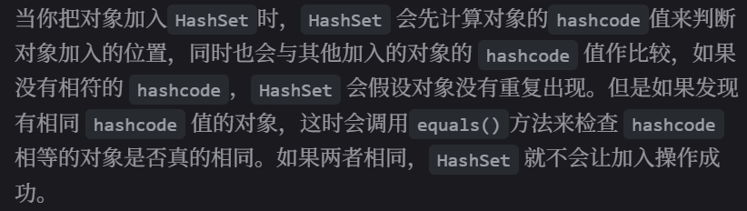

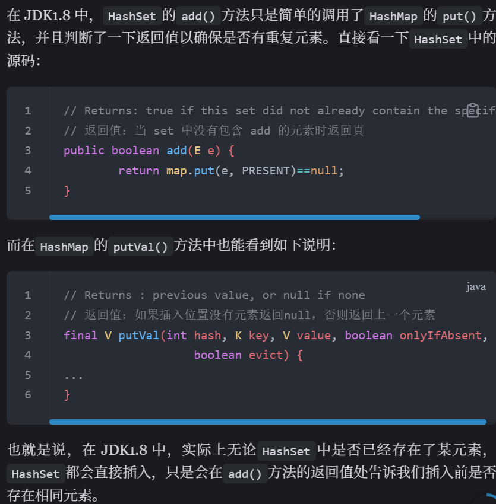

**HashMap的底层实现：**

JDK8之前的HashMap底层是数组+链表，链表散列

HashMap通过key的hashcode经过hash函数（扰动函数）处理后得到hash值，再通过(n-1)&hash判断当前元素存放的位置(n为数组长度)，如果当前位置存在元素，即拿该位置元素与要存放元素的hash值与key值进行比较，相同覆盖，否则通过拉链法进行解决冲突

`HashMap` 中的扰动函数（`hash` 方法）是用来优化哈希值的分布，通过对原始的hashCode进行额外处理，扰动函数可以减小由于糟糕的hashCode实现导致的hash碰撞，从而提高数据的分布均匀性

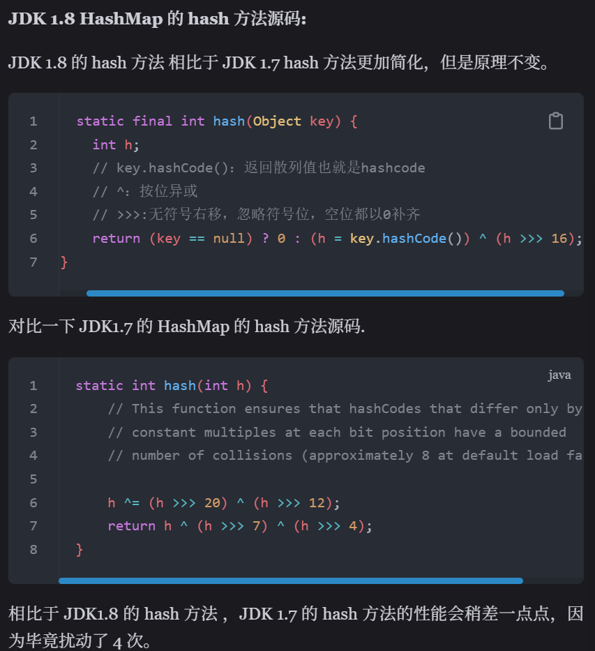

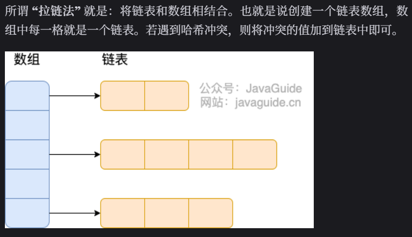

**JDK8之后的底层：**

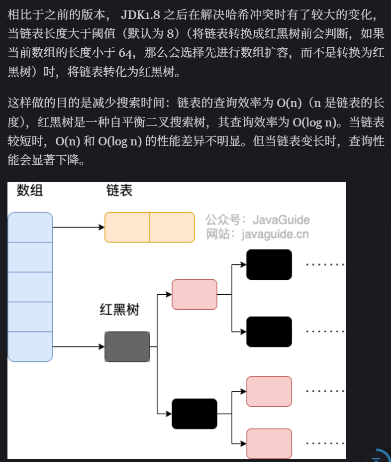

**为什么优先扩容而非直接转为红黑树？**

数组扩容能减少哈希冲突的发生概率（即将元素重新分散到新的、更大的数组中），这在多数情况下比直接转换为红黑树更高效

红黑树需要保持自平衡，维护成本较高，并且过早引入红黑树反而会增加复杂度

**为什么选择阈值8和64？**

1.泊松分布表明，链表长度达到 8 的概率极低（小于千万分之一）。在绝大多数情况下，链表长度都不会超过 8。阈值设置为 8，可以保证性能和空间效率的平衡

2.数组长度阈值 64 同样是经过实践验证的经验值。在小数组中扩容成本低，优先扩容可以避免过早引入红黑树。数组大小达到 64 时，冲突概率较高，此时红黑树的性能优势开始显现

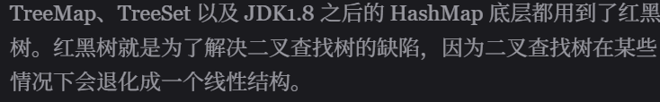

HashMap链表转红黑树

1.putVal中执行链表转红黑树的判断逻辑

链表长度大于8的时候，执行treeifyBin逻辑

~~~select a language
// 遍历链表
for (int binCount = 0; ; ++binCount) {
    // 遍历到链表最后一个节点
    if ((e = p.next) == null) {
        p.next = newNode(hash, key, value, null);
        // 如果链表元素个数大于TREEIFY_THRESHOLD（8）
        if (binCount >= TREEIFY_THRESHOLD - 1) // -1 for 1st
            // 红黑树转换（并不会直接转换成红黑树）
            treeifyBin(tab, hash);
        break;
    }
    if (e.hash == hash &&
        ((k = e.key) == key || (key != null && key.equals(k))))
        break;
    p = e;
}
~~~

2.treeifyBin判断是否转为红黑树

~~~select a language
final void treeifyBin(Node<K,V>[] tab, int hash) {
    int n, index; Node<K,V> e;
    // 判断当前数组的长度是否小于 64
    if (tab == null || (n = tab.length) < MIN_TREEIFY_CAPACITY)
        // 如果当前数组的长度小于 64，那么会选择先进行数组扩容
        resize();
    else if ((e = tab[index = (n - 1) & hash]) != null) {
        // 否则才将列表转换为红黑树

        TreeNode<K,V> hd = null, tl = null;
        do {
            TreeNode<K,V> p = replacementTreeNode(e, null);
            if (tl == null)
                hd = p;
            else {
                p.prev = tl;
                tl.next = p;
            }
            tl = p;
        } while ((e = e.next) != null);
        if ((tab[index] = hd) != null)
            hd.treeify(tab);
    }
}
~~~

将链表转换成红黑树前会判断，如果当前数组的长度小于 64，那么会选择先进行数组扩容，而不是转换为红黑树

**HashMap的长度为什么是2的幂次方？**

为了让HashMap存取高效并且减少hash碰撞，需要确保数据尽量均匀分布

hash值在java中用int表示即可，范围为-2147483648~2147483647，大概40亿的映射空间，只要hash函数映射比较均匀松散，一般情况不会出现碰撞，但是一个40亿长度的数组内存是完全存不下去的，因而这个散列值不可以直接拿来使用，用之前可以先对数组的长度进行取模运算，余数才是存放的下标

**算法设计？**

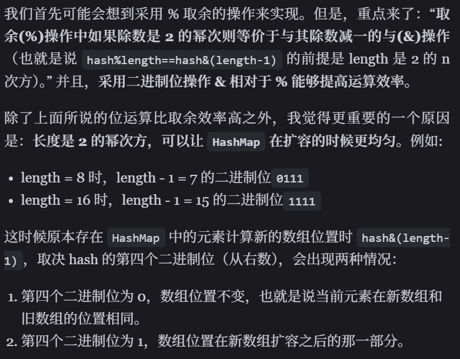

~~~select a language
假设有一个元素的哈希值为 10101100

旧数组元素位置计算：
hash        = 10101100
length - 1  = 00000111
& -----------------
index       = 00000100  (4)

新数组元素位置计算：
hash        = 10101100
length - 1  = 00001111
& -----------------
index       = 00001100  (12)

看第四位（从右数）：
1.高位为 0：位置不变。
2.高位为 1：移动到新位置（原索引位置+原容量）。
~~~

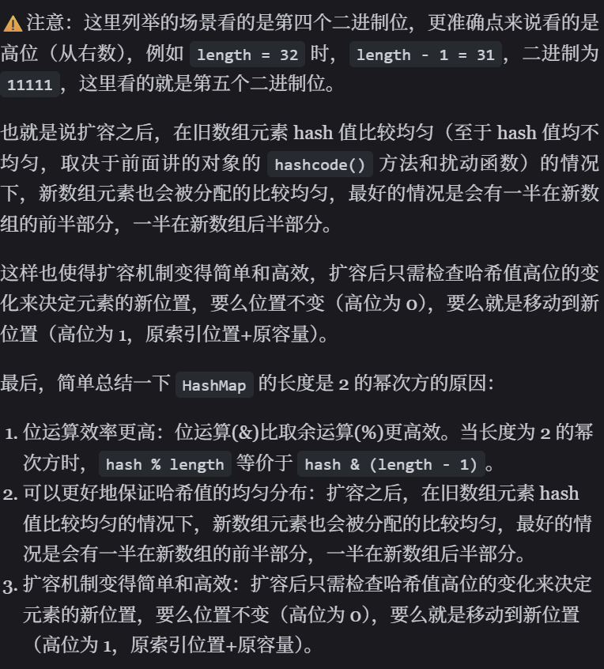

**HashMap多线程操作导致死循环问题：**

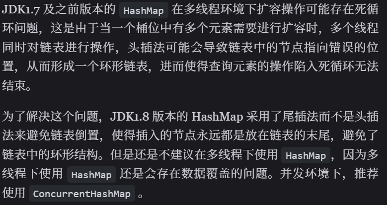

**HashMap为什么线程不安全：**

JDK7及之前的版本，在多线程环境下，HashMap扩容时会造成死循环和数据丢失问题，数据丢失问题在JDK7和JDK8中均存在

JDK8之后，在HashMap中，多个键值可能会被分配到同一个桶（bucket）中，并以链表或红黑树的形式存储。多个线程对HashMap的put操作会导致线程不安全

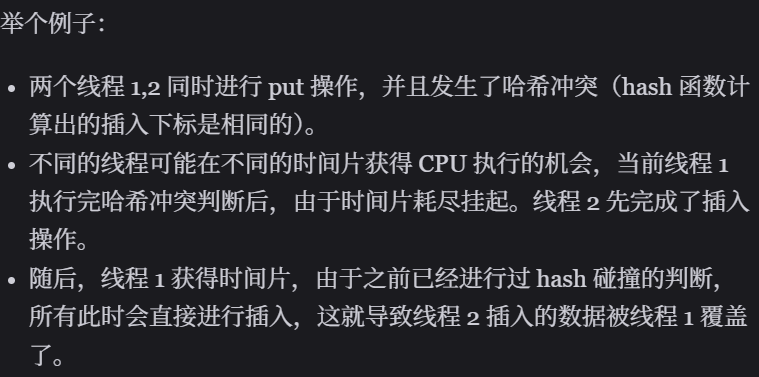

~~~select a language
public V put(K key, V value) {
    return putVal(hash(key), key, value, false, true);
}

final V putVal(int hash, K key, V value, boolean onlyIfAbsent,
                   boolean evict) {
    // ...
    // 判断是否出现 hash 碰撞
    // (n - 1) & hash 确定元素存放在哪个桶中，桶为空，新生成结点放入桶中(此时，这个结点是放在数组中)
    if ((p = tab[i = (n - 1) & hash]) == null)
        tab[i] = newNode(hash, key, value, null);
    // 桶中已经存在元素（处理hash冲突）
    else {
    // ...
}
~~~

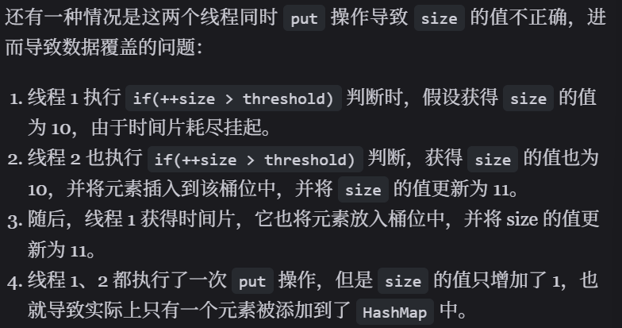

~~~select a language
public V put(K key, V value) {
    return putVal(hash(key), key, value, false, true);
}

final V putVal(int hash, K key, V value, boolean onlyIfAbsent,
                   boolean evict) {
    // ...
    // 实际大小大于阈值则扩容
    if (++size > threshold)
        resize();
    // 插入后回调
    afterNodeInsertion(evict);
    return null;
}
~~~

**ConcurrentHashMap和HashTable的区别：**

主要区别在于实现线程安全的方式

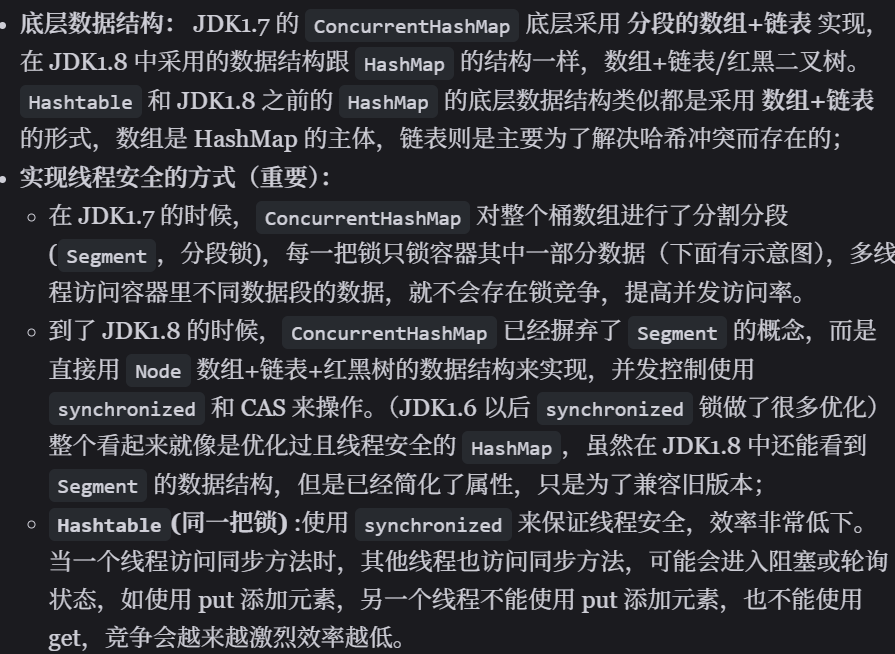

两者的底层数据结构

HashTable：

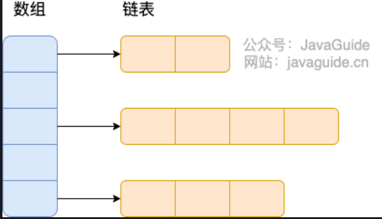

JDK7的ConcurrentHashMap：

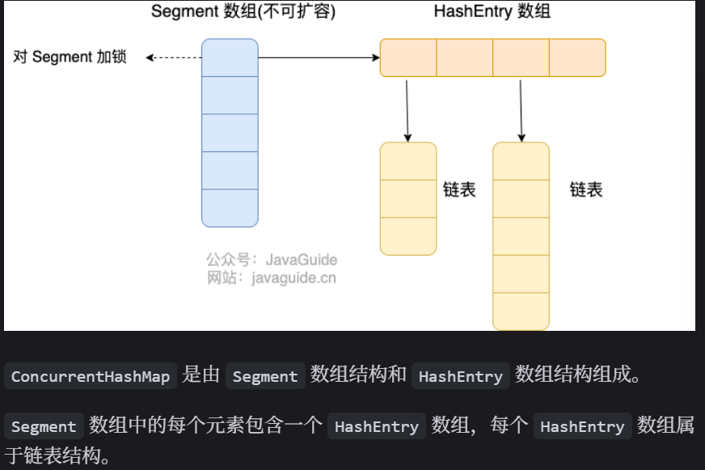

JDK8的ConcurrentHashMap：

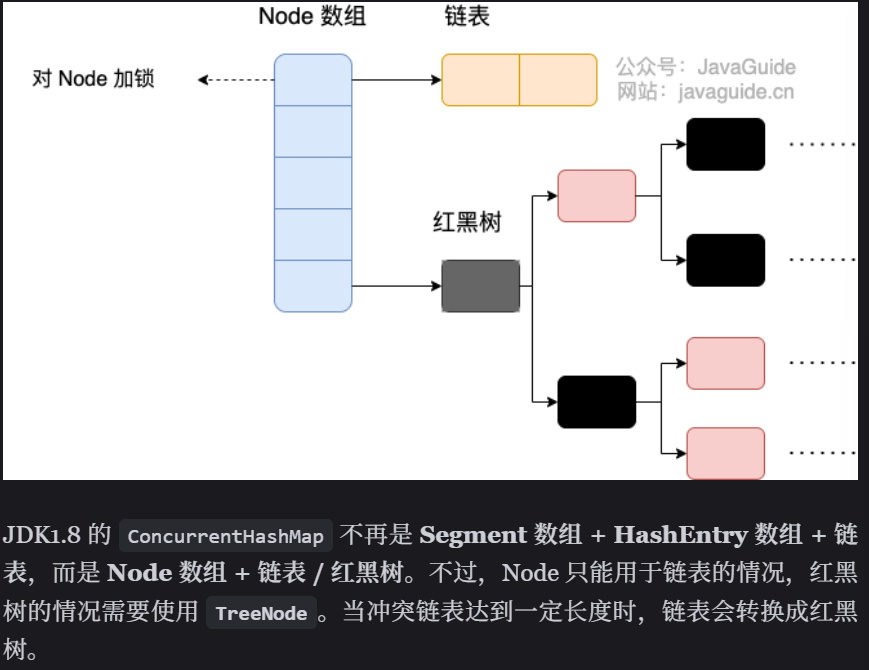

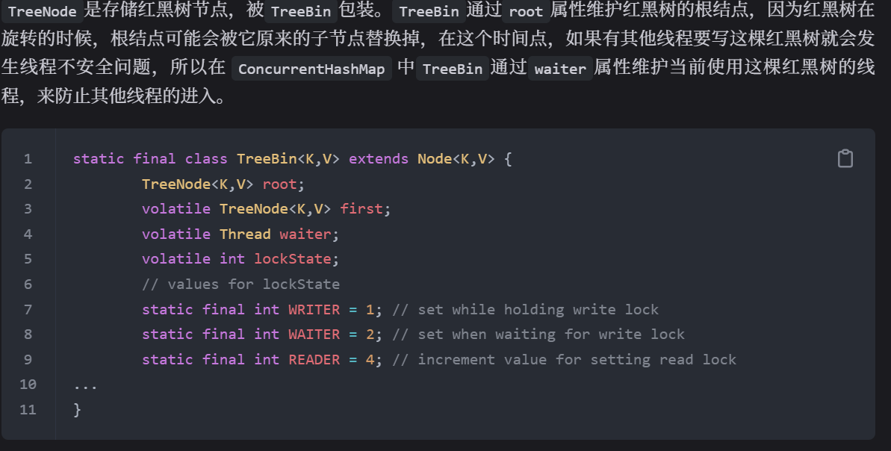

**ConcurrentHashMap线程安全的具体实现/底层实现：**

JDK8之前：

将数据分为段式数组，一段一段存储，然后将每段数据加锁，当一个线程占用锁访问其中一个段数据时，其他段的数据也会被其他线程访问

**ConcurrentHashMap 是由 Segment 数组结构和 HashEntry 数组结构组成**

`Segment` 继承了 `ReentrantLock`,所以 `Segment` 是一种可重入锁，扮演锁的角色。`HashEntry` 用于存储键值对数据

~~~select a language
static class Segment<K,V> extends ReentrantLock implements Serializable {
}
~~~

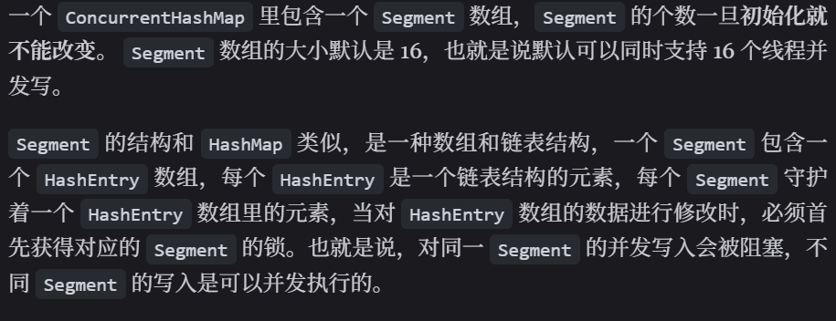

JDK8以后：

取消了Segment分段锁，使用Node+CAS+synchronized保证并发安全。数据结构跟HashMap1.8的结构类似，数组+链表/红黑二叉树。Java8在链表长度超过阈值8时会将其链表(时间复杂度O(N))转为红黑树(时间复杂度O(log(N)))

Java 8 中，锁粒度更细，`synchronized` 只锁定当前链表或红黑二叉树的首节点，这样只要 hash 不冲突，就不会产生并发，就不会影响其他 Node 的读写，效率大幅提升。

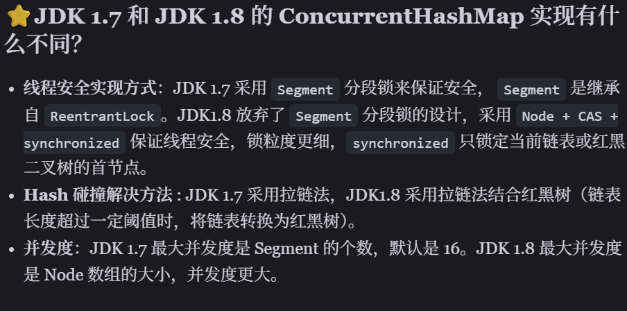

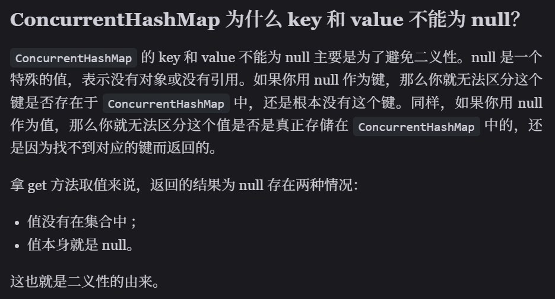

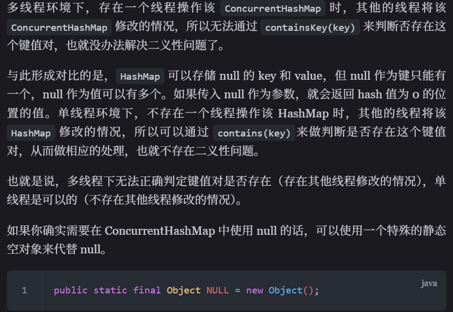

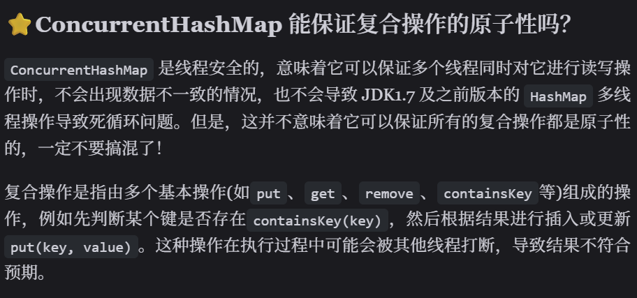

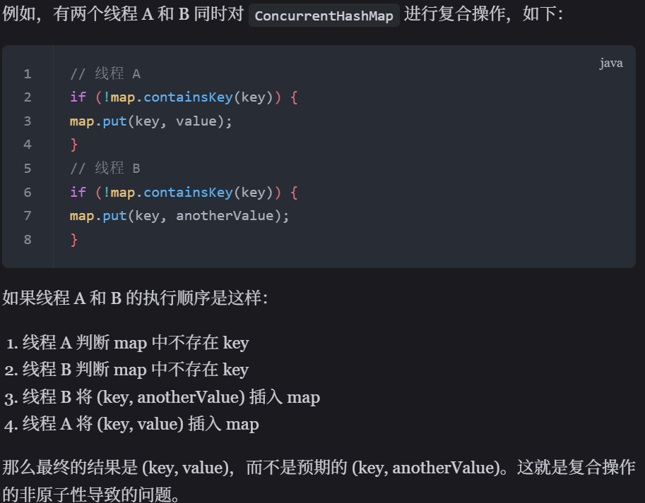

如何保证ConcurrentHashMap复合操作的原子性？

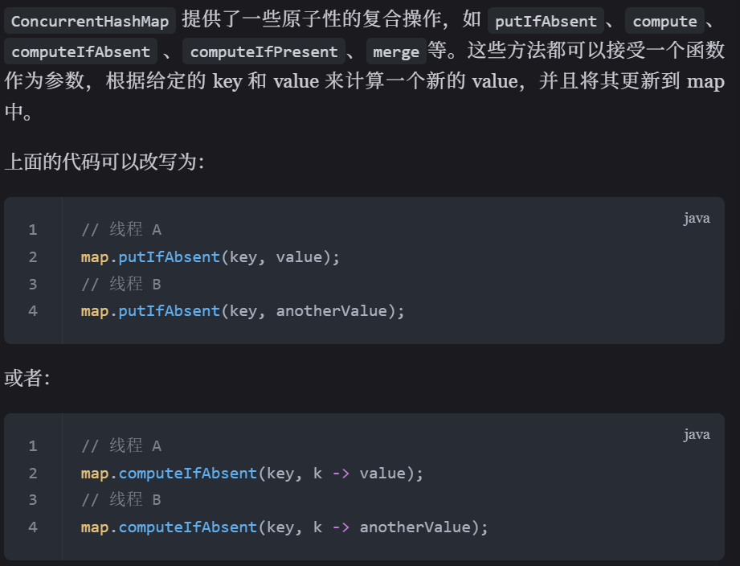

Collections工具类：

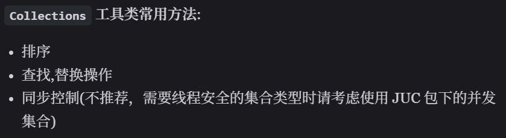

排序操作：

~~~select a language
void reverse(List list)//反转
void shuffle(List list)//随机排序
void sort(List list)//按自然排序的升序排序
void sort(List list, Comparator c)//定制排序，由Comparator控制排序逻辑
void swap(List list, int i , int j)//交换两个索引位置的元素
void rotate(List list, int distance)//旋转。当distance为正数时，将list后distance个元素整体移到前面。当distance为负数时，将 list的前distance个元素整体移到后面
~~~

查找、替换操作：

~~~select a language
int binarySearch(List list, Object key)//对List进行二分查找，返回索引，注意List必须是有序的
int max(Collection coll)//根据元素的自然顺序，返回最大的元素。 类比int min(Collection coll)
int max(Collection coll, Comparator c)//根据定制排序，返回最大元素，排序规则由Comparatator类控制。类比int min(Collection coll, Comparator c)
void fill(List list, Object obj)//用指定的元素代替指定list中的所有元素
int frequency(Collection c, Object o)//统计元素出现次数
int indexOfSubList(List list, List target)//统计target在list中第一次出现的索引，找不到则返回-1，类比int lastIndexOfSubList(List source, list target)
boolean replaceAll(List list, Object oldVal, Object newVal)//用新元素替换旧元素
~~~

同步控制：

`Collections` 提供了多个`synchronizedXxx()`方法·，该方法可以将指定集合包装成线程同步的集合，从而解决多线程并发访问集合时的线程安全问题

但是对于普通的集合都是线程不安全的，所以一般对于并发都使用JUC下的并发集合

最好不要使用以下方法

~~~select a language
synchronizedCollection(Collection<T>  c) //返回指定 collection 支持的同步（线程安全的）collection。
synchronizedList(List<T> list)//返回指定列表支持的同步（线程安全的）List。
synchronizedMap(Map<K,V> m) //返回由指定映射支持的同步（线程安全的）Map。
synchronizedSet(Set<T> s) //返回指定 set 支持的同步（线程安全的）set。
~~~

