# LeetCode-Hot-100

## 两数之和

```
package leetcodehot100;

/**
 * @author 自然醒
 * @version 1.0
 */

/**
 * 两数之和
 * 给定一个整数数组 nums 和一个整数目标值 target，请你在该数组中找出 和为目标值 target  的那 两个 整数，并返回它们的数组下标。
 * 你可以假设每种输入只会对应一个答案。但是，数组中同一个元素在答案里不能重复出现。
 * 你可以按任意顺序返回答案。
 * 示例 1：
 * 输入：nums = [2,7,11,15], target = 9
 * 输出：[0,1]
 * 解释：因为 nums[0] + nums[1] == 9 ，返回 [0, 1] 。
 * 示例 2：
 * 输入：nums = [3,2,4], target = 6
 * 输出：[1,2]
 * 示例 3：
 * 输入：nums = [3,3], target = 6
 * 输出：[0,1]
 */
public class hot1 {
    public static void main(String[] args) {
        int[] nums = {2, 7, 11, 15};
        int target = 9;
        int[] ints = twoSum(nums, target);
        for (int anInt : ints) {
            System.out.println(anInt);
        }
    }
    public static int[] twoSum(int[] nums, int target) {
        int[] res = new int[2];
        for(int i = 0; i < nums.length; i++){
            for(int j = i + 1; j < nums.length; j++){
                if(nums[i] + nums[j] == target){
                    res[0] = i;
                    res[1] = j;
                    return res;
                }
            }
        }
        res[0] = -1;
        res[1] = -1;
        return res;
    }
}
```

暴力枚举遍历数组，时间复杂为O(n^2)

```
public static int[] twoSum(int[] nums, int target) {
    HashMap<Integer, Integer> map = new HashMap<>();
    for (int i = 0; i < nums.length; i++) {
        int isExit = target - nums[i];
        if(map.containsKey(isExit)){
            return new int[]{map.get(isExit), i};
        }
        map.put(nums[i], i);
    }
  return new int[]{-1, -1};
}
```

以上是hash优化，主要使用Hash表特性，存储数字以及对应的索引，k-v键值对存储（此时数字为key值，索引为value值），遍历数组，然后求其对应的target-nums[i]补数，使用api判断当前是否已经存在该值，存在的话则直接返回对应的索引，不存在则添加至hashmap中，进行下一次判断

## 字母异或词分组

```
package leetcodehot100;

/**
 * @author 自然醒
 * @version 1.0
 */

import java.util.*;

/**
 * 字母异或词分组
 * 字母异位词：通过重新排列不同单词或短语的字母而形成的单词或短语，并使用所有原字母一次
 * 给定一个字符串数组，将字母异位词组合在一起。可以按任意顺序返回结果。
 * 示例1：
 * 输入: strs = ["eat", "tea", "tan", "ate", "nat", "bat"]
 * 输出: [["bat"],["nat","tan"],["ate","eat","tea"]]
 * 解释：
 * 数组中没有任何字符串可以通过重新排列形成"bat"
 * 字符串"eat"、"tea"和"ate"可以重新排列形成彼此
 * "tan"、"nat"可以重新排列形成彼此
 * 示例2：
 * 输入: strs = [""]
 * 输出: [[""]]
 * 示例3：
 * 输入: strs = ["a"]
 * 输出: [["a"]]
 */
public class hot2 {
    public static List<List<String>> groupAnagrams(String[] strs) {
        Map<String, List<String>> map = new HashMap<>();
        for (String str : strs) {
            char[] chars = str.toCharArray();
            Arrays.sort(chars);
            String key = new String(chars);
            if(!map.containsKey( key)){
                map.put(key, new ArrayList<>());
            }
            map.get(key).add(str);
        }
        return new ArrayList<>(map.values());
    }
}
```

该题解法主要思想为**特征提取+哈希分组**

**特征提取的核心思想**：将复杂数据转换为能够代表其本质特征的简化表示

- 将不同形式的相同内容映射到相同的特征表示
- 此题则是将"eat"、"tea"、"ate"映射到特征"aet"
- 消除排列顺序的影响，只保留本质的字母组成信息

**哈希分组的核心思想**：使用特征作为键，将具有相同特征的数据聚合在一起。

主要利用哈希表的O(1)查找特性

"特征提取+哈希分组"模式可以应用于很多类似问题：

1. **分组回文串**：提取特征为排序后的字符串
2. **按字符串长度分组**：提取特征为字符串长度
3. **按数字各位数之和分组**：提取特征为各位数字之和
4. **按自定义规则分组**：任何可以提取出分组依据特征的问题

上述时间复杂为O(n*k * logk )，主要的时间复杂浪费在排序

可以采用计数+哈希，减去了排序的时间

```
public List<List<String>> groupAnagrams(String[] strs) {
    Map<String, List<String>> map = new HashMap<>();
    
    for (String str : strs) {
        // 创建字符计数数组
        int[] count = new int[26];
        for (char c : str.toCharArray()) {
            count[c - 'a']++;
        }
        
        // 将计数数组转换为字符串作为键
        StringBuilder keyBuilder = new StringBuilder();
        for (int i = 0; i < 26; i++) {
            if (count[i] > 0) {
                keyBuilder.append((char)('a' + i)).append(count[i]);
            }
        }
        String key = keyBuilder.toString();
        
        if (!map.containsKey(key)) {
            map.put(key, new ArrayList<>());
        }
        map.get(key).add(str);
    }
    
    return new ArrayList<>(map.values());
}
```

一种可以用来学习的操作，按需使用，**懒加载（Lazy Initialization）**

```
 public List<List<String>> groupAnagrams(String[] strs) {
     return new AbstractList<>() {
     // 只需要实现get()和size()两个抽象方法
    // 其他方法（如iterator(), contains()等）有默认实现
            List<List<String>> list;
            private void init() {
                if (list != null)
                    return;
                Map<String, List<String>> strMap = new HashMap<>();
                for (String str : strs) {
                    char[] charArr = str.toCharArray();
                    Arrays.sort(charArr);
                    String strSorted = new String(charArr);
                    if (!strMap.containsKey(strSorted)) {
                        strMap.put(strSorted, new ArrayList<>());
                    }
                    strMap.get(strSorted).add(str);
                }
                list = new ArrayList<>(strMap.values());
            }
            @Override
            public List<String> get(int index) {
                init();
                return list.get(index);
            }
            @Override
            public int size() {
                init();
                return list.size();
            }
        };
    }
```

此种方法，如果不去调用结果，它永远不会执行计算，如果是需要部分结果，它也不会直接去计算全部，而是只计算需要的内容

- **不立即计算**：创建对象时并不执行实际计算
- **按需计算**：只有在真正需要数据时才执行计算
- **结果缓存**：计算一次后缓存结果，后续调用直接使用缓存


## 最长连续序列

```
package leetcodehot100;

/**
 * @author 自然醒
 * @version 1.0
 */

/**
 * 最长连续序列
 * 给定一个未排序的整数数组 nums ，找出数字连续的最长序列（不要求序列元素在原数组中连续）的长度。
 * 设计一个算法的时间复杂度为 O(n) 。
 * 示例 1：
 * 输入：nums = [100,4,200,1,3,2]
 * 输出：4
 * 解释：最长数字连续序列是 [1, 2, 3, 4]。它的长度为 4。
 * 示例 2：
 * 输入：nums = [0,3,7,2,5,8,4,6,0,1]
 * 输出：9
 * 解释：最长数字连续序列是 [0, 1, 2, 3, 4, 5, 6, 7, 8]。它的长度为 9。
 * 示例3 :
 * 输入：nums = [1,0,1,2]
 * 输出：3
 */
public class hot3 {
    public static int longestConsecutive(int[] nums) {
        if(nums == null){
            return 0;
        }
        if(nums.length == 0){
            return 0;
        }
        insertSort(nums);
        int current_length = 1;
        int max_length = 1;
        for(int i = 1; i < nums.length; i++){
            if(nums[i] == nums[i - 1] + 1){
                current_length++;
            } else if (nums[i] == nums[i-1]) {
                continue;
            } else{
                current_length = 1;
            }
            max_length = Math.max(current_length, max_length);
        }
        return max_length;
    }

    public static void insertSort(int[] nums){
        for(int i = 1; i < nums.length; i++){
            int base = nums[i];
            int idx = i - 1;
            while(idx >= 0 && nums[idx] > base){
                nums[idx + 1] = nums[idx];
                idx--;
            }
            nums[idx + 1] = base;
        }
    }
}
```

时间超出限制，我真笑了。。。

```
public static int longestConsecutive(int[] nums) {
    Set<Integer> set = new HashSet<>();
    for (int num : nums) {
        set.add(num);
    }
    int max_length = 0;
    for (int num : set) {
        int current = num;
        // 只有当num-1不存在时，才开始向后遍历num+1，num+2，num+3......
        if(!set.contains(current - 1)){
            while (set.contains(current + 1)) {
                current++;
            }
        }
        max_length = Math.max(max_length, current - num + 1);
    }
    return max_length;
}
```

直接使用Set集合即可，第一种方法主要浪费在排序的时间，虽然插入排序最好可以达到O(n)，但是如果是超大数或者逆序的排序数组，此时它的时间会为O(n^2)

Set集合的思路

1. 将所有数字存入Set（O(n)）
2. 遍历Set中的每个数字
3. 只有当当前数字是某个连续序列的起点（即num-1不存在）时，才开始向后寻找连续数字
4. 记录最长的序列长度


```
public static int longestConsecutive(int[] nums) {
    if (nums == null || nums.length == 0) {
        return 0;
    }
    HashMap<Integer, Integer> map = new HashMap<>();
    int maxLength = 0;
    int currentLength = 0;
    for (int num : nums) {
        while(!map.containsKey(num)){
            int left = map.getOrDefault(num - 1, 0);
            int right = map.getOrDefault(num + 1, 0);
            currentLength = left + right + 1;
            maxLength = Math.max(maxLength, currentLength);
            map.put(num,-1);
            map.put(num-left,currentLength);
            map.put(num+right,currentLength);
        }
    }
    return maxLength;
}
```

```
public static int longestConsecutive(int[] nums) {
    if (nums == null || nums.length == 0) {
        return 0;
    }
    HashMap<Integer, Integer> map = new HashMap<>();
    int maxLength = 0;
    //创建一个哈希表,将数组中的元素添加到哈希表中
    for (int num : nums) {
        map.put(num, num);
    }
    //遍历数组
    for (int num : nums) {
        //后续如果不存在该键值则会退出，证明数组中不存在该数字
        if(map.containsKey(num)){
            //获取当前数字的右边数字
            int right = map.get(num);
            //当前数字的右边是否存在，存在即将键值删除，这样可以实现一个最小元素到最大元素的序列
            while(map.containsKey(right + 1)){
                map.remove(right);
                right = map.get(right + 1);
            }
            map.put(num, right);
            maxLength = Math.max(maxLength,right - num + 1);
        }
    }
    return maxLength;
}
```

## 移动零

```
package leetcodehot100;

/**
 * @author 自然醒
 * @version 1.0
 */

/**
 * 移动零
 * 给定一个数组 nums，编写一个函数将所有 0 移动到数组的末尾，同时保持非零元素的相对顺序。
 * 请注意 ，必须在不复制数组的情况下原地对数组进行操作。
 * 输入: nums = [0,1,0,3,12]
 * 输出: [1,3,12,0,0]
 * 输入: nums = [0]
 * 输出: [0]
 */
public class hot4 {
    public static void moveZeros(int[] nums){
        if(nums == null || nums.length == 0){
            return;
        }
        int index = 0;
        for(int i = 0; i < nums.length; i++){
            if(nums[i] != 0){
             int temp = nums[i];
             nums[i] = nums[index];
             nums[index] = temp;
             index++;
            }
        }
    }
}
```

普通的解法，暴力遍历进行交换，此时自己跟自己发生了一次交换，多一次交换，所以可以再多一个条件if(index != i)可以少一次交换

进价：减少它交换的操作次数，填充0总比交换速度快

```
public static void moveZeros(int[] nums){
    if(nums == null || nums.length == 0){
        return;
    }
    int index = 0;
    // 遍历数组，将非零元素移动到数组的左边
    for(int i = 0; i < nums.length; i++){
        if(nums[i] != 0){
            nums[index++] = nums[i];
        }
    }
    // 填充数组的剩余元素为0
    while(index < nums.length){
        nums[index++] = 0;
    }
}
```

## 盛最多水的容器

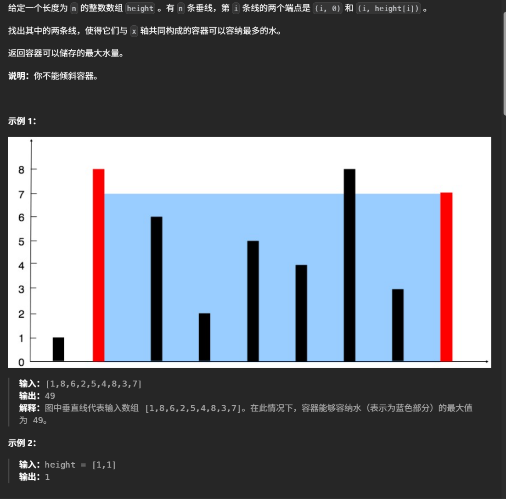

题目意思即是求最大的面积即可

所以需要求出间隔的两条线之间的能够围成的图形的最小高度以及它们之间的宽度即可

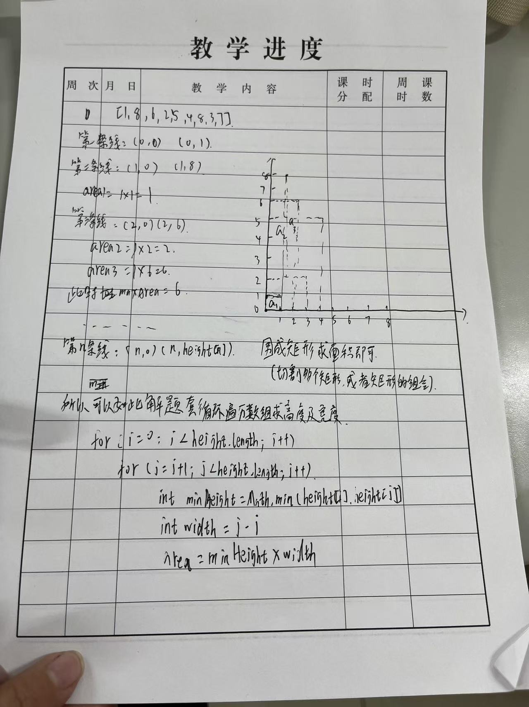

```
package leetcodehot100;

/**
 * @author 自然醒
 * @version 1.0
 */

/**
 * 盛最多水的容器
 * 给定一个长度为 n 的整数数组 height 。有n条垂线，第 i 条线的两个端点是 (i, 0) 和 (i, height[i]) 。
 * 找出其中的两条线，使得它们与 x 轴共同构成的容器可以容纳最多的水。
 * 返回容器可以储存的最大水量。
 * 注意：你不能倾斜容器。
 * 示例 1：
 * 输入：height = [1,8,6,2,5,4,8,3,7]
 * 输出：49
 * 解释：图中垂直线代表输入数组 [1,8,6,2,5,4,8,3,7]。在此情况下，容器能够容纳水（表示为蓝色部分）的最大值为 49。
 * 示例 2：
 * 输入：height = [1,1]
 * 输出：1
 */
public class hot5 {
    public static int maxArea(int[] height) {
        if(height == null || height.length == 0){
            return 0;
        }
        int area = 0;
        for(int  i = 0; i < height.length; i++){
            for(int j = i + 1; j < height.length; j++){
                int minHeight = Math.min(height[i], height[j]);
                int width = j - i;
                area = Math.max(area, minHeight * width);
            }
        }
        return area;
    }
}
```

可惜又是超时的一次。。。

使用双指针解可以的，但是需要理解其移动状态

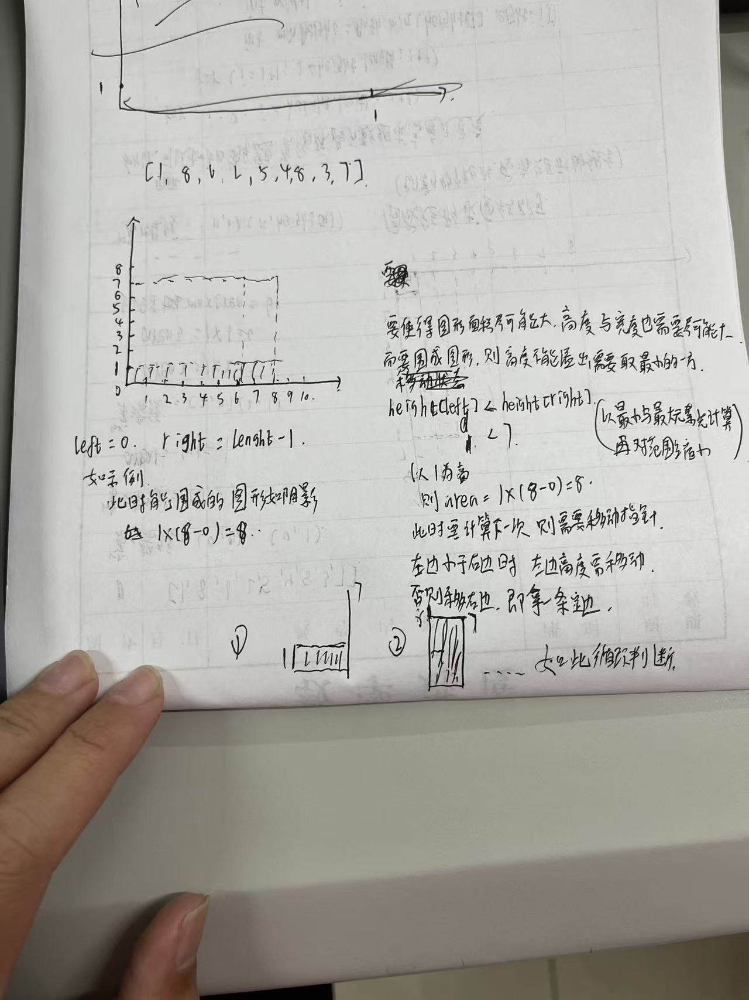

```
public static int maxArea(int[] height) {
    if (height == null || height.length == 0) {
        return 0;
    }
    int area = 0;
    int left = 0;
    int right = height.length - 1;
    while (left < right) {
        int minHeight = Math.min(height[left], height[right]);
        int width = right - left;
        area = Math.max(area, minHeight * width);
        if (height[left] < height[right]) {
            left++;
        } else {
            right--;
        }
    }
    return area;
}
```

## 三数之和

```
package leetcodehot100;

/**
 * @author 自然醒
 * @version 1.0
 */

import java.util.ArrayList;
import java.util.Arrays;
import java.util.List;

/**
 * 三数之和
 * 给一个整数数组nums，判断是否存在三元组 [nums[i], nums[j], nums[k]] 满足i != j, i != k, j != k, 且nums[i] + nums[j] + nums[k] == 0
 * 请返回所有和为0且不重复的三元组
 * 注意：答案中不可以包含重复的三元组
 * 示例1：
 * 输入：nums = [-1, 0, 1, 2, -1, -4]
 * 输出：[[-1, -1, 2], [-1, 0, 1]]
 * 解释：
 * nums[0] + nums[1] + nums[2] = (-1) + 0 + 1 = 0
 * nums[1] + nums[2] + nums[4] = 0 + 1 + (-1) = 0
 * nums[0] + nums[3] + nums[4] = (-1) + 2 + (-1) = 0
 * 不同的三元组是 [-1, 0, 1] 和 [-1, -1, 2]
 * 输出的顺序和三元组的顺序不重要
 * 示例2：
 * 输入：nums = [0, 0, 0]
 * 输出：[[0, 0, 0]]
 * 解释：唯一可能的三元组和为 0
 * 示例3：
 * 输入：nums = [0, 1, 1]
 * 输出：[]
 * 解释：唯一可能得三元组和不为0
 */
public class hot6 {
    public static List<List<Integer>> threeSum(int[] nums) {
        List<List<Integer>> res = new ArrayList<>();
        if (nums == null || nums.length < 3) {
            return res;
        }
        //先将数组进行排序
        Arrays.sort(nums);
        for (int i = 0; i < nums.length; i++) {
            //数组中全是大于0的数不可能满足要求
            if (nums[i] > 0) {
                return res;
            }
            //剪枝，去掉重复的数，防止出现重复元组
            if (i > 0 && nums[i] == nums[i - 1]) {
                continue;
            }
            for (int j = i + 1; j < nums.length; j++) {
                //剪枝，去掉重复的数，防止出现重复元组
                if (j > i + 1 && nums[j] == nums[j - 1]) {
                    continue;
                }
                for (int k = j + 1; k < nums.length; k++) {
                    //剪枝，如果当前数和后面的数之和大于0，则后面的数不可能满足要求
                    if (k > j + 1 && nums[k] == nums[k - 1]) {
                        continue;
                    }
                    if (nums[i] + nums[j] + nums[k] == 0) {
                        List<Integer> list = new ArrayList<>();
                        list.add(nums[i]);
                        list.add(nums[j]);
                        list.add(nums[k]);
                        res.add(list);
                    }
                }
            }
        }
        return res;
    }
}
```

依旧超时，暴力写法无敌了。。。三重循环无需多想，最坏肯定是O(n^3)

```
public static List<List<Integer>> threeSum(int[] nums) {
    List<List<Integer>> res = new ArrayList<>();
    if (nums == null || nums.length < 3) {
        return res;
    }
    //先将数组进行排序
    Arrays.sort(nums);
    for(int i = 0; i < nums.length - 2; i++){
        //数组中全是大于0的数不可能满足要求
        if (nums[i] > 0) {
            return res;
        }
        //剪枝，去掉重复的数，防止出现重复元组
        if (i > 0 && nums[i] == nums[i - 1]) {
            continue;
        }
        int left = i + 1;
        int right = nums.length - 1;
        while(left < right){
            int sum = nums[i] + nums[left] + nums[right];
            if(sum == 0){
                res.add(Arrays.asList(nums[i], nums[left], nums[right]));
                //去掉重复的数，防止出现重复元组
                while(left < right && nums[left] == nums[left + 1]){
                    left++;
                }
                //去掉重复的数，防止出现重复元组
                while(left < right && nums[right] == nums[right - 1]){
                    right--;
                }
                left++;
                right--;
            } else if (sum < 0) {
                left++;
            }else{
                right--;
            }
        }
    }
    return res;
}
```

注意双指针剪枝之后需要对指针进行动态变化，否则出现内存爆掉，我提交几次才发现，怎么提交不上去，原来是内存爆了

## 接雨水

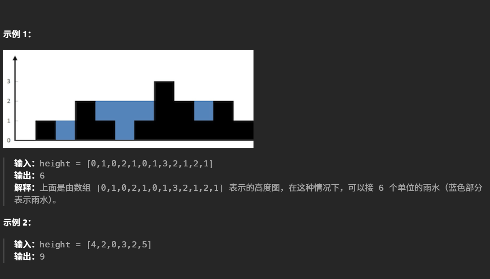

```
package leetcodehot100;

/**
 * @author 自然醒
 * @version 1.0
 */

/**
 * 接雨水
 * 给定n 个非负整数表示每个宽度为 1 的柱子的高度图，计算按此排列的柱子，下雨之后能接多少雨水。
 * 示例 1：
 * 输入：height = [0,1,0,2,1,0,1,3,2,1,2,1]
 * 输出：6
 * 解释：上面是由数组 [0,1,0,2,1,0,1,3,2,1,2,1] 表示的高度图，在这种情况下，可以接 6 个单位的雨水（蓝色部分）。
 * 示例 2：
 * 输入：height = [4,2,0,3,2,5]
 * 输出：9
 */
public class hot7 {
    /**
     * 分层计算雨水，找到最大高度，然后从1开始，找到比当前层高的，则开始计算雨水
     * 因为如果某一层比最大高度小，则无法接雨水，当前高度小于所在层高度，而此时存在两边高度都大于所在层高度，这个地方会存在雨水
     * 同时如果将整个图形划分为矩形再去减的话，数学模型过于难
     * @param height
     * @return
     */
    public static int trap(int[] height) {
        int res = 0;
        int maxHeight = findMax(height);
        for (int i = 1; i <= maxHeight; i++) {
            //标记是否更新
            boolean flag = false;
            //临时存储雨水
            int temp = 0;
            for (int j = 0; j < height.length; j++) {
                //存在一个大于等于所找层的最大高度时，此时可以开始更新雨水
                if(height[j] >= i){
                    res += temp;
                    temp = 0;
                    flag = true;
                }
                //存在一个小于所找层高度时，则开始计算雨水
                if(flag && height[j] < i){
                    temp++;
                }
            }
        }
        return res;
    }

    public static int findMax(int[] height) {
        int max = height[0];
        for (int i = 1; i < height.length; i++) {
            if (height[i] > max) {
                max = height[i];
            }
        }
        return max;
    }
}
```

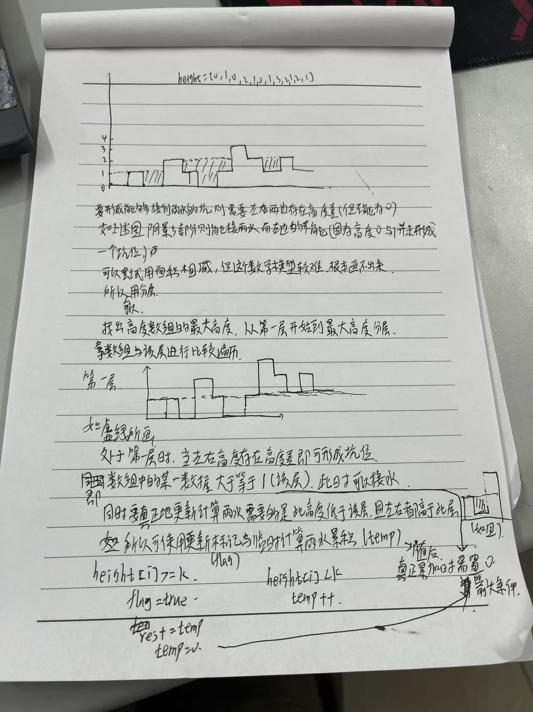

上述按层来计算雨水，相当于暴力，每层之中再进行遍历一次高度数组，找到最高高度即使只使用了O(n)，但是在遍历中有大量元素的情况下它所需要的也是O(n)，而且每次遍历均是同样的操作，导致最后会到达O(n^2)

按列计算：

```
/**
 * 根据列来求解
 * @param height
 * @return
 */
public static int trap(int[] height) {
    int res = 0;
    //两端肯定接不住雨水，所以从1到length - 1
    for(int i = 1; i < height.length - 1; i++){
        int maxLeft = 0;
        //找到当前列左边最高的柱子
        for(int j = i - 1; j >= 0; j--){
            maxLeft = Math.max(maxLeft, height[j]);
        }
        int maxRight = 0;
        //找到当前列右边最高的柱子
        for(int j = i + 1; j < height.length; j++){
            maxRight = Math.max(maxRight, height[j]);
        }
        //找出两端最高柱子中较小的
        int minHeight = Math.min(maxLeft, maxRight);
        //较小的一段大于当前列的高度才会有水，其他情况不会有水
        if(minHeight > height[i]){
            res += minHeight - height[i];
        }
    }
    return res;
}
```

求每一列的水，我们只需要关注当前列，以及左边最高的墙，右边最高的墙就够了。装水的多少，当然根据木桶效应，我们只需要看左边最高的墙和右边最高的墙中较矮的一个就够了

三种情况：

- **较矮的墙的高度大于当前列的墙的高度**
- 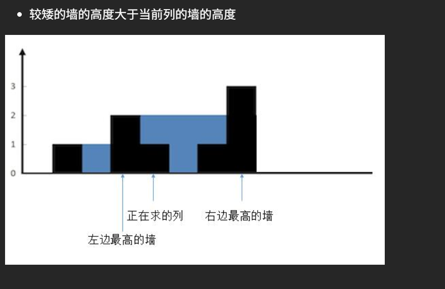
- 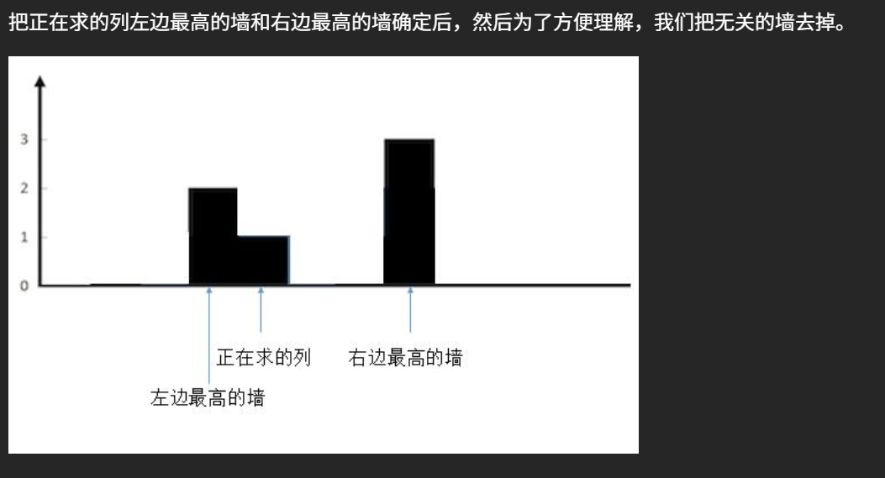
- 

1. **较矮的墙小于当前列的高度**
2. 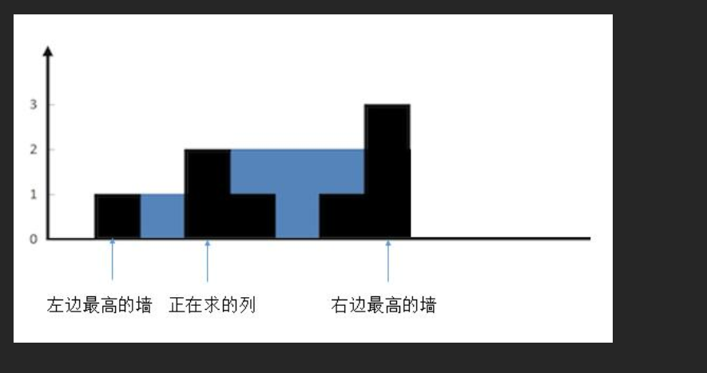
3. 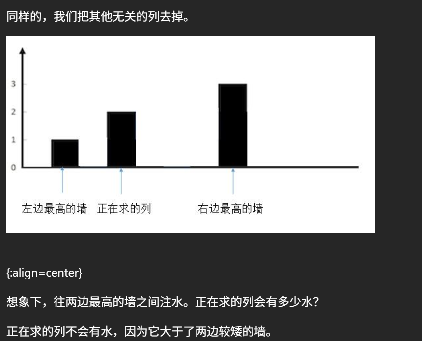

- **较矮的墙的高度等于当前列的墙的高度**，此时情况与上方一样，不会有水
- 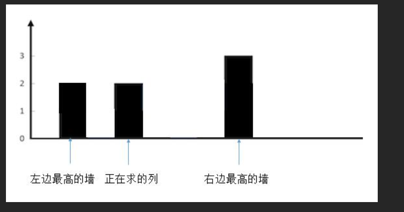

但此时也会超时，因为对于求左边和右边的最高墙时还是需要对所有墙进行一次遍历去比较，仍然是浪费在大数的遍历上

但如果左右两墙同时进行计算可以会变快

```
/**
 * 双指针接雨水
 * @param height
 * @return
 */
public static int trap(int[] height) {
    if (height == null || height.length == 0) {
        return 0;
    }
    int res = 0;
    int left = 0;//左指针
    int right = height.length - 1;//右指针
    int leftMax = 0;//左边最高柱子
    int rightMax = 0;//右边最高柱子
    while (left < right) {
        //如果左边柱子小于右边柱子
        if(height[left] < height[right]){
            //如果左边柱子比左边最高柱子高
            if(height[left] >= leftMax){
                //该柱子为最大柱子
                leftMax = height[left];
            }else{
                //此时柱子比左边最高柱子低
                //雨水等于左边最高柱子减去当前柱子
                res += leftMax - height[left];
            }
            //左指针向右移动
            left++;
        }else {
            //如果右边柱子比右边最高柱子高
            if(height[right] >= rightMax){
                //该柱子为最大柱子
                rightMax = height[right];
            }else{
                //此时柱子比右边最高柱子低
                //雨水等于右边最高柱子减去当前柱子
                res += rightMax - height[right];
            }
            right--;
        }
    }
    return res;
}
```

## 无重复字符的最长子串

```
package leetcodehot100;

/**
 * @author 自然醒
 * @version 1.0
 */

/**
 * 无重复字符的最长子串
 * 给定一个字符串s，请你找出其中不含有重复字符的最长子串的长度。
 * 子串：字符串中连续的非空字符序列
 * 示例1：
 * 输入：s = "abcabcbb"
 * 输出：3
 * 解释：因为无重复字符的最长子串是"abc"，所以其长度为3。"abc"和"bca"的长度都为3，但是"bca"的索引比"abc"的索引小，所以返回"abc"的长度3。
 * 示例2：
 * 输入：s = "bbbbb"
 * 输出：1
 * 解释：因为无重复字符的最长子串是"b"，所以其长度为1。
 * 示例3：
 * 输入：s = "pwwkew"
 * 输出：3
 * 解释：因为无重复字符的最长子串是"wke"，所以其长度为3。pwke是一个子序列，而不是子串。
 */
public class hot8 {
    public static int lengthOfLongestSubstring(String s) {
        int res = 0;
        char[] chars = s.toCharArray();
        for (int i = 0; i < chars.length; i++) {
            // 记录每个字符出现的次数
            int[] count = new int[128];
            // 当前子串长度
            int currentLength = 0;
            for(int j = i; j < chars.length; j++){
                char c = chars[j];
                //当前字符出现的次数
                count[c]++;
                System.out.println(count[c]);
                //当前字符出现的次数大于1，则说明当前子串重复了
                if(count[c] > 1){
                    break;
                }
                currentLength++;
                // 更新结果
                res = Math.max(res, currentLength);
            }
        }
        return res;
    }
}
```

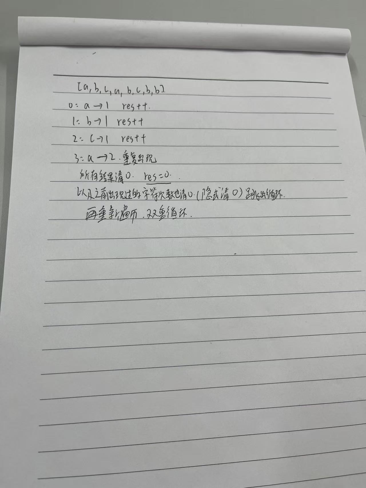

暴力破解。。。哈哈哈哈。。。过了。。。

其实可以使用java的map集合，去判断这个key是否已经有值，这样比较方便，同时维护窗口

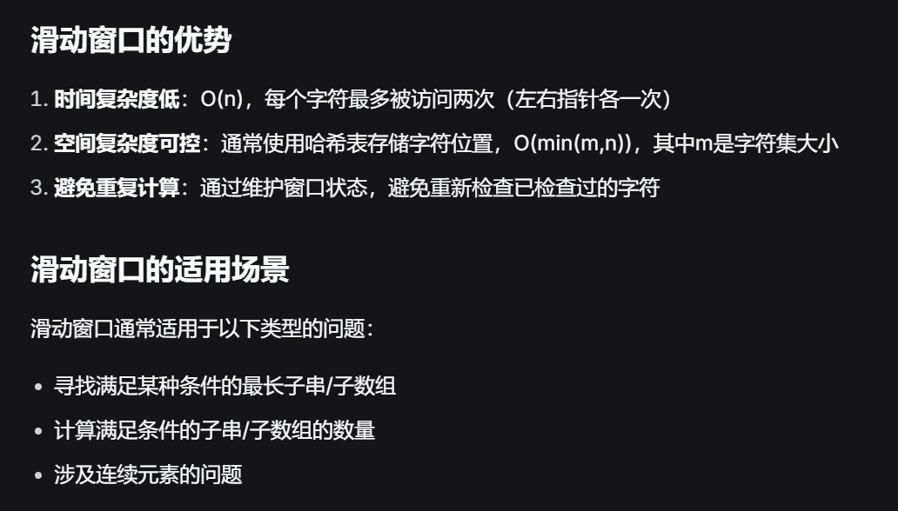

```
public static int lengthOfLongestSubstring(String s) {
    int res = 0;
    char[] chars = s.toCharArray();
    Map<Character, Integer> map = new HashMap<>();
    int left = 0; //左边窗口
    for (int right = 0; right < chars.length; right++) {
        char c = chars[right];
        // 如果字符已经在窗口中，并且位于当前窗口内
        if(map.containsKey(c) && map.get(c) >= left){
            // 更新左边窗口,移至下一字符的位置
            left = map.get(c) + 1;
            map.put(c, right);
        }
        //字符不在窗口中进行添加,更新字符的最新位置
        map.put(c, right);
        res = Math.max(res, right - left + 1);
    }
    return res;
}
```

## 找到字符串中所有字母异位词

```
package leetcodehot100;

/**
 * @author 自然醒
 * @version 1.0
 */

import java.util.ArrayList;
import java.util.Arrays;
import java.util.List;

/**
 * 找到字符串中所有字母异位词
 * 给定两个字符串s和p，找到s中所有p的异或词，并返回这些异或词的起始索引(s和p仅包含小写字母)
 * 示例1：
 * 输入：s = "cbaebabacd", p = "abc"
 * 输出：[0, 6]
 * 解释：
 * 起始索引等于0的子串是"cba", 它与p的异或结果为0
 * 起始索引等于6的子串是"bac", 它与p的异或结果为0
 * 示例2：
 * 输入：s = "abab", p = "ab"
 * 输出：[0, 1, 2]
 * 解释：
 * 起始索引等于0的子串是"ab", 它与p的异或结果为0
 * 起始索引等于1的子串是"ba", 它与p的异或结果为0
 * 起始索引等于2的子串是"ab", 它与p的异或结果为0
 */
public class hot9 {
   public static List<Integer> findAnagrams(String s, String p) {
        int sLen = s.length();
        int pLen = p.length();
        if (sLen < pLen) {
            return new ArrayList<>();
        }
        List<Integer> res = new ArrayList<>();
        // 记录s、p中每个字母出现的次数，由于s和p只包含小写字母，所以数组长度为26
        int[] sCount = new int[26];
        int[] pCount = new int[26];
        for(int i = 0; i < pLen; i++){
            sCount[s.charAt(i) - 'a']++;
            pCount[p.charAt(i) - 'a']++;
        }
        // 判断sCount和pCount是否相等
        // 如果相等，则s[0, i]和p相等，则将i加入结果中
        if(Arrays.equals(sCount, pCount)){
            res.add(0);
        }
        // 从pLen开始，判断sCount和pCount是否相等
        for (int i = pLen; i < sLen; i++) {
            // 移除窗口左边的字符
            sCount[s.charAt(i - pLen) - 'a']--;
            // 添加窗口右边的字符
            sCount[s.charAt(i) - 'a']++;
            if(Arrays.equals(sCount, pCount)){
                res.add(i - pLen + 1);
            }
        }
        return res;
    }
}
```

上述题解是使用定长窗口，固定使用目标字符串的长度作为窗口，

先从初始化的第一个窗口进行比较，随后从以目标子串长度为索引，建立新窗口，新窗口的建立将左边的字符移除，右边添加即可形成新窗口

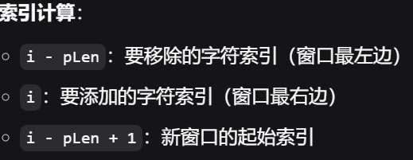

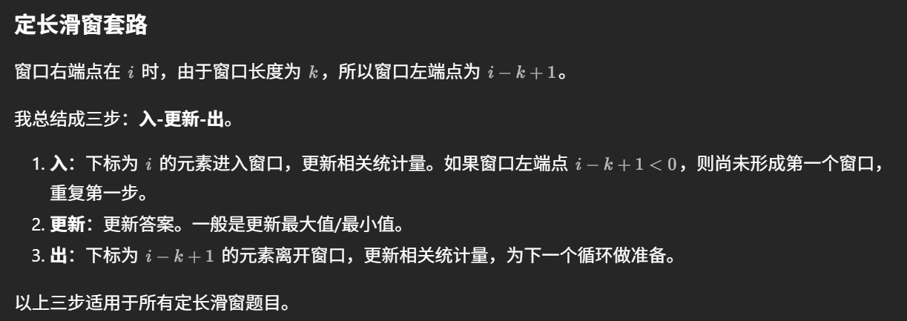

以下是模版代码（虽然上述的题解也是定长窗口，但是较难理解）

```
public List<Integer> findAnagrams(String s, String p) {
    List<Integer> ans = new ArrayList<>();
    int[] cntP = new int[26]; // 统计 p 的每种字母的出现次数
    int[] cntS = new int[26]; // 统计 s 的长为 p.length() 的子串 s' 的每种字母的出现次数
    for (char c : p.toCharArray()) {
        cntP[c - 'a']++; // 统计 p 的字母
    }
    for (int right = 0; right < s.length(); right++) {
        cntS[s.charAt(right) - 'a']++; // 右端点字母进入窗口
        int left = right - p.length() + 1;
        if (left < 0) { // 窗口长度不足 p.length()
            continue;
        }
        if (Arrays.equals(cntS, cntP)) { // s' 和 p 的每种字母的出现次数都相同
            ans.add(left); // s' 左端点下标加入答案
        }
        cntS[s.charAt(left) - 'a']--; // 左端点字母离开窗口
    }
    return ans;
}
```

不定长窗口，当学习。。。

```
public static List<Integer> findAnagrams(String s, String p) {
    int sLen = s.length();
    int pLen = p.length();
    if (sLen < pLen) {
        return new ArrayList<>();
    }
    List<Integer> res = new ArrayList<>();
    int[] pCount = new int[26];//记录p中每个字母出现的次数
    for (char c : p.toCharArray()) {
        pCount[c - 'a']++;
    }
    int left = 0;
    for(int right = 0; right < sLen; right++){
        int idx = s.charAt(right) - 'a';//获取当前字符的索引
        pCount[idx]--;//右端点进入窗口
        while (pCount[idx] < 0) {
            //如果此时的字符的个数小于0，说明窗口中的字符已经超出了p的范围
            // 移除窗口左端的字符
            pCount[s.charAt(left) - 'a']++;
            left++;
        }
        // 判断窗口大小是否等于p的大小 子串和目标串的出现次数一致
        if (right - left + 1 == pLen) {
            res.add(left);
        }
    }
    return res;
}
```

窗口主要由right和left进行构建


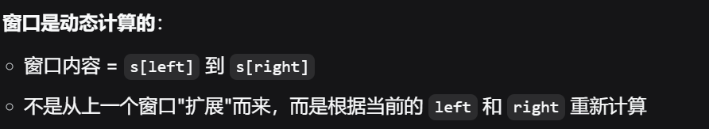

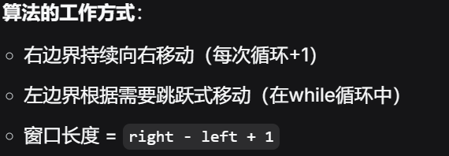

##和为K的子数组

```
package leetcodehot100;

/**
 * @author 自然醒
 * @version 1.0
 */

/**
 * 和为K的子数组
 * 给定一个整数数组nums和一个整数k，请统计并返回该数组中和为k的子数组的个数
 * 子数组是数组中元素的连续非空序列
 * 示例1：
 * 输入：nums = [1,1,1], k = 2
 * 输出：2
 * 示例2：
 * 输入：nums = [1,2,3], k = 3
 * 输出：2
 */
public class hot10 {

    public static int subarraySum(int[] nums, int k){
        int count = 0;
        for(int left = 0; left < nums.length; left++){
            int sum = 0;
            for(int right = left; right < nums.length; right++){
                sum += nums[right];
                if(sum == k){
                    count++;
                }
            }
        }
        return count;
    }
}
```

暴力解法，枚举所有的子数组可能性即可，但此时时间复杂为O(n^2)

使用滑动窗口，过不了，因为滑动窗口大多都是需要正数的情况下

```
public static int subarraySum(int[] nums, int k){
    int count = 0;
    int left = 0;
    int sum = 0;
    for(int right = 0; right < nums.length; right++){
        sum += nums[right];
        while(sum > k && left <= right){
            sum -= nums[left];
            left++;
        }
        if(sum == k){
            count++;
        }
    }
    return count;
}
```

最优解使用前缀和＋哈希映射

前缀和即：起始索引到所求位置索引的所有数据之和

prefixSum[i] = nums[0] + nums[1] + ... + nums[i-1]

通过前缀和可以求出任意的的区间[L，R]的和

rangeSum = prefixSum[r + 1] - prefixSum[l]

```
public static int subarraySum(int[] nums, int k){
    int count = 0;
    Map<Integer, Integer> map = new HashMap<>();
    int sum = 0;
    //初始化前缀和为空数组
    map.put(0, 1);
    for (int num : nums) {
        sum += num;
        //判断当前位置的前缀和是否等于k
        //sum - k为前缀和减去k，如果map中存在这个数，则说明存在和为k的子数组
        if (map.containsKey(sum - k)) {
            //等于即进行累加
            count += map.get(sum - k);
        }
        //添加当前位置的和进入集合中
        map.put(sum, map.getOrDefault(sum, 0) + 1);
    }
    return count;
}
```

sum - k为当前位置的和减去目标值，如果存放前缀和的集合中包含这个数值，则可以证明此时前一个前缀和的数组为子数组并且满足条件

## 滑动窗口最大值

```
package leetcodehot100;

/**
 * @author 自然醒
 * @version 1.0
 */

import java.util.ArrayList;
import java.util.Arrays;

/**
 * 滑动窗口最大值
 * 给一个整数数组nums，有一个大小为k的滑动窗口从数组的最左侧移动到数组的最右侧。你只可以看到在滑动窗口内的k个数字。滑动窗口每次只向右移动一位。
 * 返回滑动窗口中的最大值
 * 示例1：
 * 输入：nums = [1,3,-1,-3,5,3,6,7], k = 3
 * 输出：[3,3,5,5,6,7]
 * 解释：
 * 滑动窗口的位置                最大值
 * [1  3  -1] -3  5  3  6  7       3
 *  1 [3  -1  -3] 5  3  6  7       3
 *  1  3 [-1  -3  5] 3  6  7       5
 *  1  3  -1 [-3  5  3] 6  7       5
 *  1  3  -1  -3 [5  3  6] 7       6
 *  1  3  -1  -3  5 [3  6  7]       7
 *  示例2；
 *  输入：nums = [1], k = 1
 *  输出：[1]
 */
public class hot11 {

    public static int[] maxSlidingWindow(int[] nums, int k) {
        ArrayList<Integer> res = new ArrayList<>();
        for(int right = 0; right < nums.length; right++){
            int max = Integer.MIN_VALUE;
            int left = right - k + 1;
            if(left < 0){
                continue;
            }
            for(int i = left; i <= right; i++){
                max = Math.max(max, nums[i]);
            }
            res.add(max);
        }
        return res.stream().mapToInt(Integer::intValue).toArray();
    }
}
```

求滑动窗口那当然是使用滑动窗口来求解，但是超时了。。。笑死个人

定长的滑动窗口，因为它已经明确表示窗口的大小，直接构造窗口即可（真的可惜超时）

最优解是双端队列（单调队列）

使用一个双端队列（Deque）来维护当前窗口内**可能成为最大值**的元素索引。队列保持单调递减，队首始终是当前窗口的最大值

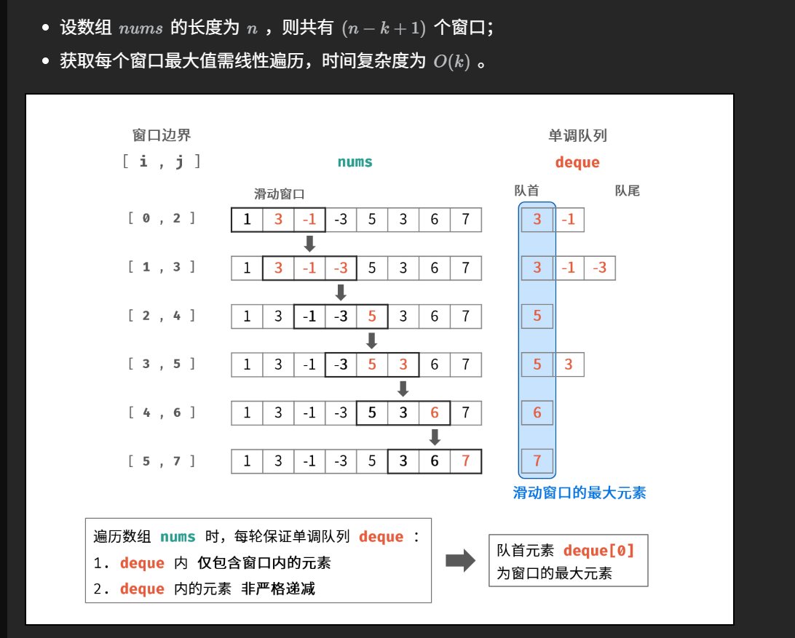

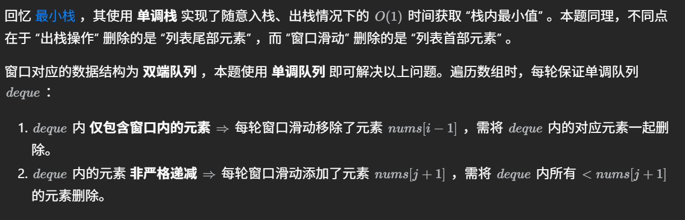

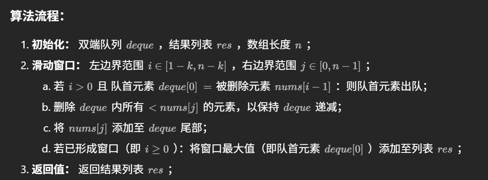

```
public static int[] maxSlidingWindow(int[] nums, int k) {
    if( nums == null || nums.length == 0 || k <= 0)
        return new int[0];
    Deque<Integer> deque = new LinkedList<>();
    int[] res = new int[nums.length - k + 1];
    // 未形成窗口
    for(int i = 0; i < k; i++) {
        while(!deque.isEmpty() && deque.peekLast() < nums[i])
            deque.removeLast();
        deque.addLast(nums[i]);
    }
    res[0] = deque.peekFirst();
    // 形成窗口后
    for(int i = k; i < nums.length; i++) {
        if(deque.peekFirst() == nums[i - k])
            deque.removeFirst();
        while(!deque.isEmpty() && deque.peekLast() < nums[i])
            deque.removeLast();
        deque.addLast(nums[i]);
        res[i - k + 1] = deque.peekFirst();
    }
    return res;
}
```

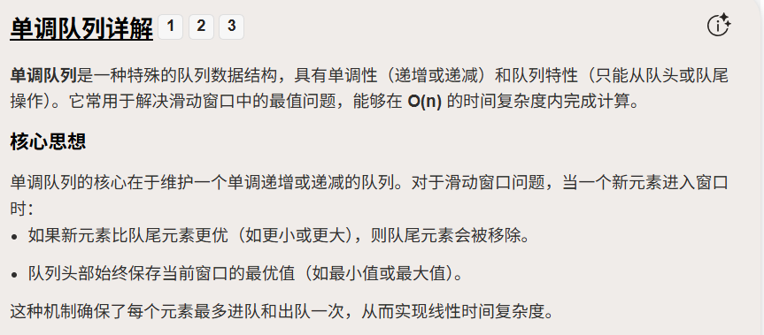

## 覆盖最小子串

```
package leetcodehot100;

/**
 * @author 自然醒
 * @version 1.0
 */

import java.util.HashMap;
import java.util.Map;

/**
 * 覆盖最小子串
 * 给一个字符串s、一个字符串t，返回s中包含t的最短子串。如果s中不存在包含t的子串，则返回空字符串""。
 * 注意：
 * 对于t 中的重复字符，我们寻找的子字符串中该字符数量必须不少于t 中该字符数量。
 * 如果s中存在这样的子串，我们保证它是唯一的答案。
 * 示例 1：
 * 输入：s = "ADOBECODEBANC", t = "ABC"
 * 输出："BANC"
 * 解释：最小覆盖子串 "BANC" 包含来自字符串 t 的 'A'、'B' 和 'C'。
 * 示例 2：
 * 输入：s = "a", t = "a"
 * 输出："a"
 * 解释：整个字符串 s 是最小覆盖子串。
 * 示例 3:
 * 输入: s = "a", t = "aa"
 * 输出: ""
 * 解释: t 中两个字符 'a' 均应包含在 s 的最小覆盖子串中。因此，在 s 中没有符合条件的子字符串，返回空字符串。
 */
public class hot12 {

    public static String minWindow(String s, String t) {
        int left = 0;
        int[] sCount = new int[128];
        int[] tCount = new int[128];
        for (char c : t.toCharArray()) {
            tCount[c]++;
        }
        int minStart = -1;
        int minEnd = s.length();
        for (int right = 0; right < s.length(); right++) {
            sCount[s.charAt(right)]++;
            while (isCovered(sCount, tCount)) {
                if (right - left < minEnd - minStart) {
                    minStart = left;
                    minEnd = right;
                }
                sCount[s.charAt(left)]--;
                left++;
            }
        }
        return minStart < 0 ? "" : s.substring(minStart, minEnd + 1);
    }

    private static boolean isCovered(int[] sCount, int[] tCount) {
        for (int i = 'A'; i <= 'Z'; i++) {
            if (sCount[i] < tCount[i]) {
                return false;
            }
        }
        for (int i = 'a'; i <= 'z'; i++) {
            if (sCount[i] < tCount[i]) {
                return false;
            }
        }
        return true;
    }
}
```

别人的解题思路：

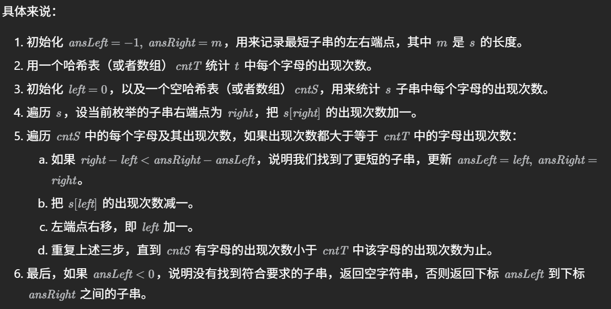

## 最大子数组和

```
package leetcodehot100;

/**
 * @author 自然醒
 * @version 1.0
 */

/**
 * 最大子数组和
 * 给一个整数数组，找到一个连续的子数组，使得其和最大。要求时间复杂度为O(n)
 * 子数组是数组中的一个连续部分
 * 示例1：
 * 输入：[-2,1,-3,4,-1,2,1,-5,4]
 * 输出：6
 * 解释：连续子数组[4,-1,2,1]的和最大，为6
 * 示例2：
 * 输入：[1]
 * 输出：1
 * 示例3：
 * 输入：[5,4,-1,7,8]
 * 输出：23
 */
public class hot13 {
    public static int maxSubArray(int[] nums) {
        int sum = 0;
        int max = Integer.MIN_VALUE;
        int left = 0;
        for(int right = 0; right < nums.length; right++){
            sum += nums[right];
            max = Math.max(sum, max);
            //因为可能存在sum小于0的情况，此时小于0则重置窗口
            //此时的左指针并没有用到
            if(sum < 0){
                sum = 0;
                left = right + 1;
            }
        }
        return max;
    }
}
```

上述为滑动窗口解法，嘻嘻嘻 过了。。。

超过百分百，上述滑动窗口中的left并不需要维持，因为用不到

动态规划解法（会不了一定动态规划，看别人题解）：

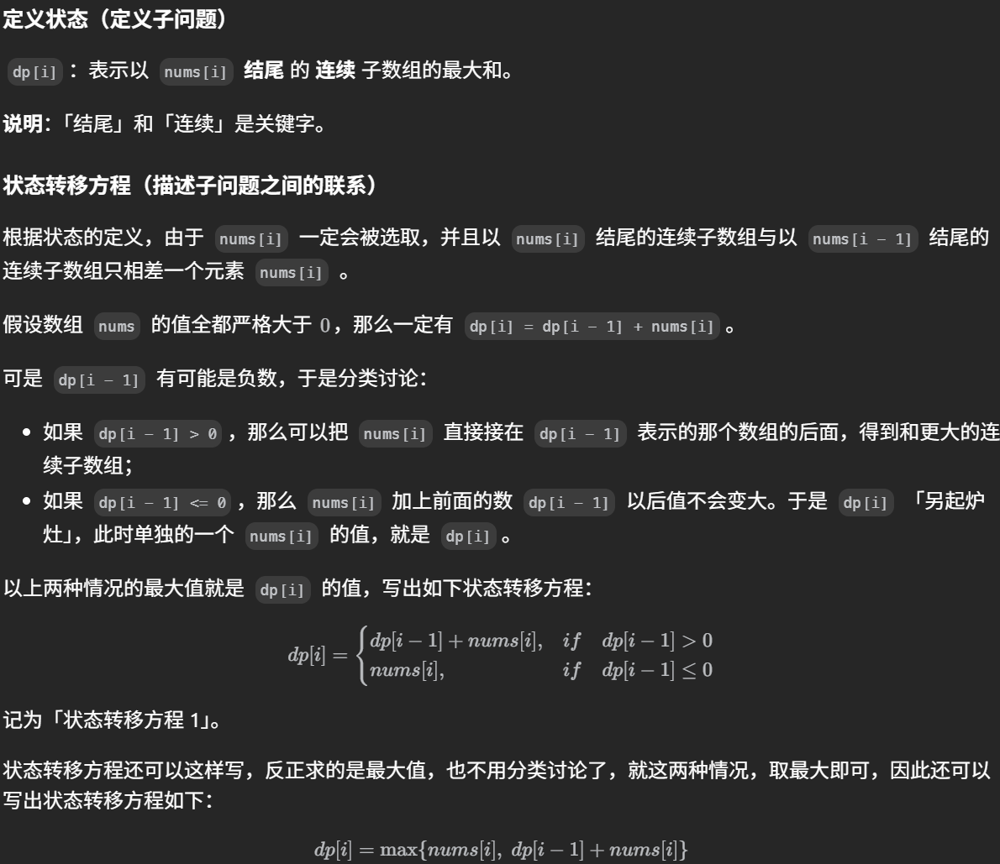

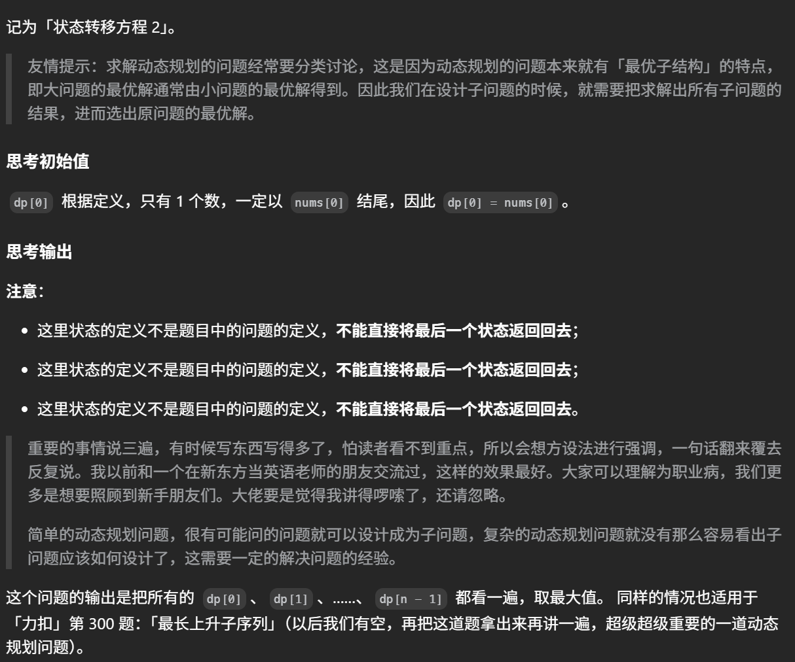

```
public static int maxSubArray(int[] nums) {
   int[] dp = new int[nums.length];
   //dp[i]表示以nums[i]为结尾的连续子数组的最大和
   dp[0] = nums[0];
   int max = 0;
   for(int i = 1; i < nums.length; i++){
       if(dp[i-1] > 0){
           dp[i] = dp[i-1] + nums[i];
       }else{
           dp[i] = nums[i];
       }
       max = Math.max(max, dp[i]);
   }
   return max;
}
```

## 合并区间

```
package leetcodehot100;

/**
 * @author 自然醒
 * @version 1.0
 */

import java.util.ArrayList;
import java.util.Arrays;
import java.util.List;

/**
 * 合并区间
 * 以数组intervals表示若干个区间的集合，其中单个区间为intervals[i] = [starti, endi]。请你合并所有重叠的区间，并返回一个不重叠的区间数组。
 * 示例1：
 * 输入：intervals = [[1,3],[2,6],[8,10],[15,18]]
 * 输出：[[1,6],[8,10],[15,18]]
 * 解释：区间 [1,3] 和 [2,6] 重叠，将它们合并为 [1,6]。
 * 示例2：
 * 输入：intervals = [[1,4],[4,5]]
 * 输出：[[1,5]]
 * 解释：区间 [1,4] 和 [4,5] 可被视为重叠区间。
 * 示例3：
 * 输入：intervals = [[4,7],[1,4]]
 * 输出：[[1,7]]
 * 解释：区间 [1,4] 和 [4,7] 可被视为重叠区间。
 */
public class hot14 {

    public static int[][] merge(int[][] intervals) {
        if(intervals.length <= 1){
            return intervals;
        }
        //对其进行排序，按每一组的左端点排序，从小到大
        Arrays.sort(intervals, (a, b) -> a[0] - b[0]);
        //创建列表存储
        List<int[]> res = new ArrayList<>();
        //排序之后，第一个区间肯定是最小的，先添加进去
        res.add(intervals[0]);
        for (int i = 1; i < intervals.length; i++) {
            int[] cur = intervals[i];
            int[] last = res.get(res.size() - 1);
            //如果当前区间的左端点小于等于前一个区间的右端点，则说明有重叠
            if(cur[0] <= last[1]){
                //合并区间，取当前区间的右端点与前一个区间的右端点取最大值
                last[1] = Math.max(last[1], cur[1]);
            }else{
                //没有重叠，则添加
                res.add(cur);
            }
        }
        return res.toArray(new int[res.size()][]);
    }
}
```

读半天题目才懂，主要理解是当前区间的左端点与前一个区间的右端点进行比较，如果存在当前区间的左端点小于等于前一个的右端点，此时可以合并，即它们之间是一个包含关系，右包含了左，即它们两个连续即可

## 轮转数组

```
package leetcodehot100;

/**
 * @author 自然醒
 * @version 1.0
 */

/**
 * 轮转数组
 * 给定一个整数数组nums，将数组中的元素向右轮转k个位置（从数组末尾开始计数）。
 * 示例1：
 * 输入：nums = [1,2,3,4,5,6,7], k = 3
 * 输出：[5,6,7,1,2,3,4]
 * 解释：
 * 向右轮转 1 步: [7,1,2,3,4,5,6]
 * 向右轮转 2 步: [6,7,1,2,3,4,5]
 * 向右轮转 3 步: [5,6,7,1,2,3,4]
 * 示例2：
 * 输入：nums = [-1,-100,3,99], k = 2
 * 输出：[3,99,-1,-100]
 * 解释：
 * 向右轮转 1 步: [99,-1,-100,3]
 * 向右轮转 2 步: [3,99,-1,-100]
 */
public class hot15 {

    public static void main(String[] args) {
        int[] nums = {1,2,3,4,5,6,7};
        rotate(nums, 3);
        for (int i = 0; i < nums.length; i++) {
            System.out.print(nums[i] + " ");
        }
    }
    public static void rotate(int[] nums, int k) {
        if(nums == null || nums.length == 0){
            return;
        }
        int n = nums.length;
        k = k % n;
        if (k == 0) {
            return;
        }
        reverse(nums,0,n-1);
        reverse(nums,0,k-1);
        reverse(nums,k,n-1);
    }

    public static void reverse(int[] nums, int start, int end) {
        while (start < end) {
            int temp = nums[start];
            nums[start] = nums[end];
            nums[end] = temp;
            start++;
            end--;
        }
    }
}
```

此方法使用了三次反转数组，将数组分为两个部分，根据移的位数进行反转

先反转整个数组，再反转移位的前k个数，最后反转k~n-1个数

还有一种解法，在笔记数据结构与算法中。。。通过最小公倍数进行移动

## 除自身以外数组的乘积

```
package leetcodehot100;

/**
 * @author 自然醒
 * @version 1.0
 */

/**
 * 除自身以外数组的乘积
 * 给一个整数数组nums，返回数组answer，其中answer[i]等于nums中除nums[i]之外其余各元素的乘积
 * 题目数据 保证 nums中任意元素的全部前缀元素和后缀（甚至是整个数组）的乘积都在 32 位 整数范围内
 * O(n)时间完成
 * 示例1：
 * 输入：nums = [1,2,3,4]
 * 输出：[24,12,8,6]
 * 示例2：
 * 输入：nums = [-1,1,0,-3,3]
 * 输出：[0,0,9,0,0]
 */
public class hot16 {

    public static int[] productExceptSelf(int[] nums) {
        int len = nums.length;
        int[] ans = new int[len];
        ans[0] = 1;
        for(int i = 1; i < len; i++){
            ans[i] = ans[i - 1] * nums[i - 1];
        }
        int right = 1;
        for(int i = len - 1; i >= 0; i--){
            ans[i] = ans[i] * right;
            right *= nums[i];
        }
        return ans;
    }
}
```

主要思想：

前缀和成为前缀乘积，求除自身以外的数的积，即要求该目标位置左右两边数的积的总积

先求左边积，再求右边积，最后总积为左边总积与右边总积的积即可

## 寻找两个正序数组的中位数

```
package leetcodehot100;

/**
 * @author 自然醒
 * @version 1.0
 */

import java.util.ArrayList;
import java.util.Arrays;
import java.util.List;

/**
 * 寻找两个正序数组的中位数
 * 给定两个大小分别为m和n的正序（从小到大）数组nums1和nums2。请你找出并返回这两个正序数组的 中位数 。
 * 算法时间复杂度应该为O(log(m+n))
 * 示例1：
 * 输入：nums1 = [1,3], nums2 = [2]
 * 输出：2.00000
 * 解释：
 * 合并数组 = [1,2,3] ，中位数 2
 * 示例2：
 * 输入：nums1 = [1,2], nums2 = [3,4]
 * 输出：2.50000
 * 解释：
 * 合并数组 = [1,2,3,4] ，中位数 (2 + 3) / 2 = 2.5
 */
public class hot17 {

    public static double findMedianSortedArrays(int[] nums1, int[] nums2) {
        int[] merge = merge(nums1, nums2);
        int len = merge.length;
        // 如果数组的长度是奇数，则中位数是中间的数
        // 如果是偶数，则中位数是中间两个数的平均值
        if(len % 2 != 0){
            return merge[len / 2];
        }else{
            return (merge[len / 2] + merge[len / 2 - 1]) / 2.0;
        }
    }

    //合并两个数组的同时并且进行排序
    private static int[] merge(int[] nums1, int[] nums2) {
        int len1 = nums1.length;
        int len2 = nums2.length;
        List<Integer> res = new ArrayList<>();
        for (int i = 0; i < len1; i++) {
            res.add(nums1[i]);
        }
        for (int i = 0; i < len2; i++) {
            res.add(nums2[i]);
        }
        int[] ans = new int[res.size()];
        for (int i = 0; i < res.size(); i++) {
            ans[i] = res.get(i);
        }
        Arrays.sort(ans);
        return ans;
    }


}
```

天才，第一道hard过了，虽然是击败的是百分之5.27，但是能过也是很牛皮了。。。我的时间复杂为O((m+n)log(m+n))，天才。。。

思路就比较简单了，代码中均有注释，主要中位数需要分情况讨论罢了，看最后合并数组的长度

以下是优化（题解）：

使用二分查找，其实我看不懂解析，然后还有一个更优的时间复杂

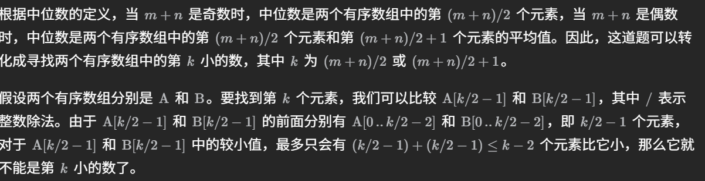

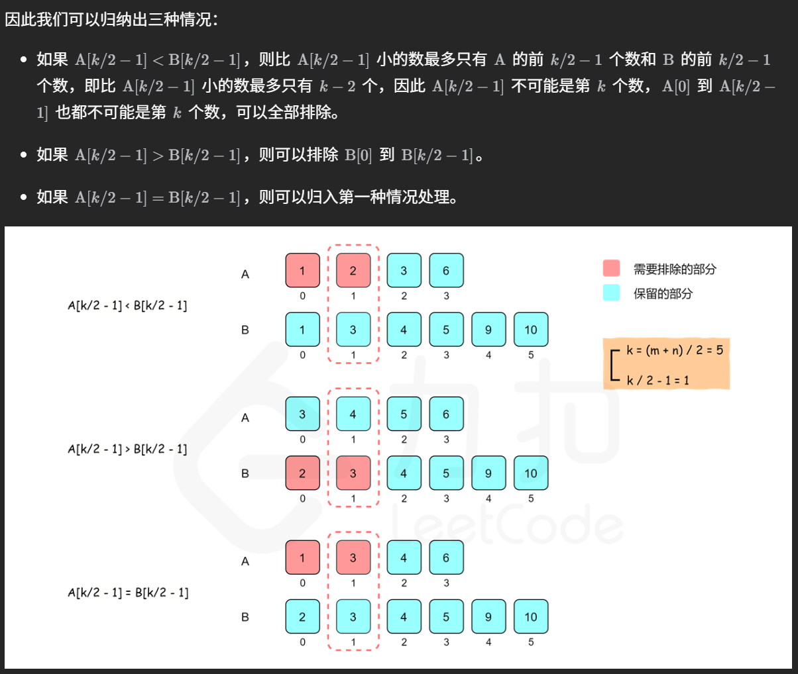

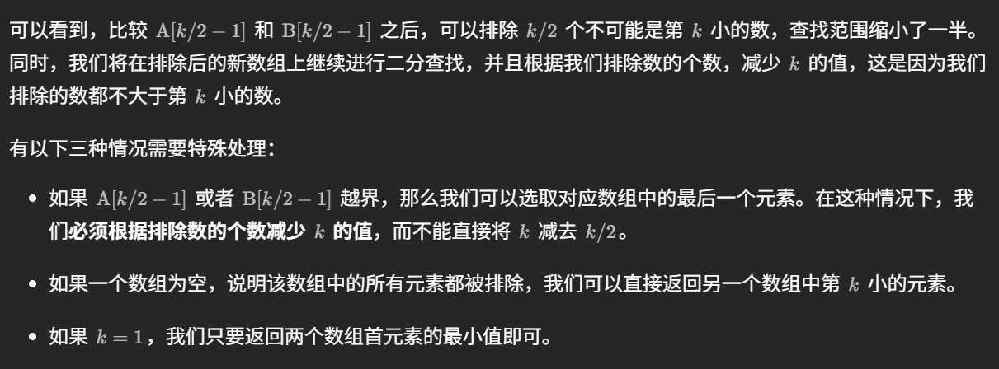

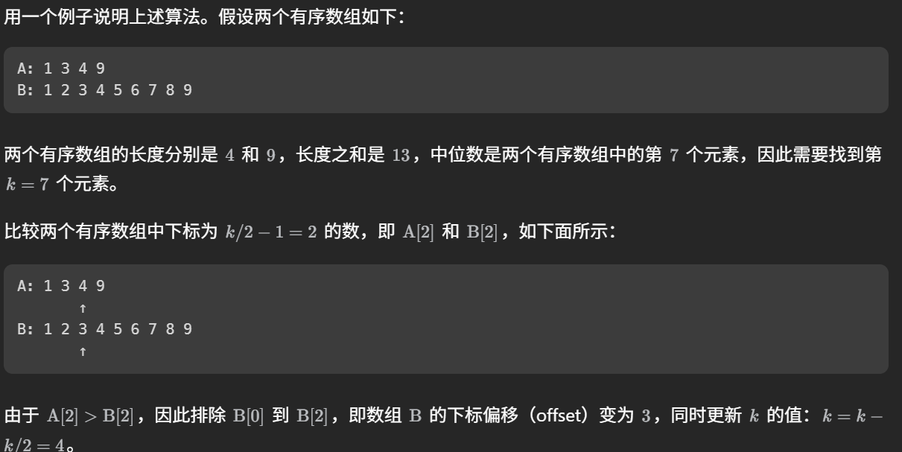

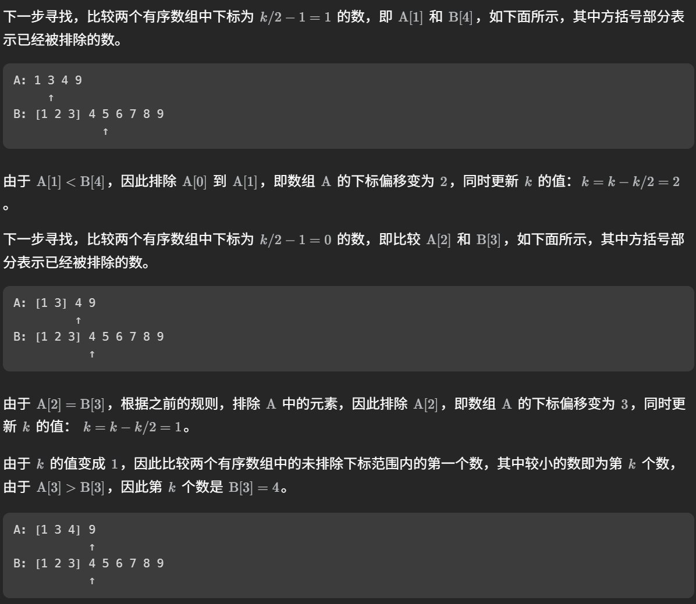

```
public static double findMedianSortedArrays(int[] nums1, int[] nums2) {
    int length1 = nums1.length, length2 = nums2.length;
    int totalLength = length1 + length2;
    if (totalLength % 2 == 1) {
        int midIndex = totalLength / 2;
        double median = getKthElement(nums1, nums2, midIndex + 1);
        return median;
    } else {
        int midIndex1 = totalLength / 2 - 1, midIndex2 = totalLength / 2;
        double median = (getKthElement(nums1, nums2, midIndex1 + 1) + getKthElement(nums1, nums2, midIndex2 + 1)) / 2.0;
        return median;
    }
}

public static int getKthElement(int[] nums1, int[] nums2, int k) {
    /* 主要思路：要找到第 k (k>1) 小的元素，那么就取 pivot1 = nums1[k/2-1] 和 pivot2 = nums2[k/2-1] 进行比较
     * 这里的 "/" 表示整除
     * nums1 中小于等于 pivot1 的元素有 nums1[0 .. k/2-2] 共计 k/2-1 个
     * nums2 中小于等于 pivot2 的元素有 nums2[0 .. k/2-2] 共计 k/2-1 个
     * 取 pivot = min(pivot1, pivot2)，两个数组中小于等于 pivot 的元素共计不会超过 (k/2-1) + (k/2-1) <= k-2 个
     * 这样 pivot 本身最大也只能是第 k-1 小的元素
     * 如果 pivot = pivot1，那么 nums1[0 .. k/2-1] 都不可能是第 k 小的元素。把这些元素全部 "删除"，剩下的作为新的 nums1 数组
     * 如果 pivot = pivot2，那么 nums2[0 .. k/2-1] 都不可能是第 k 小的元素。把这些元素全部 "删除"，剩下的作为新的 nums2 数组
     * 由于我们 "删除" 了一些元素（这些元素都比第 k 小的元素要小），因此需要修改 k 的值，减去删除的数的个数
     */

    int length1 = nums1.length, length2 = nums2.length;
    int index1 = 0, index2 = 0;
    int kthElement = 0;

    while (true) {
        // 边界情况
        if (index1 == length1) {
            return nums2[index2 + k - 1];
        }
        if (index2 == length2) {
            return nums1[index1 + k - 1];
        }
        if (k == 1) {
            return Math.min(nums1[index1], nums2[index2]);
        }

        // 正常情况
        int half = k / 2;
        int newIndex1 = Math.min(index1 + half, length1) - 1;
        int newIndex2 = Math.min(index2 + half, length2) - 1;
        int pivot1 = nums1[newIndex1], pivot2 = nums2[newIndex2];
        if (pivot1 <= pivot2) {
            k -= (newIndex1 - index1 + 1);
            index1 = newIndex1 + 1;
        } else {
            k -= (newIndex2 - index2 + 1);
            index2 = newIndex2 + 1;
        }
    }
}
```

## 缺失的第一个正数

```
package leetcodehot100;

/**
 * @author 自然醒
 * @version 1.0
 */

/**
 * 缺失的第一个正数
 * 给定一个未排序的整数数组nums，找出其中没有出现的最小的正整数。
 * 实现时间复杂度为O(n)，并且只使用常数级别额外空间。
 * 输入：[1,2,0]
 * 输出：3
 * 解释：范围为[1,2]，因此缺失的正整数为3。
 * 输入：[3,4,-1,1]
 * 输出：2
 * 解释：1在数组中，因此缺失的正整数为2。
 * 输入：[7,8,9,11,12]
 * 输出：1
 * 解释：最小的正整数为1没有出现
 */
public class hot18 {

    public static int firstMissingPositive(int[] nums) {
        int n = nums.length;
        for(int i = 0; i < n; i++){
            // 将当前元素与它应该在的位置进行交换
            // 如果当前元素小于等于0或者大于n或者当前元素在它应该在的位置，则跳过
            while(nums [i] > 0 && nums [i] <= n && nums [nums [i] - 1] != nums [i]){
                swap(nums, i, nums [i] - 1);
            }
        }
        for(int i = 0; i < n; i++){
            if(nums [i] != i + 1){
                return i + 1;
            }
        }
        return n + 1;
    }

    public static void swap(int[] nums, int i, int j){
        int temp = nums [i];
        nums [i] = nums [j];
        nums [j] = temp;
    }
}
```

解题思路：

缺失的第一个正数即该元素属于范围[1,N]中，所以对于任何n <= 0的数都可以不返回。此外可以理解到n属于[1,N]中的话，可以如此进行具体化数据，因为数组下标均是从0开始的，所以当数组有序时，比如[1,2,3]，此时1对应的下标为0,2对应的为1，3对应的2，而此时这个数组中未出现的最小正数会为4，它的下标为3。

所以我们可以得到规律，在一个有序的数组中，它所对应的下标为

idx = nums[i] - 1

所以有序的数组对应的缺失最小正数可以以下标进行返回 idx + 1

如果当前的数组元素均是连续的且在数组长度范围内即可直接返回当前数组长度＋1

如果大于长度的话也是通过下标返回


还有一个官解，使用标记，将数组设计为哈希表

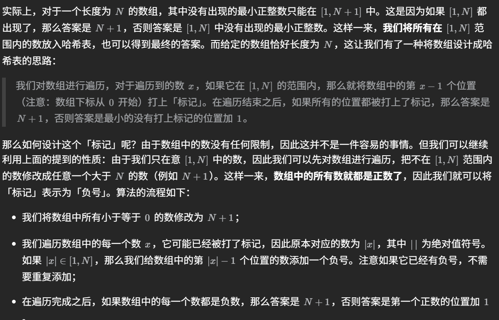

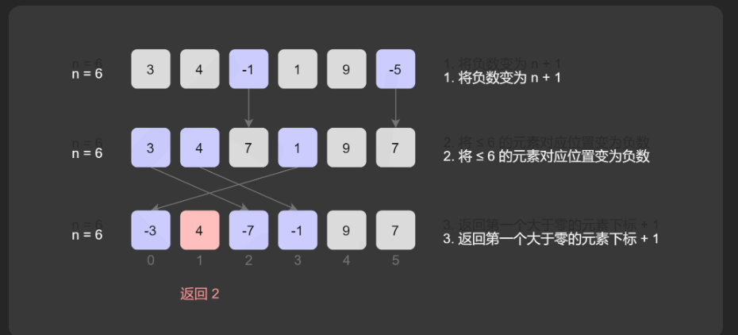

```
class Solution {
    public int firstMissingPositive(int[] nums) {
        int n = nums.length;
        for (int i = 0; i < n; ++i) {
            if (nums[i] <= 0) {
                nums[i] = n + 1;
            }
        }
        for (int i = 0; i < n; ++i) {
            int num = Math.abs(nums[i]);
            if (num <= n) {
                nums[num - 1] = -Math.abs(nums[num - 1]);
            }
        }
        for (int i = 0; i < n; ++i) {
            if (nums[i] > 0) {
                return i + 1;
            }
        }
        return n + 1;
    }
}
```

## 矩阵置零

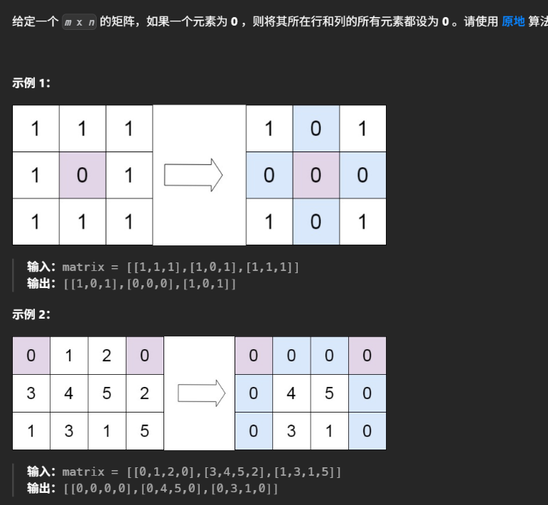

```
package leetcodehot100;

/**
 * @author 自然醒
 * @version 1.0
 */

/**
 * 矩阵置零
 * 输入一个m*n的矩阵，将矩阵中元素为0的行和列置零 使用原地算法
 * 输入：matrix = [[1,1,1],[1,0,1],[1,1,1]]
 * 输出：[[1,0,1],[0,0,0],[1,0,1]]
 * 输入：matrix = [[0,1,2,0],[3,4,5,2],[1,3,1,5]]
 * 输出：[[0,0,0,0],[0,4,5,0],[0,3,1,0]]
 */
public class hot19 {
    public static void setZeroes(int[][] matrix) {
        //当前行列
        int row = matrix.length;
        int col = matrix[0].length;
        //创建一个标记二维数组，用来记录当前行和列是否为0
        boolean[][] visited = new boolean[row][col];
        //初始化
        visited[0][0] = false;
        //遍历矩阵
        for (int i = 0; i < row; i++) {
            for (int j = 0; j < col; j++) {
                //矩阵中为0的行和列标记为true
                if (matrix[i][j] == 0) {
                    visited[i][j] = true;
                }
            }
        }
        //遍历标记数组
        for (int i = 0; i < row; i++) {
            for (int j = 0; j < col; j++) {
                //标记为true的行和列置零
                if (visited[i][j]) {
                    for (int k = 0; k < col; k++) {
                        matrix[i][k] = 0;
                    }
                    for (int k = 0; k < row; k++) {
                        matrix[k][j] = 0;
                    }
                }
            }
        }
    }
}

```

直接遍历标记即可，我感觉需要剪枝的，但一提交过了。。。哈哈哈哈。。。

官方的题解使用单个标记量

```
class Solution {
    public void setZeroes(int[][] matrix) {
        int m = matrix.length, n = matrix[0].length;
        boolean flagCol0 = false;
        for (int i = 0; i < m; i++) {
            if (matrix[i][0] == 0) {
                flagCol0 = true;
            }
            for (int j = 1; j < n; j++) {
                if (matrix[i][j] == 0) {
                    matrix[i][0] = matrix[0][j] = 0;
                }
            }
        }
        for (int i = m - 1; i >= 0; i--) {
            for (int j = 1; j < n; j++) {
                if (matrix[i][0] == 0 || matrix[0][j] == 0) {
                    matrix[i][j] = 0;
                }
            }
            if (flagCol0) {
                matrix[i][0] = 0;
            }
        }
    }
}
```

