# LeetCode-Hot-100

## 两数之和

```
package leetcodehot100;

/**
 * @author 自然醒
 * @version 1.0
 */

/**
 * 两数之和
 * 给定一个整数数组 nums 和一个整数目标值 target，请你在该数组中找出 和为目标值 target  的那 两个 整数，并返回它们的数组下标。
 * 你可以假设每种输入只会对应一个答案。但是，数组中同一个元素在答案里不能重复出现。
 * 你可以按任意顺序返回答案。
 * 示例 1：
 * 输入：nums = [2,7,11,15], target = 9
 * 输出：[0,1]
 * 解释：因为 nums[0] + nums[1] == 9 ，返回 [0, 1] 。
 * 示例 2：
 * 输入：nums = [3,2,4], target = 6
 * 输出：[1,2]
 * 示例 3：
 * 输入：nums = [3,3], target = 6
 * 输出：[0,1]
 */
public class hot1 {
    public static void main(String[] args) {
        int[] nums = {2, 7, 11, 15};
        int target = 9;
        int[] ints = twoSum(nums, target);
        for (int anInt : ints) {
            System.out.println(anInt);
        }
    }
    public static int[] twoSum(int[] nums, int target) {
        int[] res = new int[2];
        for(int i = 0; i < nums.length; i++){
            for(int j = i + 1; j < nums.length; j++){
                if(nums[i] + nums[j] == target){
                    res[0] = i;
                    res[1] = j;
                    return res;
                }
            }
        }
        res[0] = -1;
        res[1] = -1;
        return res;
    }
}
```

暴力枚举遍历数组，时间复杂为O(n^2)

```
public static int[] twoSum(int[] nums, int target) {
    HashMap<Integer, Integer> map = new HashMap<>();
    for (int i = 0; i < nums.length; i++) {
        int isExit = target - nums[i];
        if(map.containsKey(isExit)){
            return new int[]{map.get(isExit), i};
        }
        map.put(nums[i], i);
    }
  return new int[]{-1, -1};
}
```

以上是hash优化，主要使用Hash表特性，存储数字以及对应的索引，k-v键值对存储（此时数字为key值，索引为value值），遍历数组，然后求其对应的target-nums[i]补数，使用api判断当前是否已经存在该值，存在的话则直接返回对应的索引，不存在则添加至hashmap中，进行下一次判断

## 字母异或词分组

```
package leetcodehot100;

/**
 * @author 自然醒
 * @version 1.0
 */

import java.util.*;

/**
 * 字母异或词分组
 * 字母异位词：通过重新排列不同单词或短语的字母而形成的单词或短语，并使用所有原字母一次
 * 给定一个字符串数组，将字母异位词组合在一起。可以按任意顺序返回结果。
 * 示例1：
 * 输入: strs = ["eat", "tea", "tan", "ate", "nat", "bat"]
 * 输出: [["bat"],["nat","tan"],["ate","eat","tea"]]
 * 解释：
 * 数组中没有任何字符串可以通过重新排列形成"bat"
 * 字符串"eat"、"tea"和"ate"可以重新排列形成彼此
 * "tan"、"nat"可以重新排列形成彼此
 * 示例2：
 * 输入: strs = [""]
 * 输出: [[""]]
 * 示例3：
 * 输入: strs = ["a"]
 * 输出: [["a"]]
 */
public class hot2 {
    public static List<List<String>> groupAnagrams(String[] strs) {
        Map<String, List<String>> map = new HashMap<>();
        for (String str : strs) {
            char[] chars = str.toCharArray();
            Arrays.sort(chars);
            String key = new String(chars);
            if(!map.containsKey( key)){
                map.put(key, new ArrayList<>());
            }
            map.get(key).add(str);
        }
        return new ArrayList<>(map.values());
    }
}
```

该题解法主要思想为**特征提取+哈希分组**

**特征提取的核心思想**：将复杂数据转换为能够代表其本质特征的简化表示

- 将不同形式的相同内容映射到相同的特征表示
- 此题则是将"eat"、"tea"、"ate"映射到特征"aet"
- 消除排列顺序的影响，只保留本质的字母组成信息

**哈希分组的核心思想**：使用特征作为键，将具有相同特征的数据聚合在一起。

主要利用哈希表的O(1)查找特性

"特征提取+哈希分组"模式可以应用于很多类似问题：

1. **分组回文串**：提取特征为排序后的字符串
2. **按字符串长度分组**：提取特征为字符串长度
3. **按数字各位数之和分组**：提取特征为各位数字之和
4. **按自定义规则分组**：任何可以提取出分组依据特征的问题

上述时间复杂为O(n*k * logk )，主要的时间复杂浪费在排序

可以采用计数+哈希，减去了排序的时间

```
public List<List<String>> groupAnagrams(String[] strs) {
    Map<String, List<String>> map = new HashMap<>();
    
    for (String str : strs) {
        // 创建字符计数数组
        int[] count = new int[26];
        for (char c : str.toCharArray()) {
            count[c - 'a']++;
        }
        
        // 将计数数组转换为字符串作为键
        StringBuilder keyBuilder = new StringBuilder();
        for (int i = 0; i < 26; i++) {
            if (count[i] > 0) {
                keyBuilder.append((char)('a' + i)).append(count[i]);
            }
        }
        String key = keyBuilder.toString();
        
        if (!map.containsKey(key)) {
            map.put(key, new ArrayList<>());
        }
        map.get(key).add(str);
    }
    
    return new ArrayList<>(map.values());
}
```

一种可以用来学习的操作，按需使用，**懒加载（Lazy Initialization）**

```
 public List<List<String>> groupAnagrams(String[] strs) {
     return new AbstractList<>() {
     // 只需要实现get()和size()两个抽象方法
    // 其他方法（如iterator(), contains()等）有默认实现
            List<List<String>> list;
            private void init() {
                if (list != null)
                    return;
                Map<String, List<String>> strMap = new HashMap<>();
                for (String str : strs) {
                    char[] charArr = str.toCharArray();
                    Arrays.sort(charArr);
                    String strSorted = new String(charArr);
                    if (!strMap.containsKey(strSorted)) {
                        strMap.put(strSorted, new ArrayList<>());
                    }
                    strMap.get(strSorted).add(str);
                }
                list = new ArrayList<>(strMap.values());
            }
            @Override
            public List<String> get(int index) {
                init();
                return list.get(index);
            }
            @Override
            public int size() {
                init();
                return list.size();
            }
        };
    }
```

此种方法，如果不去调用结果，它永远不会执行计算，如果是需要部分结果，它也不会直接去计算全部，而是只计算需要的内容

- **不立即计算**：创建对象时并不执行实际计算
- **按需计算**：只有在真正需要数据时才执行计算
- **结果缓存**：计算一次后缓存结果，后续调用直接使用缓存


## 最长连续序列

```
package leetcodehot100;

/**
 * @author 自然醒
 * @version 1.0
 */

/**
 * 最长连续序列
 * 给定一个未排序的整数数组 nums ，找出数字连续的最长序列（不要求序列元素在原数组中连续）的长度。
 * 设计一个算法的时间复杂度为 O(n) 。
 * 示例 1：
 * 输入：nums = [100,4,200,1,3,2]
 * 输出：4
 * 解释：最长数字连续序列是 [1, 2, 3, 4]。它的长度为 4。
 * 示例 2：
 * 输入：nums = [0,3,7,2,5,8,4,6,0,1]
 * 输出：9
 * 解释：最长数字连续序列是 [0, 1, 2, 3, 4, 5, 6, 7, 8]。它的长度为 9。
 * 示例3 :
 * 输入：nums = [1,0,1,2]
 * 输出：3
 */
public class hot3 {
    public static int longestConsecutive(int[] nums) {
        if(nums == null){
            return 0;
        }
        if(nums.length == 0){
            return 0;
        }
        insertSort(nums);
        int current_length = 1;
        int max_length = 1;
        for(int i = 1; i < nums.length; i++){
            if(nums[i] == nums[i - 1] + 1){
                current_length++;
            } else if (nums[i] == nums[i-1]) {
                continue;
            } else{
                current_length = 1;
            }
            max_length = Math.max(current_length, max_length);
        }
        return max_length;
    }

    public static void insertSort(int[] nums){
        for(int i = 1; i < nums.length; i++){
            int base = nums[i];
            int idx = i - 1;
            while(idx >= 0 && nums[idx] > base){
                nums[idx + 1] = nums[idx];
                idx--;
            }
            nums[idx + 1] = base;
        }
    }
}
```

时间超出限制，我真笑了。。。

```
public static int longestConsecutive(int[] nums) {
    Set<Integer> set = new HashSet<>();
    for (int num : nums) {
        set.add(num);
    }
    int max_length = 0;
    for (int num : set) {
        int current = num;
        // 只有当num-1不存在时，才开始向后遍历num+1，num+2，num+3......
        if(!set.contains(current - 1)){
            while (set.contains(current + 1)) {
                current++;
            }
        }
        max_length = Math.max(max_length, current - num + 1);
    }
    return max_length;
}
```

直接使用Set集合即可，第一种方法主要浪费在排序的时间，虽然插入排序最好可以达到O(n)，但是如果是超大数或者逆序的排序数组，此时它的时间会为O(n^2)

Set集合的思路

1. 将所有数字存入Set（O(n)）
2. 遍历Set中的每个数字
3. 只有当当前数字是某个连续序列的起点（即num-1不存在）时，才开始向后寻找连续数字
4. 记录最长的序列长度


```
public static int longestConsecutive(int[] nums) {
    if (nums == null || nums.length == 0) {
        return 0;
    }
    HashMap<Integer, Integer> map = new HashMap<>();
    int maxLength = 0;
    int currentLength = 0;
    for (int num : nums) {
        while(!map.containsKey(num)){
            int left = map.getOrDefault(num - 1, 0);
            int right = map.getOrDefault(num + 1, 0);
            currentLength = left + right + 1;
            maxLength = Math.max(maxLength, currentLength);
            map.put(num,-1);
            map.put(num-left,currentLength);
            map.put(num+right,currentLength);
        }
    }
    return maxLength;
}
```

```
public static int longestConsecutive(int[] nums) {
    if (nums == null || nums.length == 0) {
        return 0;
    }
    HashMap<Integer, Integer> map = new HashMap<>();
    int maxLength = 0;
    //创建一个哈希表,将数组中的元素添加到哈希表中
    for (int num : nums) {
        map.put(num, num);
    }
    //遍历数组
    for (int num : nums) {
        //后续如果不存在该键值则会退出，证明数组中不存在该数字
        if(map.containsKey(num)){
            //获取当前数字的右边数字
            int right = map.get(num);
            //当前数字的右边是否存在，存在即将键值删除，这样可以实现一个最小元素到最大元素的序列
            while(map.containsKey(right + 1)){
                map.remove(right);
                right = map.get(right + 1);
            }
            map.put(num, right);
            maxLength = Math.max(maxLength,right - num + 1);
        }
    }
    return maxLength;
}
```

## 移动零

```
package leetcodehot100;

/**
 * @author 自然醒
 * @version 1.0
 */

/**
 * 移动零
 * 给定一个数组 nums，编写一个函数将所有 0 移动到数组的末尾，同时保持非零元素的相对顺序。
 * 请注意 ，必须在不复制数组的情况下原地对数组进行操作。
 * 输入: nums = [0,1,0,3,12]
 * 输出: [1,3,12,0,0]
 * 输入: nums = [0]
 * 输出: [0]
 */
public class hot4 {
    public static void moveZeros(int[] nums){
        if(nums == null || nums.length == 0){
            return;
        }
        int index = 0;
        for(int i = 0; i < nums.length; i++){
            if(nums[i] != 0){
             int temp = nums[i];
             nums[i] = nums[index];
             nums[index] = temp;
             index++;
            }
        }
    }
}
```

普通的解法，暴力遍历进行交换，此时自己跟自己发生了一次交换，多一次交换，所以可以再多一个条件if(index != i)可以少一次交换

进价：减少它交换的操作次数，填充0总比交换速度快

```
public static void moveZeros(int[] nums){
    if(nums == null || nums.length == 0){
        return;
    }
    int index = 0;
    // 遍历数组，将非零元素移动到数组的左边
    for(int i = 0; i < nums.length; i++){
        if(nums[i] != 0){
            nums[index++] = nums[i];
        }
    }
    // 填充数组的剩余元素为0
    while(index < nums.length){
        nums[index++] = 0;
    }
}
```

## 盛最多水的容器


题目意思即是求最大的面积即可

所以需要求出间隔的两条线之间的能够围成的图形的最小高度以及它们之间的宽度即可


```
package leetcodehot100;

/**
 * @author 自然醒
 * @version 1.0
 */

/**
 * 盛最多水的容器
 * 给定一个长度为 n 的整数数组 height 。有n条垂线，第 i 条线的两个端点是 (i, 0) 和 (i, height[i]) 。
 * 找出其中的两条线，使得它们与 x 轴共同构成的容器可以容纳最多的水。
 * 返回容器可以储存的最大水量。
 * 注意：你不能倾斜容器。
 * 示例 1：
 * 输入：height = [1,8,6,2,5,4,8,3,7]
 * 输出：49
 * 解释：图中垂直线代表输入数组 [1,8,6,2,5,4,8,3,7]。在此情况下，容器能够容纳水（表示为蓝色部分）的最大值为 49。
 * 示例 2：
 * 输入：height = [1,1]
 * 输出：1
 */
public class hot5 {
    public static int maxArea(int[] height) {
        if(height == null || height.length == 0){
            return 0;
        }
        int area = 0;
        for(int  i = 0; i < height.length; i++){
            for(int j = i + 1; j < height.length; j++){
                int minHeight = Math.min(height[i], height[j]);
                int width = j - i;
                area = Math.max(area, minHeight * width);
            }
        }
        return area;
    }
}
```

可惜又是超时的一次。。。

使用双指针解可以的，但是需要理解其移动状态


```
public static int maxArea(int[] height) {
    if (height == null || height.length == 0) {
        return 0;
    }
    int area = 0;
    int left = 0;
    int right = height.length - 1;
    while (left < right) {
        int minHeight = Math.min(height[left], height[right]);
        int width = right - left;
        area = Math.max(area, minHeight * width);
        if (height[left] < height[right]) {
            left++;
        } else {
            right--;
        }
    }
    return area;
}
```

## 三数之和

```
package leetcodehot100;

/**
 * @author 自然醒
 * @version 1.0
 */

import java.util.ArrayList;
import java.util.Arrays;
import java.util.List;

/**
 * 三数之和
 * 给一个整数数组nums，判断是否存在三元组 [nums[i], nums[j], nums[k]] 满足i != j, i != k, j != k, 且nums[i] + nums[j] + nums[k] == 0
 * 请返回所有和为0且不重复的三元组
 * 注意：答案中不可以包含重复的三元组
 * 示例1：
 * 输入：nums = [-1, 0, 1, 2, -1, -4]
 * 输出：[[-1, -1, 2], [-1, 0, 1]]
 * 解释：
 * nums[0] + nums[1] + nums[2] = (-1) + 0 + 1 = 0
 * nums[1] + nums[2] + nums[4] = 0 + 1 + (-1) = 0
 * nums[0] + nums[3] + nums[4] = (-1) + 2 + (-1) = 0
 * 不同的三元组是 [-1, 0, 1] 和 [-1, -1, 2]
 * 输出的顺序和三元组的顺序不重要
 * 示例2：
 * 输入：nums = [0, 0, 0]
 * 输出：[[0, 0, 0]]
 * 解释：唯一可能的三元组和为 0
 * 示例3：
 * 输入：nums = [0, 1, 1]
 * 输出：[]
 * 解释：唯一可能得三元组和不为0
 */
public class hot6 {
    public static List<List<Integer>> threeSum(int[] nums) {
        List<List<Integer>> res = new ArrayList<>();
        if (nums == null || nums.length < 3) {
            return res;
        }
        //先将数组进行排序
        Arrays.sort(nums);
        for (int i = 0; i < nums.length; i++) {
            //数组中全是大于0的数不可能满足要求
            if (nums[i] > 0) {
                return res;
            }
            //剪枝，去掉重复的数，防止出现重复元组
            if (i > 0 && nums[i] == nums[i - 1]) {
                continue;
            }
            for (int j = i + 1; j < nums.length; j++) {
                //剪枝，去掉重复的数，防止出现重复元组
                if (j > i + 1 && nums[j] == nums[j - 1]) {
                    continue;
                }
                for (int k = j + 1; k < nums.length; k++) {
                    //剪枝，如果当前数和后面的数之和大于0，则后面的数不可能满足要求
                    if (k > j + 1 && nums[k] == nums[k - 1]) {
                        continue;
                    }
                    if (nums[i] + nums[j] + nums[k] == 0) {
                        List<Integer> list = new ArrayList<>();
                        list.add(nums[i]);
                        list.add(nums[j]);
                        list.add(nums[k]);
                        res.add(list);
                    }
                }
            }
        }
        return res;
    }
}
```

依旧超时，暴力写法无敌了。。。三重循环无需多想，最坏肯定是O(n^3)

```
public static List<List<Integer>> threeSum(int[] nums) {
    List<List<Integer>> res = new ArrayList<>();
    if (nums == null || nums.length < 3) {
        return res;
    }
    //先将数组进行排序
    Arrays.sort(nums);
    for(int i = 0; i < nums.length - 2; i++){
        //数组中全是大于0的数不可能满足要求
        if (nums[i] > 0) {
            return res;
        }
        //剪枝，去掉重复的数，防止出现重复元组
        if (i > 0 && nums[i] == nums[i - 1]) {
            continue;
        }
        int left = i + 1;
        int right = nums.length - 1;
        while(left < right){
            int sum = nums[i] + nums[left] + nums[right];
            if(sum == 0){
                res.add(Arrays.asList(nums[i], nums[left], nums[right]));
                //去掉重复的数，防止出现重复元组
                while(left < right && nums[left] == nums[left + 1]){
                    left++;
                }
                //去掉重复的数，防止出现重复元组
                while(left < right && nums[right] == nums[right - 1]){
                    right--;
                }
                left++;
                right--;
            } else if (sum < 0) {
                left++;
            }else{
                right--;
            }
        }
    }
    return res;
}
```

注意双指针剪枝之后需要对指针进行动态变化，否则出现内存爆掉，我提交几次才发现，怎么提交不上去，原来是内存爆了

## 接雨水


```
package leetcodehot100;

/**
 * @author 自然醒
 * @version 1.0
 */

/**
 * 接雨水
 * 给定n 个非负整数表示每个宽度为 1 的柱子的高度图，计算按此排列的柱子，下雨之后能接多少雨水。
 * 示例 1：
 * 输入：height = [0,1,0,2,1,0,1,3,2,1,2,1]
 * 输出：6
 * 解释：上面是由数组 [0,1,0,2,1,0,1,3,2,1,2,1] 表示的高度图，在这种情况下，可以接 6 个单位的雨水（蓝色部分）。
 * 示例 2：
 * 输入：height = [4,2,0,3,2,5]
 * 输出：9
 */
public class hot7 {
    /**
     * 分层计算雨水，找到最大高度，然后从1开始，找到比当前层高的，则开始计算雨水
     * 因为如果某一层比最大高度小，则无法接雨水，当前高度小于所在层高度，而此时存在两边高度都大于所在层高度，这个地方会存在雨水
     * 同时如果将整个图形划分为矩形再去减的话，数学模型过于难
     * @param height
     * @return
     */
    public static int trap(int[] height) {
        int res = 0;
        int maxHeight = findMax(height);
        for (int i = 1; i <= maxHeight; i++) {
            //标记是否更新
            boolean flag = false;
            //临时存储雨水
            int temp = 0;
            for (int j = 0; j < height.length; j++) {
                //存在一个大于等于所找层的最大高度时，此时可以开始更新雨水
                if(height[j] >= i){
                    res += temp;
                    temp = 0;
                    flag = true;
                }
                //存在一个小于所找层高度时，则开始计算雨水
                if(flag && height[j] < i){
                    temp++;
                }
            }
        }
        return res;
    }

    public static int findMax(int[] height) {
        int max = height[0];
        for (int i = 1; i < height.length; i++) {
            if (height[i] > max) {
                max = height[i];
            }
        }
        return max;
    }
}
```


上述按层来计算雨水，相当于暴力，每层之中再进行遍历一次高度数组，找到最高高度即使只使用了O(n)，但是在遍历中有大量元素的情况下它所需要的也是O(n)，而且每次遍历均是同样的操作，导致最后会到达O(n^2)

按列计算：

```
/**
 * 根据列来求解
 * @param height
 * @return
 */
public static int trap(int[] height) {
    int res = 0;
    //两端肯定接不住雨水，所以从1到length - 1
    for(int i = 1; i < height.length - 1; i++){
        int maxLeft = 0;
        //找到当前列左边最高的柱子
        for(int j = i - 1; j >= 0; j--){
            maxLeft = Math.max(maxLeft, height[j]);
        }
        int maxRight = 0;
        //找到当前列右边最高的柱子
        for(int j = i + 1; j < height.length; j++){
            maxRight = Math.max(maxRight, height[j]);
        }
        //找出两端最高柱子中较小的
        int minHeight = Math.min(maxLeft, maxRight);
        //较小的一段大于当前列的高度才会有水，其他情况不会有水
        if(minHeight > height[i]){
            res += minHeight - height[i];
        }
    }
    return res;
}
```

求每一列的水，我们只需要关注当前列，以及左边最高的墙，右边最高的墙就够了。装水的多少，当然根据木桶效应，我们只需要看左边最高的墙和右边最高的墙中较矮的一个就够了

三种情况：

- **较矮的墙的高度大于当前列的墙的高度**
- 
- 
- 

1. **较矮的墙小于当前列的高度**
2. 
3. 

- **较矮的墙的高度等于当前列的墙的高度**，此时情况与上方一样，不会有水
- 

但此时也会超时，因为对于求左边和右边的最高墙时还是需要对所有墙进行一次遍历去比较，仍然是浪费在大数的遍历上

但如果左右两墙同时进行计算可以会变快

```
/**
 * 双指针接雨水
 * @param height
 * @return
 */
public static int trap(int[] height) {
    if (height == null || height.length == 0) {
        return 0;
    }
    int res = 0;
    int left = 0;//左指针
    int right = height.length - 1;//右指针
    int leftMax = 0;//左边最高柱子
    int rightMax = 0;//右边最高柱子
    while (left < right) {
        //如果左边柱子小于右边柱子
        if(height[left] < height[right]){
            //如果左边柱子比左边最高柱子高
            if(height[left] >= leftMax){
                //该柱子为最大柱子
                leftMax = height[left];
            }else{
                //此时柱子比左边最高柱子低
                //雨水等于左边最高柱子减去当前柱子
                res += leftMax - height[left];
            }
            //左指针向右移动
            left++;
        }else {
            //如果右边柱子比右边最高柱子高
            if(height[right] >= rightMax){
                //该柱子为最大柱子
                rightMax = height[right];
            }else{
                //此时柱子比右边最高柱子低
                //雨水等于右边最高柱子减去当前柱子
                res += rightMax - height[right];
            }
            right--;
        }
    }
    return res;
}
```

## 无重复字符的最长子串

```
package leetcodehot100;

/**
 * @author 自然醒
 * @version 1.0
 */

/**
 * 无重复字符的最长子串
 * 给定一个字符串s，请你找出其中不含有重复字符的最长子串的长度。
 * 子串：字符串中连续的非空字符序列
 * 示例1：
 * 输入：s = "abcabcbb"
 * 输出：3
 * 解释：因为无重复字符的最长子串是"abc"，所以其长度为3。"abc"和"bca"的长度都为3，但是"bca"的索引比"abc"的索引小，所以返回"abc"的长度3。
 * 示例2：
 * 输入：s = "bbbbb"
 * 输出：1
 * 解释：因为无重复字符的最长子串是"b"，所以其长度为1。
 * 示例3：
 * 输入：s = "pwwkew"
 * 输出：3
 * 解释：因为无重复字符的最长子串是"wke"，所以其长度为3。pwke是一个子序列，而不是子串。
 */
public class hot8 {
    public static int lengthOfLongestSubstring(String s) {
        int res = 0;
        char[] chars = s.toCharArray();
        for (int i = 0; i < chars.length; i++) {
            // 记录每个字符出现的次数
            int[] count = new int[128];
            // 当前子串长度
            int currentLength = 0;
            for(int j = i; j < chars.length; j++){
                char c = chars[j];
                //当前字符出现的次数
                count[c]++;
                System.out.println(count[c]);
                //当前字符出现的次数大于1，则说明当前子串重复了
                if(count[c] > 1){
                    break;
                }
                currentLength++;
                // 更新结果
                res = Math.max(res, currentLength);
            }
        }
        return res;
    }
}
```


暴力破解。。。哈哈哈哈。。。过了。。。

其实可以使用java的map集合，去判断这个key是否已经有值，这样比较方便，同时维护窗口


```
public static int lengthOfLongestSubstring(String s) {
    int res = 0;
    char[] chars = s.toCharArray();
    Map<Character, Integer> map = new HashMap<>();
    int left = 0; //左边窗口
    for (int right = 0; right < chars.length; right++) {
        char c = chars[right];
        // 如果字符已经在窗口中，并且位于当前窗口内
        if(map.containsKey(c) && map.get(c) >= left){
            // 更新左边窗口,移至下一字符的位置
            left = map.get(c) + 1;
            map.put(c, right);
        }
        //字符不在窗口中进行添加,更新字符的最新位置
        map.put(c, right);
        res = Math.max(res, right - left + 1);
    }
    return res;
}
```

## 找到字符串中所有字母异位词

```
package leetcodehot100;

/**
 * @author 自然醒
 * @version 1.0
 */

import java.util.ArrayList;
import java.util.Arrays;
import java.util.List;

/**
 * 找到字符串中所有字母异位词
 * 给定两个字符串s和p，找到s中所有p的异或词，并返回这些异或词的起始索引(s和p仅包含小写字母)
 * 示例1：
 * 输入：s = "cbaebabacd", p = "abc"
 * 输出：[0, 6]
 * 解释：
 * 起始索引等于0的子串是"cba", 它与p的异或结果为0
 * 起始索引等于6的子串是"bac", 它与p的异或结果为0
 * 示例2：
 * 输入：s = "abab", p = "ab"
 * 输出：[0, 1, 2]
 * 解释：
 * 起始索引等于0的子串是"ab", 它与p的异或结果为0
 * 起始索引等于1的子串是"ba", 它与p的异或结果为0
 * 起始索引等于2的子串是"ab", 它与p的异或结果为0
 */
public class hot9 {
   public static List<Integer> findAnagrams(String s, String p) {
        int sLen = s.length();
        int pLen = p.length();
        if (sLen < pLen) {
            return new ArrayList<>();
        }
        List<Integer> res = new ArrayList<>();
        // 记录s、p中每个字母出现的次数，由于s和p只包含小写字母，所以数组长度为26
        int[] sCount = new int[26];
        int[] pCount = new int[26];
        for(int i = 0; i < pLen; i++){
            sCount[s.charAt(i) - 'a']++;
            pCount[p.charAt(i) - 'a']++;
        }
        // 判断sCount和pCount是否相等
        // 如果相等，则s[0, i]和p相等，则将i加入结果中
        if(Arrays.equals(sCount, pCount)){
            res.add(0);
        }
        // 从pLen开始，判断sCount和pCount是否相等
        for (int i = pLen; i < sLen; i++) {
            // 移除窗口左边的字符
            sCount[s.charAt(i - pLen) - 'a']--;
            // 添加窗口右边的字符
            sCount[s.charAt(i) - 'a']++;
            if(Arrays.equals(sCount, pCount)){
                res.add(i - pLen + 1);
            }
        }
        return res;
    }
}
```

上述题解是使用定长窗口，固定使用目标字符串的长度作为窗口，

先从初始化的第一个窗口进行比较，随后从以目标子串长度为索引，建立新窗口，新窗口的建立将左边的字符移除，右边添加即可形成新窗口


以下是模版代码（虽然上述的题解也是定长窗口，但是较难理解）

```
public List<Integer> findAnagrams(String s, String p) {
    List<Integer> ans = new ArrayList<>();
    int[] cntP = new int[26]; // 统计 p 的每种字母的出现次数
    int[] cntS = new int[26]; // 统计 s 的长为 p.length() 的子串 s' 的每种字母的出现次数
    for (char c : p.toCharArray()) {
        cntP[c - 'a']++; // 统计 p 的字母
    }
    for (int right = 0; right < s.length(); right++) {
        cntS[s.charAt(right) - 'a']++; // 右端点字母进入窗口
        int left = right - p.length() + 1;
        if (left < 0) { // 窗口长度不足 p.length()
            continue;
        }
        if (Arrays.equals(cntS, cntP)) { // s' 和 p 的每种字母的出现次数都相同
            ans.add(left); // s' 左端点下标加入答案
        }
        cntS[s.charAt(left) - 'a']--; // 左端点字母离开窗口
    }
    return ans;
}
```

不定长窗口，当学习。。。

```
public static List<Integer> findAnagrams(String s, String p) {
    int sLen = s.length();
    int pLen = p.length();
    if (sLen < pLen) {
        return new ArrayList<>();
    }
    List<Integer> res = new ArrayList<>();
    int[] pCount = new int[26];//记录p中每个字母出现的次数
    for (char c : p.toCharArray()) {
        pCount[c - 'a']++;
    }
    int left = 0;
    for(int right = 0; right < sLen; right++){
        int idx = s.charAt(right) - 'a';//获取当前字符的索引
        pCount[idx]--;//右端点进入窗口
        while (pCount[idx] < 0) {
            //如果此时的字符的个数小于0，说明窗口中的字符已经超出了p的范围
            // 移除窗口左端的字符
            pCount[s.charAt(left) - 'a']++;
            left++;
        }
        // 判断窗口大小是否等于p的大小 子串和目标串的出现次数一致
        if (right - left + 1 == pLen) {
            res.add(left);
        }
    }
    return res;
}
```

窗口主要由right和left进行构建


##和为K的子数组

```
package leetcodehot100;

/**
 * @author 自然醒
 * @version 1.0
 */

/**
 * 和为K的子数组
 * 给定一个整数数组nums和一个整数k，请统计并返回该数组中和为k的子数组的个数
 * 子数组是数组中元素的连续非空序列
 * 示例1：
 * 输入：nums = [1,1,1], k = 2
 * 输出：2
 * 示例2：
 * 输入：nums = [1,2,3], k = 3
 * 输出：2
 */
public class hot10 {

    public static int subarraySum(int[] nums, int k){
        int count = 0;
        for(int left = 0; left < nums.length; left++){
            int sum = 0;
            for(int right = left; right < nums.length; right++){
                sum += nums[right];
                if(sum == k){
                    count++;
                }
            }
        }
        return count;
    }
}
```

暴力解法，枚举所有的子数组可能性即可，但此时时间复杂为O(n^2)

使用滑动窗口，过不了，因为滑动窗口大多都是需要正数的情况下

```
public static int subarraySum(int[] nums, int k){
    int count = 0;
    int left = 0;
    int sum = 0;
    for(int right = 0; right < nums.length; right++){
        sum += nums[right];
        while(sum > k && left <= right){
            sum -= nums[left];
            left++;
        }
        if(sum == k){
            count++;
        }
    }
    return count;
}
```

最优解使用前缀和＋哈希映射

前缀和即：起始索引到所求位置索引的所有数据之和

prefixSum[i] = nums[0] + nums[1] + ... + nums[i-1]

通过前缀和可以求出任意的的区间[L，R]的和

rangeSum = prefixSum[r + 1] - prefixSum[l]

```
public static int subarraySum(int[] nums, int k){
    int count = 0;
    Map<Integer, Integer> map = new HashMap<>();
    int sum = 0;
    //初始化前缀和为空数组
    map.put(0, 1);
    for (int num : nums) {
        sum += num;
        //判断当前位置的前缀和是否等于k
        //sum - k为前缀和减去k，如果map中存在这个数，则说明存在和为k的子数组
        if (map.containsKey(sum - k)) {
            //等于即进行累加
            count += map.get(sum - k);
        }
        //添加当前位置的和进入集合中
        map.put(sum, map.getOrDefault(sum, 0) + 1);
    }
    return count;
}
```

sum - k为当前位置的和减去目标值，如果存放前缀和的集合中包含这个数值，则可以证明此时前一个前缀和的数组为子数组并且满足条件

## 滑动窗口最大值

```
package leetcodehot100;

/**
 * @author 自然醒
 * @version 1.0
 */

import java.util.ArrayList;
import java.util.Arrays;

/**
 * 滑动窗口最大值
 * 给一个整数数组nums，有一个大小为k的滑动窗口从数组的最左侧移动到数组的最右侧。你只可以看到在滑动窗口内的k个数字。滑动窗口每次只向右移动一位。
 * 返回滑动窗口中的最大值
 * 示例1：
 * 输入：nums = [1,3,-1,-3,5,3,6,7], k = 3
 * 输出：[3,3,5,5,6,7]
 * 解释：
 * 滑动窗口的位置                最大值
 * [1  3  -1] -3  5  3  6  7       3
 *  1 [3  -1  -3] 5  3  6  7       3
 *  1  3 [-1  -3  5] 3  6  7       5
 *  1  3  -1 [-3  5  3] 6  7       5
 *  1  3  -1  -3 [5  3  6] 7       6
 *  1  3  -1  -3  5 [3  6  7]       7
 *  示例2；
 *  输入：nums = [1], k = 1
 *  输出：[1]
 */
public class hot11 {

    public static int[] maxSlidingWindow(int[] nums, int k) {
        ArrayList<Integer> res = new ArrayList<>();
        for(int right = 0; right < nums.length; right++){
            int max = Integer.MIN_VALUE;
            int left = right - k + 1;
            if(left < 0){
                continue;
            }
            for(int i = left; i <= right; i++){
                max = Math.max(max, nums[i]);
            }
            res.add(max);
        }
        return res.stream().mapToInt(Integer::intValue).toArray();
    }
}
```

求滑动窗口那当然是使用滑动窗口来求解，但是超时了。。。笑死个人

定长的滑动窗口，因为它已经明确表示窗口的大小，直接构造窗口即可（真的可惜超时）

最优解是双端队列（单调队列）

使用一个双端队列（Deque）来维护当前窗口内**可能成为最大值**的元素索引。队列保持单调递减，队首始终是当前窗口的最大值


```
public static int[] maxSlidingWindow(int[] nums, int k) {
    if( nums == null || nums.length == 0 || k <= 0)
        return new int[0];
    Deque<Integer> deque = new LinkedList<>();
    int[] res = new int[nums.length - k + 1];
    // 未形成窗口
    for(int i = 0; i < k; i++) {
        while(!deque.isEmpty() && deque.peekLast() < nums[i])
            deque.removeLast();
        deque.addLast(nums[i]);
    }
    res[0] = deque.peekFirst();
    // 形成窗口后
    for(int i = k; i < nums.length; i++) {
        if(deque.peekFirst() == nums[i - k])
            deque.removeFirst();
        while(!deque.isEmpty() && deque.peekLast() < nums[i])
            deque.removeLast();
        deque.addLast(nums[i]);
        res[i - k + 1] = deque.peekFirst();
    }
    return res;
}
```


## 覆盖最小子串

```
package leetcodehot100;

/**
 * @author 自然醒
 * @version 1.0
 */

import java.util.HashMap;
import java.util.Map;

/**
 * 覆盖最小子串
 * 给一个字符串s、一个字符串t，返回s中包含t的最短子串。如果s中不存在包含t的子串，则返回空字符串""。
 * 注意：
 * 对于t 中的重复字符，我们寻找的子字符串中该字符数量必须不少于t 中该字符数量。
 * 如果s中存在这样的子串，我们保证它是唯一的答案。
 * 示例 1：
 * 输入：s = "ADOBECODEBANC", t = "ABC"
 * 输出："BANC"
 * 解释：最小覆盖子串 "BANC" 包含来自字符串 t 的 'A'、'B' 和 'C'。
 * 示例 2：
 * 输入：s = "a", t = "a"
 * 输出："a"
 * 解释：整个字符串 s 是最小覆盖子串。
 * 示例 3:
 * 输入: s = "a", t = "aa"
 * 输出: ""
 * 解释: t 中两个字符 'a' 均应包含在 s 的最小覆盖子串中。因此，在 s 中没有符合条件的子字符串，返回空字符串。
 */
public class hot12 {

    public static String minWindow(String s, String t) {
        int left = 0;
        int[] sCount = new int[128];
        int[] tCount = new int[128];
        for (char c : t.toCharArray()) {
            tCount[c]++;
        }
        int minStart = -1;
        int minEnd = s.length();
        for (int right = 0; right < s.length(); right++) {
            sCount[s.charAt(right)]++;
            while (isCovered(sCount, tCount)) {
                if (right - left < minEnd - minStart) {
                    minStart = left;
                    minEnd = right;
                }
                sCount[s.charAt(left)]--;
                left++;
            }
        }
        return minStart < 0 ? "" : s.substring(minStart, minEnd + 1);
    }

    private static boolean isCovered(int[] sCount, int[] tCount) {
        for (int i = 'A'; i <= 'Z'; i++) {
            if (sCount[i] < tCount[i]) {
                return false;
            }
        }
        for (int i = 'a'; i <= 'z'; i++) {
            if (sCount[i] < tCount[i]) {
                return false;
            }
        }
        return true;
    }
}
```

别人的解题思路：


## 最大子数组和

```
package leetcodehot100;

/**
 * @author 自然醒
 * @version 1.0
 */

/**
 * 最大子数组和
 * 给一个整数数组，找到一个连续的子数组，使得其和最大。要求时间复杂度为O(n)
 * 子数组是数组中的一个连续部分
 * 示例1：
 * 输入：[-2,1,-3,4,-1,2,1,-5,4]
 * 输出：6
 * 解释：连续子数组[4,-1,2,1]的和最大，为6
 * 示例2：
 * 输入：[1]
 * 输出：1
 * 示例3：
 * 输入：[5,4,-1,7,8]
 * 输出：23
 */
public class hot13 {
    public static int maxSubArray(int[] nums) {
        int sum = 0;
        int max = Integer.MIN_VALUE;
        int left = 0;
        for(int right = 0; right < nums.length; right++){
            sum += nums[right];
            max = Math.max(sum, max);
            //因为可能存在sum小于0的情况，此时小于0则重置窗口
            //此时的左指针并没有用到
            if(sum < 0){
                sum = 0;
                left = right + 1;
            }
        }
        return max;
    }
}
```

上述为滑动窗口解法，嘻嘻嘻 过了。。。

超过百分百，上述滑动窗口中的left并不需要维持，因为用不到

动态规划解法（会不了一定动态规划，看别人题解）：


```
public static int maxSubArray(int[] nums) {
   int[] dp = new int[nums.length];
   //dp[i]表示以nums[i]为结尾的连续子数组的最大和
   dp[0] = nums[0];
   int max = 0;
   for(int i = 1; i < nums.length; i++){
       if(dp[i-1] > 0){
           dp[i] = dp[i-1] + nums[i];
       }else{
           dp[i] = nums[i];
       }
       max = Math.max(max, dp[i]);
   }
   return max;
}
```

## 合并区间

```
package leetcodehot100;

/**
 * @author 自然醒
 * @version 1.0
 */

import java.util.ArrayList;
import java.util.Arrays;
import java.util.List;

/**
 * 合并区间
 * 以数组intervals表示若干个区间的集合，其中单个区间为intervals[i] = [starti, endi]。请你合并所有重叠的区间，并返回一个不重叠的区间数组。
 * 示例1：
 * 输入：intervals = [[1,3],[2,6],[8,10],[15,18]]
 * 输出：[[1,6],[8,10],[15,18]]
 * 解释：区间 [1,3] 和 [2,6] 重叠，将它们合并为 [1,6]。
 * 示例2：
 * 输入：intervals = [[1,4],[4,5]]
 * 输出：[[1,5]]
 * 解释：区间 [1,4] 和 [4,5] 可被视为重叠区间。
 * 示例3：
 * 输入：intervals = [[4,7],[1,4]]
 * 输出：[[1,7]]
 * 解释：区间 [1,4] 和 [4,7] 可被视为重叠区间。
 */
public class hot14 {

    public static int[][] merge(int[][] intervals) {
        if(intervals.length <= 1){
            return intervals;
        }
        //对其进行排序，按每一组的左端点排序，从小到大
        Arrays.sort(intervals, (a, b) -> a[0] - b[0]);
        //创建列表存储
        List<int[]> res = new ArrayList<>();
        //排序之后，第一个区间肯定是最小的，先添加进去
        res.add(intervals[0]);
        for (int i = 1; i < intervals.length; i++) {
            int[] cur = intervals[i];
            int[] last = res.get(res.size() - 1);
            //如果当前区间的左端点小于等于前一个区间的右端点，则说明有重叠
            if(cur[0] <= last[1]){
                //合并区间，取当前区间的右端点与前一个区间的右端点取最大值
                last[1] = Math.max(last[1], cur[1]);
            }else{
                //没有重叠，则添加
                res.add(cur);
            }
        }
        return res.toArray(new int[res.size()][]);
    }
}
```

读半天题目才懂，主要理解是当前区间的左端点与前一个区间的右端点进行比较，如果存在当前区间的左端点小于等于前一个的右端点，此时可以合并，即它们之间是一个包含关系，右包含了左，即它们两个连续即可

## 轮转数组

```
package leetcodehot100;

/**
 * @author 自然醒
 * @version 1.0
 */

/**
 * 轮转数组
 * 给定一个整数数组nums，将数组中的元素向右轮转k个位置（从数组末尾开始计数）。
 * 示例1：
 * 输入：nums = [1,2,3,4,5,6,7], k = 3
 * 输出：[5,6,7,1,2,3,4]
 * 解释：
 * 向右轮转 1 步: [7,1,2,3,4,5,6]
 * 向右轮转 2 步: [6,7,1,2,3,4,5]
 * 向右轮转 3 步: [5,6,7,1,2,3,4]
 * 示例2：
 * 输入：nums = [-1,-100,3,99], k = 2
 * 输出：[3,99,-1,-100]
 * 解释：
 * 向右轮转 1 步: [99,-1,-100,3]
 * 向右轮转 2 步: [3,99,-1,-100]
 */
public class hot15 {

    public static void main(String[] args) {
        int[] nums = {1,2,3,4,5,6,7};
        rotate(nums, 3);
        for (int i = 0; i < nums.length; i++) {
            System.out.print(nums[i] + " ");
        }
    }
    public static void rotate(int[] nums, int k) {
        if(nums == null || nums.length == 0){
            return;
        }
        int n = nums.length;
        k = k % n;
        if (k == 0) {
            return;
        }
        reverse(nums,0,n-1);
        reverse(nums,0,k-1);
        reverse(nums,k,n-1);
    }

    public static void reverse(int[] nums, int start, int end) {
        while (start < end) {
            int temp = nums[start];
            nums[start] = nums[end];
            nums[end] = temp;
            start++;
            end--;
        }
    }
}
```

此方法使用了三次反转数组，将数组分为两个部分，根据移的位数进行反转

先反转整个数组，再反转移位的前k个数，最后反转k~n-1个数

还有一种解法，在笔记数据结构与算法中。。。通过最小公倍数进行移动

## 除自身以外数组的乘积

```
package leetcodehot100;

/**
 * @author 自然醒
 * @version 1.0
 */

/**
 * 除自身以外数组的乘积
 * 给一个整数数组nums，返回数组answer，其中answer[i]等于nums中除nums[i]之外其余各元素的乘积
 * 题目数据 保证 nums中任意元素的全部前缀元素和后缀（甚至是整个数组）的乘积都在 32 位 整数范围内
 * O(n)时间完成
 * 示例1：
 * 输入：nums = [1,2,3,4]
 * 输出：[24,12,8,6]
 * 示例2：
 * 输入：nums = [-1,1,0,-3,3]
 * 输出：[0,0,9,0,0]
 */
public class hot16 {

    public static int[] productExceptSelf(int[] nums) {
        int len = nums.length;
        int[] ans = new int[len];
        ans[0] = 1;
        for(int i = 1; i < len; i++){
            ans[i] = ans[i - 1] * nums[i - 1];
        }
        int right = 1;
        for(int i = len - 1; i >= 0; i--){
            ans[i] = ans[i] * right;
            right *= nums[i];
        }
        return ans;
    }
}
```

主要思想：

前缀和成为前缀乘积，求除自身以外的数的积，即要求该目标位置左右两边数的积的总积

先求左边积，再求右边积，最后总积为左边总积与右边总积的积即可

## 寻找两个正序数组的中位数

```
package leetcodehot100;

/**
 * @author 自然醒
 * @version 1.0
 */

import java.util.ArrayList;
import java.util.Arrays;
import java.util.List;

/**
 * 寻找两个正序数组的中位数
 * 给定两个大小分别为m和n的正序（从小到大）数组nums1和nums2。请你找出并返回这两个正序数组的 中位数 。
 * 算法时间复杂度应该为O(log(m+n))
 * 示例1：
 * 输入：nums1 = [1,3], nums2 = [2]
 * 输出：2.00000
 * 解释：
 * 合并数组 = [1,2,3] ，中位数 2
 * 示例2：
 * 输入：nums1 = [1,2], nums2 = [3,4]
 * 输出：2.50000
 * 解释：
 * 合并数组 = [1,2,3,4] ，中位数 (2 + 3) / 2 = 2.5
 */
public class hot17 {

    public static double findMedianSortedArrays(int[] nums1, int[] nums2) {
        int[] merge = merge(nums1, nums2);
        int len = merge.length;
        // 如果数组的长度是奇数，则中位数是中间的数
        // 如果是偶数，则中位数是中间两个数的平均值
        if(len % 2 != 0){
            return merge[len / 2];
        }else{
            return (merge[len / 2] + merge[len / 2 - 1]) / 2.0;
        }
    }

    //合并两个数组的同时并且进行排序
    private static int[] merge(int[] nums1, int[] nums2) {
        int len1 = nums1.length;
        int len2 = nums2.length;
        List<Integer> res = new ArrayList<>();
        for (int i = 0; i < len1; i++) {
            res.add(nums1[i]);
        }
        for (int i = 0; i < len2; i++) {
            res.add(nums2[i]);
        }
        int[] ans = new int[res.size()];
        for (int i = 0; i < res.size(); i++) {
            ans[i] = res.get(i);
        }
        Arrays.sort(ans);
        return ans;
    }


}
```

天才，第一道hard过了，虽然是击败的是百分之5.27，但是能过也是很牛皮了。。。我的时间复杂为O((m+n)log(m+n))，天才。。。

思路就比较简单了，代码中均有注释，主要中位数需要分情况讨论罢了，看最后合并数组的长度

以下是优化（题解）：

使用二分查找，其实我看不懂解析，然后还有一个更优的时间复杂


```
public static double findMedianSortedArrays(int[] nums1, int[] nums2) {
    int length1 = nums1.length, length2 = nums2.length;
    int totalLength = length1 + length2;
    if (totalLength % 2 == 1) {
        int midIndex = totalLength / 2;
        double median = getKthElement(nums1, nums2, midIndex + 1);
        return median;
    } else {
        int midIndex1 = totalLength / 2 - 1, midIndex2 = totalLength / 2;
        double median = (getKthElement(nums1, nums2, midIndex1 + 1) + getKthElement(nums1, nums2, midIndex2 + 1)) / 2.0;
        return median;
    }
}

public static int getKthElement(int[] nums1, int[] nums2, int k) {
    /* 主要思路：要找到第 k (k>1) 小的元素，那么就取 pivot1 = nums1[k/2-1] 和 pivot2 = nums2[k/2-1] 进行比较
     * 这里的 "/" 表示整除
     * nums1 中小于等于 pivot1 的元素有 nums1[0 .. k/2-2] 共计 k/2-1 个
     * nums2 中小于等于 pivot2 的元素有 nums2[0 .. k/2-2] 共计 k/2-1 个
     * 取 pivot = min(pivot1, pivot2)，两个数组中小于等于 pivot 的元素共计不会超过 (k/2-1) + (k/2-1) <= k-2 个
     * 这样 pivot 本身最大也只能是第 k-1 小的元素
     * 如果 pivot = pivot1，那么 nums1[0 .. k/2-1] 都不可能是第 k 小的元素。把这些元素全部 "删除"，剩下的作为新的 nums1 数组
     * 如果 pivot = pivot2，那么 nums2[0 .. k/2-1] 都不可能是第 k 小的元素。把这些元素全部 "删除"，剩下的作为新的 nums2 数组
     * 由于我们 "删除" 了一些元素（这些元素都比第 k 小的元素要小），因此需要修改 k 的值，减去删除的数的个数
     */

    int length1 = nums1.length, length2 = nums2.length;
    int index1 = 0, index2 = 0;
    int kthElement = 0;

    while (true) {
        // 边界情况
        if (index1 == length1) {
            return nums2[index2 + k - 1];
        }
        if (index2 == length2) {
            return nums1[index1 + k - 1];
        }
        if (k == 1) {
            return Math.min(nums1[index1], nums2[index2]);
        }

        // 正常情况
        int half = k / 2;
        int newIndex1 = Math.min(index1 + half, length1) - 1;
        int newIndex2 = Math.min(index2 + half, length2) - 1;
        int pivot1 = nums1[newIndex1], pivot2 = nums2[newIndex2];
        if (pivot1 <= pivot2) {
            k -= (newIndex1 - index1 + 1);
            index1 = newIndex1 + 1;
        } else {
            k -= (newIndex2 - index2 + 1);
            index2 = newIndex2 + 1;
        }
    }
}
```

>主要需要理解的点是第几小的数，比如此时两个数组的长度为偶数的话，
>
>n = 6的时候，这时候要找的数是第3和第4这两个数，这两个数加起来除2即是中位数
>
>而且传入的索引表示的意思是第几小的数，即开头说的第几小为主
>
>后续的操作就是正常的二分查找，同时对索引进行变更排除缩小查找的范围
>
>对查找的第几小数对应的索引根据排除的范围来变更

## 缺失的第一个正数

```
package leetcodehot100;

/**
 * @author 自然醒
 * @version 1.0
 */

/**
 * 缺失的第一个正数
 * 给定一个未排序的整数数组nums，找出其中没有出现的最小的正整数。
 * 实现时间复杂度为O(n)，并且只使用常数级别额外空间。
 * 输入：[1,2,0]
 * 输出：3
 * 解释：范围为[1,2]，因此缺失的正整数为3。
 * 输入：[3,4,-1,1]
 * 输出：2
 * 解释：1在数组中，因此缺失的正整数为2。
 * 输入：[7,8,9,11,12]
 * 输出：1
 * 解释：最小的正整数为1没有出现
 */
public class hot18 {

    public static int firstMissingPositive(int[] nums) {
        int n = nums.length;
        for(int i = 0; i < n; i++){
            // 将当前元素与它应该在的位置进行交换
            // 如果当前元素小于等于0或者大于n或者当前元素在它应该在的位置，则跳过
            while(nums [i] > 0 && nums [i] <= n && nums [nums [i] - 1] != nums [i]){
                swap(nums, i, nums [i] - 1);
            }
        }
        for(int i = 0; i < n; i++){
            if(nums [i] != i + 1){
                return i + 1;
            }
        }
        return n + 1;
    }

    public static void swap(int[] nums, int i, int j){
        int temp = nums [i];
        nums [i] = nums [j];
        nums [j] = temp;
    }
}
```

解题思路：

缺失的第一个正数即该元素属于范围[1,N]中，所以对于任何n <= 0的数都可以不返回。此外可以理解到n属于[1,N]中的话，可以如此进行具体化数据，因为数组下标均是从0开始的，所以当数组有序时，比如[1,2,3]，此时1对应的下标为0,2对应的为1，3对应的2，而此时这个数组中未出现的最小正数会为4，它的下标为3。

所以我们可以得到规律，在一个有序的数组中，它所对应的下标为

idx = nums[i] - 1

所以有序的数组对应的缺失最小正数可以以下标进行返回 idx + 1

如果当前的数组元素均是连续的且在数组长度范围内即可直接返回当前数组长度＋1

如果大于长度的话也是通过下标返回


还有一个官解，使用标记，将数组设计为哈希表


```
class Solution {
    public int firstMissingPositive(int[] nums) {
        int n = nums.length;
        for (int i = 0; i < n; ++i) {
            if (nums[i] <= 0) {
                nums[i] = n + 1;
            }
        }
        for (int i = 0; i < n; ++i) {
            int num = Math.abs(nums[i]);
            if (num <= n) {
                nums[num - 1] = -Math.abs(nums[num - 1]);
            }
        }
        for (int i = 0; i < n; ++i) {
            if (nums[i] > 0) {
                return i + 1;
            }
        }
        return n + 1;
    }
}
```

## 矩阵置零


```
package leetcodehot100;

/**
 * @author 自然醒
 * @version 1.0
 */

/**
 * 矩阵置零
 * 输入一个m*n的矩阵，将矩阵中元素为0的行和列置零 使用原地算法
 * 输入：matrix = [[1,1,1],[1,0,1],[1,1,1]]
 * 输出：[[1,0,1],[0,0,0],[1,0,1]]
 * 输入：matrix = [[0,1,2,0],[3,4,5,2],[1,3,1,5]]
 * 输出：[[0,0,0,0],[0,4,5,0],[0,3,1,0]]
 */
public class hot19 {
    public static void setZeroes(int[][] matrix) {
        //当前行列
        int row = matrix.length;
        int col = matrix[0].length;
        //创建一个标记二维数组，用来记录当前行和列是否为0
        boolean[][] visited = new boolean[row][col];
        //初始化
        visited[0][0] = false;
        //遍历矩阵
        for (int i = 0; i < row; i++) {
            for (int j = 0; j < col; j++) {
                //矩阵中为0的行和列标记为true
                if (matrix[i][j] == 0) {
                    visited[i][j] = true;
                }
            }
        }
        //遍历标记数组
        for (int i = 0; i < row; i++) {
            for (int j = 0; j < col; j++) {
                //标记为true的行和列置零
                if (visited[i][j]) {
                    for (int k = 0; k < col; k++) {
                        matrix[i][k] = 0;
                    }
                    for (int k = 0; k < row; k++) {
                        matrix[k][j] = 0;
                    }
                }
            }
        }
    }
}

```

直接遍历标记即可，我感觉需要剪枝的，但一提交过了。。。哈哈哈哈。。。

官方的题解使用单个标记量

```
class Solution {
    public void setZeroes(int[][] matrix) {
        int m = matrix.length, n = matrix[0].length;
        boolean flagCol0 = false;
        for (int i = 0; i < m; i++) {
            if (matrix[i][0] == 0) {
                flagCol0 = true;
            }
            for (int j = 1; j < n; j++) {
                if (matrix[i][j] == 0) {
                    matrix[i][0] = matrix[0][j] = 0;
                }
            }
        }
        for (int i = m - 1; i >= 0; i--) {
            for (int j = 1; j < n; j++) {
                if (matrix[i][0] == 0 || matrix[0][j] == 0) {
                    matrix[i][j] = 0;
                }
            }
            if (flagCol0) {
                matrix[i][0] = 0;
            }
        }
    }
}
```

## 螺旋矩阵

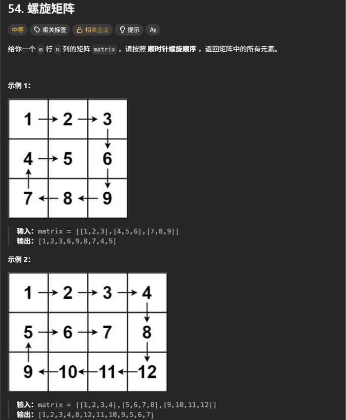

```
package leetcodehot100;

/**
 * @author 自然醒
 * @version 1.0
 */

import java.util.ArrayList;
import java.util.List;

/**
 * 螺旋矩阵
 * 输入一个矩阵，按照顺时针螺旋顺序打印出矩阵中的所有元素。
 * 输入：matrix = [[1,2,3],[4,5,6],[7,8,9]]
 * 输出：[1,2,3,6,9,8,7,4,5]
 * 输入：matrix = [[1,2,3,4],[5,6,7,8],[9,10,11,12]]
 * 输出：[1,2,3,4,8,12,11,10,9,5,6,7]
 */
public class hot20 {

    public static List<Integer> spiralOrder(int[][] matrix) {
        if(matrix == null || matrix.length == 0){
            return null;
        }
        int row = matrix.length;
        int col = matrix[0].length;
        boolean[][] isVisited = new boolean[row][col];
        int[][] directions = {{0, 1}, {1, 0}, {0, -1}, {-1, 0}};
        int directionIndex = 0;
        int x = 0, y = 0;
        List<Integer> res = new ArrayList<>(row * col);
        for (int i = 0; i < row * col; i++) {
            res.add(matrix[x][y]);
            isVisited[x][y] = true;
            int nextX = x + directions[directionIndex][0];
            int nextY = y + directions[directionIndex][1];
            if (nextX < 0 || nextX >= row || nextY < 0 || nextY >= col || isVisited[nextX][nextY]) {
                directionIndex = (directionIndex + 1) % 4;
            }
            x = x + directions[directionIndex][0];
            y = y + directions[directionIndex][1];
        }
        return res;
    }

}
```

想象整个流程如何走就可以了

## 旋转图像

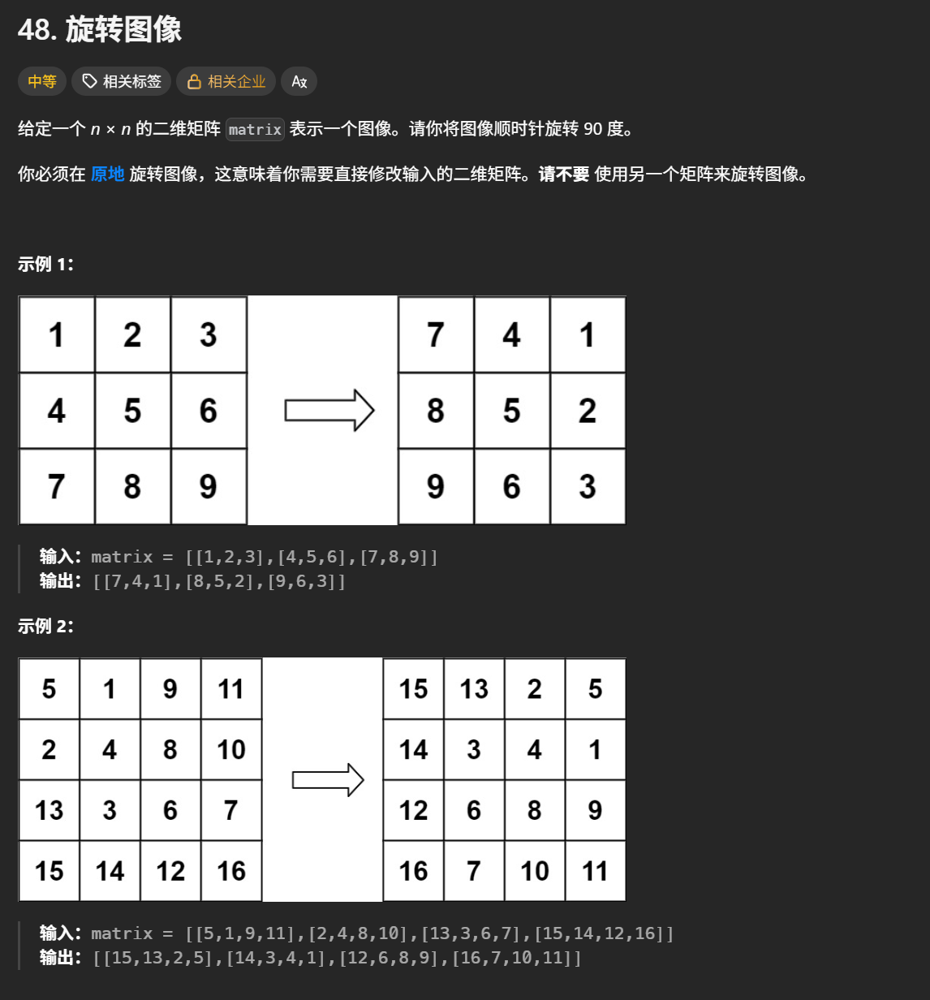

```
package leetcodehot100;

/**
 * @author 自然醒
 * @version 1.0
 */

/**
 * 旋转图像
 * 给定一个 n x n 的二维矩阵 matrix 表示一个图像。请你将图像顺时针旋转 90 度。
 * 你必须在 原地 旋转图像，这意味着你需要直接修改输入的二维矩阵。请不要 使用另一个矩阵来旋转图像。
 * 输入：matrix = [[1,2,3],[4,5,6],[7,8,9]]
 * 输出：[[7,4,1],[8,5,2],[9,6,3]]
 * 输入：matrix = [[5,1,9,11],[2,4,8,10],[13,3,6,7],[15,14,12,16]]
 * 输出：[[15,13,2,5],[14,3,4,1],[12,6,8,9],[16,7,10,11]]
 */
public class hot21 {
    public static void rotate(int[][] matrix) {
       int n = matrix.length;
       for(int i = 0; i < n / 2; i++){
           for(int j = 0; j < (n + 1) / 2; j++){
               int temp = matrix[i][j];
               matrix[i][j] = matrix[n - j - 1][i];
               matrix[n - j - 1][i] = matrix[n - i - 1][n - j - 1];
               matrix[n - i - 1][n - j - 1] = matrix[j][n - i - 1];
               matrix[j][n - i - 1] = temp;
           }
       }
    }
}
```

原地旋转法 以对角线为主进行旋转，一层一层去旋转

看图

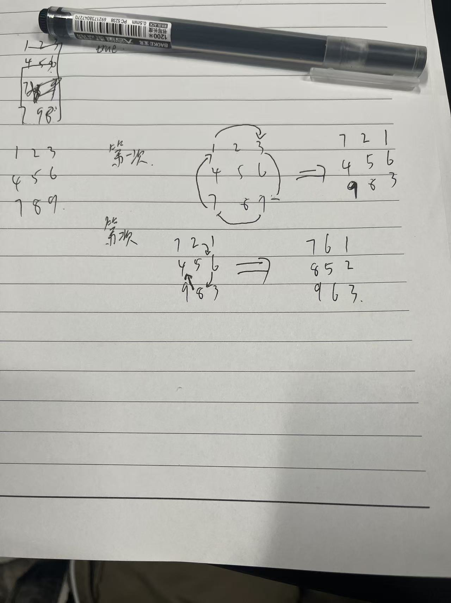

主要难点在于哪些元素需要用进行枚举旋转（环状处理）

分为两种情况，如果为奇数的情况，则中间的元素无需选择，为偶数则需要进行分块旋转

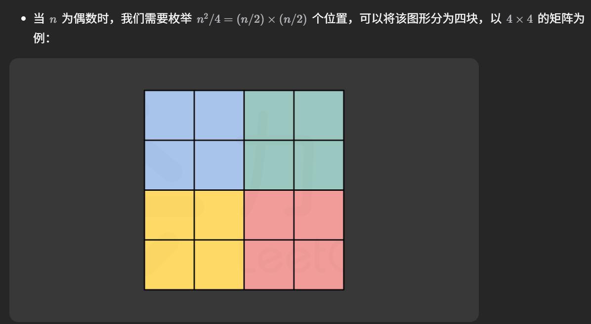

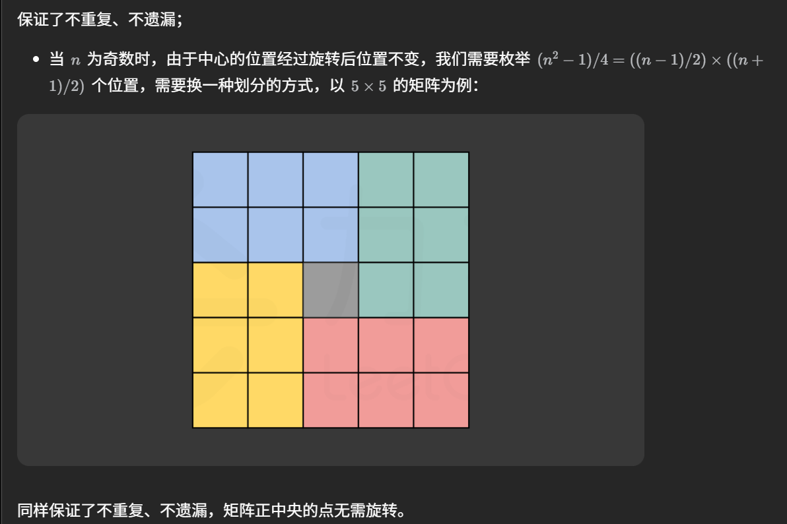

使用对角线翻转

```
public static void rotate(int[][] matrix) {
    int n = matrix.length;
    //按照对角线翻转
    for(int i = 0; i < n; i++){
        for(int j = i + 1; j < n; j++){
            int temp = matrix[i][j];
            matrix[i][j] = matrix[j][i];
            matrix[j][i] = temp;
        }
    }
    //对角线翻转之后行进行翻转
    for(int i = 0; i < n; i++){
        for(int j = 0; j < n / 2; j++){
            int temp = matrix[i][j];
            matrix[i][j] = matrix[i][n - j - 1];
            matrix[i][n - j - 1] = temp;
        }
    }
}
```

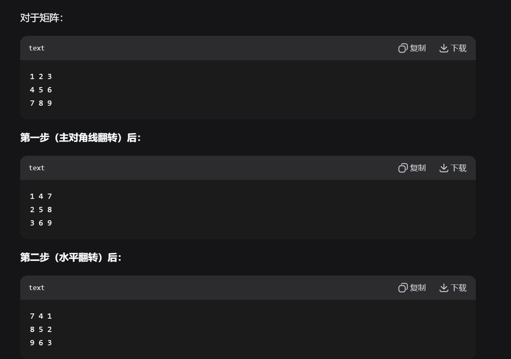

## 搜索二维矩阵 II

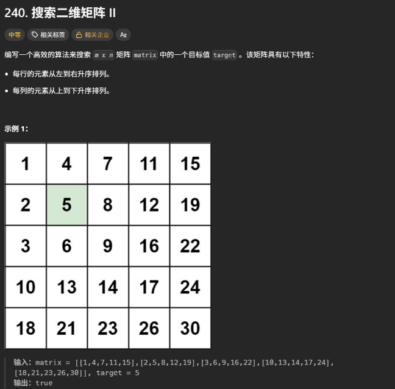

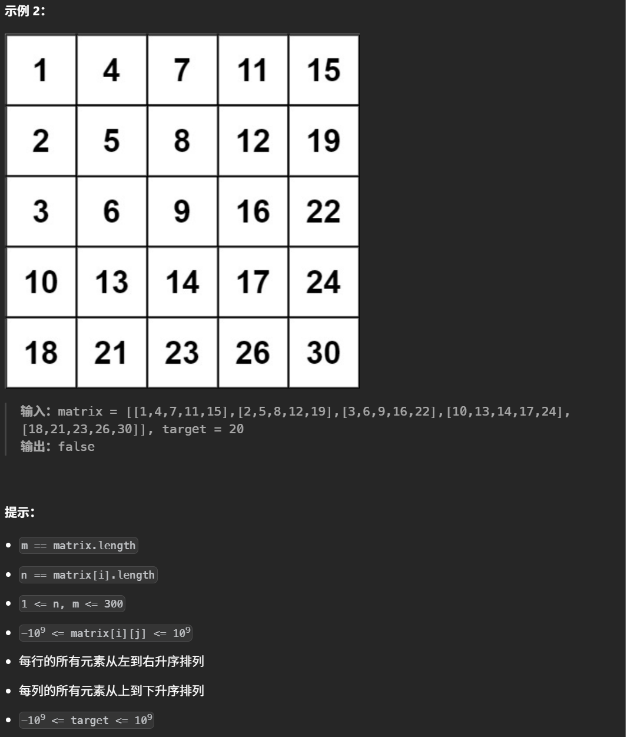

```
package leetcodehot100;

/**
 * @author 自然醒
 * @version 1.0
 */

/**
 * 搜索二维矩阵II
 * 编写一个高效的算法搜索 m x n 矩阵 matrix 中的一个目标值 target 。该矩阵具有以下特性：
 * 每行的元素从左到右升序排列。
 * 每列的元素从上到下升序排列
 * 示例 1：
 * 输入：matrix = [[1,4,7,11,15],[2,5,8,12,19],[3,6,9,16,22],[10,13,14,17,24],[18,21,23,26,30]], target = 5
 * 输出：true
 * 示例 2：
 * 输入：matrix = [[1,4,7,11,15],[2,5,8,12,19],[3,6,9,16,22],[10,13,14,17,24],[18,21,23,26,30]], target = 20
 * 输出：false
 */
public class hot22 {

    public static boolean searchMatrix(int[][] matrix, int target) {
        int row = matrix.length;
        int col = matrix[0].length;
        for(int i = 0; i < row; i++){
            for(int j = col - 1; j >= 0; j--){
                if(matrix[i][j] == target){
                    return true;
                }
                if(matrix[i][j] > target){
                    continue;
                }
                if(matrix[i][j] < target){
                    break;
                }
            }
        }
        return false;
    }
}
```

暴力破解遍历矩阵即可


以下是二分查找法：

```
public static boolean searchMatrix(int[][] matrix, int target) {
    for (int[] ans : matrix) {
        int index = binarySearch(ans, target);
        if(index != -1){
            return true;
        }
    }
    return false;
}

public static int binarySearch(int[] nums, int target) {
    int left = 0;
    int right = nums.length - 1;
    while(left <= right){
        int mid = left + (right - left) / 2;
        if(nums[mid] == target){
            return mid;
        } else if (nums[mid] < target) {
            left = mid + 1;
        }else{
            right = mid - 1;
        }
    }
    return -1;
}
```

一种Z字形搜索方法 当学习使用

```
public static boolean searchMatrix(int[][] matrix, int target) {
    int m = matrix.length, n = matrix[0].length;
    int x = 0, y = n - 1;
    while (x < m && y >= 0) {
        if (matrix[x][y] == target) {
            return true;
        }
        if (matrix[x][y] > target) {
            --y;
        } else {
            ++x;
        }
    }
    return false;
}
```

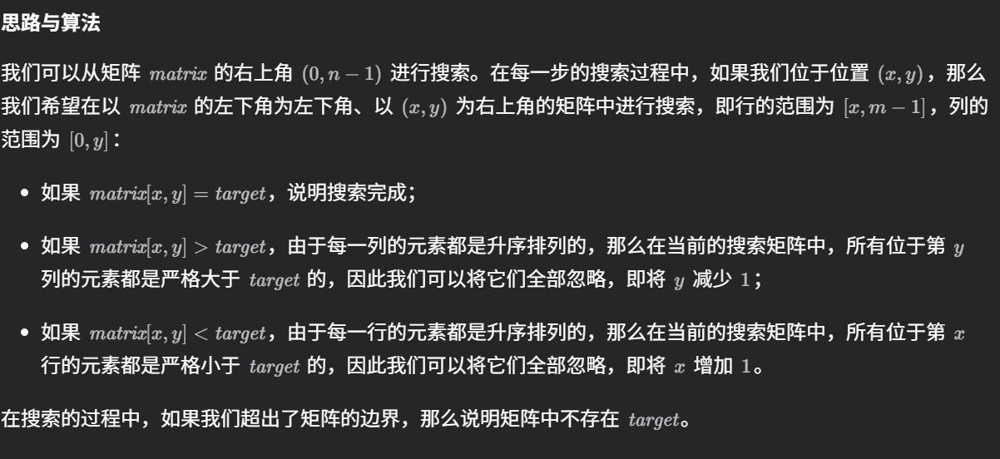

## 相加链表

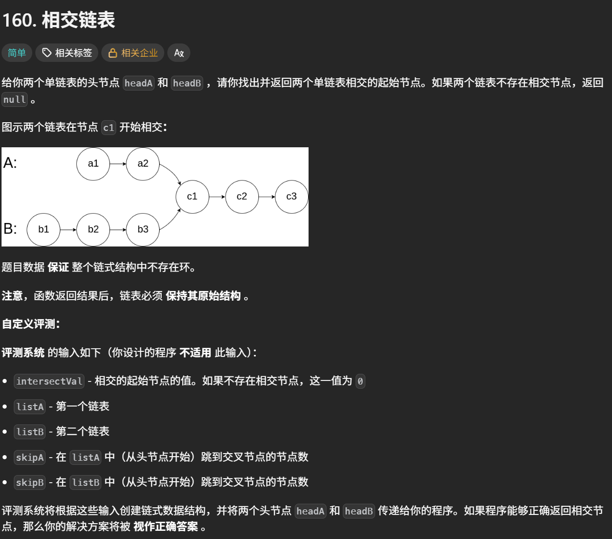

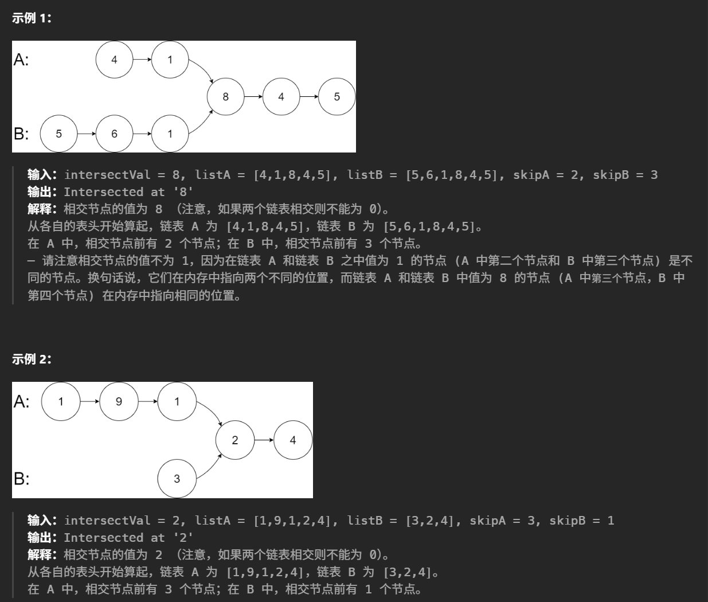

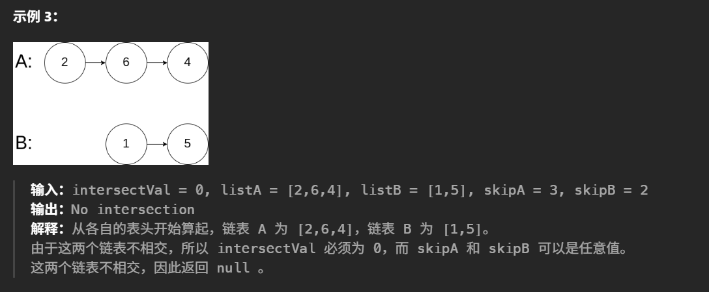

```
public class ListNode {
    int val;
    ListNode next;

    ListNode(int x) {
        val = x;
        next = null;
    }
}


public ListNode getIntersectionNode(ListNode headA, ListNode headB) {
    Set<ListNode> set = new HashSet<>();
    ListNode temp = headA;
    while (temp != null) {
        set.add(temp);
        temp = temp.next;
    }
    temp = headB;
    while (temp != null) {
        if (set.contains(temp)) {
            return temp;
        }
        temp = temp.next;
    }
    return null;
}
```

解题思路：使用Set集合，因为Set集合具有去重的特性

Set集合存储每个链表的节点，先遍历链表headA，并将headA中的每个节点加入Set集合中。再去遍历headB，对于遍历到的每个节点，判断该节点是否在集合中

1.如果当前不在集合中，则继续遍历下一个节点

2.如果当前节点在集合中，则后续节点都在集合中，即从当前节点开始的所有节点都在两个链表的相交部分

**双指针解法：**

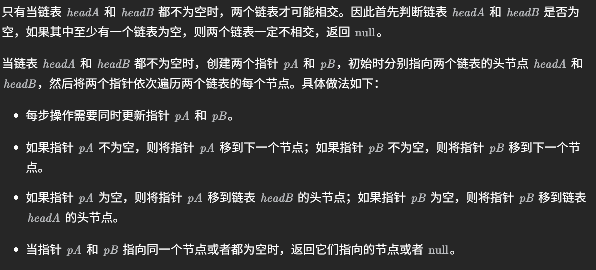

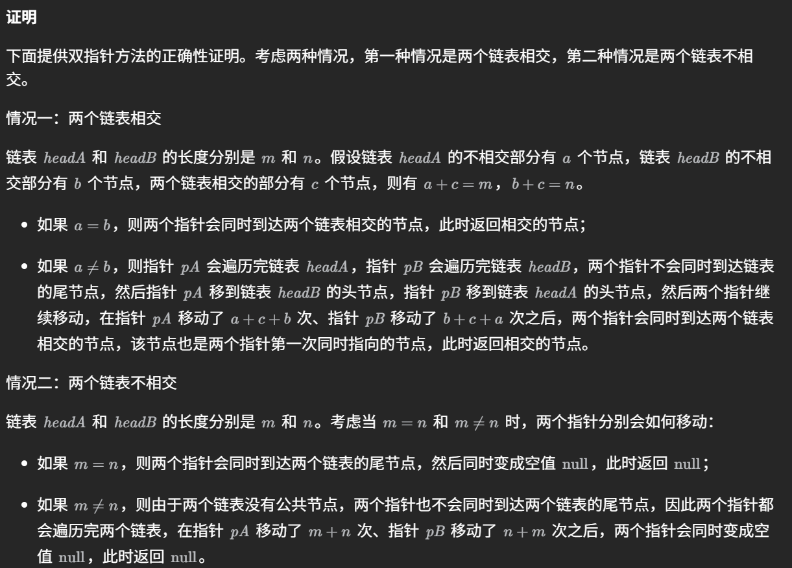

```
public class Solution {
    public ListNode getIntersectionNode(ListNode headA, ListNode headB) {
        if (headA == null || headB == null) {
            return null;
        }
        ListNode pA = headA, pB = headB;
        while (pA != pB) {
            pA = pA == null ? headB : pA.next;
            pB = pB == null ? headA : pB.next;
        }
        return pA;
    }
}
```

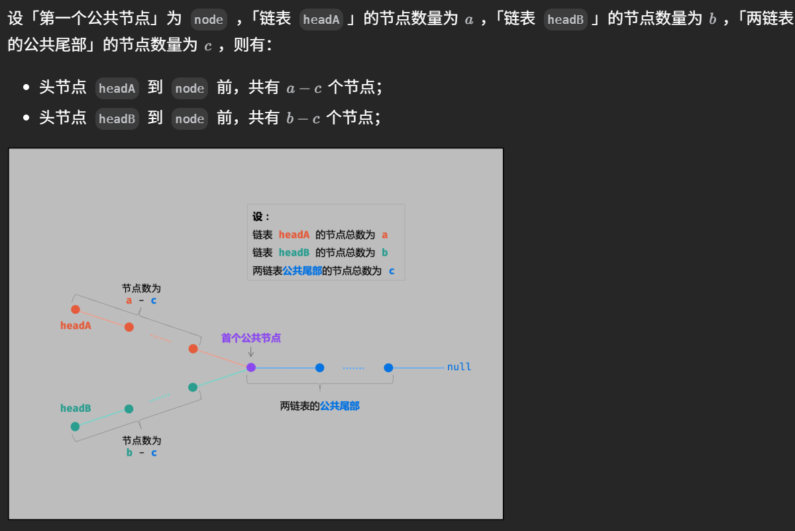

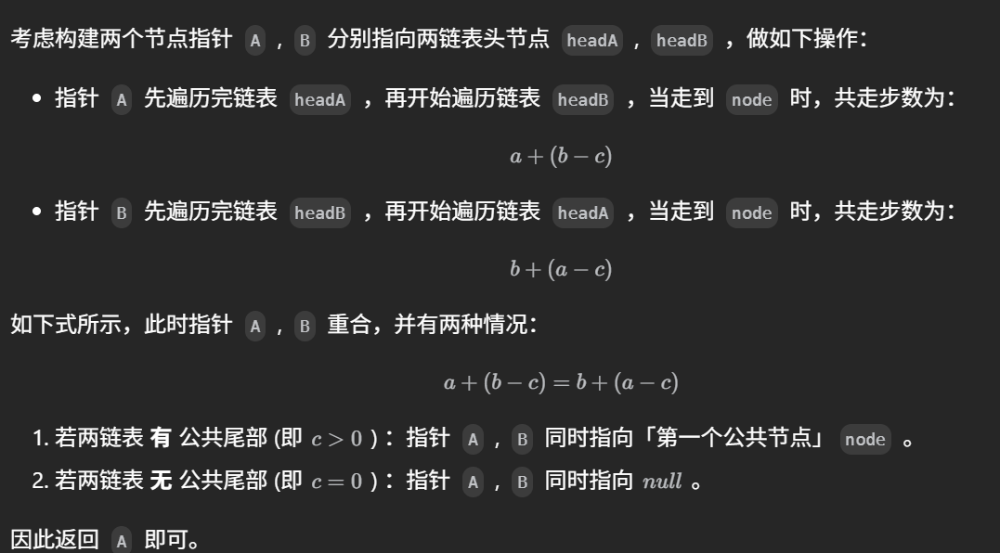

两条链表同时遍历，遍历完本身之后再去遍历另一条，如果此时两个指针遍历的时候遍历到了同一个节点，此时就是他们相交，如果未相遇而遍历完两条链表，此时就是无交点

## 反转链表

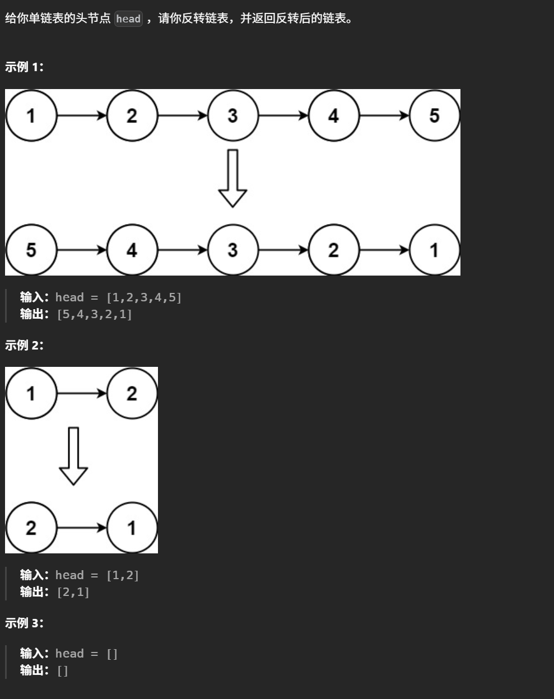

```
package leetcodehot100;

/**
 * @author 自然醒
 * @version 1.0
 */

/**
 * 链表翻转
 * 给你单链表的头节点 head ，请你反转链表，并返回反转后的链表。
 * 输入：head = [1,2,3,4,5]
 * 输出：[5,4,3,2,1]
 * 输入：head = [1,2]
 * 输出：[2,1]
 * 输入：head = []
 * 输出：[]
 */
public class hot24 {

    public class ListNode {
        int val;
        ListNode next;

        ListNode() {
        }

        ListNode(int val) {
            this.val = val;
        }

        ListNode(int val, ListNode next) {
            this.val = val;
            this.next = next;
        }
    }

    public ListNode reverseList(ListNode head) {
        ListNode pre = null;
        ListNode cur = head;
        while (cur != null) {
            // 保存当前节点的下一个节点
            ListNode temp = cur.next;
            // 断开当前节点的next指针
            cur.next = pre;
            // pre指针都向右移动一位
            pre = cur;
            // cur指针向右移动一位
            cur = temp;
        }
        return pre;
    }
}
```

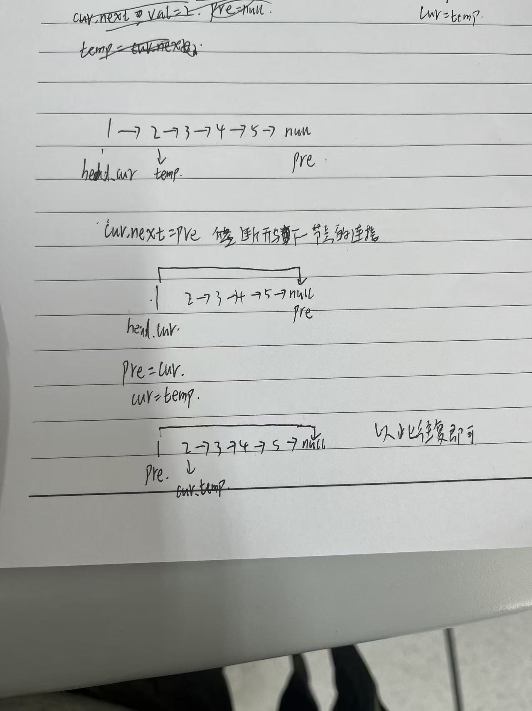

递归的思想：

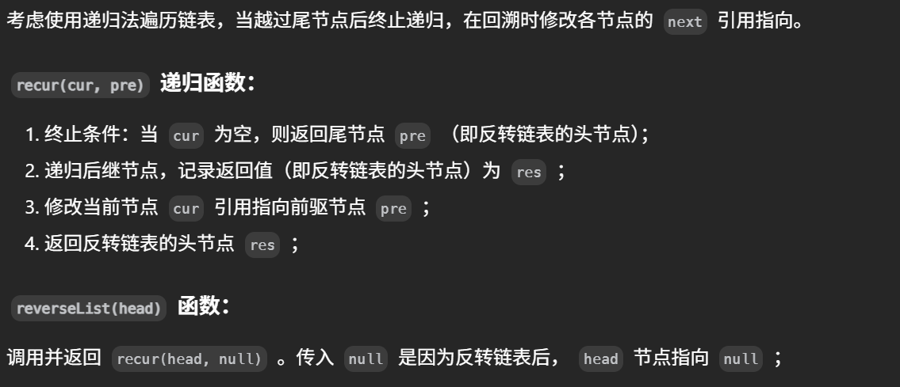

```
class Solution {
    public ListNode reverseList(ListNode head) {
        return recur(head, null);    // 调用递归并返回
    }
    private ListNode recur(ListNode cur, ListNode pre) {
        if (cur == null) return pre; // 终止条件
        ListNode res = recur(cur.next, cur);  // 递归后继节点
        cur.next = pre;              // 修改节点引用指向
        return res;                  // 返回反转链表的头节点
    }
}
```

## 回文链表

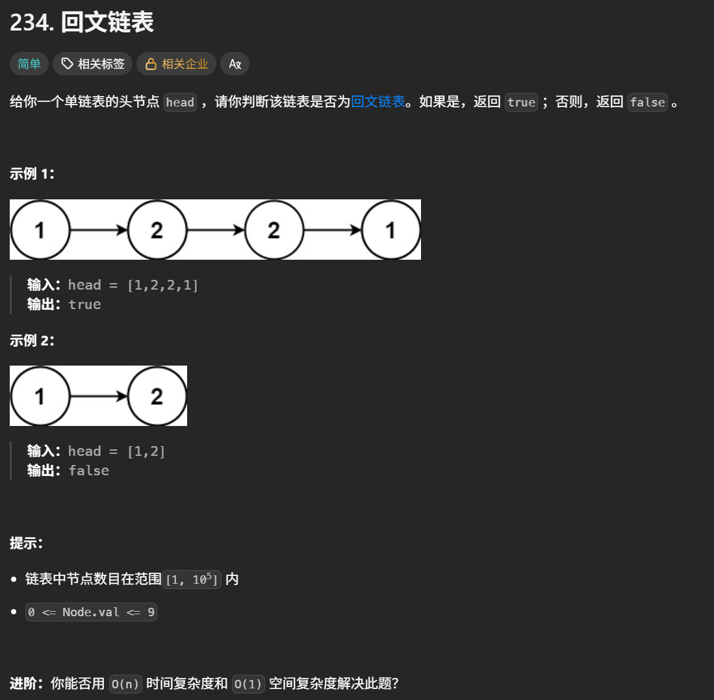

```
package leetcodehot100;

/**
 * @author 自然醒
 * @version 1.0
 */

import java.util.ArrayList;
import java.util.List;

/**
 * 回文链表
 * 给一个单链表的头节点head，判断是否为回文链表，如果是回文链表，返回true，否则返回false
 * 示例1：
 * 输入：head = [1,2,2,1]
 * 输出：true
 * 示例2：
 * 输入：head = [1,2]
 * 输出：false
 */

public class hot25 {

    public class ListNode {
        int val;
        ListNode next;

        ListNode() {
        }

        ListNode(int val) {
            this.val = val;
        }

        ListNode(int val, ListNode next) {
            this.val = val;
            this.next = next;
        }
    }


    public boolean isPalindrome(ListNode head) {
        List<Integer> list = new ArrayList<>();
        // 将链表中的元素添加到list中
        while(head != null){
            list.add(head.val);
            head = head.next;
        }
        //双指针遍历list集合，判断是否为回文
        int left = 0;
        int right = list.size() - 1;
        while(left < right){
            if(list.get(left) != list.get(right)){
                return false;
            }
            left++;
            right--;
        }
        return true;
    }
}
```

解题思路：先将链表数据存入集合当中，再使用双指针遍历即可

时间复杂O(n) 空间复杂O(n) 因为多用了一个集合进行存储

使用快慢指针解决，此时的空间为O(1)如下：

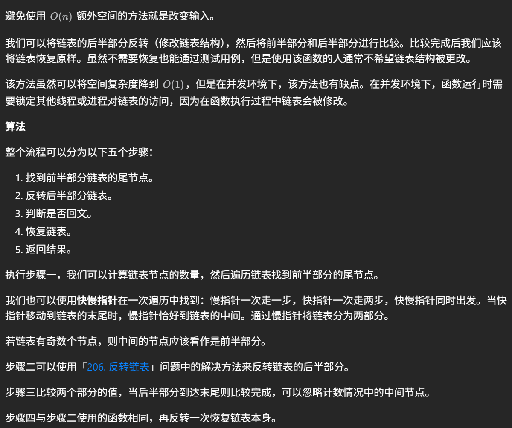

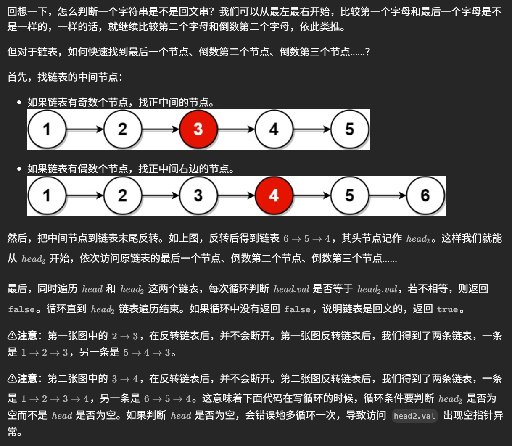


```
class Solution {
    public boolean isPalindrome(ListNode head) {
        ListNode mid = middleNode(head);
        ListNode head2 = reverseList(mid);
        while (head2 != null) {
            if (head.val != head2.val) { // 不是回文链表
                return false;
            }
            head = head.next;
            head2 = head2.next;
        }
        return true;
    }

    // 876. 链表的中间结点
    private ListNode middleNode(ListNode head) {
        ListNode slow = head;
        ListNode fast = head;
        while (fast != null && fast.next != null) {
            slow = slow.next;
            fast = fast.next.next;
        }
        return slow;
    }

    // 206. 反转链表
    private ListNode reverseList(ListNode head) {
        ListNode pre = null;
        ListNode cur = head;
        while (cur != null) {
            ListNode nxt = cur.next;
            cur.next = pre;
            pre = cur;
            cur = nxt;
        }
        return pre;
    }
}
```

## 环形链表

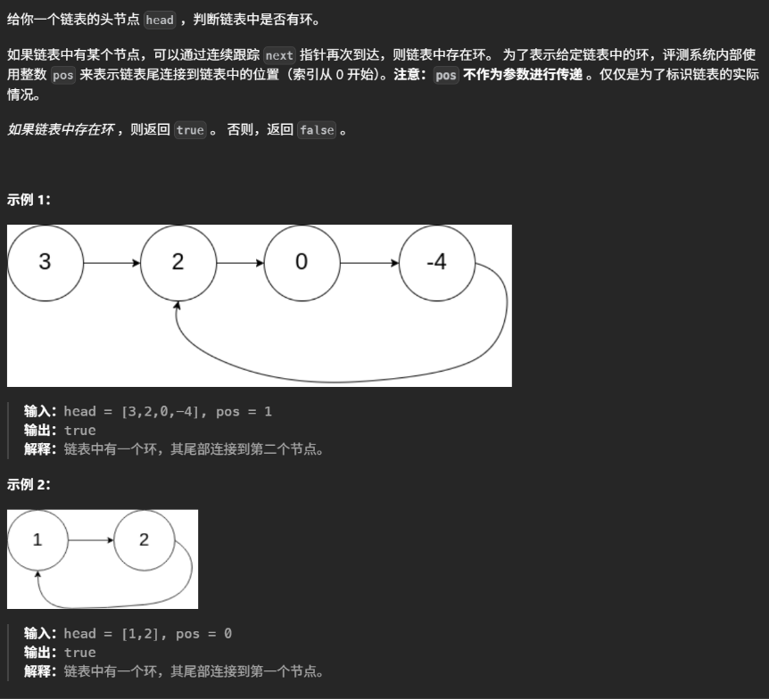

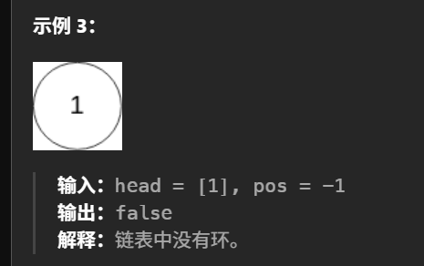

```
package leetcodehot100;

/**
 * @author 自然醒
 * @version 1.0
 */

/**
 * 环形链表
 * 给一个单链表，判断链表中是否有环。
 * 如果链表中有某个节点，可以通过连续跟踪 next 指针再次到达，则链表中存在环。 为了表示给定链表中的环，
 * 我们使用整数 pos 来表示链表尾连接到链表中的位置（索引从 0 开始）。 如果 pos 是 -1，则在该链表中没有环。
 * 注意：pos 不作为参数进行传递，仅仅是为了标识链表的实际情况。
 */
public class hot26 {

    class ListNode {
        int val;
        ListNode next;

        ListNode(int x) {
            val = x;
            next = null;
        }
    }

    public boolean hasCycle(ListNode head) {
        if (head == null || head.next == null) {
            return false;
        }
        ListNode slow = head;
        ListNode fast = head.next;
        while(fast != null && fast.next != null){
            if(slow == fast){
                return true;
            }
            slow = slow.next;
            fast = fast.next.next;
        }
        return false;
    }
}
```

快慢指针

## 环形链表II

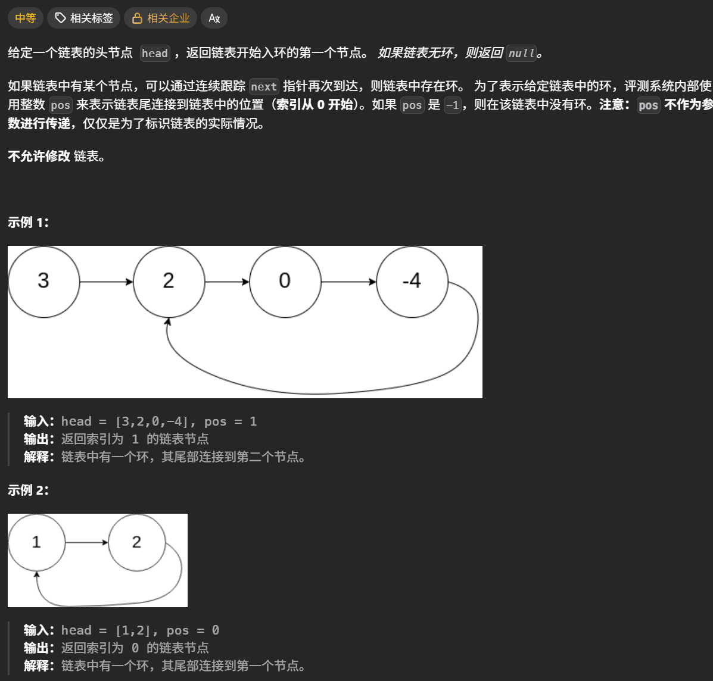

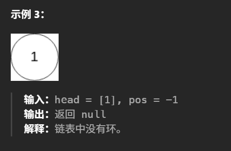

```
package leetcodehot100;

/**
 * @author 自然醒
 * @version 1.0
 */

/**
 * 环形链表II
 * 给定一个链表的头节点 head ，返回链表开始入环的第一个节点。 如果链表无环，则返回 null。
 * 如果链表有某个节点，可以通过连续跟踪 next 指针再次到达，则链表中存在环。
 * 为了表示给定链表中的环，评测系统内部使用整数 pos 来表示链表尾连接到链表中的位置（索引从 0 开始）。如果 pos 是 -1，则在该链表中没有环。
 * 注意：pos 不作为参数进行传递，仅仅是为了标识链表的实际情况。
 */
public class hot27 {
    class ListNode {
        int val;
        ListNode next;
        ListNode(int x) {
            val = x;
            next = null;
        }
    }
    public ListNode detectCycle(ListNode head) {
        if (head == null || head.next == null) {
            return null;
        }
        ListNode slow = head;
        ListNode fast = head;
        while(fast != null){
            slow = slow.next;
            if(fast.next != null){
                fast = fast.next.next;
            }else{
                return null;
            }
            if(slow == fast){
                ListNode index = head;
                while(index != slow){
                    index = index.next;
                    slow = slow.next;
                }
                return index;
            }
        }
        return null;
    }
}
```

## K个一组翻转链表

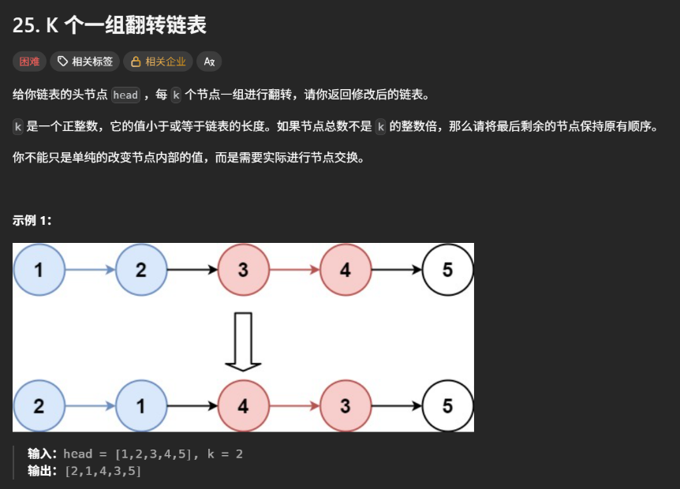

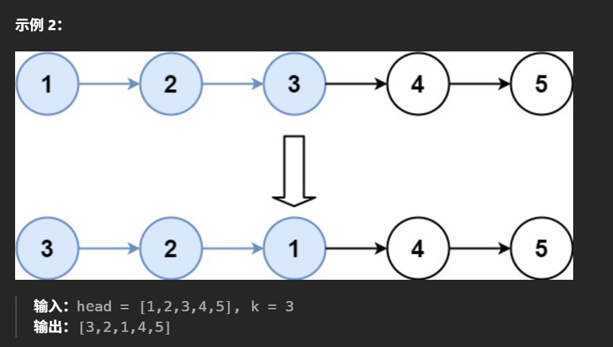

```
package leetcodehot100;

/**
 * @author 自然醒
 * @version 1.0
 */

/**
 *K个一组翻转链表
 * 给你一个链表，每 k 个节点一组进行翻转，请你返回翻转后的链表。
 * k 是一个正整数，它的值小于或等于链表的长度。
 * 如果节点总数不是 k 的整数倍，那么请将最后剩余的节点保持原有顺序。
 * 示例：
 * 给你这个链表：1->2->3->4->5
 * 当 k = 2 时，应当返回: 2->1->4->3->5
 */
public class hot28 {

    class ListNode{
        int val;
        ListNode next;
        ListNode(){}

        ListNode(int x){
            val = x;
        }

        ListNode(int x, ListNode next){
            val = x;
            this.next = next;
        }
    }

    public ListNode reverseKGroup(ListNode head, int k) {
        if(head == null || head.next == null){
            return head;
        }
        //设置一个游标
        ListNode cur = head;
        //获取k个节点
        for(int i = 0; i < k; i++){
            //获取k个节点失败
            if(cur == null){
                return head;
            }
            //获取k个节点成功
            cur = cur.next;
        }
        //翻转k个节点
        ListNode newHead = reverse(head, cur);
        head.next = reverseKGroup(cur, k);
        return newHead;
    }

    public ListNode reverse(ListNode head, ListNode tail){
        //设置一个游标
        ListNode pre = null;
        //翻转链表
        while(head != tail){
            //获取下一个节点
            ListNode temp = head.next;
            //断开连接
            head.next = pre;
            //连接
            pre = head;
            //获取下一个节点
            head = temp;
        }
        return pre;
    }
}
```

解题思路：

设置当前节点，去判断需要反转的节点数，以当前节点开始数到k

随后翻转head与当前数的节点cur

反转节点直接反转head到cur构成的链表即可

从头到尾进行判断，先设置一个临时节点，再进行移动节点翻转，

使用临时节点temp，将第一个节点与下一个节点断开，再连接即可

如此往复

但是这时候的时间复杂为O(n/k)，进行递归

O(1)的空间（别人的题解）：

```
public ListNode reverseKGroup(ListNode head, int k) {
    ListNode dummy = new ListNode(0);
    dummy.next = head;

    ListNode pre = dummy;
    ListNode end = dummy;

    while (end.next != null) {
        for (int i = 0; i < k && end != null; i++) end = end.next;
        if (end == null) break;
        ListNode start = pre.next;
        ListNode next = end.next;
        end.next = null;
        pre.next = reverse(start);
        start.next = next;
        pre = start;

        end = pre;
    }
    return dummy.next;
}

private ListNode reverse(ListNode head) {
    ListNode pre = null;
    ListNode curr = head;
    while (curr != null) {
        ListNode next = curr.next;
        curr.next = pre;
        pre = curr;
        curr = next;
    }
    return pre;
}
```

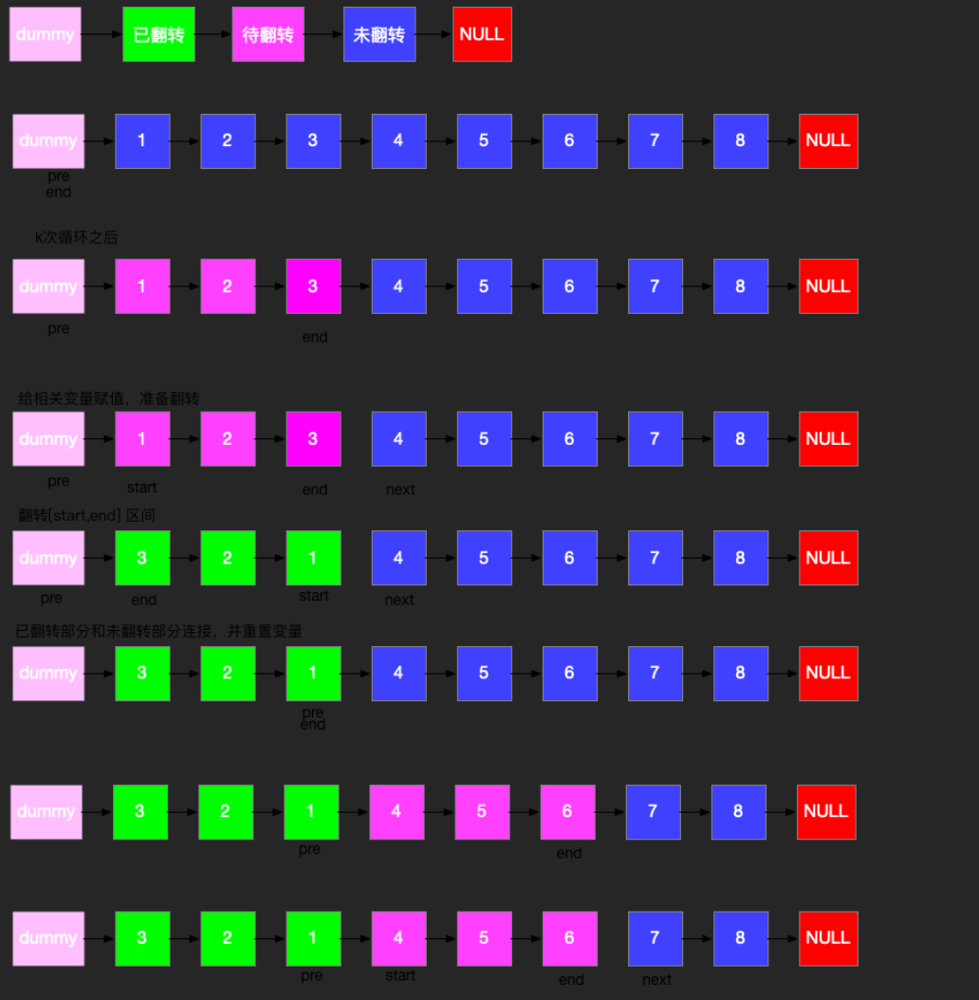

## 合并两个有序链表

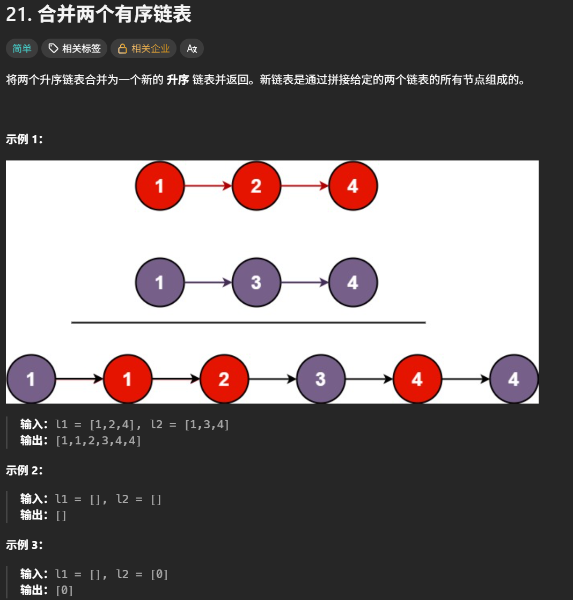

```
package leetcodehot100;

/**
 * @author 自然醒
 * @version 1.0
 */

/**
 * 合并两个有序链表
 * 将两个升序链表合并为一个新的 升序 链表并返回。新链表是通过拼接给定的两个链表的所有节点组成的。
 * 输入：l1 = [1,2,4], l2 = [1,3,4]
 * 输出：[1,1,2,3,4,4]
 * 输入：l1 = [], l2 = []
 * 输出：[]
 * 输入：l1 = [], l2 = [0]
 * 输出：[0]
 */
public class hot29 {
    class ListNode {
        int val;
        ListNode next;

        ListNode() {
        }

        ListNode(int val) {
            this.val = val;
        }

        ListNode(int val, ListNode next) {
            this.val = val;
            this.next = next;
        }
    }

    public ListNode mergeTwoLists(ListNode l1, ListNode l2) {
        if (l1 == null) {
            return l2;
        }
        if (l2 == null) {
            return l1;
        }
        ListNode head = new ListNode(0);
        ListNode cur = head;
        while(l1 != null && l2 != null){
            if(l1.val < l2.val){
                cur.next = l1;
                l1 = l1.next;
            }else{
                cur.next = l2;
                l2 = l2.next;
            }
            cur = cur.next;
        }
        cur.next = l1 == null ? l2 : l1;
        return head.next;
    }
}
```

解题思路：

初始化一个临时头节点用于伪造链表，同时遍历两条链表，随后模拟移动连接合并链表即可，最后的节点返回应该为为节点的下一个节点

合并链表时会出现两种情况：

1.list1为空，此时list2添加至最后

2.不为空则是list1最后

## 合并K个升序链表

```
package leetcodehot100;

/**
 * @author 自然醒
 * @version 1.0
 */

/**
 * 合并K个升序链表
 * 给一个链表数组，每个链表都已经按升序排列
 * 请将它们合并为一个新的 升序 链表并返回。
 * 示例 1：
 * 输入：lists = [[1,4,5],[1,3,4],[2,6]]
 * 输出：[1,1,2,3,4,4,5,6]
 * 解释：链表数组如下：
 * [
 * 1->4->5,
 * 1->3->4,
 * 2->6
 * ]
 * 合并后的链表是 1->1->2->3->4->4->5->6.
 * 示例 2：
 * 输入：lists = []
 * 输出：[]
 * 示例 3：
 * 输入：lists = [[]]
 * 输出：[]
 */
public class hot30 {
    class ListNode {
        int val;
        ListNode next;

        ListNode() {
        }

        ListNode(int val) {
            this.val = val;
        }

        ListNode(int val, ListNode next) {
            this.val = val;
            this.next = next;
        }
    }

    public ListNode mergeKLists(ListNode[] lists) {
        if (lists == null || lists.length == 0) {
            return null;
        }
        ListNode newList = null;
        for (int i = 0; i < lists.length; i++) {
            newList = mergeTwoLists(newList, lists[i]);
        }
        return newList;
    }

    public ListNode mergeTwoLists(ListNode list1, ListNode list2) {
        if (list1 == null) {
            return list2;
        }
        if (list2 == null) {
            return list1;
        }
        ListNode head = new ListNode(0);
        ListNode cur = head;
        while (list1 != null && list2 != null) {
            if(list1.val < list2.val){
                cur.next = list1;
                list1 = list1.next;
            }else{
                cur.next = list2;
                list2 = list2.next;
            }
            cur = cur.next;
        }
        cur.next = list1 == null ? list2 : list1;
        return head.next;
    }
}
```

合并两个有序链表的思路一致，不过是两个变成了k个，变成k个之后，直接遍历长度即可

官方题解对我的方法优化：

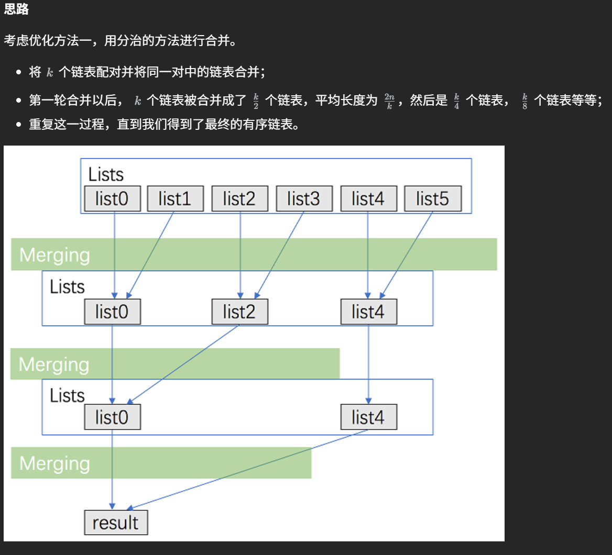

```
public ListNode mergeKLists(ListNode[] lists) {
    if (lists == null || lists.length == 0) {
        return null;
    }
   return merge(lists, 0, lists.length - 1);
}
public ListNode merge(ListNode[] lists, int left, int right) {
       if(left == right){
           return lists[left];
       }
       if(left > right){
           return null;
       }
       int mid = left + (right - left) / 2;
       ListNode leftNode = merge(lists, left, mid);
       ListNode rightNode = merge(lists, mid + 1, right);
       return mergeTwoLists(leftNode, rightNode);
    }

public ListNode mergeTwoLists(ListNode list1, ListNode list2) {
    if (list1 == null) {
        return list2;
    }
    if (list2 == null) {
        return list1;
    }
    ListNode head = new ListNode(0);
    ListNode cur = head;
    while (list1 != null && list2 != null) {
        if(list1.val < list2.val){
            cur.next = list1;
            list1 = list1.next;
        }else{
            cur.next = list2;
            list2 = list2.next;
        }
        cur = cur.next;
    }
    cur.next = list1 == null ? list2 : list1;
    return head.next;
}
```

## 两数相加

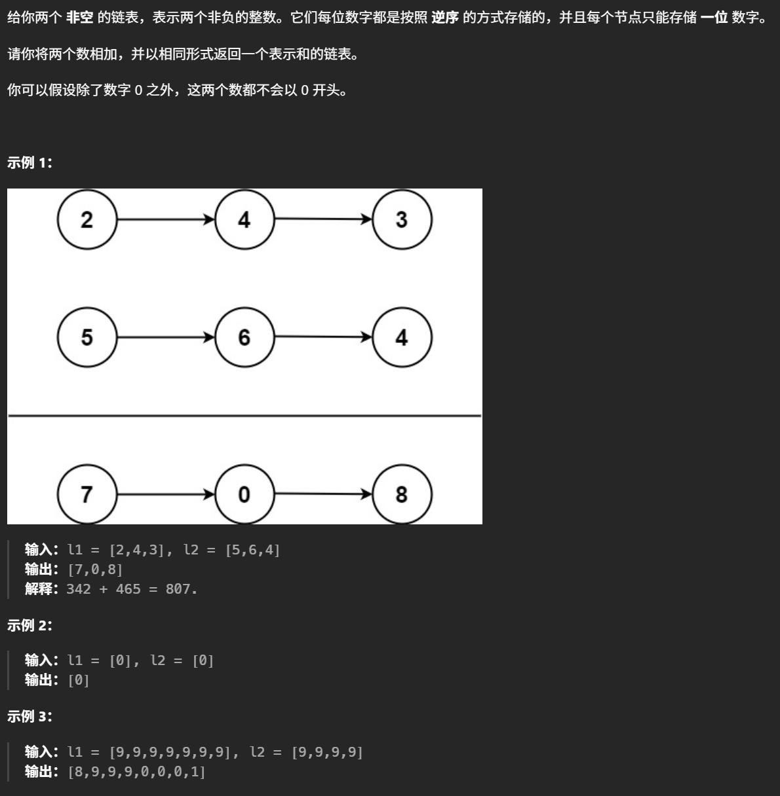

```
package leetcodehot100;

/**
 * @author 自然醒
 * @version 1.0
 */

/**
 * 两数相加
 * 给两个非空的链表，表示两个非负的整数。它们每位数字都是按照逆序的方式存储的，并且每个节点只能存储一位数字。
 * 请你将两个数相加，并以相同形式返回一个链表。
 * 可以假设除了数字0之外，这两个数都不会以0开头。
 * 输入：l1 = [2,4,3], l2 = [5,6,4]
 * 输出：[7,0,8]
 * 解释：342 + 465 = 807.
 * 输入：l1 = [0], l2 = [0]
 * 输出：[0]
 * 输入：l1 = [9,9,9,9,9,9,9], l2 = [9,9,9,9]
 * 输出：[8,9,9,9,0,0,0,1]
 */
public class hot31 {
    class ListNode {
        int val;
        ListNode next;

        ListNode() {
        }

        ListNode(int val) {
            this.val = val;
        }

        ListNode(int val, ListNode next) {
            this.val = val;
            this.next = next;
        }
    }

    public ListNode addTwoNumbers(ListNode l1, ListNode l2) {
        ListNode dumpy = new ListNode(0);
        ListNode cur = dumpy;
        //设置一个进位值
        int temp = 0;
        //链表进行相加即可
        while (l1 != null || l2 != null || temp != 0) {
            int a = l1 == null ? 0 : l1.val;
            int b = l2 == null ? 0 : l2.val;
            int sum = a + b + temp;
            temp = sum / 10;
            cur.next = new ListNode(sum % 10);
            cur = cur.next;
            if (l1 != null) {
                l1 = l1.next;
            }
            if (l2 != null) {
                l2 = l2.next;
            }
        }
        if(temp > 0){
            cur.next = new ListNode(temp);
        }
        return dumpy.next;
    }
}
```

两个链表进来，此时都是逆序存储数字的，看到结果可以发现其实可以直接相对应的位置进行相加即可

同时遍历两个链表，相同位置的数进行相加并且再加上其进位值temp

temp = sum/10求其相加后的进位值，dumpy为一个伪节点，用于连接两个链表相加后的新链表，相同位置相加，cur节点连接新的节点sum%10，

cur移动至该节点，如果最后进位值大于0的话，它就需要新增一个新节点进位值

## 删除链表的倒数第N个节点

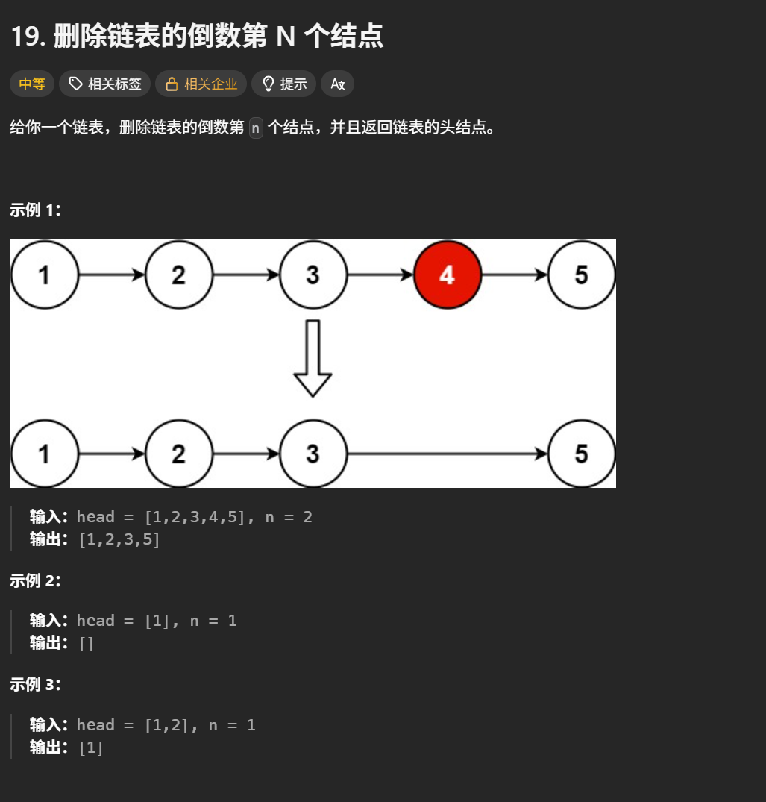

```
public ListNode removeNthFromEnd(ListNode head, int n) {
    if(head == null){
        return null;
    }
    int listLen = getListLen(head);
    if(listLen == n){
        return head.next;
    }
    ListNode cur = head;
    for(int i = 1; i < listLen - n; i++){
        cur = cur.next;
    }
    cur.next = cur.next.next;
    return head;
}

public int getListLen(ListNode head){
    int len = 0;
    while(head != null){
        len++;
        head = head.next;
    }
    return len;
}
```

先计算出链表的长度，再去遍历链表，遍历到目标节点的前一个位置，将其断开，让该位置的节点直接指向目标节点的后一个位置即cur.next = cur.next.next

## 两两交换链表中的节点

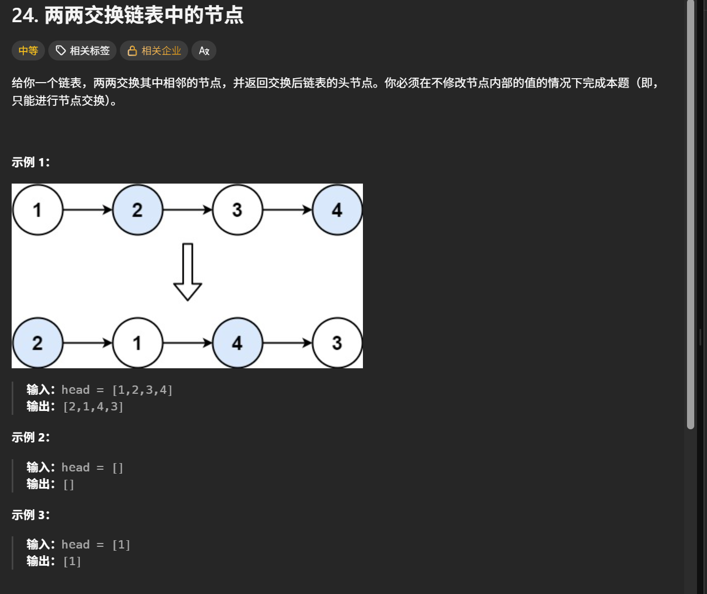

```
package leetcodehot100;

/**
 * @author 自然醒
 * @version 1.0
 */

/**
 * 两两交换链表中的节点
 * 给一个链表，两两交换其中的节点，并返回交换后的链表。必须在不修改节点内部值的情况下完成。
 * 示例1：
 * 输入：head = [1,2,3,4]
 * 输出：[2,1,4,3]
 * 示例2：
 * 输入：head = []
 * 输出：[]
 * 示例3：
 * 输入：head = [1]
 * 输出：[1]
 */
public class hot33 {
    class ListNode{
        int val;
        ListNode next;
        ListNode(int x){
            val = x;
        }
        ListNode(int x,ListNode next){
            val = x;
            this.next = next;
        }
        ListNode(){

        }
    }

    public ListNode swapPairs(ListNode head) {
        if(head == null || head.next == null){
            return head;
        }
        ListNode next = head.next;
        head.next = swapPairs(next.next);
        next.next = head;
        return next;
    }
}
```

不用想直接使用递归，刚开始一直用两个指针，然后一直没找到出口，最后仔细思考，发现只需要一个指针即可，头节点与其下一个节点进行交换，原地置换，原始的头节点会变为新链表的第二个节点，原链表的第二个节点会变为新链表的头节点

此时递归深度为O(n)

要使空间为O(1)可使用迭代法

创建一个哑节点，哑节点指向头节点，当前节点cur为哑节点，当前节点的后两个节点进行交换即可

```
public ListNode swapPairs(ListNode head) {
    if(head == null || head.next == null){
        return head;
    }
    ListNode dumpy = new ListNode(0);
    dumpy.next = head;
    ListNode cur = dumpy;
    while(cur.next != null && cur.next.next != null){
        ListNode first = cur.next;
        ListNode second = cur.next.next;
        first.next = second.next;
        cur.next = second;
        second.next = first;
        cur = first;
    }
    return dumpy.next;
}
```

## 随机链表的复制

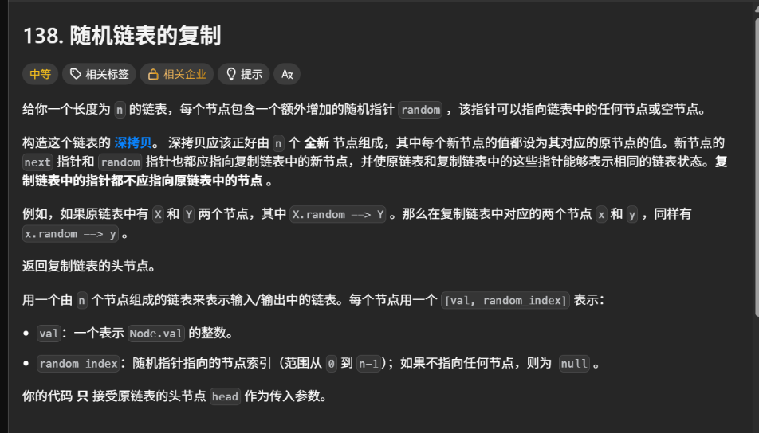

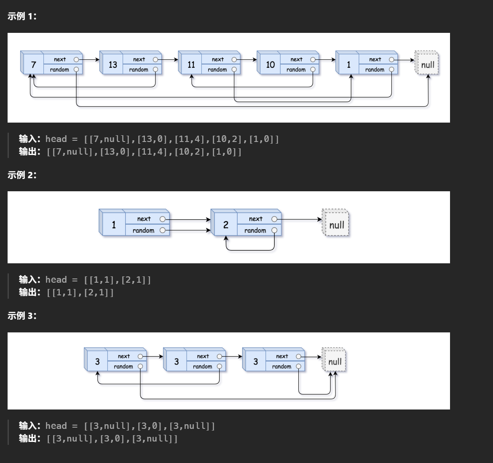


```
package leetcodehot100;

/**
 * @author 自然醒
 * @version 1.0
 */

/**
 * 随机链表的复制
 * 给一个长度为n的链表，每个节点包含一个额外指针random，该指针可以指向链表中的任意节点或者null。
 * 构造这个链表深拷贝。深拷贝应该正好与原始链表具有相同的值。每个节点的random指针也都应指向复制链表中对应节点。
 * 示例：
 * 输入：head = [[7,null],[13,0],[11,4],[10,2],[1,0]]
 * 输出：[[7,null],[13,0],[11,4],[10,2],[1,0]]
 * 输入：head = [[1,1],[2,1]]
 * 输出：[[1,1],[2,1]]
 * 输入：head = [[3,null],[3,0],[3,null]]
 * 输出：[[3,null],[3,0],[3,null]]
 */
public class hot34 {
    class Node{
        int val;
        Node next;
        Node random;
        Node(int x){
            val = x;
        }
        Node(int x,Node next,Node random){
            val = x;
            this.next = next;
            this.random = random;
        }
        Node(){

        }
    }

    public Node copyRandomList(Node head) {
        if(head == null){
            return null;
        }
        Node cur = head;
        // 1. 复制各节点，并构建拼接链表
        while(cur != null) {
            Node tmp = new Node(cur.val);
            tmp.next = cur.next;
            cur.next = tmp;
            cur = tmp.next;
        }
        // 2. 构建各新节点的 random 指向
        cur = head;
        while(cur != null) {
            if(cur.random != null)
                cur.next.random = cur.random.next;
            cur = cur.next.next;
        }
        // 3. 拆分两链表
        cur = head.next;
        Node pre = head, res = head.next;
        while(cur.next != null) {
            pre.next = pre.next.next;
            cur.next = cur.next.next;
            pre = pre.next;
            cur = cur.next;
        }
        pre.next = null; // 单独处理原链表尾节点
        return res;      // 返回新链表头节点
    }
}
```

题目都没读懂，看的别人题解。。。

理解了一晚上，读懂了题目，即对原链表进行一次深拷贝，深拷贝即是将原对象拷一份副本出来，而不是单纯的复制其值，需要一个空间地址，存储一样的数据，相比于浅拷贝不一样，浅拷贝即是两者均指向同一个空间地址

以下是map映射的解决方案：

```
class Solution {
    public Node copyRandomList(Node head) {
        if(head == null) return null;
        Node cur = head;
        Map<Node, Node> map = new HashMap<>();
        // 3. 复制各节点，并建立 “原节点 -> 新节点” 的 Map 映射
        while(cur != null) {
            map.put(cur, new Node(cur.val));
            cur = cur.next;
        }
        cur = head;
        // 4. 构建新链表的 next 和 random 指向
        while(cur != null) {
            map.get(cur).next = map.get(cur.next);
            map.get(cur).random = map.get(cur.random);
            cur = cur.next;
        }
        // 5. 返回新链表的头节点
        return map.get(head);
    }
}
```

## 排序链表

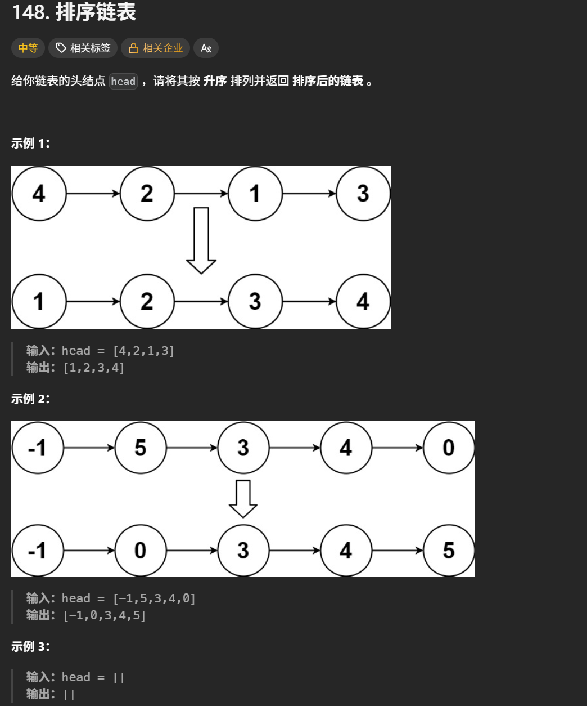

```
package leetcodehot100;

/**
 * @author 自然醒
 * @version 1.0
 */

/**
 * 排序链表
 */
public class hot35 {
    class ListNode {
        int val;
        ListNode next;

        ListNode() {
        }

        ListNode(int val) {
            this.val = val;
        }

        ListNode(int val, ListNode next) {
            this.val = val;
            this.next = next;
        }
    }

    public ListNode sortList(ListNode head) {
        if(head == null){
            return null;
        }
        return mergeSort(head);
    }

    public ListNode mergeSort(ListNode head){
        if(head == null || head.next == null){
            return head;
        }
        ListNode mid = getMidNode(head);
        ListNode right = mergeSort(mid.next);
        mid.next = null;
        ListNode left = mergeSort(head);
        return merge(left, right);
    }

    public ListNode getMidNode(ListNode head){
        if(head == null){
            return null;
        }
        ListNode slow = head;
        ListNode fast = head.next;
        while(fast != null && fast.next != null){
            slow = slow.next;
            fast = fast.next.next;
        }
        return slow;
    }

    public ListNode merge(ListNode left, ListNode right){
        ListNode dummy = new ListNode(-1);
        ListNode cur = dummy;
        while(left != null && right != null){
            if(left.val < right.val){
                cur.next = left;
                left = left.next;
            }else{
                cur.next = right;
                right = right.next;
            }
            cur = cur.next;
        }
        cur.next = left != null ? left : right;
        return dummy.next;
    }
}
```

对于链表的排序比较适用归并排序，但此时这个的空间复杂为O(logn)

归并排序的主要点找到中间节点的位置，然后断开，左边排序，右边排序，最后去合并两个已经排序好的链表即可

以下是空间O(1)的解题，自底向上进行归并

```
class Solution {
    public ListNode sortList(ListNode head) {
        int length = getListLength(head); // 获取链表长度
        ListNode dummy = new ListNode(0, head); // 用哨兵节点简化代码逻辑
        // step 为步长，即参与合并的链表长度
        for (int step = 1; step < length; step *= 2) {
            ListNode newListTail = dummy; // 新链表的末尾
            ListNode cur = dummy.next; // 每轮循环的起始节点
            while (cur != null) {
                // 从 cur 开始，分割出两段长为 step 的链表，头节点分别为 head1 和 head2
                ListNode head1 = cur;
                ListNode head2 = splitList(head1, step);
                cur = splitList(head2, step); // 下一轮循环的起始节点
                // 合并两段长为 step 的链表
                ListNode[] merged = mergeTwoLists(head1, head2);
                // 合并后的头节点 merged[0]，插到 newListTail 的后面
                newListTail.next = merged[0];
                newListTail = merged[1]; // merged[1] 现在是新链表的末尾
            }
        }
        return dummy.next;
    }

    // 获取链表长度
    private int getListLength(ListNode head) {
        int length = 0;
        while (head != null) {
            length++;
            head = head.next;
        }
        return length;
    }

    // 分割链表
    // 如果链表长度 <= size，不做任何操作，返回空节点
    // 如果链表长度 > size，把链表的前 size 个节点分割出来（断开连接），并返回剩余链表的头节点
    private ListNode splitList(ListNode head, int size) {
        // 先找到 nextHead 的前一个节点
        ListNode cur = head;
        for (int i = 0; i < size - 1 && cur != null; i++) {
            cur = cur.next;
        }

        // 如果链表长度 <= size
        if (cur == null || cur.next == null) {
            return null; // 不做任何操作，返回空节点
        }

        ListNode nextHead = cur.next;
        cur.next = null; // 断开 nextHead 的前一个节点和 nextHead 的连接
        return nextHead;
    }

    // 21. 合并两个有序链表（双指针）
    // 返回合并后的链表的头节点和尾节点
    private ListNode[] mergeTwoLists(ListNode list1, ListNode list2) {
        ListNode dummy = new ListNode(); // 用哨兵节点简化代码逻辑
        ListNode cur = dummy; // cur 指向新链表的末尾
        while (list1 != null && list2 != null) {
            if (list1.val < list2.val) {
                cur.next = list1; // 把 list1 加到新链表中
                list1 = list1.next;
            } else { // 注：相等的情况加哪个节点都是可以的
                cur.next = list2; // 把 list2 加到新链表中
                list2 = list2.next;
            }
            cur = cur.next;
        }
        cur.next = list1 != null ? list1 : list2; // 拼接剩余链表
        while (cur.next != null) {
            cur = cur.next;
        }
        // 循环结束后，cur 是合并后的链表的尾节点
        return new ListNode[]{dummy.next, cur};
    }
}
```

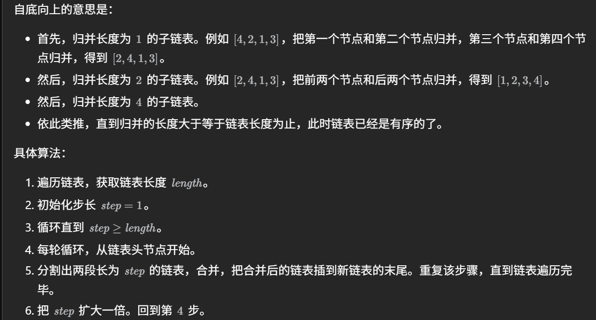

## LRU缓存

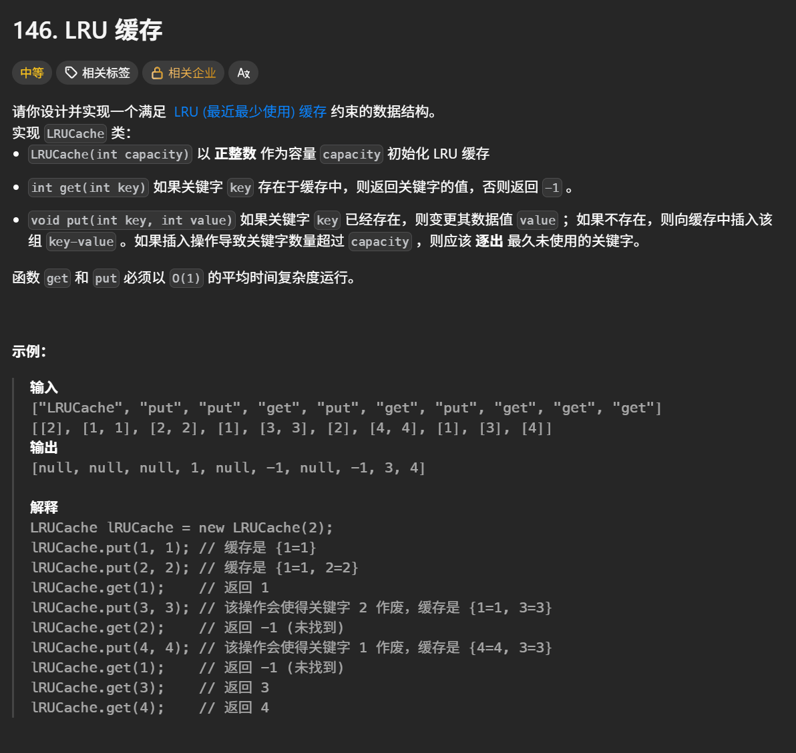

解法一：

使用封装好的类LinkedHashMap，其内置了LRU，LinkedHashMap是继承于HashMap的，但是它比HashMap多一个功能，即是有序的，建立了一个双向链表维护整个链表的顺序

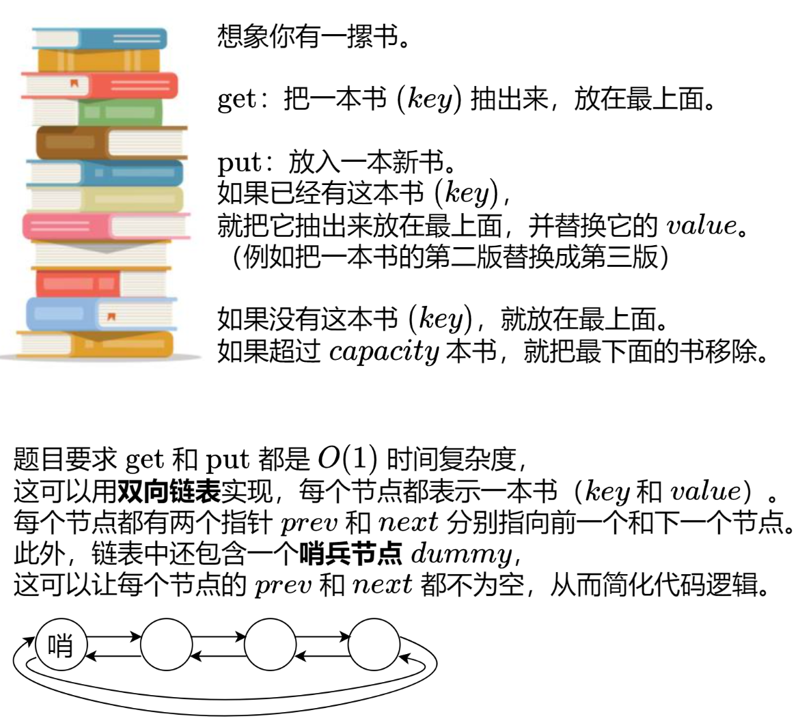

```
class LRUCache {
    private final int capacity;
    private final Map<Integer, Integer> cache = new LinkedHashMap<>();
    public LRUCache(int capacity) {
        this.capacity = capacity;
    }

    public int get(int key) {
        //删除key,并且判断是否在cache中
        Integer value = cache.remove(key);
        if(value != null){
            cache.put(key, value);
            return value;
        }
        return -1;
    }

    public void put(int key, int value) {
        Integer oldValue = cache.remove(key);
        if(oldValue != null){
            cache.put(key, value);
            return;
        }
        //key不在cache中，插入cache中，插入前先判断是否超出容量
        if(cache.size() == capacity){
            Integer eldestKey = cache.keySet().iterator().next();
            cache.remove(eldestKey);//删除最老的缓存
        }
        cache.put(key, value);
    }
}
```

解法二：手写双向链表

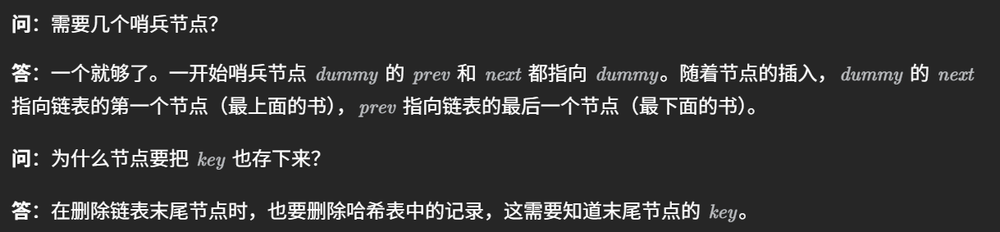

```
class LRUCache {

    private static class Node {
        int key;
        int value;
        Node prev;
        Node next;

        public Node(int key, int value) {
            this.key = key;
            this.value = value;
        }
    }

    private final int capacity;
    private final Node dumpy = new Node(0, 0); //哨兵节点
    private final Map<Integer, Node> keyNode = new HashMap<>();

    public LRUCache(int capacity) {
        this.capacity = capacity;
        dumpy.prev = dumpy;
        dumpy.next = dumpy;
    }

    public int get(int key) {
        Node node = getNode(key);//把对应节点移至链表头部
        return node == null ? -1 : node.value;
    }

    public void put(int key, int value) {
       Node node = getNode(key);
       //如果节点存在,更新值
       if(node != null){
           node.value = value;
           return;
       }
       node = new Node(key, value);
       keyNode.put(key, node);
       pushFront(node);
       if(keyNode.size() > capacity){
           Node last = dumpy.prev;
           keyNode.remove(last.key);
           removeNode(last);
       }
    }

    private Node getNode(int key){
        if(!keyNode.containsKey(key)){
            return null;
        }
        Node node = keyNode.get(key);
        removeNode(node);
        pushFront(node);
        return node;
    }

    private void removeNode(Node node){
        node.prev.next = node.next;
        node.next.prev = node.prev;
    }

    private void pushFront(Node node){
        node.prev = dumpy;
        node.next = dumpy.next;
        dumpy.next.prev = node;
        dumpy.next = node;
    }
}
```

## 二叉树的中序遍历

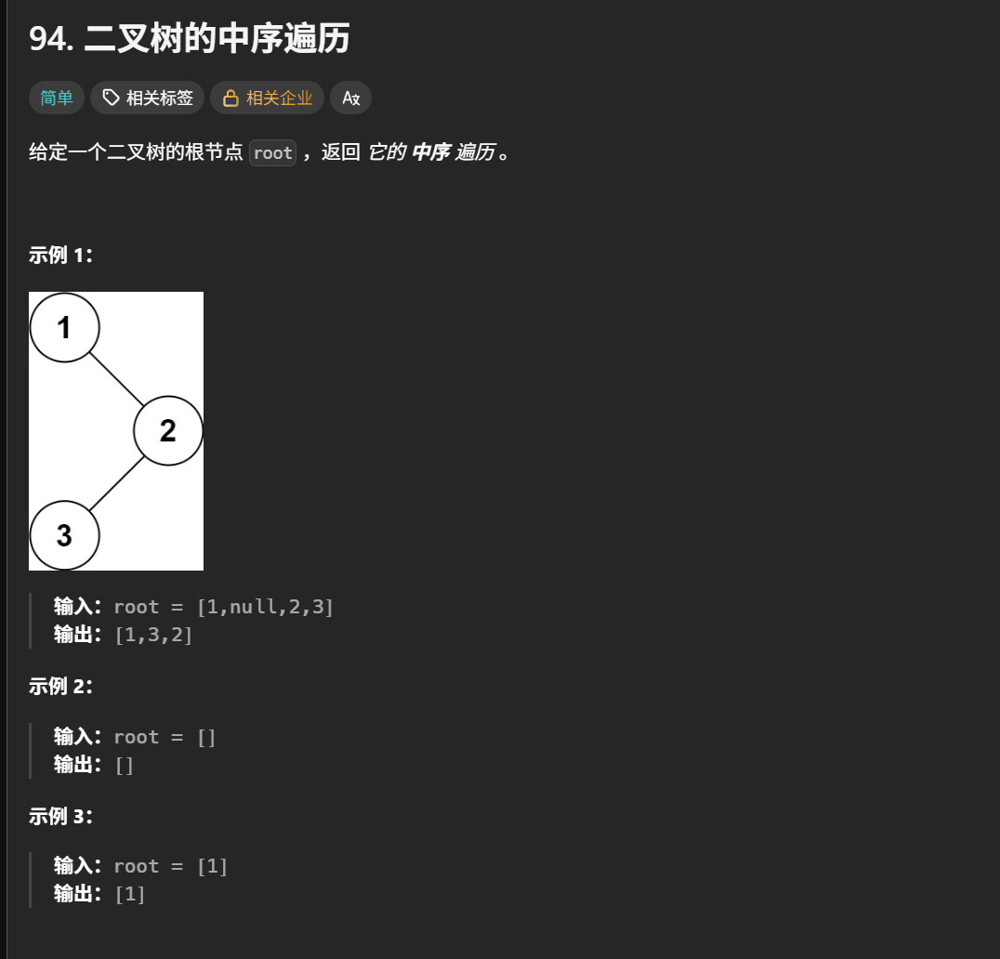

二叉树的中序遍历：

左子树->根节点->右子树（左中右的形式）

```
package leetcodehot100;

/**
 * @author 自然醒
 * @version 1.0
 */

import java.util.ArrayDeque;
import java.util.ArrayList;
import java.util.Deque;
import java.util.List;

/**
 * 二叉树的中序遍历
 */
public class hot37 {
    class TreeNode {
        int val;
        TreeNode left;
        TreeNode right;

        TreeNode() {
        }

        TreeNode(int val) {
            this.val = val;
        }

        TreeNode(int val, TreeNode left, TreeNode right) {
            this.val = val;
            this.left = left;
            this.right = right;
        }
    }

    public List<Integer> inorderTraversal(TreeNode root) {
        List<Integer> res = new ArrayList<>();
        //使用双端队列模拟栈
        //栈的特性先进后出，迭代进行更替
        Deque<TreeNode> stack = new ArrayDeque<>();
        while (root != null || !stack.isEmpty()) {
            //迭代访问左子树
            while(root != null){
                stack.push(root);
                root = root.left;
            }
            //迭代完左子树之后，弹栈出来访问右子树，迭代访问右子树
            //栈是先进后出，所以此时弹的是最后一个进栈元素即左子树的最后一个节点
            root = stack.pop();
            res.add(root.val);
            root = root.right;
        }
        return res;
    }
}
```

迭代遍历

有一种优化算法，空间直接降为O(1)，Morris中序遍历

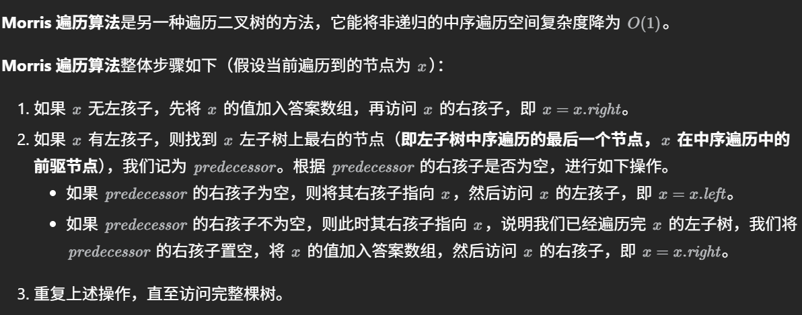

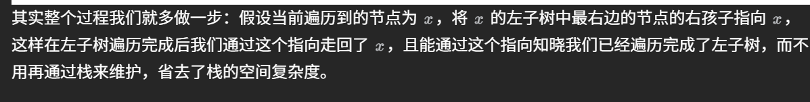

```
public List<Integer> inorderTraversal(TreeNode root) {
    List<Integer> res = new ArrayList<>();
    TreeNode pre = null;
    while(root != null){
        if(root.left != null){
            pre = root.left;
            while(pre.right != null && pre.right != root){
                pre = pre.right; //寻找最右边的节点
            }
            if(pre.right == null){
                pre.right = root;
                root = root.left;
            }else{
                pre.right = null;
                res.add(root.val);
                root = root.right;
            }
        }else{
            res.add(root.val);
            root = root.right;
        }
    }
    return res;
}
```

## 二叉树的最大深度

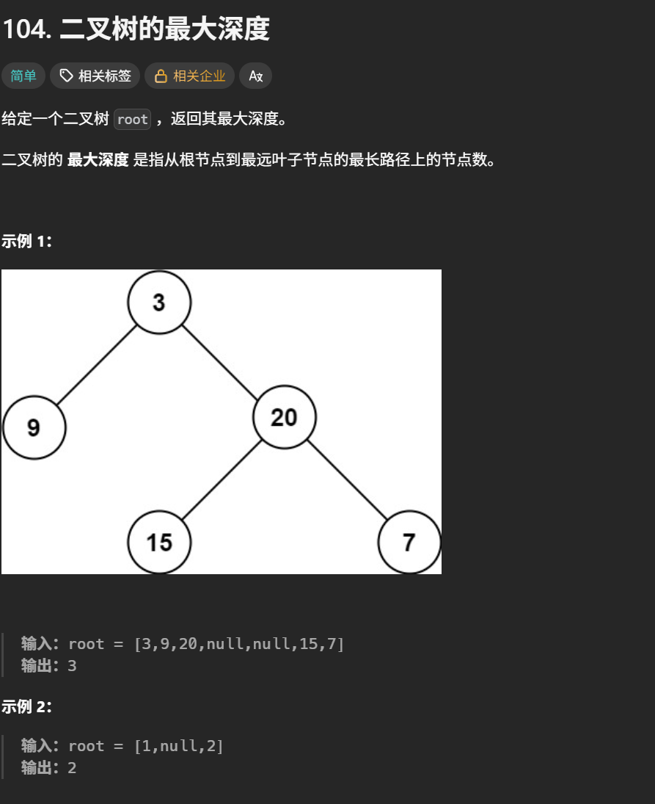

```
package leetcodehot100;

/**
 * @author 自然醒
 * @version 1.0
 */


/**
 * 二叉树的最大深度
 */
public class hot38 {
    class TreeNode {
        int val;
        TreeNode left;
        TreeNode right;

        TreeNode() {
        }

        TreeNode(int val) {
            this.val = val;
        }

        TreeNode(int val, TreeNode left, TreeNode right) {
            this.val = val;
            this.left = left;
            this.right = right;
        }
    }

    public int maxDepth(TreeNode root) {
        if(root == null){
            return 0;
        }
        int left = maxDepth(root.left);
        int right = maxDepth(root.right);
        return Math.max(left, right) + 1;
    }
}
```

使用递归深度优先，获取到左子树和右子树的最大深度，代用公式

max(l.r) + 1即可 关于二叉树的深度求解可以分为其子树的求解，左右子树，再回归到整棵树的求解

广度优先如下：

```
public int maxDepth(TreeNode root) {
    if (root == null) {
        return 0;
    }
    Queue<TreeNode> queue = new LinkedList<TreeNode>();
    queue.offer(root);
    int ans = 0;
    while (!queue.isEmpty()) {
        int size = queue.size();
        while (size > 0) {
            TreeNode node = queue.poll();
            if (node.left != null) {
                queue.offer(node.left);
            }
            if (node.right != null) {
                queue.offer(node.right);
            }
            size--;
        }
        ans++;
    }
    return ans;
}
```

## 翻转二叉树

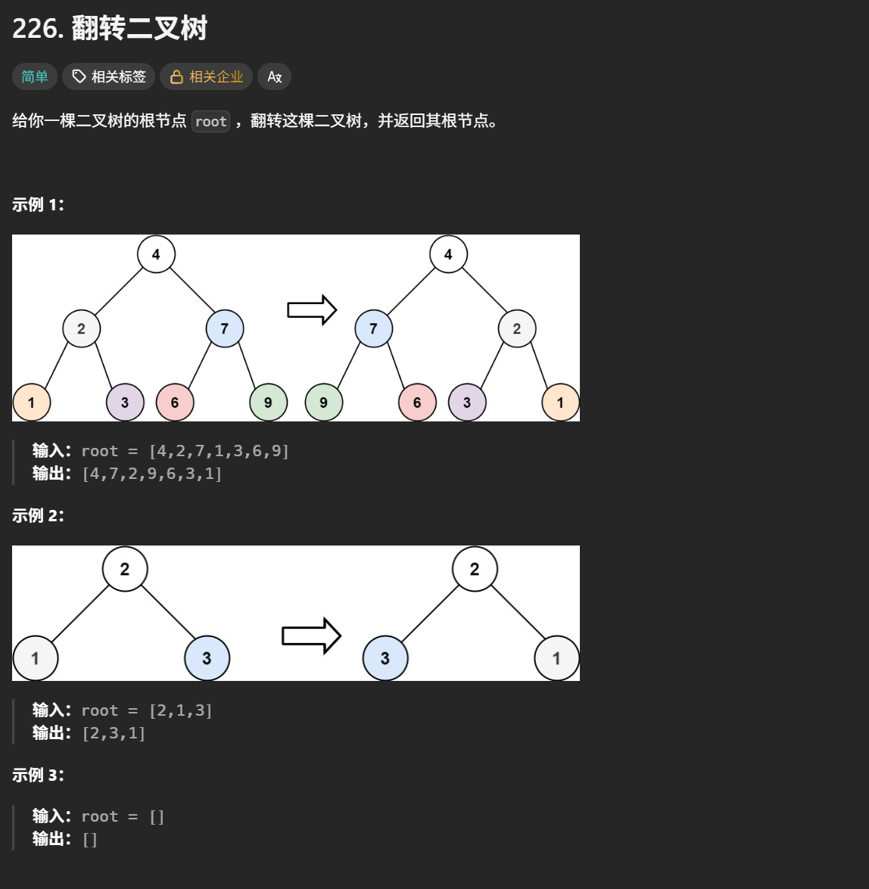

```
public TreeNode invertTree(TreeNode root) {
    if(root == null){
        return null;
    }
    TreeNode left = invertTree(root.left);
    TreeNode right = invertTree(root.right);
    root.left = right;
    root.right = left;
    return root;
}
```

直接递归秒过

可以使用模拟栈进行翻转

```
public TreeNode invertTree(TreeNode root) {
    if(root == null){
        return null;
    }
    Stack<TreeNode> stack = new Stack<>();
    stack.push(root);
    while(!stack.isEmpty()){
        TreeNode node = stack.pop();
        if(node.left != null){
            stack.push(node.left);
        }
        if(node.right != null){
            stack.push(node.right);
        }
        TreeNode temp = node.left;
        node.left = node.right;
        node.right = temp;
    }
    return root;
}
```

## 对称二叉树

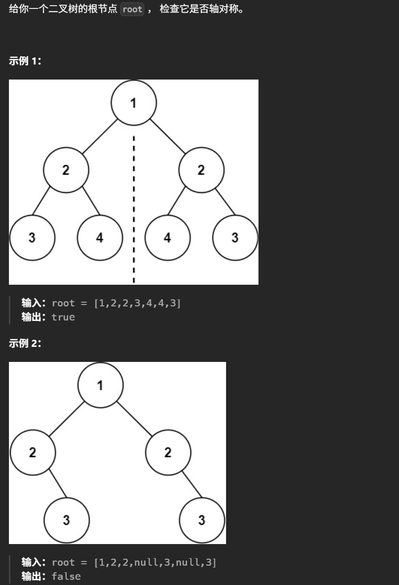

```
public boolean isSymmetric(TreeNode root) {
    TreeNode left = root.left;
    TreeNode right = root.right;
    return isMirror(left, right);
}

public boolean isMirror(TreeNode left, TreeNode right) {
    if(left == null && right == null){
        return true;
    }
    if(left == null || right == null){
        return false;
    }
    return left.val == right.val && isMirror(left.left, right.right) && isMirror(left.right, right.left);
}
```

递归分析

还有一种就是迭代，也是用模拟方法，像翻转二叉树一样，不过是使用队列

## 二叉树的直径

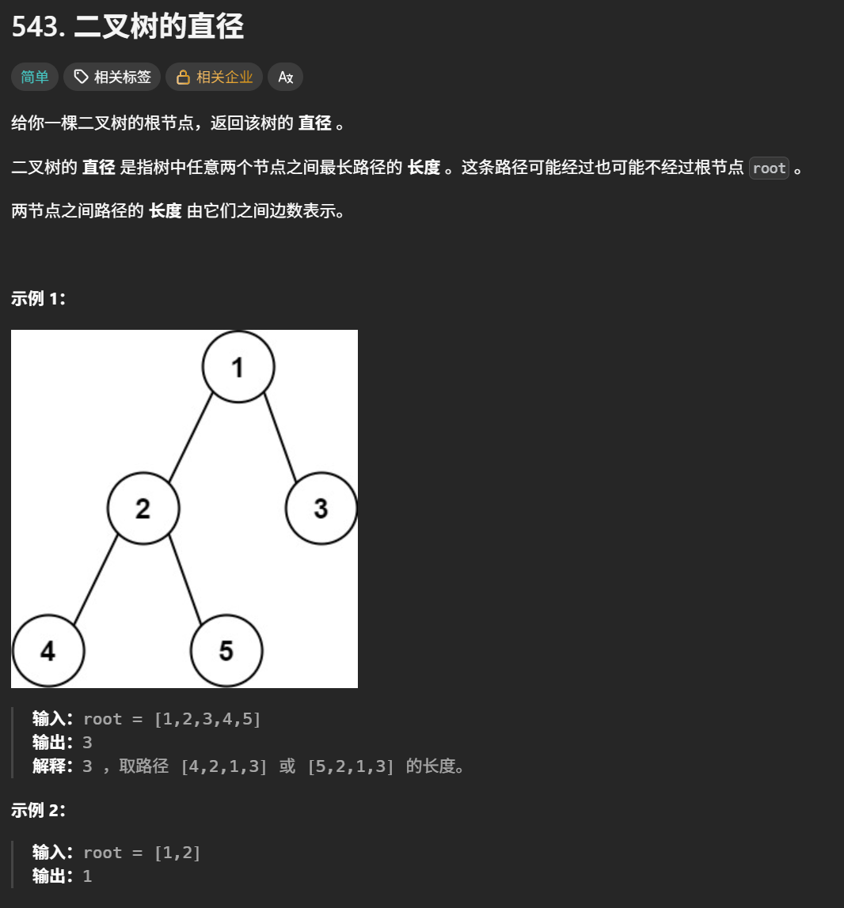

```
private int res = 0;
    public int diameterOfBinaryTree(TreeNode root) {
       getDepth(root);
       return res;
    }

    private int getDepth(TreeNode root) {
        if(root == null){
            return -1;
        }
        int leftLen = getDepth(root.left) + 1;
        int rightLen = getDepth(root.right) + 1;
        res = Math.max(res, leftLen + rightLen);
        return Math.max(leftLen, rightLen);
    }
```

## 二叉树的层序遍历


```
public List<List<Integer>> levelOrder(TreeNode root) {
    if(root == null){
        return new ArrayList<>();
    }
    List<List<Integer>> res = new ArrayList<>();
    List<TreeNode> cur = new ArrayList<>();
    cur.add(root);
    while(!cur.isEmpty()){
        List<Integer> val = new ArrayList<>();
        List<TreeNode> next = new ArrayList<>();
        for(TreeNode node : cur){
            val.add(node.val);
            if(node.left != null){
                next.add(node.left);
            }
            if(node.right != null){
                next.add(node.right);
            }
        }
        res.add(val);
        cur = next;
    }
    return res;
}
```

使用两个集合进行存储，一个存储当前的值，一个存储节点，bfs进行遍历，

广泛搜索，先存储当前的根节点，通过根节点去遍历下一个节点，左节点或者右节点去拿值

以下是使用双端队列进行的搜索

```
public List<List<Integer>> levelOrder(TreeNode root) {
    if(root == null){
        return new ArrayList<>();
    }
    List<List<Integer>> res = new ArrayList<>();
    Queue<TreeNode> queue = new LinkedList<>();
    queue.offer(root);
    while(!queue.isEmpty()){
        List<Integer> val = new ArrayList<>(queue.size());
        for(int i = queue.size(); i > 0; i--){
            TreeNode node = queue.poll();
            val.add(node.val);
            if(node.left != null){
                queue.offer(node.left);
            }
            if(node.right != null){
                queue.offer(node.right);
            }
        }
        res.add(val);
    }
    return res;
}
```

## 将有序数组转换为二叉搜索树


平衡二叉树：树所有节点的左右子树的高度相差不超过1

二叉搜索树：根节点的左子树均是小于根节点的数，左子树的节点也是如此

右子树亦是如此，即两个子树也应当是二叉搜索树

双指针查找有序数组的中间数据作为根节点，随后递归构建左右子树即可

对于树的构建、遍历、搜索一般使用递归

```
public TreeNode sortedArrayToBST(int[] nums) {
    return buildTree(nums, 0, nums.length - 1);
}

public TreeNode buildTree(int[] nums, int left, int right) {
    if (left > right) {
        return null;
    }
    int mid = left + (right - left) / 2;
    TreeNode root = new TreeNode(nums[mid]);
    root.left = buildTree(nums, left, mid - 1);
    root.right = buildTree(nums, mid + 1, right);
    return root;
}
```

## 验证二叉搜索树

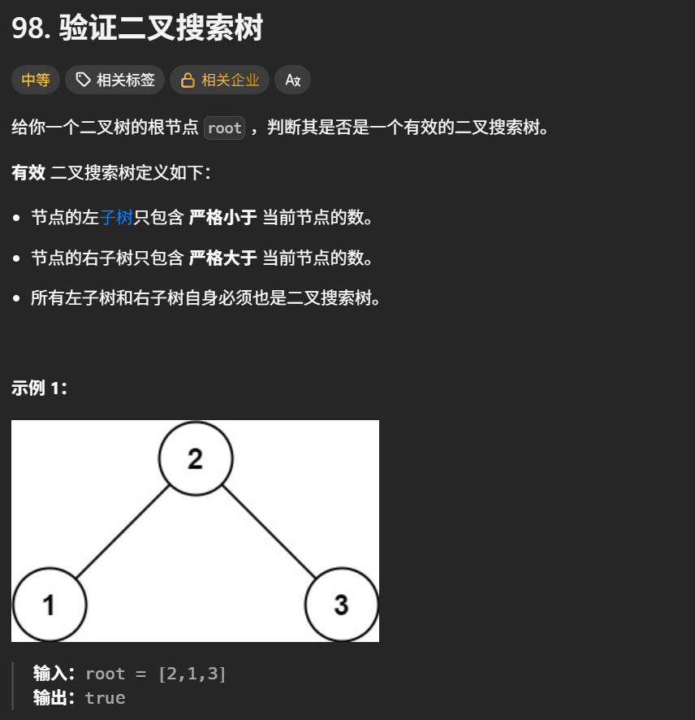

中序遍历二叉树

```
public boolean isValidBST(TreeNode root) {
    Deque<TreeNode> stack = new LinkedList<>();
    long temp = Long.MIN_VALUE;
    while(root != null || !stack.isEmpty()){
        while(root != null){
            stack.push(root);
            root = root.left;
        }
        root = stack.pop();
        if(root.val <= temp){
            return false;
        }
        temp = root.val;
        root = root.right;
    }
    return true;
}
```

## 二叉搜索树中第k小的元素

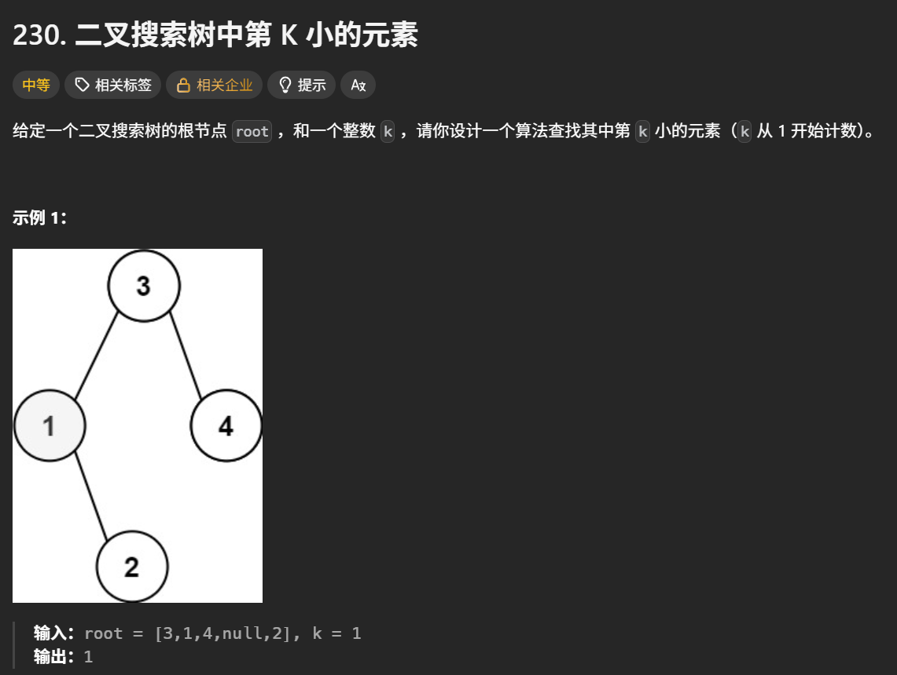

```
public int kthSmallest(TreeNode root, int k) {
    Deque<TreeNode> stack = new LinkedList<>();
    while(root != null || !stack.isEmpty()){
        while(root != null){
            stack.push(root);
            root = root.left;
        }
        root = stack.pop();
        k--;
        if(k == 0){
            break;
        }
        root = root.right;
    }
    return root.val;
}
```

## 二叉树的右视图

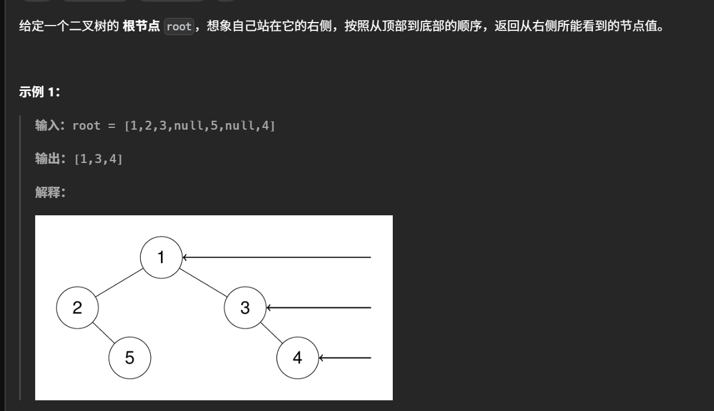

```
public List<Integer> rightSideView(TreeNode root) {
    List<Integer> res = new LinkedList<>();
    if(root == null){
        return res;
    }
    dfs(root,1, res);
    return res;
}

public void dfs(TreeNode root, int level, List<Integer> res){
    if(root == null){
        return;
    }
    if(res.size() < level){
        res.add(root.val);
    }
    dfs(root.right, level + 1, res);
    dfs(root.left, level + 1, res);
}
```

## 二叉树展开为链表

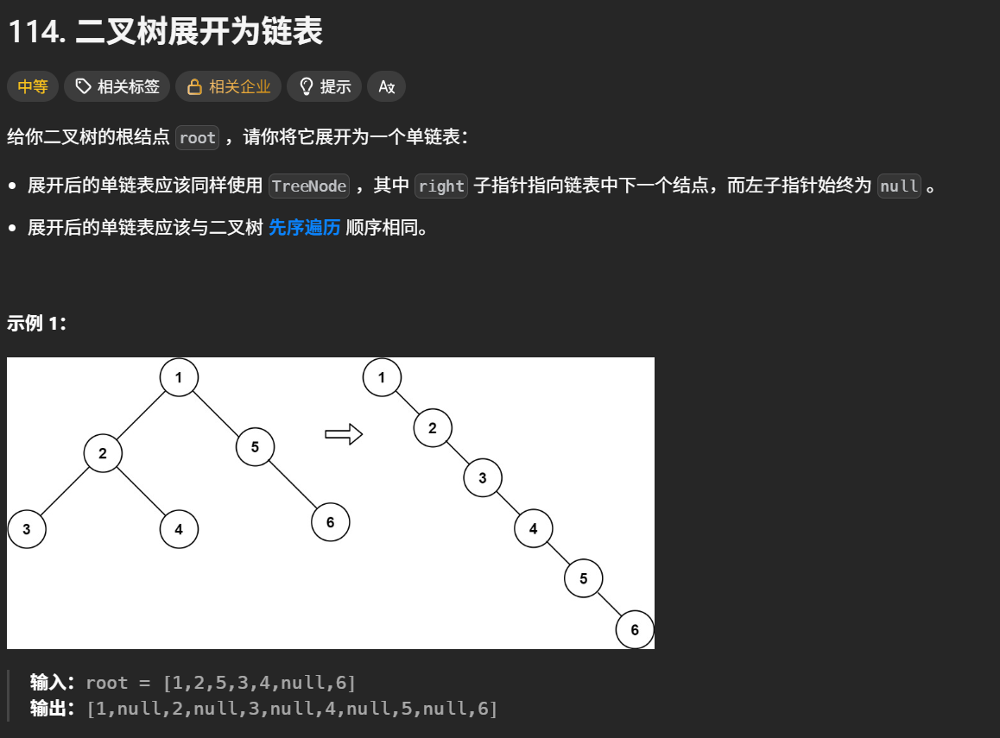

注意这里需要的是先序遍历：中 ->左 ->右

```
public void flatten(TreeNode root) {
    if(root == null){
        return;
    }
    //中序遍历，获取当前结点 中->左->右
    TreeNode cur = root;
    while(cur != null){
        //获取当前结点的左子树
        TreeNode pre = cur.left;
        //查询当前左子树结点的右子树以及其他子树
        if(pre != null){
            //获取当前左子树结点的右子树
            while(pre.right != null){
                pre = pre.right;
            }
            //将当前结点的右子树挂载到当前左子树结点的右子树上
            pre.right = cur.right;
            //将当前左子树结点的左子树挂载到当前结点的右子树上
            cur.right = cur.left;
            //将当前结点的左子树置空
            cur.left = null;
        }
        //获取当前结点的右子树
        cur = cur.right;
    }
}
```

这里还要注意的是左指针始终为空，转为链表之后，所以会有cur.left = null

正常的输出应该会是1,2,3,4,5,6，因为左指针为空所以有了1,null,2,null如此的输出

## 从前序与中序遍历序列构造二叉树

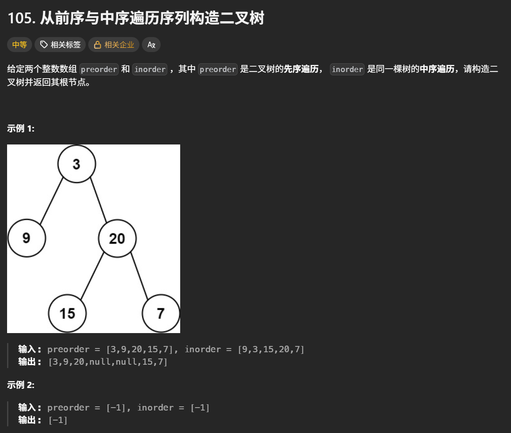

先序遍历：中->左->右

中序遍历：左->中->右

```
public TreeNode buildTree(int[] preorder, int[] inorder) {
    if(preorder.length == 0 || inorder.length == 0){
        return null;
    }
    TreeNode root = new TreeNode(preorder[0]);
    for(int i = 0; i < inorder.length; i++){
        if(inorder[i] == preorder[0]){
            root.left = buildTree(Arrays.copyOfRange(preorder, 1, i + 1), Arrays.copyOfRange(inorder, 0, i));
            root.right = buildTree(Arrays.copyOfRange(preorder, i + 1, preorder.length), Arrays.copyOfRange(inorder, i + 1, inorder.length));
            break;
        }
    }
    return root;
}
```

```
public TreeNode buildTree(int[] preorder, int[] inorder) {
    int n = preorder.length;
    Map<Integer,Integer> index = new HashMap<>(n,1);
    for(int i = 0; i < n; i++){
        index.put(inorder[i], i);
    }
    return dfs(preorder, 0, n, 0, n, index);
}
private TreeNode dfs(int[] preorder, int preL, int preR, int inL, int inR, Map<Integer,Integer> index){
    if(preL == preR){
        return null;
    }
    int leftSize = index.get(preorder[preL]) - inL;
    TreeNode left = dfs(preorder, preL + 1, preL + leftSize + 1,  inL, inL + leftSize, index);
    TreeNode right = dfs(preorder, preL + 1 + leftSize, preR,  inL + 1 + leftSize, inR, index);
    return new TreeNode(preorder[preL], left, right);
}
```

## 路径总和 III

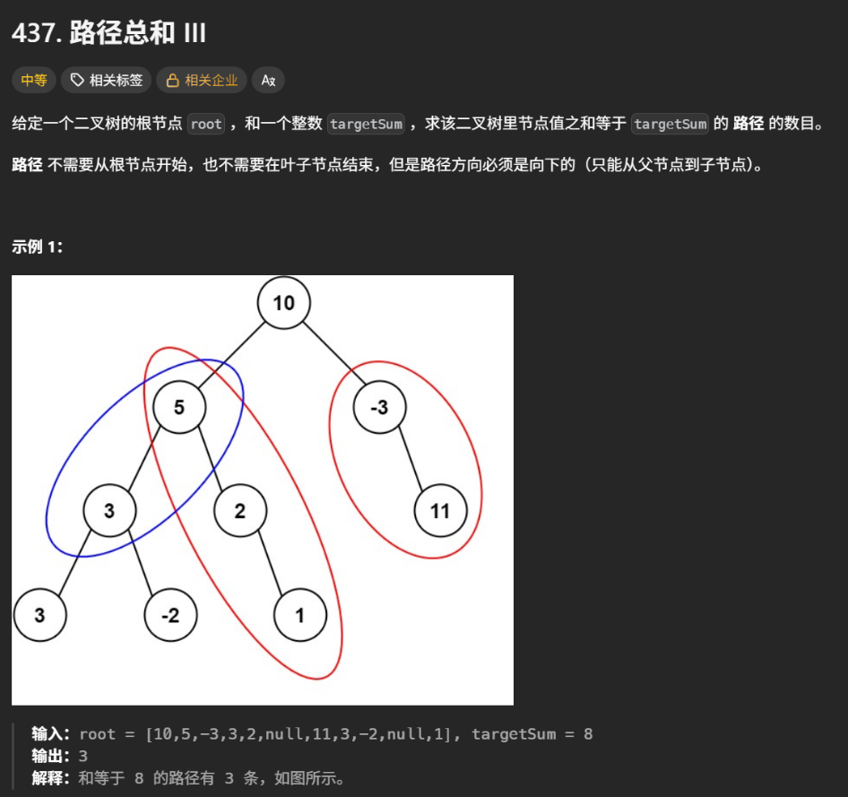

```
    public int pathSum(TreeNode root, int targetSum) {
        if (root == null) {
            return 0;
        }
        Map<Long, Integer> map = new HashMap<>();
        map.put(0L, 1);
        return dfs(root, targetSum, map, 0);
    }

    private int dfs(TreeNode root, int targetSum, Map<Long, Integer> map, long sum) {
        if (root == null) {
            return 0;
        }
        //使用前缀和解法 求出当前节点到根节点的路径和
        //先计算当前节点的值
        sum += root.val;
        //然后通过检索当前路径中是否存在的和为targetSum的路径
        //检索当前节点的路径中是否存在另一个节点值满足其和为targetSum
        int res = map.getOrDefault(sum - targetSum, 0);
        //将当前节点的和加入map中 +1为了统计当前节点到根节点的路径中满足和为targetSum的个数
        map.put(sum, map.getOrDefault(sum, 0) + 1);
        //递归左右子树
        res += dfs(root.left, targetSum, map, sum);
        res += dfs(root.right, targetSum, map, sum);
        //返回结果
        map.put(sum, map.getOrDefault(sum, 0) - 1);
        return res;
    }
```

## 二叉树的最近公共祖先

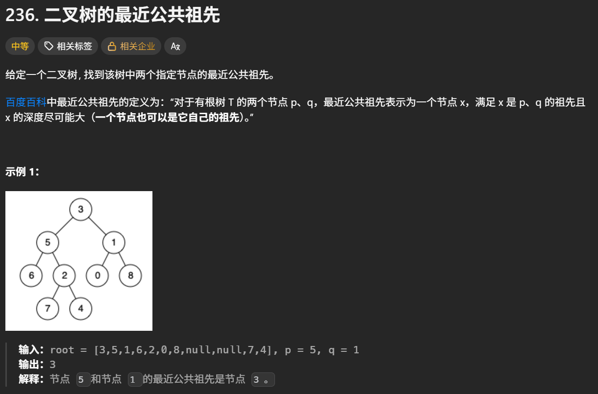

```
    public TreeNode lowestCommonAncestor(TreeNode root, TreeNode p, TreeNode q) {
        if(root == null){
            return null;
        }
        if(root == p || root == q){
            return root;
        }
        TreeNode left = lowestCommonAncestor(root.left, p, q);
        TreeNode right = lowestCommonAncestor(root.right, p, q);
        if(left != null && right != null){
            return root;
        }
        return left != null ? left : right;
    }
```

## 二叉树中的最大路径和

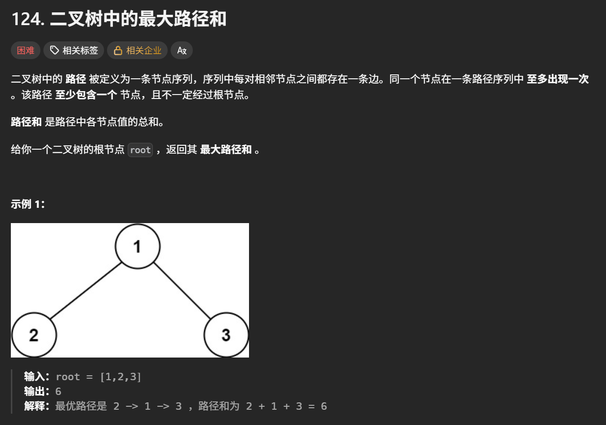

```
int max = Integer.MIN_VALUE;
public int maxPathSum(TreeNode root) {
    dfs(root);
    return max;
}

private int dfs(TreeNode root){
    if(root == null){
        return 0;
    }
    int leftLen = Math.max(dfs(root.left), 0);
    int rightLen = Math.max(dfs(root.right), 0);
    max = Math.max(max, leftLen + rightLen + root.val);
    return Math.max(leftLen, rightLen) + root.val;

}
```

注意：如果直接返回dfs的结果会少去一个当前节点值

通用解法：二叉树有关的dp数组，皆可以将其拆分，从整棵树拆分为左右子树的子问题进行递归求解即可

## 岛屿数量


针对于示例1的岛屿为

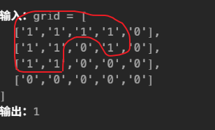

岛屿不管如何排布，只要周围全是水即为岛屿，示例2中的单独'1'即可为单独的岛屿，此时四周都是水

```
private int[][] dirs = new int[][]{{0, 1}, {0, -1}, {1, 0}, {-1, 0}};
private int m, n;
private boolean[][] visited;
public int numIslands(char[][] grid) {
    m = grid.length;
    n = grid[0].length;
    visited = new boolean[m][n];
    int res = 0;
    for(int i = 0; i < m; i++){
        for(int j = 0; j < n; j++){
            if(grid[i][j] == '1' && !visited[i][j]){
                dfs(grid, i, j);
                res++;
            }
        }
    }
    return res;
}

private void dfs(char[][] grid, int i, int j){
    if(i < 0 || i >= m || j < 0 || j >= n || grid[i][j] == '0' || visited[i][j]){
        return;
    }
    visited[i][j] = true;
    for (int[] dir : dirs) {
        int newI = i + dir[0];
        int newJ = j + dir[1];
        dfs(grid, newI, newJ);
    }
}
```

## 腐烂的橘子

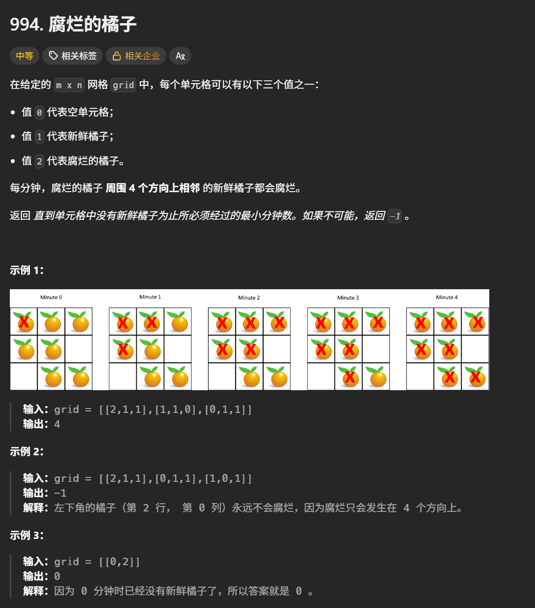

```
private int[][] dirs = {{0, 1}, {0, -1}, {1, 0}, {-1, 0}};

public int orangesRotting(int[][] grid) {
    int m = grid.length;
    int n = grid[0].length;
    int fresh = 0;
    List<int[]> queue = new ArrayList<>();
    for (int i = 0; i < m; i++) {
        for (int j = 0; j < n; j++) {
            // 统计新鲜橘子数量
            if (grid[i][j] == 1) {
                fresh++;
            }
            // 腐烂橘子入队
            if (grid[i][j] == 2) {
                queue.add(new int[]{i, j});
            }
        }
    }
    int res = 0;
    //此时不判断fresh是否大于0的话，循环会多一次，造成res多1
    while (fresh > 0 && !queue.isEmpty()) {
        res++;
        List<int[]> temp = queue;
        queue = new ArrayList<>();
        for (int[] point : temp) {
            for (int[] dir : dirs) {
                int x = point[0] + dir[0];
                int y = point[1] + dir[1];
                if (x >= 0 && x < m && y >= 0 && y < n && grid[x][y] == 1) {
                    fresh--;
                    grid[x][y] = 2;
                    queue.add(new int[]{x, y});
                }
            }
        }
    }
    return fresh > 0 ? -1 : res;

}
```

主要是模仿队列的取值，并且每次的腐烂橘子位置是用数组来代替，比如初始化时的腐烂橘子(0,0)表示，最后根据fresh去访问层级遍历，一层一层去遍历

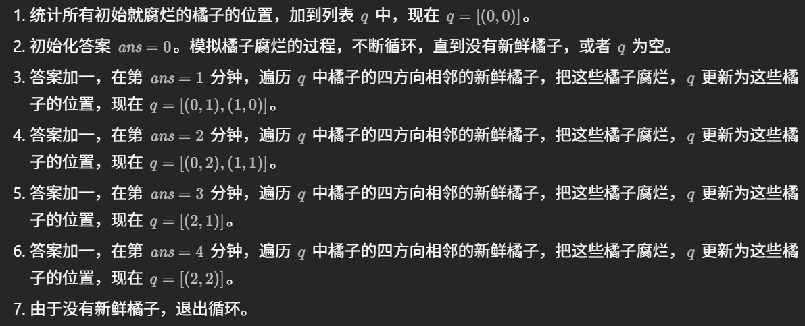

另一种直接使用队列如下

````
class Solution {
    public int orangesRotting(int[][] grid) {


    // 边界 长宽
    int M = grid.length;
    int N = grid[0].length;
    Queue<int[]> queue = new LinkedList<>();

    // count 表示新鲜橘子的数量
    int count = 0; 

    // 遍历二维数组 找出所有的新鲜橘子和腐烂的橘子
    for (int r = 0; r < M; r++) {
        for (int c = 0; c < N; c++) {
            // 新鲜橘子计数
            if (grid[r][c] == 1) {
                count++;
                // 腐烂的橘子就放进队列
            } else if (grid[r][c] == 2) {
                // 缓存腐烂橘子的坐标
                queue.add(new int[]{r, c});
            }
        }
    }

    // round 表示腐烂的轮数，或者分钟数
    int round = 0; 

    // 如果有新鲜橘子 并且 队列不为空
    // 直到上下左右都触及边界 或者 被感染的橘子已经遍历完
    while (count > 0 && !queue.isEmpty()) {

        // BFS 层级 + 1
        round++;

        // 拿到当前层级的腐烂橘子数量， 因为每个层级会更新队列
        int n = queue.size();

        // 遍历当前层级的队列
        for (int i = 0; i < n; i++) {

            // 踢出队列（拿出一个腐烂的橘子）
            int[] orange = queue.poll();

            // 恢复橘子坐标
            int r = orange[0];
            int c = orange[1];

            // ↑ 上邻点 判断是否边界 并且 上方是否是健康的橘子
            if (r-1 >= 0 && grid[r-1][c] == 1) {
                // 感染它 
                grid[r-1][c] = 2;
                // 好橘子 -1 
                count--;
                // 把被感染的橘子放进队列 并缓存
                queue.add(new int[]{r-1, c});
            }
            // ↓ 下邻点 同上
            if (r+1 < M && grid[r+1][c] == 1) {
                grid[r+1][c] = 2;
                count--;
                queue.add(new int[]{r+1, c});
            }
            // ← 左邻点 同上
            if (c-1 >= 0 && grid[r][c-1] == 1) {
                grid[r][c-1] = 2;
                count--;
                queue.add(new int[]{r, c-1});
            }
            // → 右邻点 同上
            if (c+1 < N && grid[r][c+1] == 1) {
                grid[r][c+1] = 2;
                count--;
                queue.add(new int[]{r, c+1});
            }
        }
    }

    // 如果此时还有健康的橘子
    // 返回 -1
    // 否则 返回层级
    if (count > 0) {
        return -1;
    } else {
        return round;
    }
    }
}
````

## 课程表

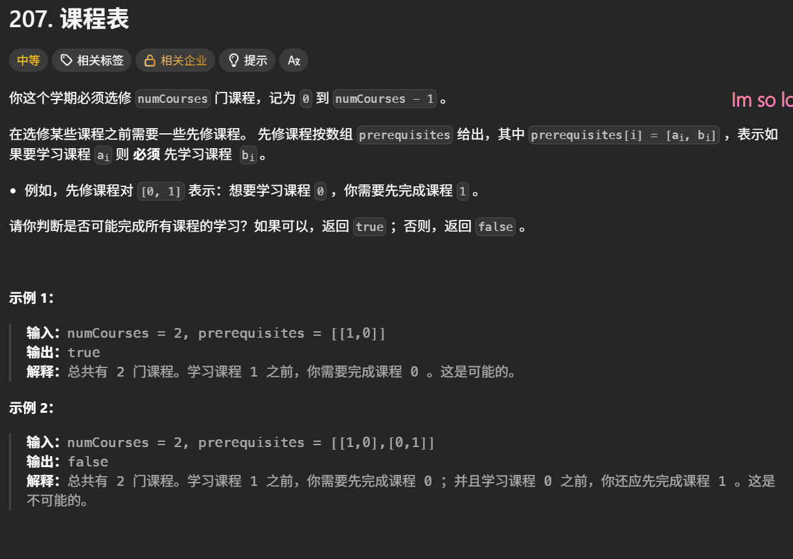

```
public boolean canFinish(int numCourses, int[][] prerequisites) {
    //用于记录是否被访问 0 未访问 1 正在访问 2 访问完成
    int[] state = new int[numCourses];
    //将数据创建为邻接表
    List<Integer>[] graph = new ArrayList[numCourses];
    for(int i = 0; i < numCourses; i++){
        graph[i] = new ArrayList<>();
    }
    //每次都是由b1指向a1构成一个有方向的图
    for(int[] pre : prerequisites){
        graph[pre[1]].add(pre[0]);
    }
    for(int i = 0; i < numCourses; i++){
        if(state[i] == 0 && dfs(graph, i, state)){
            return false;
        }
    }

    return true;
}

private boolean dfs(List<Integer>[] graph, int i, int[] state){
    //当前的图端点正在访问
    state[i] = 1;
    for(int next : graph[i]){
        //如果当前图端点正在访问 或者 当前图端点没有被访问过
        //则进行递归
        //state[next] == 1说明找到了环
        //state[next] == 0说明当前图端点没有被访问过 需要继续递归
        //state[next] == 2说明当前图端点访问完成 没有找到环
        if(state[next] == 1 || state[next] == 0 && dfs(graph, next, state)){
            return true;
        }
    }
    //当前的图端点访问完成 此时并没有找到环
    state[i] = 2;
    return false;
}
```

此题的主要思路是拓扑排序，如果当前的课程存在环的话则无法完成课程，如果不存在环的话则可以完成课程，即将整个序列进行拓扑排序即可

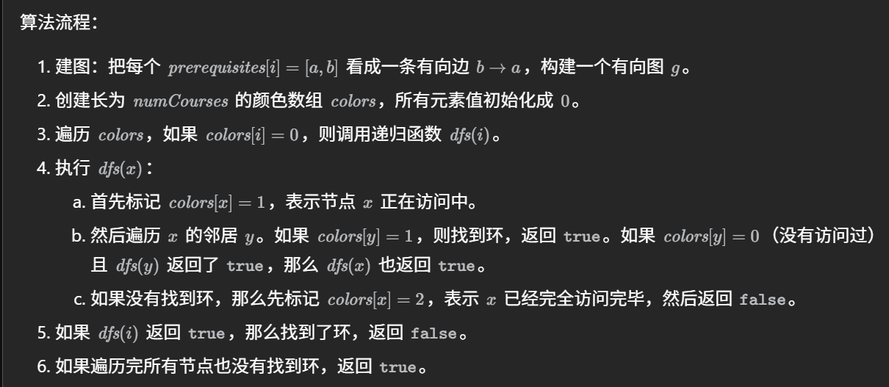

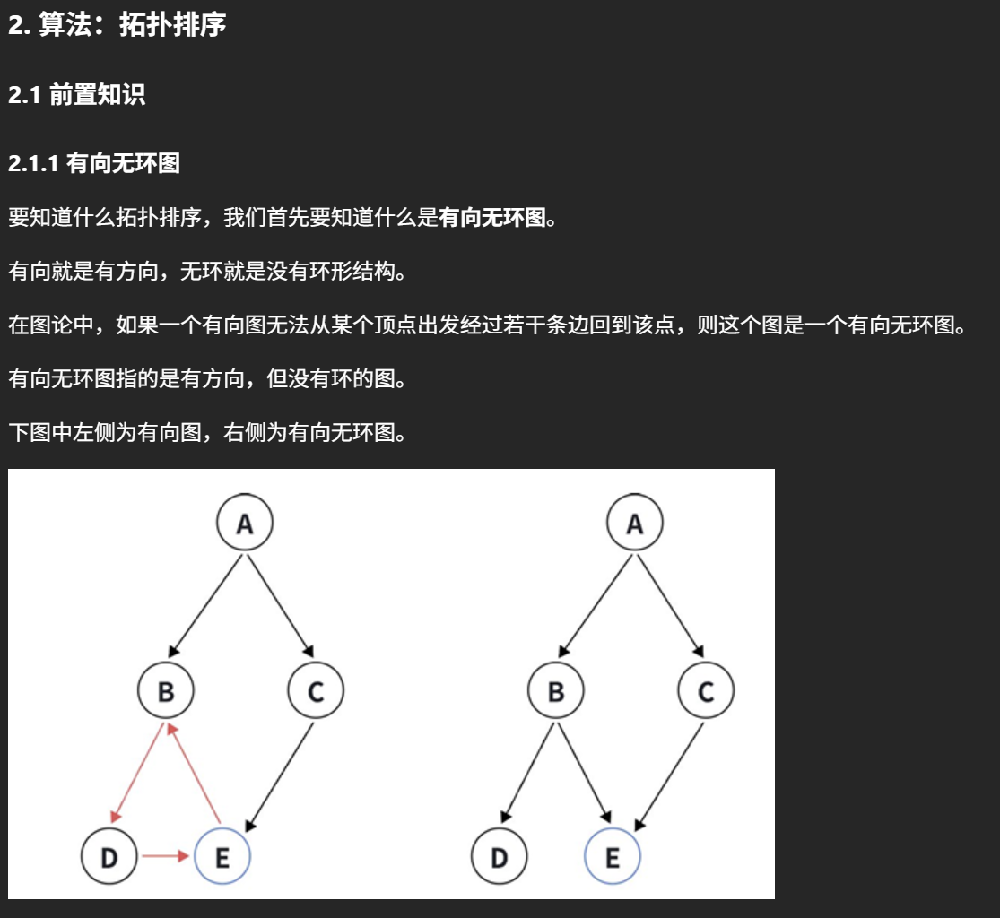

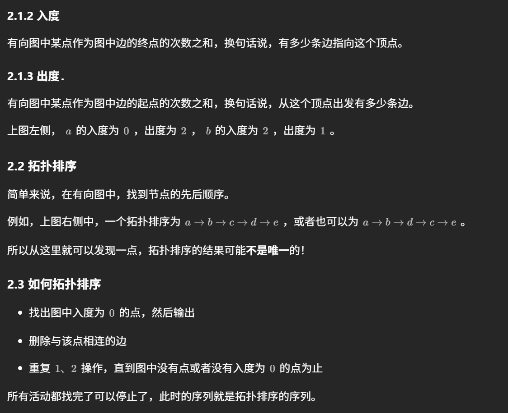

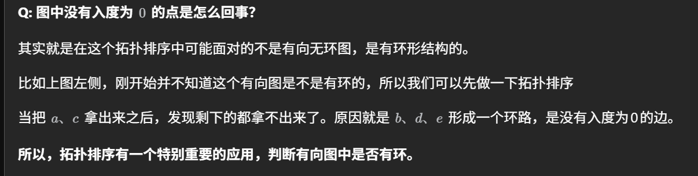

````
class Solution {
    public boolean canFinish(int numCourses, int[][] prerequisites) {
        // 1. 入度数组
        int[] inDegree = new int[numCourses];
        
        // 2. 链式前向星（数组模拟邻接表）
        // head[i] 存储以 i 为起点的第一条边的索引
        int[] head = new int[numCourses];
        // next[j] 存储与第 j 条边同起点的下一条边的索引
        int[] next = new int[prerequisites.length];
        // to[j] 存储第 j 条边的终点
        int[] to = new int[prerequisites.length];
        
        // 初始化 head 数组为 -1
        for (int i = 0; i < numCourses; i++) head[i] = -1;

        // 3. 构造图并统计入度
        for (int i = 0; i < prerequisites.length; i++) {
            int cur = prerequisites[i][0];
            int pre = prerequisites[i][1];
            inDegree[cur]++;
            
            // 添加边：pre -> cur
            to[i] = cur;
            next[i] = head[pre];
            head[pre] = i;
        }

        // 4. 数组模拟队列
        int[] queue = new int[numCourses];
        int l = 0, r = 0; // 左右指针
        
        // 将入度为 0 的入队
        for (int i = 0; i < numCourses; i++) {
            if (inDegree[i] == 0) {
                queue[r++] = i;
            }
        }

        // 5. 拓扑排序
        int count = 0;
        while (l < r) {
            int pre = queue[l++]; // 出队
            count++;
            
            // 遍历以 pre 为起点的所有边
            for (int i = head[pre]; i != -1; i = next[i]) {
                int target = to[i];
                if (--inDegree[target] == 0) {
                    queue[r++] = target;
                }
            }
        }

        return count == numCourses;
    }
}
````

## 实现Trie(前缀树)

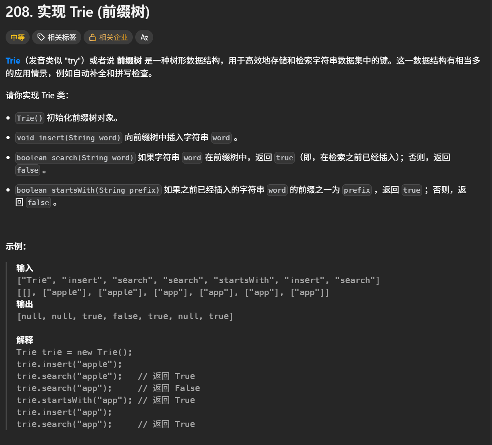

```
package leetcodehot100;

/**
 * @author 自然醒
 * @version 1.0
 */


/**
 * 实现前缀树
 * 前缀树一种树形数据结构，用于高效地存储和检索字符串数据集中的键。可以用作自动补全和拼写检查
 * 请实现Trie类：
 * Trie() 初始化前缀树对象。
 * void insert(String word) 向前缀树中插入字符串word。
 * boolean search(String word) 如果字符串word在前缀树中，返回true（即，在检索之前已经插入）；否则，返回false。
 * boolean startsWith(String prefix) 如果之前已经插入的字符串word的 前缀之一为prefix，返回true；否则，返回false。
 */

public class hot55 {

    class Trie {
        //针对于该对象创建一个对应的节点数组，每个节点数组对应一个字符
        private Trie[] node;
        //用于记录当前节点是否是一个字符串的结束
        private boolean isEnd;

        public Trie() {
            node = new Trie[26];
            isEnd = false;
        }


        public void insert(String word) {
            Trie node = this;
            //
            for(int i = 0; i < word.length(); i++){
                char ch = word.charAt(i);
                int idx = ch - 'a';
                //在插入数据时
                //判断当前节点数组是否为空 如果不存在则直接new一个新的出来
                //每一个节点数组均有26个长度
                if(node.node[idx] == null){
                    node.node[idx] = new Trie();
                }
                node = node.node[idx];
            }
            node.isEnd = true;
        }

        public boolean search(String word) {
            Trie node = this;
            for(int i = 0; i < word.length(); i++){
                char ch = word.charAt(i);
                int idx = ch - 'a';
                if(node.node[idx] == null){
                    return false;
                }
                node = node.node[idx];
            }
            //当前节点不为空 且当前节点是字符串的结束
            return node!=null && node.isEnd;
        }

        public boolean startsWith(String prefix) {
            Trie node = this;
            for(int i = 0; i < prefix.length(); i++){
                char ch = prefix.charAt(i);
                int idx = ch - 'a';
                if(node.node[idx] == null){
                    return false;
                }
                node = node.node[idx];
            }
            return true;
        }
    }
    
}
```

主要可能卡的点在于搜索时的判断，只有当前节点存在并且已经遍历到此节点中的字符的最后一个字符才算真正的找到该字符串，因为在第一次插入时会生成一个对应的节点，一个节点代表一个字符，此时插入之后会存于节点之中，随后去搜索的时候则也是通过节点去遍历搜索，遍历搜索到相同的节点之后便会返回，并且此时的end也代表结束，看下图即可

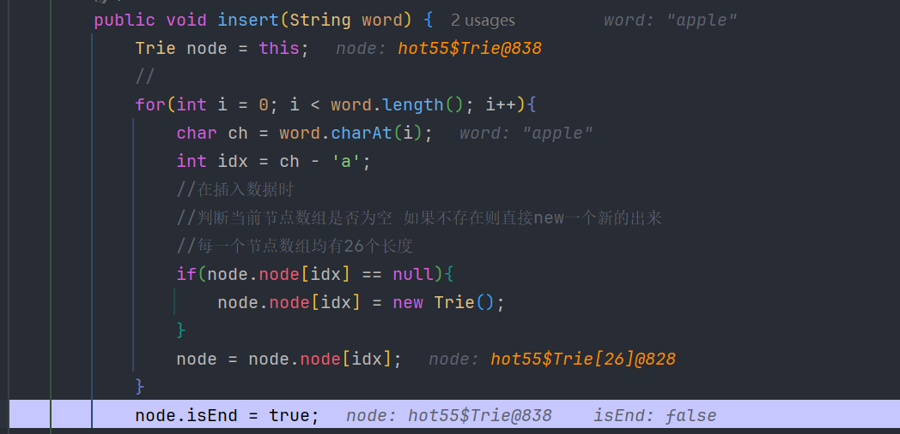

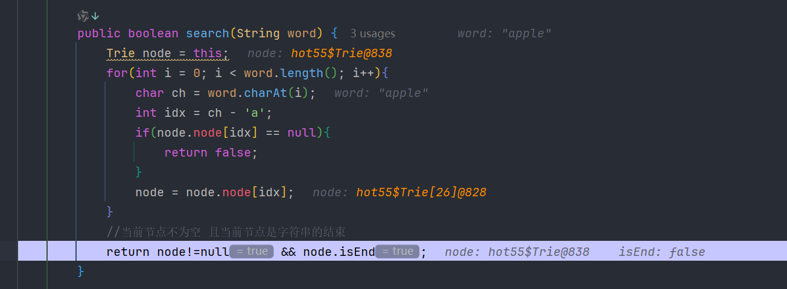

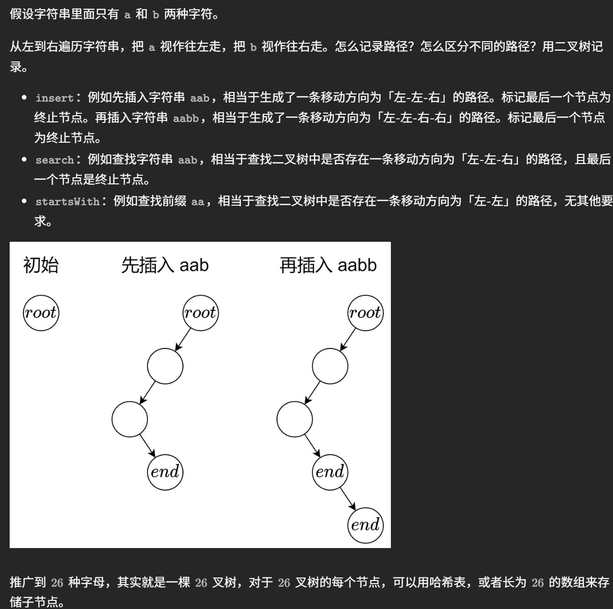

## 全排列

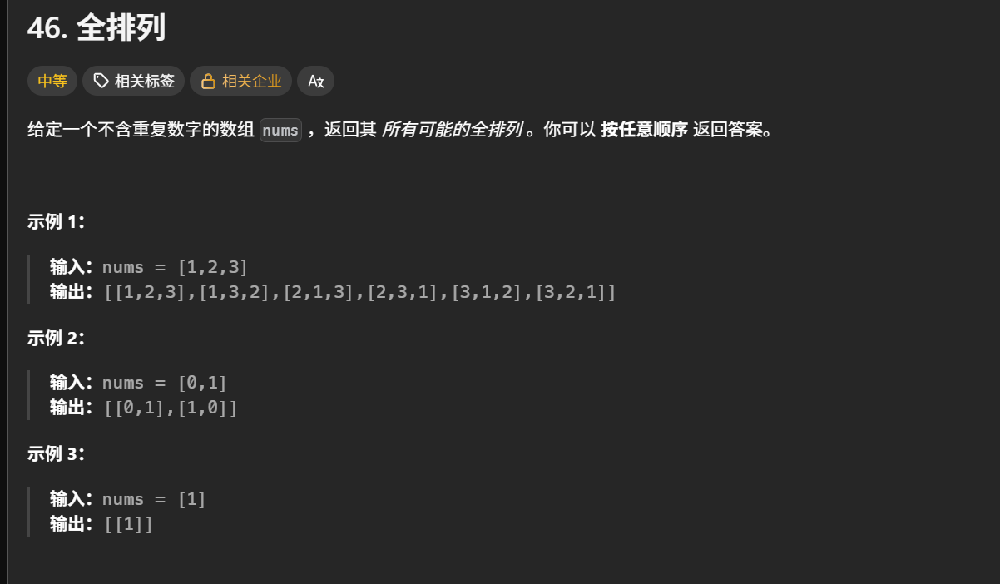

```
public List<List<Integer>> permute(int[] nums) {
    List<List<Integer>> res = new ArrayList<>();
    if(nums == null || nums.length == 0){
        return res;
    }
    List<Integer> tmp = new ArrayList<>();
    for(int num: nums){
        tmp.add(num);
    }
    int len = nums.length;
    backtrack(res, tmp, len, 0);
    return res;
}

private void backtrack(List<List<Integer>> res, List<Integer> tmp, int len, int index){
    if(index == len){
        res.add(new ArrayList<>(tmp));
        return;
    }
    for(int i = index; i < len; i++){
        // 剪枝处理
        if(i!= index && tmp.get(i) == tmp.get(index)){
            continue;
        }
        // 交换位置
        int temp = tmp.get(i);
        tmp.set(i, tmp.get(index));
        tmp.set(index, temp);
        backtrack(res, tmp, len, index + 1);
        // 恢复位置
        temp = tmp.get(i);
        tmp.set(i, tmp.get(index));
        tmp.set(index, temp);
    }
}
```


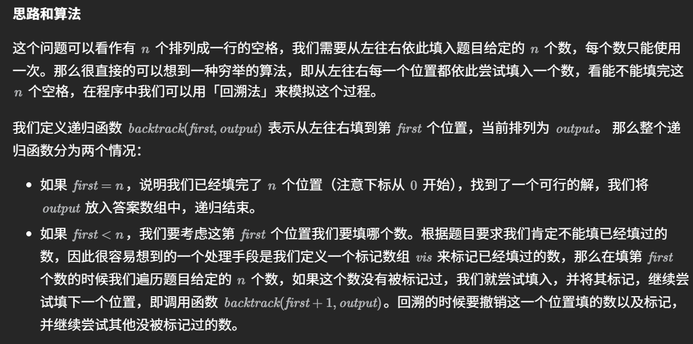

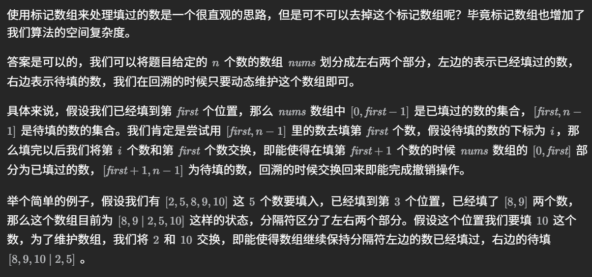

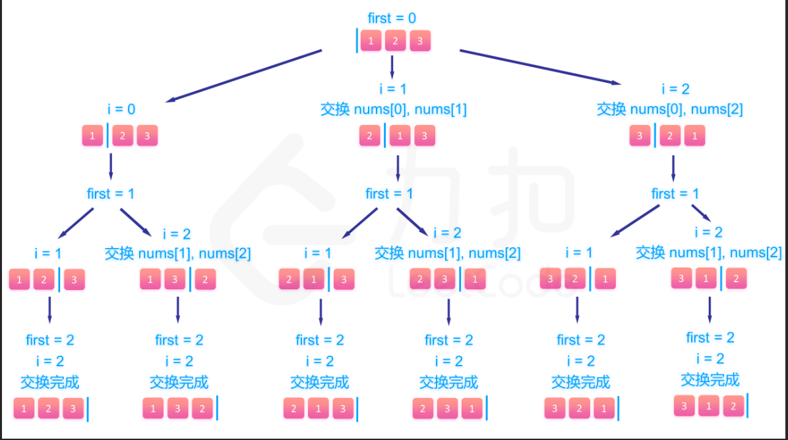

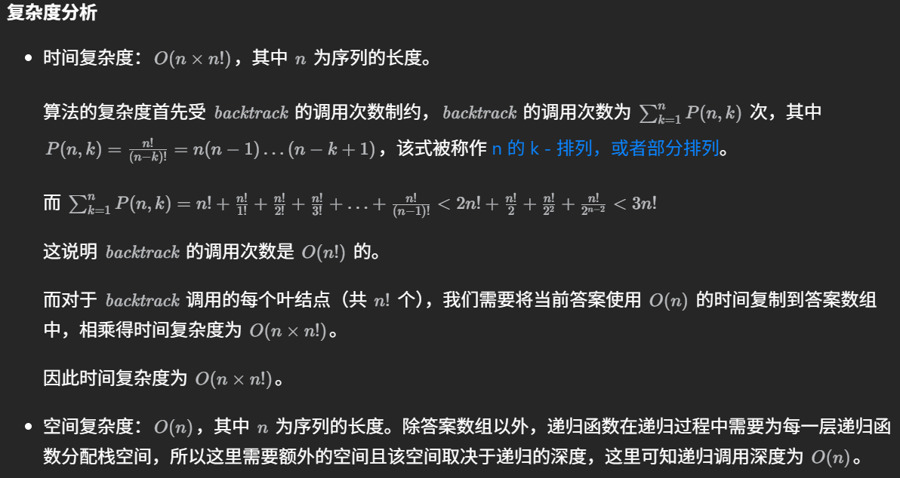

以下是用数组标记的方法

````
class Solution {
    public List<List<Integer>> permute(int[] nums) {
        int n = nums.length;
        List<Integer> path = Arrays.asList(new Integer[n]); // 所有排列的长度都是一样的 n
        boolean[] onPath = new boolean[n];
        List<List<Integer>> ans = new ArrayList<>();

        dfs(0, nums, ans, path, onPath);
        return ans;
    }

    // 枚举 path[i] 填 nums 的哪个数
    private void dfs(int i, int[] nums, List<List<Integer>> ans, List<Integer> path, boolean[] onPath) {
        if (i == nums.length) {
            ans.add(new ArrayList<>(path));
            return;
        }

        for (int j = 0; j < nums.length; j++) {
            if (!onPath[j]) {
                path.set(i, nums[j]); // 从没有选的数字中选一个
                onPath[j] = true; // 已选上
                dfs(i + 1, nums, ans, path, onPath);
                onPath[j] = false; // 恢复现场
                // 注意 path 无需恢复现场，因为排列长度固定，直接覆盖就行
            }
        }
    }
}
````

## 子集

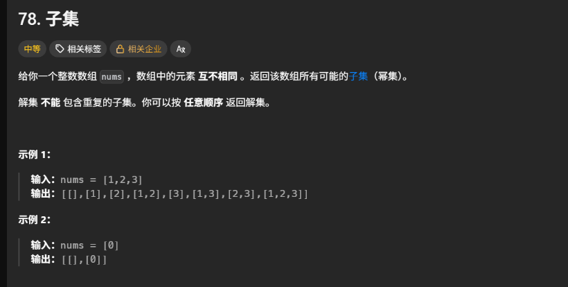

```
public List<List<Integer>> subsets(int[] nums) {
    List<List<Integer>> res = new ArrayList<>();
    List<Integer> path = new ArrayList<>();
    backtrack(res,path,nums,0);
    return res;
}

private void backtrack(List<List<Integer>> res,List<Integer> path,int[] nums,int index){
    res.add(new ArrayList<>(path));
    for(int i = index; i <nums.length; i++){
        path.add(nums[i]);
        backtrack(res,path,nums,i+1);
        path.remove(path.size()-1);
    }
}
```

解题思路：一样的回溯思路，结果集与路径集(临时保存现场)，面向答案的取值，从0到nums.length去取值回溯，枚举每一个值去找它的组合排列，最后再恢复现场

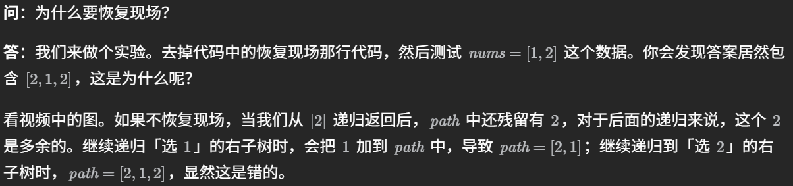

另一种面向输入的取值

````
class Solution {
    public List<List<Integer>> subsets(int[] nums) {
        List<List<Integer>> ans = new ArrayList<>();
        List<Integer> path = new ArrayList<>();
        dfs(0, nums, path, ans);
        return ans;
    }

    // 选或不选：讨论 nums[i] 是否加入 path
    private void dfs(int i, int[] nums, List<Integer> path, List<List<Integer>> ans) {
        if (i == nums.length) { // 子集构造完毕
            ans.add(new ArrayList<>(path)); // 复制 path
            return;
        }

        // 不选 nums[i]
        dfs(i + 1, nums, path, ans); // 考虑下一个数 nums[i+1] 选或不选

        // 选 nums[i]
        path.add(nums[i]);
        dfs(i + 1, nums, path, ans); // 考虑下一个数 nums[i+1] 选或不选
        path.removeLast(); // path.remove(path.size() - 1);
    }
}
````

二进制枚举，空间为O(1)

```
class Solution {
    public List<List<Integer>> subsets(int[] nums) {
        int n = nums.length;
        List<List<Integer>> ans = new ArrayList<>(1 << n); // 预分配空间
        for (int i = 0; i < (1 << n); i++) { // 枚举全集 U 的所有子集 i
            List<Integer> subset = new ArrayList<>();
            for (int j = 0; j < n; j++) {
                if ((i >> j & 1) == 1) { // j 在集合 i 中
                    subset.add(nums[j]);
                }
            }
            ans.add(subset);
        }
        return ans;
    }
}
```

## 电话号码的字母组合


```
public List<String> letterCombinations(String digits){
    String[] numMap = {"","","abc","def","ghi","jkl","mno","pqrs","tuv","wxyz"};
    List<String> res = new ArrayList<>();
    if(digits == null || digits.length() == 0){
        return res;
    }
    backtrack(res,numMap,digits,0,new StringBuilder());
    return res;
}

private void backtrack(List<String> res,String[] numMap,String digits,int idx,StringBuilder path){
    if(idx == digits.length()){
        res.add(path.toString());
        return;
    }
    String letters = numMap[digits.charAt(idx) - '0'];
    for(int i = 0; i < letters.length(); i++){
        path.append(letters.charAt(i));
        backtrack(res,numMap,digits,idx+1,path);
        path.deleteCharAt(path.length()-1);
    }
}
```

我想着用map集合去存储，但是一直过不了，老是读了空指针，所以只能用数组了

其实思路都一样，临时现场再去恢复即可

## 组合总和

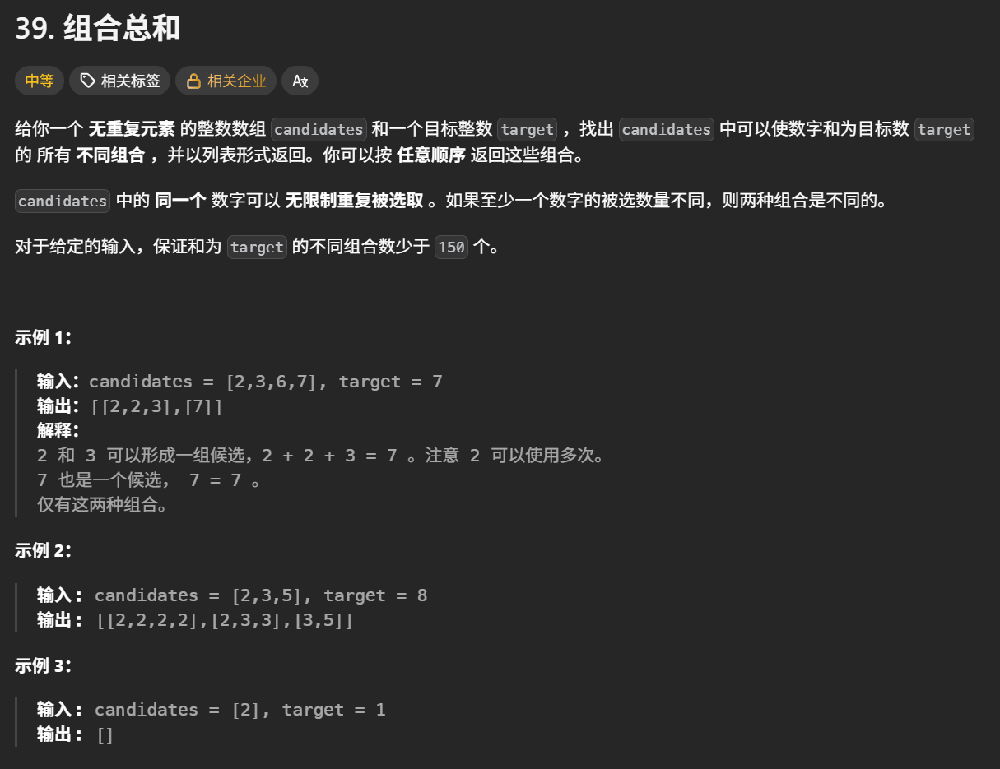

```
public List<List<Integer>> combinationSum(int[] candidates, int target) {
    List<List<Integer>> res = new ArrayList<>();
    List<Integer> path = new ArrayList<>();
    backtrack(res,path,candidates,target,0);
    return res;
}

private void backtrack(List<List<Integer>> res,List<Integer> path,int[] candidates,int target,int index){
    if(target < 0 || index == candidates.length){
        return;
    }
    if(target == 0){
        res.add(new ArrayList<>(path));
        return;
    }
    backtrack(res,path,candidates,target,index + 1);
    path.add(candidates[index]);
    backtrack(res,path,candidates,target - candidates[index],index);
    path.remove(path.size()-1);
}
```

## 括号生成

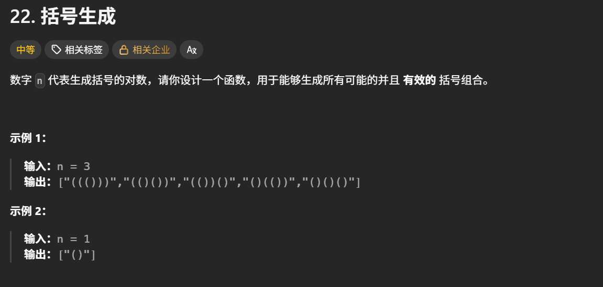

```
public List<String> generateParenthesis(int n) {
    List<String> res = new ArrayList<>();
    backstrack(res,new StringBuilder(),0,0,n);
    return res;
}

private void backstrack(List<String> res,StringBuilder path,int left,int right,int n){
    if(path.length() == n*2){
        res.add(path.toString());
        return;
    }
    if(left < n){
        path.append("(");
        backstrack(res,path,left+1,right,n);
        path.deleteCharAt(path.length()-1);
    }
    if(right < left){
        path.append(")");
        backstrack(res,path,left,right+1,n);
        path.deleteCharAt(path.length()-1);
    }
}
```

## 单词搜索

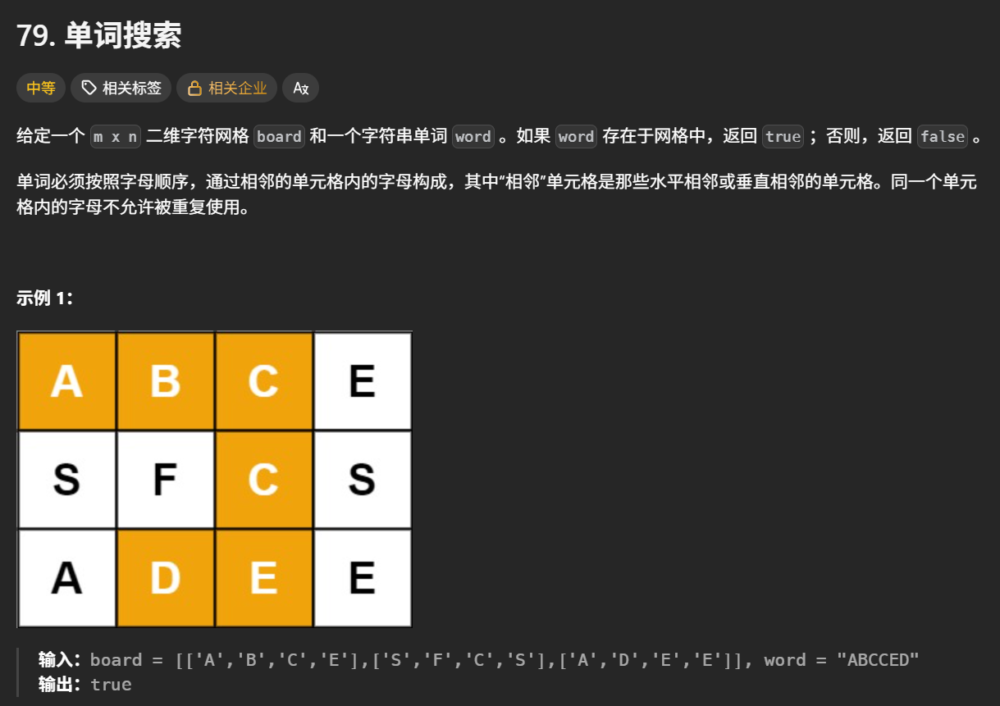

```
public boolean exist(char[][] board, String word) {
    int m = board.length;
    int n = board[0].length;
    for(int i = 0; i < m; i++){
        for(int j = 0; j < n; j++){
            if(dfs(board,word,i,j,0)){
                return true;
            }
        }
    }
    return false;
}

private boolean dfs(char[][] board, String word, int i, int j, int index){
    if(index == word.length()){
        return true;
    }
    if(i < 0 || i >= board.length || j < 0 || j >= board[0].length || board[i][j] != word.charAt(index)){
        return false;
    }
    //临时现场
    char temp = board[i][j];
    board[i][j] = '.';
    boolean res = dfs(board,word,i + 1,j,index + 1) || dfs(board,word,i - 1,j,index + 1) || dfs(board,word,i,j + 1,index + 1) || dfs(board,word,i,j - 1,index + 1);
    //恢复现场
    board[i][j] = temp;
    return res;
}
```

上述一种暴力遍历 也就是像岛屿一样的题目通过上下左右位置遍历 不过是同时递归四种情况

```
public static int[][] dirs = new int[][]{{0,1},{0,-1},{1,0},{-1,0}};

public boolean exist(char[][] board, String word) {
    int m = board.length;
    int n = board[0].length;
    for(int i = 0; i < m; i++){
        for(int j = 0; j < n; j++){
            if(dfs(board,word,i,j,0)){
                return true;
            }
        }
    }
    return false;
}

private boolean dfs(char[][] board, String word, int i, int j, int index){
    if(word.length() == 1){
        return board[i][j] == word.charAt(0);
    }
    if(index == word.length()){
        return true;
    }
    if(i < 0 || i >= board.length || j < 0 || j >= board[0].length || board[i][j] != word.charAt(index)){
        return false;
    }
    board[i][j] = 0;
    for(int[] dir:dirs){
        int x = i + dir[0];
        int y = j + dir[1];
        if(x>=0 && x < board.length && y >= 0 && y < board[x].length && dfs(board,word,x,y,index+1)){
            return true;
        }
    }
    board[i][j] = word.charAt(index);
    return false;
}
```

以下是优化方法，通过记录其次数与反转两个优化

````
class Solution {
    private static final int[][] DIRS = {{0, -1}, {0, 1}, {-1, 0}, {1, 0}};

    public boolean exist(char[][] board, String word) {
        // 为了方便，直接用数组代替哈希表
        int[] cnt = new int[128];
        for (char[] row : board) {
            for (char c : row) {
                cnt[c]++;
            }
        }

        // 优化一
        char[] w = word.toCharArray();
        int[] wordCnt = new int[128];
        for (char c : w) {
            if (++wordCnt[c] > cnt[c]) {
                return false;
            }
        }

        // 优化二
        if (cnt[w[w.length - 1]] < cnt[w[0]]) {
            w = new StringBuilder(word).reverse().toString().toCharArray();
        }

        for (int i = 0; i < board.length; i++) {
            for (int j = 0; j < board[i].length; j++) {
                if (dfs(i, j, 0, board, w)) {
                    return true; // 搜到了！
                }
            }
        }
        return false; // 没搜到
    }

    private boolean dfs(int i, int j, int k, char[][] board, char[] word) {
        if (board[i][j] != word[k]) { // 匹配失败
            return false;
        }
        if (k == word.length - 1) { // 匹配成功！
            return true;
        }
        board[i][j] = 0; // 标记访问过
        for (int[] d : DIRS) {
            int x = i + d[0];
            int y = j + d[1]; // 相邻格子
            if (0 <= x && x < board.length && 0 <= y && y < board[x].length && dfs(x, y, k + 1, board, word)) {
                return true; // 搜到了！
            }
        }
        board[i][j] = word[k]; // 恢复现场
        return false; // 没搜到
    }
}
````

## 分割回文串

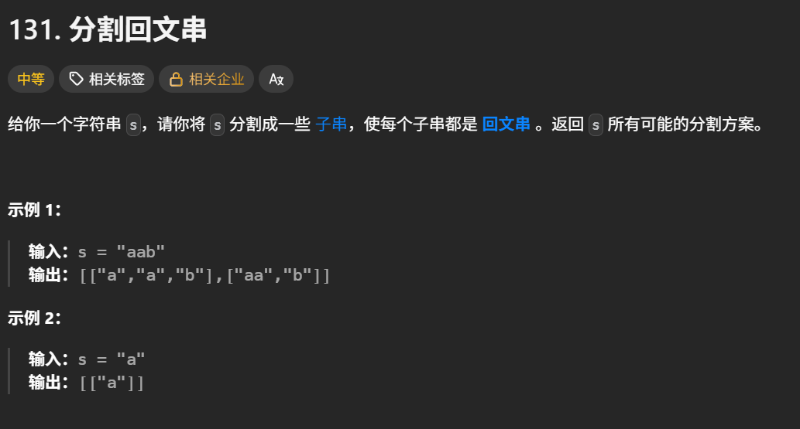

```
public List<List<String>> partition(String s) {
    List<List<String>> res = new ArrayList<>();
    List<String> path = new ArrayList<>();
    backstrap(s,0,path,res);
    return res;
}

private void backstrap(String s,int index,List<String> path,List<List<String>> res){
    if(index == s.length()){
        res.add(new ArrayList<>(path));
        return;
    }
    for(int i = index; i < s.length(); i++){
        if(isPalindrome(s,index,i)){
            path.add(s.substring(index,i+1));
            backstrap(s,i+1,path,res);
            path.remove(path.size()-1);
        }
    }
}

private boolean isPalindrome(String s,int left,int right){
    while(left < right){
        if(s.charAt(left) != s.charAt(right)){
            return false;
        }
        left++;
        right--;
    }
    return true;
}
```

动态规划优化

````
import java.util.ArrayDeque;
import java.util.ArrayList;
import java.util.Deque;
import java.util.List;

public class Solution {

    public List<List<String>> partition(String s) {
        int len = s.length();
        List<List<String>> res = new ArrayList<>();
        if (len == 0) {
            return res;
        }

        char[] charArray = s.toCharArray();
        // 预处理
        // 状态：dp[i][j] 表示 s[i][j] 是否是回文
        boolean[][] dp = new boolean[len][len];
        // 状态转移方程：在 s[i] == s[j] 的时候，dp[i][j] 参考 dp[i + 1][j - 1]
        for (int right = 0; right < len; right++) {
            // 注意：left <= right 取等号表示 1 个字符的时候也需要判断
            for (int left = 0; left <= right; left++) {
                if (charArray[left] == charArray[right] && (right - left <= 2 || dp[left + 1][right - 1])) {
                    dp[left][right] = true;
                }
            }
        }

        Deque<String> stack = new ArrayDeque<>();
        dfs(s, 0, len, dp, stack, res);
        return res;
    }

    private void dfs(String s, int index, int len, boolean[][] dp, Deque<String> path, List<List<String>> res) {
        if (index == len) {
            res.add(new ArrayList<>(path));
            return;
        }

        for (int i = index; i < len; i++) {
            if (dp[index][i]) {
                path.addLast(s.substring(index, i + 1));
                dfs(s, i + 1, len, dp, path, res);
                path.removeLast();
            }
        }
    }
}
````

中心扩展优化

```
class Solution {
    public List<List<String>> partition(String s) {
        List<List<String>> res = new ArrayList<>();
        int len = s.length();
        boolean[][] dp = new boolean[len][len];
        for(int i = 0; i < len; i++){
            prePro(s, i, i, dp);
            prePro(s, i, i + 1, dp);
        }
        helper(res, new ArrayList<>(), s, 0, dp);
        return res;
    }
	
    //进行预处理，利用中心扩展 将所有回文子串的位置存储到 dp 中
    private void prePro(String s, int left , int right, boolean[][] dp){
        while(left >= 0 && right < s.length() && s.charAt(left) == s.charAt(right)){
            dp[left][right] = true;
            left--;
            right++;
        }
    }
	
    private void helper(List<List<String>> res, List<String> list, String s, int index, boolean[][] dp){
        if(index == s.length()){
            res.add(new ArrayList<>(list));
            return;
        }
        for(int i = index; i < s.length(); i++){
            //利用预处理结果就不用再去判断该字符串是否是回文串
            if(!dp[index][i]){
                continue;
            }
            list.add(s.substring(index, i + 1));
            helper(res, list, s, i + 1, dp);
            list.remove(list.size() - 1);
        }
    }
}
```

## N皇后问题

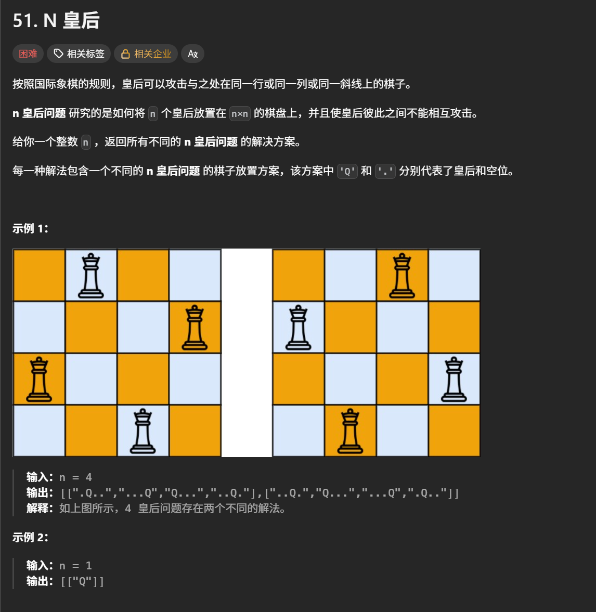

```
public static int[][] dirs = new int[][]{{0,1},{0,-1},{1,0},{-1,0},{1,1},{1,-1},{-1,-1},{-1,1}};

public List<List<String>> solveNQueens(int n) {
    List<List<String>> res = new ArrayList<>();
    char[][] board = new char[n][n];
    for(int i = 0; i < n; i++){
        for(int j = 0; j < n; j++){
            board[i][j] = '.';
        }
    }
    traceback(board,0,res);
    return res;
}

private void traceback(char[][] board,int index,List<List<String>> res){
    if(index == board.length){
        res.add(new ArrayList<>(construct(board)));
    }
    int n = board.length;
    for(int i = 0; i < n; i++){
        if(isValid(board,index,i)){
            board[index][i] = 'Q';
            traceback(board,index+1,res);
            board[index][i] = '.';
        }
    }
}

private List<String> construct(char[][] board){
    List<String> list = new ArrayList<>();
    for(int i = 0; i < board.length; i++){
        String s = new String(board[i]);
        list.add(s);
    }
    return list;
}

private boolean isValid(char[][] board,int i,int j){
    for(int[] dir : dirs){
        int x = i + dir[0];
        int y = j + dir[1];
        while(x >= 0 && x < board.length && y >= 0 && y < board[x].length){
            if(board[x][y] == 'Q'){
                return false;
            }
            x += dir[0];
            y += dir[1];
        }

    }
    return true;
}
```

直接模拟棋盘走法，上下左右左下右上左上右下八个方向进行搜索，随后直接套模版，递归回溯即可，这里是dfs，逐行去搜索，每行的位置都进行一次对比

## 搜索插入位置

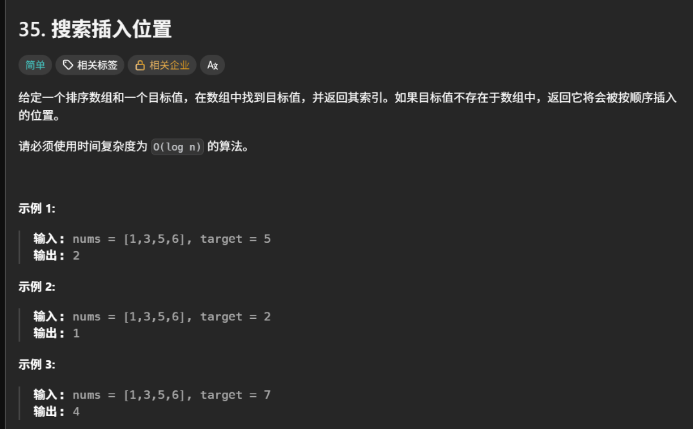

```
public int searchInsert(int[] nums, int target) {
    int left = 0;
    int right = nums.length - 1;
    while(left <= right){
        int mid = left + (right - left) / 2;
        if(nums[mid] == target){
            return mid;
        } else if(nums[mid] > target){
            right = mid - 1;
        } else {
            left = mid + 1;
        }
    }
    return left;
}
```

>当目标值不存在时，更新的只有left，所以最后返回的会是left的最终值

## 搜索二维矩阵

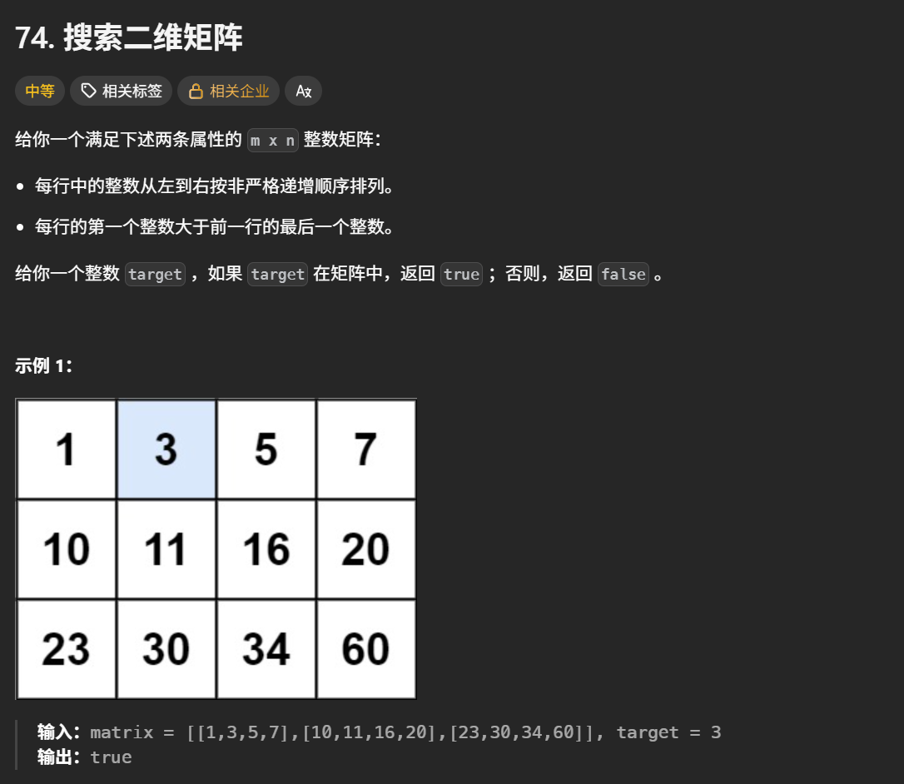

```
public boolean searchMatrix(int[][] matrix, int target) {
    int m = matrix.length;
    int n = matrix[0].length;
    int x = 0;
    int y = n - 1;
    while(x < m && y >= 0){
        if(matrix[x][y] == target){
            return true;
        }else if(matrix[x][y] > target){
            y--;
        }else{
            x++;
        }
    }
    return false;
}
```

>上述方法使用排除列的方法，每行中一列一列的去比较，因为矩阵中列和行均是递增排序的，当当前行对应的列的值大于目标值时，此时该值的所在列均可排除掉，这样便减少了一定搜索量，时间复杂为矩阵的行数与列数之和

```
public boolean searchMatrix(int[][] matrix, int target) {
    int m = matrix.length;
    int n = matrix[0].length;
    int left = 0;
    int right = m * n - 1;
    while (left <= right){
        int mid = left + (right - left) / 2;
        int value = matrix[mid / n][mid % n];
        if(value == target){
            return true;
        }else if(value > target){
            right = mid - 1;
        }else{
            left = mid + 1;
        }
    }
    return false;
}
```

>上述则为二分排序，此时它需要搜索整个矩阵的所有值，所以它的时间复杂会为行数与列数的乘积

## 在排序数组中查找元素的第一个和最后一个位置

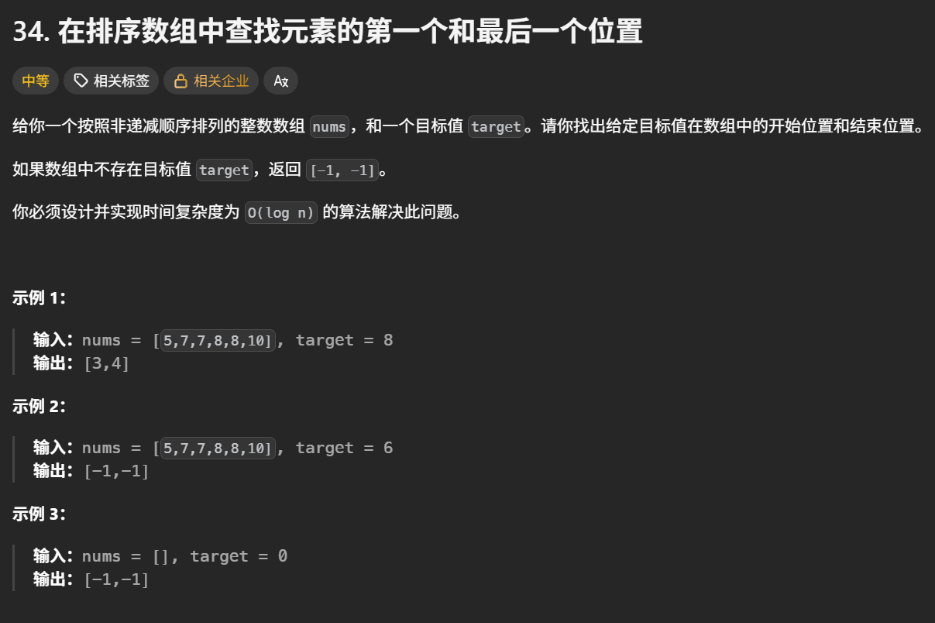

```
public int[] searchRange(int[] nums, int target) {
    if(nums == null || nums.length == 0){
        return new int[]{-1,-1};
    }
    int l = binarySearch(nums, target, false);
    int r = binarySearch(nums, target, true);
    return new int[]{l,r};
}

private int binarySearch(int[] nums, int target, boolean leftOrRight){
    int left = 0;
    int right = nums.length - 1;
    int res = -1;
    while(left <= right){
        int mid = left + (right - left) / 2;
        if(nums[mid] == target){
            res = mid;
            if(leftOrRight){
                left = mid + 1;
            }else{
                right = mid - 1;
            }
        } else if (nums[mid] < target) {
            left = mid + 1;
        }else{
            right = mid - 1;
        }
    }
    return res;
}
```

>通过标志位leftOrRight去搜索左右边界，标志位为false的话则是查找左边界，true则是右边界，主要思路还是使用二分查找，但又因为这里查找的是第一个和最后一个位置，我们并不知道它可能出现在哪，如果用之前的搜索模版，返回的都是最后一个数值，所以可以使用两次模版，但在模版查询到相同值时需要对其进行左右边界判断，如果当前是查找左边界的值第一个出现的值，需要在第一次搜索查找到目标值时，将右边界缩小，固定查找区域，右边则相反
>
>第一次出现的值是比第二次的早，所以找到的那一刻即需要进行区域的缩小，不然会查到第二次，浪费多一次时间，且最后找到的还是最后一个索引值
>
>我这里则是直接使用标志位，增强查找方法的复用性

## 搜索旋转排序数组

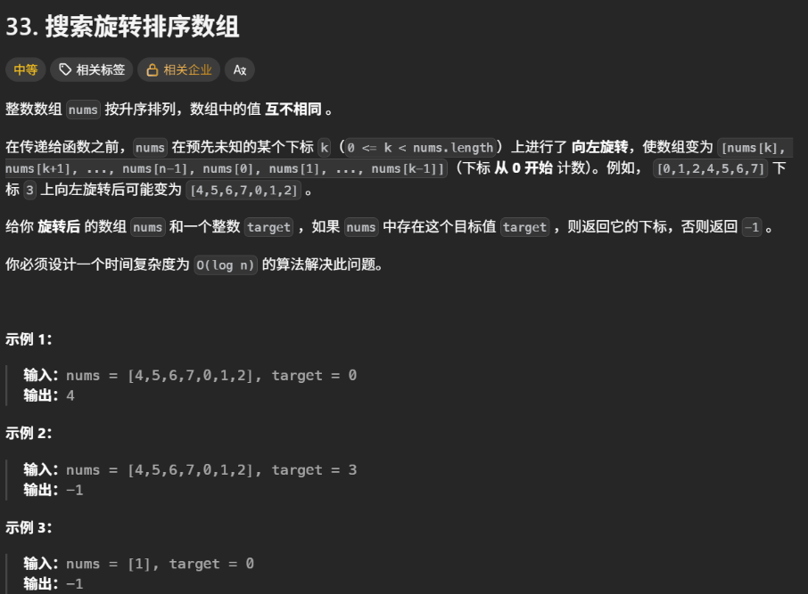

```
public int search(int[] nums, int target) {
    int left = 0;
    int right = nums.length - 1;
    while (left <= right) {
        int mid = left + (right - left) / 2;
        if (nums[mid] == target) {
            return mid;
        }
        if (nums[0] <= nums[mid]) {
            if (nums[0] <= target && target <= nums[mid]) {
                right = mid - 1;
            } else {
                left = mid + 1;
            }
        } else {
            if (nums[mid] <= target && target <= nums[nums.length - 1]) {
                left = mid + 1;
            } else {
                right = mid - 1;
            }
        }

    }
    return -1;
}
```

>解题思路：这道题依旧是二分查找，但需要注意的是二分查找它只能用于有序的数组，而这个给的数组是一个旋转后的数组，即轮转过后的数组，由原来的有序数组变为了无序数组，此时对于二分查找，它将无法查找出正确的值
>
>因而对于查找可以分为两部分进行，0~mid这部分，mid~len-1这部分，随后再使用二分查找那一套即可
>
>当然也可以使用两次二分查找，我这里是使用一次即可

## 寻找旋转排序数组中的最小值

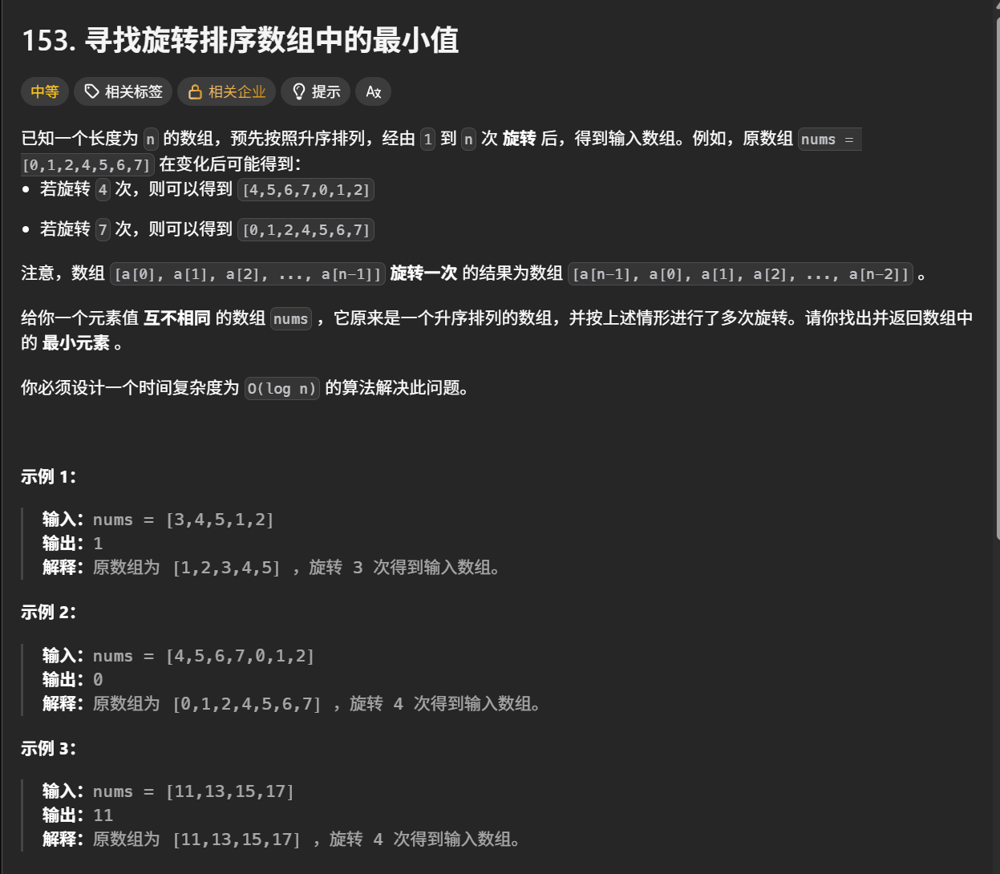

```
public int findMin(int[] nums) {
    int min = nums[0];
    int left = 0;
    int right = nums.length - 1;
    while(left <= right){
        int mid = left + (right - left) / 2;
        min = Math.min(min, nums[mid]);
        if(nums[mid] > nums[right]){
            left = mid + 1;
        }else{
            right = mid - 1;
        }
    }
    return min;
}
```

## 有效的括号

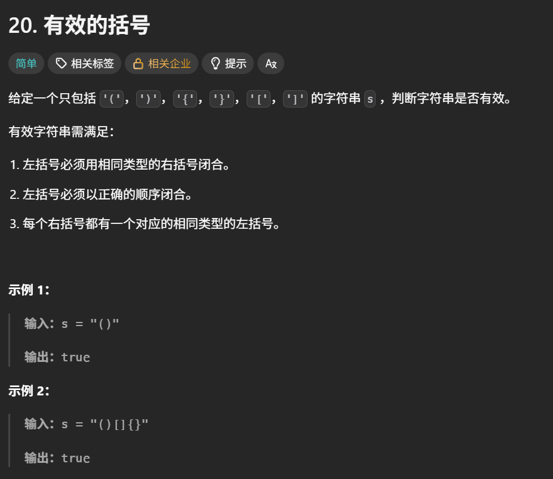

```
public boolean isValid(String s) {
    int len = s.length();
    if(len % 2 != 0){
        return false;
    }
    Map<Character, Character> map = new HashMap<>();
    map.put('(', ')');
    map.put('[', ']');
    map.put('{', '}');
    char[] chars =  s.toCharArray();
    Stack<Character> stack = new Stack<>();
    for(char c : chars){
        if(map.containsKey(c)){
            stack.push(map.get(c));
        }else{
            if(stack.isEmpty() || stack.pop() != c){
                return false;
            }
        }
    }
    return stack.isEmpty();
}
```

下面的方法是通过数组模拟栈方法

将字符串用字符数组进行存储，此后通过top指针指向下一个栈位置

当匹配到左括号时，会先当前左括号的位置进行压栈覆盖，然后直接指向下一个栈位置

此时下一个栈位置不属于左括号，会去判断它的上一个栈位置的值，即刚才所覆盖的值，如果此时不等，即不是有效括号，如果相等即是左括号所要匹配的右括号

```
public boolean isValid(String s) {
    int len = s.length();
    if(len % 2 != 0){
        return false;
    }
    char[] chars = s.toCharArray();
    int top = 0;
    for (char c : chars) {
        switch (c){
            case '(':
                chars[top++] = ')';
                break;
            case '[':
                chars[top++] = ']';
                break;
            case '{':
                chars[top++] = '}';
                break;
            default:
                if(top == 0 || chars[--top] != c){
                    return false;
                }
        }
    }
    return top == 0;
}
```

## 最小栈

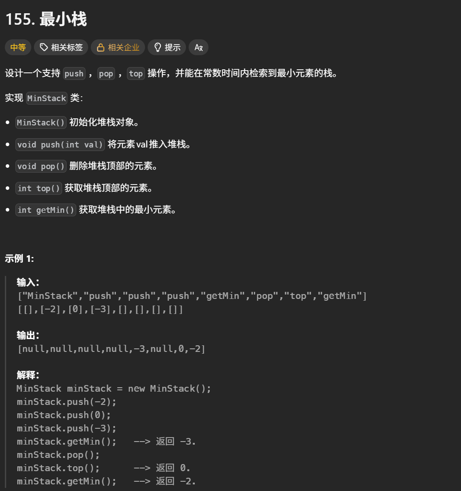

```
class MinStack {
    Stack<Integer> dataStack;
    Stack<Integer> minStack;

    public MinStack() {
        dataStack = new Stack<>();
        minStack = new Stack<>();
    }

    public void push(int val) {
        dataStack.push(val);
        if(minStack.isEmpty() || val <= minStack.peek()){
            minStack.push(val);
        }
    }

    public void pop() {
        if(dataStack.pop().equals(minStack.peek())){
            minStack.pop();
        }
    }

    public int top() {
        return dataStack.peek();
    }

    public int getMin() {
        return minStack.peek();
    }
}
```

>辅助栈存储数据，构造比较

以下是使用前缀差值进行更新最小值，空间使用缩小至O(1)

```
class MinStack {
    //主要通过差值的方式进行获取最小值，该栈中存储的数据主要为栈的差值
    private Stack<Long> stack;
    private long min;

    public MinStack() {
        stack = new Stack<>();
    }

    public void push(int val) {
        //最小栈是否为空，无数据的情况下存证明此时的最小值为当前的传入的值进行标记，将0存入
        if(stack.isEmpty()){
            stack.push(0L);
            min = val;


        }else{
            //栈不为空，则将当前传入的值减去最小值进行标记
            stack.push((long) val -  min);
            if(val < min){
                min = val;
            }
        }
    }

    public void pop() {
        //将栈的差值弹出，进行比较，如果小于0则证明当前值比最小值小，则将最小值减去当前值进行标记
        long diff = stack.pop();
        if(diff < 0){
            min = min - diff;
        }
    }

    public int top() {
        long diff = stack.peek();
        if (diff > 0) {
            // 如果差值大于0，说明当前值不是最小值
            return (int)(min + diff);
        } else {
            // 如果差值小于等于0，说明当前值就是最小值
            return (int)min;
        }
    }

    public int getMin() {
        return (int) min;
    }
}
```

## 字符串解码


```
public String decodeString(String s) {
    StringBuilder sb = new StringBuilder();
    char[] chars = s.toCharArray();
    Stack<Integer> numStack = new Stack<>();
    Stack<String> strStack = new Stack<>();
    int num = 0;
    for(char c : chars){
        if(c == '['){
            numStack.push(num);
            strStack.push(sb.toString());
            num = 0;
            sb = new StringBuilder();
        } else if (c == ']') {
            int currentNum = numStack.pop();
            StringBuilder temp = new StringBuilder();
            for(int i = 0; i < currentNum; i++){
                temp.append(sb);
            }
            sb = new StringBuilder(strStack.pop() + temp);
        } else if (c >= '0' && c <= '9') {
            num = num * 10 + c - '0';
        }else{
            sb.append(c);
        }
    }
    return sb.toString();
}
```

>这个解题思路算是非常清晰的，主要是代码能力问题
>
>就只需要拿两个栈过来进行模拟入栈出栈即可
>
>一个栈用于存储出现的次数，一个存储字符
>
>第一次遇到'['此时如果是前面没有数字的话，直接是将默认的num数值添加至数字栈中，随后将原结果也入栈，数字仍不变
>
>如果不是遇到'['，而是遇到数字，则是将当前字符转换为整数，即需要弹栈的次数
>
>当先是数字，再是'['，再是']'的时候，并且里面存的字符时，则是通过两个栈分别弹出，数字栈里面弹出的是数值，代表需要添加字符的次数，遍历循环添加即可
>
>主要还是代码能力问题，思路及其清晰

## 每日温度

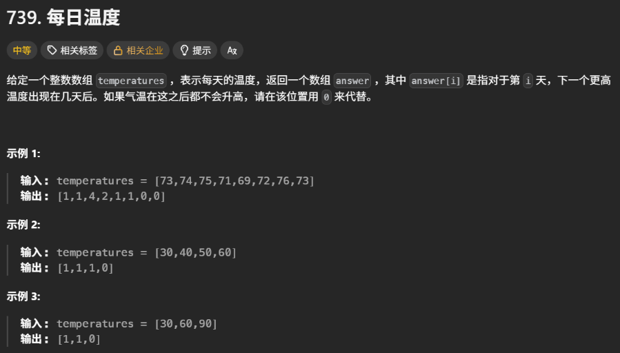

```
public int[] dailyTemperatures(int[] temperatures) {
    int[] res = new int[temperatures.length];
    Stack<Integer> stack = new Stack<>();
    for (int i = 0; i < temperatures.length; i++) {
        int temp = temperatures[i];
        while(!stack.isEmpty() && temperatures[stack.peek()] < temp){
            int index = stack.pop();
            res[index] = i - index;
        }
        stack.push(i);
    }
    return res;
}
```

>一眼单调栈思路，单调栈：保证栈顶到栈底的递增或递减顺序


>我上面的解法为单调递增栈，从左到右进行，此种写法栈中可以存在重复元素

下面写法是从右到左的单调递减的形式，主要通过候选的方法进行

```
class Solution {
    public int[] dailyTemperatures(int[] temperatures) {
        int n = temperatures.length;
        int[] ans = new int[n];
        Deque<Integer> st = new ArrayDeque<>();
        for (int i = n - 1; i >= 0; i--) {
            int t = temperatures[i];
            while (!st.isEmpty() && t >= temperatures[st.peek()]) {
                st.pop();
            }
            if (!st.isEmpty()) {
                ans[i] = st.peek() - i;
            }
            st.push(i);
        }
        return ans;
    }
}
```

>从右到左的空间效率为O(min(n,U)) U = max(temp) - min(temp) +1
>
>有时候可以看看人家的数组模拟栈方法，效率相对很高

```
class Solution {
    public int[] dailyTemperatures(int[] temperatures) {
        int n = temperatures.length;
        int[] ans = new int[n];
        int[] st = new int[n]; // 数组模拟，效率更高
        int top = -1;
        for (int i = 0; i < n; i++) {
            int t = temperatures[i];
            while (top >= 0 && t > temperatures[st[top]]) {
                int j = st[top--];
                ans[j] = i - j;
            }
            st[++top] = i;
        }
        return ans;
    }
}。
```

## 柱状图中最大的矩形

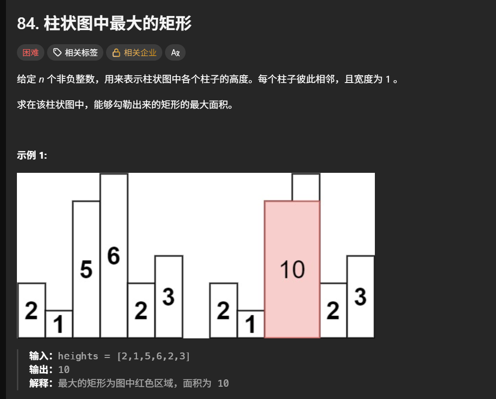

```
public int largestRectangleArea(int[] heights) {
    if(heights == null || heights.length == 0){
        return 0;
    }
    int area = 0;
    Deque<Integer> stack = new ArrayDeque<>();
    stack.push(-1);
    for(int i = 0; i <= heights.length; i++){
        int height = i < heights.length ? heights[i] : -1;
        while(stack.size() > 1 && heights[stack.peek()] >= height){
            int curHeight = heights[stack.pop()];
            int curWidth = i - stack.peek() - 1;
            area = Math.max(area, curHeight * curWidth);
        }
        stack.push(i);
    }
    return area;
}
```

使用单调栈，但理不清思路

## 数组中的第K个最大元素

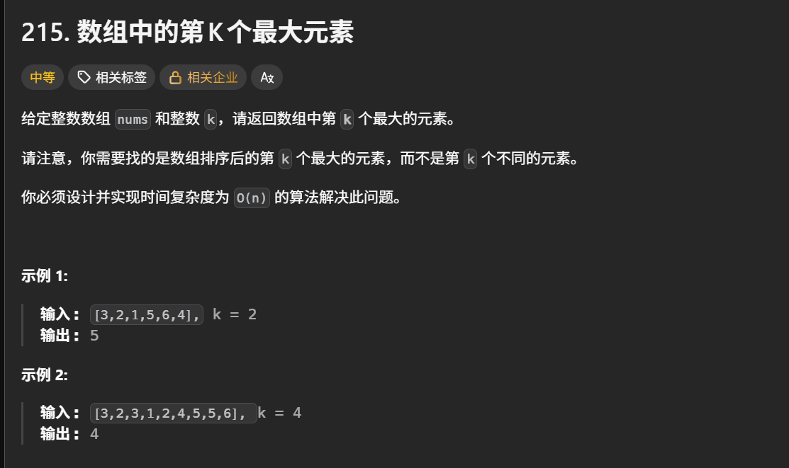

```
private static final Random rand = new Random();

public int findKthLargest(int[] nums, int k) {
    int left = 0;
    int right = nums.length - 1;
    int index = nums.length - k;
    while(true){
        int pos = partition(nums, left, right);
        if(pos == index){
            return nums[pos];
        }else if(pos < index){
            left = pos + 1;
        }else{
            right = pos - 1;
        }
    }
}

private int partition(int[] nums, int left, int right){
    int i = left + rand.nextInt(right - left + 1);
    int p = nums[i];
    swap(nums, i, left);
    i = left + 1;
    int j = right;
    while(true){
        while (i <= j && nums[i] < p) {
            i++;
        }
        // 此时 nums[i] >= p

        while (i <= j && nums[j] > p) {
            j--;
        }
        // 此时 nums[j] <= p

        if (i >= j) {
            break;
        }

        // 维持循环不变量
        swap(nums, i, j);
        i++;
        j--;

    }
    swap(nums, left, j);
    return j;
}

private void swap(int[] nums, int i, int j){
    int temp = nums[i];
    nums[i] = nums[j];
    nums[j] = temp;
}
```

>看别人用的快速选择排序，其实可以通过建堆来实现，我之前写的时候是通过建堆实现的，建立大顶堆可以实现

````
    public int findKthLargest(int[] nums, int k) {
         int n = nums.length;
        buildMaxHeap(nums, n);
        for (int i = nums.length - 1; i >= nums.length - k + 1; i--) {
            swap(nums, 0, i);
            n--;
            siftDown(nums, n, 0);
        }
        return nums[0];
    }
      public void buildMaxHeap(int[] nums, int n) {
        for (int i = nums.length / 2 - 1; i >= 0; i--) {
            siftDown(nums, n, i);
        }
    }

    public void siftDown(int[] nums, int n, int k) {
        while (true) {
            int l = 2 * k + 1;
            int r = 2 * k + 2;
            int max = k;
            if (l < n && nums[l] > nums[max]) {
                max = l;
            }
            if (r < n && nums[r] > nums[max]) {
                max = r;
            }
            if (max == k) {
                break;
            }
            swap(nums, k, max);
            k = max;
        }
    }

    public void swap(int[] nums,int i,int j){
        int temp = nums[i];
        nums[i] = nums[j];
        nums[j] = temp;
    }
````

## 前K个高频元素

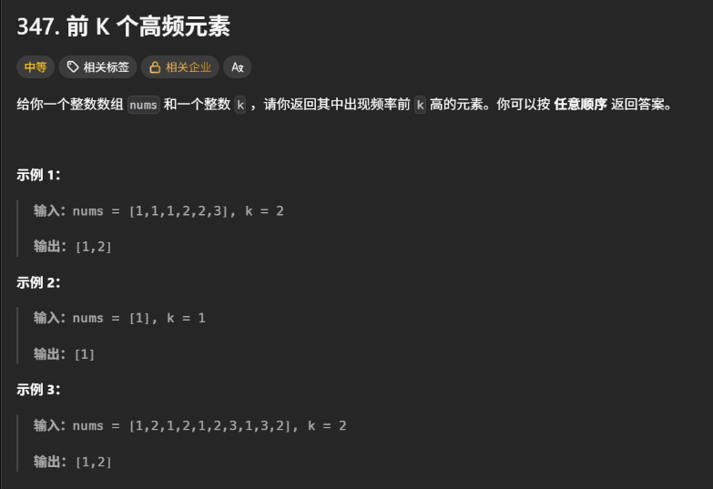

```
public int[] topKFrequent(int[] nums, int k) {
    int[] res = new int[k];
    int max = nums[0];
    int min = nums[0];
    for (int i = 0; i < nums.length; i++) {
        if (nums[i] > max) {
            max = nums[i];
        }
        if (nums[i] < min) {
            min = nums[i];
        }
    }
    int[] count = new int[max - min + 1];
    int maxCount = 0;
    for (int i = 0; i < nums.length; i++) {
        count[nums[i] - min]++;
        maxCount = Math.max(maxCount, count[nums[i] - min]);
    }
    List<Integer>[] buckets = new ArrayList[maxCount + 1];
    Arrays.setAll(buckets, i -> new ArrayList<>());
    for (int i = min; i <= max; i++) {
        buckets[count[i - min]].add(i);
    }
    int index = 0;
    for (int i = maxCount; i >= 0 && index < k; i--) {
        for (int x : buckets[i]) {
            res[index++] = x;
        }
    }

    return res;
}
```

>主要思路：类似特征提取操作，将对应的数出现的次数进行提取，随后去比较

````
class Solution {
    public int[] topKFrequent(int[] nums, int k) {
        // 步骤1：找到nums中的最大值和最小值，确定数字范围（解决数组映射问题）
        int min = nums[0], max = nums[0];
        for (int num : nums) {
            if (num < min) min = num;
            if (num > max) max = num;
        }

        // 步骤2：创建频率数组，统计每个数字的出现次数（核心：num - min 做偏移量，映射到0开始的索引）
        int[] freq = new int[max - min + 1];
        for (int num : nums) {
            freq[num - min]++; // 每出现一次，对应索引的频率+1
        }

        // 步骤3：按频率从高到低遍历，收集前k个高频数字（暴力核心：双层循环找最大频率）
        int[] res = new int[k];
        int index = 0; // 结果数组的下标

        // 优化：先找实际的最大频率，避免从nums.length开始无效循环
        int realMaxFreq = 0;
        for (int f : freq) {
            if (f > realMaxFreq) realMaxFreq = f;
        }
        int maxFreq = realMaxFreq; // 用实际最大频率替代nums.length
        
        while (index < k) { // 收集满k个就停止
            for (int i = 0; i < freq.length; i++) {
                if (freq[i] == maxFreq) { // 找到当前最大频率的数字
                    res[index++] = i + min; // 偏移量还原：索引i → 原数字i+min
                    if (index == k) break; // 提前退出，避免多余循环
                }
            }
            maxFreq--; // 当前最大频率的数字收集完，找下一个更小的频率
        }

        return res;
    }
}
````

>这个思路更加的奇妙，主要操作与我所写的不一致，主要操作里面对收集的次数，
>
>先从次数最多的进行比较与收集结果，收集完之后，根据传入的k值去判断是否还需要收集第二个数值

## 数据流的中位数


```
class MedianFinder {
    PriorityQueue<Integer> maxHeap;
    PriorityQueue<Integer> minHeap;

    public MedianFinder() {
        maxHeap = new PriorityQueue<>((a, b) -> b - a);
        minHeap = new PriorityQueue<>();
    }

    public void addNum(int num) {
        if(maxHeap.size() == minHeap.size()){
            minHeap.offer( num);
            maxHeap.offer(minHeap.poll());
        }else{
            maxHeap.offer(num);
            minHeap.offer(maxHeap.poll());
        }
    }

    public double findMedian() {
        if(maxHeap.size() == minHeap.size()){
            return (maxHeap.peek() + minHeap.peek()) / 2.0;
        }else{
            return maxHeap.peek();
        }
    }
}
```

>直接背题，使用的大顶堆与小顶堆，大顶堆主要用于获取到分割的两个数组中小数组中的最大值，小顶堆则是获取到大数组中的最小值
>
>主要是建堆操作比较难，这里直接使用api是最快的
>
>其实理解起来不难的，需要保持两个堆的状态，两个堆之间相差不能大于1，并且大顶堆的大小一定要小于小顶堆的大小，维持好状态，再去分情况讨论即可。直接套中位数的情况讨论，偶数的话则是两个中间数相加，奇数则是拿最中间的数
>
>当个数为偶数时，即两个堆的大小一致，不管添加的数大还是小，最终的数值都会添加至小顶堆之中
>
>奇数的时候，此时的大顶堆个数会比小顶堆个数多1，中位数即是当前大顶堆的最大值

## 买卖股票的最佳时机

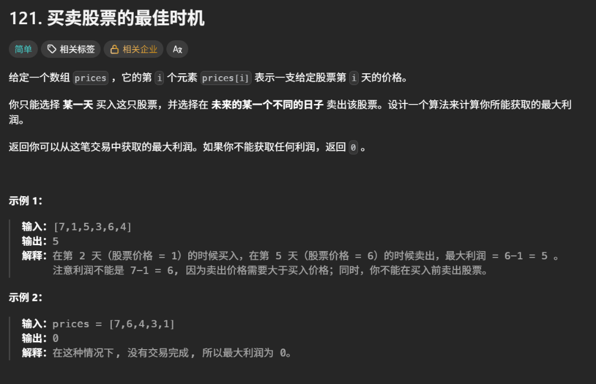

```
public int maxProfit(int[] prices) {
    int res = 0;
    int min = prices[0];
    for (int price : prices) {
        min = Math.min(min, price);
        res = Math.max(res, price - min);
    }
    return res;
}
```

>如果是强制交易一次的话，此时结果可能会存在亏损
>
>思路：就是在购买的时候，先强制一次的交易即res = price[1] - price[0]

```
public int maxProfit(int[] prices) {
    
    if(prices == null || prices.length < 2){
        return 0;
    }
    
    int res = prices[1] - prices[0];
    int min = prices[0];
    for (int price : prices) {
        min = Math.min(min, price);
        res = Math.max(res, price - min);
    }
    return res;
}
```

## 跳跃游戏

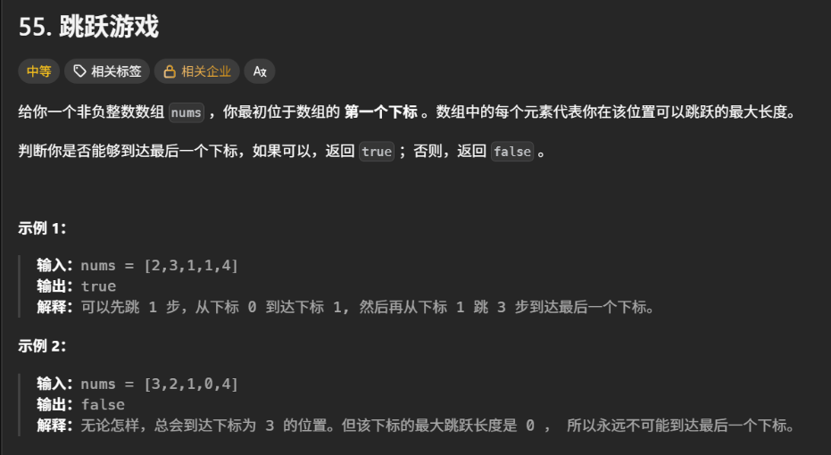

```
public boolean canJump(int[] nums) {
    int skip = nums[0];
    int n = nums.length;
    for(int i = 1; i < n; i++){
        if(skip == 0){
            return false;
        }
        int curSkip = nums[i];
        skip = Math.max(skip - 1,curSkip);
    }
    return true;
}
```

>主要问题会出现在skip这一块，此时对于skip跳跃的长度，如果为0，此时肯定是跳不到最后一个下标的，每次都拿最多跳跃的次数
>
>这里为何要使用 skip = Math.max(skip - 1,curSkip);而不使用skip--;
>
>主要为了能够保证每次拿到的都是当前下标中的值，因为其中的值为对应的跳跃长度，而且如果是使用skip--，会出现即使当前拿到的跳跃长度不是0，它也会导致最后的结果提前结束，不管怎样都无法到达最后的下标
>
>可以如此理解，使用skip--时，我每次刚拿到跳跃次数，还没开始已经扣减了一次，这样便导致少跳一次，就好比打cs时，还没开始就被队友炸了一半血条，此时怎么玩呢

## 跳跃游戏II

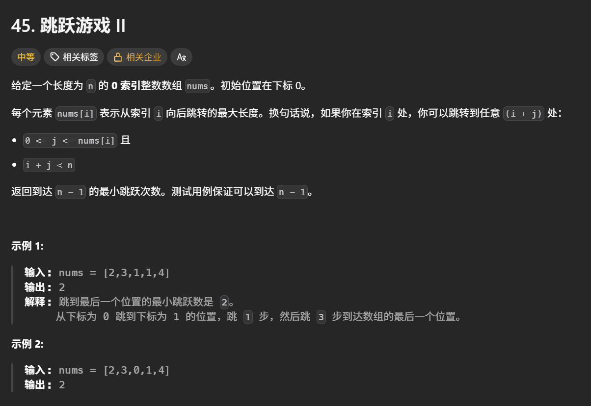

```
public int jump(int[] nums) {
    int n = nums.length;
    if(n <= 1){
        return 0;
    }
    int skip = nums[0];
    int count = 1;
    int nextSkip = 0;
    for (int i = 1; i < n; i++) {
        if (i > skip) {
            skip = nextSkip;
            count++;
        }
        nextSkip = Math.max(nextSkip, i + nums[i]);
    }
    return count;
}
```

>跟上一个的思路一样，但这时候不需要进行对0的处理，需要处理的是只有一个元素的时候，同时每次也是拿最大的次数进行跳跃
>
>我们维护当前能够到达的最大下标位置，记为边界。我们从左到右遍历数组，到达边界时，更新边界并将跳跃次数增加 1
>
>此时唯一变化的思路是需要多维护一个下一次的跳跃次数，当目前的跳跃次数小于索引时证明无法跳到下一个最远的地方，此时需要下一次的跳跃次数进行跳跃

## 划分字母区间

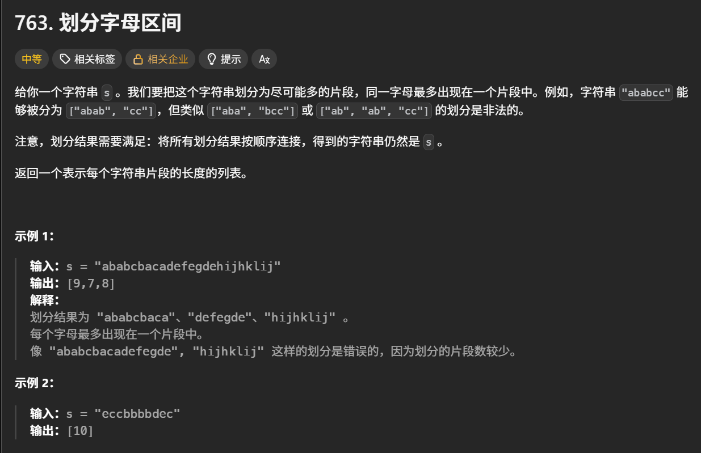

