# Linux系统

## 文件路径特点

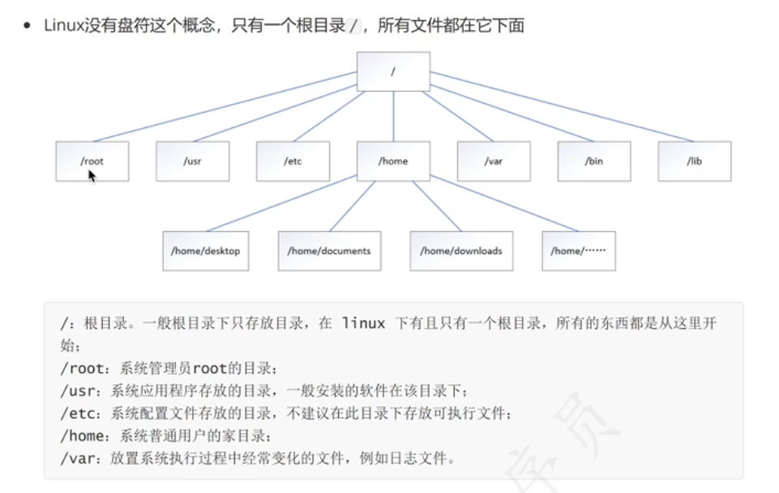

## 远程连接操作

通过远程连接工具连接到服务器的操作即为远程连接

条件：

1.服务器的IP地址

2.服务器的账号和密码

注意：必须要确保有网络连接条件

Xshell（个人免费/商用收费）、FinalShell

所有用于远程连接的ip地址的最后一位均不能为1

默认情况下的centos7不支持ifconfig，需要按照运行环境才可，

默认为ip addr

在一个网络范围内，一般由1~255个ip地址，其中1和255会被入网和出网设备占用

Linux发行：在原版Linux系统的基础上，额外增加一些常用软件的操作系统

Redhat中的为centos    Debian中的为Ubuntu

## Linux命令

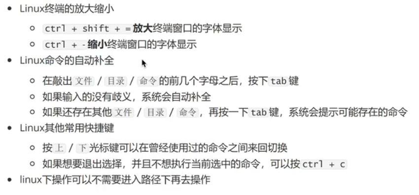

**命令格式：**

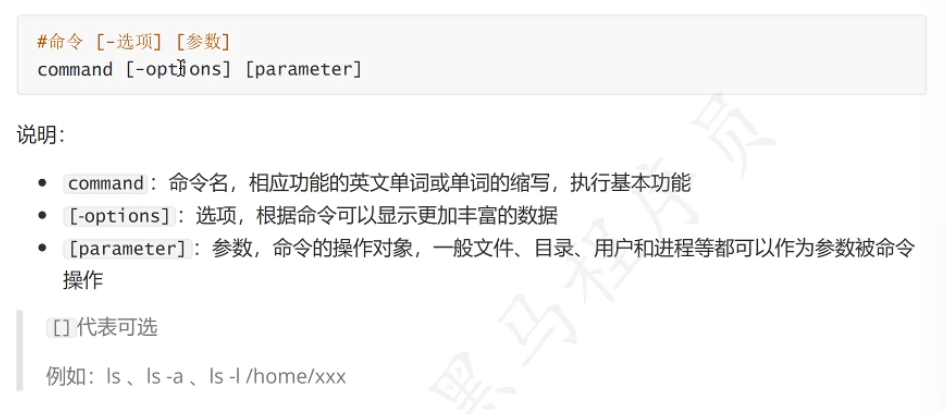

查阅命令的帮助信息

command --help

查阅使用手册

man command

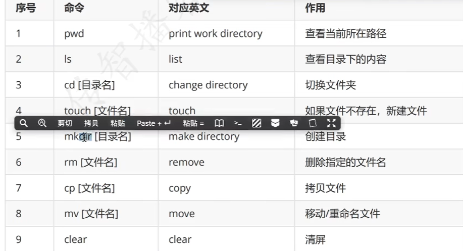

pwd：查看当前路径

ls：查看当代目录下的哪些文件和文件夹

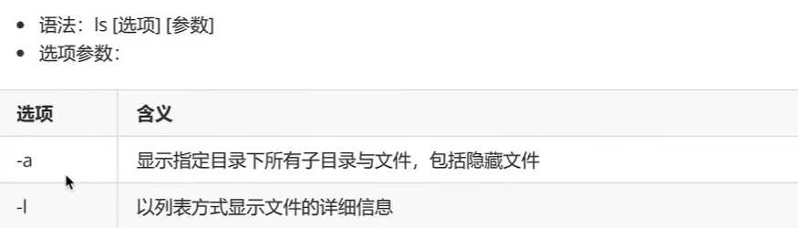

mkdir：创建文件夹，后面可接一个或多个参数

cd：切换目录

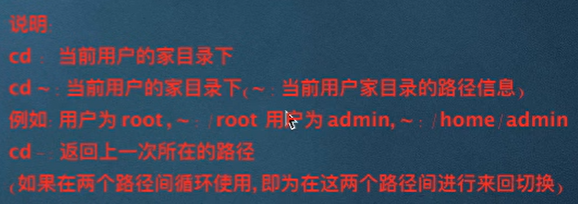

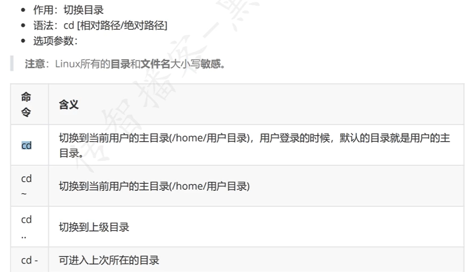

touch：创建文件

mv：创建或移动文件

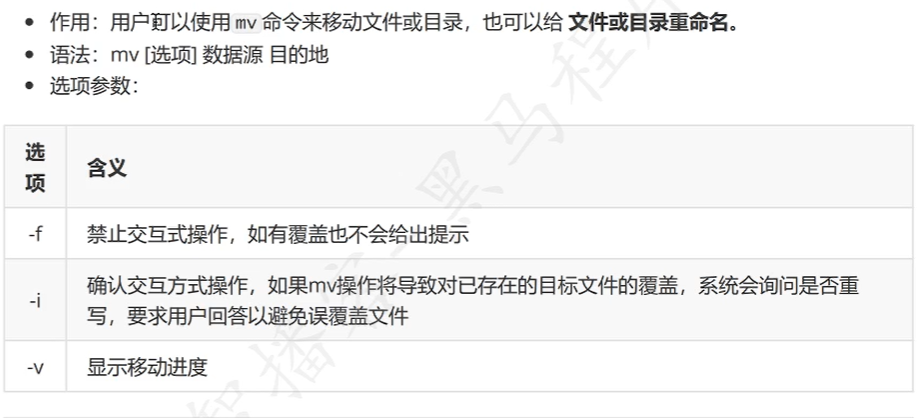

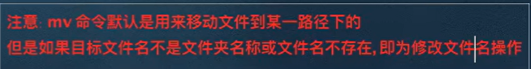

**相对路径和绝对路径：**

相对路径：路径信息以'.'或'..'开头的均为相对路径

绝对路径：路径信息以'/'或'~'开头的均为绝对路径

cp：复制文件

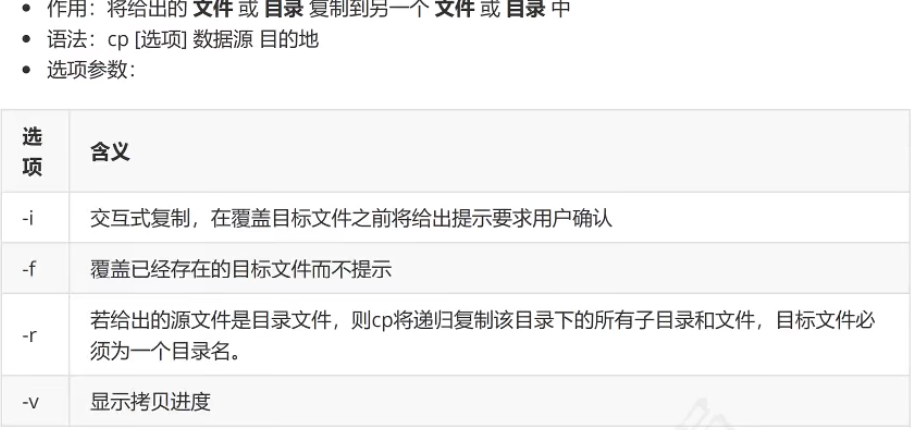

rm：删除文件或目录

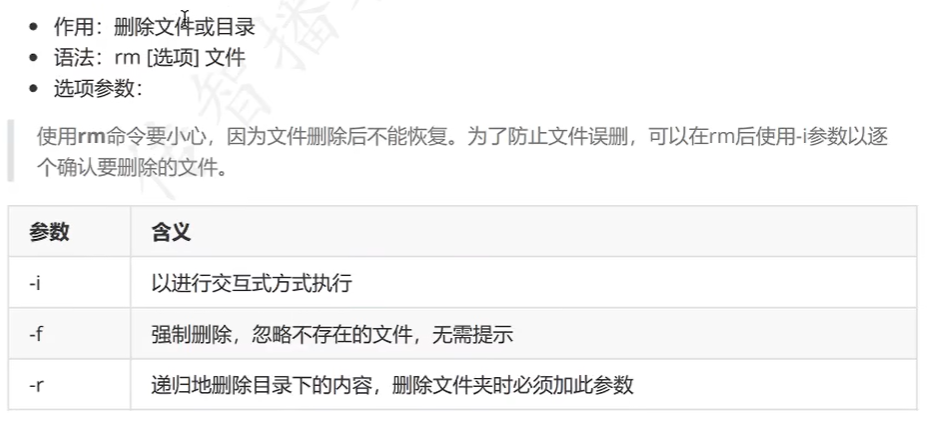

重定向

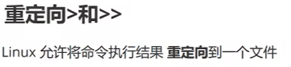

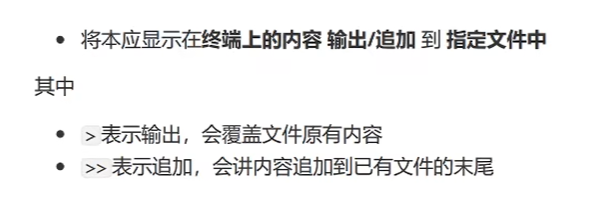

cat查看内容

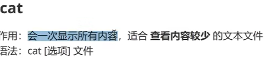

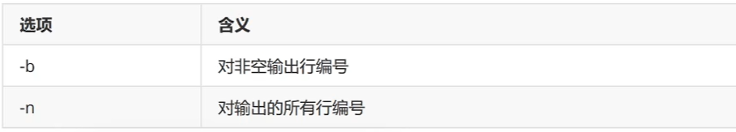

分屏显示内容less

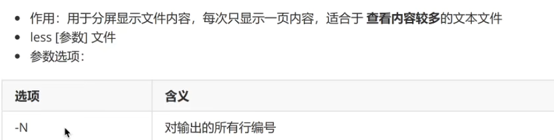

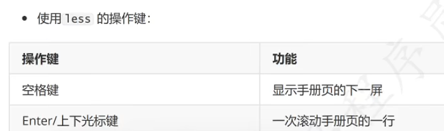

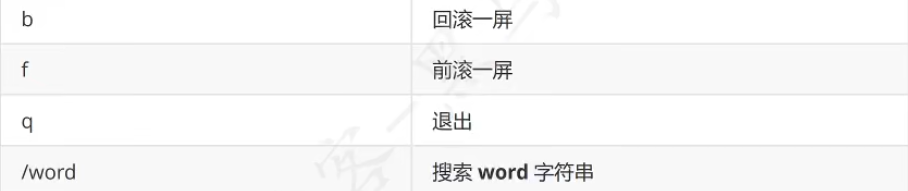

grep查找文件信息

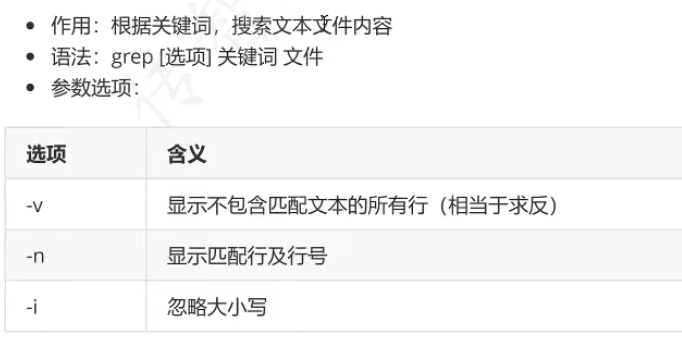

管道|

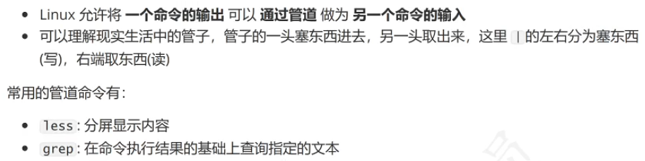

head从前查找内容

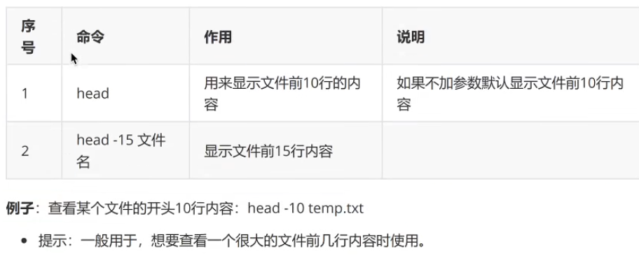

tail从后查找命令

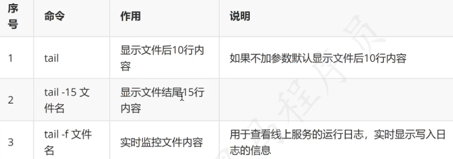

**多用于日志文件查询**

动态查询日志文件 tail -f

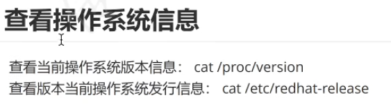

**查看进程命令：**

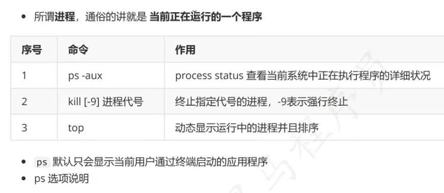

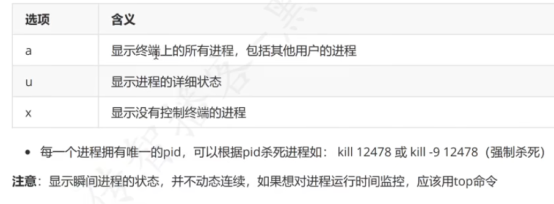

运行程序:  ./程序名

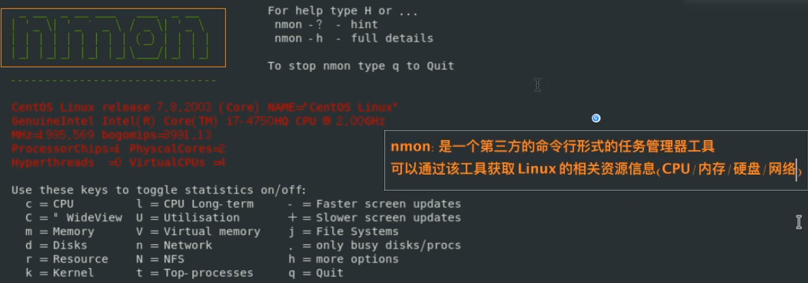

nmon_x86_64_centos7

查找运行的程序的进程id

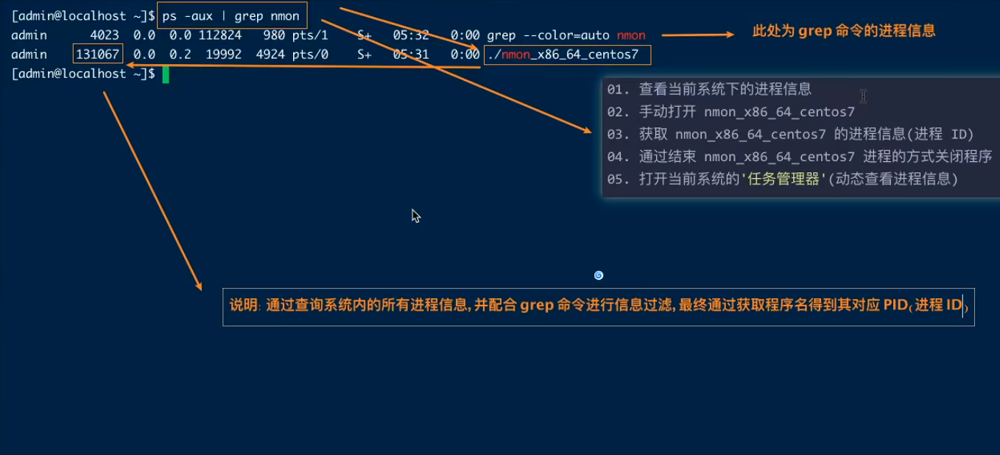

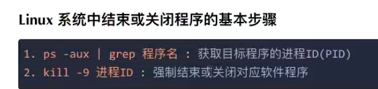

**动态检测任务管理器：**

top

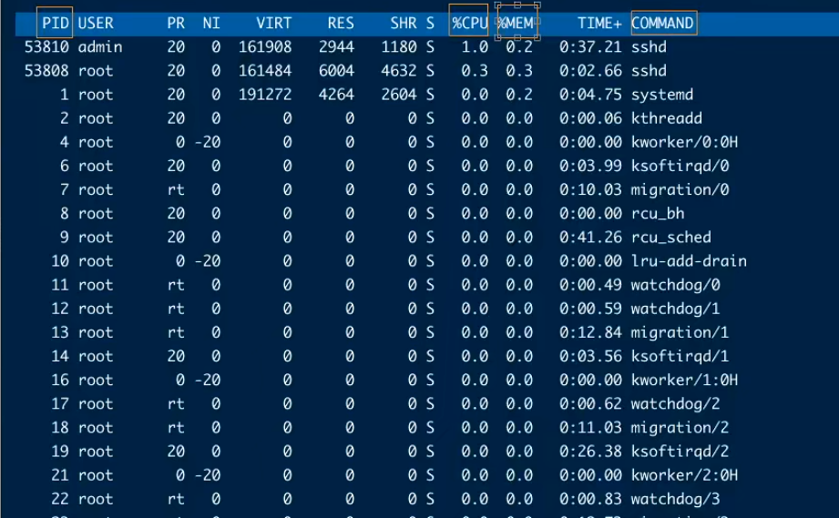

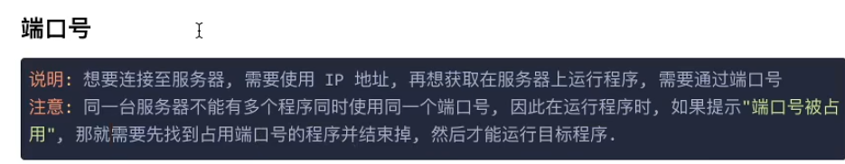

常见端口号：

http：80

https：443

ssh：22

mysql：3306

**端口查询netstat**

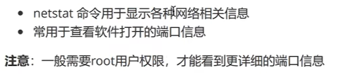

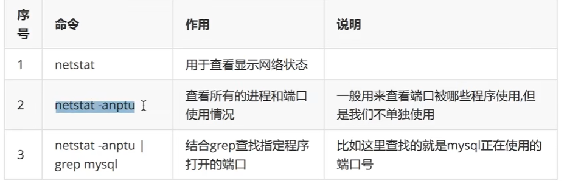

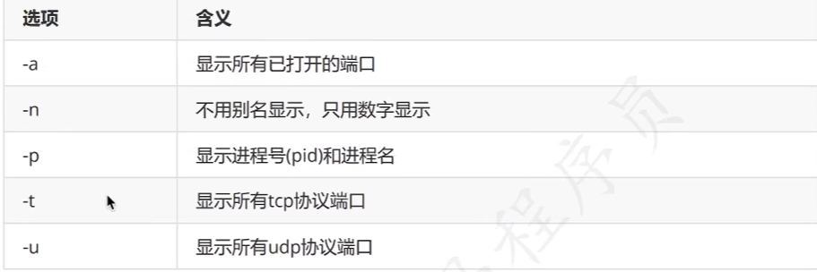

**lsof命令：**

which命令寻找程序所在目录

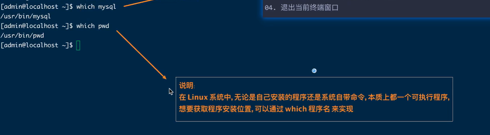

切换用户su

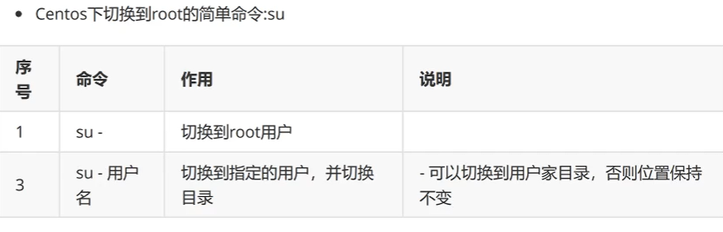

whoami当前用户是谁

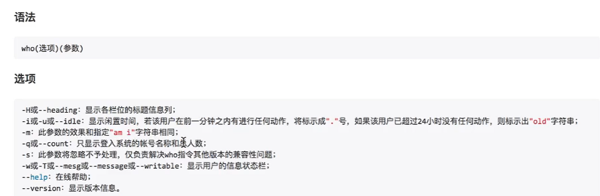

