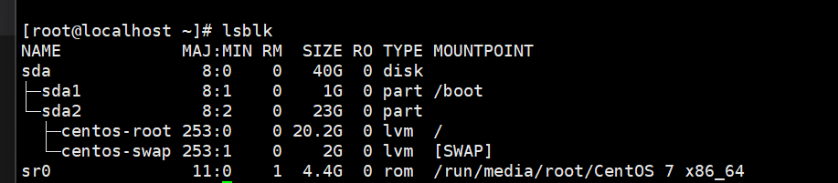
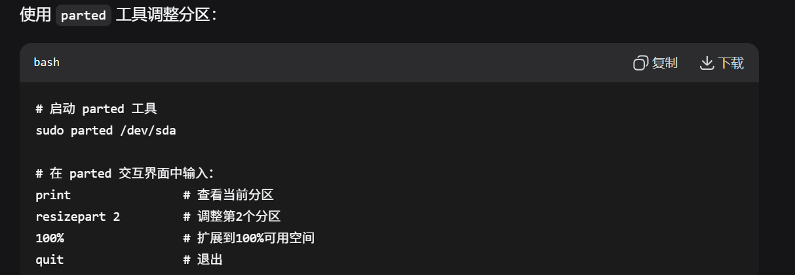
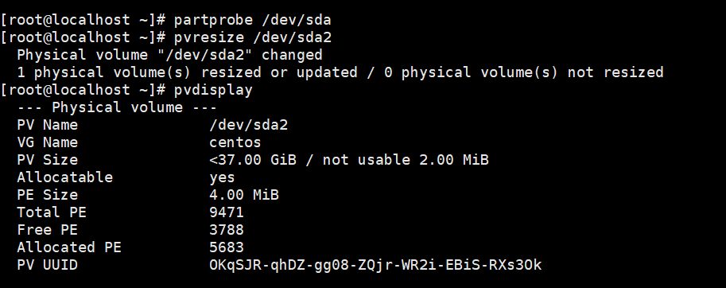
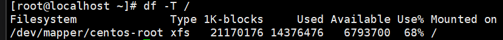
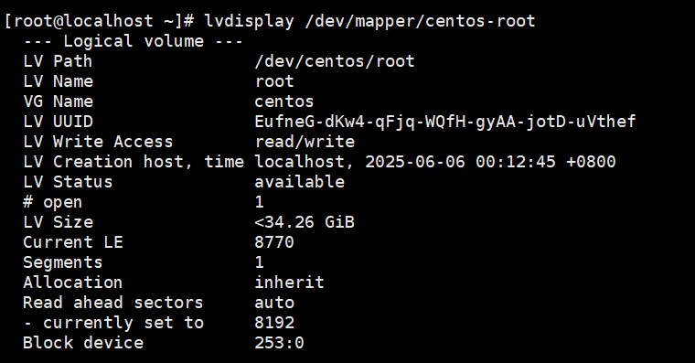
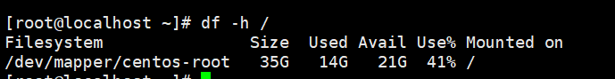
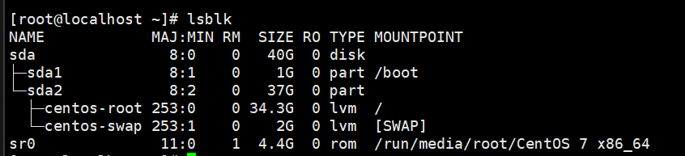

# Linux系统

## 文件路径特点


## 远程连接操作

通过远程连接工具连接到服务器的操作即为远程连接

条件：

1.服务器的IP地址

2.服务器的账号和密码

注意：必须要确保有网络连接条件

Xshell（个人免费/商用收费）、FinalShell

所有用于远程连接的ip地址的最后一位均不能为1

默认情况下的centos7不支持ifconfig，需要按照运行环境才可，

默认为ip addr

在一个网络范围内，一般由1~255个ip地址，其中1和255会被入网和出网设备占用

Linux发行：在原版Linux系统的基础上，额外增加一些常用软件的操作系统

Redhat中的为centos    Debian中的为Ubuntu

## Linux命令


**命令格式：**


查阅命令的帮助信息

command --help

查阅使用手册

man command


pwd：查看当前路径

ls：查看当代目录下的哪些文件和文件夹


mkdir：创建文件夹，后面可接一个或多个参数

cd：切换目录


touch：创建文件

mv：创建或移动文件


**相对路径和绝对路径：**

相对路径：路径信息以'.'或'..'开头的均为相对路径

绝对路径：路径信息以'/'或'~'开头的均为绝对路径

cp：复制文件


rm：删除文件或目录


重定向


cat查看内容


分屏显示内容less


grep查找文件信息


管道|


head从前查找内容


tail从后查找命令


**多用于日志文件查询**

动态查询日志文件 tail -f


**查看进程命令：**


运行程序:  ./程序名


nmon_x86_64_centos7

查找运行的程序的进程id


**动态检测任务管理器：**

top


常见端口号：

http：80

https：443

ssh：22

mysql：3306

**端口查询netstat**


**lsof命令：**


which命令寻找程序所在目录


切换用户su


whoami当前用户是谁


对于磁盘的管理扩展

````
sudo fdisk -l 查看磁盘分区情况
lsblk 更清晰的查看 此命令会将磁盘情况以树形展开
sda 是物理磁盘 sda1、sda2是分区
根据出现的信息进行处理 一般为lvm 输出中带有vg、lv
# 查看物理卷、卷组、逻辑卷
sudo pvdisplay
sudo vgdisplay
sudo lvdisplay
# 扩展物理卷到新空间
sudo pvresize /dev/sdaX  # X 是你的物理分区号
````

以下是我的磁盘信息



现在要扩展sda2的分区



扩展完之后进行重新加载分区

````
sudo partprobe /dev/sda
````

扩展物理卷

````
# 扩展 /dev/sda2 上的物理卷
sudo pvresize /dev/sda2

# 验证物理卷扩展
sudo pvdisplay
````



可以查看当前卷组中的可用空间

```
sudo vgdisplay centos
```

可以进行对比 未扩展与扩展之后

随后是扩展根逻辑卷

````
# 将所有可用空间分配给根逻辑卷
sudo lvextend -l +100%FREE /dev/mapper/centos-root

# 或者，如果您想指定具体大小（例如：扩展到28GB）
# sudo lvextend -L 28G /dev/mapper/centos-root
````

````
# 查看文件系统类型
df -T /

# 如果是 XFS（CentOS 7 默认）：
sudo xfs_growfs /dev/mapper/centos-root

# 如果是 ext4（少数情况）：
sudo resize2fs /dev/mapper/centos-root
````



进行扩展之后 进行验证

````
# 查看卷组信息
sudo vgdisplay centos

# 查看逻辑卷信息
sudo lvdisplay /dev/mapper/centos-root

# 查看文件系统使用情况
df -h /
````





这样便可以完成分配的基础操作了



