# Python

## 数据类型

数字类型：

1.整型（int）

2.浮点型（float）

3.布尔类型（bool） True、False

4.复数类型3+4i

非数字类型：

1.字符型（str）

2.列表（list）：[`1,2,3,4`]

3.元组（tuple）：(`1,2,3,4`)

4.字典（dict）：{`'name'`:`'小明'`，`'age'`:`18`}  键值对的形式


type()函数：

可以获取到变量的数据类型

type(变量) print(type(变量))

## 输入

获取用户的输入

input()

变量 = input()

1.代码从上到下执行，遇到input之后，会暂停等待，等待输入，不输入不结束

2.遇到回车，结束

3.输入的类型一定是字符串类型

## 类型转换

变量 = 要转换为的类型（原数据）

数据类型转换不会改变原来的数据的类型，会生成一个新的数据类型


## 格式化输出


小数默认显示6位，两个%%为转义，%s可以写任意类型


**F-string(f字符转格式化)**

3.6开始支持此种格式化方法


```
#!/usr/bin/env python
# -*- coding: UTF-8 -*-
'''
@Author ：自然醒
@Version ：1.0
'''
#格式化输出
name = '苏可锦'
age = 18
height = 1.75
print('我叫%s,年龄%d,身高%.2f'%(name,age,height))
print(f'我的名字是{name},年龄是{age},身高是{height:.2f}')
```

## 运算符


## if、elif、else结构


```
#!/usr/bin/env python
# -*- coding: UTF-8 -*-
'''
@Author ：自然醒
@Version ：1.0
'''
age = (int)(input('请输入年龄：'))
if age >= 18:
    print("eligible")
elif age < 18:
    print("ineligible")
else:
    print("invalid age")
```

## 循环结构


## 容器

数据序列，python中的数据类型，容器中可以存放多个数据


### 字符串定义


字符串本身包含引号时需要注意转换即特殊符号处理


字符串前边可加r""


字符串下标获取


切片使用


如果是负数索引的话则是字符的最后一个字符开始，如下图


步长为负数则是反转字符（逆置）字符串

只存在于-1的场景

**查找方法find**


**替换方法replace**


**拆分split**


**字符串连接join**


### 列表


**列表定义：**


```
#!/usr/bin/env python
# -*- coding: UTF-8 -*-
'''
@Author ：自然醒
@Version ：1.0
'''
#类实例化的方式创建列表，但是不常用
list1 = list()
print(type(list1), list1)
list2 = list('hello')
print(type(list2), list2)
```

**列表支持下标和切片：**


append一个列表的话则是整体添加至目标列表中，extend的话则是将列表元素拆开去添加


remove如果存在多个一样的数值则只删除第一个值


列表的嵌套即是Java中的二维数组一样的操作即可


### 元组


定义元组只有一个数据时，需要在后面添加一个逗号否则定义的则是一个数据


### 字典

字典dict，使用键值对存储数据，如map集合一样


**增加和修改操作**


## 函数


## 引用


python中数据的传递都是传递的引用，与java不同，java的引用传递是对象的值副本进行传递，实际上还是值传递，但python中是引用传递，主要在于python的对象可行性

可变对象、不可变对象


集合也是可变类型


对于不可变对象，此时只能通过重新赋值即重新创建对象才能改变

对于可变对象，可以通过索引等操作对其进行改变

对于列表的+=操作等于extend操作

### 组包和拆包


先看等号右边再看左边

a,b = b,a操作为先将b,a进行组包，随后再将a,b拆包

## 局部变量和全局变量

### 局部变量


### 全局变量


global需要放在第一行否则会报错

### 函数传参的方式

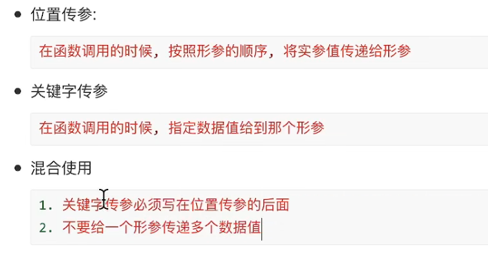

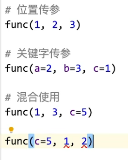

### 缺省参数（默认参数）

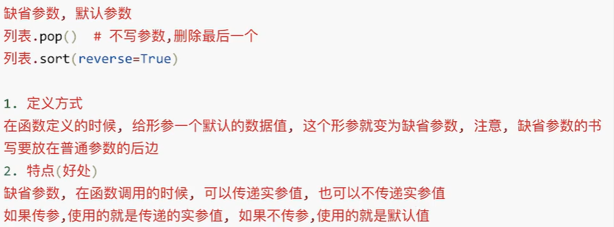

### 可变参数/不定长参数


print函数中有个默认的end='\n'换行符，sep=‘’多个位置参数之间的间隔，file=None

函数拆包

列表中的数据对应*args，此时如果要将列表中的数据传入，可以使用 *my_list进行拆包

**kwargs也是如此操作

```
#!/usr/bin/env python
# -*- coding: UTF-8 -*-
'''
@Author ：自然醒
@Version ：1.0
'''
#my_list[1,2,3,4] my_dict = {'a':1,'b':2,'c':3,'d':4}
#将字典和列表中的数据使用my_sum函数求和
def my_sum(*args, **kwargs):
    sum = 0
    for i in args:
        sum += i
    for j in kwargs.values():
        sum += j

    print(sum)


my_sum(1, 2, 3, 4)
my_sum(a=1, b=2, c=3, d=4)

my_list = [1, 2, 3, 4]
my_sum(*my_list)
my_dict = {'a': 1, 'b': 2, 'c': 3, 'd': 4}
my_sum(**my_dict)
```

### 匿名函数

-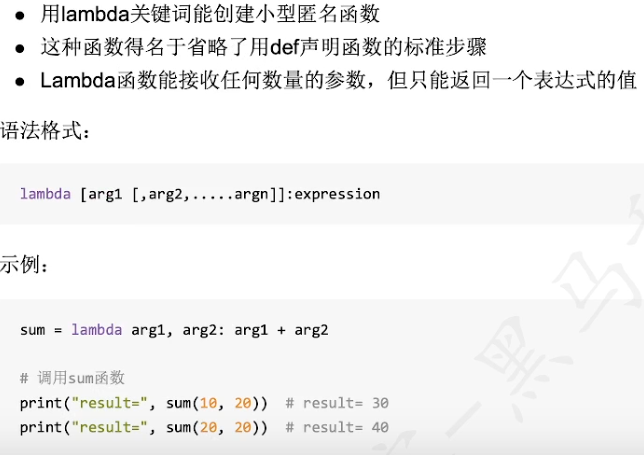

匿名函数一般不需要主动调用，一般作为函数的参数使用

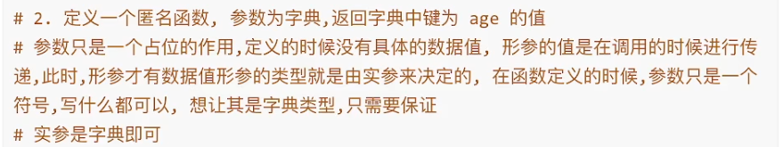

上述内容有点像Java中的foreach函数

**匿名函数作为函数的参数-列表中的字典排序**

>列表的排序，默认对列表中的数据进行比大小，可以对数字类型和字符类型进行比大小，但是对于整个字典来说，并不会知道如何排序，此时需要使用sort函数中的key参数指定字典比大小的方法，key参数需要传递一个函数，一般是匿名函数，字典的排序其实根据字典什么键进行排序，只需要使用匿名函数返回字典的这个键对应的值即可

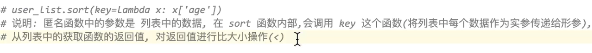

**字符串比大小**

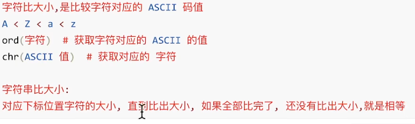

## 面向对象

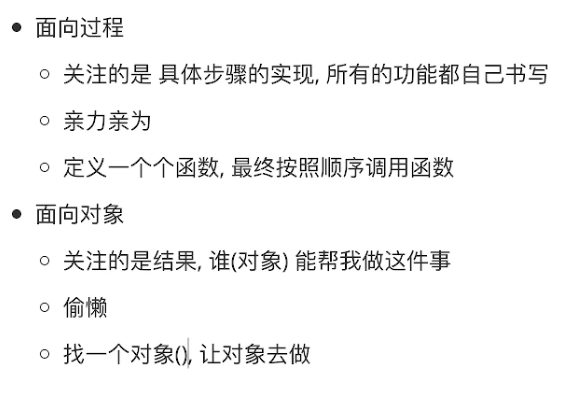

### 类

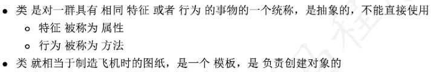

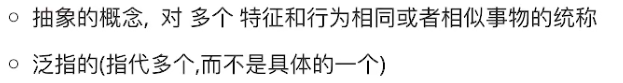

### 对象

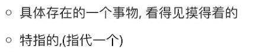

### 类和对象的关系

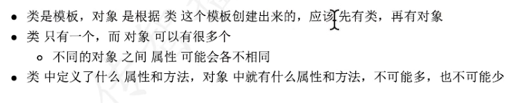

### 类组成

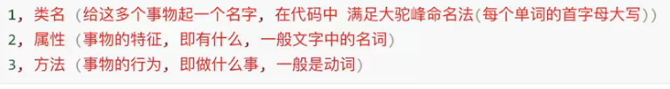

**类抽象**

找类的类名、属性和方法

### self说明

self本质上是形参，所以在函数中也是可以为任意变量名的

self是普通形参，但在调用的时候没有传递实参值，因为python解释器在执行代码时，自动的将调用这个方法的对象传递给了self，像Java中的this指针一样，本类之中的调用

self是函数中的局部变量，直接创建的对象是全局变量

### 属性操作

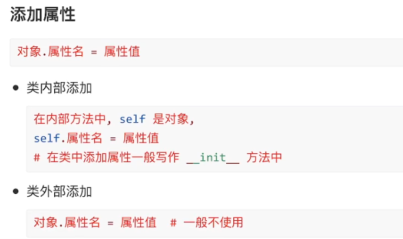

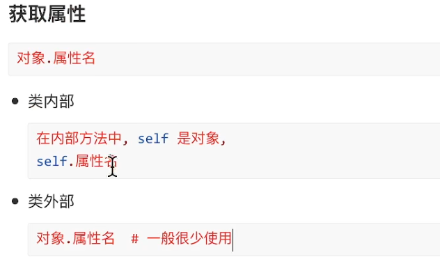

### 魔术方法

python中以两个下划线开头，两个下划线结尾，并且在满足某个条件的情况下，会自动调用，这类方法为魔术方法

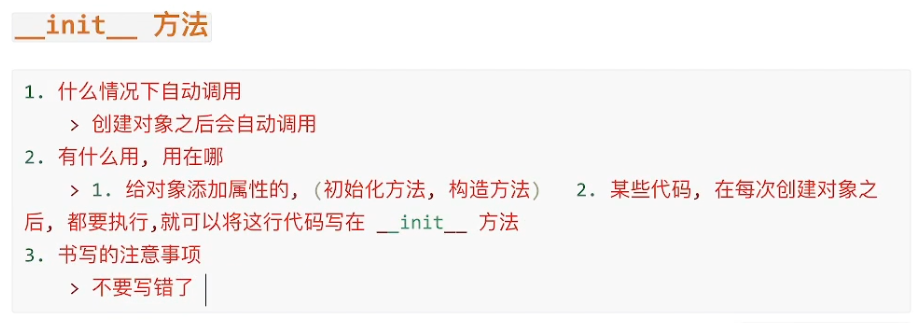

```
#!/usr/bin/env python
# -*- coding: UTF-8 -*-
'''
@Author ：自然醒
@Version ：1.0
'''

class Cat:
    def __init__(self):
        self.name = 'Tom'
        self.age = 3
        self.color = 'white'
    def show_info(self):
        print(f'姓名是{self.name}，年龄是{self.age}，颜色是{self.color}')

if __name__ == '__main__':
    Cat().show_info()
```

这个方法类似Java中的构造方法一样，如果传递了参数，参数必须写全，不然会报错


有点类似Java中的toString方法，如果没有重写输出的就是地址

```
#!/usr/bin/env python
# -*- coding: UTF-8 -*-
'''
@Author ：自然醒
@Version ：1.0
'''

class Cat:
    def __init__(self):
        self.name = 'Tom'
        self.age = 3
        self.color = 'white'
    

    def __str__(self):
        return f'姓名是{self.name}，年龄是{self.age}，颜色是{self.color}'

if __name__ == '__main__':
    cat = Cat()
    print(cat)
```

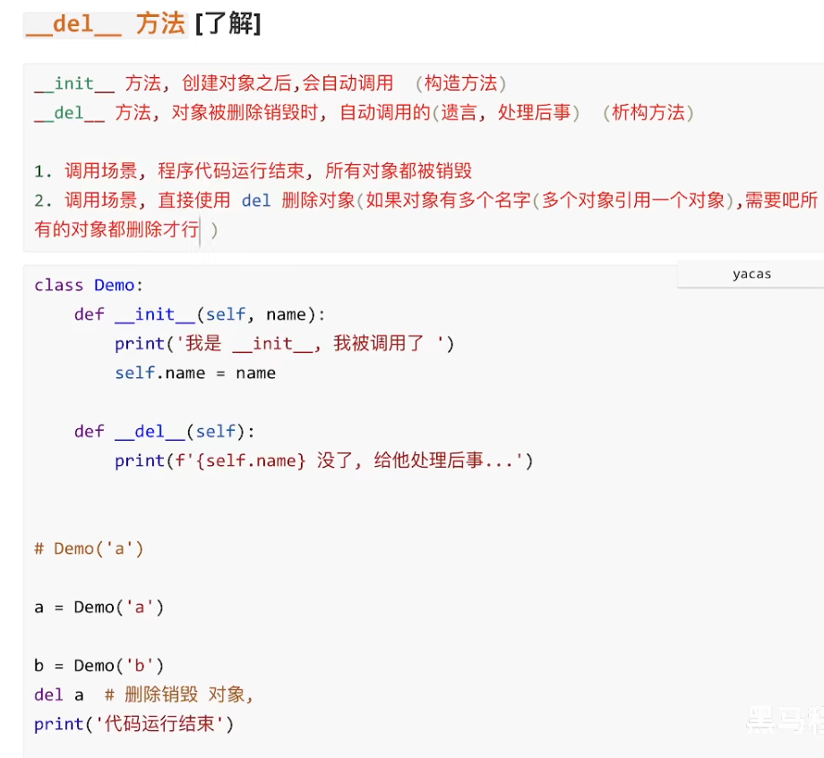

### 私有属性和私有方法

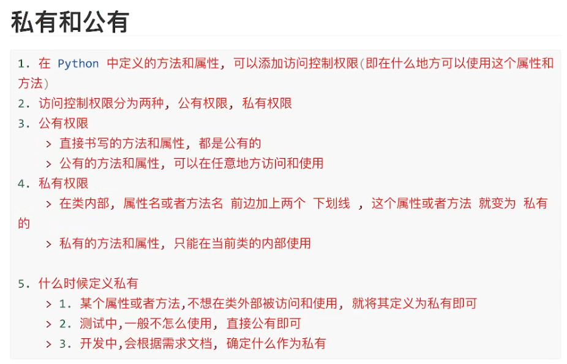

私有为两个下划线，与Java不同，Java使用的是private

私有的本质，python解释器执行代码，发现属性名或者方法名前有两个下划线，会将这个名字重命名，会在这个名字前加上 _类名前缀

````python
self.__age ==> self._Person__age
````

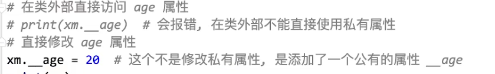

```python
__dict__ #魔术方法，将数据以字典方式返回
```

### 继承

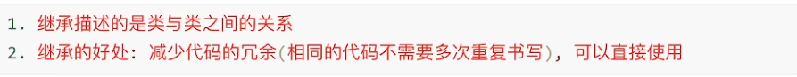

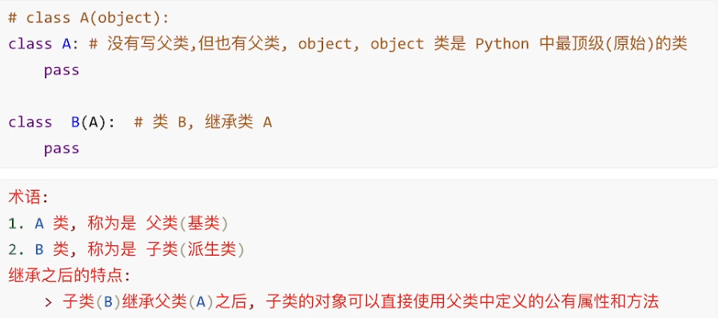

python支持多继承

### 重写

在子类中定义和父类中名字相同的方法，父类方法无法满足子类对象的需求

重写之后，直接调用子类的方法，不再调用父类中方法

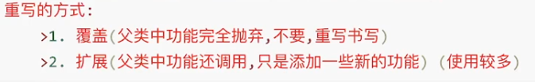

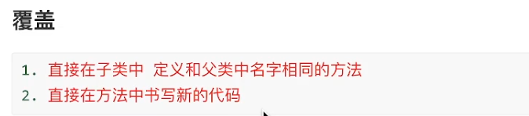

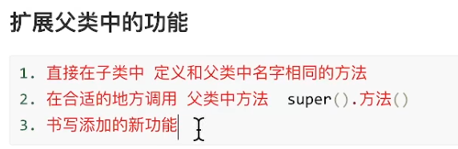

### 多态

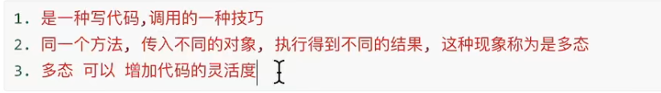

### 属性

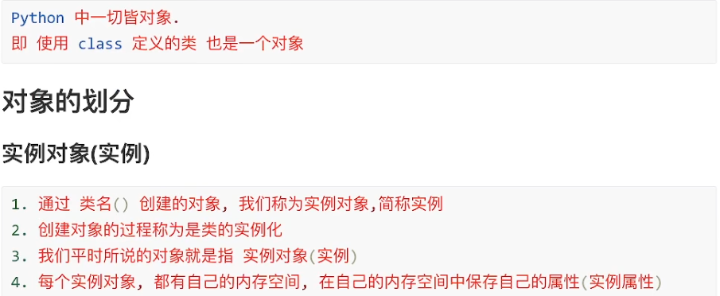

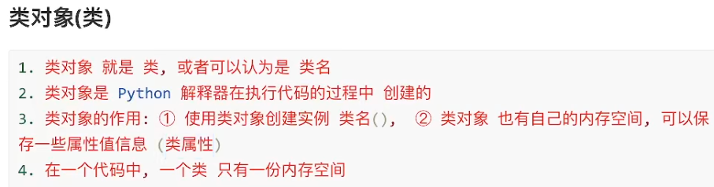

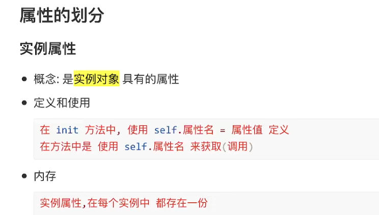

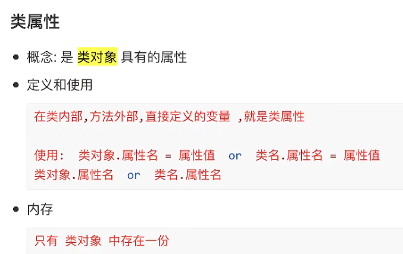

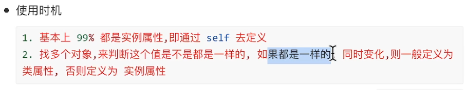

类对象有点类似静态类一样

类属性可以理解为公共的静态属性，使用了static定义的静态变量，随着类的加载而加载，然后实例属性即为私有的，在构造方法中使用

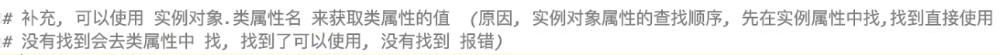

### 方法

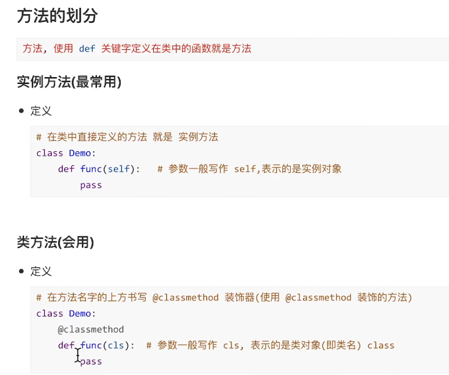

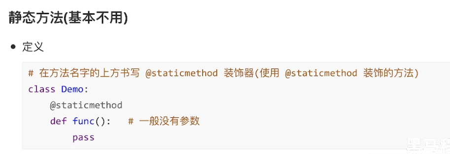

>实例方法，如果需要使用实例属性，必须定义为实例方法
>
>类方法，方法中不需要使用实例属性，用到了类属性，可以定义为类方法，也可以定义为实例方法
>
>静态方法，不使用实例属性，类属性，即可定义为静态方法

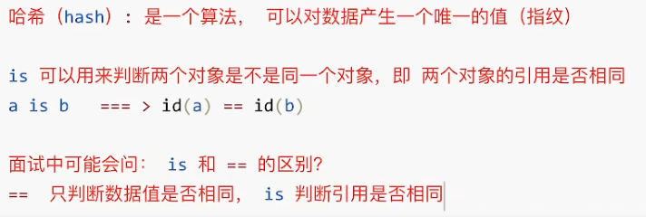

## 文件使用

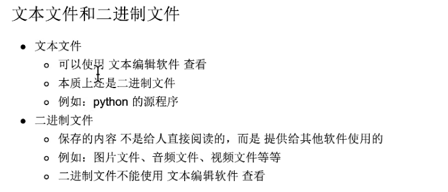

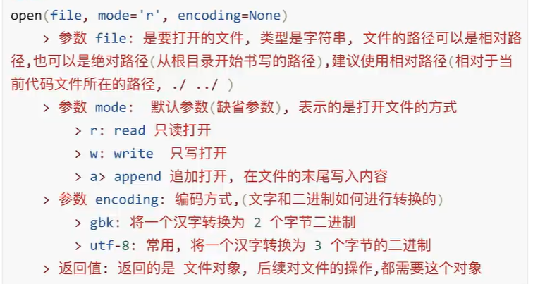

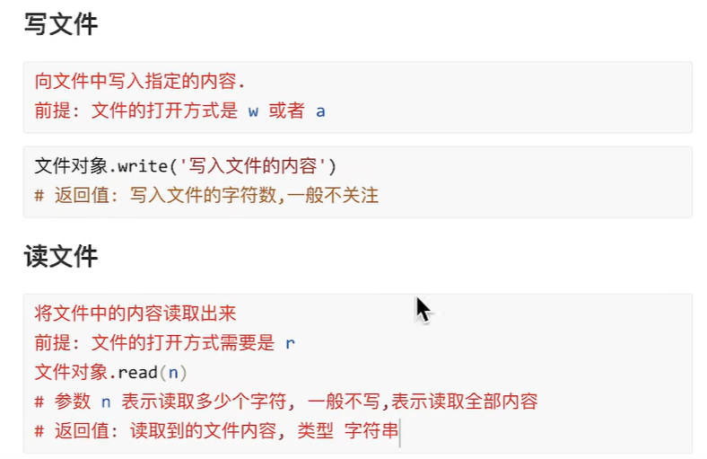

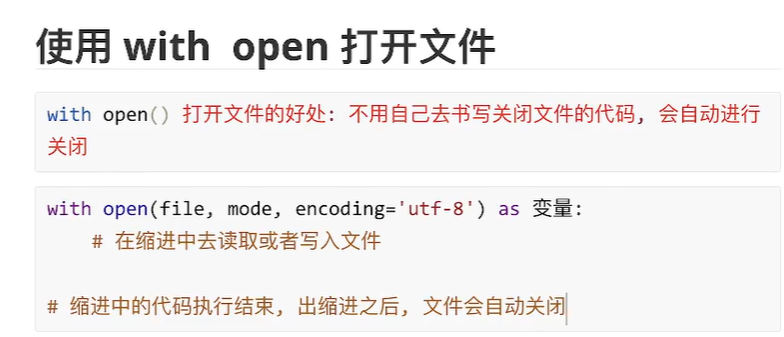

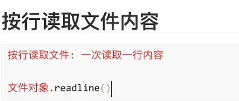


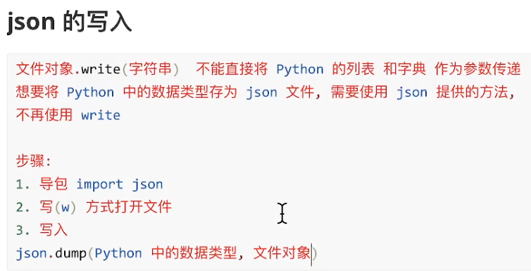

注意写入的时候默认为ensure_ascii=True此时默认为ascii值展示

缩进的话则加上indent参数

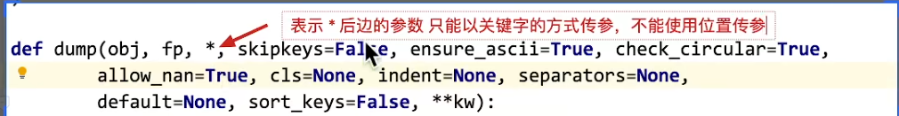

## 异常

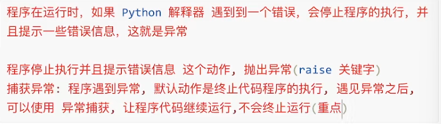

**异常捕获**

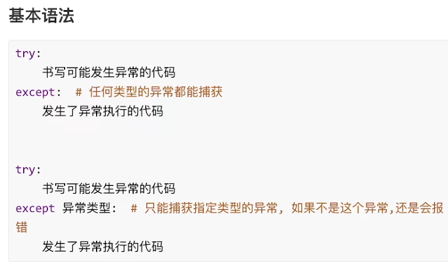

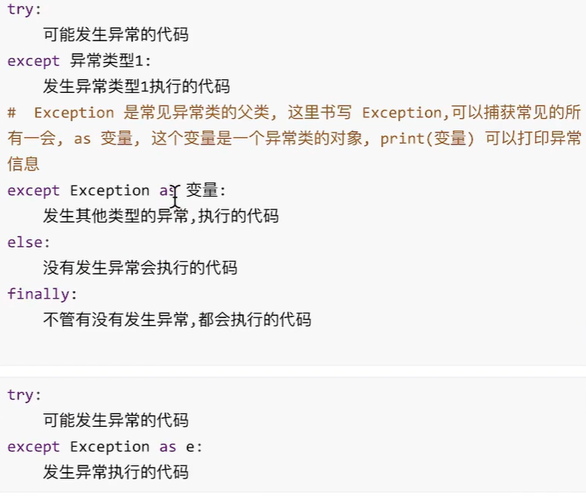

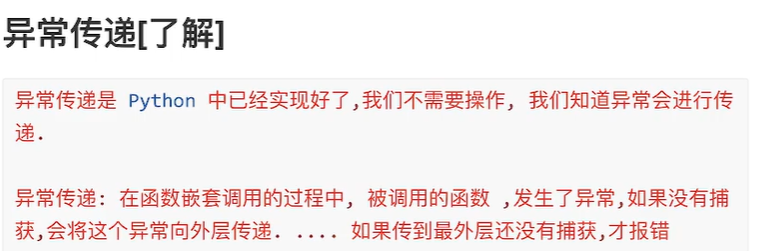

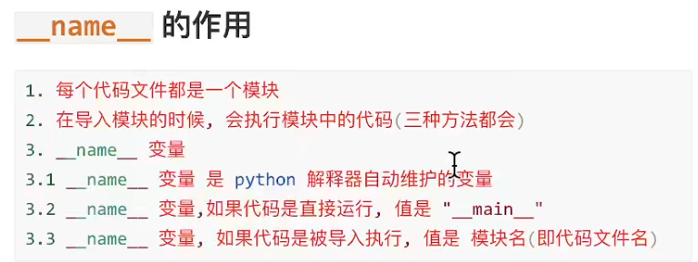

