# RabbitMQ

## 同步调用

同步的优势：

时效性强，等待到结果才返回

存在的问题：

拓展性差、性能下降、级联失败

## 异步调用

异步调用主要基于消息通知的方式

存在三个角色：

消息发送者：投递消息的人，原来的调用方

消息代理：管理、暂存、转发消息，一个转发消息的服务器

消息接收者：接收和处理消息的人，原来服务的提供方

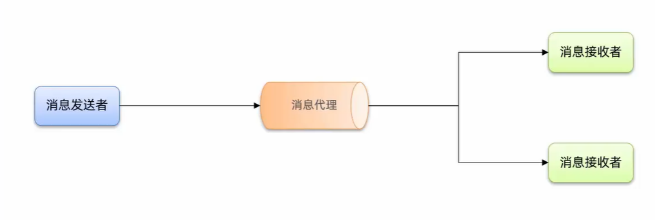

优势：

耦合度低，拓展性强

异步调用，无需等待，性能好

故障隔离，下游服务故障不影响上游业务

缓存消息，流量削峰填谷

问题：

不能立即得到结果，时效性差

不确定下游业务是否成功

业务安全依赖于broker的可靠性

## MQ选型

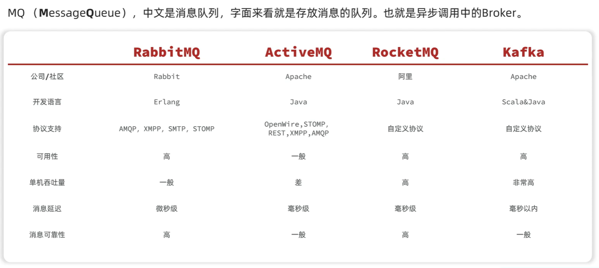

Kafka一般用于日志收集

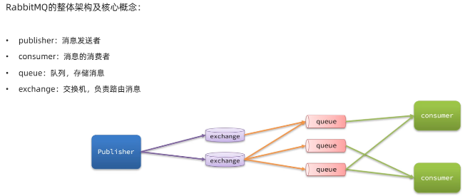

RabbitMQ中可以建造一个VirtualHost，虚拟主机，形成数据隔离

## Java客户端

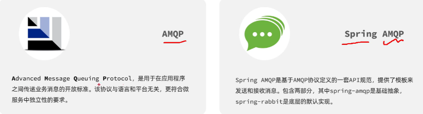

对于每个服务都需要对其进行配置连接文件

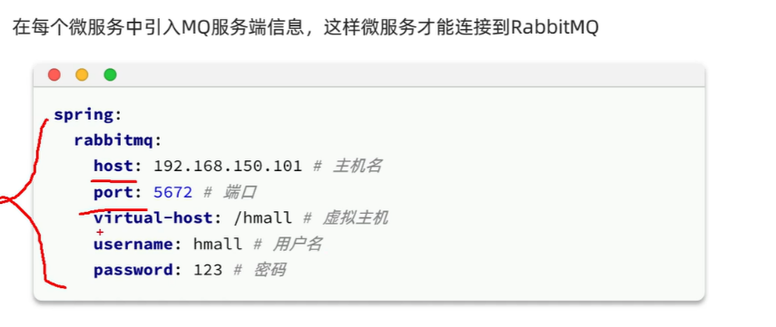

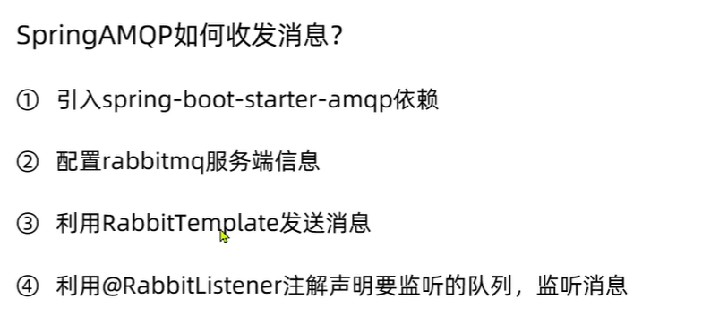

```
@Autowired
private RabbitTemplate rabbitTemplate;
@Test
public void testPublisher() {
  String queueName = "simple.queue";
  String message = "hello, spring amqp!";
  rabbitTemplate.convertAndSend(queueName, message);
}
```

```
/**
 * @author 自然醒
 * @version 1.0
 */
@Component
@Slf4j
public class RabbitListenerConfig {
    @RabbitListener(queues = "simple.queue")
    public void receive(String message) {
        log.info("接收到的消息：{}", message);
    }
}
```

## WorkQueue模型

WorkQueue模型：

- 多个消费者绑定到一个队列，可以加快消息处理速度，此时也可以解决消息积压问题
- 同一个消息只会被一个消费者处理
- 设置prefetch可以控制消费者预取的消息数量，处理完一条之后才可以处理下一条

对于消费者消息推送的限制：

默认情况，RabbitMQ是以轮询的形式将消息推送给每一个消费者，此时并不知道消费者是否处理完上一条消息，这时候就会出现消息积压

解决这种限制需要配置文件

```
spring:
  rabbitmq:
    listener:
      simple:
        prefetch: 1
```

这时候每个消费者只能消费一条消息，并且要处理完上一条才可以处理下一条，解决了消息积压

## 交换机

作用：接收publisher发送的消息、将消息按照规则路由到与之绑定的队列

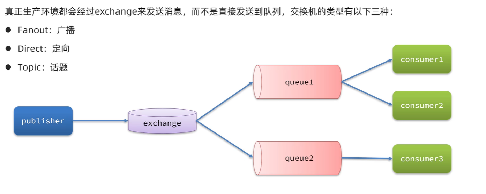

**Fanout交换机：**

将接收到的消息广播到每一个跟其绑定的queue，广播模式

**Direct交换机：**

将接到的消息根据规则路由到指定的Queue，定向路由

- 每一个Queue都与Exchange设置一个BindingKey
- 发送消息时，指定消息的RoutingKey
- Exchange将消息路由到BindingKey与RoutingKey一致的队列

可以实现一种按需推送消息

**Topic交换机：**

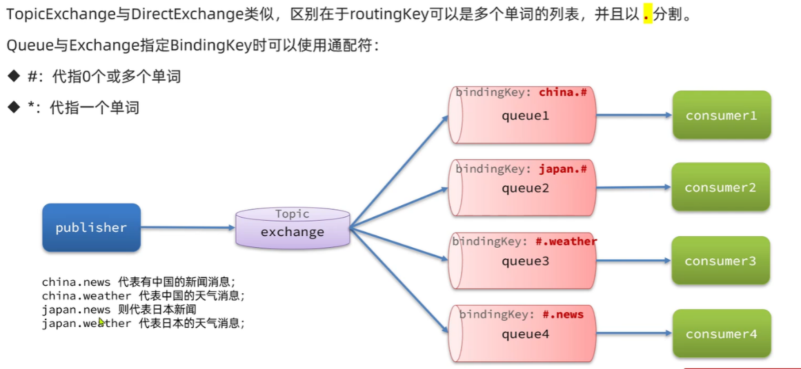

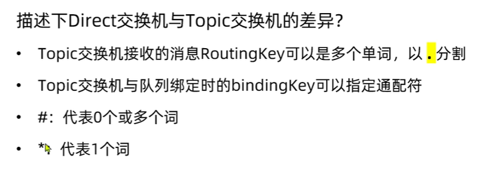

## 客户端绑定

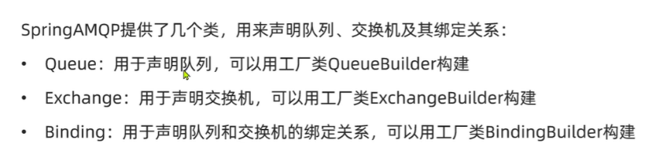

消费者进行声明队列、交换机

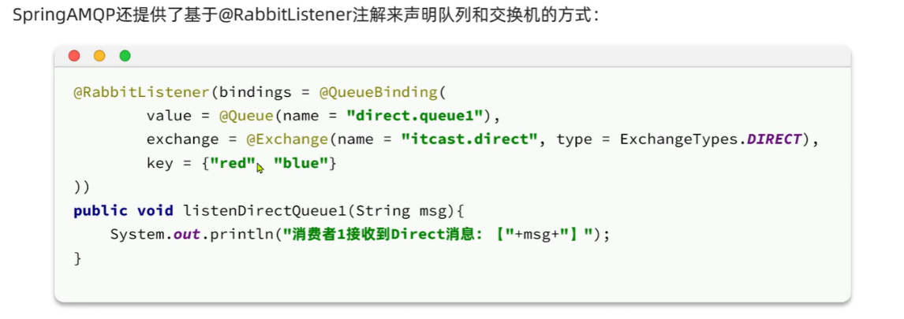

**消息转换器：**

传输对象时会默认使用原生的JDK序列化

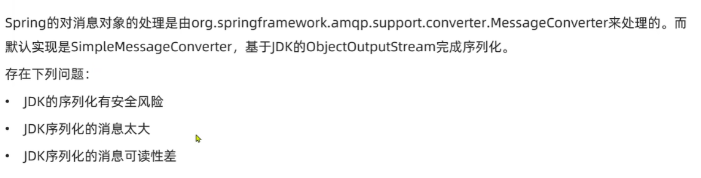

解决方案

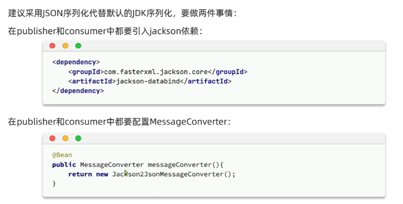

消费者、生产者均需要配置文件

