# 数据结构与算法

## 简介

> 数据结构是程序的骨架 而算法则是灵魂

程序简介:

程序=算法+数据结构


**「算法」**就是**解决问题的方法**或者**过程**。如果我们把问题看成是函数，那么算法就是将输入转换为输出的过程。**「数据******结构」****是**数据的计算机表示和相应的一组操作**。**「程序」**则是**算法和数据结构的具体实现**。

### 数据结构

简介:带有结构特性的数据元素的集合(即数据的组织结构 用来组织、存储数据)

**数据结构研究**的是**数据的逻辑结构、物理结构以及它们之间的相互关系**，并对这种结构定义相应的运算，设计出相应的算法，并确保经过这些运算以后所得到的新结构仍保持原来的结构类型。

对于数据结构，我们可以按照数据的 **「逻辑结构」** 和 **「物理结构」** 来进行分类

#### 逻辑结构

简介:数据元素之间的相互关系

根据元素之间具有的不同关系，通常我们可以将数据的逻辑结构分为以下四种:

##### 集合结构

简介:数据元素同属于一个集合，除此之外无其他关系

集合结构中的数据元素是无序的，并且每个数据元素都是唯一的，集合中没有相同的数据元素。集合结构很像数学意义上的「集合」


##### 线性结构

简介:数据元素之间是**「一对一」**关系

线性结构中的数据元素（除了第一个和最后一个元素），左侧和右侧分别只有一个数据与其相邻。线性结构类型包括：数组、链表，以及由它们衍生出来的栈、队列、哈希表


##### 树形结构

简介:数据元素之间是**「一对多」**的层次关系

最简单的树形结构是二叉树。这种结构可以简单的表示为：根， 左子树， 右子树。 左子树和右子树又有自己的子树。当然除了二叉树，树形结构类型还包括：多叉树、字典树等


##### 图形结构

简介:数据元素之间是**「多对多」**的关系

图形结构是一种比树形结构更复杂的非线性结构，用于表示物件与物件之间的关系。一张图由一些小圆点（称为 **「顶点」** 或 **「结点」**）和连结这些圆点的直线或曲线（称为 **「边」**）组成

在图形结构中，任意两个结点之间都可能相关，即结点之间的邻接关系可以是任意的。图形结构类型包括：无向图、有向图、连通图等


#### 物理结构

简介:数据的逻辑结构在计算机中的存储方式

计算机内有多种存储结构，采用最多的是这两种结构：**「顺序存储结构」**、**「链式存储结构」**

##### 顺序存储结构

简介:将**数据元素**存放在**一片地址连续的存储单元**里，**数据元素**之间的**逻辑关系**通过**数据元素的存储地址**来**直接反映**


在顺序存储结构中，**逻辑上相邻的数据元素在物理地址上也必然相邻** 

> 优点:简单、易理解，且实际占用最少的存储空间
>
> 缺点:需要占用一片地址连续的存储单元；并且存储分配要事先进行；另外对于一些操作的**时间效率较低**（**移动、删除元素等操作**）

##### 链式存储结构

简介:将数据元素存放在任意的存储单元里，存储单元可以连续，也可以不连续


链式存储结构中，逻辑上相邻的数据元素在物理地址上可能相邻，也可能不相邻。其在物理地址上的表现是随机的。链式存储结构中，一般将**每个数据元素占用的若干单元的组合称为一个链结点**。**每个链结点**不仅要**存放一个数据元素的数据信息**，还要**存放一个指出这个数据元素在逻辑关系的直接后继元素所在链结点的地址**，该地址被称为指针。换句话说，**数据元素之间的逻辑关系**是通过**指针**来**间接反映**的

> 优点:存储空间不必事先分配，在需要存储空间的时候可以临时申请，不会造成空间的浪费；一些操**作的时间效率远比顺序存储结构高（插入、移动、删除元素）**
>
> 缺点:不仅数据元素本身的数据信息要占用存储空间，指针也需要占用存储空间，**链式存储结构比顺序存储结构的空间开销大**

### 算法

简介:**解决特定问题求解步骤的准确而完整的描述**，在计算机中表现为一系列指令的集合，算法代表着用系统的方法描述解决问题的策略机制

简而言之 **解决问题的方法**

举几个例子来说明什么是算法:


以上 33 个示例中的解决方法都可以看做是算法。从上海去北京的解决方法可以看做是算法，对 1∼1001∼100 的数进行求和的计算方法也可以看做是算法。对数组进行排序的方法也可以看做是算法

#### 算法基本特性

- **输入**：对于待解决的问题，都要以某种方式交给对应的算法。在算法开始之前最初赋给算法的参数称为输入。比如示例 1 中的输入就是出发地和目的地的参数（北京，上海），示例 3 中的输入就是 n 个整数构成的数组。一个算法可以有多个输入，也可以没有输入。比如示例 2 是对固定问题的求解，就可以看做没有输入。
- **输出**：算法是为了解决问题存在的，最终总需要返回一个结果。所以至少需要一个或多个参数作为算法的输出。比如示例 1 中的输出就是最终选择的交通方式，示例 2 中的输出就是和的结果。示例 3 中的输出就是排好序的数组。
- **有穷性**：算法必须在有限的步骤内结束，并且应该在一个可接受的时间内完成。比如示例 1，如果我们选择五一从上海到北京去旅游，结果五一纠结了三天也没决定好怎么去北京，那么这个旅游计划也就泡汤了，这个算法自然也是不合理的。
- **确定性**：组成算法的每一条指令必须有着清晰明确的含义，不能令读者在理解时产生二义性或者多义性。就是说，算法的每一个步骤都必须准确定义而无歧义。
- **可行性**：算法的每一步操作必须具有可执行性，在当前环境条件下可以通过有限次运算实现。也就是说，每一步都能通过执行有限次数完成，并且可以转换为程序在计算机上运行并得到正确的结果。  

#### 算法追求

> 1. **正确性**：正确性是指算法能够满足具体问题的需求，程序运行正常，无语法错误，能够通过典型的软件测试，达到预期的需求。
> 2. **可读性**：可读性指的是算法遵循标识符命名规则，简洁易懂，注释语句恰当，方便自己和他人阅读，便于后期修改和调试。
> 3. **健壮性**：健壮性指的是算法对非法数据以及操作有较好的反应和处理。

最终算法目标:**所需运行时间更少（时间复杂度更低）**、**占用内存空间更小（空间复杂度更低）**

### 总结

#### 数据结构

数据结构可以分为 **「逻辑结构」** 和 **「物理结构」**。

- 逻辑结构可分为：**集合结构**、**线性结构**、**树形结构**、**图形结构**。
- 物理结构可分为：**顺序存储结构**、**链式存储结构**。

「逻辑结构」指的是数据之间的 **关系**，「物理结构」指的是这种关系 **在计算机中的表现形式**。

例如：线性表中的「栈」，其数据元素之间的关系是一对一的，除头和尾结点之外的每个结点都有唯一的前驱和唯一的后继，这体现的是逻辑结构。而对于栈中的结点来说，可以使用顺序存储（也就是 **顺序栈**）的方式存储在计算机中，其结构在计算机中的表现形式就是一段连续的存储空间，**栈中每个结点和它的前驱结点、后继结点在物理上都是相邻的**。当然，栈中的结点也可以使用链式存储（也即是 **链式栈**），**每个结点和它的前驱结点、后继结点在物理上不一定相邻，每个结点是靠前驱结点的指针域来进行访问的。**

#### 算法

**[算法」** 指的就是解决问题的方法。算法是一系列的运算步骤，这些运算步骤可以解决特定的问题。

算法拥有 5 个基本特性：**输入**、**输出**、**有穷性**、**确定性**、**可行性**。

算法追求的目标有 5 个：**正确性**、**可读性**、**健壮性**、**所需运行时间更少（时间复杂度更低）**、**占用内存空间更小（空间复杂度更低）**

### 算法复杂度

简介:在问题的输入规模为 nn 的条件下，程序的时间使用情况和空间使用情况。

**「算法分析」**的目的在于改进算法。算法所追求的就是 **所需运行时间更少（时间复杂度更低）**、**占用内存空间更小（空间复杂度更低）**。所以进行**「算法分析」**，就是从**运行时间情况、空间使用情况**两方面对算法**进行分析**。

比较两个算法的优劣通常有两种方法：

- **事后统计**：将两个算法各编写一个可执行程序，交给计算机执行，记录下各自的运行时间和占用存储空间的实际大小，从中挑选出最好的算法。
- **预先估算**：在算法设计出来之后，根据算法中包含的步骤，估算出算法的运行时间和占用空间。比较两个算法的估算值，从中挑选出最好的算法。

大多数情况下，我们会选择第 2 种方式。因为第 1 种方式的工作量实在太大，得不偿失。另外，即便是同一个算法，用不同的语言实现，在不同的计算机上运行，所需要的运行时间都不尽相同。所以我们一般采用预先估算的方法来衡量算法的好坏。

采用预先估算的方式下，编译语言、计算机运行速度都不是我们所考虑的对象。我们只关心随着问题规模 n 扩大时，时间开销、空间开销的增长情况。

这里的 **「问题规模 n」** 指的是：算法问题输入的数据量大小。对于不同的算法，定义也不相同。

- 排序算法中：n 表示需要排序的元素数量。
- 查找算法中：n 表示查找范围内的元素总数：比如数组大小、二维矩阵大小、字符串长度、二叉树节点数、图的节点数、图的边点等。
- 二进制计算相关算法中：n 表示二进制的展开宽度。

一般来说，问题的输入规模越接近，相应的计算成本也越接近。而随着问题输入规模的扩大，计算成本也呈上升趋势

#### 时间复杂度

简介:在问题的输入规模为 n 的条件下，算法运行所需要花费的时间，可以记作为 T(n)。

我们将 **基本操作次数** 作为时间复杂度的度量标准。换句话说，时间复杂度跟算法中基本操作次数的数量正相关。

- **基本操作** ：算法执行中的每一条语句。每一次基本操作都可在常数时间内完成。

基本操作是一个运行时间不依赖于操作数的操作。

比如两个整数相加的操作，如果两个数的规模不大，运行时间不依赖于整数的位数，则相加操作就可以看做是基本操作。

反之，如果两个数的规模很大，相加操作依赖于两个数的位数，则两个数的相加操作不是一个基本操作，而每一位数的相加操作才是一个基本操作。

时间复杂度的函数可以表示为：T(n)=O(f(n))。它表示的是随着问题规模 n 的增大，算法执行时间的增长趋势跟f(n) 相同。O 是一种渐进符号，T(n) 称作算法的 **渐进时间复杂度（Asymptotic Time Complexity）**，简称为 **时间复杂度**

所谓**「算法执行时间的增长趋势」**是一个模糊的概念，通常我们要借助像上边公式中 O 这样的**「渐进符号」**来表示时间复杂度

#### 渐进符号

简介:专门用来刻画函数的增长速度的。简单来说，渐进符号只保留了 **最高阶幂**，忽略了一个函数中增长较慢的部分，比如 **低阶幂**、**系数**、**常量**。因为当问题规模变的很大时，这几部分并不能左右增长趋势，所以可以忽略掉

用到的渐进符号有三种： Θ 渐进紧确界符号、O 渐进上界符号、Ω 渐进下界符号

##### Θ渐进紧确界符号

简介:对于函数 f(n) 和 g(n)，f(n)=Θ(g(n))。存在正常量 c1、c2 和 n0，使得对于所有 n≥n0 时，有 0≤c1⋅g(n)≤f(n)≤c2⋅g(n)


也就是说，如果函数 f(n)=Θ(g(n))，那么我们能找到两个正数 c1、c2，使得 f(n) 被c1⋅g(n) 和 c2⋅g(n)夹在中间。

例如：T(n)=3n2+4n+5=Θ(n2)，可以找到 c1=1，c2=12，n0=1，使得对于所有 n≥1，都有 n2≤3n2+4n+5≤12n2


##### O渐进上界符号

简介:对于函数 f(n) 和 g(n)，f(n)=O(g(n))。存在常量 c，n0，使得当 n>n0 时，有 0≤f(n)≤c⋅g(n)。


Θ 符号渐进地给出了一个函数的上界和下界，如果我们只知道一个函数的上界，可以使用 O 渐进上界符号

##### Ω渐进下界符号

简介:对于函数 f(n) 和 g(n)，f(n)=Ω(g(n))。存在常量 c，n0，使得当 n>n0 时，有 0≤c⋅g(n)≤f(n)。


#### 计算时间复杂度

渐进符号可以渐进地描述一个函数的上界、下界，同时也可以描述算法执行时间的增长趋势。

在计算时间复杂度的时候，我们经常使用 **O 渐进上界符号**。因为我们**关注**的通常是**算法用时的上界**，而不用关心其用时的下界。

那么具体应该如何计算时间复杂度呢？

求解时间复杂度一般分为以下几个步骤：

- **找出算法中的基本操作（基本语句）**：算法中执行次数最多的语句就是基本语句，通常是最内层循环的循环体部分。
- **计算基本语句执行次数的数量级**：只需要计算基本语句执行次数的数量级，即保证函数中的最高次幂正确即可。像最高次幂的系数和低次幂可以忽略。
- **用大 O 表示法表示时间复杂度**：将上一步中计算的数量级放入 O 渐进上界符号中。

同时，在求解时间复杂度还要注意一些原则：

- **加法原则**：总的时间复杂度等于量级最大的基本语句的时间复杂度。

如果 T1(n)=O(f1(n))，T2(n)=O(f2(n))，T(n)=T1(n)+T2(n)，则 T(n)=O(f(n))=max(O(f1(n)),O(f2(n)))=O(max(f1(n),f2(n)))。

- **乘法原则**：循环嵌套代码的复杂度等于嵌套内外基本语句的时间复杂度乘积。

如果 T1=O(f1(n))，T2=O(f2(n))，T(n)=T1(n)×T2(n)，则 T(n)=O(f(n))=O(f1(n))×O(f2(n))=O(f1(n)×f2(n))。

##### 常数O(1)

一般情况下，只要算法中不存在循环语句、递归语句，其时间复杂度都为 O(1)。

O(1)只是常数阶时间复杂度的一种表示方式，并不是指只执行了一行代码。只要代码的执行时间不随着问题规模 n 的增大而增长，这样的算法时间复杂度都记为 O(1)

##### 线性O(n)

一般**含有非嵌套循环**，且**单层循环**下的语句**执行次数为 n 的算法涉及线性时间复杂度**。这类算法随着问题规模 n 的增大，对应计算次数呈线性增长

##### 平方O(n2)

一般含有**双层嵌套**，且每层循环下的语句执行次数为 n 的算法涉及平方时间复杂度。这类算法随着问题规模 n 的增大，对应计算次数呈平方关系增长

##### 阶乘O(n!)

阶乘时间复杂度一般出现在与「全排列」、「旅行商问题暴力解法」相关的算法中。这类算法随着问题规模 n 的增大，对应计算次数呈阶乘关系增长


实现「全排列」使用了递归的方法。假设数组 arr 长度为 n，第一层 `for` 循环执行了 n 次，第二层 `for` 循环执行了 n−1 次。以此类推，最后一层 `for` 循环执行了 1 次，将所有层 `for` 循环的执行次数累乘起来为 n×(n−1)×(n−2)×…×2×1=n!次。则整个算法的 `for` 循环中基本语句的执行次数为 n! 次，所以对应时间复杂度为 O(n!)

##### 对数O(logn)

对数时间复杂度一般出现在「二分查找」、「分治」这种一分为二的算法中。这类算法随着问题规模 n 的增大，对应的计算次数呈对数关系增长


`cnt = 1` 的时间复杂度为 O(1) 可以忽略不算。`while` 循环体中 cnt从 1 开始，每循环一次都乘以 2。当大于等于 n 时循环结束。变量 cnt的取值是一个等比数列：2^0,2^1,2^2,…,2^x根据 2^x=n，可以得出这段循环体的执行次数为 log⁡2n

因为 log⁡2n=k×log⁡10n，这里 k≈3.322，是一个常数系数，log⁡2n 与 log⁡10n 之间差别比较小，可以忽略 k。并且 log⁡10n 也可以简写成 log⁡n，所以为了方便书写，通常我们将对数时间复杂度写作是 O(log⁡n)

##### 线性对数O(n×logn)

线性对数一般出现在排序算法中，例如「快速排序」、「归并排序」、「堆排序」等。这类算法随着问题规模 nn 的增大，对应的计算次数呈线性对数关系增长。

外层循环的时间复杂度为 O(log⁡n)，内层循环的时间复杂度为 O(n)，且两层循环相互独立，则总体时间复杂度为 O(n×log⁡n)    while中嵌套for

##### 常见时间复杂度关系

根据从小到大排序，常见的时间复杂度主要有：O(1) < O(log⁡n) < O(n) < O(n×log⁡n)< O(n^2) < O(n^3) < O(2^n) < O(n!) < O(n^n)

##### 最佳、最坏、平均时间复杂度

时间复杂度是一个关于输入问题规模 n 的函数。但是因为输入问题的内容不同，习惯将「时间复杂度」分为「最佳」、「最坏」、「平均」三种情况。这三种情况的具体含义如下：

- **最佳时间复杂度**：每个输入规模下用时最短的输入所对应的时间复杂度。

- **最坏时间复杂度**：每个输入规模下用时最长的输入所对应的时间复杂度。

- **平均时间复杂度**：每个输入规模下所有可能的输入所对应的平均用时复杂度（随机输入下期望用时的复杂度）。

  ​

  ​

#### 空间复杂度

> **空间复杂度（Space Complexity）**：在问题的输入规模为 n 的条件下，算法所占用的空间大小，可以记作为 S(n)。一般将 **算法的辅助空间** 作为衡量空间复杂度的标准

除了执行时间的长短，算法所需储存空间的多少也是衡量性能的一个重要方面。而在「2. 时间复杂度」中提到的渐进符号，也同样适用于空间复杂度的度量。空间复杂度的函数可以表示为 S(n)=O(f(n))，它表示的是随着问题规模 n 的增大，算法所占空间的增长趋势跟 f(n) 相同。

相比于算法的时间复杂度计算来说，算法的空间复杂度更容易计算，主要包括「局部变量（算法范围内定义的变量）所占用的存储空间」和「系统为实现递归（如果算法是递归的话）所使用的堆栈空间」两个部分

##### 空间复杂度计算

###### 常数O(1)

```java
public static int get(){
    int a = 1;
    int b = 2;
    int res = a + b;
    return res;
}
```

上述代码中使用 a、b、res 这 3 个局部变量，其所占空间大小为常数阶，并不会随着问题规模 n 的在增大而增大，所以该算法的空间复杂度为 O(1)

###### 线性O(n)

```java
public static int fun(int n){
    if(n <= 0){
        return 1;
    }
    return n * fun(n-1);
}
```

上述代码采用了递归调用的方式。每次递归调用都占用了 1 个栈帧空间，总共调用了 n 次，所以该算法的空间复杂度为 O(n)

##### 常见空间复杂度关系

根据从小到大排序，常见的算法复杂度主要有：O(1) < O(logn) < O(n) < O(n^2) < O(2^n) 等

### 算法复杂总结

**「算法复杂度」** 包括 **「时间复杂度」** 和 **「空间复杂度」**，用来分析算法执行效率与输入问题规模 nn 的增长关系。通常采用 **「渐进符号」** 的形式来表示「算法复杂度」。

常见的时间复杂度有：O(1)、O(logn)、O(n)、O(n×logn)、O(n^2)、O(n^3)、O(2^n)、O(n!)。

常见的空间复杂度有：O(1)、O(logn)、O(n)、O(n^2)。

## 数组理论基础

### 数组定义

**数组**是存放在**连续内存空间**上的**相同类型数据**的**集合**

### 数组应用

#### 数组数据获取

数组可以方便的通过**下标索引**的方式获取到**下标对应的数据**

举例说明:


> **注意两点:**
>
> - **数组下标都是从0开始的**
> - **数组内存空间的地址是连续的**


#### 二维数组

简介:


C++中的二维数组是连续分布的:


但是在Java中没有指针 因而码农不知道元素的地址 所以寻址操作完全交给虚拟机


Java二维数组的排列方式:

#### 数组访问

> 访问数组中第i个元素:
>
> - 只需要检查i的范围是否在合法的范围区间 即0<=i<=len(nums)-1 超出范围的访问为非法访问
> - 当位置合适时 由给定下标得到元素的值

```java
//从数组nums中读取下标为i的数据元素值
public static void getValue(int[] nums,int i){
    if(0 <= i <= nums.length - 1){
        System.out.println(nums[i]);
    }
}
public static void main(String[] args){
    int[] arr = [0,5,2,3,7,1,6];
    getValue(nums,3);
}
```

**[访问数组元素]**的元素**不依赖于数组中元素个数** [访问数组元素]的时间复杂度为**O(1)**

#### 数组查找

> 查找数组中元素值为val的位置:
>
> - 建立一个基于下标的循环 每次将val与当前数据元素nums[i]进行比较
> - 在找到元素的时候返回元素下标
> - 遍历完找不到时可以返回一个特殊值(例如-1)

```java
//从数组nums中查找元素值为val的数据元素第一次出现的位置
public static int getIndex(int[] nums,int val){
    for(int i = 0;i < nums.length;i++){
        if(nums[i] == val){
            return i;
        }
    }
    return -1;
}
public static void main(String[] args){
    int[] arr = [0,5,2,3,7,1,6];
    System.out.println(getIndex(nums,5));
}
```

查找元素时 如果无序 则需要将val与数组中的数据元素逐一对比方式进行查找 称为线性查找 **线性查找**依赖于**数组中元素个数** **复杂度为O(n)**

#### 数组插入

插入元素操作分为两种:

- 在数组尾部插入值为val的元素
  在数组第i个位置上插入值为val的元素	

> 在数组尾部插入值为val的元素:
>
> - 如果数组尾部容量不满 则直接把val放在数组尾部的空闲位置 并更新数组的元素计数值
>
> - 如果数组容量满 则插入失败 因此需要开辟一个新空间 进行存储新值val
>
>   - Java步骤
>
>     - 创建一个新数组 长度比原来数组多1
>
>       ```java
>       int[] newArray = new int[oldArray.length + 1]
>       ```
>
>       ​
>
>     - 将原数组的元素复制到新数组中
>
>       ```java
>       for(int i = 0; i < oldArray.length; i++){
>           newArray[i] = oldArray[i];
>       }
>       ```
>
>       ​
>
>     - 在新数组的最后一个位置添加新的元素
>
>       ```java
>       newArray[newArray.length - 1] = newElement
>       ```
>
>       ​


```java
//获取数组元素个数
public static int getNums(int []arr){
   int cnt = 0;
    //默认存在元素中不包含-1
    for(int i = 0; i < arr.length; i++){
        if(arr[i] != 0){
            cnt++;
        }else{
            break;
        }
    }
    return cnt;
}
//创建一个新数组
public static int []getNewArray(int []arr){
    int len = getNums(arr);
    int []array = new int[len+1];
    return array;
}
//将数据存入新数组中
public static int []newArr(int []arr,int newElement){
    int []temp = getNewArray(arr);
    for(int i = 0; i < arr.length; i++){
        temp[i] = arr[i];
    }
    temp[temp.length-1] = newElement;
    return temp;
}
public static void main(String[] args){
    Scanner input = new Scanner(System.in);
    int[] oldArray = {1,2,3,4,5};
    int newElement = input.nextInt();
    int[] newArray = newArr(old,newElement);
}
```

**「在数组尾部插入元素」的操作不依赖数组个数，因此，「在数组尾部插入元素」的时间复杂度为 O(1)**

> 在数组第i个位置插入值为val的元素:
>
> - 先检查下标是否合法 即0<=i<=len(nums)
>
> - 确定合法位置后 如果第i个位置上已经有数据了(除非i==len(nums)) 要把第i~len(nums)-1位置上的元素依次向后移动
>
> - 然后再在第i个元素位置赋值为val 并更新数组的元素计数值
>
>   - Java实现
>
>     - 先检查下标是否越界
>
>       ```java
>       //检查下标是否越界
>       public static boolean judge(int[] arr,int index){
>           if(0 <= index && index <= arr.length){
>               return true;
>           }
>           return false;
>       }
>       ```
>
>     - 下标合法 开始寻找下标位置
>
>       ```java
>       //寻找下标位置
>       public static int findIdx(int[] arr,int index){
>           if(judge(arr,index)){
>                for(int i = 0; i < arr.length; i++){
>                    if(index == i){
>                          return i;
>                   }
>               }
>           }
>           return -1;
>       }
>       ```
>
>     - 进行插入数据
>
>       ```java
>       //进行数据插入
>          public static int[] insert(int[] arr, int index, int newElement) {
>               int idx = findIdx(arr, index);
>               if (idx == arr.length) {
>                   //此时插入值的位置为数组的最后一个位置 则直接进行数组扩容+1 插入最后一个位置即可
>                   int[] newArr = new int[idx];
>                   newArr[newArr.length - 1] = newElement;
>                   return newArr;
>               } else {
>                   //此时不是最后一个位置
>                   int[] newArr = new int[arr.length + 1];
>                   //将原来的数组元素复制到新数组中
>                   for (int i = idx; i < arr.length; i++) {
>                       int temp = arr[i];
>                       newArr[i + 1] = temp;
>                   }
>                   for(int i = 0; i < idx; i++){
>                       newArr[i] = arr[i];
>                   }
>                   newArr[idx] = newElement;
>                   return newArr;
>               }
>           }
>       ```
>
>       ```java
>       public static void main(String[] args){
>           Scanner input = new Scanner(System.in);
>           int[] oldArray = {1,2,3,4,5};
>           int index = input.nextInt();
>           int newElement = input.nextInt();
>           int[] newArray = insert(oldArray,index,newElement);
>       }
>       ```
>
>       ​


**「在数组中间位置插入元素」的操作中，由于移动元素的操作次数跟元素个数有关，因此，「在数组中间位置插入元素」的最坏和平均时间复杂度都是 O(n)**


#### 数组改变

> 将数组中第 i 个元素值改为 val:
>
> - 需要先检查 i 的范围是否在合法的范围区间，即 0≤i≤len(nums)−1
> - 然后将第 i 个元素值赋值为 val


> Java实现:
>
> ```java
> //检查下标是否越界
> public static boolean judge(int[] arr,int index){
>     if(0 <= index && index <= arr.length-1){
>         return true;
>     }
>     return false;
> }
> ```
>
> ```java
> //将目标位置的元素进行改变
> public static void change(int[] arr,int index,int newElement){
>     if(judge(arr,index)){
>         arr[index] = newElement;
>     }
> }
> ```
>
> 

**[改变元素」的操作跟访问元素操作类似，访问操作不依赖于数组中元素个数，因此，「改变元素」的时间复杂度为 O(1)**


#### 数组删除

删除元素分为三种情况：**「删除数组尾部元素**」、**「删除数组第 i 个位置上的元素」**、**「基于条件删除元素」**

因为数组在内存空间的**地址是连续**的 所以在**增删**时 **需要移动**其他元素的**地址**

举例说明:


> **注意:**
>
> - 如果使用C++的话 注意vector 和 array的区别 vector 底层实现是array 严格来说是vector是容器 不是数组
> - 数组的元素不能删除的 只能覆盖(实际通过将后续元素依次向前移动 覆盖前一个位置 实现逻辑上的删除)

> **删除数组尾部元素**:
>
> - 只需将元素计数值减1即可
>
>   ```java
>      public static int[] deleteTails(int[] arr) {
>           int[] newArr = new int[arr.length - 1];
>           for (int i = 0; i < arr.length - 1; i++) {
>               newArr[i] = arr[i];
>           }
>           return newArr;
>       }
>   ```
>
>   
>
>   「删除数组尾部元素」的操作，不依赖于数组中的元素个数，因此，「删除数组尾部元素」的时间复杂度为 O(1)

> **删除数组第i个位置上的元素:**
>
> - 检查下标是否合法 即0<=i<=len(nums)-1
>
> - 下标合法 则将第i+1到len(nums)-1位置的元素依次向左移
>
> - 删除元素后修改数组的计数值
>
>   ```java
>   //检查下标是否越界
>   public static boolean judge(int[] arr,int index){
>       if(0 <= index && index <= arr.length-1){
>           return true;
>       }
>       return false;
>   }
>   ```
>
>   ```java
>    public static int[] delete(int[] arr, int index) {
>           //进行判断下标合法
>            if(judge(arr,index)){
>                //删除一个元素后的数组长度会-1 即删除元素后修改数组的计数值
>                int[] newArr = new int[arr.length-1];
>                for(int i = 0, j = 0; i < arr.length; i++){
>                    //未找到相对应位置的元素时 将其他元素依次左移 便形成了删除的整个过程
>                    if(i != index){
>                        newArr[j] = arr[i];
>                        j++;
>                    }
>                }
>                return newArr;
>            }
>            return null;
>       }
>   ```
>
>   
>
>   「删除数组中间位置元素」的操作同样涉及移动元素，而移动元素的操作次数跟元素个数有关，因此，「删除数组中间位置元素」的最坏和平均时间复杂度都是 O(n)

> **基于条件删除元素**:(个人理解有点像第二种删除方式)
>
> 这种操作一般不给定被删元素的位置，而是给出一个条件要求删除满足这个条件的（一个、多个或所有）元素。这类操作也是通过循环检查元素，查找到元素后将其删除


### 数组总结

数组是最基础、最简单的数据结构。数组是实现线性表的顺序结构存储的基础。它使用一组连续的内存空间，来存储一组具有相同类型的数据。

数组的最大特点的支持随机访问。访问数组元素、改变数组元素的时间复杂度为 O(1)，在数组尾部插入、删除元素的时间复杂度也是 O(1)，普通情况下插入、删除元素的时间复杂度为 O(n)

### 数组算法

#### 环状替换

> 题目例如LeetCode中的第189题 轮转数组

从位置0开始 最初令temp = nums[0]为第一个元组 根据题意我们需要向右移动元素k轮 即此时位置0的元素会被放至(0+k) mod len(nums) 我们便可通过(0+k) mod len(nums)来获取存放的位置 idx = (0+k) mod len(nums) 随即交换 nums[idx] = temp 即0位置的元素直接走了k轮到达最后要存放的位置 然后再去考虑idx位置的元素 如此循环反复即可 直到回到初始位置0 

当如此循环时 会有部分数据没遍历 理论应该是从下一个数字开始遍历的但我们直接从存放的位置开始遍历了 因此需要考虑从0开始回到起点需要遍历多少个元素

该过程恰好走了整数数量的圈，不妨设为 a 圈；再设该过程总共遍历了 b 个元素。因此，我们有 an=bk，即 an 一定为 n,k 的公倍数。又因为我们在第一次回到起点时就结束，因此 a 要尽可能小，故 an 就是 n,k 的最小公倍数 lcm(n,k)，因此 b 就为 lcm(n,k)/k。

即单次遍历访问到的个数为lcm(n,k)/k

遍历次数为n/lcm(n,k)/k = nk/lcm(n,k) = gcd(n,k)

最小公倍数与最大公因数的关系 ab = lcm(a,b)*gcd(a,b)

```java
public static int gcd(int a, int b) {
        return b == 0 ? a : gcd(b, a % b);
}

 public static void rotate(int[] nums, int k) {
        int n = nums.length;
        k = k % n;
        if (k == 0) {
            return;
        }
        int count = gcd(n, k); //拿到需要遍历的次数
        for (int i = 0; i < count; ++i) {
            int idx = i; //当前轮转的起始位置
            int prev = nums[idx]; //当前轮转的起始位置的元素
            do {
                int nextIdx = (idx + k) % n; //轮转后存放的位置
                int temp  = nums[nextIdx]; //轮转前存放该位置的元素
                nums[nextIdx] = prev; //轮转后存放该位置的元素
                prev = temp; //轮转前的元素 需要将其拿出来 不然会被覆盖
                idx = nextIdx; //轮转后的起始位置
            } while (idx != i);
        }
    }
```


#### 前缀和

> 前缀和简单概述即 从第一位开始至第i位的和 


> LeetCode 724题 寻找数组的中心下标

记数组的全部元素之和为 total，当遍历到第 i 个元素时，设其左侧元素之和为 sum，则其右侧元素之和为

 total−nums [i]−sum。左右侧元素相等即为 sum=total−nums [i] −sum，即 2×sum+nums i]=total。当中心索引左侧或右侧没有元素时，即为零个项相加，这在数学上称作「空和」（empty sum）。在程序设计中我们约定「空和是零」

```java
public static int pivotIndex(int[] nums){
    int total = 0;
    for(int num:nums){
        total+=num;
    }
    int leftSum = 0;
    for(int i = 0; i < nums.length; i++){
        int rightSum = total - leftSum - nums[i];
        if(rightSum == leftSum){
            return i;
        }
        leftSum += nums[i];
    }
    return -1;
}
```

> LeetCode 238 除自身外的数组的乘积

```java
 * 给你一个整数数组 nums，返回 数组 answer ，其中 answer[i] 等于 nums 中除 nums[i] 之外其余各元素的乘积 。
 * 题目数据 保证 数组 nums之中任意元素的全部前缀元素和后缀的乘积都在  32 位 整数范围内。
 * 请 不要使用除法，且在 O(n) 时间复杂度内完成此题
 
 
 public static int[] productExceptSelf(int[] nums) {

        //如果要拿到O(1)的复杂度 则将rightAnswer转为动态即可
        //即直接将rightAnswer转为一个常数用于动态变化
        int[] answer = new int[nums.length];
        answer[0] = 1;
        for (int i = 1; i < nums.length; i++) {
            answer[i] = answer[i - 1] * nums[i - 1];
        }
        int rightAnswer = 1;
        for (int i = nums.length - 1; i >= 0; i--) {
            answer[i] *= rightAnswer;
            rightAnswer *= nums[i];
        }
        return answer;

//        int[] answer = new int[nums.length];
//        int[] leftAnswer = new int[nums.length];
//        int[] rightAnswer = new int[nums.length];
//        leftAnswer[0] = 1; // 初始化leftAnswer
//        for (int i = 1; i < nums.length; i++) {
//            //计算leftAnswer 拿到左边所有的乘积
//            leftAnswer[i] = leftAnswer[i - 1] * nums[i - 1];
//        }
//        rightAnswer[nums.length - 1] = 1; // 初始化rightAnswer
//        for (int i = nums.length - 2; i >= 0; i--) {
//             //计算rightAnswer 拿到右边所有的乘积
//            rightAnswer[i] = rightAnswer[i + 1] * nums[i + 1];
//        }
//        for (int i = 0; i < nums.length; i++) {
//            //此时的leftAnswer与rightAnswer乘积即可得到answer
//            //根据题目意思 answer是除本身索引位置之外的所有元素之积
//            //此题的思想即为前缀和和后缀和 不够是将其变为前缀积和后缀积
//            answer[i] = leftAnswer[i] * rightAnswer[i];
//        }
//          return answer;

//        以下方法超时 从头到尾遍历 并且出现嵌套循环 会出现O(n^2)
//        int[] answer = new int[nums.length];
//        for(int i = 0; i< nums.length; i++){
//            int total = 1;
//            for(int j = 0; j < nums.length; j++){
//                if(i != j){
//                    total *= nums[j];
//                }
//            }
//            answer[i] = total;
//        }
//        return answer;
```

#### 二维数组模拟

> LeetCode 498 对角线遍历
>
> 给你一个大小为 `m x n` 的矩阵 `mat` ，请以对角线遍历的顺序，用一个数组返回这个矩阵中的所有元素


**解题思路:**

1.根据题目意思 开始模拟数组的遍历 即走的步数 做思考可以发现对角线的条数为(m+n-1) 

2.然后可以发现对角线的遍历是上下交替的 因此我们可以将对角线标序号 由此发现当对角线序号为偶数时

它是从下往上遍历 为奇数时 它是从上往下遍历 矩阵行列的关系:同一对角线上的(x,y)横纵坐标之和关系(x+y)相等

3.并且在对角线上 我们只需要知道横纵坐标之一 便可以知道另一维坐标 随后分两种情况讨论:偶数和奇数

**偶数:**

因此偶数的起始端点x=Math.min(i,n-1) 终点端点x = Math.max(0,i-m+1)

奇数相反 x = Math.min(0,i-m+1)  终点 x = Math.min(i,n-i)

具体过程如下：

1、定义答案数组res，遍历每条对角线。
2、对于每条序号为i的对角线，判断其奇偶性：
如果是偶数对角线 ，确定其横坐标x，从下往上遍历，将mat[x][i-x]加入res中。
如果是奇数对角线 ，确定其横坐标x，从上往下遍历，将mat[x][i - x]加入 res中。
3、最后返回res。

```java
  public static int[] findDiagonalOrder(int[][] mat) {
        if (mat == null || mat.length == 0) {
            return new int[0];
        }
        int m = mat.length; //行数
        int n = mat[0].length; //列数
        int[] res = new int[m * n];
        int diagonalNums = m + n - 1; //对角线数
        for (int i = 0, idx = 0; i < diagonalNums; i++) {
            if (i % 2 == 0) {
                //是偶数的则对角线遍历从下往上
                for (int j = Math.min(i, m - 1); j >= Math.max(0, i - n + 1); j--) {
                    res[idx++] = mat[j][i - j];
                }
            } else {
                //是奇数的则对角线遍历从上往下
                for (int j = Math.max(0, i - m + 1); j <= Math.min(i, n - 1); j++) {
                    res[idx++] = mat[j][i - j];
                }
            }
        }
        return res;
    }
```

#### 矩阵模拟

> LeetCode  289 生命游戏
>
> ```
> 给定一个包含 m × n 个格子的面板，每一个格子都可以看成是一个细胞。每个细胞都具有一个初始状态： 1 即为 活细胞 （live），或 0 即为 死细胞 （dead）。每个细胞与其八个相邻位置（水平，垂直，对角线）的细胞都遵循以下四条生存定律：
> * 如果活细胞周围八个位置的活细胞数少于两个，则该位置活细胞死亡；
> * 如果活细胞周围八个位置有两个或三个活细胞，则该位置活细胞仍然存活；
> * 如果活细胞周围八个位置有超过三个活细胞，则该位置活细胞死亡；
> * 如果死细胞周围正好有三个活细胞，则该位置死细胞复活；
> * 下一个状态是通过将上述规则同时应用于当前状态下的每个细胞所形成的，其中细胞的出生和死亡是 同时 发生的。给你 m x n 网格面板 board 的当前状态，返回下一个状态
> ```

1、矩阵中某个位置的状态如果发生改变，那么这种题的解法一般是两次遍历整个矩阵。第一遍遍历时，用一个不可能出现在原矩阵中的中间值来保存状态的变化（这样在此次遍历时，不影响其他的位置的判断，比如我们可以用“$”这种没人用的字符）；第二遍遍历时，把中间值刷新成为变化后应该变成的值。

2、如果遍历到某个位置时，需要查看它周边的位置，此时如果每一个周围的位置都手写，然后再判断是否越界，就很麻烦。可以先用一个数组保存向周边位置变化的坐标偏移值，一次性通过一个循环，来遍历完周边的位置，并且方便进行越界判断。

```java
  // 方向数组 分别代表水平、垂直、对角线
    static int[][] dirs = {{0, 1}, {0, -1}, {1, 0}, {-1, 0}, {1, 1}, {1, -1}, {-1, 1}, {-1, -1}};

public static void gameOfLife(int[][] board) {
        int m = board.length;
        int n = board[0].length;
        for (int i = 0; i < m; i++) {
            for (int j = 0; j < n; j++) {
                //dx dy 表示当前细胞在数组中的坐标
                int dx = 0;
                int dy = 0;
                int live = 0; //  记录当前细胞周围活细胞数
                for (int[] dir : dirs) {
                    dx = i + dir[0];
                    dy = j + dir[1];
                    //判断是否越界
                    if (dx < 0 || dx >= m || dy < 0 || dy >= n) {
                        continue;
                    }
                    //判断当前细胞周围是否为活细胞 如果为1则它不会改变 如果为2则说明它的状态将会改变
                    //因为前面已经出现过活细胞它可能会存在死亡状态 即需要记录 以防计数错误 导致状态未发生改变
                    if (board[dx][dy] == 1 || board[dx][dy] == 2) {
                        live++;
                    }
                }
                //两个中间值-1 2 若为-1则表示将复活 若为2则表示将死亡
                //如果死细胞周围有3个活细胞，则该位置复活 使用中间值-1进行赋值 以防下次遍历时将其覆盖
                if (board[i][j] == 0) {
                    if (live == 3) {
                        board[i][j] = -1;
                    }
                } else {
                    // 如果活细胞周围少于2个活细胞 或多于3个活细胞时 则该位置死亡 使用中间值2进行赋值
                    if (live < 2 || live > 3) {
                        board[i][j] = 2;
                    }
                }
            }
        }
        for (int i = 0; i < m; i++) {
            for (int j = 0; j < n; j++) {
                if (board[i][j] == -1) {
                    board[i][j] = 1;
                } else if (board[i][j] == 2) {
                    board[i][j] = 0;
                }
            }
        }
    }
```

### 排序

#### 数组排序

简而言之，对目标数组进行一个排序。数组排序是最基本的问题之一，排序算法也存在多种，对于不用情况使用不同算法

#### 排序算法

**按不同标准进行分类**

>1.按时间复杂度进行分类:
>
>- 简单排序算法：时间复杂度为 O(n2)，如冒泡排序、选择排序、插入排序
>- 高级排序算法：时间复杂度为 O(nlog⁡n)，如快速排序、归并排序、堆排序
>- 线性排序算法：时间复杂度为 O(n)，如计数排序、桶排序、基数排序

>2.按空间复杂度进行分类:
>
>- 原地排序算法：空间复杂度为 O(1)，如冒泡排序、选择排序、插入排序、快速排序、堆排序
>- 非原地排序算法：空间复杂度为 O(n)，如归并排序、计数排序、桶排序、基数排序

>3.按稳定性分类:
>
>- 稳定排序算法：相等元素的相对顺序在排序后保持不变，如冒泡排序、插入排序、归并排序、计数排序、桶排序、基数排序
>- 不稳定排序算法：相等元素的相对顺序在排序后可能改变，如选择排序、快速排序、堆排序

**常见算法：**

1. 冒泡排序：通过相邻元素比较和交换，将最大元素逐步"冒泡"到数组末尾
2. 选择排序：每次从未排序区间选择最小元素，放到已排序区间末尾
3. 插入排序：将未排序区间的元素插入到已排序区间的合适位置
4. 快速排序：选择一个基准元素，将数组分为两部分，递归排序
5. 归并排序：将数组分成两半，分别排序后合并
6. 堆排序：利用堆这种数据结构进行排序
7. 计数排序：统计每个元素出现的次数，按顺序输出
8. 桶排序：将元素分到有限数量的桶中，对每个桶单独排序
9. 基数排序：按照元素的位数进行排序

**排序算法的选择**：

1. 数据规模：小规模数据可以使用简单排序算法，大规模数据需要使用高级排序算法
2. 数据特征：如果数据基本有序，插入排序效率较高；如果数据分布均匀，快速排序效率较高
3. 空间限制：如果空间有限，应该选择原地排序算法
4. 稳定性要求：如果需要保持相等元素的相对顺序，应该选择稳定排序算法
5. 硬件环境：不同的硬件环境可能适合不同的排序算法

#### 冒泡排序

**基本思想：**

>经过多次遍历 相邻元素之间的比较与交换 使值小的元素从后面移到前面 值大的从前面移到后面

**简而言之：像水底的气泡一样从底部向上冒泡**

**算法步骤：**

假设数组元素个数为n个

1.第 1趟「冒泡」：对前 n 个元素执行「冒泡」，从而使第 1 个值最大的元素放置在正确位置上

>1. 先将序列中第 1 个元素与第 2 个元素进行比较，如果前者大于后者，则两者交换位置，否则不交换。
>2. 然后将第 2 个元素与第 3 个元素比较，如果前者大于后者，则两者交换位置，否则不交换。
>3. 依次类推，直到第 n−1 个元素与第 n 个元素比较（或交换）为止。
>4. 经过第 1 趟排序，使得 n 个元素中第 i 个值最大元素被安置在第 n 个位置上。

2.第 2 趟「冒泡」：对前 n−1 个元素执行「冒泡」，从而使第 2 个值最大的元素放置在正确位置上

>1. 先将序列中第 1 个元素与第 2 个元素进行比较，若前者大于后者，则两者交换位置，否则不交换。
>2. 然后将第 2 个元素与第 3 个元素比较，若前者大于后者，则两者交换位置，否则不交换。
>3. 依次类推，直到对 n−2 个元素与第 n−1 个元素比较（或交换）为止。
>4. 经过第 2 趟排序，使得数组中第 2 个值最大元素被安置在第 n 个位置上。

3.依次类推，重复上述「冒泡」过程，直到某一趟排序过程中不出现元素交换位置的动作，则排序结束

我们以[5,2,3,6,1,4] 为例，演示一下冒泡排序算法的整个步骤

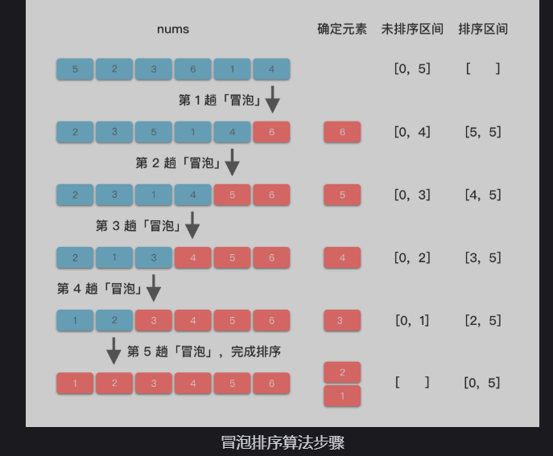

**算法分析**

- **最佳时间复杂度**：O(n)。最好的情况下（初始时序列已经是升序排列），只需经过 1 趟排序，总共经过 n 次元素之间的比较，并且不移动元素，算法就可以结束排序。因此，冒泡排序算法的最佳时间复杂度为 O(n)。
- **最坏时间复杂度**：O(n2)。最差的情况下（初始时序列已经是降序排列，或者最小值元素处在序列的最后），则需要进行 n 趟排序，总共进行{ i = 2到 n 的(i-1)的总和} = n*(n-1)/2次元素之间的比较，因此，冒泡排序算法的最坏时间复杂度为 O(n2)。
- **空间复杂度**：O(1)。冒泡排序为原地排序算法，只用到指针变量 i、j 以及标志位 flag 等常数项的变量。
- **冒泡排序适用情况**：冒泡排序方法在排序过程中需要移动较多次数的元素，并且排序时间效率比较低。因此，冒泡排序方法比较适合于参加排序序列的数据量较小的情况，尤其是当序列的初始状态为基本有序的情况。
- **排序稳定性**：由于元素交换是在相邻元素之间进行的，不会改变相等元素的相对顺序，因此，冒泡排序法是一种 **稳定排序算法**。

~~~java
/**
*从头排到尾 也是区间排序 相对于下一个难理解
**/
public static int[] bubblingSort(int[] arr){
       for(int i = 0; i < arr.length; i++){
           for(int j = 0; j < arr.length - i - 1; j++){
               if(arr[j] > arr[j+1]){
                   int temp = arr[j];
                   arr[j] = arr[j+1];
                   arr[j+1] = temp;
               }
           }
       }
       return arr;
    }
~~~

~~~java
  /**
     * 通过区间来进行冒泡
     */
    public static int[] bubblingSort(int[] arr){
        //外循环控制区间
        for(int i = arr.length - 1; i > 0; i--){
            //内循环控制比较
            for(int j = 0; j < i; j++){
                if(arr[j] > arr[j+1]){
                    int temp = arr[j];
                    arr[j] = arr[j+1];
                    arr[j+1] = temp;
                }
            }
        }
        return arr;
    }
~~~

**算法优化：**

如果某轮“冒泡”中没有执行任何交换操作，说明数组已经完成排序，可直接返回结果。因此，可以增加一个标志位 `flag` 来监测这种情况，一旦出现就立即返回。

经过优化，冒泡排序的最差时间复杂度和平均时间复杂度仍为 O(n2) ；但当输入数组完全有序时，可达到最佳时间复杂度 O(n) 。

~~~java
    /**
     * 效率优化
     */
    public static int[] bubblingSort(int[] arr){
        for(int i = arr.length - 1; i > 0; i--){
            boolean flag = false; // 初始化标志位
            for(int j = 0; j < i; j++){
                if(arr[j] > arr[j+1]){
                    int temp = arr[j];
                    arr[j] = arr[j+1];
                    arr[j+1] = temp;
                    flag = true; // 有数据交换，标志位置为true
                }
            }
            if(!flag){
                break;  // 此轮“冒泡”未交换任何元素，直接跳出
            }
        }
        return arr;

    }
~~~

>LeetCode 283 移动零 
>
>使用冒泡同时两个指针进行移动
>
>~~~java
> public static void moveZero(int[] arr) {
>        if(arr == null){
>           return;
>        }
>        int idx = 0;
>        for(int i = 0; i < arr.length; i++){
>            if(arr[i] != 0){
>                int temp = arr[i];
>                arr[i] = arr[idx];
>                arr[idx] = temp;
>                idx++;
>            }
>        }
>        for(int i = 0; i < arr.length; i++){
>            System.out.print(arr[i] + " ");
>        }
>
>    }
>~~~
>
>滚雪球方法
>
>~~~java
>public void moveZero(int[] nums){
>    int snowBallSize = 0;
>    for(int i = 0; i < nums.length; i++){
>        if(nums[i] == 0){
>            snowBallSize++;
>        }else if(snowBallSize > 0){
>            int temp = nums[i];
>            nums[i] = 0;
>            nums[i - snowBallSize] = temp;
>        }
>    }
>}
>~~~
>
>

#### 选择排序

**简介：**将数组分为两个区间。**左侧为已排序区间**，**右侧为未排序区间**。每趟从未排序区间中选择一个值最小的元素，放到已排序区间的末尾，从而将该元素划分到已排序区间。

**算法解题步骤：**

1.初始状态并未开始排序，所以全部为未排序区间[0,n-1]

2.开始第1趟选择排序：

遍历未排序区间，使用min存储区间中的最小值并且至于数组的第1位，此时区间会分为两段，排序区间[0,0]，未排序区间[1,n-1]

3.开始第2趟选择排序：

遍历未排序区间[1,n-1]，获取到最小值min，将min放置已排序的区间末尾，未排序区间的第1位(即与下标为1的数据进行交换)，此时排序区间变为[0,1],未排序区间[2,n-1]

4.按照上述步骤往复即可 直到最后一位

**算法分析：**

**时间复杂度**：O(n2)。排序法所进行的元素之间的比较次数与序列的原始状态无关，时间复杂度总是 O(n2)。

>这是因为无论序列中元素的初始排列状态如何，第 i 趟排序要找出值最小元素都需要进行 n−i 次元素之间的比较。因此，整个排序过程需要进行的元素之间的比较次数都相同:n*(n-1)/2次

**空间复杂度**：O(1)。选择排序算法为原地排序算法，只用到指针变量i、j 以及最小值位置 min 等常数项的变量。

**适用情况：**因为该算法需要分为两个工作区间：1.已排序 2.未排序

所以它的时间复杂度会为O(n^2),因此对于数据大的情况，即移动次数多的数据并不适用，移动次数多时间效率就会低，但是它是原地排序，空间复杂度为O(1),可以用于对空间要求高的算法中

**排序稳定性：**由于值最小元素与未排序区间第 1 个元素的交换动作是在不相邻的元素之间进行的，因此很有可能会改变相等元素的相对顺序

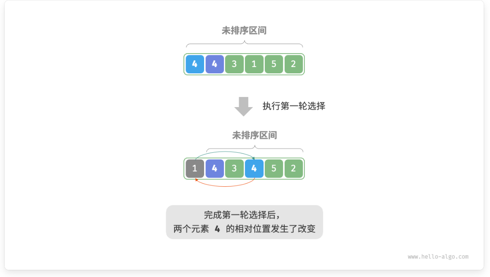

~~~java
    void selectSort(int[] arr) {
        int len = arr.length;
        for(int i = 0; i < len - 1; i++){
            int min = i;
            for(int j = i + 1; j < len; j++){
                if(arr[j] < arr[min]){
                    min = j;
                }
            }
            if(min != i){
                int temp = arr[i];
                arr[i] = arr[min];
                arr[min] = temp;
            }
        }
    }
~~~


#### 快速排序

**基本概念：**选择数组中某个元素作为基准数，通过一趟排序将数组分为独立的两个子数组，一个子数组中所有元素值都比基准数小，另一个子数组中所有元素值都比基准数大。然后再按照同样的方式递归的对两个子数组分别进行快速排序，以达到整个数组有序

主要采用分治的思想(能够拆分为子问题解决)

**算法步骤：**

1.**哨兵划分**：选取一个基准数，将数组中比基准数大的元素移动到基准数右侧，比他小的元素移动到基准数左侧。

1)从当前数组中找到一个基准数 pivot（这里以当前数组第 1个元素作为基准数，即 pivot=nums[low]）

2)使用指针 i 指向数组开始位置，指针 j 指向数组末尾位置。

3)从右向左移动指针 j，找到第 1 个小于基准值的元素。

4)从左向右移动指针 i，找到第 1 个大于基准数的元素。

5)交换指针 i、指针 j 指向的两个元素位置。

6)重复第 3∼5 步，直到指针 i 和指针 j 相遇时停止，最后将基准数放到两个子数组交界的位置上

2.**递归分解**：完成哨兵划分之后，对划分好的左右子数组分别进行递归排序

1)按照基准数的位置将数组拆分为左右两个子数组。

2)对每个子数组分别重复「哨兵划分」和「递归分解」，直到各个子数组只有 1 个元素，排序结束

>在经过一次「哨兵划分」过程之后，数组就被划分为左子数组、基准数、右子树组三个独立部分。接下来只要对划分好的左右子数组分别进行递归排序即可完成排序

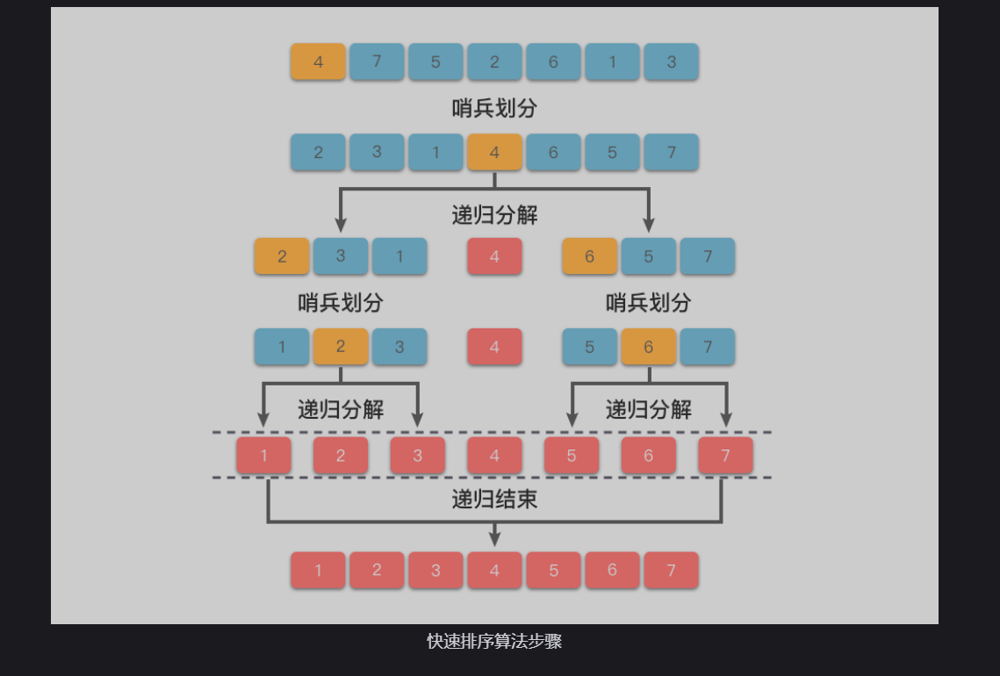

**算法分析：**

快速排序的时间复杂度主要跟基准数的选择有关系

如果参加排序的元素初始时已经有序的情况下，快速排序方法花费的时间最长。也就是会得到最坏时间复杂度。

在这种情况下，第 1 趟排序经过 n−1 次比较以后，将第 1 个元素仍然确定在原来的位置上，并得到 1个长度为 n−1 的子数组。第 2 趟排序进过 n−2 次比较以后，将第 2 个元素确定在它原来的位置上，又得到 1 个长度为 n−2 的子数组

最终总的比较次数为 (n−1)+(n−2)+…+1=n*(n-1)/2。因此这种情况下的时间复杂度为 O(n2)，也是最坏时间复杂度。

假设输入数组是完全倒序的，由于我们选择最左端元素作为基准数，那么在哨兵划分完成后，基准数被交换至数组最右端，导致左子数组长度为 n−1、右子数组长度为 0 。如此递归下去，每轮哨兵划分后都有一个子数组的长度为 0 ，分治策略失效，快速排序退化为“冒泡排序”的近似形式

>为何快排很快：
>
>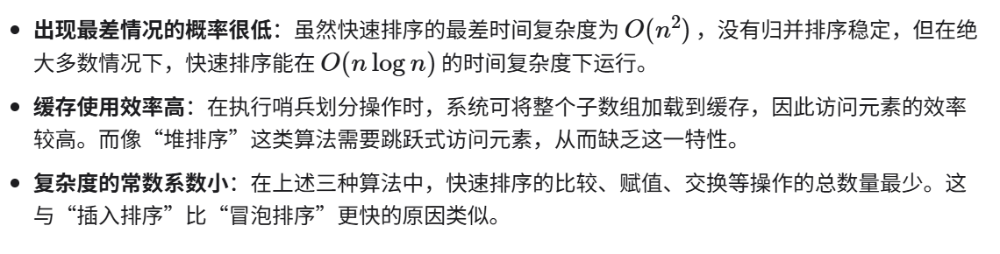

**解决方案：**

优化基准数：基准数的选择最好能够为中位数 此时能够将数组平均分为两份

在这种选择下，每一次都将数组从 n 个元素变为 n/2 个元素。此时的时间复杂度公式为 T(n)=2×T(n/2)+Θ(n)。根据主定理可以得出 T(n)=O(n×log⁡n)，也是最佳时间复杂度

在平均情况下，我们可以从当前数组中随机选择一个元素作为基准数。这样，每一次选择的基准数可以看做是等概率随机的。其期望时间复杂度为 O(n×log⁡n)，也就是平均时间复杂度

**快排总结：**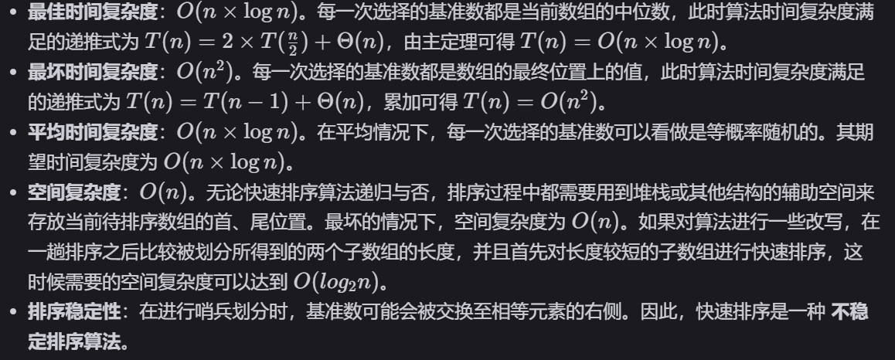

~~~java
/**
     * 快排算法核心逻辑
     * @param arr
     * @param low
     * @param high
     */
    void quickSort(int[] arr, int low, int high) {
        //当左右两个指针相同时 此时已经排序完成 退出递归
        if(low >= high){
            return;
        }
        int pivot = partition(arr, low, high);
        //递归左右两个子数组
        quickSort(arr, low, pivot - 1);
        quickSort(arr, pivot + 1, high);
    }

    /**
     * 用于交换数组元素
     * @param arr
     * @param i
     * @param j
     */
    void swap(int[] arr, int i, int j) {
        int temp = arr[i];
        arr[i] = arr[j];
        arr[j] = temp;
    }

    /**
     * 找基准数 分区 返回值为基准数在数组中的索引
     * @param arr
     * @param low
     * @param high
     * @return
     */
    int partition(int[] arr, int low, int high) {
       int i = low;
       int j = high;
       while(i < j){
           //从右往左找小于基准数的元素
           while (i < j && arr[j] >= arr[low]){
               j--;
           }
           //从左往右找大于基准数的元素
           while (i < j && arr[i] <= arr[low]){
               i++;
           }
           swap(arr,i,j);
       }
       swap(arr,i,low);
       return i;
    }
~~~

**基准数的优化策略：**

~~~java
 /**
     * 快排算法核心逻辑
     * @param arr
     * @param low
     * @param high
     */
    void quickSort(int[] arr, int low, int high) {
        //当左右两个指针相同时 此时已经排序完成 退出递归
        if(low >= high){
            return;
        }
        int pivot = partition(arr, low, high);
        //递归左右两个子数组
        quickSort(arr, low, pivot - 1);
        quickSort(arr, pivot + 1, high);
    }


    /**
     * 用于基准数的选取 对基准数进行优化 使得基准数能够尽可能的将两个数组均匀平分
     * @param nums
     * @param left
     * @param mid
     * @param right
     * @return
     */
    int medianThree(int[] nums, int left, int mid, int right) {
        int l = nums[left], m = nums[mid], r = nums[right];
        if ((l <= m && m <= r) || (r <= m && m <= l))
            return mid; // m 在 l 和 r 之间
        if ((m <= l && l <= r) || (r <= l && l <= m))
            return left; // l 在 m 和 r 之间
        return right;
    }

    /**
     * 基准数查找
     * @param nums
     * @param left
     * @param right
     * @return
     */
    int partition(int[] nums, int left, int right) {
        // 选取三个候选元素的中位数
        int med = medianThree(nums, left, (left + right) / 2, right);
        // 将中位数交换至数组最左端
        swap(nums, left, med);
        // 以 nums[left] 为基准数
        int i = left, j = right;
        while (i < j) {
            while (i < j && nums[j] >= nums[left])
                j--;          // 从右向左找首个小于基准数的元素
            while (i < j && nums[i] <= nums[left])
                i++;          // 从左向右找首个大于基准数的元素
            swap(nums, i, j); // 交换这两个元素
        }
        swap(nums, i, left);  // 将基准数交换至两子数组的分界线
        return i;             // 返回基准数的索引
    }

    /**
     * 用于交换数组元素
     * @param arr
     * @param i
     * @param j
     */
    void swap(int[] arr, int i, int j) {
        int temp = arr[i];
        arr[i] = arr[j];
        arr[j] = temp;
    }
~~~

**尾递归优化：**

**在某些输入下，快速排序可能占用空间较多**。以完全有序的输入数组为例，设递归中的子数组长度为 m ，每轮哨兵划分操作都将产生长度为 0 的左子数组和长度为 m−1 的右子数组，这意味着每一层递归调用减少的问题规模非常小（只减少一个元素），递归树的高度会达到 n−1 ，此时需要占用 O(n) 大小的栈帧空间。

为了防止栈帧空间的累积，我们可以在每轮哨兵排序完成后，比较两个子数组的长度，**仅对较短的子数组进行递归**。由于较短子数组的长度不会超过 n/2 ，因此这种方法能确保递归深度不超过 log⁡(n) ，从而将最差空间复杂度优化至 O(log(n))

~~~java
/**
     * 快排算法核心逻辑
     * @param arr
     * @param low
     * @param high
     */
    /* 快速排序（尾递归优化） */
    void quickSort(int[] arr, int low, int high) {
        // 子数组长度为 1 时终止
        while (low < high) {
            // 哨兵划分操作
            int pivot = partition(arr, low, high);
            // 对两个子数组中较短的那个执行快速排序
            if (pivot - low < high - pivot) {
                quickSort(arr, low, pivot - 1); // 递归排序左子数组
                low = pivot + 1; // 剩余未排序区间为 [pivot + 1, right]
            } else {
                quickSort(arr, pivot + 1, high); // 递归排序右子数组
                high = pivot - 1; // 剩余未排序区间为 [left, pivot - 1]
            }
        }
    }
~~~

>LeetCode 215. 数组中的第K个最大元素  912. 排序数组


#### 插入排序

**基本介绍：**

将数组分为两个区间：左侧为有序区间，右侧为无序区间。每趟从无序区间取出一个元素，然后将其插入到有序区间的适当位置

>插入排序在每次插入一个元素时，该元素会在有序区间找到合适的位置，因此每次插入后，有序区间都会保持有序

**算法步骤：**

1.初始状态，有序区间[0,0]，无序区间[1,n-1]

2.第一趟插入

1)取出无序区间[1,n-1]中的第1个元素,nums[1]

2)从右到左进行遍历，大于nums[1]的元素往后移1位

3)如果遇到小于或等于nums[1]的元素，说明找到插入位置，将nums[1]插入

4)此时有序区间变为[0,1]

3.第二躺插入

1)取出无序区间[2,n-1]中的第一个元素nums[2]

2)从右往左进行遍历，大于nums[2]的元素向后移1位

3)如果小于或等于，则说明找到插入位置，将nums[2]插入

4)有序区间变为[0,2]

4.按上述2~3步骤反复即可，直到全部位于有序区间中

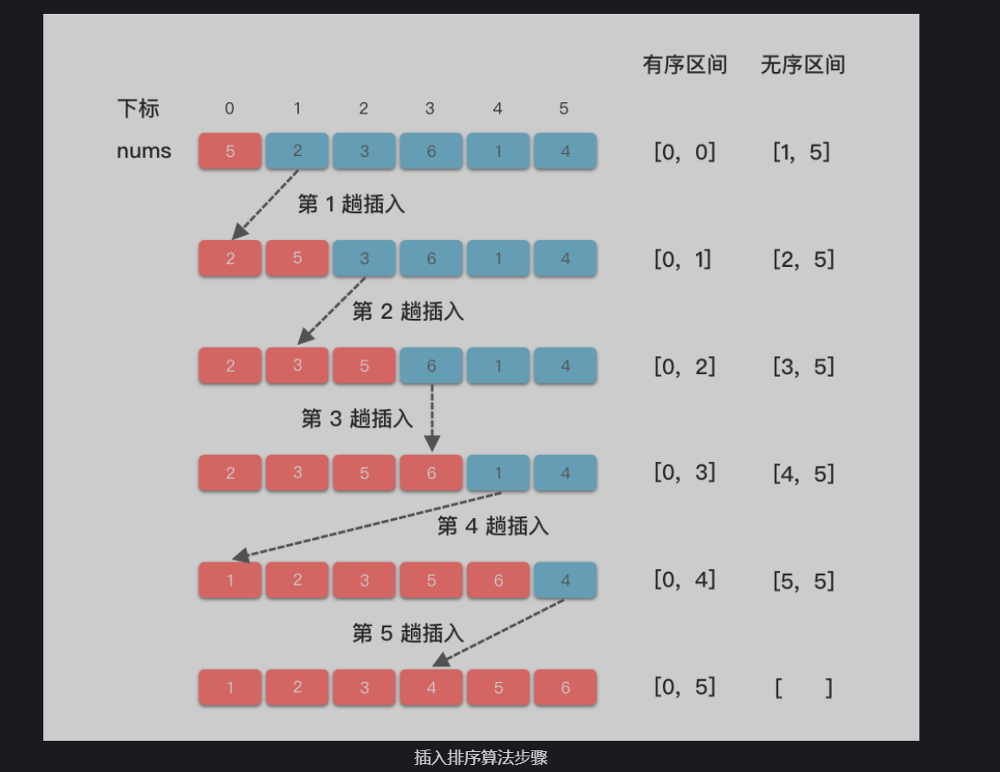

**算法分析：**

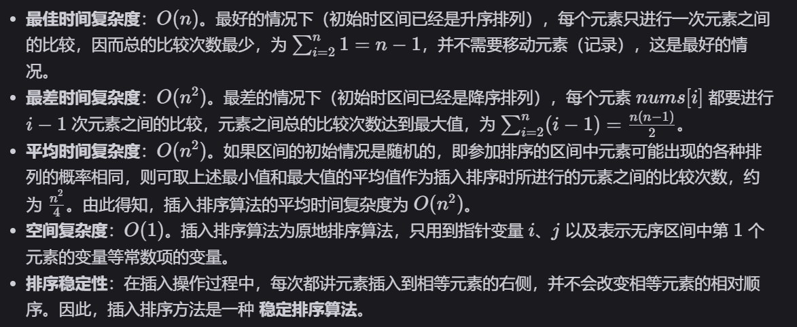

**优势：**

>**在数据量较小的情况下，插入排序通常更快**
>
>许多编程语言（例如 Java）的内置排序函数采用了插入排序，大致思路为：对于长数组，采用基于分治策略的排序算法，例如快速排序；对于短数组，直接使用插入排序
>
>**插入排序的使用频率显著高于冒泡排序和选择排序**
>
>- 冒泡排序基于元素交换实现，需要借助一个临时变量，共涉及 3 个单元操作；插入排序基于元素赋值实现，仅需 1 个单元操作。因此，**冒泡排序的计算开销通常比插入排序更高**。
>- 选择排序在任何情况下的时间复杂度都为 O(n^2) 。**如果给定一组部分有序的数据，插入排序通常比选择排序效率更高**。
>- 选择排序不稳定，无法应用于多级排序。

~~~java
   public static void main(String[] args) {
        int[] nums = {5,4,3,2,1};
        insertSort(nums);
        for (int i = 0; i < nums.length; i++) {
            System.out.print(nums[i] + " ");
        }
    }
    public static void insertSort(int[] nums) {
        // 外循环：已排序区间为 [0, i-1]
       for(int i = 1; i < nums.length; i++){
           int base = nums[i];
           int idx = i - 1;
           // 内循环：将 base 插入到已排序区间 [0, i-1] 中的正确位置
           //从右往左进行遍历
           while(idx >= 0 && nums[idx] > base){
               nums[idx + 1] = nums[idx]; // 将 nums[j] 向右移动一位
               idx--;
           }
           nums[idx + 1] = base;// 将 base 赋值到正确位置
       }
    }
~~~

#### 希尔排序

**基本思想：**

将整个数组切按照一定的间隔取值划分为若干个子数组，**每个子数组分别进行插入排序**。然后逐渐缩小间隔进行下一轮划分子数组和对子数组进行插入排序。**直至最后一轮排序间隔为 1**，对整个数组进行插入排序。

**算法步骤：**

1.确定一个元素间隔数gap

2.将参加排序的数组按此间隔数从第 1 个元素开始一次分成若干个子数组，即分别将所有位置相隔为 gap的元素视为一个子数组

3.在各个子数组中采用某种排序算法（例如插入排序算法）进行排序

4.减少间隔数，并重新将整个数组按新的间隔数分成若干个子数组，再分别对各个子数组进行排序

5.依次类推，直到间隔数 gap 值为 1，最后进行一次排序，排序结束

**算法分析：**

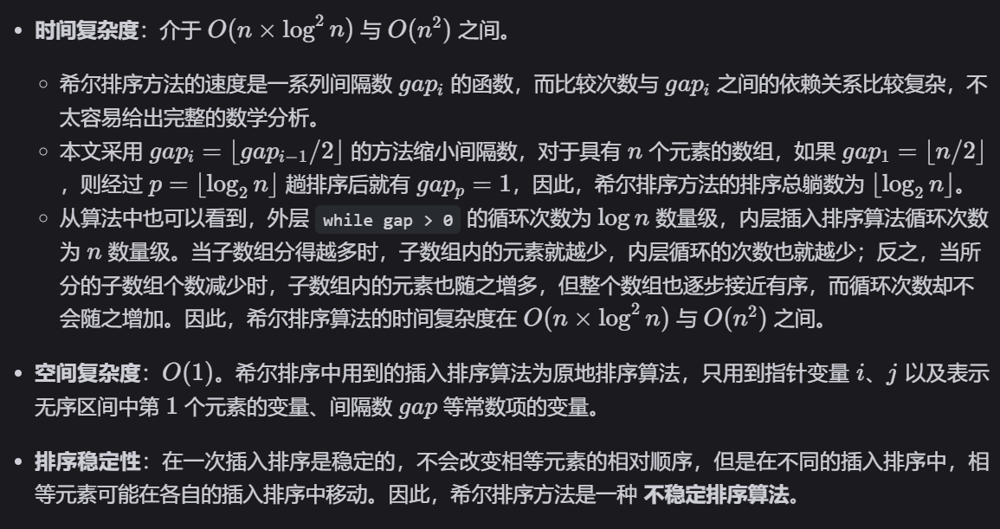

本质就是插入排序的升级版 不过出现了多一个间隔数 提高效率

~~~java
public void shellSort(int[] nums) {
        int gap = nums.length / 2;
        while(gap > 0){
            for(int i = gap; i < nums.length; i++){
                int base = nums[i];
                int idx = i - gap;
                while(idx >= 0 && nums[idx] > base){
                    nums[idx + gap] = nums[idx];
                    idx -= gap;
                }
                nums[idx + gap] = base;
            }
            gap /= 2;
        }
    }
~~~

>LeetCode 506. 相对名次
>
>~~~java
>public static String[] findRelativeRanks(int[] score) {
>        String[] answer = new String[score.length];
>        int[] scoreSort = score.clone();
>        shellSort(scoreSort);
>        for(int i = 0; i < answer.length; i++){
>            int rank = findRank(scoreSort, score[i]); //查找排名
>            switch (rank){
>                case 1:
>                    answer[i] = "Gold Medal";
>                    break;
>                case 2:
>                    answer[i] = "Silver Medal";
>                    break;
>                case 3:
>                    answer[i] = "Bronze Medal";
>                    break;
>                default:
>                    answer[i] = String.valueOf(rank);
>                    break;
>            }
>        }
>        return answer;
>    }
>
>    /**
>     * 希尔排序 必须使用降序 不然会导致不管如何排都是按顺序进行
>     * @param nums
>     * @return
>     */
>    public static void shellSort(int[] nums) {
>        int gap = nums.length / 2;
>        while(gap > 0){
>            for(int i = gap; i < nums.length; i++){
>                int base = nums[i];
>                int idx = i - gap;
>                while(idx >= 0 && nums[idx] < base){
>                    nums[idx + gap] = nums[idx];
>                    idx -= gap;
>                }
>                nums[idx + gap] = base;
>            }
>            gap /= 2;
>        }
>
>    }
>
>    /**
>     * 用来查找成绩的排名 传入的数组为排序后的数组
>     * @param nums
>     * @param target
>     * @return
>     */
>    public static int findRank(int[] nums, int target){
>        for(int i = 0; i < nums.length; i++){
>            if(nums[i] == target){
>                return i + 1;
>            }
>        }
>        return -1;
>    }
>~~~
>
>

#### 归并排序

**基本思想：**与快排一样，都是使用经典的分治策略，先递归地将当前数组平均分成两半，然后将有序数组两两合并，最终合并成一个有序数组

**算法步骤：**

1.分解过程：先递归将数组平均分成两半，直到子数组长度为1

1) 找到数组中心位置mid，从中心位置将数组分成左右两个子数组left_nums,right_nums

2)对左右两个子数组left_nums,right_nums再分别递归分解

3)最终将数组分解为n个长度均为1的有序子数组

2.归并过程：从长度为1的有序子数组开始，依次将有序数组两两合并，直到合并成一个长度为 n 的有序数组

1)使用数组变量 nums存放合并后的有序数组

2)使用两个指针left_i,right_i分别指向两个有序子数组left_nums、right_nums 的开始位置

3)比较两个指针指向的元素，将两个有序子数组中较小元素依次存入到结果数组 nums 中，并将指针移动到下一位置

4)重复步骤 3，直到某一指针到达子数组末尾

5)将另一个子数组中的剩余元素存入到结果数组 nums 中

6)返回合并后的有序数组 nums

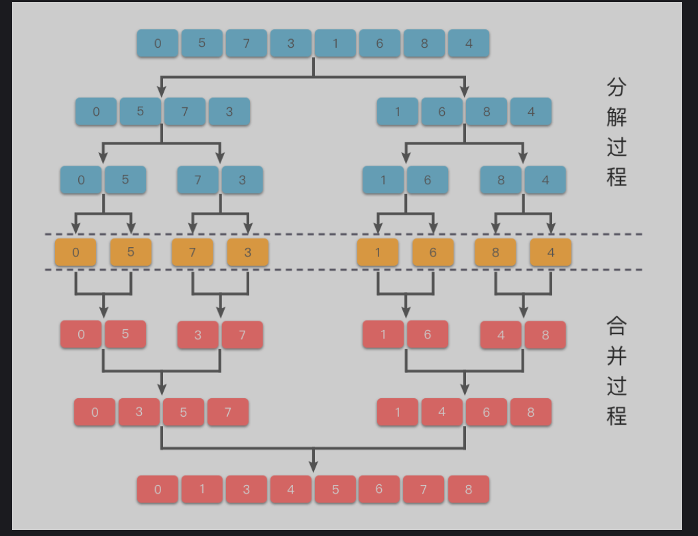

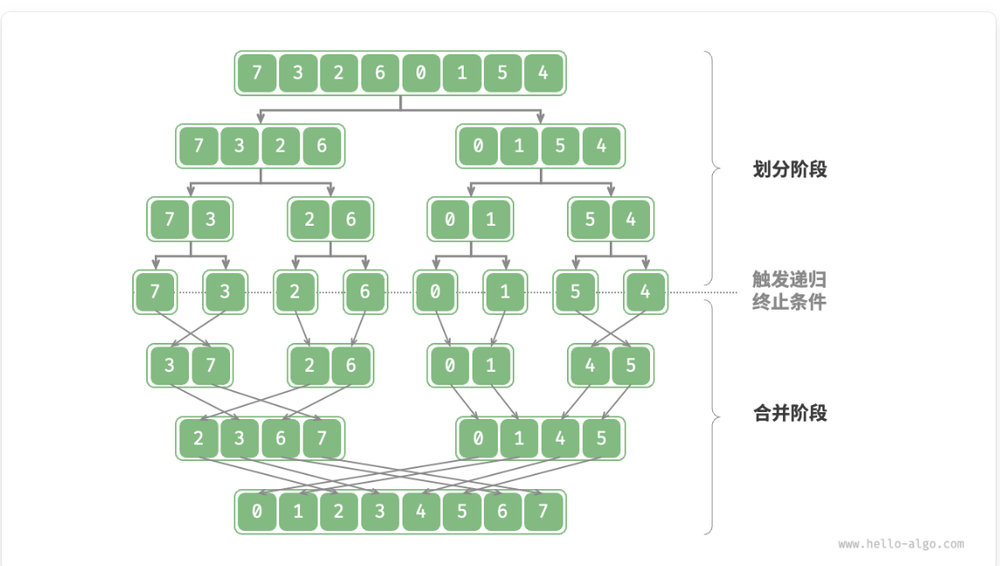

>归并与二叉树后续遍历的递归一致：
>
>后序遍历：先递归左子树，再递归右子树，最后处理根节点
>
>归并：先递归左子数组，再递归右子数组，最后合并处理

**算法分析：**

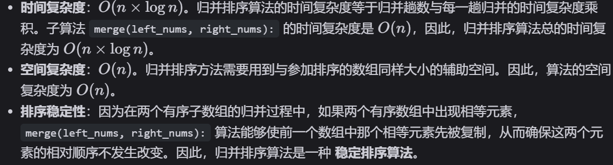

对于链表的优势：

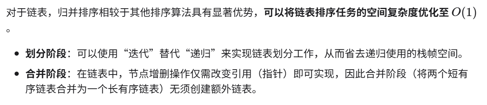

归并优势：在合并过程中相等元素的相对顺序不会改变。它适合处理大规模数据，但需要额外的存储空间是其缺点。归并排序常用于外部排序场景

~~~java
    /**
     * 用于递归子数组 平均分为两个数组 左数组范围[left,mid] 右数组范围[mid+1,right]
     * @param nums
     * @param left
     * @param right
     */
    public static void mergeSort(int[] nums, int left, int right) {
        if(left >= right){
            return;
        }
        int mid = left + (right - left) / 2; //计算中点
        mergeSort(nums, left, mid); // 递归排序左子数组
        mergeSort(nums, mid + 1, right); /// 递归排序右子数组
        merge(nums, left, mid, right); // 合并两个有序数组
    }

    /**
     * 合并两个有序数组 归并排序的核心逻辑
     * @param nums
     * @param left
     * @param mid
     * @param right
     */
    public static void merge(int[] nums, int left, int mid, int right) {
        //创建临时数组存储合并的数组
        int[] temp = new int[right - left + 1];
        // 初始化左子数组和右子数组的起始索引
        int i = left, j = mid + 1, k = 0;
        // 当左右子数组都还有元素时，进行比较并将较小的元素复制到临时数组中
        while (i <= mid && j <= right) {
            if (nums[i] <= nums[j])
                temp[k++] = nums[i++];
            else
                temp[k++] = nums[j++];
        }
        // 将左子数组和右子数组的剩余元素复制到临时数组中
        while (i <= mid) {
            temp[k++] = nums[i++];
        }
        while (j <= right) {
            temp[k++] = nums[j++];
        }
        // 将临时数组 tmp 中的元素复制回原数组 nums 的对应区间
        for (k = 0; k < temp.length; k++) {
            nums[left + k] = temp[k];
        }
    }
~~~

>LeetCode 88. 合并两个有序数组    LCR 170.交易逆序对的总数   315.计算右侧小于当前元素的个数

#### 堆排序

##### 堆结构

**定义：**一种满足以下两个条件之一的完全二叉树

1.大顶堆(Max Heap):任意节点值 >= 其节点值

2.小顶堆(Min Heap):任意节点值 <= 其节点值

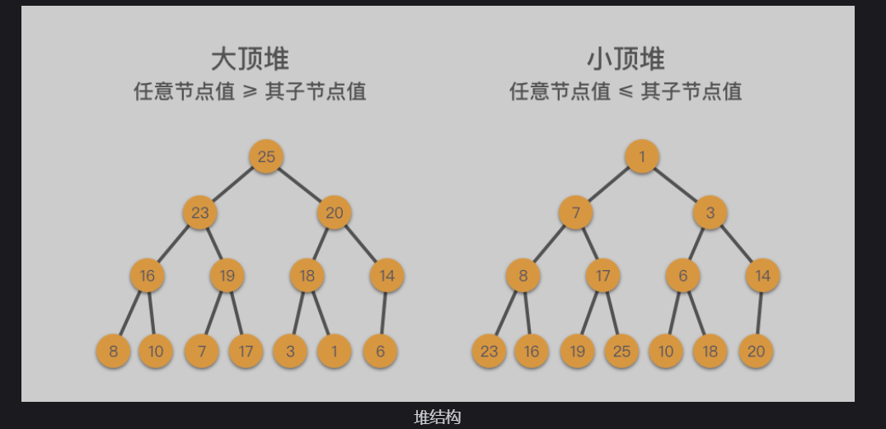

**存储结构：**

堆的逻辑结构就是一颗完全二叉树

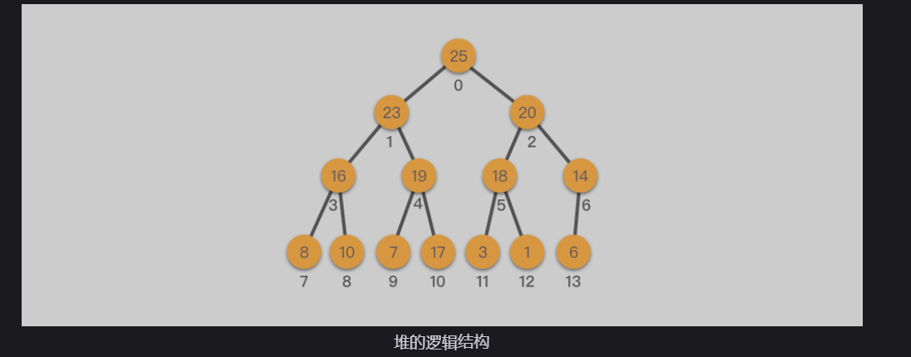

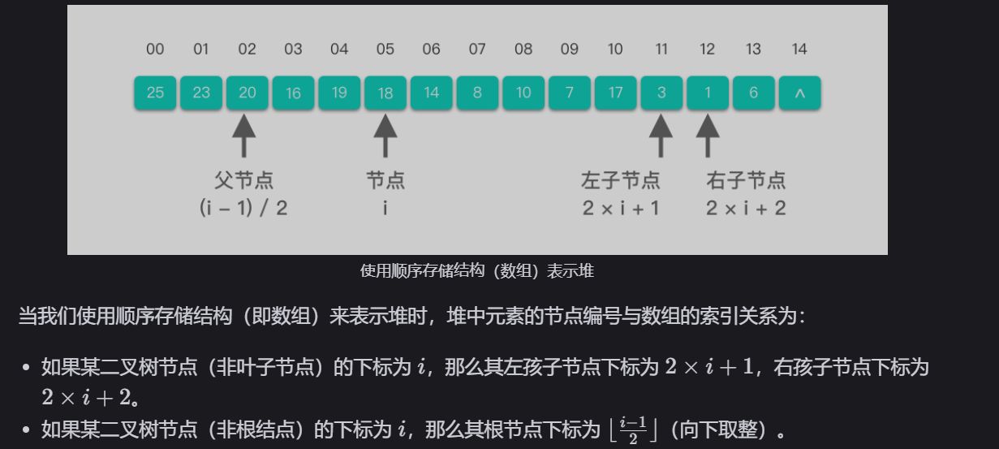

**堆通常用于实现优先队列，大顶堆相当于元素按从大到小的顺序出队的优先队列**

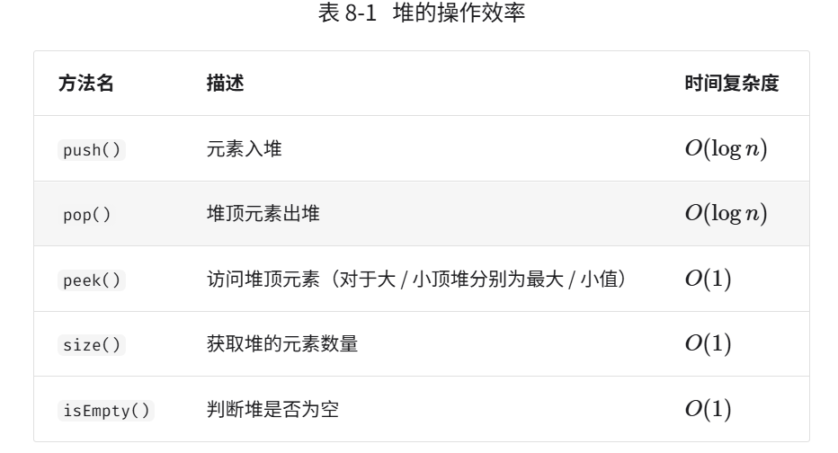

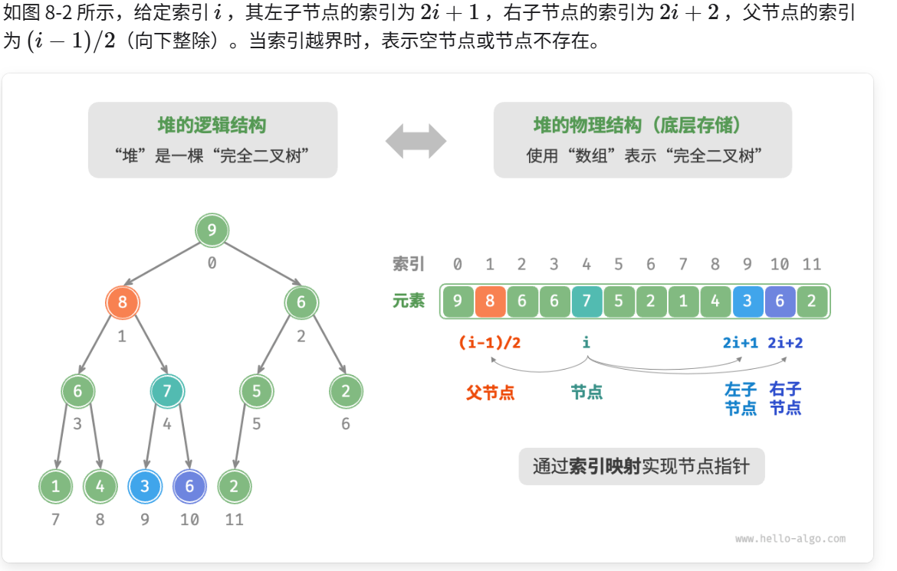

**元素入堆：**

给定元素 `val` ，我们首先将其添加到堆底。添加之后，由于 `val` 可能大于堆中其他元素，堆的成立条件可能已被破坏，**因此需要修复从插入节点到根节点的路径上的各个节点**，这个操作被称为堆化   

**从底至顶执行堆化**

设节点总数为n  ，则树的高度为O(logn)  。由此可知，堆化操作的循环轮数最多为O(logn)  ，**元素入堆操作的时间复杂度为** O(logn)

~~~java
/* 元素入堆 */
    void push(int val) {
        // 添加节点
        maxHeap.add(val);
        // 从底至顶堆化
        siftUp(maxHeap.size() - 1);
    }

    /* 从节点 i 开始，从底至顶堆化 */
    void siftUp(int i) {
        while (true) {
            // 获取节点 i 的父节点
            int p = parent(i);
            // 当“越过根节点”或“节点无须修复”时，结束堆化
            if (p < 0 || maxHeap.get(i) <= maxHeap.get(p))
                break;
            // 交换两节点
            swap(i, p);
            // 循环向上堆化
            i = p;
        }
    }

    void swap(int i, int p){
        int temp = maxHeap.get(i);
        maxHeap.set(i, maxHeap.get(p));
        maxHeap.set(p, temp);
    }
~~~


**栈顶元素出堆：**

堆顶元素是二叉树的根节点，即列表首元素。如果我们直接从列表中删除首元素，那么二叉树中所有节点的索引都会发生变化，这将使得后续使用堆化进行修复变得困难

1.交换堆顶元素与堆底元素(交换根节点与最右叶节点)

2.交换完成后，将堆底从列表中删除，此时删除的就是堆顶元素

3.从根节点开始，**从顶至底执行堆化**

~~~java
   //元素出堆
    int pop(){
        if(maxHeap.isEmpty()){
            throw new IndexOutOfBoundsException("堆为空");
        }
        //将根节点与最右叶节点交换
        swap(0, maxHeap.size() - 1);
        int val = maxHeap.remove(maxHeap.size() - 1);
        //从顶至底堆化
        siftDown(0);
        return val;
    }

    void siftDown(int i){
        while (true){
            //获取左右节点索引
            //将这三个节点分别比较出最大值
            int l = left(i);
            int r = right(i);
            int max = i;
            if(l < maxHeap.size() && maxHeap.get(l) > maxHeap.get(max)){
                max = l;
            }
            if(r < maxHeap.size() && maxHeap.get(r) > maxHeap.get(max)){
                max = r;
            }
            //若节点 i 最大或索引 l, r 越界，则无须继续堆化，跳出
            if(max == i){
                break;
            }
            //交换节点 i 和 max
            swap(i, max);
            //循环向底堆化
            i = max;
        }
    }
~~~

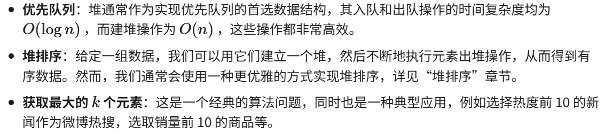

**建堆操作：**

1.借助入堆操作执行

我们首先创建一个空堆，然后遍历列表，依次对每个元素执行“入堆操作”，即先将元素添加至堆的尾部，再对该元素执行“从底至顶”堆化

每当一个元素入堆，堆的长度就加一。由于节点是从顶到底依次被添加进二叉树的，因此堆是“自上而下”构建的

每个元素的入堆操作为O(logn) 所以总的入堆时间复杂为O(logn)

2.遍历堆化实现

1)将列表所有元素原封不动添加到堆中，但此时并没有满足堆的性质

2)倒序遍历堆(层序遍历的倒序)，依次对每个非叶节点执行“从顶至底堆化”

**每当堆化一个节点后，以该节点为根节点的子树就形成一个合法的子堆**。而由于是倒序遍历，因此堆是“自下而上”构建的。**由于叶节点没有子节点，因此它们天然就是合法的子堆，无须堆化**

之所以选择倒序遍历，是因为这样能够保证当前节点之下的子树已经是合法的子堆，这样堆化当前节点才是有效的。

~~~java
public MyMaxHeap(List<Integer> list){
        maxHeap = new ArrayList<>(list);
        for(int i = parent(list.size() - 1); i >= 0; i--){
            siftDown(i);
        }
     }
~~~

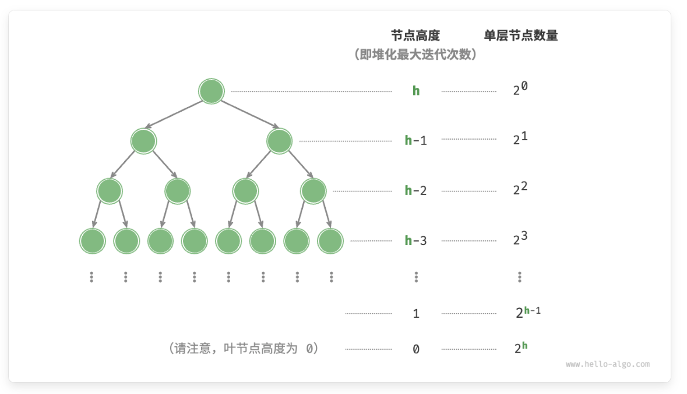

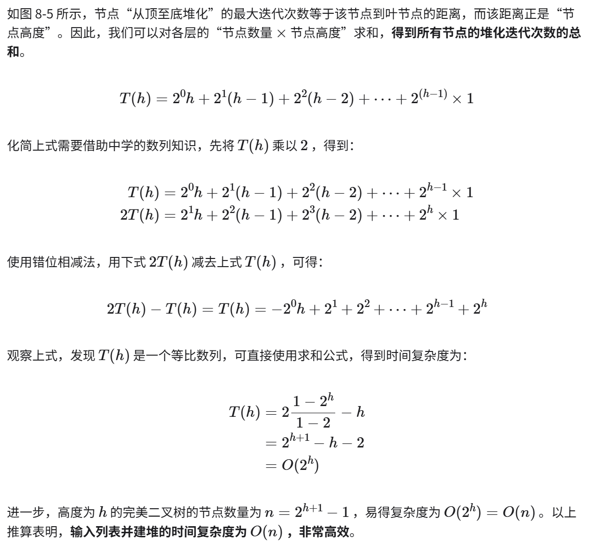

##### 排序算法

**基本思想：**借用「堆结构」所设计的排序算法。将数组转化为大顶堆，重复从大顶堆中取出数值最大的节点，并让剩余的堆结构继续维持大顶堆性质

**算法步骤：**

1.构建初始大顶堆

1)定义一个数组实现的堆结构，将原始数组的元素依次存入堆结构的数组中（初始顺序不变

2)从数组的中间位置开始，从右至左，依次通过「下移调整」将数组转换为一个大顶堆

2.交换元素，调整堆

1)交换堆顶元素（第 1个元素）与末尾（最后 1 个元素）的位置，交换完成后，堆的长度减 1

2)交换元素之后，由于堆顶元素发生了改变，需要从根节点开始，对当前堆进行「下移调整」，使其保持堆的特性

**算法分析：**

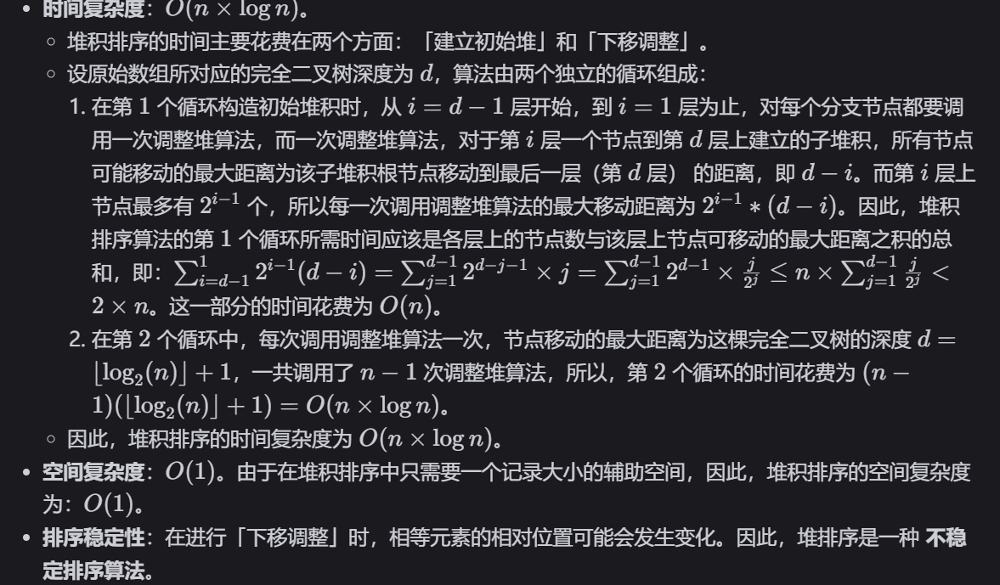

~~~java
void siftDown(int[] nums,int n,int i){
        while(true){
           int l = 2 * i + 1;
           int r = 2 * i + 2;
           int max = i;
           if(l < n && nums[l] > nums[max]){
               max = l;
           }
           if(r < n && nums[r] > nums[max]){
               max = r;
           }
           if(max == i){
               break;
           }
           int temp = nums[i];
           nums[i] = nums[max];
           nums[max] = temp;
           i = max;
        }
    }

    void heapSort(int[] nums){
         for(int i = nums.length / 2 - 1; i >= 0; i--){
             siftDown(nums,nums.length,i);
         }
         for(int i = nums.length - 1; i > 0; i--){
             int temp = nums[i];
             nums[i] = nums[0];
             nums[0] = temp;
             siftDown(nums,i,0);
         }
    }
~~~

### 计数排序

**基本简介：**通过统计数组中每个元素在数组中出现的次数，根据这些统计信息将数组元素有序的放置到正确位置，从而达到排序的目的

**算法步骤：**

1.**计算排序范围：**遍历数组，找出待排序序列中最大值元素max和最小元素min，计算出排序范围为max-min+1

2.**定义计数数组：**定义一个大小为排序范围的计数数组counts，用于统计每个元素的出现次数。

1)数组的索引为num-min表示元素的值为num

2)数组的值counts[num-min]表示元素num出现的次数

3.**对数组元素进行计数统计：**遍历待排序数组nums，对每个元素在计数数组中进行计数，即将待排序数组中「每个元素值减去最小值」作为索引，将「对计数数组中的值」加 1，即令 counts[num-min] 加 1

4.**生成累积计数数组：**从 counts 中的第 1 个元素开始，每一项累加前一项和(前缀和)。此时 counts[num-min]表示值为 num 的元素在排序数组中最后一次出现的位置

5.**逆序填充目标数组：**逆序遍历数组 nums，将每个元素 num 填入正确位置

6.将其填充到结果数组 res 的索引 counts[num-min]处

7.放入后，令累积计数数组中对应索引减 1，从而得到下个元素 num 的放置位置

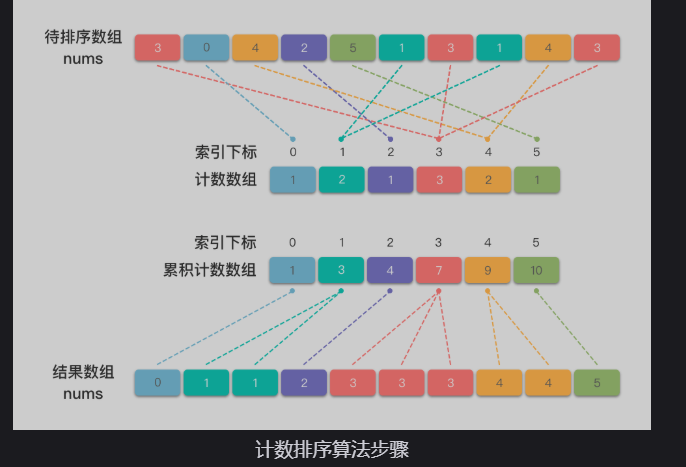

**算法分析：**

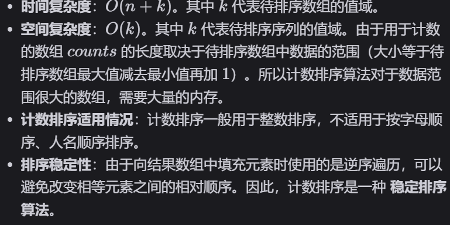

>计数排序适合**整数排序**，不适合字符串等复杂数据。它是**稳定**的排序算法，能保持相等元素的原始顺序。在实际应用中，计数排序常用于数据范围不大的整数排序场景
>
>对于负数的解决方案：可以先给所有数字加上一个常数，将全部数字转化为正数，排序完成后再转换回去

~~~java
 public void countSort(int[] arr) {
        if(arr == null || arr.length < 2){
            return;
        }
        int max = 0;
        int min = 0;
        for (int i : arr) {
            max = Math.max(max, i);
            min = Math.min(min, i);
        }
        //创建一个counts数组，长度为max-min+1 累计数组，记录每个数字出现的次数
        int[] counts = new int[max - min + 1];
        for (int i : arr) {
            counts[i - min]++; //统计每个数字出现的次数
        }
        //生成累积计数数组，通过前缀和计算
        for(int i = 1; i < counts.length; i++){
            counts[i] += counts[i - 1];
        }
        int[] res = new int[arr.length];
        for(int i = arr.length - 1; i >= 0; i--){
            int temp = arr[i];
            res[counts[temp - min] - 1] = temp;
            counts[temp]--;
        }
        for(int i = 0; i < arr.length; i++){
            arr[i] = res[i];
        }
    }
~~~

### 桶排序

**基本思想：**将待排序数组中的元素分散到若干个「桶」中，然后对每个桶中的元素再进行单独排序

**算法步骤：**

1.确定桶的数量：根据待排序数组的值域范围，将数组分为k个桶，每个桶作为一个范围区间

2.分配元素：遍历待排序数组元素，将每个元素根据大小分配到对应的桶中

3.对每个进行排序：对每个非空桶内的元素单独排序（使用插入排序、归并排序、快排排序等算法）

4.合并桶内元素：将排好序的各个桶中的元素按照区间顺序依次合并起来，形成一个完整的有序数组

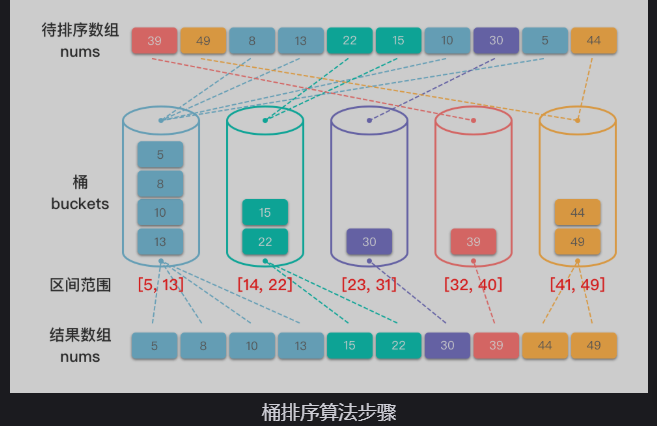

**分析：**

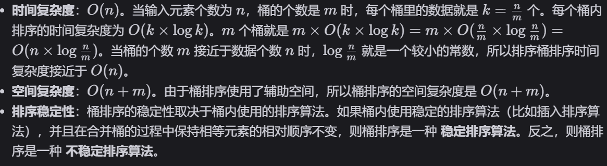

**桶实现平均分配：**

桶排序的关键在于**将元素均匀分配到各个桶中** 为实现平均分配，我们可以先设定一条大致的分界线，将数据粗略地分到 3 个桶中。**分配完毕后，再将商品较多的桶继续划分为 3 个桶，直至所有桶中的元素数量大致相等**

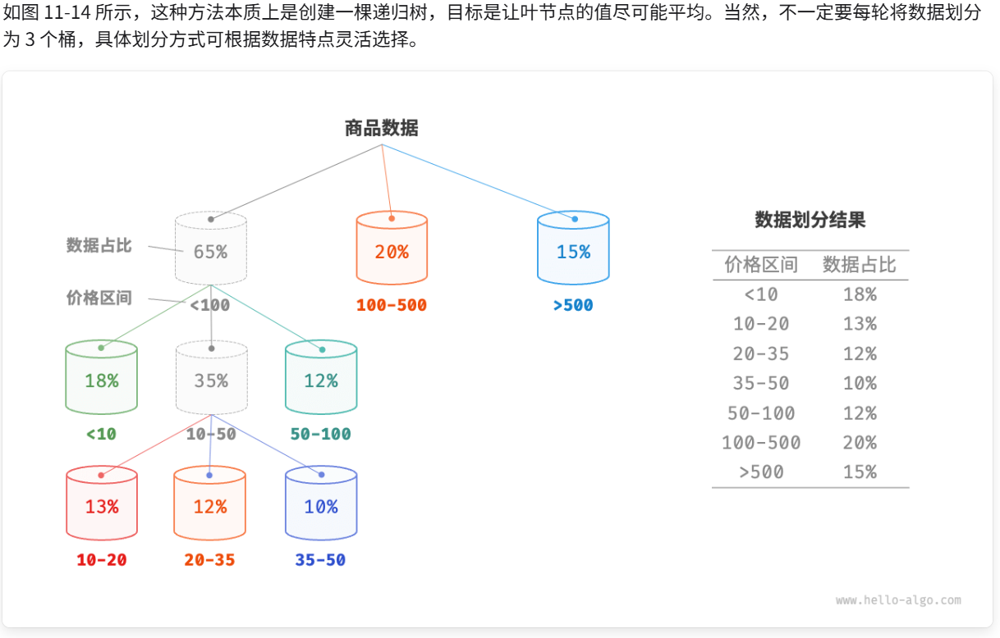

即递归树

如果知道概率分布，则可以通过数据概率分布设置桶的价格分界线 这样效果更好

~~~  java
  public void bucketSort(int[] nums) {
        //获取桶的数量
        int max = 0;
        int min = 0;
        for (int num : nums) {
            max = Math.max(max, num);
            min = Math.min(min, num);
        }
        int bucketNum = (max - min) / nums.length + 1;
        //创建桶
        List<List<Integer>> buckets = new ArrayList<>();
        for (int i = 0; i < bucketNum; i++) {
            //桶中存储数据
            buckets.add(new ArrayList<>());
        }
        for (int num : nums) {
            //获取桶的索引
            int index = (num - min) / nums.length;
            //向每个相对应范围的桶中添加数据
            buckets.get(index).add(num);
        }
        for (List<Integer> bucket : buckets) {
            //使用内置函数对每个桶进行排序 也可以用使用其他排序进行排序
            Collections.sort(bucket);
        }
        //合并桶
        int index = 0;
        for (List<Integer> bucket : buckets) {
            for (Integer num : bucket) {
                nums[index++] = num;
            }
        }
    }
~~~

### 基数排序

基本思想：

将整数按位数切割成不同的数字，然后从低位开始，依次到高位，逐位进行排序，从而达到排序的目的

算法步骤：

一般分为两种方法进行排序：1.最低位优先法(Least Significant Digit First) 2.最高位优先法(Most Significant Digit First) 常用的是最低位优先法

最低位优先法：

1.**确定排序的最大位数**：遍历数组元素，获取数组最大值元素，并取得对应位数

2.**从最低位（个位）开始，到最高位为止，逐位对每一位进行排序**：

1）定义一个长度为 10 的桶数组 buckets，每个桶分别代表 0∼9 中的 1 个数字

2）按照每个元素当前位上的数字，将元素放入对应数字的桶中

3）清空原始数组，然后按照桶的顺序依次取出对应元素，重新加入到原始数组中

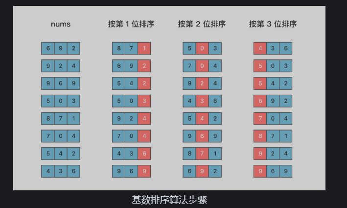

对于求该数的第k位可以通过公式进行计算

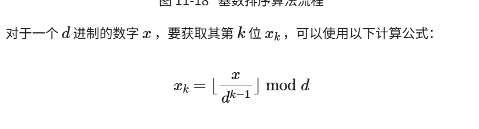

其中 [a] 表示对浮点数 a 向下取整，而 mod d 表示对 d 取模（取余）

比如10进制123 要它的第1位数字 即3   123/10^1-1 = 123 / 1 = 123

123 % 10 = 3

算法分析：

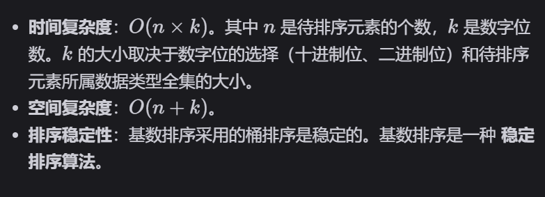

>注：当计数排序稳定时，基数排序也稳定；当计数排序不稳定时，基数排序无法保证得到正确的排序结果
>
>实际应用：常用于电话号码、身份证号等固定位数数据的排序

~~~java
/* 获取元素 num 的第 k 位，其中 exp = 10^(k-1) */
int digit(int num, int exp) {
    // 传入 exp 而非 k 可以避免在此重复执行昂贵的次方计算
    return (num / exp) % 10;
}

/* 计数排序（根据 nums 第 k 位排序） */
void countingSortDigit(int[] nums, int exp) {
    // 十进制的位范围为 0~9 ，因此需要长度为 10 的桶数组
    int[] counter = new int[10];
    int n = nums.length;
    // 统计 0~9 各数字的出现次数
    for (int i = 0; i < n; i++) {
        int d = digit(nums[i], exp); // 获取 nums[i] 第 k 位，记为 d
        counter[d]++;                // 统计数字 d 的出现次数
    }
    // 求前缀和，将“出现个数”转换为“数组索引”
    for (int i = 1; i < 10; i++) {
        counter[i] += counter[i - 1];
    }
    // 倒序遍历，根据桶内统计结果，将各元素填入 res
    int[] res = new int[n];
    for (int i = n - 1; i >= 0; i--) {
        int d = digit(nums[i], exp);
        int j = counter[d] - 1; // 获取 d 在数组中的索引 j
        res[j] = nums[i];       // 将当前元素填入索引 j
        counter[d]--;           // 将 d 的数量减 1
    }
    // 使用结果覆盖原数组 nums
    for (int i = 0; i < n; i++)
        nums[i] = res[i];
}

/* 基数排序 */
void radixSort(int[] nums) {
    // 获取数组的最大元素，用于判断最大位数
    int m = Integer.MIN_VALUE;
    for (int num : nums)
        if (num > m)
            m = num;
    // 按照从低位到高位的顺序遍历
    for (int exp = 1; exp <= m; exp *= 10) {
        // 对数组元素的第 k 位执行计数排序
        // k = 1 -> exp = 1
        // k = 2 -> exp = 10
        // 即 exp = 10^(k-1)
        countingSortDigit(nums, exp);
    }
~~~

### 二分查找

**二分查找算法（Binary Search Algorithm）**，又称折半查找或对数查找，是一种在有序数组中高效定位目标元素的方法。其核心思想是每次将查找区间缩小一半，从而快速锁定目标位置

**算法步骤：**

1.**初始化：**确定待查找的有序数据集合（如数组或列表），并确保元素已按升序或降序排列

2.**设置查找区间：**定义查找的左右边界，初始时 leftleft 指向数组起始位置，rightright 指向数组末尾位置

3.**计算中间下标：**通过mid=[(left+right)/2]计算当前查找区间的中间下标 midmid

4.**比较并缩小区间：**将目标值target与nums[mid]比较：

 1)若target==nums[mid]，则找到目标，返回mid

2)若target<nums[mid]，目标在左半区间，更新右边right=mid-1

3)若target>nums[mid]，目标在右半区间，更新左边left=mid+1

5.**重复步骤3~4**，直到找到目标元素(返回mid)，或查找区间为空(left>right)，此时返回-1，

表示目标不存在

我们以在有序数组[0,1,2,3,4,5,6,7,8,9,10]中查找目标元素 6 为例，二分查找的具体过程如下：

1.**设置查找区间：**左边界left=0(数组起始位置)，右边界right=10(数组未尾位置)，查找区间为

[0,10]

2.**第一次取中间元素：**mid=(0+10)/2=5，nums[5]=5

3.**比较目标值与中间元素**：6>5，目标值在右边区间，更新左边界 left=6，查找区间变为 [6,10]

4.**第二次取中间元素：**mid=(6+10)/2=8，nums[8]=8

5.**再次比较：**6<8，目标值在左边区间，更新右边界right=7，查找区间变为[6,7]

6.**第三次取中间元素：**mid=(6+7)/2=6，nums[6]=6

7.**找到目标值：**6==6，查找成功，返回下标，算法结束

可以看到，对于一个长度为10的有序数组，使用二分查找仅需3次比较就能定位目标元素；而若采用顺序遍历，最坏情况下则需要10次比较才能找到目标

**算法思想：**

二分查找算法体现了经典的 **「减而治之」** 思想

所谓 **「减」**，就是每一步都通过条件判断，排除掉一部分一定不包含目标元素的区间，从而缩小问题规模；**「治」**，则是在缩小后的区间内继续解决剩下的子问题。也就是说，二分查找的核心在于：**每次查找都排除掉不可能存在目标的区间，仅在可能存在目标的区间内继续查找**

通过不断缩小查找区间，问题规模逐步减小。由于区间有限，经过有限次迭代，最终要么找到目标元素，要么确定目标不存在于数组中

**时间复杂度为O(log n)**  ：在二分循环中，区间每轮缩小一半，因此循环次数为 log2 n 。

**空间复杂度为** O(1) ：指针i  和 j 使用常数大小空间。

**注意：**由于i和j都是int类型，因此i+j可能会超出int类型的取值范围 为了避免大数越界，可以采用公式mid=[i+(j-i)/2]

在二分查找中又分为两种情况

闭区间、开区间

闭区间：[i,j]

开区间：[i,j) 这个的时候i=j时为空 左边界包含自身，右边界不包含自身

**二分的核心要点：**

**二分查找** 是一种在 **有序数组** 中高效查找目标元素的算法，其核心思想是 **每次将查找区间缩小一半**，从而快速定位目标位置

**算法特点：**

**时间复杂度：**O(log n)，比线性查找O(n)更高效

**空间复杂度：**O(1)，只需要常数级别的额外空间

**适用条件：**数据必须是有序的(升序或降序)

**核心思想：**减而治之，每次排除一半不可能的区域

**实现要点：**

1.**区间定义：**使用左闭右闭区间[left,right]

2.**中间计算：**mid = (left + right) / 2   或mid = left + (right - left) / 2 (防止溢出)

3.**边界更新：**

1)目标在右半区间：left = mid + 1

2)目标在左半区间：right = mid + 1

4.**终止条件：**left > right时查找失败

**应用场景：**

在有序数组中查找特定元素

查找插入位置

寻找边界值

数值范围查询

**闭区间：**

~~~java
/**
 * @author 自然醒
 * @version 1.0
 */

// 二分查找-闭区间
public class BinarySearch_CloseInterval {
    int binarySearch(int[] arr,int target){
        int left = 0;
        int right = arr.length - 1;
        while(left <= right){
            int mid = left + (right - left) / 2; // 计算中点常用的公式 主要为了防止大数越界 超出int类型范围   其实也可以用mid = (left + right) / 2;
            if(arr[mid] == target){
                return mid;
            }else if(arr[mid] > target){
                right = mid - 1;
            }else{
                left = mid + 1;
            }
        }
        return -1;
    }
}
~~~

**开区间：**

~~~java
/**
 * @author 自然醒
 * @version 1.0
 */

// 二分查找-开放区间
public class BinarySearch_OpenInterval {
    int binarySearch(int[] arr,int target){
        int left = 0;
        int right = arr.length;
        while(left < right){
            int mid = left + (right - left) / 2;
            if(arr[mid] < target){
                left = mid + 1; // target在[mid + 1,right)之间
            } else if (arr[mid] > target) {
                right = mid; // target在[left,mid)之间
            }else{
                return mid;
            }
        }
        return -1;
    }
}
~~~


**优点与局限性：**

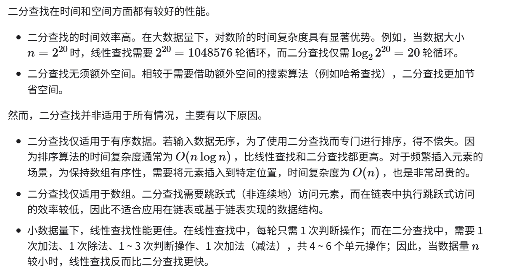

### 梅森素数法

求完数算法优化的一个方法 除此还可以使用个数优化即sqrt

```
欧几里得-欧拉定理：
将完数与梅森数联系起来
欧几里得表示：素数为2^p - 1
欧拉则表示：如果素数2^p - 1存在则2^(p-1) * 2^p - 1是一个偶完全数


* 根据欧几里得-欧拉定理
* 偶完数可以表示为2^(p-1) * (2^p - 1)
* 其中梅森素数为2^p - 1
* 奇完数可以表示为2^p - 1
```

找到一个素数p

计算梅森数M=2^p - 1

如果M也是素数(梅森数)

那么N = 2^(p-1) *M就是一个完数

算法步骤：

1.生成素数列表：生成一系列可能得素数

2.计算梅森数：对于每个素数p，计算M=2^p-1

3.检查梅森素数：验证M是否为素数

4.生成完数：如果M是素数，则计算完数N即可

5.检查范围：确保生成的完数不超过指定的上限

~~~java

  /**
     * 使用梅森素数法判断是否是完数
     * @param num
     * @return
     */
    public static boolean isPerfectNum(int num) {
        List<Integer> list = new ArrayList<>(); //用于存储素数的集合
        for(int i = 1; i < num; i++){
            if(isPrime(i)){
                list.add(i);
            }
        }
        for (Integer i : list) {
            int res = (1 << i) -1;
            if(res > num){
                break;
            }
            if(lucasLehmerTest(res)){
                int perfectNum = (1 << (i - 1)) * res;
                if(perfectNum == num){
                    return true;
                }
                if(perfectNum > num){
                    break;
                }
            }
        }
        return false;
    }
~~~


优点：

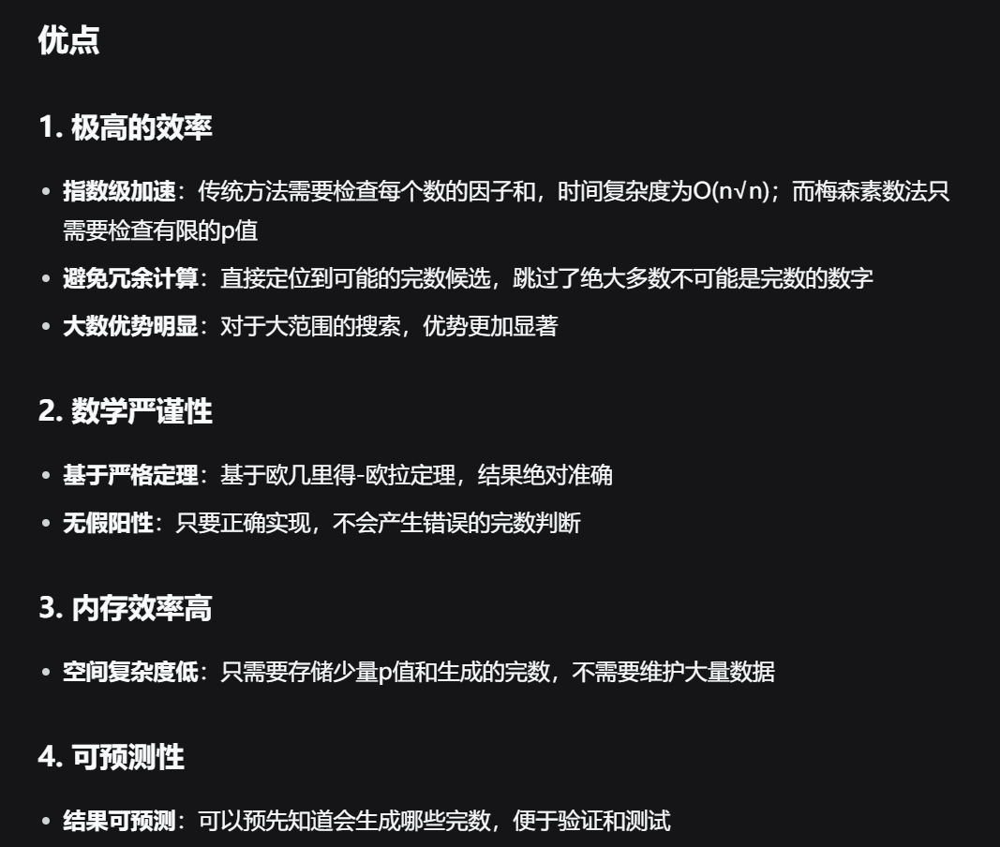

缺点：

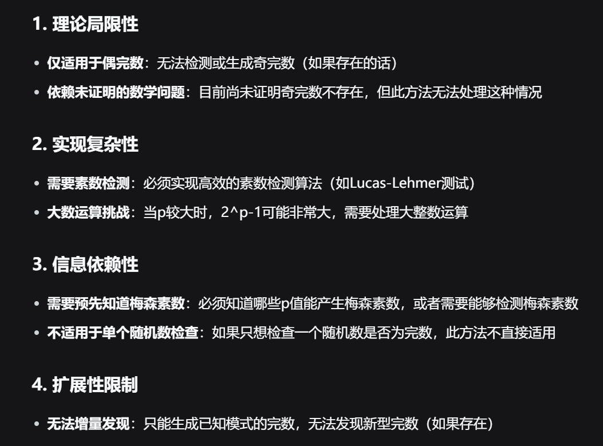

对比：

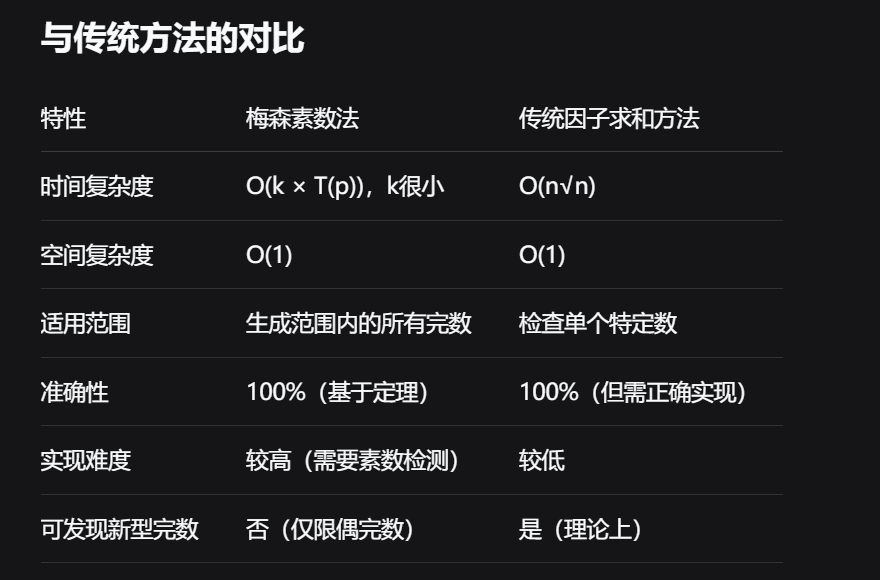

注意：如今没有发现奇完数，所以一般只考虑偶完数

**Lucas-Lehmer测试**：

一种专门用于检测梅森数（形如 Mₚ = 2ᵖ - 1 的数，其中 p 是素数）是否为素数的算法。

测试原理：

对于给定的奇素数p，定义序列{sn}如下：

1.s0=4

2.sn=(sn-1)^2 mod Mp n>=1

如此梅森数Mp=2^p-1是素数当且仅当sp-2=0(mod Mp)

Lucas-Lehmer 测试基于循环序列理论和有限域的性质。其核心思想是检查特定序列在模 Mₚ 下的行为，这种行为与 Mₚ 的素性密切相关。

测试的有效性依赖于以下数学事实：

1. 如果 Mₚ 是素数，则它整除 sₚ₋₂
2. 如果 Mₚ 是合数，则它不整除 sₚ₋₂

算法步骤：

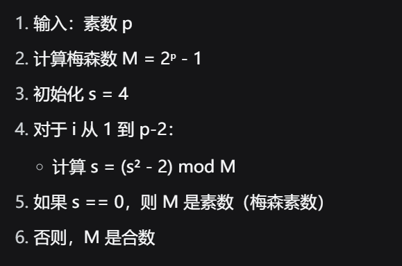

算法分析：

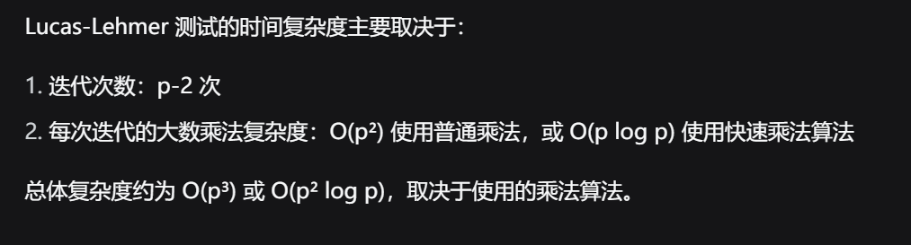

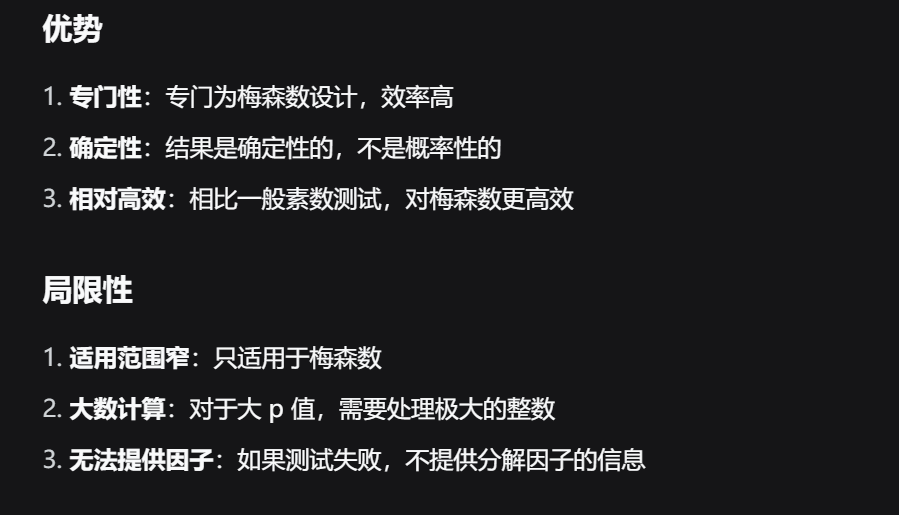

~~~java
 /**
     * lucas_lehmer测试 主要用于对梅森数是否为素数的检测
     * @param p
     * @return 如果2^p-1是素数返回true，否则返回false
     */
    public static boolean lucasLehmerTest(int p){
        if(p == 2){
            return true;
        }
        int m = (1 << p) - 1;
        long s0 = 4;
        for(int i = 0; i < p-2; i++){
            s0 =  (s0 * s0 - 2) % m;
        }
        return s0 == 0;

    }
~~~

