# 测试工程

## 测试定义

软件测试：

检查软件是否按预期运行的过程（登录、视频通话等）

作用：

1.保证质量 2.降低成本 3.提升体验

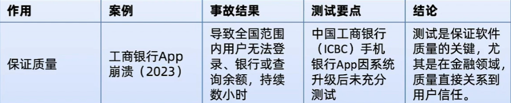

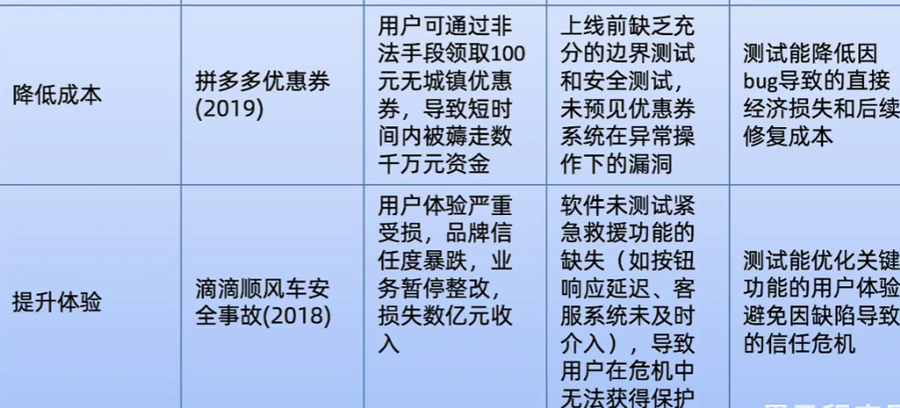

测试模型：

确保软件在**功能**、**性能**、**安全性**、**兼容性**、**易用性**、可维护性、可迁移性、可靠性是否达到预期

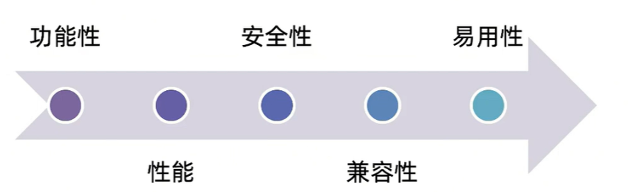

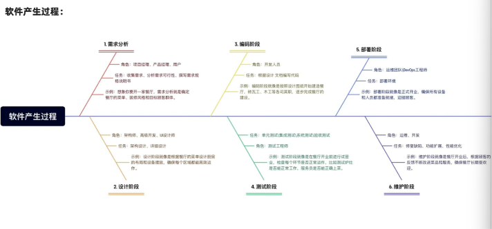

测试流程：

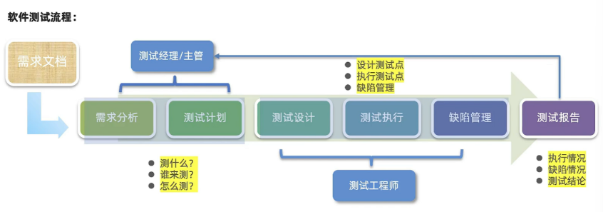

## AI工具应用

使用AI可以让手工测试领域可用于**需求分析与评审**、**测试计划编写**、测试设计、缺陷分析及描述、测试报告等

百度私有部署(deepseek) https://chat.baidu.com

使用结构化表达沟通

结构化公式：角色+任务+背景+要求

**测试计划：**

用于规划和组织测试活动的文档，确保测试目标有效达成。明确测试范围、方法、资源安排及风险应对策略

**核心内容：**

- 测试目标与范围
- 人员进度安排
- 测试方案
- 准入/准出标准：交付给测试的前提标准/测试通过的标准
- 风险控制


**设计测试：**

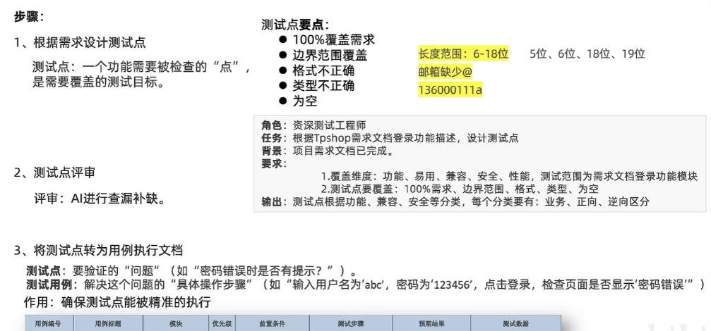

执行顺序：

1.根据优先级执行，一般先执行优先级高的用例

2.记录执行结果：通过、不通过（原因、结果截图）

**缺陷：** 任何软件存在的问题都是bug

**衡量标准：**

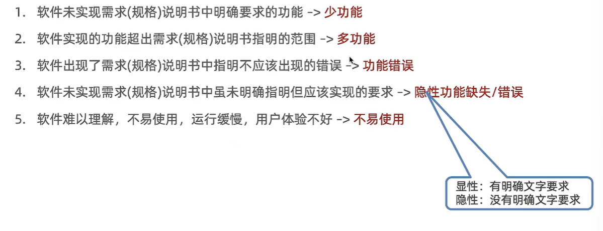

**缺陷描述：**

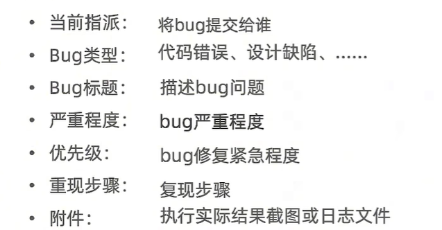

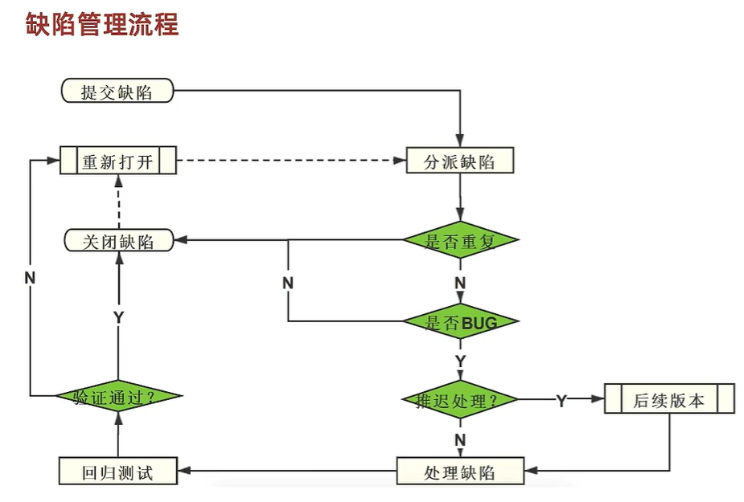

工具：禅道、jira

**测试报告：** 测试工作的总结，记录测试过程、结果和结论


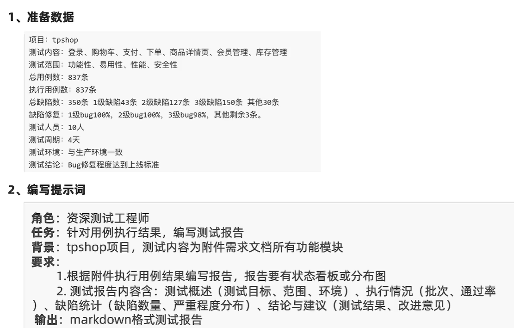

## 自动化测试

通过工具或脚本自动执行测试用例，验证软件功能的过程

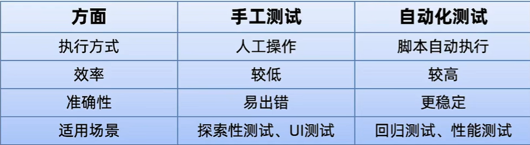

探索性测试：依赖已有的测试经验

UI测试：User Interface（页面）布局、颜色、功能

回归测试：软件更新后重新对已测功能进行复测

自动化API：Selenium

Selenium：用于web测试，完成对web应用程序的自动化测试

使用流程

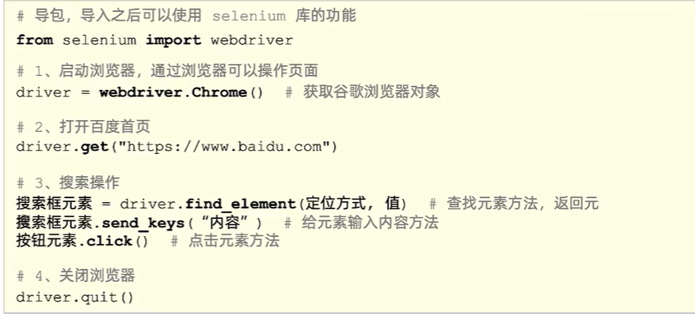

```
from selenium import webdriver
from time import sleep

#启动浏览器 获取浏览器对象
edgeDriver = webdriver.Edge()
#打开首页
edgeDriver.get("https://www.baidu.com")
sleep(2)
#搜索操作
search_input = edgeDriver.find_element("id", "kw")#通过id定位搜索框 百度的搜索框为kw
search_input.send_keys("北京烤鸭")
sleep(1)
#搜索点击按钮
search_button = edgeDriver.find_element("id","su")#百度按钮为su
search_button.click()
sleep(2)
#退出浏览器
edgeDriver.quit()
```

自动化测试中主要需要找到元素点 driver.find_element(定位方式,"值")

selenium中的By工具提供8种定位元素

id、xpath、class_name、tag_name、css_selector、partial_link_text、link_text、name

主要常用的有id（唯一）、css_selector（css选择器）、xpath（元素路径）

对于css选择器，最好进行手工校验获取，f12检查页面，随后抓取鼠标，点击到当前的元素即可

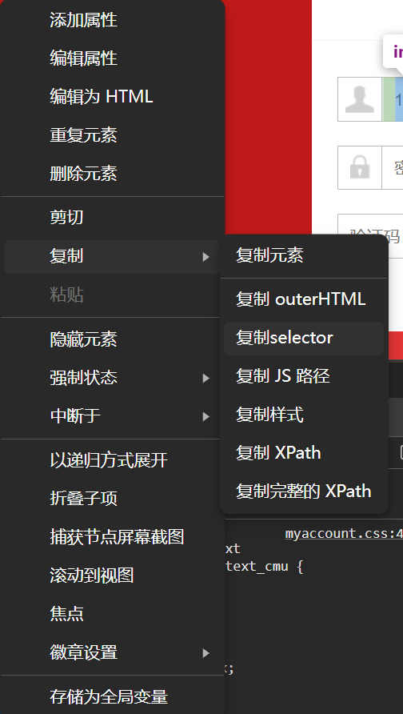

**判断测试是否成功使用断言：**

断言：一种检查机制，用于验证某个条件是否为真，条件为真则通过，为假则失败

assert condition,message

condition：需要验证的布尔表达式 为True断言通过 为False 抛出异常

message：断言失败的错误信息

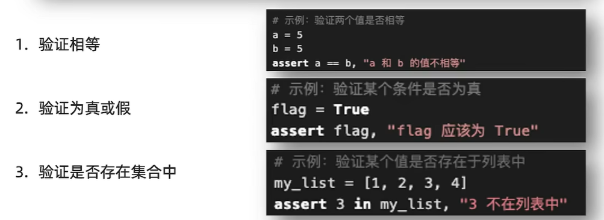

获取文本方法：

driver.find_element(By.CSS_SELECTOR,"value").text

捕获断言：

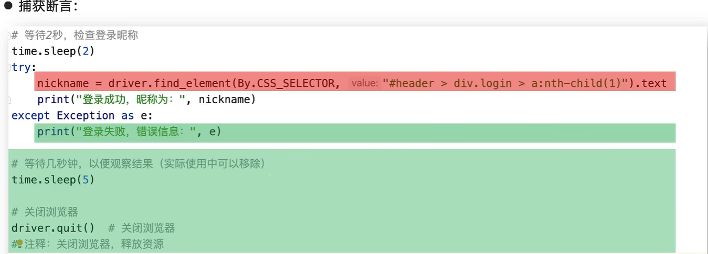

对于捕获需要断言，此时需要一个等待时间，否则反应速度可能会很快

```
#!/usr/bin/env python
# -*- coding: UTF-8 -*-
'''
@Author ：自然醒
@Version ：1.0
'''
from selenium import webdriver
from time import sleep
from selenium.webdriver.common.by import By as By

#启动浏览器 获取浏览器对象
edgeDriver = webdriver.Edge()
#打开首页
edgeDriver.get("https://hmshop-test.itheima.net/Home/user/login.html")
edgeDriver.maximize_window()
#输入用户名
username_input = edgeDriver.find_element(By.CSS_SELECTOR, "#username")
username_input.clear()
username_input.send_keys("15077583959")
#密码输入
password_input = edgeDriver.find_element(By.CSS_SELECTOR, "#password")
password_input.clear()
password_input.send_keys("Suke041230")
#验证码输入
verification_code_input = edgeDriver.find_element(By.CSS_SELECTOR, "#verify_code")
verification_code_input.clear()
verification_code_input.send_keys("8888")
#登录按钮点击
login_button = edgeDriver.find_element(By.CSS_SELECTOR, "#loginform > div > div.login_bnt > a")
login_button.click()
#断言检查用户登录成功
try:
    #捕获时需要等待 不然运行过快会捕获不到
    sleep(2)
    assert edgeDriver.find_element(By.CSS_SELECTOR, "body > div.tpshop-tm-hander.home-index-top.p > div > div > div > div.fl.islogin.hide > a.red.userinfo").text == "15077583959"
    print("登录成功")
except:
    print("登录失败")
#进行观测是否成功
sleep(4)
#释放资源
edgeDriver.quit()
```

**测试框架：**

Pytest

python第三方测试框架，用于单元测试、功能测试和集成测试

1.自动搜索测试用例

2.支持参数化测试，fixture等高级功能

3.详细的测试失败报告，便于调试

pytest以test_*.py开头，测试函数也是如此

这也是为什么能够自动搜索测试用例

fixture：pytest为测试提供可重用的代码功能，可以使用scope控制的作用域

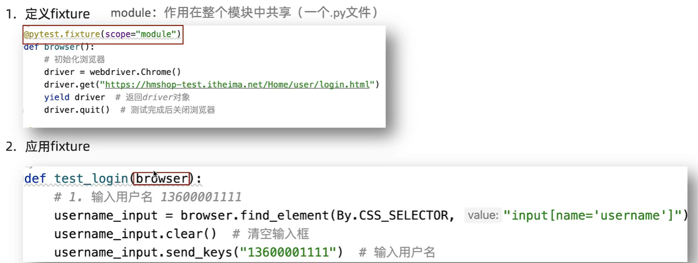

**测试报告的生成：**

pytest --alluredir=report 生成测试结果

allure serve report在线报告

Allure报告：生成直观、交互式的HTML测试报告

使用allure需要安装allure命令行工具 使用npm安装

测试报告的在线还需要java环境

## 主流技术

1.测试功能

2.自动化测试

3.接口测试

4.性能测试

**测试分类：**

按测试阶段分

1.单元测试，针对程序源码进行测试

2.集成测试（接口测试），针对模块之间访问地址进行测试

3.系统测试，对整个系统进行测试包括功能、兼容、文档等进行测试

4.验收测试，主要有内测、公测，使用不同人群发掘项目缺陷

按代码可见度划分

1.黑盒测试（系统测试），源代码不可见，UI功能可见

2.灰盒测试（接口测试），部分源码可见，功能不可见

3.白盒测试（单元测试），全部源码可见，UI不可见

## 测试用例

用例：用户使用的案例，模仿他们即可

测试用例：为测试项目设计的执行文档

测试用例作用：1.防止漏测 2.实施测试的标准

用例设计编写格式（八大要素）：

1.用例编号  2.用例标题  3.项目/模块

4.优先级  5.前置条件  6.测试步骤  7.测试数据

8.预期结果

用例编号：项目_模块_编号

用例标题：预期结果（测试点）

模块/项目：所属项目或模块

优先级：表示用例的重要程度或影响力P0~P4（P0最高）

前置条件：执行此条用例，有哪些前置条件

测试步骤：描述操作步骤

测试数据：操作对的数据

期望结果：期望达到的结果

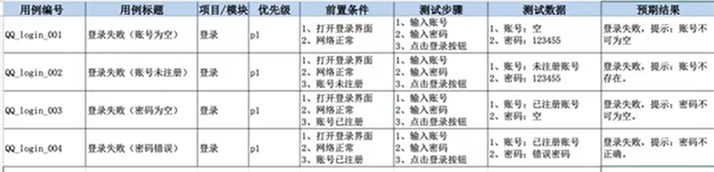

如何设计测试？设计测试用例？

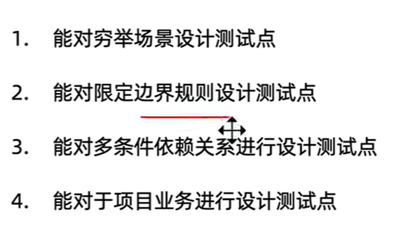

**等价类划分：**

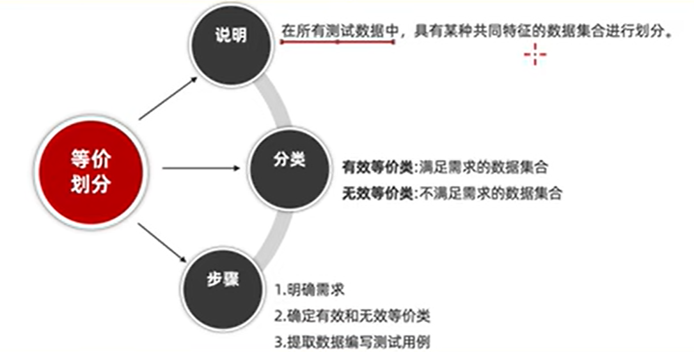

有效等价只取其一，无效等价只取其一

**等价类划分场景：**

针对需要有大量数据测试输入，但是没法穷举测试的地方

1.输入框  2.下拉列表   3.单选复选框

**边界值分析：**

边界范围节点：选取正好等于、刚好大于、刚好小于边界的值作为测试数据

- 上点：边界上的点(正好等于)
- 离点：距离上点最近的点(刚好大于、刚好小于) 开内闭外 开区间选择内部离点  闭区间选择外部离点
- 内点：范围内的点(区间范围内的数据) 

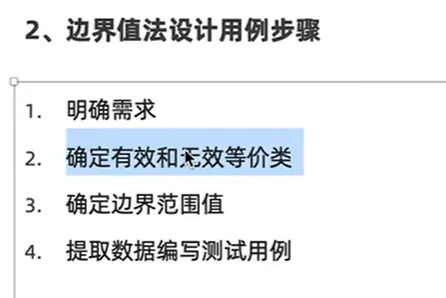

**判定表：**

考虑多个条件之间的各种组合、输入条件与输出结果之间有相互制约关系的测试

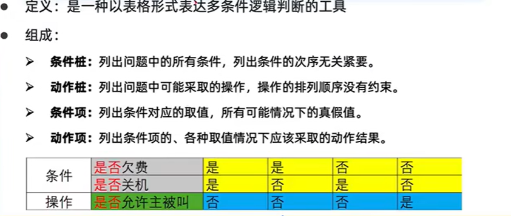

判定表中贯穿条件项和动作项的一列就是一条规则

假设有n个条件，每个条件的取值有两个(0,1)，全组合有2的n次方种规则

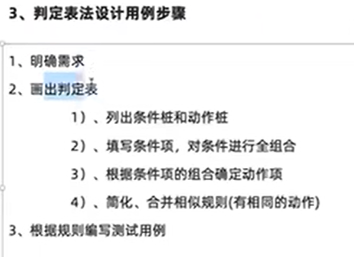

使用场景：

1.有多个输入条件，多个输出结果，输入条件之间有组合关系，输入条件和输出结果之间有依赖关系

2.判定表一般适用于条件组合数量较少的情况(4个条件以下)

**场景法：**

使用流程图描述业务走向

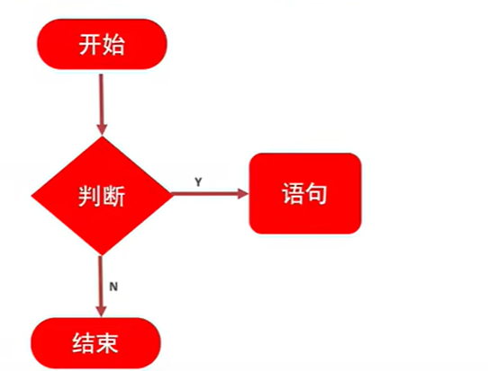

https://processon.com/

Windows工具:visio

**错误推荐法：**

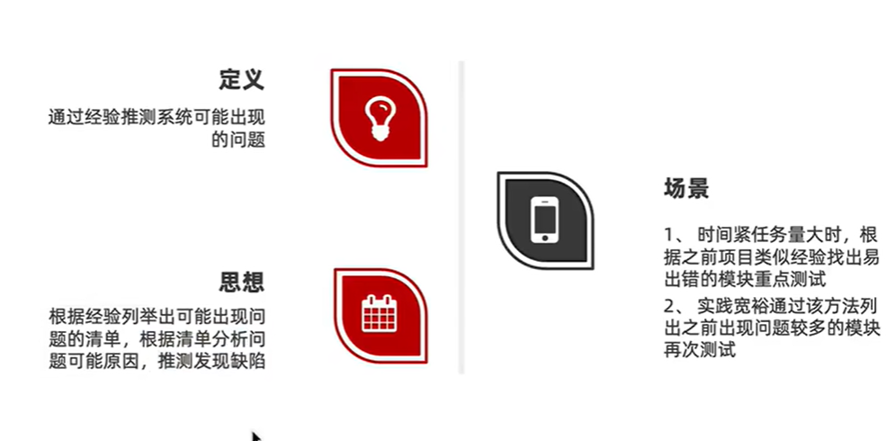

## 缺陷管理

软件使用过程中存在的任何问题都叫软件缺陷，bug

缺陷的判定标准：

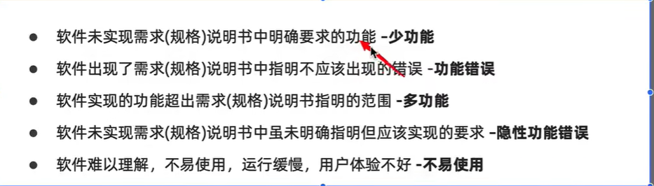

缺陷产生原因：

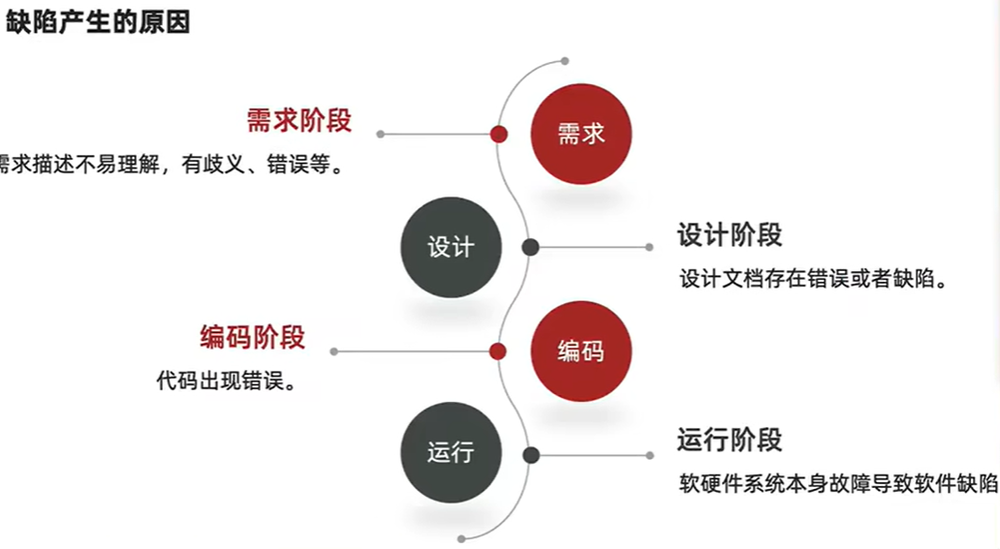

缺陷的生命周期：

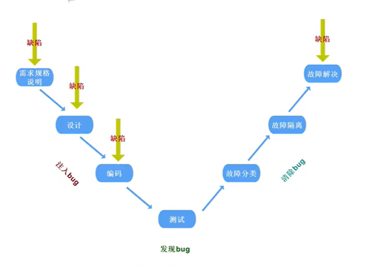

缺陷内容：

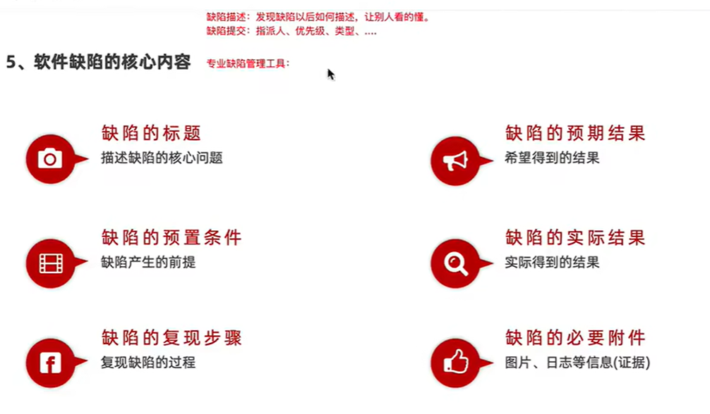

缺陷提交因素：

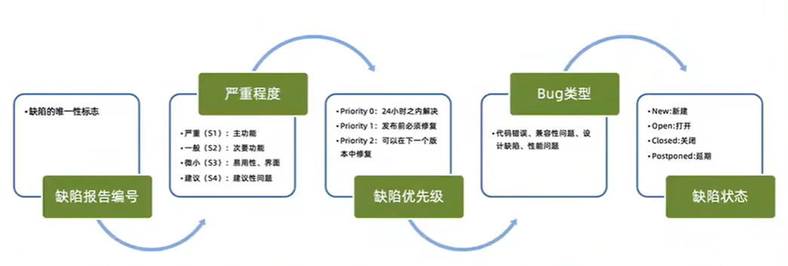

缺陷类型：

1.功能错误

2.界面（UI）错误

3.兼容性

4.数据

5.易用性

6.改进建议

7.架构


缺陷流程：

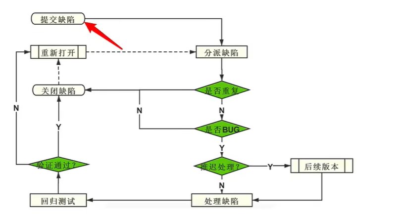

缺陷提交：

1.可重现（缺陷可以复现）  2.唯一性（一个缺陷上报一个问题）  3.规范性（符合要求）

禅道：https://demo.zentao.net/user-login.html

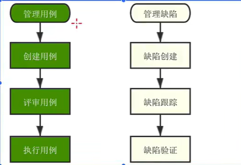

缺陷标题的描述：

1.描述测试数据+实际结果(预期结果)

2.测试数据描述+预期结果(实际结果)

3.测试数据描述+实际结果(需求)

## 接口测试

接口：系统或组件之间的交互点，通过交互点实现数据的交互


**接口类型：**

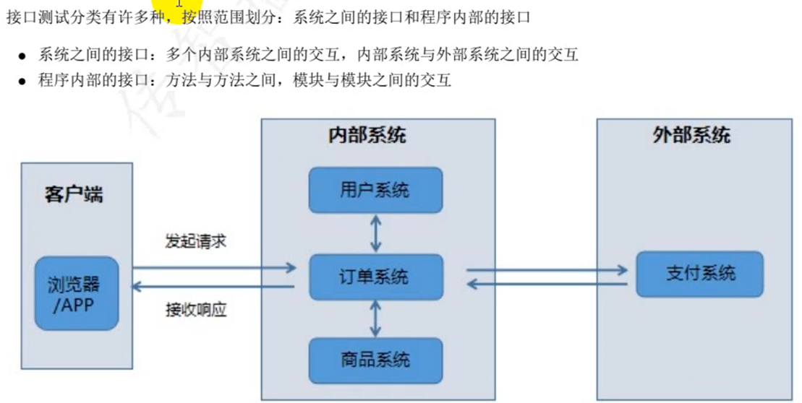

协议划分：http、tcp、ip

接口测试：

对系统或组件之间的接口进行测试，主要校验数据的交换、传递和控制管理过程，以及相互逻辑依赖关系

测试原理：

模拟客户端向服务端发送请求，服务器接收请求后进行相应的业务处理，并向客户端返回响应数据，检查响应数据是否符合预期

## HTTP协议

HTTP：超文本传输协议，一个基于请求与响应模式的、应用层的协议

特点：

1.支持客户端/服务器模式

2.简单快速  3.灵活  4.无连接  5.无状态

**URL格式：**

统一资源定位符，互联网上标准资源的地址

HTTP使用URL建立连接和传输数据

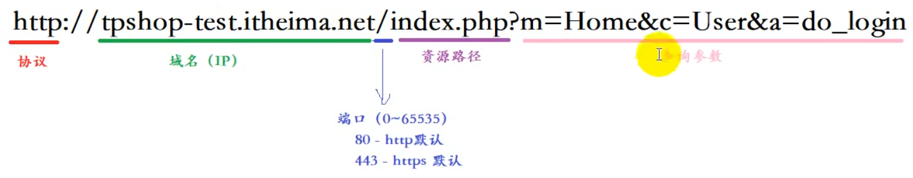

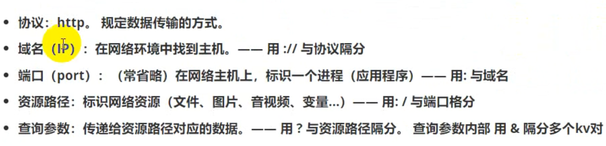

请求格式：

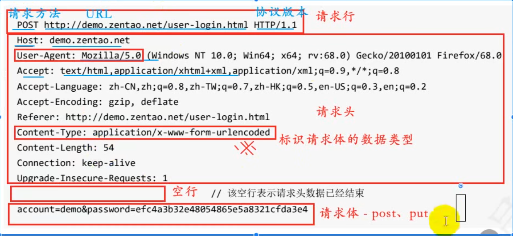


Fiddler抓包工具

请求头数据

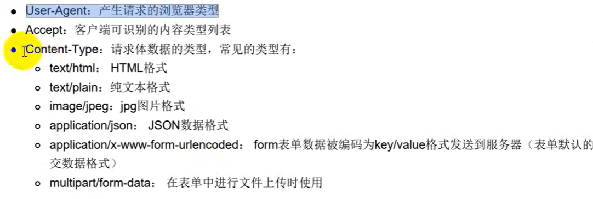

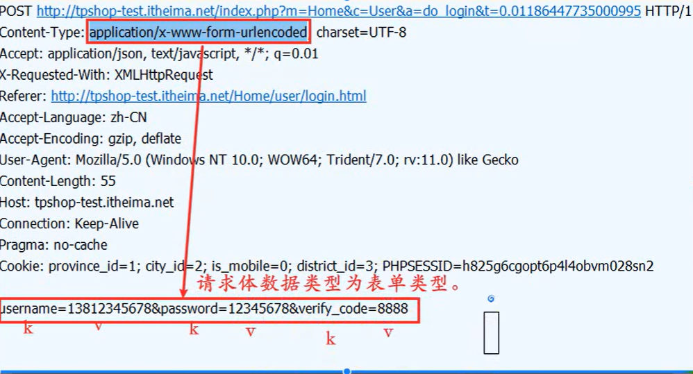

HTTP响应：

响应行（状态行）：协议版本（空格）状态码（空格）状态描述

响应头：k-v键值对

空行：响应头结束

响应体：大多数不为空


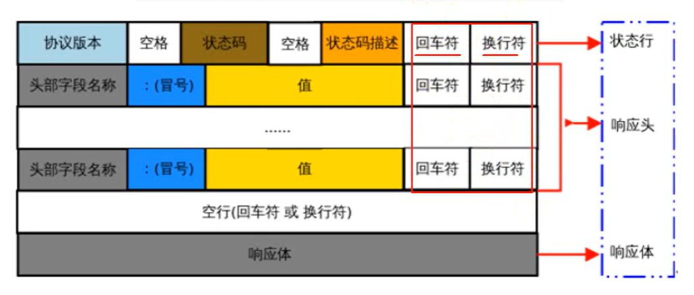


响应体大小：

Content-Length  可以不写 浏览器会自动求取 一般不写 因为写的话可能会写错 导致前端返回出错

## 接口

**传统风格接口：**

1.请求方法，只使用get和post即可

2.URL不唯一，同一个操作可对应不同的URL

3.状态码的使用单一，200最常见

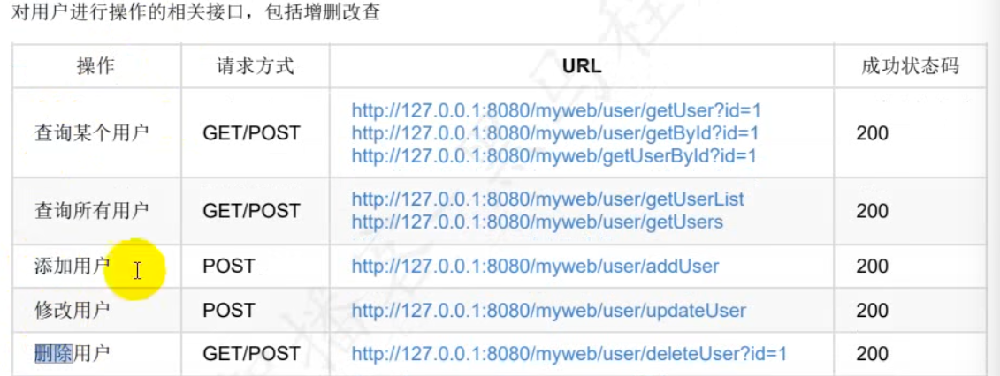

**RESTful风格接口：**

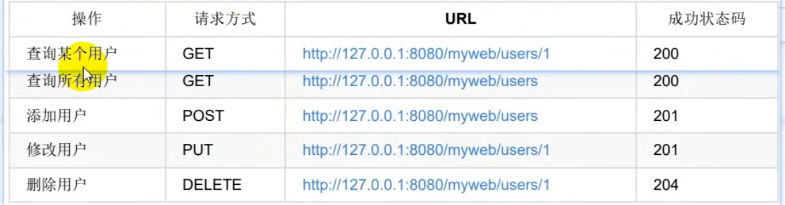

RESTful特点：

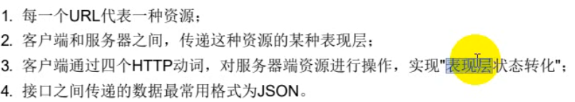

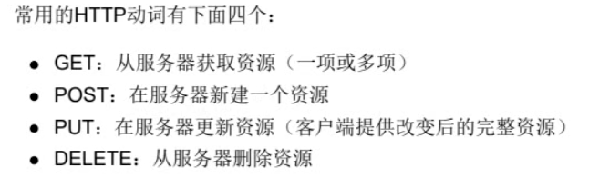

**接口测试流程：**

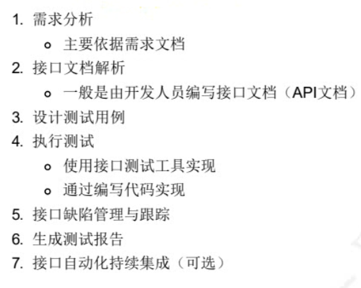

**测试点设计：**

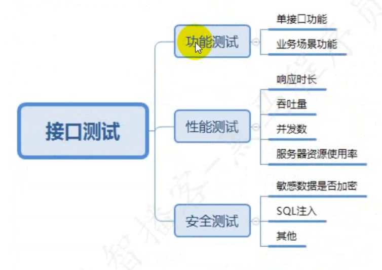

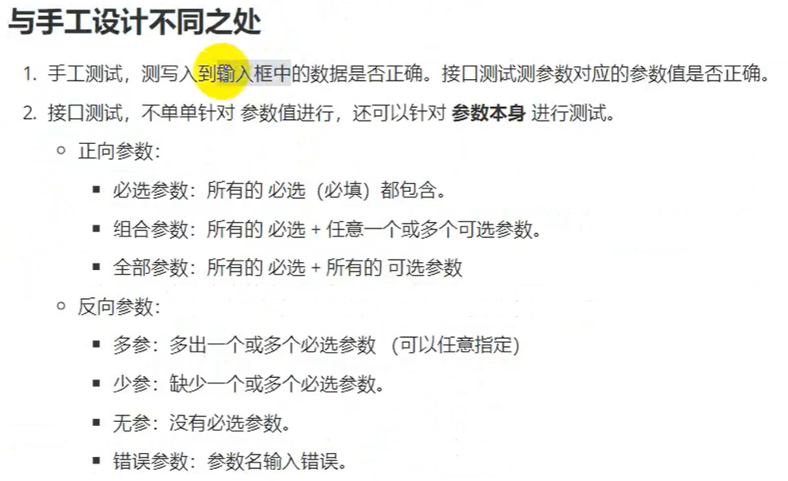

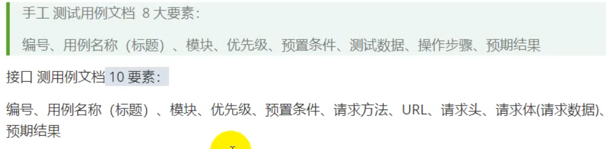

## Postman断言

借助javascript编写进行断言，写在Tests标签中

**常用响应断言状态码：**

Status code: Code is 200

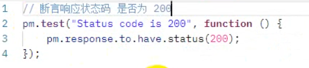

pm：代表postman的一个实例

test（）：pm的一个方法，两个参数

1.断言结束后，给出的文字提示

2.匿名函数

**断言响应体是否包含某个字符串：**

Response body:Constains string

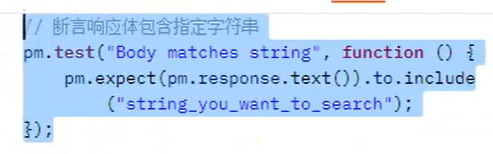

**断言响应体是否等于某个字符串（对象）：**

Response body:is equal to a string

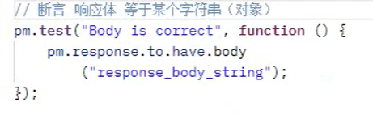

**断言JSON数据：**

Response body:JSON value check

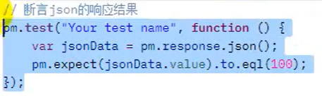

注意：jsonData.value对应的是key的value值

**断言响应头：**

Response headers:Content-Type header check


可以添加响应头中的key对应的value值，在后面加一个值即可

**断言工作原理：**


**全局变量与环境变量：**


**环境变量存在于三种环境：1、生产环境 2、开发环境 3、测试环境**

**请求前置脚本：**

发送接口测试的时候，第一时间被解析调用


**工作原理：**


**Postman关联：**

应用于多个http请求之间，有数据关联或依赖关系的


拿到第一个响应的接口去设置全局变量，于tests中编写脚本解析数据


参数化：从外部数据文件读取数据


**读取数据文件数据：**


## 性能测试


**性能：**

软件质量属性中的效率特性

效率特性：

1.时间特性（用户请求的响应时间）

2.资源特性（系统运行过程中系统资源的消耗情况如：CPU、内存、磁盘等）

**性能测试：**


**目的：**

1.评估当前系统能力

2.寻找性能瓶颈，优化性能

3.评估软件是否能够满足未来的需要

**功能测试与性能测试的区别：**


### 性能测试策略

**基准测试：**

狭义：单用户测试，对业务模型中的重要业务做单独的测试，获取单用户运行时的各性能指标，获取平均性能指标，获取的即为基准测试数据


**基准测试数据用途：**


**负载测试：**


慢慢叠加进行测试，直到最大负载量

**稳定性测试：**


**压力测试：**


**并发测试：**


### 性能测试指标

**指标：经过运算得到的结果，量化衡量操作的好坏**

**响应时间：**


**并发数：某一时刻同时向服务器发送请求的用户数**

**吞吐量：**


**点击数：**


web项目才有此指标

**错误率：**


**资源使用率：**


4

### 性能测试流程

**需求分析：**


**性能测试用例：**


**执行流程：**


## 性能工具

**Loadrunner**


**JMeter**


### JMeter


**汉化：**


### JMeter元件


**作用域的原则：**


同一作用域下，定时器早于取样器


### 线程组


